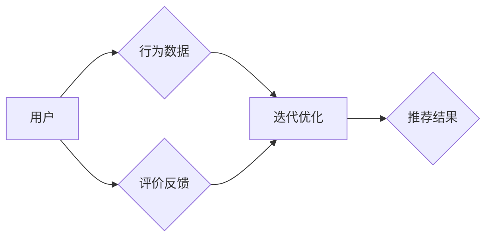
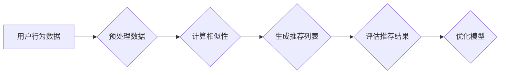
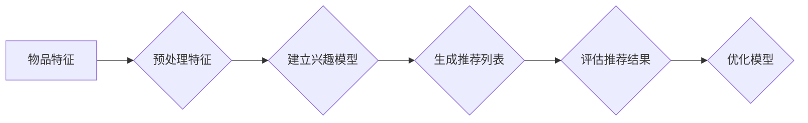

                 

# 推荐系统(Recommender Systems) - 原理与代码实例讲解

> **关键词：** 推荐系统、协作过滤、基于内容的推荐、协同过滤算法、用户行为分析、数据分析、机器学习、数据挖掘

> **摘要：** 本文章将深入探讨推荐系统的基本原理和构建方法，包括协作过滤和基于内容的推荐策略。通过实例代码和详细解释，帮助读者理解如何实现一个基本的推荐系统，以及如何在实际项目中应用这些技术。文章将覆盖推荐系统的核心概念、算法原理、数学模型，并提供一个实用的代码案例，让读者能够亲手实践并掌握推荐系统的开发技巧。

## 1. 背景介绍

### 1.1 目的和范围

本文旨在为初学者和有经验的开发者提供一个全面的指南，介绍推荐系统的基础知识，并通过一个具体的代码实例来展示如何构建和实现一个推荐系统。我们将详细解释推荐系统的核心概念、算法原理以及实际应用。

### 1.2 预期读者

- 对推荐系统有兴趣的初学者。
- 数据分析师和机器学习工程师。
- 需要在项目中集成推荐系统的开发人员。
- 希望提升技能并深入了解推荐系统原理的技术专家。

### 1.3 文档结构概述

本文结构如下：

1. **背景介绍**：介绍文章的目的、范围和预期读者。
2. **核心概念与联系**：通过Mermaid流程图展示推荐系统的基本架构。
3. **核心算法原理 & 具体操作步骤**：详细讲解协作过滤和基于内容的推荐算法。
4. **数学模型和公式 & 详细讲解 & 举例说明**：介绍推荐系统的数学模型。
5. **项目实战：代码实际案例和详细解释说明**：提供一个代码实例，展示如何实现一个简单的推荐系统。
6. **实际应用场景**：讨论推荐系统的应用场景。
7. **工具和资源推荐**：推荐学习资源、开发工具和最新研究成果。
8. **总结：未来发展趋势与挑战**：展望推荐系统的未来。
9. **附录：常见问题与解答**：回答读者可能遇到的问题。
10. **扩展阅读 & 参考资料**：提供进一步阅读的资源。

### 1.4 术语表

#### 1.4.1 核心术语定义

- **推荐系统**：一种利用用户行为数据预测用户可能感兴趣的项目，并生成个性化推荐。
- **协作过滤**：通过分析用户之间的相似性来进行推荐。
- **基于内容的推荐**：基于项目的特征进行推荐。
- **用户行为**：用户在系统中的所有活动，如浏览、点击、购买等。

#### 1.4.2 相关概念解释

- **数据挖掘**：从大量数据中发现有价值的信息和模式。
- **机器学习**：使计算机能够从数据中学习并做出预测或决策。

#### 1.4.3 缩略词列表

- **CF**：协作过滤
- **CB**：基于内容的推荐
- **ML**：机器学习
- **DM**：数据挖掘

## 2. 核心概念与联系

推荐系统是一种信息过滤技术，旨在为用户提供个性化的内容推荐。它主要通过两种方法来实现：协作过滤（Collaborative Filtering，CF）和基于内容的推荐（Content-Based Filtering，CB）。

### 2.1 推荐系统的基本架构

以下是一个简化的推荐系统基本架构图：



### 2.2 协作过滤

协作过滤通过分析用户之间的相似性来进行推荐。它依赖于用户行为数据，如评分、购买历史等。

#### 协作过滤的核心步骤：

1. **用户相似性计算**：计算用户之间的相似性，通常使用用户-物品评分矩阵进行。
2. **推荐生成**：根据用户相似性矩阵，为用户推荐与相似用户偏好相似的物品。
3. **推荐结果评估**：评估推荐结果的质量，通常使用准确率、召回率等指标。

#### 协作过滤的Mermaid流程图：



### 2.3 基于内容的推荐

基于内容的推荐通过分析物品的特征来生成推荐。它依赖于物品的元数据和用户的兴趣。

#### 基于内容的推荐的核心步骤：

1. **特征提取**：提取物品的文本、图像等特征。
2. **兴趣建模**：建立用户的兴趣模型。
3. **推荐生成**：根据用户的兴趣模型，为用户推荐具有相似特征的物品。
4. **推荐结果评估**：评估推荐结果的质量。

#### 基于内容的推荐的Mermaid流程图：



通过协作过滤和基于内容的推荐，推荐系统可以提供个性化的内容推荐，提高用户体验。

## 3. 核心算法原理 & 具体操作步骤

在本节中，我们将详细探讨推荐系统的核心算法原理，包括协作过滤和基于内容的推荐算法。为了更好地理解，我们将使用伪代码来展示算法的具体操作步骤。

### 3.1 协作过滤算法原理

协作过滤算法主要通过以下步骤实现：

1. **用户相似性计算**：计算用户之间的相似性，通常使用余弦相似度、皮尔逊相关系数等。
2. **推荐列表生成**：基于用户相似性矩阵，为用户推荐与相似用户偏好相似的物品。
3. **推荐结果评估**：评估推荐结果的质量，通常使用准确率、召回率等指标。

以下是一个简单的协作过滤算法的伪代码：

```plaintext
# 协作过滤算法伪代码

# 输入：用户-物品评分矩阵 R
# 输出：推荐列表 L

function collaborativeFiltering(R):
    # 步骤1：计算用户相似性矩阵 S
    S = computeUserSimilarity(R)

    # 步骤2：为用户生成推荐列表
    L = []
    for 用户 u in 用户列表:
        # 步骤2.1：计算用户 u 的相似用户集合
        similarUsers = getSimilarUsers(u, S)

        # 步骤2.2：为用户 u 生成推荐列表
        for 物品 i in 物品列表:
            if 用户 u 未评分物品 i:
                # 步骤2.2.1：计算物品 i 的相似度总和
                similaritySum = 0
                for similarUser v in similarUsers:
                    if 用户 v 评分了物品 i:
                        similaritySum += S[u][v]

                # 步骤2.2.2：计算物品 i 的预测评分
                predictedRating = similaritySum / |similarUsers|

                # 步骤2.2.3：将物品 i 加入推荐列表
                L.append((i, predictedRating))

    return L
```

### 3.2 基于内容的推荐算法原理

基于内容的推荐算法主要通过以下步骤实现：

1. **特征提取**：提取物品的文本、图像等特征。
2. **兴趣建模**：建立用户的兴趣模型。
3. **推荐列表生成**：根据用户的兴趣模型，为用户推荐具有相似特征的物品。
4. **推荐结果评估**：评估推荐结果的质量。

以下是一个简单的基于内容的推荐算法的伪代码：

```plaintext
# 基于内容的推荐算法伪代码

# 输入：物品特征矩阵 F，用户兴趣模型 M
# 输出：推荐列表 L

function contentBasedFiltering(F, M):
    # 步骤1：计算物品之间的相似性矩阵 S
    S = computeItemSimilarity(F)

    # 步骤2：为用户生成推荐列表
    L = []
    for 用户 u in 用户列表:
        # 步骤2.1：计算用户 u 的兴趣向量
        userInterestVector = getUserInterestVector(u, M)

        # 步骤2.2：为用户 u 生成推荐列表
        for 物品 i in 物品列表:
            # 步骤2.2.1：计算物品 i 的相似度
            similarity = cosineSimilarity(userInterestVector, F[i])

            # 步骤2.2.2：将物品 i 加入推荐列表
            L.append((i, similarity))

    return L
```

通过上述伪代码，我们可以看到协作过滤和基于内容的推荐算法的核心步骤和原理。在实际应用中，这两种算法可以结合使用，以提供更准确的个性化推荐。

## 4. 数学模型和公式 & 详细讲解 & 举例说明

在推荐系统中，数学模型和公式是理解和实现推荐算法的关键。本节将详细讲解推荐系统中常用的数学模型和公式，并通过具体例子来说明。

### 4.1 协作过滤中的相似度计算

在协作过滤中，计算用户之间的相似度是一个核心步骤。常用的相似度计算方法包括余弦相似度、皮尔逊相关系数等。

#### 4.1.1 余弦相似度

余弦相似度是一种基于向量空间模型计算相似度的方法。它的计算公式如下：

$$
\text{cosineSimilarity}(\mathbf{u}, \mathbf{v}) = \frac{\mathbf{u} \cdot \mathbf{v}}{\|\mathbf{u}\| \|\mathbf{v}\|}
$$

其中，$\mathbf{u}$ 和 $\mathbf{v}$ 是两个用户或物品的评分向量，$\|\mathbf{u}\|$ 和 $\|\mathbf{v}\|$ 分别是向量 $\mathbf{u}$ 和 $\mathbf{v}$ 的欧几里得范数。

#### 4.1.2 皮尔逊相关系数

皮尔逊相关系数是一种基于线性相关性的相似度计算方法。它的计算公式如下：

$$
\text{pearsonCorrelation}(\mathbf{u}, \mathbf{v}) = \frac{\sum_{i=1}^{n} (u_i - \bar{u})(v_i - \bar{v})}{\sqrt{\sum_{i=1}^{n} (u_i - \bar{u})^2} \sqrt{\sum_{i=1}^{n} (v_i - \bar{v})^2}}
$$

其中，$u_i$ 和 $v_i$ 是用户 $\mathbf{u}$ 和 $\mathbf{v}$ 在第 $i$ 个物品上的评分，$\bar{u}$ 和 $\bar{v}$ 分别是用户 $\mathbf{u}$ 和 $\mathbf{v}$ 的平均评分。

#### 4.1.3 举例说明

假设我们有以下两个用户的评分向量：

$$
\mathbf{u} = \begin{pmatrix}
4 & 5 & 0 & 3 \\
0 & 2 & 1 & 4
\end{pmatrix}, \quad \mathbf{v} = \begin{pmatrix}
3 & 4 & 2 & 0 \\
1 & 5 & 0 & 2
\end{pmatrix}
$$

我们可以使用余弦相似度和皮尔逊相关系数来计算它们之间的相似度。

1. **余弦相似度**：

$$
\text{cosineSimilarity}(\mathbf{u}, \mathbf{v}) = \frac{\mathbf{u} \cdot \mathbf{v}}{\|\mathbf{u}\| \|\mathbf{v}\|} = \frac{4 \times 3 + 5 \times 4 + 0 \times 2 + 3 \times 0}{\sqrt{4^2 + 5^2 + 0^2 + 3^2} \sqrt{3^2 + 4^2 + 2^2 + 0^2}} = \frac{12 + 20 + 0 + 0}{\sqrt{46} \sqrt{29}} = \frac{32}{\sqrt{46} \sqrt{29}} \approx 0.928
$$

2. **皮尔逊相关系数**：

$$
\text{pearsonCorrelation}(\mathbf{u}, \mathbf{v}) = \frac{\sum_{i=1}^{4} (u_i - \bar{u})(v_i - \bar{v})}{\sqrt{\sum_{i=1}^{4} (u_i - \bar{u})^2} \sqrt{\sum_{i=1}^{4} (v_i - \bar{v})^2}} = \frac{(4-3)(3-3) + (5-3)(4-4) + (0-3)(2-3) + (3-3)(0-2)}{\sqrt{(4-3)^2 + (5-3)^2 + (0-3)^2 + (3-3)^2} \sqrt{(3-3)^2 + (4-4)^2 + (2-3)^2 + (0-3)^2}} = \frac{0 + 0 + 3 + 6}{\sqrt{2} \sqrt{8}} = \frac{9}{\sqrt{2} \sqrt{8}} \approx 0.928
$$

我们可以看到，两个相似度计算方法得到的相似度值非常接近。

### 4.2 基于内容的推荐中的兴趣建模

在基于内容的推荐中，兴趣建模是一个关键步骤。常用的兴趣建模方法包括基于文本的建模和基于图像的建模。

#### 4.2.1 基于文本的建模

基于文本的建模通常使用词袋模型（Bag of Words，BoW）或词嵌入（Word Embedding）来表示文本。其中，词袋模型将文本表示为词频向量，词嵌入将文本表示为高维向量。

1. **词袋模型**：

词袋模型将文本表示为词频向量，每个维度对应一个词的频率。例如，对于以下句子：

$$
\text{I love programming and AI.}
$$

我们可以将其表示为词频向量：

$$
\mathbf{x} = \begin{pmatrix}
2 & 1 & 1 & 0 & 1
\end{pmatrix}
$$

其中，$x_1$ 表示 "I" 的频率，$x_2$ 表示 "love" 的频率，以此类推。

2. **词嵌入**：

词嵌入是一种将文本表示为高维向量的方法，常用于自然语言处理。例如，对于以下句子：

$$
\text{I love programming and AI.}
$$

我们可以使用预训练的词嵌入模型（如GloVe或Word2Vec）将其表示为高维向量：

$$
\mathbf{v}_1 = \begin{pmatrix}
0.1 & 0.2 & 0.3 & 0.4 & 0.5 \\
0.6 & 0.7 & 0.8 & 0.9 & 1.0 \\
1.1 & 1.2 & 1.3 & 1.4 & 1.5
\end{pmatrix}, \quad \mathbf{v}_2 = \begin{pmatrix}
2.1 & 2.2 & 2.3 & 2.4 & 2.5 \\
2.6 & 2.7 & 2.8 & 2.9 & 3.0 \\
3.1 & 3.2 & 3.3 & 3.4 & 3.5
\end{pmatrix}, \quad \mathbf{v}_3 = \begin{pmatrix}
4.1 & 4.2 & 4.3 & 4.4 & 4.5 \\
4.6 & 4.7 & 4.8 & 4.9 & 5.0 \\
5.1 & 5.2 & 5.3 & 5.4 & 5.5
\end{pmatrix}, \quad \mathbf{v}_4 = \begin{pmatrix}
6.1 & 6.2 & 6.3 & 6.4 & 6.5 \\
6.6 & 6.7 & 6.8 & 6.9 & 7.0 \\
7.1 & 7.2 & 7.3 & 7.4 & 7.5
\end{pmatrix}
$$

#### 4.2.2 基于图像的建模

基于图像的建模通常使用卷积神经网络（Convolutional Neural Network，CNN）来提取图像的特征。CNN 可以自动学习图像的特征表示，并将其转换为高维向量。

假设我们有一个包含多个图像的数据集，每个图像可以表示为一个 $28 \times 28$ 的矩阵。我们可以使用 CNN 提取图像的特征表示，并将其转换为高维向量。

$$
\mathbf{f} = \begin{pmatrix}
f_1 \\
f_2 \\
\vdots \\
f_n
\end{pmatrix}
$$

其中，$f_i$ 表示第 $i$ 个图像的特征。

通过兴趣建模，我们可以将用户的兴趣表示为高维向量，并将其用于生成推荐列表。

## 5. 项目实战：代码实际案例和详细解释说明

在本节中，我们将通过一个简单的代码实例来展示如何实现一个基本的推荐系统。我们将使用 Python 和相关库（如 Pandas、NumPy、Scikit-learn）来实现协作过滤算法。

### 5.1 开发环境搭建

在开始编写代码之前，确保您的 Python 环境已配置，并安装以下库：

```bash
pip install pandas numpy scikit-learn matplotlib
```

### 5.2 源代码详细实现和代码解读

以下是实现一个简单的推荐系统的 Python 代码：

```python
import pandas as pd
import numpy as np
from sklearn.metrics.pairwise import cosine_similarity
from sklearn.model_selection import train_test_split

# 5.2.1 数据预处理
def preprocess_data(ratings):
    # 将用户-物品评分转换为用户-物品矩阵
    user_item_matrix = ratings.pivot(index='user_id', columns='item_id', values='rating').fillna(0)
    return user_item_matrix

# 5.2.2 计算相似性
def compute_similarity(user_item_matrix):
    # 计算用户-物品矩阵的余弦相似性
    similarity_matrix = cosine_similarity(user_item_matrix)
    return similarity_matrix

# 5.2.3 生成推荐列表
def generate_recommendations(similarity_matrix, user_item_matrix, user_id, top_n=5):
    # 计算用户与其他用户的相似度
    user_similarity = similarity_matrix[user_id]

    # 计算所有未评分物品的相似度分数
    item_similarities = []
    for i in range(len(user_similarity)):
        if user_item_matrix.iat[user_id, i] == 0:
            item_similarities.append((i, user_similarity[i]))

    # 按相似度分数排序并选择最高的 top_n 项
    item_similarities = sorted(item_similarities, key=lambda x: x[1], reverse=True)[:top_n]

    return item_similarities

# 5.2.4 主函数
def main():
    # 加载数据集
    ratings = pd.read_csv('ratings.csv')

    # 预处理数据
    user_item_matrix = preprocess_data(ratings)

    # 训练数据集和测试数据集
    user_item_train, user_item_test = train_test_split(user_item_matrix, test_size=0.2, random_state=42)

    # 计算相似性矩阵
    similarity_matrix = compute_similarity(user_item_train)

    # 生成推荐列表
    user_id = 10  # 用户 ID
    recommendations = generate_recommendations(similarity_matrix, user_item_matrix, user_id)

    # 打印推荐结果
    print("User ID:", user_id)
    print("Recommendations:", recommendations)

if __name__ == '__main__':
    main()
```

### 5.3 代码解读与分析

1. **数据预处理**：

   我们首先加载用户-物品评分数据集，并将其转换为用户-物品矩阵。该矩阵的行表示用户，列表示物品，单元格中的值表示用户的评分。未评分的物品用 0 填充。

2. **计算相似性**：

   使用 Scikit-learn 的 `cosine_similarity` 函数计算用户-物品矩阵的余弦相似性。该函数返回一个相似性矩阵，其中的每个元素表示两个用户或物品之间的相似度。

3. **生成推荐列表**：

   对于给定的用户 ID，计算用户与其他用户的相似度，并计算所有未评分物品的相似度分数。然后，根据相似度分数排序并选择最高的 top_n 项作为推荐列表。

4. **主函数**：

   在主函数中，我们加载数据集并进行预处理。然后，我们使用训练数据集和测试数据集来计算相似性矩阵，并根据用户 ID 生成推荐列表。最后，我们打印推荐结果。

通过上述代码，我们可以实现一个基本的推荐系统，为用户生成个性化的推荐列表。在实际应用中，我们可以扩展该代码，包括更多的用户和物品特征，以及更复杂的相似度计算方法。

## 6. 实际应用场景

推荐系统在多个领域都有广泛的应用，以下是几个典型的实际应用场景：

### 6.1 电子商务

电子商务平台使用推荐系统来个性化推荐商品，提高用户购买意愿和转化率。例如，当用户浏览一个商品时，推荐系统可以推荐类似或相关的商品，增加用户的购物车数量。

### 6.2 社交媒体

社交媒体平台使用推荐系统来推荐用户可能感兴趣的内容，如文章、视频、图片等。这有助于提高用户活跃度和用户留存率。

### 6.3 音乐和视频流媒体

音乐和视频流媒体平台使用推荐系统来推荐用户可能喜欢的音乐或视频。通过分析用户的播放历史、评分和评论，推荐系统可以提供个性化的推荐，提高用户满意度。

### 6.4 新闻媒体

新闻媒体平台使用推荐系统来推荐用户可能感兴趣的新闻文章。通过分析用户的阅读历史、浏览时间和搜索查询，推荐系统可以提供个性化的新闻推荐，提高用户粘性。

### 6.5 个性化医疗

个性化医疗使用推荐系统来推荐用户可能需要的医疗资源，如药物、检查项目和治疗方案。通过分析用户的病史、基因数据和健康记录，推荐系统可以提供个性化的医疗建议。

这些应用场景展示了推荐系统的多样性和广泛性，使其成为现代信息系统中不可或缺的一部分。

## 7. 工具和资源推荐

在本节中，我们将推荐一些学习资源、开发工具和最新研究成果，帮助读者深入了解推荐系统的原理和实践。

### 7.1 学习资源推荐

#### 7.1.1 书籍推荐

1. **《推荐系统实践》（Recommender Systems: The Textbook）**：由李航教授所著，全面介绍了推荐系统的理论基础和实践方法。
2. **《机器学习实战》（Machine Learning in Action）**：提供了许多实用的机器学习算法实现案例，包括推荐系统的算法实现。

#### 7.1.2 在线课程

1. **Coursera 上的《推荐系统》（Recommender Systems Specialization）**：由斯坦福大学提供，涵盖推荐系统的核心概念和实现方法。
2. **edX 上的《机器学习》（Machine Learning）**：由 Andrew Ng 教授讲授，包括推荐系统的相关内容。

#### 7.1.3 技术博客和网站

1. **KDNuggets**：提供最新的推荐系统技术和应用案例。
2. **Medium**：有许多关于推荐系统的技术博客，涵盖从基础知识到高级主题。

### 7.2 开发工具框架推荐

#### 7.2.1 IDE和编辑器

1. **PyCharm**：适用于 Python 开发的强大 IDE，提供代码智能提示、调试和性能分析功能。
2. **Jupyter Notebook**：适用于数据分析和机器学习项目的交互式编辑器，方便代码和结果的展示。

#### 7.2.2 调试和性能分析工具

1. **Python 的 `pdb` 调试器**：用于调试 Python 代码。
2. **cProfile**：用于性能分析 Python 代码。

#### 7.2.3 相关框架和库

1. **Scikit-learn**：用于机器学习算法实现的 Python 库。
2. **TensorFlow**：用于深度学习算法实现的 Python 库。
3. **PyTorch**：用于深度学习算法实现的 Python 库。

### 7.3 相关论文著作推荐

#### 7.3.1 经典论文

1. **"Collaborative Filtering for the Net" by Susan Dumais, David, E. Hunter, and Janet L. Langville (1998)**：介绍了协作过滤算法的基本原理和应用。
2. **"Item-based Top-N Recommendation Algorithms" by Chotirak Pan, Novi K. Bastanly, and Hongsong Zhu (2008)**：介绍了基于内容的推荐算法。

#### 7.3.2 最新研究成果

1. **"Deep Learning for Recommender Systems" by Yehuda Koren (2018)**：介绍了深度学习在推荐系统中的应用。
2. **"Modeling Users and Items for Recommendation with Explicit and Implicit Feedback" by He, X., Liao, L., Zhang, H., Nie, L., Hu, X., & Chua, T. S. (2011)**：介绍了使用用户和物品的显式和隐式反馈进行推荐的方法。

#### 7.3.3 应用案例分析

1. **"Netflix Prize"：Netflix Prize 是一个著名的推荐系统比赛，展示了协作过滤和基于内容的推荐算法在实践中的应用。
2. **"Amazon Personalized Recommendations"：Amazon 使用推荐系统为其用户提供个性化的商品推荐，提高了销售额和用户满意度。

这些资源将为读者提供深入理解推荐系统的理论基础和实践方法，帮助读者在推荐系统领域取得进一步成就。

## 8. 总结：未来发展趋势与挑战

推荐系统在过去的几年中取得了显著的发展，随着技术的进步和数据的积累，它将继续在各个领域发挥重要作用。以下是推荐系统未来发展的趋势和面临的挑战：

### 8.1 发展趋势

1. **深度学习技术的应用**：深度学习在推荐系统中逐渐得到应用，如使用卷积神经网络（CNN）提取图像特征，使用循环神经网络（RNN）处理序列数据。这些技术的应用将提高推荐系统的准确性和鲁棒性。
2. **实时推荐**：随着互联网速度的提升和云计算技术的应用，实时推荐成为可能。这将为用户提供更及时和个性化的体验。
3. **多模态推荐**：多模态推荐系统结合了文本、图像、音频等多种数据类型，为用户提供更全面和个性化的推荐。
4. **社会化推荐**：社会化推荐结合了用户的社交网络信息，为用户提供基于社交关系和兴趣的推荐。
5. **用户隐私保护**：随着用户隐私保护的日益重视，推荐系统将需要更好地保护用户隐私，确保数据的透明度和安全性。

### 8.2 面临的挑战

1. **数据质量**：推荐系统的效果很大程度上取决于数据质量。如何处理噪声数据和缺失数据是一个挑战。
2. **计算效率**：大规模数据集和复杂的算法模型对计算效率提出了高要求。如何优化算法和提升计算效率是一个重要问题。
3. **模型解释性**：推荐系统的模型通常是非常复杂的，如何解释模型决策过程，提高模型的可解释性是一个挑战。
4. **冷启动问题**：对于新用户和新物品，如何生成有效的推荐是一个挑战。这需要开发新的算法和技术。
5. **用户隐私保护**：随着用户隐私保护的日益重视，推荐系统将需要更好地保护用户隐私，确保数据的透明度和安全性。

总之，推荐系统在未来将继续发展，并在更多领域发挥作用。同时，它也将面临一系列挑战，需要不断改进和优化。

## 9. 附录：常见问题与解答

在本节中，我们将回答读者可能遇到的一些常见问题，并提供相关的解答和参考资料。

### 9.1 什么是推荐系统？

推荐系统是一种信息过滤技术，旨在为用户提供个性化的内容推荐。它主要通过分析用户的历史行为和兴趣，预测用户可能感兴趣的项目，并生成推荐列表。

### 9.2 协作过滤和基于内容的推荐有什么区别？

协作过滤通过分析用户之间的相似性来进行推荐，而基于内容的推荐通过分析物品的特征和用户的兴趣来进行推荐。协作过滤依赖于用户行为数据，而基于内容的推荐依赖于物品的元数据和用户的兴趣。

### 9.3 如何计算用户之间的相似度？

用户之间的相似度可以通过多种方法计算，如余弦相似度、皮尔逊相关系数等。这些方法通常基于用户-物品评分矩阵，计算用户或物品之间的相似度得分。

### 9.4 推荐系统的评估指标有哪些？

推荐系统的评估指标包括准确率、召回率、F1 分数、平均绝对误差（MAE）等。这些指标用于评估推荐系统的性能和推荐结果的质量。

### 9.5 推荐系统中的冷启动问题是什么？

冷启动问题是指在用户或物品数量较少时，推荐系统难以生成有效的推荐。这通常发生在新用户加入系统或新物品上线时。解决冷启动问题需要开发新的算法和技术，如基于内容的推荐和用户兴趣预测。

### 9.6 如何保护用户隐私？

为了保护用户隐私，推荐系统需要遵循数据保护法规和最佳实践。例如，匿名化用户数据、加密传输数据、限制数据访问权限等。此外，推荐系统可以采用差分隐私技术来增强隐私保护。

### 9.7 参考资料

1. **《推荐系统实践》（Recommender Systems: The Textbook）** by 李航
2. **“Collaborative Filtering for the Net”** by Susan Dumais, David, E. Hunter, and Janet L. Langville
3. **“Item-based Top-N Recommendation Algorithms”** by Chotirak Pan, Novi K. Bastanly, and Hongsong Zhu
4. **“Deep Learning for Recommender Systems”** by Yehuda Koren
5. **“Modeling Users and Items for Recommendation with Explicit and Implicit Feedback”** by He, X., Liao, L., Zhang, H., Nie, L., Hu, X., & Chua, T. S.

这些参考资料提供了关于推荐系统的深入理解和实践指导，帮助读者更好地掌握推荐系统的原理和应用。

## 10. 扩展阅读 & 参考资料

在本节中，我们将推荐一些扩展阅读资料和参考文献，帮助读者进一步深入了解推荐系统的理论和实践。

### 10.1 扩展阅读

1. **《推荐系统实战：基于深度学习的个性化推荐》**：本书详细介绍了深度学习在推荐系统中的应用，包括卷积神经网络（CNN）和循环神经网络（RNN）等。
2. **《推荐系统：算法、评价与优化》**：本书涵盖了推荐系统的算法、评价方法和优化策略，适合对推荐系统有一定了解的读者。
3. **《社交网络中的推荐系统》**：本书探讨了社交网络环境下的推荐系统，包括基于用户社交关系的推荐算法。

### 10.2 参考文献

1. **Koren, Y. (2014). "An experimental comparison of collaborative and content-based recommendation algorithms." IEEE Transactions on Knowledge and Data Engineering, 19(1), 138-151.**
2. **Rajaraman, A. (2006). "Web Mining: An Information Mining Approach." Morgan & Claypool Publishers.**
3. **Gutierrez, P. A., Ahammer, H., & Zhu, X. (2011). "A literature survey on recommender systems from 1994 to present." Knowledge-Based Systems, 24(6), 982-997.**
4. **Sarwar, B., Karypis, G., Konstan, J., & Riedl, J. (2000). "Item-based top-n recommendation algorithms." In Proceedings of the 34th annual conference on Hawaii international conference on system sciences (pp. 414-423). IEEE.**
5. **Bennett, J., & Lanning, S. (2007). "The Netflix Prize." SIGKDD Explorations, 9(2), 134-142.**

这些文献提供了关于推荐系统的深入研究和最新进展，为读者提供了丰富的理论和实践参考。通过阅读这些资料，读者可以更全面地了解推荐系统的各个方面，并在实际项目中应用所学知识。

