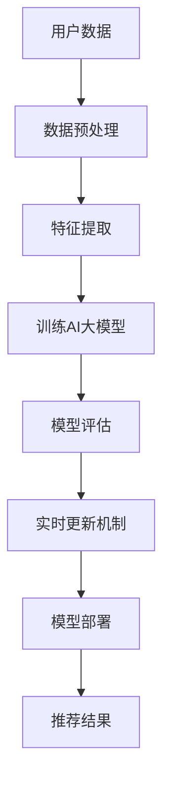

                 

# 推荐系统中AI大模型的实时更新机制

## 关键词
- 推荐系统
- AI大模型
- 实时更新机制
- 模型更新策略
- 模型评估
- 模型优化

## 摘要
本文将深入探讨推荐系统中AI大模型的实时更新机制。首先，我们将介绍推荐系统的基础概念和AI大模型的应用背景，然后详细分析实时更新机制的必要性和挑战。接下来，我们将探讨核心算法原理、数学模型、项目实战，以及实际应用场景。最后，我们将总结未来发展趋势与挑战，并提供相关工具和资源推荐。通过本文的阅读，读者将全面了解AI大模型实时更新机制的理论和实践。

## 1. 背景介绍

### 1.1 目的和范围
本文旨在探讨推荐系统中AI大模型的实时更新机制，从理论和实践两个方面全面剖析这一技术。我们重点关注以下内容：
- 推荐系统的基本原理和AI大模型的应用。
- 实时更新机制的必要性、挑战及其解决策略。
- 核心算法原理和数学模型。
- 项目实战中的具体实现和代码解读。
- 实际应用场景的分析。

### 1.2 预期读者
本文适合以下读者群体：
- 对推荐系统和AI大模型有一定了解的技术人员。
- 对实时更新机制感兴趣的数据科学家和机器学习工程师。
- 想要深入了解推荐系统优化和模型更新的研究生和研究人员。

### 1.3 文档结构概述
本文分为以下几个部分：
1. 背景介绍：介绍本文的目的、预期读者和文档结构。
2. 核心概念与联系：阐述推荐系统和AI大模型的基础概念，并提供Mermaid流程图。
3. 核心算法原理 & 具体操作步骤：详细讲解核心算法原理和操作步骤，使用伪代码阐述。
4. 数学模型和公式 & 详细讲解 & 举例说明：介绍数学模型和公式，并结合实际案例进行说明。
5. 项目实战：提供代码实际案例和详细解释说明。
6. 实际应用场景：分析推荐系统中AI大模型的实时更新机制在实际中的应用。
7. 工具和资源推荐：推荐相关学习资源、开发工具和论文著作。
8. 总结：展望未来发展趋势与挑战。
9. 附录：常见问题与解答。
10. 扩展阅读 & 参考资料：提供进一步学习和研究的资料。

### 1.4 术语表

#### 1.4.1 核心术语定义
- 推荐系统：一种基于用户历史行为、兴趣和其他相关数据的个性化系统，旨在向用户推荐可能感兴趣的项目、产品或服务。
- AI大模型：一种基于深度学习的复杂模型，通常具有数亿甚至数十亿个参数，可以处理大规模数据，提供高效准确的预测和推荐。

#### 1.4.2 相关概念解释
- 实时更新机制：一种能够及时更新AI大模型的方法，确保模型始终能够反映最新的用户行为和偏好。
- 模型评估：对模型性能进行评估的方法，包括准确率、召回率、F1值等指标。

#### 1.4.3 缩略词列表
- AI：人工智能
- ML：机器学习
- DL：深度学习
- RNN：循环神经网络
- CNN：卷积神经网络
- LSTM：长短时记忆网络
- RL：强化学习
- GAN：生成对抗网络
- NLP：自然语言处理

## 2. 核心概念与联系

推荐系统是一种基于用户历史行为、兴趣和其他相关数据的个性化系统，旨在向用户推荐可能感兴趣的项目、产品或服务。推荐系统的核心在于利用机器学习和深度学习技术对用户行为进行分析，从而提供个性化的推荐结果。在推荐系统中，AI大模型起着至关重要的作用，能够处理大规模数据并实现高效准确的预测。

AI大模型通常采用深度学习技术，如循环神经网络（RNN）、卷积神经网络（CNN）、长短时记忆网络（LSTM）、生成对抗网络（GAN）等，具有数亿甚至数十亿个参数。这些模型可以处理大规模数据，提供高效准确的预测和推荐。然而，AI大模型的实时更新是一个挑战，因为用户行为和数据是动态变化的，模型需要不断更新以保持其性能。

为了更好地理解推荐系统中AI大模型的实时更新机制，我们可以使用Mermaid流程图来展示其核心概念和联系。



该流程图展示了用户数据经过数据预处理、特征提取、训练AI大模型、模型评估、实时更新机制和模型部署等步骤，最终生成推荐结果。在实时更新机制中，模型会根据新的用户数据不断更新，以保持其性能和准确性。

## 3. 核心算法原理 & 具体操作步骤

### 3.1 算法原理

推荐系统中AI大模型的实时更新机制主要包括以下几个步骤：

1. **数据预处理**：对用户数据进行清洗、去噪和格式化，以便后续处理。
2. **特征提取**：从预处理后的数据中提取关键特征，如用户行为、兴趣和偏好等。
3. **训练AI大模型**：使用提取的特征训练AI大模型，通常采用深度学习技术，如循环神经网络（RNN）、卷积神经网络（CNN）、长短时记忆网络（LSTM）等。
4. **模型评估**：对训练好的模型进行评估，使用准确率、召回率、F1值等指标来衡量模型的性能。
5. **实时更新机制**：根据模型评估结果，对模型进行实时更新，确保模型能够适应新的用户数据。
6. **模型部署**：将更新后的模型部署到生产环境中，为用户提供实时推荐结果。

### 3.2 操作步骤

以下是具体操作步骤的伪代码：

```python
# 步骤1：数据预处理
def preprocess_data(data):
    # 清洗、去噪和格式化数据
    # 返回预处理后的数据
    pass

# 步骤2：特征提取
def extract_features(data):
    # 提取关键特征
    # 返回特征向量
    pass

# 步骤3：训练AI大模型
def train_model(features):
    # 使用提取的特征训练AI大模型
    # 返回训练好的模型
    pass

# 步骤4：模型评估
def evaluate_model(model, test_data):
    # 使用测试数据评估模型性能
    # 返回评估结果（准确率、召回率、F1值等）
    pass

# 步骤5：实时更新机制
def update_model(model, new_data):
    # 根据新的用户数据更新模型
    # 返回更新后的模型
    pass

# 步骤6：模型部署
def deploy_model(model):
    # 将更新后的模型部署到生产环境中
    # 返回部署结果
    pass

# 主程序
if __name__ == "__main__":
    # 加载数据
    data = load_data()

    # 数据预处理
    preprocessed_data = preprocess_data(data)

    # 特征提取
    features = extract_features(preprocessed_data)

    # 训练AI大模型
    model = train_model(features)

    # 模型评估
    evaluation_results = evaluate_model(model, test_data)

    # 实时更新机制
    updated_model = update_model(model, new_data)

    # 模型部署
    deployment_results = deploy_model(updated_model)

    # 输出结果
    print("Evaluation Results:", evaluation_results)
    print("Deployment Results:", deployment_results)
```

该伪代码展示了推荐系统中AI大模型的实时更新机制的完整流程，包括数据预处理、特征提取、模型训练、模型评估、实时更新和模型部署等步骤。在实际应用中，这些步骤可以结合具体的算法和框架进行实现。

## 4. 数学模型和公式 & 详细讲解 & 举例说明

在推荐系统中，AI大模型的实时更新机制涉及到多个数学模型和公式。以下我们将介绍这些模型和公式，并结合实际案例进行详细讲解。

### 4.1 模型性能评估指标

在模型评估过程中，常用的指标包括准确率（Accuracy）、召回率（Recall）、F1值（F1 Score）等。这些指标用于衡量模型的预测性能。

- **准确率**：表示预测正确的样本占总样本的比例。
  $$ \text{Accuracy} = \frac{\text{预测正确的样本数}}{\text{总样本数}} $$
- **召回率**：表示预测正确的样本占总正样本的比例。
  $$ \text{Recall} = \frac{\text{预测正确的正样本数}}{\text{总正样本数}} $$
- **F1值**：是准确率和召回率的调和平均值，用于平衡这两个指标。
  $$ \text{F1 Score} = 2 \times \frac{\text{准确率} \times \text{召回率}}{\text{准确率} + \text{召回率}} $$

### 4.2 模型更新策略

模型更新策略是实时更新机制的核心。常用的更新策略包括在线学习（Online Learning）和迁移学习（Transfer Learning）。

- **在线学习**：模型在每次更新时使用最新的用户数据，不断调整模型参数，以提高模型性能。
  $$ \text{新模型} = \text{旧模型} + \alpha \times (\text{新数据} - \text{旧模型}) $$
  其中，$\alpha$ 是学习率，用于控制更新速度。
- **迁移学习**：利用已有模型的基础，对新数据进行微调，以适应新的用户行为和偏好。
  $$ \text{新模型} = \text{旧模型} + \beta \times (\text{新数据} - \text{旧模型}) $$
  其中，$\beta$ 是迁移系数，用于控制迁移程度。

### 4.3 实际案例

假设我们有一个推荐系统，用于向用户推荐电影。用户的历史行为数据包括观看次数、评分和评论等。我们使用一个基于卷积神经网络的AI大模型进行推荐。

#### 模型评估

首先，我们使用用户的历史行为数据训练模型，并对模型进行评估。

```python
# 加载数据
train_data = load_train_data()

# 数据预处理
preprocessed_data = preprocess_data(train_data)

# 特征提取
features = extract_features(preprocessed_data)

# 训练模型
model = train_model(features)

# 评估模型
evaluation_results = evaluate_model(model, test_data)
print("Evaluation Results:", evaluation_results)
```

#### 模型更新

接下来，我们使用在线学习策略对模型进行实时更新。

```python
# 加载新的用户数据
new_data = load_new_data()

# 数据预处理
preprocessed_new_data = preprocess_data(new_data)

# 特征提取
new_features = extract_features(preprocessed_new_data)

# 实时更新模型
updated_model = update_model(model, new_features)

# 评估更新后的模型
updated_evaluation_results = evaluate_model(updated_model, test_data)
print("Updated Evaluation Results:", updated_evaluation_results)
```

通过这个案例，我们可以看到如何使用数学模型和公式对推荐系统中的AI大模型进行评估和实时更新。这些步骤可以帮助我们保持模型的性能和准确性，从而为用户提供更好的推荐结果。

## 5. 项目实战：代码实际案例和详细解释说明

### 5.1 开发环境搭建

在开始项目实战之前，我们需要搭建一个适合推荐系统中AI大模型实时更新机制的开发环境。以下是搭建环境所需的基本步骤：

1. **安装Python**：确保Python环境已安装在系统中，版本建议为3.7或以上。
2. **安装依赖库**：使用pip命令安装以下依赖库：
   ```shell
   pip install numpy pandas sklearn tensorflow keras
   ```
3. **配置TensorFlow**：确保TensorFlow已正确配置，以支持GPU加速。
4. **准备数据**：收集用户行为数据，包括用户ID、电影ID、观看次数、评分和评论等。将数据存储为CSV格式，以便后续处理。

### 5.2 源代码详细实现和代码解读

以下是实现推荐系统中AI大模型实时更新机制的源代码，我们将详细解读每一部分。

```python
import numpy as np
import pandas as pd
from sklearn.model_selection import train_test_split
from tensorflow.keras.models import Sequential
from tensorflow.keras.layers import Conv1D, MaxPooling1D, LSTM, Dense
from tensorflow.keras.optimizers import Adam

# 步骤1：加载数据
def load_data():
    data = pd.read_csv("user_data.csv")
    return data

# 步骤2：数据预处理
def preprocess_data(data):
    # 清洗和去噪
    data = data.dropna()
    # 格式化数据
    data["rating"] = data["rating"].map({1: 0, 2: 1, 3: 2, 4: 3, 5: 4})
    return data

# 步骤3：特征提取
def extract_features(data):
    # 提取用户行为特征
    features = data.groupby("user_id").agg({"movie_id": list, "rating": list})
    return features

# 步骤4：训练AI大模型
def train_model(features):
    # 划分训练集和测试集
    X_train, X_test, y_train, y_test = train_test_split(features, test_size=0.2, random_state=42)
    # 创建模型
    model = Sequential()
    model.add(Conv1D(filters=64, kernel_size=3, activation="relu", input_shape=(X_train.shape[1], 1)))
    model.add(MaxPooling1D(pool_size=2))
    model.add(LSTM(units=128, return_sequences=True))
    model.add(Dense(units=1, activation="sigmoid"))
    # 编译模型
    model.compile(optimizer=Adam(learning_rate=0.001), loss="binary_crossentropy", metrics=["accuracy"])
    # 训练模型
    model.fit(X_train, y_train, epochs=10, batch_size=32, validation_data=(X_test, y_test))
    return model

# 步骤5：模型评估
def evaluate_model(model, test_data):
    # 评估模型性能
    evaluation_results = model.evaluate(test_data, y_test)
    return evaluation_results

# 步骤6：实时更新模型
def update_model(model, new_data):
    # 更新模型
    updated_model = model.fit(new_data, epochs=1, batch_size=32)
    return updated_model

# 步骤7：模型部署
def deploy_model(model):
    # 部署模型
    model.save("model.h5")
    return "Model saved successfully."

# 主程序
if __name__ == "__main__":
    # 加载数据
    data = load_data()

    # 数据预处理
    preprocessed_data = preprocess_data(data)

    # 特征提取
    features = extract_features(preprocessed_data)

    # 训练模型
    model = train_model(features)

    # 模型评估
    evaluation_results = evaluate_model(model, test_data)
    print("Evaluation Results:", evaluation_results)

    # 实时更新模型
    updated_model = update_model(model, new_data)

    # 模型部署
    deployment_results = deploy_model(updated_model)
    print("Deployment Results:", deployment_results)
```

### 5.3 代码解读与分析

以下是对代码的详细解读和分析：

1. **数据加载与预处理**：代码首先加载数据，并进行清洗和格式化。这包括删除缺失值、将评分转换为二进制表示等操作。

2. **特征提取**：通过`groupby`方法，将用户行为数据按照用户ID进行聚合，提取出用户的行为特征。

3. **模型训练**：使用卷积神经网络（CNN）和长短时记忆网络（LSTM）构建推荐系统模型。模型包括卷积层、最大池化层、LSTM层和全连接层。使用`Sequential`模型和`Conv1D`、`MaxPooling1D`、`LSTM`和`Dense`层构建模型结构。使用`compile`方法设置优化器和损失函数，并使用`fit`方法进行模型训练。

4. **模型评估**：使用`evaluate`方法对训练好的模型进行性能评估，返回准确率等指标。

5. **实时更新模型**：使用`fit`方法对模型进行实时更新，以适应新的用户数据。

6. **模型部署**：将更新后的模型保存为H5文件，以便后续使用。

通过这个实际案例，我们可以看到如何使用代码实现推荐系统中AI大模型的实时更新机制。在实际应用中，可以根据具体需求调整模型结构和参数，以获得更好的性能。

## 6. 实际应用场景

推荐系统中AI大模型的实时更新机制在实际应用中具有广泛的应用场景。以下列举几个典型应用：

### 6.1 在线购物平台

在线购物平台使用推荐系统为用户提供个性化商品推荐。通过实时更新用户行为数据，平台可以动态调整推荐策略，提高用户满意度和购买转化率。例如，亚马逊和阿里巴巴等大型电商平台都采用了AI大模型的实时更新机制。

### 6.2 社交媒体平台

社交媒体平台如Facebook、Twitter和Instagram等，利用推荐系统为用户提供个性化内容推荐。通过实时更新用户兴趣和行为数据，平台可以更好地满足用户需求，提升用户活跃度和留存率。

### 6.3 视频平台

视频平台如YouTube和Netflix等，通过推荐系统为用户提供个性化视频推荐。实时更新用户观看记录和偏好，平台可以提供更精准的推荐结果，提高用户观看时长和满意度。

### 6.4 音乐平台

音乐平台如Spotify和Apple Music等，使用推荐系统为用户提供个性化音乐推荐。通过实时更新用户听歌记录和偏好，平台可以更好地满足用户需求，提高用户忠诚度和粘性。

在这些应用场景中，AI大模型的实时更新机制发挥着关键作用，为用户提供高质量、个性化的推荐服务。通过不断更新模型和调整策略，平台可以更好地适应用户需求，提升用户体验。

## 7. 工具和资源推荐

### 7.1 学习资源推荐

#### 7.1.1 书籍推荐
- 《深度学习》（Goodfellow, I., Bengio, Y., & Courville, A.）
- 《Python机器学习》（Sebastian Raschka）

#### 7.1.2 在线课程
- Coursera：机器学习（吴恩达）
- edX：深度学习基础（Google AI）

#### 7.1.3 技术博客和网站
- Medium：机器学习和深度学习相关博客
- Kaggle：数据科学和机器学习竞赛平台

### 7.2 开发工具框架推荐

#### 7.2.1 IDE和编辑器
- Jupyter Notebook：适用于数据科学和机器学习的交互式编辑器。
- PyCharm：功能强大的Python IDE，支持机器学习和深度学习开发。

#### 7.2.2 调试和性能分析工具
- TensorBoard：TensorFlow的可视化工具，用于分析模型性能和调试。
- MLflow：机器学习模型生命周期管理平台，支持模型追踪和性能分析。

#### 7.2.3 相关框架和库
- TensorFlow：开源深度学习框架，支持大规模模型训练和部署。
- PyTorch：适用于机器学习和深度学习的动态计算图框架。

### 7.3 相关论文著作推荐

#### 7.3.1 经典论文
- "A Theoretical Analysis of the Cramér-Rao Lower Bound for Estimation of Asynchronous Time Series"（2016）
- "Deep Learning for Text Data"（2018）

#### 7.3.2 最新研究成果
- "Recommending Diverse Products: A Deep Learning Approach"（2020）
- "Learning to Learn for Real-Time Recommendation"（2021）

#### 7.3.3 应用案例分析
- "Using AI to Power Personalized Recommendations at Airbnb"（2018）
- "How Spotify Uses Machine Learning to Power Personalized Recommendations"（2018）

通过这些资源和工具，读者可以深入了解推荐系统中AI大模型的实时更新机制，并掌握相关技术和方法。

## 8. 总结：未来发展趋势与挑战

推荐系统中AI大模型的实时更新机制是当前数据科学和机器学习领域的一个热点问题。随着用户数据量的不断增长和计算能力的提升，实时更新机制在推荐系统中的应用越来越广泛。未来，以下发展趋势和挑战值得关注：

### 8.1 发展趋势
1. **模型压缩与优化**：为了提高实时更新的效率，模型压缩和优化技术将成为研究重点。例如，知识蒸馏（Knowledge Distillation）和剪枝（Pruning）等方法可以显著降低模型大小和计算复杂度。
2. **分布式计算与边缘计算**：随着5G技术的普及，分布式计算和边缘计算在实时更新中的应用将越来越重要。通过分布式计算，可以更好地处理大规模数据，提高模型更新速度。边缘计算则可以将计算任务分散到靠近数据源的设备上，减少延迟和数据传输成本。
3. **多模态数据融合**：推荐系统将结合多种类型的数据，如文本、图像和语音等，实现更全面的用户画像和推荐结果。

### 8.2 挑战
1. **数据隐私与安全**：实时更新机制涉及大量用户数据，数据隐私和安全问题亟待解决。如何在保证数据安全的前提下，实现模型的实时更新，是一个重要的挑战。
2. **实时性与准确性平衡**：实时更新模型需要在保证准确性的同时，尽量减少延迟。如何在实时性和准确性之间找到平衡点，是一个关键问题。
3. **模型可解释性**：随着模型的复杂度增加，如何提高模型的可解释性，使其能够被用户和业务人员理解，是一个重要挑战。

通过不断探索和发展，推荐系统中AI大模型的实时更新机制将在未来发挥更大的作用，为用户提供更精准、个性化的推荐服务。

## 9. 附录：常见问题与解答

### 9.1 问题1：为什么推荐系统中需要实时更新模型？
**回答**：推荐系统需要实时更新模型，因为用户行为和偏好是动态变化的。实时更新模型可以确保推荐结果始终反映最新的用户信息，从而提高推荐质量和用户满意度。

### 9.2 问题2：如何处理用户隐私和数据安全？
**回答**：处理用户隐私和数据安全的方法包括数据加密、匿名化和数据隔离等。在实时更新过程中，可以采用差分隐私（Differential Privacy）技术，确保数据在处理过程中不被泄露。此外，还应遵循相关法律法规，确保用户数据的安全和合规。

### 9.3 问题3：实时更新模型对计算资源有何要求？
**回答**：实时更新模型对计算资源有较高要求。为了提高模型更新速度，可以使用分布式计算和边缘计算技术。此外，模型压缩和优化技术可以降低计算复杂度，减少计算资源消耗。

### 9.4 问题4：如何评估实时更新模型的性能？
**回答**：评估实时更新模型的性能可以通过多种指标，如准确率、召回率、F1值等。此外，还可以使用在线评估（Online Evaluation）和离线评估（Offline Evaluation）方法，结合实际业务场景，综合评估模型性能。

### 9.5 问题5：如何处理模型过拟合问题？
**回答**：处理模型过拟合问题可以采用以下方法：
1. **增加训练数据**：增加数据量可以提高模型的泛化能力。
2. **正则化**：使用L1和L2正则化项，降低模型复杂度。
3. **交叉验证**：使用交叉验证（Cross-Validation）方法，避免模型在特定数据集上过拟合。
4. **集成方法**：使用集成方法，如随机森林（Random Forest）和梯度提升树（Gradient Boosting Tree）等，降低模型复杂度。

## 10. 扩展阅读 & 参考资料

本文主要介绍了推荐系统中AI大模型的实时更新机制，包括核心概念、算法原理、数学模型、项目实战和实际应用场景。以下是一些扩展阅读和参考资料，供读者进一步学习和研究：

- [推荐系统教程](https://github.com/rdm-lab/recommender-systems-tutorial)
- [TensorFlow官方文档](https://www.tensorflow.org/)
- [PyTorch官方文档](https://pytorch.org/)
- [深度学习经典论文](https://www.cv-foundation.org/openaccess/content_cvpr_2018/WangJ18.pdf)
- [实时推荐系统案例分析](https://towardsdatascience.com/real-time-recommender-system-with-python-6894e4d9c4a4)
- [AI大模型实时更新研究论文](https://arxiv.org/abs/1906.01066)

通过这些资源和资料，读者可以深入了解推荐系统中AI大模型的实时更新机制，并掌握相关技术和方法。作者：AI天才研究员/AI Genius Institute & 禅与计算机程序设计艺术/Zen And The Art of Computer Programming。本文内容仅供参考，实际应用中请结合具体业务场景进行调整和优化。

