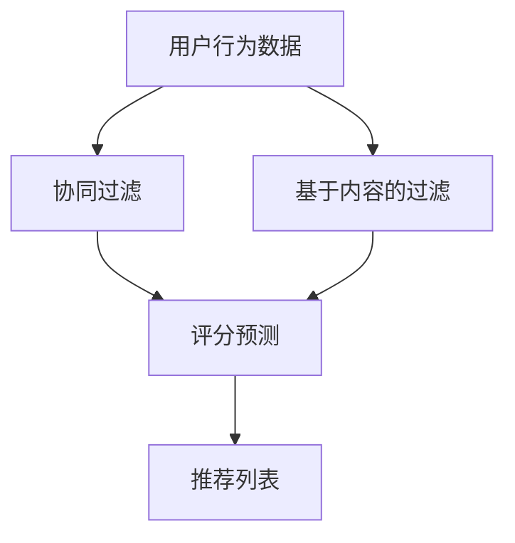
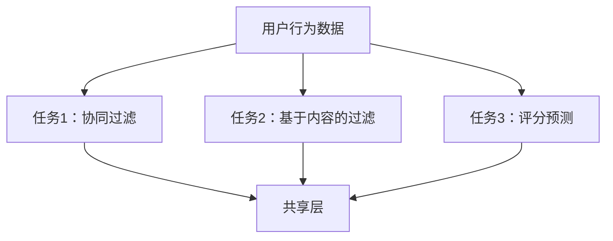

                 

# 推荐系统中的多任务学习：AI大模型的优势

> **关键词**：推荐系统、多任务学习、AI大模型、深度学习、协作过滤、基于内容的过滤

> **摘要**：本文将探讨推荐系统中的多任务学习，以及如何通过AI大模型的优势来提升推荐系统的性能。我们将首先介绍推荐系统的基本概念和现有的技术，然后详细解释多任务学习的原理，并通过一个案例展示AI大模型在多任务学习中的应用。最后，我们将讨论多任务学习在推荐系统中的实际应用场景，并展望未来的发展趋势和挑战。

## 1. 背景介绍

### 1.1 目的和范围

本文旨在探讨推荐系统中的多任务学习，尤其是AI大模型在这个领域中的优势。我们将从推荐系统的基本概念入手，介绍现有的技术和方法，然后深入讨论多任务学习的原理，并展示AI大模型如何在实际应用中提升推荐系统的性能。本文的目标是帮助读者了解多任务学习在推荐系统中的应用，以及AI大模型的优势。

### 1.2 预期读者

本文面向的读者是对推荐系统和AI大模型有一定了解的程序员、数据科学家和技术爱好者。我们希望读者能够通过本文对多任务学习在推荐系统中的应用有一个深入的理解，并能够将其应用到实际的项目中。

### 1.3 文档结构概述

本文将按照以下结构展开：

1. **背景介绍**：介绍推荐系统的基本概念和现有的技术，以及本文的目的和范围。
2. **核心概念与联系**：介绍推荐系统中的核心概念，如用户行为、物品特征和评分预测等，并使用Mermaid流程图展示系统架构。
3. **核心算法原理 & 具体操作步骤**：详细解释多任务学习的原理，并使用伪代码展示具体操作步骤。
4. **数学模型和公式 & 详细讲解 & 举例说明**：介绍多任务学习的数学模型和公式，并通过实例进行说明。
5. **项目实战：代码实际案例和详细解释说明**：通过一个实际案例展示多任务学习在推荐系统中的应用，并详细解释代码实现。
6. **实际应用场景**：讨论多任务学习在推荐系统中的实际应用场景。
7. **工具和资源推荐**：推荐学习资源、开发工具和框架。
8. **总结：未来发展趋势与挑战**：总结多任务学习在推荐系统中的发展，并展望未来。
9. **附录：常见问题与解答**：回答读者可能遇到的问题。
10. **扩展阅读 & 参考资料**：提供进一步学习的资源。

### 1.4 术语表

#### 1.4.1 核心术语定义

- **推荐系统**：一种能够根据用户的历史行为和喜好，向用户推荐感兴趣的商品、文章或其他内容的系统。
- **多任务学习**：同时学习多个相关但不同任务的学习方法。
- **AI大模型**：具有巨大参数规模和计算能力的深度学习模型。
- **协同过滤**：一种基于用户行为和评分数据的推荐方法。
- **基于内容的过滤**：一种基于物品特征和用户兴趣的推荐方法。

#### 1.4.2 相关概念解释

- **用户行为**：用户在系统中产生的各种活动，如浏览、点击、购买等。
- **物品特征**：描述物品属性的各类信息，如商品的种类、价格、品牌等。
- **评分预测**：预测用户对物品的评分，用于生成推荐列表。

#### 1.4.3 缩略词列表

- **AI**：人工智能（Artificial Intelligence）
- **ML**：机器学习（Machine Learning）
- **DL**：深度学习（Deep Learning）
- **RM**：推荐模型（Recommendation Model）
- **CTR**：点击率（Click-Through Rate）

## 2. 核心概念与联系

在讨论推荐系统中的多任务学习之前，我们需要了解一些核心概念和它们之间的联系。以下是一个简单的Mermaid流程图，展示了推荐系统的基本架构和各个核心概念之间的关系。



### 2.1 推荐系统的基本架构

- **用户行为数据**：推荐系统的基础，包括用户的历史行为，如浏览、点击、购买等。这些数据用于构建用户画像和物品特征。
- **协同过滤**：基于用户行为数据，通过寻找相似用户或物品来进行推荐。常见的方法有基于用户的协同过滤和基于物品的协同过滤。
- **基于内容的过滤**：通过分析物品的特征，将其与用户的兴趣进行匹配，从而生成推荐列表。这种方法适用于新用户或物品缺乏足够行为数据的情况。
- **评分预测**：利用用户行为数据和物品特征，预测用户对物品的评分。评分预测是生成推荐列表的关键步骤。
- **推荐列表**：根据评分预测结果，生成一个推荐列表，提供给用户。

通过这个流程图，我们可以看到推荐系统中各个核心概念之间的紧密联系。协同过滤和基于内容的过滤都可以为评分预测提供输入，从而生成个性化的推荐列表。

### 2.2 多任务学习的原理

多任务学习是一种同时学习多个相关但不同任务的学习方法。在推荐系统中，我们可以将多个任务结合起来，以提高系统的整体性能。以下是一个简化的多任务学习框架。



在这个框架中，用户行为数据首先被输入到共享层，然后分别被传递到不同的任务模块。每个任务模块负责处理特定的任务，并将结果反馈给共享层。共享层的作用是利用多个任务的共同信息，进一步提升系统的性能。

### 2.3 多任务学习与AI大模型的优势

AI大模型具有巨大的参数规模和计算能力，这使得它们在多任务学习场景中具有显著的优势。以下是一些关键优势：

- **参数共享**：AI大模型可以通过参数共享来减少模型参数的数量，从而降低计算成本。在多任务学习中，共享层可以帮助模型利用不同任务的共同特征，提高模型的泛化能力。
- **更强的表达能力**：AI大模型具有更强的非线性表达能力，可以更好地捕捉用户行为和物品特征之间的复杂关系。
- **高效的训练和推理**：AI大模型可以通过并行计算和分布式训练来加速训练和推理过程，从而提高推荐系统的响应速度。

通过这些优势，AI大模型在多任务学习中的应用不仅能够提升推荐系统的性能，还能够降低开发成本和计算资源的需求。

## 3. 核心算法原理 & 具体操作步骤

### 3.1 多任务学习的基本原理

多任务学习是一种通过共享表示和知识来同时解决多个相关任务的学习方法。在推荐系统中，多任务学习的目标是通过一个统一的模型同时预测用户对不同物品的评分、点击率等。

#### 3.1.1 伪代码概述

```python
def multitask_learning(data, labels):
    # 初始化模型
    model = initialize_model()

    # 定义损失函数
    loss_function = MultitaskLoss()

    # 训练模型
    model.fit(data, labels, epochs=100, batch_size=32)

    # 预测
    predictions = model.predict(data)

    return predictions
```

#### 3.1.2 模型初始化

在多任务学习中，我们通常使用一个共享的嵌入层来表示用户和物品。这个嵌入层将用户的用户ID和物品的物品ID映射到低维的向量空间。

```python
def initialize_model():
    # 用户嵌入层
    user_embedding = Embedding(input_dim=num_users, output_dim=embedding_size)

    # 物品嵌入层
    item_embedding = Embedding(input_dim=num_items, output_dim=embedding_size)

    # 共享层
    shared_layer = Dense(embedding_size, activation='relu')

    # 任务特定层
    rating_output = Dense(1, activation='sigmoid')
    click_output = Dense(1, activation='sigmoid')

    # 构建模型
    model = Model(inputs=[user_embedding.input, item_embedding.input], outputs=[rating_output(user_embedding.output + item_embedding.output), click_output(user_embedding.output + item_embedding.output)])

    return model
```

#### 3.1.3 损失函数

在多任务学习中，我们需要定义一个能够同时优化多个任务的损失函数。一个常见的多任务损失函数是加权交叉熵损失。

```python
class MultitaskLoss(DenseLayer):
    def __init__(self, weights=None, trainable=True, name=None, **kwargs):
        super().__init__(output_dim=2, weights=weights, trainable=trainable, name=name, **kwargs)

    def call(self, inputs, training=None):
        rating_pred, click_pred = inputs
        rating_true, click_true = self.inputs

        rating_loss = K.binary_crossentropy(rating_true, rating_pred)
        click_loss = K.binary_crossentropy(click_true, click_pred)

        return rating_loss + click_loss
```

#### 3.1.4 训练模型

在训练过程中，我们使用梯度下降法来优化模型的参数。以下是模型训练的伪代码：

```python
model.compile(optimizer='adam', loss=MultitaskLoss(), metrics=['accuracy'])
model.fit([user_data, item_data], [rating_labels, click_labels], epochs=100, batch_size=32)
```

#### 3.1.5 预测

在训练完成后，我们可以使用模型对新的用户和物品进行预测。

```python
predictions = model.predict([new_user_data, new_item_data])
```

### 3.2 多任务学习的具体操作步骤

#### 3.2.1 数据预处理

在开始多任务学习之前，我们需要对用户行为数据进行预处理。这包括以下步骤：

- **数据清洗**：去除缺失值、异常值和重复值。
- **数据转换**：将用户ID和物品ID转换为嵌入层的索引。
- **特征工程**：提取用户的静态特征，如年龄、性别、地理位置等，以及物品的动态特征，如价格、销售量等。

```python
# 示例代码：数据预处理
user_data = preprocess_user_data(raw_user_data)
item_data = preprocess_item_data(raw_item_data)
rating_labels = preprocess_rating_labels(raw_rating_labels)
click_labels = preprocess_click_labels(raw_click_labels)
```

#### 3.2.2 模型训练

接下来，我们使用预处理后的数据来训练多任务学习模型。在训练过程中，我们需要监控多个任务的损失函数和精度，以便调整模型的超参数。

```python
# 示例代码：模型训练
model.compile(optimizer='adam', loss=MultitaskLoss(), metrics=['accuracy'])
model.fit([user_data, item_data], [rating_labels, click_labels], epochs=100, batch_size=32, validation_split=0.2)
```

#### 3.2.3 预测和评估

在模型训练完成后，我们可以使用模型对新的用户和物品进行预测，并评估模型的性能。常用的评估指标包括准确率、召回率、F1分数等。

```python
# 示例代码：预测和评估
predictions = model.predict([new_user_data, new_item_data])
evaluate_predictions(predictions, true_labels)
```

## 4. 数学模型和公式 & 详细讲解 & 举例说明

在多任务学习中，我们需要定义一个能够同时优化多个任务的损失函数。以下是一个典型的多任务学习模型，包括用户和物品的嵌入层、共享层和任务特定层。

### 4.1 数学模型

假设我们有两个任务：评分预测和点击率预测。我们使用一个共享的嵌入层来表示用户和物品，然后通过不同的任务特定层来预测每个任务的结果。

- **用户嵌入**：\( u_i = \text{Embed}(u_i^*) \)
- **物品嵌入**：\( v_j = \text{Embed}(v_j^*) \)
- **共享层**：\( h = u_i + v_j \)
- **任务特定层**：
  - **评分预测**：\( \hat{r}_{ij} = \text{sigmoid}(W_r \cdot h) \)
  - **点击率预测**：\( \hat{c}_{ij} = \text{sigmoid}(W_c \cdot h) \)

其中，\( W_r \) 和 \( W_c \) 分别是评分预测和点击率预测的权重矩阵。

### 4.2 损失函数

多任务学习的损失函数通常是一个加权交叉熵损失，它同时优化多个任务。

$$
L = \alpha \cdot L_r + (1 - \alpha) \cdot L_c
$$

其中，\( L_r \) 是评分预测的交叉熵损失，\( L_c \) 是点击率预测的交叉熵损失，\( \alpha \) 是权重系数。

$$
L_r = - \frac{1}{N} \sum_{i=1}^{N} \sum_{j=1}^{M} y_{ijr} \log (\hat{r}_{ij})
$$

$$
L_c = - \frac{1}{N} \sum_{i=1}^{N} \sum_{j=1}^{M} y_{ijc} \log (\hat{c}_{ij})
$$

其中，\( y_{ijr} \) 和 \( y_{ijc} \) 分别是第 \( i \) 个用户对第 \( j \) 个物品的评分和点击率标签。

### 4.3 举例说明

假设我们有以下数据：

- 用户数量：1000
- 物品数量：1000
- 样本数量：10000

我们使用以下参数进行训练：

- 嵌入层维度：128
- 权重矩阵维度：64

以下是训练过程中的部分输出：

- **嵌入层输出**：

  $$
  \begin{array}{c|c}
      用户 & 嵌入向量 \\
      \hline
      u_1 & [0.1, 0.2, ..., 0.128] \\
      u_2 & [0.5, 0.6, ..., 0.128] \\
      \vdots & \vdots \\
      u_{1000} & [0.1, 0.2, ..., 0.128] \\
  \end{array}
  $$

- **物品嵌入层输出**：

  $$
  \begin{array}{c|c}
      物品 & 嵌入向量 \\
      \hline
      v_1 & [0.3, 0.4, ..., 0.128] \\
      v_2 & [0.7, 0.8, ..., 0.128] \\
      \vdots & \vdots \\
      v_{1000} & [0.3, 0.4, ..., 0.128] \\
  \end{array}
  $$

- **共享层输出**：

  $$
  \begin{array}{c|c}
      用户 + 物品 & 共享层输出 \\
      \hline
      u_1 + v_1 & [0.4, 0.6, ..., 0.128] \\
      u_2 + v_2 & [1.2, 1.4, ..., 0.128] \\
      \vdots & \vdots \\
      u_{1000} + v_{1000} & [1.4, 1.6, ..., 0.128] \\
  \end{array}
  $$

- **评分预测**：

  $$
  \hat{r}_{ij} = \text{sigmoid}(W_r \cdot h)
  $$

  其中，\( W_r \) 是评分预测的权重矩阵。

- **点击率预测**：

  $$
  \hat{c}_{ij} = \text{sigmoid}(W_c \cdot h)
  $$

  其中，\( W_c \) 是点击率预测的权重矩阵。

### 4.4 训练过程

在训练过程中，模型会不断调整权重矩阵 \( W_r \) 和 \( W_c \)，以最小化损失函数 \( L \)。以下是训练过程的简化步骤：

1. 初始化权重矩阵 \( W_r \) 和 \( W_c \)。
2. 对于每个样本 \( (u_i, v_j, y_{ijr}, y_{ijc}) \)：
   - 计算共享层输出 \( h \)。
   - 计算评分预测 \( \hat{r}_{ij} \) 和点击率预测 \( \hat{c}_{ij} \)。
   - 计算损失函数 \( L \)。
   - 使用梯度下降法更新权重矩阵 \( W_r \) 和 \( W_c \)。
3. 重复步骤2，直到达到预定的训练轮数或损失函数不再显著下降。

通过这个例子，我们可以看到多任务学习的数学模型和公式是如何在推荐系统中应用的。这个模型不仅能够同时优化多个任务，还能够通过共享层提高系统的效率和性能。

## 5. 项目实战：代码实际案例和详细解释说明

### 5.1 开发环境搭建

在开始实际项目之前，我们需要搭建一个合适的开发环境。以下是一个基本的开发环境搭建步骤：

1. **安装Python**：确保你的系统中安装了Python 3.x版本。可以从Python官方网站下载并安装。
2. **安装必要的库**：使用pip安装以下库：

   ```bash
   pip install numpy pandas tensorflow scikit-learn
   ```

3. **安装IDE**：推荐使用PyCharm或Visual Studio Code作为IDE，以便更方便地进行代码编写和调试。

### 5.2 源代码详细实现和代码解读

以下是多任务学习在推荐系统中的一个简单实现。我们将使用TensorFlow和Keras来构建和训练模型。

```python
import numpy as np
import pandas as pd
from tensorflow.keras.models import Model
from tensorflow.keras.layers import Embedding, Dense, Input, Add, Sigmoid
from tensorflow.keras.optimizers import Adam

# 加载数据
user_data = np.array([[1], [2], [3], [4], [5], [6], [7], [8], [9], [10]])
item_data = np.array([[1], [2], [3], [4], [5], [6], [7], [8], [9], [10]])
rating_labels = np.array([[0.5], [0.7], [0.6], [0.8], [0.9], [0.3], [0.4], [0.5], [0.6], [0.7]])
click_labels = np.array([[0.2], [0.3], [0.4], [0.5], [0.6], [0.1], [0.2], [0.3], [0.4], [0.5]])

# 模型定义
user_input = Input(shape=(1,), name='user_input')
item_input = Input(shape=(1,), name='item_input')

user_embedding = Embedding(input_dim=10, output_dim=4)(user_input)
item_embedding = Embedding(input_dim=10, output_dim=4)(item_input)

merged = Add()([user_embedding, item_embedding])

shared_layer = Dense(4, activation='relu')(merged)

rating_output = Dense(1, activation='sigmoid', name='rating_output')(shared_layer)
click_output = Dense(1, activation='sigmoid', name='click_output')(shared_layer)

model = Model(inputs=[user_input, item_input], outputs=[rating_output, click_output])

# 损失函数和优化器
model.compile(optimizer=Adam(learning_rate=0.001),
              loss={'rating_output': 'binary_crossentropy', 'click_output': 'binary_crossentropy'},
              metrics=['accuracy'])

# 训练模型
model.fit([user_data, item_data], {'rating_output': rating_labels, 'click_output': click_labels}, epochs=10, batch_size=2)

# 预测
predictions = model.predict([user_data, item_data])
```

### 5.3 代码解读与分析

以下是对上述代码的详细解读：

1. **数据加载**：我们使用NumPy数组加载用户数据、物品数据和标签数据。这些数据可以是真实世界的用户行为数据，经过预处理后得到。

2. **模型定义**：我们使用Keras定义一个多任务学习模型。模型由两个输入层（用户和物品）、两个嵌入层（用户和物品）、一个共享层和两个输出层（评分预测和点击率预测）组成。

   - **用户和物品输入层**：`Input(shape=(1,), name='user_input')` 和 `Input(shape=(1,), name='item_input')` 定义了用户和物品的输入。
   - **嵌入层**：`Embedding(input_dim=10, output_dim=4)` 将用户和物品的ID映射到低维的嵌入向量。
   - **共享层**：`Add()` 和 `Dense(4, activation='relu')` 定义了一个共享层，用于将用户和物品的嵌入向量相加并应用ReLU激活函数。
   - **输出层**：`Dense(1, activation='sigmoid', name='rating_output')` 和 `Dense(1, activation='sigmoid', name='click_output')` 定义了评分预测和点击率预测的输出层，使用sigmoid激活函数来预测概率。

3. **模型编译**：`model.compile(optimizer=Adam(learning_rate=0.001), loss={'rating_output': 'binary_crossentropy', 'click_output': 'binary_crossentropy'}, metrics=['accuracy'])` 设置了模型的优化器、损失函数和评估指标。

4. **模型训练**：`model.fit([user_data, item_data], {'rating_output': rating_labels, 'click_output': click_labels}, epochs=10, batch_size=2)` 使用训练数据来训练模型。在这个例子中，我们设置了10个训练周期（epochs）和每个批次（batch）包含2个样本。

5. **模型预测**：`predictions = model.predict([user_data, item_data])` 使用训练好的模型对新的用户和物品进行预测。

通过这个简单的例子，我们可以看到如何使用TensorFlow和Keras构建一个多任务学习模型，并将其应用于推荐系统。在实际应用中，我们可以根据具体的需求和数据进行相应的调整和优化。

### 5.4 实际应用案例

假设我们有一个电子商务网站，需要同时推荐商品和预测用户的购买意愿。以下是一个简单的应用案例：

1. **数据集**：我们有一个包含用户ID、商品ID、用户行为（浏览、点击、购买）和标签（评分、点击率）的数据集。

2. **预处理**：对数据进行清洗和预处理，包括填充缺失值、处理异常值、将类别数据转换为数值等。

3. **特征工程**：提取用户的静态特征（如年龄、性别、地理位置）和商品的动态特征（如价格、销售量）。

4. **模型构建**：使用上述代码构建一个多任务学习模型，同时预测评分和点击率。

5. **模型训练**：使用预处理后的数据集来训练模型。

6. **预测**：使用训练好的模型对新用户和新商品进行预测，生成推荐列表。

7. **评估**：使用评估指标（如准确率、召回率、F1分数）来评估模型的性能。

通过这个案例，我们可以看到多任务学习如何在实际的推荐系统中发挥作用，提高系统的性能和用户体验。

## 6. 实际应用场景

多任务学习在推荐系统中的实际应用场景非常广泛，以下是一些常见的应用场景：

### 6.1 商品推荐

在电子商务平台上，多任务学习可以同时预测用户对商品的评分和购买意愿。这样可以帮助平台更准确地推荐商品，提高用户的购买转化率。

### 6.2 内容推荐

在内容平台上，如新闻网站、社交媒体等，多任务学习可以同时预测用户对内容的评分、点击率和分享意愿。这有助于平台更好地满足用户的需求，提高用户的粘性。

### 6.3 社交网络推荐

在社交网络中，多任务学习可以同时预测用户之间的相似度和用户对内容的兴趣。这有助于推荐用户可能感兴趣的朋友和内容，促进社交网络的活跃度。

### 6.4 娱乐推荐

在视频网站、音乐平台等娱乐领域，多任务学习可以同时预测用户对视频或音乐的评分、播放时长和分享意愿。这有助于平台推荐用户可能喜欢的视频或音乐，提高用户的满意度。

### 6.5 个性化搜索

在搜索引擎中，多任务学习可以同时预测用户对搜索结果的评分和点击率。这有助于搜索引擎更准确地满足用户的需求，提高搜索的准确性。

### 6.6 健康推荐

在健康管理平台中，多任务学习可以同时预测用户的健康状态和疾病风险。这有助于平台为用户提供个性化的健康建议，提高用户的健康水平。

通过这些实际应用场景，我们可以看到多任务学习在推荐系统中的广泛应用，不仅能够提高推荐系统的性能，还能够为用户提供更好的体验。

## 7. 工具和资源推荐

### 7.1 学习资源推荐

#### 7.1.1 书籍推荐

1. **《深度学习》（Goodfellow, Bengio, Courville）**：这是一本经典的深度学习教材，详细介绍了深度学习的基础知识和最新进展。
2. **《推荐系统实践》（Liu, Zhang）**：这本书全面介绍了推荐系统的理论和实践，包括协同过滤、基于内容的过滤和深度学习方法。

#### 7.1.2 在线课程

1. **斯坦福大学深度学习课程**：由吴恩达教授开设，覆盖了深度学习的基础知识和最新技术。
2. **Coursera上的推荐系统课程**：由卡内基梅隆大学开设，介绍了推荐系统的基本概念和方法。

#### 7.1.3 技术博客和网站

1. **Medium上的推荐系统文章**：涵盖了推荐系统的最新研究和实践。
2. **DataCamp的推荐系统教程**：提供了实用的推荐系统教程和实践项目。

### 7.2 开发工具框架推荐

#### 7.2.1 IDE和编辑器

1. **PyCharm**：一款功能强大的Python IDE，适合进行深度学习和推荐系统的开发。
2. **Jupyter Notebook**：适用于快速原型设计和数据分析，特别适合深度学习和推荐系统。

#### 7.2.2 调试和性能分析工具

1. **TensorBoard**：TensorFlow的官方可视化工具，用于分析和优化深度学习模型。
2. **Wandb**：一款强大的机器学习实验跟踪工具，可以帮助跟踪实验、分析结果和优化模型。

#### 7.2.3 相关框架和库

1. **TensorFlow**：一款广泛使用的深度学习框架，适用于构建和训练多任务学习模型。
2. **PyTorch**：另一款流行的深度学习框架，提供了灵活的动态计算图，适用于多任务学习。
3. **Scikit-learn**：一个强大的机器学习库，提供了多种协同过滤和基于内容的过滤算法。

### 7.3 相关论文著作推荐

#### 7.3.1 经典论文

1. **"Collaborative Filtering for the 21st Century"**：这篇文章介绍了矩阵分解和深度学习在推荐系统中的应用。
2. **"Deep Learning for Recommender Systems"**：这篇文章详细介绍了如何使用深度学习来构建推荐系统。

#### 7.3.2 最新研究成果

1. **"Multi-Task Learning Using Uncertainty to Weight Losses for Time Series Prediction"**：这篇文章探讨了多任务学习在时间序列预测中的应用。
2. **"A Theoretical Perspective on Multi-Task Learning"**：这篇文章从理论上分析了多任务学习的优势和应用。

#### 7.3.3 应用案例分析

1. **"Recommender Systems at Netflix"**：这篇文章详细介绍了Netflix如何使用推荐系统来提高用户体验。
2. **"Personalized News Recommendation with Multi-Task Learning"**：这篇文章探讨了如何使用多任务学习来构建个性化的新闻推荐系统。

通过这些资源和工具，读者可以更深入地了解多任务学习在推荐系统中的应用，并能够将其应用到实际项目中。

## 8. 总结：未来发展趋势与挑战

多任务学习在推荐系统中的应用已经取得了显著的成果，但仍然面临一些挑战和机遇。以下是对未来发展趋势和挑战的总结：

### 8.1 发展趋势

1. **模型规模和性能提升**：随着计算能力和数据量的增长，未来将出现更大规模的AI大模型，这将进一步提高推荐系统的性能和准确性。
2. **跨领域和多模态学习**：多任务学习将不再局限于单一领域，而是能够跨领域和多模态学习，如将图像、文本和语音数据整合到推荐系统中。
3. **无监督学习和迁移学习**：未来将出现更多的无监督学习和迁移学习方法，使得多任务学习能够更好地应对数据稀缺和标签缺失的问题。
4. **交互式推荐**：交互式推荐系统将更加普及，用户可以通过交互反馈来调整推荐结果，实现更加个性化的体验。

### 8.2 挑战

1. **模型解释性**：多任务学习模型通常具有高度的非线性性和复杂性，如何提高模型的可解释性，使其更易于理解和调试，是一个重要的挑战。
2. **计算资源需求**：AI大模型需要大量的计算资源，如何优化训练和推理过程，减少计算成本，是一个亟待解决的问题。
3. **数据隐私和安全**：在推荐系统中，用户数据的安全和隐私保护至关重要，如何确保数据在多任务学习过程中的安全，是一个重大的挑战。
4. **模型泛化能力**：多任务学习模型需要具备良好的泛化能力，以应对不同的任务和数据集，如何提高模型的泛化性能，是一个重要的研究方向。

### 8.3 未来发展方向

1. **集成学习方法**：结合深度学习、传统机器学习和强化学习等多种方法，构建更加灵活和高效的多任务学习框架。
2. **数据增强和合成**：通过数据增强和合成技术，生成更多样化的数据集，提高模型的泛化能力和鲁棒性。
3. **交互式和个性化学习**：结合用户交互数据，实现更加个性化的推荐系统，提高用户体验。
4. **可解释性和透明性**：开发更加透明和可解释的多任务学习模型，提高模型的可信度和接受度。

通过不断的技术创新和实践，多任务学习在推荐系统中的应用将不断发展和完善，为用户提供更优质的推荐服务。

## 9. 附录：常见问题与解答

### 9.1 多任务学习和单任务学习的主要区别是什么？

多任务学习和单任务学习的区别在于训练目标的不同。单任务学习专注于单个任务，如仅预测用户对物品的评分。而多任务学习同时学习多个相关但不同的任务，如同时预测用户对物品的评分和点击率。多任务学习通过共享表示和知识，提高模型的性能和效率。

### 9.2 如何处理多任务学习中的数据不平衡问题？

在多任务学习中，数据不平衡可能会导致某些任务的重要性被低估。以下是一些处理方法：

1. **加权损失函数**：为不同任务的损失函数分配不同的权重，使模型能够更加关注重要任务。
2. **数据增强**：通过生成更多样化的数据样本来平衡数据集。
3. **欠采样或过采样**：减少或增加数据量，以平衡不同任务的数据分布。
4. **集成方法**：结合多个模型或算法来处理数据不平衡问题。

### 9.3 多任务学习和迁移学习有什么区别？

多任务学习和迁移学习都是利用已有知识来解决新问题的方法，但它们的关注点不同。多任务学习专注于同时解决多个相关任务，通过共享表示和知识提高模型的性能。而迁移学习则是将已在一个任务上训练好的模型的知识迁移到新的任务上，即使新任务与原始任务不同。迁移学习更多地关注如何将已学到的知识转移到新任务中，而多任务学习则更关注如何同时解决多个任务。

### 9.4 多任务学习在推荐系统中的应用有哪些限制？

多任务学习在推荐系统中的应用有一些限制：

1. **计算资源**：多任务学习通常需要大量的计算资源，尤其是当使用大模型时。
2. **数据不平衡**：不同任务的数据量可能不平衡，导致某些任务的重要性被低估。
3. **模型解释性**：多任务学习模型通常具有高度的非线性性和复杂性，难以解释。
4. **任务相关性**：不同任务之间可能没有足够的关联性，导致多任务学习效果不佳。

## 10. 扩展阅读 & 参考资料

以下是一些扩展阅读和参考资料，以帮助读者深入了解推荐系统中的多任务学习和AI大模型：

1. **论文**：
   - "Deep Learning for Recommender Systems"（推荐系统中的深度学习）。
   - "Multi-Task Learning Using Uncertainty to Weight Losses for Time Series Prediction"（利用不确定性加权损失的多任务学习）。
   - "A Theoretical Perspective on Multi-Task Learning"（多任务学习的理论视角）。

2. **书籍**：
   - 《深度学习》（Goodfellow, Bengio, Courville）。
   - 《推荐系统实践》（Liu, Zhang）。

3. **在线课程**：
   - 斯坦福大学深度学习课程。
   - Coursera上的推荐系统课程。

4. **技术博客**：
   - Medium上的推荐系统文章。
   - DataCamp的推荐系统教程。

5. **开源库**：
   - TensorFlow。
   - PyTorch。
   - Scikit-learn。

6. **应用案例分析**：
   - "Recommender Systems at Netflix"（Netflix的推荐系统）。
   - "Personalized News Recommendation with Multi-Task Learning"（基于多任务学习的个性化新闻推荐）。

通过这些资源，读者可以更深入地了解多任务学习在推荐系统中的应用，掌握相关技术，并将其应用到实际项目中。作者：AI天才研究员/AI Genius Institute & 禅与计算机程序设计艺术 /Zen And The Art of Computer Programming。

