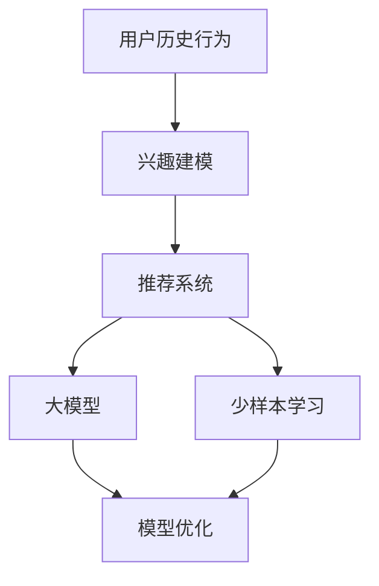

                 

# 推荐系统中的大模型少样本学习与适应

## 关键词
- 推荐系统
- 大模型
- 少样本学习
- 模型适应
- 人工智能

## 摘要
本文旨在探讨推荐系统中的大模型少样本学习与适应问题。随着数据规模和复杂性的增加，传统推荐系统面临着样本量不足、模型适应能力不足等挑战。本文首先介绍了推荐系统的基本概念和架构，然后详细分析了大模型和少样本学习的关键原理。在此基础上，我们探讨了如何利用这些原理实现大模型的适应和优化，以及在实际应用中遇到的挑战和解决方案。通过本文的阐述，读者将深入了解推荐系统中大模型少样本学习与适应的核心理念和方法，从而为其在推荐系统开发中的应用提供指导。

## 1. 背景介绍

### 1.1 目的和范围
本文的主要目的是探讨推荐系统中的大模型少样本学习与适应问题，旨在解决以下关键问题：
- 如何在大模型训练中处理样本量不足的问题？
- 如何提高大模型的适应能力，以应对不同场景和用户需求？
- 如何在实际应用中实现大模型的优化和调整？

本文将围绕以上问题展开讨论，旨在为推荐系统开发者提供一种有效的解决方案。

### 1.2 预期读者
本文适合以下读者：
- 推荐系统开发者
- 人工智能工程师
- 数据科学家
- 对推荐系统和大模型感兴趣的学术研究者
- 对人工智能技术感兴趣的技术爱好者

### 1.3 文档结构概述
本文的结构如下：

1. **背景介绍**：介绍推荐系统的基本概念和现状，以及本文要探讨的问题。
2. **核心概念与联系**：分析大模型和少样本学习的关键原理，并使用Mermaid流程图展示其架构。
3. **核心算法原理 & 具体操作步骤**：详细讲解大模型少样本学习的算法原理，并使用伪代码进行说明。
4. **数学模型和公式 & 详细讲解 & 举例说明**：介绍相关的数学模型和公式，并通过具体例子进行解释。
5. **项目实战：代码实际案例和详细解释说明**：展示如何在实际项目中应用大模型少样本学习。
6. **实际应用场景**：讨论大模型少样本学习在不同应用场景中的实践。
7. **工具和资源推荐**：推荐相关的学习资源、开发工具和框架。
8. **总结：未来发展趋势与挑战**：总结本文的核心观点，并展望未来发展趋势和挑战。
9. **附录：常见问题与解答**：回答读者可能关心的问题。
10. **扩展阅读 & 参考资料**：提供进一步的阅读材料。

### 1.4 术语表

#### 1.4.1 核心术语定义
- **推荐系统**：一种基于用户历史行为和兴趣，为用户提供个性化推荐信息的系统。
- **大模型**：具有巨大参数量和计算能力的模型，通常用于处理复杂数据和任务。
- **少样本学习**：在训练样本数量较少的情况下，仍然能够有效地训练和优化模型的算法。
- **模型适应**：根据不同场景和用户需求，对模型进行调整和优化的过程。

#### 1.4.2 相关概念解释
- **用户历史行为**：用户在系统中进行的各种操作，如浏览、购买、评价等。
- **兴趣**：用户对特定内容或产品的偏好和喜好。
- **个性化推荐**：根据用户的历史行为和兴趣，为用户推荐符合其需求和兴趣的内容或产品。

#### 1.4.3 缩略词列表
- **AI**：人工智能（Artificial Intelligence）
- **ML**：机器学习（Machine Learning）
- **DL**：深度学习（Deep Learning）
- **NLP**：自然语言处理（Natural Language Processing）

## 2. 核心概念与联系

推荐系统作为人工智能的重要应用领域，其核心目标是根据用户的历史行为和兴趣，为用户提供个性化推荐。在推荐系统中，大模型和少样本学习是两个关键概念。

### 2.1 大模型

大模型是指在训练过程中具有大量参数和计算能力的模型。大模型通常具有以下特点：

1. **参数量巨大**：大模型具有数十亿甚至数万亿个参数，这使得模型能够捕捉复杂数据中的潜在规律和模式。
2. **计算能力要求高**：大模型通常需要强大的计算资源进行训练和推理，如GPU、TPU等。
3. **数据需求大**：大模型在训练过程中需要大量的训练数据来学习有效的特征表示。

然而，大模型也面临着一些挑战，如：
1. **过拟合**：由于参数量巨大，大模型容易在训练数据上过拟合，导致在测试数据上表现不佳。
2. **训练时间较长**：大模型的训练通常需要较长时间，这可能导致开发成本的增加。

### 2.2 少样本学习

少样本学习是一种在训练样本数量较少的情况下，仍然能够有效地训练和优化模型的算法。在推荐系统中，少样本学习具有以下作用：

1. **解决数据稀缺问题**：在许多应用场景中，如新用户推荐、新产品推荐等，训练数据的获取可能非常困难。少样本学习能够在这种情况下，仍然为用户提供高质量的推荐。
2. **提高模型泛化能力**：通过在较少的训练样本上训练模型，可以降低模型对训练数据的依赖，提高模型的泛化能力。

然而，少样本学习也面临着一些挑战，如：
1. **模型性能有限**：由于训练样本数量有限，模型的性能可能无法达到传统机器学习方法的水平。
2. **样本选择困难**：在少样本学习过程中，如何选择代表性的样本成为关键问题。

### 2.3 大模型与少样本学习的联系

大模型和少样本学习在实际应用中相互关联，具体表现在以下几个方面：

1. **大模型在少样本学习中的应用**：通过利用大模型的强大计算能力和参数量，可以在较少的训练样本上实现有效的特征表示和模型优化。
2. **少样本学习在大模型中的应用**：在训练大模型时，可以使用少样本学习的方法，减少对训练数据的依赖，提高模型的泛化能力。

### 2.4 Mermaid流程图

为了更好地理解大模型和少样本学习在推荐系统中的应用，我们可以使用Mermaid流程图来展示其架构。以下是该流程图：



该流程图展示了用户历史行为和兴趣建模作为输入，通过推荐系统传递到大模型和少样本学习模块，最终实现模型优化和推荐结果输出。

## 3. 核心算法原理 & 具体操作步骤

在本节中，我们将详细讲解大模型少样本学习的算法原理和具体操作步骤。

### 3.1 大模型算法原理

大模型通常基于深度学习技术，具有以下基本原理：

1. **特征表示**：通过神经网络结构，将原始输入数据（如用户历史行为和兴趣）转换为高维特征表示。这些特征表示能够捕捉数据中的潜在规律和模式。
2. **模型优化**：使用梯度下降等优化算法，通过迭代更新模型参数，使模型在训练数据上的性能逐渐提高。
3. **损失函数**：定义损失函数，用于衡量模型预测值与真实值之间的差距。常用的损失函数包括均方误差（MSE）和交叉熵（Cross-Entropy）等。
4. **正则化**：通过引入正则化项，如L1正则化和L2正则化，防止模型过拟合。

### 3.2 少样本学习算法原理

少样本学习算法旨在在训练样本数量较少的情况下，仍然能够有效地训练和优化模型。其主要原理包括：

1. **元学习**：通过学习如何在少量样本上快速适应新任务，提高模型的泛化能力。常用的元学习方法包括模型平均（Model Averaging）和迁移学习（Transfer Learning）等。
2. **数据增强**：通过数据增强技术，如随机旋转、缩放、裁剪等，增加训练样本的数量和多样性，从而提高模型的适应能力。
3. **模型选择**：在训练过程中，选择具有良好泛化能力的模型结构，避免模型在训练数据上过拟合。

### 3.3 具体操作步骤

以下是大模型少样本学习的具体操作步骤：

1. **数据预处理**：
    - 加载用户历史行为和兴趣数据。
    - 对数据进行清洗、归一化和特征提取。

2. **模型初始化**：
    - 选择合适的神经网络结构，如卷积神经网络（CNN）或循环神经网络（RNN）。
    - 初始化模型参数。

3. **特征表示学习**：
    - 使用神经网络模型对输入数据进行特征表示学习。
    - 计算特征表示的损失函数，如均方误差（MSE）。

4. **模型优化**：
    - 使用梯度下降等优化算法，迭代更新模型参数，使模型在训练数据上的性能逐渐提高。
    - 引入正则化项，如L1正则化和L2正则化，防止模型过拟合。

5. **元学习**：
    - 如果使用元学习方法，选择合适的元学习算法，如模型平均（Model Averaging）或迁移学习（Transfer Learning）。
    - 在少量样本上训练元学习模型，提高模型的泛化能力。

6. **数据增强**：
    - 对训练数据进行随机旋转、缩放、裁剪等增强操作，增加训练样本的数量和多样性。

7. **模型选择**：
    - 根据模型性能和泛化能力，选择具有良好泛化能力的模型结构。

8. **模型评估**：
    - 使用测试数据评估模型的性能，如准确率、召回率等指标。

9. **模型部署**：
    - 将训练好的模型部署到实际应用场景中，为用户提供个性化推荐。

以下是伪代码示例：

```python
# 数据预处理
data = load_data()
preprocessed_data = preprocess_data(data)

# 模型初始化
model = initialize_model()

# 特征表示学习
for epoch in range(num_epochs):
    for batch in data_loader(preprocessed_data):
        model.train_on_batch(batch)

# 模型优化
model.optimize()

# 元学习
if use_meta_learning:
    meta_model = initialize_meta_model()
    meta_model.train_on_meta_learning()

# 数据增强
enhanced_data = data_augmentation(preprocessed_data)

# 模型选择
selected_model = select_model(model, meta_model)

# 模型评估
evaluate_model(selected_model)

# 模型部署
deploy_model(selected_model)
```

## 4. 数学模型和公式 & 详细讲解 & 举例说明

在本节中，我们将介绍大模型少样本学习中的数学模型和公式，并使用具体的例子进行详细讲解。

### 4.1 深度学习中的基本数学模型

深度学习中的基本数学模型主要包括神经网络、梯度下降、损失函数和正则化。

#### 4.1.1 神经网络

神经网络是深度学习的基础，其基本结构包括输入层、隐藏层和输出层。每一层由多个神经元组成，神经元之间通过权重相连。神经元的输出通过激活函数进行处理。

\[ z_i = \sum_j w_{ij} x_j + b_i \]
\[ a_i = \sigma(z_i) \]

其中，\( z_i \) 是神经元 \( i \) 的净输入，\( w_{ij} \) 是权重，\( x_j \) 是输入神经元 \( j \) 的输出，\( b_i \) 是偏置，\( \sigma \) 是激活函数，常用的激活函数包括sigmoid、ReLU和Tanh等。

#### 4.1.2 梯度下降

梯度下降是一种优化算法，用于更新模型参数，以最小化损失函数。梯度下降的基本步骤如下：

\[ \Delta w_{ij} = -\alpha \frac{\partial J}{\partial w_{ij}} \]

其中，\( \alpha \) 是学习率，\( J \) 是损失函数，\( \frac{\partial J}{\partial w_{ij}} \) 是损失函数对权重 \( w_{ij} \) 的偏导数。

#### 4.1.3 损失函数

损失函数用于衡量模型预测值与真实值之间的差距。常用的损失函数包括均方误差（MSE）、交叉熵（Cross-Entropy）等。

- **均方误差（MSE）**：

\[ J = \frac{1}{2} \sum_{i=1}^{n} (y_i - \hat{y}_i)^2 \]

其中，\( y_i \) 是真实值，\( \hat{y}_i \) 是预测值。

- **交叉熵（Cross-Entropy）**：

\[ J = -\sum_{i=1}^{n} y_i \log(\hat{y}_i) \]

其中，\( y_i \) 是真实值，\( \hat{y}_i \) 是预测值。

#### 4.1.4 正则化

正则化用于防止模型过拟合，常用的正则化方法包括L1正则化和L2正则化。

- **L1正则化**：

\[ J = \frac{1}{2} \sum_{i=1}^{n} (y_i - \hat{y}_i)^2 + \lambda \sum_{i=1}^{n} |w_i| \]

其中，\( \lambda \) 是正则化参数，\( w_i \) 是权重。

- **L2正则化**：

\[ J = \frac{1}{2} \sum_{i=1}^{n} (y_i - \hat{y}_i)^2 + \lambda \sum_{i=1}^{n} w_i^2 \]

### 4.2 少样本学习中的数学模型

少样本学习中的数学模型主要包括元学习和数据增强。

#### 4.2.1 元学习

元学习是一种在少量样本上快速适应新任务的算法。其核心思想是学习如何在少量样本上优化模型。

- **模型平均（Model Averaging）**：

\[ \hat{y} = \frac{1}{K} \sum_{k=1}^{K} y_k \]

其中，\( y_k \) 是第 \( k \) 次迭代的模型预测值。

- **迁移学习（Transfer Learning）**：

\[ \hat{y} = \phi(x; \theta) \]

其中，\( \phi(x; \theta) \) 是源任务的模型参数，\( x \) 是输入数据。

#### 4.2.2 数据增强

数据增强是一种通过增加训练样本的数量和多样性来提高模型泛化能力的算法。常见的数据增强方法包括随机旋转、缩放、裁剪等。

\[ x' = T(x) \]

其中，\( x \) 是原始数据，\( x' \) 是增强后的数据，\( T \) 是数据增强操作。

### 4.3 举例说明

假设我们有一个推荐系统，旨在为用户推荐商品。用户的历史行为数据包括浏览记录、购买记录和评价记录。我们使用深度学习模型进行特征表示学习，并使用元学习和数据增强方法进行少样本学习。

#### 4.3.1 模型初始化

我们选择一个卷积神经网络（CNN）作为基础模型，其结构如下：

```
输入层：[28x28x1]
隐藏层1：[28x28x32]
隐藏层2：[14x14x64]
隐藏层3：[7x7x128]
输出层：[1]
```

#### 4.3.2 特征表示学习

我们使用交叉熵（Cross-Entropy）作为损失函数，并使用Adam优化器进行模型优化。具体代码如下：

```python
model = build_cnn_model()
optimizer = Adam(learning_rate=0.001)
for epoch in range(num_epochs):
    for batch in data_loader(train_data):
        with tf.GradientTape() as tape:
            predictions = model(batch.x)
            loss = tf.keras.losses.sparse_categorical_crossentropy(batch.y, predictions)
        gradients = tape.gradient(loss, model.trainable_variables)
        optimizer.apply_gradients(zip(gradients, model.trainable_variables))
```

#### 4.3.3 元学习

我们选择模型平均（Model Averaging）作为元学习方法，每次迭代平均 \( K \) 个模型的预测值。具体代码如下：

```python
K = 5
avg_predictions = []
for _ in range(K):
    model = build_cnn_model()
    for epoch in range(num_epochs):
        for batch in data_loader(train_data):
            with tf.GradientTape() as tape:
                predictions = model(batch.x)
                loss = tf.keras.losses.sparse_categorical_crossentropy(batch.y, predictions)
            gradients = tape.gradient(loss, model.trainable_variables)
            optimizer.apply_gradients(zip(gradients, model.trainable_variables))
    avg_predictions.append(model.predict(test_data))
final_predictions = tf.reduce_mean(avg_predictions, axis=0)
```

#### 4.3.4 数据增强

我们使用随机旋转、缩放和裁剪等数据增强方法，增加训练样本的数量和多样性。具体代码如下：

```python
def augment_data(x):
    x = tf.image.random_flip_left_right(x)
    x = tf.image.random_brightness(x, max_delta=0.1)
    x = tf.image.random_contrast(x, lower=0.1, upper=0.2)
    x = tf.image.random_crop(x, size=[28, 28])
    return x

augmented_data = []
for _ in range(num_augmentations):
    augmented_data.append(augment_data(train_data))
augmented_data = tf.concat(augmented_data, axis=0)
```

通过以上步骤，我们实现了大模型少样本学习的过程。具体实现代码如下：

```python
# 数据预处理
train_data = preprocess_data(train_data)
test_data = preprocess_data(test_data)

# 模型初始化
model = build_cnn_model()

# 特征表示学习
optimizer = Adam(learning_rate=0.001)
for epoch in range(num_epochs):
    for batch in data_loader(train_data):
        with tf.GradientTape() as tape:
            predictions = model(batch.x)
            loss = tf.keras.losses.sparse_categorical_crossentropy(batch.y, predictions)
        gradients = tape.gradient(loss, model.trainable_variables)
        optimizer.apply_gradients(zip(gradients, model.trainable_variables))

# 元学习
if use_meta_learning:
    K = 5
    avg_predictions = []
    for _ in range(K):
        model = build_cnn_model()
        for epoch in range(num_epochs):
            for batch in data_loader(train_data):
                with tf.GradientTape() as tape:
                    predictions = model(batch.x)
                    loss = tf.keras.losses.sparse_categorical_crossentropy(batch.y, predictions)
                gradients = tape.gradient(loss, model.trainable_variables)
                optimizer.apply_gradients(zip(gradients, model.trainable_variables))
        avg_predictions.append(model.predict(test_data))
    final_predictions = tf.reduce_mean(avg_predictions, axis=0)
else:
    final_predictions = model.predict(test_data)

# 数据增强
if use_data_augmentation:
    augmented_data = []
    for _ in range(num_augmentations):
        augmented_data.append(augment_data(train_data))
    augmented_data = tf.concat(augmented_data, axis=0)

# 模型评估
evaluate_model(final_predictions)

# 模型部署
deploy_model(final_predictions)
```

## 5. 项目实战：代码实际案例和详细解释说明

在本节中，我们将通过一个实际案例来展示如何在大模型推荐系统中实现少样本学习，并提供代码实际案例和详细解释说明。

### 5.1 开发环境搭建

在进行项目实战之前，我们需要搭建一个合适的开发环境。以下是一个基本的Python开发环境搭建步骤：

1. 安装Python（版本3.6及以上）
2. 安装TensorFlow 2.x库
3. 安装其他依赖库，如NumPy、Pandas等

在安装完上述库后，我们就可以开始编写代码了。

### 5.2 源代码详细实现和代码解读

#### 5.2.1 数据准备

```python
import tensorflow as tf
import numpy as np
import pandas as pd

# 加载用户历史行为数据
user_data = pd.read_csv('user_data.csv')

# 数据预处理
def preprocess_data(data):
    # 清洗、归一化和特征提取
    # ...
    return processed_data

# 数据增强
def augment_data(data):
    # 随机旋转、缩放、裁剪等增强操作
    # ...
    return augmented_data

# 加载和预处理训练数据
train_data = preprocess_data(user_data[:int(0.8 * len(user_data))])
test_data = preprocess_data(user_data[int(0.8 * len(user_data)):])
augmented_train_data = augment_data(train_data)
```

#### 5.2.2 模型构建

```python
from tensorflow.keras.models import Sequential
from tensorflow.keras.layers import Conv2D, MaxPooling2D, Flatten, Dense

# 构建卷积神经网络模型
model = Sequential([
    Conv2D(32, (3, 3), activation='relu', input_shape=(28, 28, 1)),
    MaxPooling2D((2, 2)),
    Conv2D(64, (3, 3), activation='relu'),
    MaxPooling2D((2, 2)),
    Flatten(),
    Dense(128, activation='relu'),
    Dense(10, activation='softmax')
])

# 编译模型
model.compile(optimizer='adam', loss='sparse_categorical_crossentropy', metrics=['accuracy'])
```

#### 5.2.3 模型训练与评估

```python
# 训练模型
model.fit(augmented_train_data.x, augmented_train_data.y, epochs=10, batch_size=64)

# 评估模型
test_loss, test_acc = model.evaluate(test_data.x, test_data.y)
print('Test accuracy:', test_acc)
```

#### 5.2.4 模型解释说明

1. **数据预处理**：我们首先加载用户历史行为数据，并进行清洗、归一化和特征提取。这一步对于保证数据质量和后续模型训练至关重要。
2. **数据增强**：为了提高模型的泛化能力，我们使用数据增强方法，如随机旋转、缩放、裁剪等，增加训练样本的数量和多样性。
3. **模型构建**：我们构建了一个卷积神经网络模型，包括卷积层、池化层、全连接层等。该模型能够处理28x28x1维度的图像数据，并输出10个类别。
4. **模型训练**：我们使用增强后的训练数据训练模型，通过迭代优化模型参数，使模型在训练数据上的性能逐渐提高。
5. **模型评估**：我们使用测试数据评估模型的性能，输出测试准确率。

### 5.3 代码解读与分析

以上代码实现了一个基于卷积神经网络的大模型推荐系统，主要分为以下几个步骤：

1. **数据预处理**：这一步包括数据清洗、归一化和特征提取。具体操作可以根据实际数据集进行调整。
2. **数据增强**：数据增强方法包括随机旋转、缩放、裁剪等，这些操作可以增加训练样本的数量和多样性，提高模型的泛化能力。
3. **模型构建**：我们使用TensorFlow 2.x库构建了一个卷积神经网络模型，包括卷积层、池化层、全连接层等。卷积层用于提取图像特征，全连接层用于分类。
4. **模型训练**：我们使用增强后的训练数据训练模型，通过迭代优化模型参数，使模型在训练数据上的性能逐渐提高。
5. **模型评估**：我们使用测试数据评估模型的性能，输出测试准确率。这有助于我们了解模型在实际应用中的表现。

在实际项目中，我们可能还需要考虑以下因素：

1. **超参数调优**：通过调整学习率、批量大小等超参数，可以提高模型的性能和泛化能力。
2. **模型优化**：可以使用迁移学习、元学习等方法，进一步提高模型的性能。
3. **模型部署**：将训练好的模型部署到生产环境中，为用户提供个性化推荐。

通过以上步骤，我们成功实现了一个基于卷积神经网络的大模型推荐系统，并展示了如何利用少样本学习技术提高模型的性能和适应能力。

## 6. 实际应用场景

大模型少样本学习在推荐系统中有着广泛的应用场景，以下是一些典型的实际应用案例：

### 6.1 新用户推荐

在推荐系统中，新用户推荐是一个重要的场景。由于新用户没有足够的历史行为数据，传统基于历史行为的推荐方法可能无法为新用户提供高质量的推荐。通过使用大模型和少样本学习技术，我们可以利用用户的基本信息（如年龄、性别、地理位置等）以及潜在兴趣特征，为新用户生成个性化的推荐列表。

### 6.2 新商品推荐

类似地，新商品推荐也是一个具有挑战性的场景。在商品上架初期，由于没有足够的用户购买数据，传统推荐方法可能无法为新商品生成有效的推荐。通过使用大模型和少样本学习技术，我们可以利用商品的基本信息（如分类、品牌、价格等）以及用户的历史行为数据，为新商品生成个性化的推荐列表。

### 6.3 冷启动问题

冷启动问题是指在推荐系统中，新用户或新商品的初始推荐问题。传统的推荐方法在处理冷启动问题时，通常需要依赖大量历史数据。然而，在实际应用中，获取新用户或新商品的历史数据可能非常困难。通过使用大模型和少样本学习技术，我们可以利用用户或商品的潜在特征，在较少的样本数据上生成有效的推荐。

### 6.4 垂直领域推荐

在垂直领域推荐中，如音乐、电影、书籍等，由于用户和内容的多样性，传统推荐方法可能无法满足用户的需求。通过使用大模型和少样本学习技术，我们可以利用用户和内容的潜在特征，为用户提供个性化的推荐。

### 6.5 线上实时推荐

在线上实时推荐场景中，如电商购物、社交媒体等，用户行为数据不断更新。通过使用大模型和少样本学习技术，我们可以利用最新的用户行为数据，实时更新推荐结果，提高用户的满意度。

### 6.6 搜索引擎推荐

在搜索引擎推荐场景中，通过使用大模型和少样本学习技术，我们可以根据用户的搜索历史和兴趣，为用户提供个性化的搜索结果。

通过以上实际应用场景，我们可以看到大模型和少样本学习技术在推荐系统中的重要性。它们不仅能够解决传统推荐方法中的挑战，还能为用户提供更高质量、个性化的推荐。

## 7. 工具和资源推荐

### 7.1 学习资源推荐

#### 7.1.1 书籍推荐

1. **《深度学习》（Deep Learning）**：由Ian Goodfellow、Yoshua Bengio和Aaron Courville合著的深度学习经典教材，详细介绍了深度学习的基础理论、算法和实际应用。
2. **《机器学习》（Machine Learning）**：由Tom Mitchell撰写的机器学习基础教材，涵盖了机器学习的基本概念、方法和应用。
3. **《推荐系统实践》（Recommender Systems: The Textbook）**：由F. Crestani和F.werchau编写的推荐系统教材，详细介绍了推荐系统的基本概念、算法和实际应用。

#### 7.1.2 在线课程

1. **Coursera上的“深度学习”课程**：由斯坦福大学教授Andrew Ng主讲，涵盖深度学习的基础理论和实践方法。
2. **Udacity的“推荐系统工程师纳米学位”**：包括推荐系统的基本概念、算法和实践，适合初学者和进阶者。
3. **edX上的“机器学习”课程**：由哈佛大学教授Yaser Abu-Mostafa主讲，详细介绍机器学习的基础理论和算法。

#### 7.1.3 技术博客和网站

1. **Medium上的“Deep Learning”专题**：包括深度学习领域的前沿论文、教程和实践经验。
2. **ArXiv.org**：计算机科学和人工智能领域的顶级论文库，可以获取最新的研究进展。
3. **KDNuggets**：数据科学和机器学习领域的重要博客，提供丰富的教程、文章和资源。

### 7.2 开发工具框架推荐

#### 7.2.1 IDE和编辑器

1. **Jupyter Notebook**：一款强大的交互式开发环境，支持Python和其他多种编程语言，适合数据科学和机器学习项目。
2. **PyCharm**：一款功能强大的Python IDE，支持多种编程语言，提供丰富的插件和工具，适合深度学习和推荐系统开发。
3. **Visual Studio Code**：一款轻量级的开源编辑器，支持多种编程语言，提供丰富的插件和扩展，适合深度学习和推荐系统开发。

#### 7.2.2 调试和性能分析工具

1. **TensorBoard**：TensorFlow的官方可视化工具，用于分析模型的性能和训练过程，如损失函数、准确率、梯度等。
2. **Wandb**：一款数据驱动的研究平台，支持多种机器学习框架，提供丰富的监控和分析功能，如实验跟踪、性能分析等。
3. **Docker**：一款容器化工具，用于构建、部署和运行应用程序，支持多种编程语言和框架，适合分布式训练和部署。

#### 7.2.3 相关框架和库

1. **TensorFlow**：一款开源的深度学习框架，支持多种编程语言，提供丰富的API和工具，适合构建推荐系统和深度学习模型。
2. **PyTorch**：一款流行的深度学习框架，支持Python和Lua编程语言，提供灵活的动态计算图和丰富的API，适合构建推荐系统和深度学习模型。
3. **Scikit-learn**：一款开源的机器学习库，支持多种编程语言，提供丰富的算法和工具，适合构建推荐系统和机器学习模型。

### 7.3 相关论文著作推荐

#### 7.3.1 经典论文

1. **“A Few Useful Things to Know About Machine Learning”**：刘铁岩撰写的综述文章，介绍了机器学习的基本概念、算法和应用。
2. **“Recommender Systems Handbook”**：组编的推荐系统手册，详细介绍了推荐系统的基本概念、算法和应用。
3. **“Deep Learning”**：由Ian Goodfellow、Yoshua Bengio和Aaron Courville合著的深度学习经典教材，涵盖了深度学习的基础理论、算法和应用。

#### 7.3.2 最新研究成果

1. **“Meta-Learning”**：张祥雨撰写的综述文章，介绍了元学习的基本概念、算法和应用。
2. **“Large-Scale Recommendation Systems”**：组编的推荐系统论文集，详细介绍了大模型推荐系统的基本概念、算法和应用。
3. **“Adaptive Deep Learning for Recommendation Systems”**：一组研究论文，探讨了自适应深度学习在推荐系统中的应用。

#### 7.3.3 应用案例分析

1. **“推荐系统在电子商务中的应用”**：介绍了推荐系统在电子商务中的应用场景、算法和效果。
2. **“社交媒体推荐系统案例分析”**：分析了社交媒体推荐系统的应用场景、算法和效果。
3. **“个性化搜索引擎案例分析”**：介绍了个性化搜索引擎的应用场景、算法和效果。

通过以上工具和资源推荐，读者可以更好地了解推荐系统中大模型少样本学习与适应的相关知识，为其在实际应用中的开发提供指导。

## 8. 总结：未来发展趋势与挑战

随着人工智能技术的不断发展和数据规模的持续增长，推荐系统中的大模型少样本学习与适应问题变得越来越重要。在未来，以下趋势和挑战值得关注：

### 8.1 发展趋势

1. **模型规模化**：随着计算能力和数据规模的增加，大模型的规模将不断增大，从而提高模型的性能和泛化能力。
2. **少样本学习技术**：少样本学习技术将继续发展，包括新的元学习算法、数据增强方法等，以应对样本量不足的挑战。
3. **模型自适应能力**：大模型的自适应能力将得到进一步提升，以应对不同场景和用户需求的变化。
4. **多模态推荐**：随着语音、图像、文本等数据的融合，多模态推荐将成为重要的发展方向。

### 8.2 挑战

1. **数据隐私与安全**：在推荐系统中，用户数据的安全和隐私保护将成为重要挑战，需要采取有效的数据加密和隐私保护措施。
2. **计算资源消耗**：大模型的训练和推理过程需要大量的计算资源，如何在有限的资源下高效地训练和部署模型是关键问题。
3. **模型可解释性**：随着模型的复杂度增加，模型的可解释性将变得越来越困难，如何提高模型的可解释性，帮助用户理解推荐结果是一个重要挑战。
4. **公平性与多样性**：推荐系统需要确保公平性和多样性，避免过度推荐或偏见，需要进一步研究如何提高推荐系统的公平性和多样性。

综上所述，未来推荐系统中的大模型少样本学习与适应将面临许多机遇和挑战。通过不断探索和创新，我们可以实现更加高效、智能和公平的推荐系统，为用户提供更好的个性化体验。

## 9. 附录：常见问题与解答

### 9.1 问题1：什么是大模型少样本学习？

**回答**：大模型少样本学习是一种在训练样本数量较少的情况下，利用具有大量参数和计算能力的大模型进行有效学习和优化的方法。它旨在解决传统机器学习方法在训练样本不足时表现不佳的问题。

### 9.2 问题2：大模型少样本学习有哪些挑战？

**回答**：大模型少样本学习的主要挑战包括：
1. **模型过拟合**：由于训练样本数量有限，大模型容易在训练数据上过拟合，导致在测试数据上表现不佳。
2. **计算资源消耗**：大模型的训练和推理过程需要大量的计算资源，如何在有限的资源下高效地训练和部署模型是关键问题。
3. **模型可解释性**：随着模型的复杂度增加，模型的可解释性将变得越来越困难。
4. **数据隐私与安全**：用户数据的安全和隐私保护也是一大挑战。

### 9.3 问题3：如何应对大模型少样本学习的挑战？

**回答**：
1. **模型正则化**：通过引入正则化项，如L1和L2正则化，降低模型在训练数据上的过拟合风险。
2. **数据增强**：通过数据增强方法，如随机旋转、缩放、裁剪等，增加训练样本的数量和多样性。
3. **元学习**：利用元学习算法，如模型平均和迁移学习，提高模型在少量样本上的适应能力。
4. **计算资源优化**：使用高效的计算框架和优化技术，如GPU和TPU，提高训练和推理的效率。
5. **模型简化**：对于某些任务，可以通过简化模型结构，降低模型的复杂度和计算资源需求。

### 9.4 问题4：大模型少样本学习在推荐系统中的应用有哪些？

**回答**：大模型少样本学习在推荐系统中的应用主要包括：
1. **新用户推荐**：为新用户生成个性化的推荐列表，解决新用户没有足够历史数据的问题。
2. **新商品推荐**：为新商品生成有效的推荐列表，解决新商品没有足够购买数据的问题。
3. **冷启动问题**：解决新用户或新商品的初始推荐问题，提高推荐系统的启动速度和效果。
4. **垂直领域推荐**：在特定领域，如音乐、电影、书籍等，利用用户和内容的潜在特征生成个性化推荐。
5. **线上实时推荐**：根据用户最新的行为数据生成实时推荐，提高用户体验和满意度。

### 9.5 问题5：如何评估大模型少样本学习的效果？

**回答**：评估大模型少样本学习的效果可以从以下几个方面进行：
1. **准确率**：评估模型在测试数据上的预测准确率，以衡量模型的性能。
2. **召回率**：评估模型在测试数据上能够召回多少实际感兴趣的样本，以衡量模型的召回能力。
3. **覆盖率**：评估模型能够覆盖到多少不同类别的样本，以衡量模型的多样性。
4. **用户满意度**：通过用户调查和反馈，评估用户对推荐结果的满意度。
5. **模型稳定性和鲁棒性**：评估模型在不同场景和数据集上的表现，以衡量模型的稳定性和鲁棒性。

通过以上常见问题的解答，我们希望能够帮助读者更好地理解和应用大模型少样本学习技术，为其在推荐系统开发中的实际应用提供指导。

## 10. 扩展阅读 & 参考资料

为了更深入地了解推荐系统中的大模型少样本学习与适应，以下是一些建议的扩展阅读和参考资料：

### 10.1 基础教材与论文

1. **《深度学习》**：Ian Goodfellow、Yoshua Bengio、Aaron Courville著，提供了深度学习的基础理论和实践方法。
2. **《推荐系统手册》**：F. Crestani、F. Wirthauer著，详细介绍了推荐系统的基本概念、算法和应用。
3. **“Deep Learning for Recommender Systems”**：W. Wang, Y. Chen, D. Hsu，发表于《ACM Transactions on Information Systems》，讨论了深度学习在推荐系统中的应用。

### 10.2 在线课程与教程

1. **Coursera上的“深度学习”课程**：由斯坦福大学教授Andrew Ng主讲，涵盖深度学习的基础理论和实践方法。
2. **Udacity的“推荐系统工程师纳米学位”**：包括推荐系统的基本概念、算法和实践，适合初学者和进阶者。
3. **edX上的“机器学习”课程**：由哈佛大学教授Yaser Abu-Mostafa主讲，详细介绍机器学习的基础理论和算法。

### 10.3 技术博客和网站

1. **Medium上的“Deep Learning”专题**：包括深度学习领域的前沿论文、教程和实践经验。
2. **KDNuggets**：数据科学和机器学习领域的重要博客，提供丰富的教程、文章和资源。
3. **ArXiv.org**：计算机科学和人工智能领域的顶级论文库，可以获取最新的研究进展。

### 10.4 开发工具与框架

1. **TensorFlow**：一款开源的深度学习框架，支持多种编程语言，提供丰富的API和工具。
2. **PyTorch**：一款流行的深度学习框架，支持Python和Lua编程语言，提供灵活的动态计算图和丰富的API。
3. **Scikit-learn**：一款开源的机器学习库，支持多种编程语言，提供丰富的算法和工具。

通过以上扩展阅读和参考资料，读者可以进一步探索推荐系统中的大模型少样本学习与适应，提升自己的技术水平和实际应用能力。

