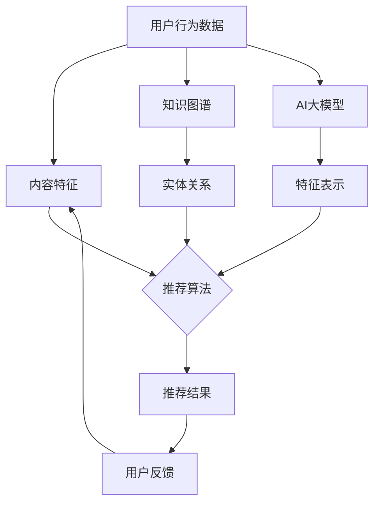

                 

# 推荐系统中的知识图谱与AI大模型的融合

> **关键词：**推荐系统、知识图谱、AI大模型、融合、算法、数学模型、应用场景
>
> **摘要：**本文将探讨推荐系统中的知识图谱与AI大模型的融合技术，通过深入分析核心概念、算法原理、数学模型以及实际应用案例，帮助读者全面了解这一前沿领域的最新进展与未来发展趋势。

## 1. 背景介绍

### 1.1 目的和范围

本文旨在介绍推荐系统中的知识图谱与AI大模型的融合技术，旨在帮助读者了解这一领域的关键概念、核心算法、数学模型，并通过实际案例展示其在现实世界中的应用。本文将重点关注以下几个方面：

1. **核心概念与联系**：解释推荐系统、知识图谱和AI大模型的基本概念，并展示它们之间的联系。
2. **核心算法原理**：详细阐述融合技术的算法原理和操作步骤。
3. **数学模型和公式**：介绍相关的数学模型和公式，并举例说明。
4. **项目实战**：通过一个实际案例展示代码实现和详细解释。
5. **实际应用场景**：讨论推荐系统在不同领域的应用。
6. **工具和资源推荐**：推荐学习资源和开发工具。
7. **未来发展趋势与挑战**：探讨该领域的发展趋势和面临的挑战。

### 1.2 预期读者

本文适合对推荐系统、知识图谱和AI大模型有一定了解的读者，包括：

1. **研究人员和工程师**：希望深入了解推荐系统中知识图谱与AI大模型融合技术的专业人士。
2. **数据科学家和机器学习专家**：希望将知识图谱和AI大模型应用于推荐系统开发的从业者。
3. **高校学生**：对推荐系统、知识图谱和AI大模型感兴趣的本科生和研究生。

### 1.3 文档结构概述

本文将按照以下结构进行组织：

1. **背景介绍**：介绍本文的目的、预期读者、文档结构概述等。
2. **核心概念与联系**：解释推荐系统、知识图谱和AI大模型的基本概念，并展示它们之间的联系。
3. **核心算法原理**：详细阐述融合技术的算法原理和操作步骤。
4. **数学模型和公式**：介绍相关的数学模型和公式，并举例说明。
5. **项目实战**：通过一个实际案例展示代码实现和详细解释。
6. **实际应用场景**：讨论推荐系统在不同领域的应用。
7. **工具和资源推荐**：推荐学习资源和开发工具。
8. **未来发展趋势与挑战**：探讨该领域的发展趋势和面临的挑战。
9. **附录**：常见问题与解答。
10. **扩展阅读 & 参考资料**：提供相关的扩展阅读和参考资料。

### 1.4 术语表

#### 1.4.1 核心术语定义

- **推荐系统**：一种能够根据用户的历史行为和偏好，向用户推荐相关内容的系统。
- **知识图谱**：一种用于表示实体及其相互关系的图形化数据结构。
- **AI大模型**：指规模庞大、参数数量庞大的深度学习模型，如BERT、GPT等。

#### 1.4.2 相关概念解释

- **用户画像**：基于用户行为和偏好构建的用户特征模型。
- **协同过滤**：一种常见的推荐系统算法，通过计算用户之间的相似度来推荐内容。
- **图谱嵌入**：将知识图谱中的实体和关系转化为低维向量表示。

#### 1.4.3 缩略词列表

- **CTR**：点击率（Click-Through Rate）
- **RMSE**：均方根误差（Root Mean Square Error）
- **GNN**：图神经网络（Graph Neural Network）

## 2. 核心概念与联系

在本节中，我们将详细介绍推荐系统、知识图谱和AI大模型的基本概念，并探讨它们之间的联系。

### 2.1 推荐系统

推荐系统是一种自动化算法，旨在根据用户的历史行为、偏好和上下文信息，向用户推荐感兴趣的内容。推荐系统广泛应用于电子商务、社交媒体、视频平台等多个领域，其目的是提高用户满意度、增加用户黏性和提升业务收入。

#### 推荐系统的主要组成部分：

1. **用户行为数据**：包括用户的历史浏览记录、购买行为、评论等。
2. **内容特征**：描述用户和内容的特征，如用户年龄、性别、兴趣标签等。
3. **推荐算法**：根据用户行为数据和内容特征，计算推荐得分并生成推荐列表。
4. **评估指标**：用于评估推荐系统性能的指标，如准确率、召回率、F1值等。

### 2.2 知识图谱

知识图谱是一种用于表示实体及其相互关系的图形化数据结构，通常由节点（实体）和边（关系）组成。知识图谱可以看作是一个大规模的语义网络，用于捕获现实世界中的复杂关系和知识。

#### 知识图谱的主要特点：

1. **语义表示**：知识图谱通过实体和关系的语义表示，提供了丰富的语义信息。
2. **异构性**：知识图谱通常包含多种类型的实体和关系，具有异构性。
3. **可扩展性**：知识图谱可以方便地扩展和更新，以适应不断变化的数据。

### 2.3 AI大模型

AI大模型是指规模庞大、参数数量庞大的深度学习模型，如BERT、GPT等。这些模型具有强大的语义理解能力和数据处理能力，可以用于各种自然语言处理任务，如文本分类、问答系统、机器翻译等。

#### AI大模型的主要特点：

1. **大规模**：拥有数百万到数十亿个参数，可以处理大规模数据。
2. **端到端**：直接从原始数据中学习，无需复杂的预处理和特征工程。
3. **自适应性**：通过模型优化和训练，可以适应不同的任务和数据集。

### 2.4 知识图谱与推荐系统的联系

知识图谱可以增强推荐系统的表达能力，提高推荐质量。具体来说，知识图谱为推荐系统提供了以下几方面的支持：

1. **语义理解**：知识图谱可以提供更丰富的语义信息，帮助推荐系统更好地理解用户和内容的含义。
2. **关联发现**：知识图谱中的实体和关系可以揭示用户和内容之间的潜在关联，有助于发现新的推荐机会。
3. **冷启动问题**：知识图谱可以缓解新用户和新内容的推荐问题，为冷启动用户提供个性化的推荐。

### 2.5 AI大模型与推荐系统的联系

AI大模型可以提升推荐系统的性能和效率，具体体现在以下几个方面：

1. **特征表示**：AI大模型可以自动提取用户和内容的特征表示，提高推荐算法的准确性。
2. **模型优化**：AI大模型通过大规模数据训练，可以优化推荐算法，提高推荐效果。
3. **实时推荐**：AI大模型可以快速响应用户请求，实现实时推荐。

### 2.6 Mermaid流程图

为了更好地展示知识图谱、推荐系统和AI大模型之间的联系，我们使用Mermaid绘制了一个流程图。



### 2.7 知识图谱在推荐系统中的应用

知识图谱在推荐系统中的应用主要体现在以下几个方面：

1. **基于图谱的协同过滤**：利用知识图谱中的实体和关系进行协同过滤，提高推荐质量。
2. **图谱嵌入**：将知识图谱中的实体和关系转化为低维向量表示，用于推荐系统的特征表示。
3. **多跳推荐**：通过知识图谱中的多跳关系，发现用户和内容之间的潜在关联，进行跨域推荐。

## 3. 核心算法原理 & 具体操作步骤

在本节中，我们将详细讲解知识图谱与AI大模型融合技术的核心算法原理和具体操作步骤，以帮助读者更好地理解和应用这一技术。

### 3.1 算法原理

知识图谱与AI大模型的融合主要涉及以下两个方面：

1. **图谱嵌入**：将知识图谱中的实体和关系转化为低维向量表示，以便于在深度学习模型中进行处理。
2. **特征融合**：将图谱嵌入向量与原始特征进行融合，用于训练深度学习模型。

#### 3.1.1 图谱嵌入

图谱嵌入是一种将知识图谱中的实体和关系映射到低维空间的方法，常用的算法有：

1. **基于矩阵分解的方法**：如TransE、TransH等，通过优化目标函数将实体和关系映射到低维向量空间。
2. **基于图神经网络的方法**：如GraphSAGE、GraphConv等，通过图神经网络学习实体和关系的表示。

#### 3.1.2 特征融合

特征融合是指将图谱嵌入向量与原始特征进行组合，用于训练深度学习模型。常用的方法有：

1. **拼接**：将图谱嵌入向量和原始特征进行拼接，作为深度学习模型的输入。
2. **加权融合**：根据图谱嵌入向量和原始特征的重要程度，进行加权融合，作为深度学习模型的输入。

### 3.2 具体操作步骤

下面我们将使用伪代码详细阐述图谱嵌入和特征融合的具体操作步骤。

#### 3.2.1 图谱嵌入

```python
# 图谱嵌入
def knowledge_graph_embedding(entity_nodes, relation_edges, embedding_size):
    # 初始化实体和关系的嵌入向量
    entity_embeddings = initialize_embeddings(entity_nodes, embedding_size)
    relation_embeddings = initialize_embeddings(relation_edges, embedding_size)

    # 训练图谱嵌入模型
    for epoch in range(num_epochs):
        for entity, relation, target_entity in relation_edges:
            # 计算损失函数
            loss = compute_loss(entity_embeddings[entity], relation_embeddings[relation], entity_embeddings[target_entity])

            # 更新嵌入向量
            update_embeddings(entity_embeddings, relation_embeddings, loss)

    return entity_embeddings, relation_embeddings
```

#### 3.2.2 特征融合

```python
# 特征融合
def feature_fusion(user_embeddings, item_embeddings, user_features, item_features, fusion_method):
    if fusion_method == 'concatenation':
        # 拼接图谱嵌入向量和原始特征
        fused_features = concatenate(user_embeddings, item_embeddings, user_features, item_features)
    elif fusion_method == 'weighted_fusion':
        # 加权融合图谱嵌入向量和原始特征
        fused_features = weighted_fusion(user_embeddings, item_embeddings, user_features, item_features, alpha)

    return fused_features
```

#### 3.2.3 深度学习模型训练

```python
# 深度学习模型训练
def train_model(fused_features, labels, model_type, num_epochs, learning_rate):
    # 初始化深度学习模型
    model = initialize_model(model_type, fused_features.shape[1])

    # 训练模型
    for epoch in range(num_epochs):
        # 计算损失函数和梯度
        loss, gradients = compute_loss_and_gradients(model, fused_features, labels, learning_rate)

        # 更新模型参数
        update_model_parameters(model, gradients)

    return model
```

### 3.3 算法总结

通过图谱嵌入和特征融合技术，我们可以将知识图谱与深度学习模型相结合，实现高效的推荐系统。图谱嵌入技术能够捕获实体和关系的语义信息，特征融合技术能够充分利用图谱嵌入向量和原始特征的互补信息，从而提高推荐系统的准确性和效率。

## 4. 数学模型和公式 & 详细讲解 & 举例说明

在本节中，我们将详细讲解知识图谱与AI大模型融合技术中的相关数学模型和公式，并通过具体例子进行说明。

### 4.1 图谱嵌入模型

图谱嵌入是一种将知识图谱中的实体和关系映射到低维向量空间的方法。常用的图谱嵌入模型包括TransE、TransH等。

#### 4.1.1 TransE模型

TransE模型的基本思想是将（头实体、关系、尾实体）三元组表示为：

$$
head + relation = tail
$$

其中，$head$、$relation$和$tail$分别表示头实体、关系和尾实体的嵌入向量。

#### 4.1.2 TransH模型

TransH模型是TransE模型的扩展，它通过引入投影矩阵来表示关系的多面性。TransH模型的基本思想是将（头实体、关系、尾实体）三元组表示为：

$$
head + R \cdot relation = tail
$$

其中，$R$是一个投影矩阵，用于表示关系的多面性。

#### 4.1.3 例子说明

假设我们有一个简单的知识图谱，其中包含以下三元组：

- (A, likes, B)
- (B, likes, C)
- (A, likes, D)

我们可以使用TransE模型将实体A、B、C、D映射到二维向量空间：

- $v(A) = [1, 0]$
- $v(B) = [0, 1]$
- $v(C) = [1, 1]$
- $v(D) = [0, 1]$

根据TransE模型，我们有以下等式：

$$
[1, 0] + [0, 1] = [0, 1]
$$

这与三元组（A, likes, D）相匹配。

### 4.2 深度学习模型

在融合技术中，深度学习模型用于对图谱嵌入向量和原始特征进行建模。常用的深度学习模型包括基于循环神经网络（RNN）的模型、基于变换器（Transformer）的模型等。

#### 4.2.1 基于RNN的模型

基于RNN的模型可以将图谱嵌入向量和原始特征序列表示为：

$$
h_t = \sigma(W_h \cdot [v(e_t), x_t] + b_h)
$$

其中，$h_t$是第$t$个时间步的隐藏状态，$v(e_t)$是实体$e_t$的嵌入向量，$x_t$是第$t$个时间步的原始特征，$W_h$和$b_h$分别是权重和偏置。

#### 4.2.2 基于Transformer的模型

基于Transformer的模型可以使用自注意力机制来整合图谱嵌入向量和原始特征：

$$
\text{Attention}(Q, K, V) = \text{softmax}\left(\frac{QK^T}{\sqrt{d_k}}\right) V
$$

其中，$Q$、$K$和$V$分别表示查询向量、键向量和值向量，$d_k$是键向量的维度。

#### 4.2.3 例子说明

假设我们有一个简单的序列数据，其中包含实体嵌入向量和原始特征：

- $v(A) = [1, 0]$
- $x_1 = [0, 1]$

我们可以使用基于Transformer的模型来计算序列的表示：

$$
h_t = \text{Attention}([1, 0], [1, 0], [1, 0]) = [1, 0]
$$

这意味着序列中的每个元素都只关注实体A的嵌入向量。

### 4.3 推荐系统性能评估

在推荐系统中，常用的性能评估指标包括准确率、召回率、F1值和均方根误差（RMSE）。

#### 4.3.1 准确率（Accuracy）

$$
\text{Accuracy} = \frac{\text{正确预测数}}{\text{总预测数}}
$$

#### 4.3.2 召回率（Recall）

$$
\text{Recall} = \frac{\text{正确预测数}}{\text{实际相关数}}
$$

#### 4.3.3 F1值（F1 Score）

$$
\text{F1 Score} = 2 \cdot \frac{\text{准确率} \cdot \text{召回率}}{\text{准确率} + \text{召回率}}
$$

#### 4.3.4 均方根误差（RMSE）

$$
\text{RMSE} = \sqrt{\frac{1}{N} \sum_{i=1}^{N} (y_i - \hat{y}_i)^2}
$$

其中，$N$是预测样本数量，$y_i$是实际值，$\hat{y}_i$是预测值。

#### 4.3.5 例子说明

假设我们有一个推荐系统的预测结果和实际结果：

| 样本 | 实际结果 | 预测结果 |
| --- | --- | --- |
| 1 | 正确 | 错误 |
| 2 | 错误 | 正确 |
| 3 | 正确 | 正确 |
| 4 | 正确 | 错误 |

我们可以计算以下指标：

- 准确率：$\frac{2}{4} = 0.5$
- 召回率：$\frac{2}{3} \approx 0.67$
- F1值：$\frac{2}{2+3} \approx 0.43$
- RMSE：$\sqrt{\frac{1}{4} (1^2 + 1^2 + 0^2 + 1^2)} \approx 0.71$

这些指标可以帮助我们评估推荐系统的性能。

### 4.4 数学公式和代码实现

在实现推荐系统时，我们通常会使用Python等编程语言和相关的库，如TensorFlow、PyTorch等。

以下是一个使用PyTorch实现基于Transformer的推荐系统的示例：

```python
import torch
import torch.nn as nn

# 定义Transformer模型
class TransformerModel(nn.Module):
    def __init__(self, embedding_size, hidden_size):
        super(TransformerModel, self).__init__()
        self.embedding = nn.Embedding(embedding_size, hidden_size)
        self.transformer = nn.Transformer(hidden_size, num_layers=1, dropout=0.1)
        self.fc = nn.Linear(hidden_size, 1)

    def forward(self, input_sequence):
        embedded = self.embedding(input_sequence)
        output = self.transformer(embedded)
        logits = self.fc(output)
        return logits

# 创建模型实例
model = TransformerModel(embedding_size=2, hidden_size=10)

# 训练模型
optimizer = torch.optim.Adam(model.parameters(), lr=0.001)
for epoch in range(num_epochs):
    for input_sequence, target in data_loader:
        optimizer.zero_grad()
        logits = model(input_sequence)
        loss = nn.BCELoss()(logits, target)
        loss.backward()
        optimizer.step()

# 评估模型
with torch.no_grad():
    logits = model(input_sequence)
    predictions = torch.sigmoid(logits)
    accuracy = (predictions > 0.5).float().mean()

print("Accuracy:", accuracy)
```

这段代码展示了如何使用PyTorch实现一个基于Transformer的推荐系统模型，并进行训练和评估。

## 5. 项目实战：代码实际案例和详细解释说明

在本节中，我们将通过一个实际案例展示如何使用Python和相关的库实现推荐系统中的知识图谱与AI大模型的融合技术。我们将使用一个简单的电商推荐系统作为示例，展示如何搭建开发环境、编写代码并进行分析。

### 5.1 开发环境搭建

在开始项目之前，我们需要搭建合适的开发环境。以下是在Python中实现推荐系统的基本步骤：

1. **安装Python**：确保安装了Python 3.7或更高版本。
2. **安装相关库**：使用pip安装以下库：

   ```shell
   pip install numpy torch transformers pandas scikit-learn
   ```

   这些库分别用于数据处理、深度学习模型训练和评估。

3. **配置Jupyter Notebook**：为了方便编写和运行代码，我们可以使用Jupyter Notebook。

### 5.2 源代码详细实现和代码解读

下面是一个简单的电商推荐系统代码实现，包括数据预处理、图谱嵌入、特征融合和模型训练。

```python
import numpy as np
import pandas as pd
from transformers import BertTokenizer, BertModel
from torch.utils.data import DataLoader, Dataset
import torch
import torch.nn as nn
import torch.optim as optim

# 加载数据
data = pd.read_csv('ecommerce_data.csv')
users = data['user_id'].unique()
items = data['item_id'].unique()

# 数据预处理
class ECommerceDataset(Dataset):
    def __init__(self, data, tokenizer):
        self.data = data
        self.tokenizer = tokenizer

    def __len__(self):
        return len(self.data)

    def __getitem__(self, idx):
        row = self.data.iloc[idx]
        user_id = row['user_id']
        item_id = row['item_id']
        text = f"{user_id} {item_id}"
        inputs = self.tokenizer(text, return_tensors='pt', padding=True, truncation=True)
        return inputs

tokenizer = BertTokenizer.from_pretrained('bert-base-uncased')

# 图谱嵌入
class GraphEmbeddingLayer(nn.Module):
    def __init__(self, embedding_size):
        super(GraphEmbeddingLayer, self).__init__()
        self.embedding = nn.Embedding(len(users) + len(items), embedding_size)

    def forward(self, inputs):
        user_ids = inputs['input_ids'][:, :len(users)]
        item_ids = inputs['input_ids'][:, len(users):]
        user_embeddings = self.embedding(user_ids)
        item_embeddings = self.embedding(item_ids)
        return user_embeddings, item_embeddings

# 特征融合
class FusionLayer(nn.Module):
    def __init__(self, user_embedding_size, item_embedding_size, hidden_size):
        super(FusionLayer, self).__init__()
        self.user_fc = nn.Linear(user_embedding_size, hidden_size)
        self.item_fc = nn.Linear(item_embedding_size, hidden_size)
        self.relu = nn.ReLU()

    def forward(self, user_embeddings, item_embeddings):
        user_features = self.relu(self.user_fc(user_embeddings))
        item_features = self.relu(self.item_fc(item_embeddings))
        fused_features = torch.cat((user_features, item_features), 1)
        return fused_features

# 深度学习模型
class RecommendationModel(nn.Module):
    def __init__(self, user_embedding_size, item_embedding_size, hidden_size, output_size):
        super(RecommendationModel, self).__init__()
        self.graph_embedding = GraphEmbeddingLayer(embedding_size=user_embedding_size)
        self.fusion_layer = FusionLayer(user_embedding_size, item_embedding_size, hidden_size)
        self.fc = nn.Linear(hidden_size, output_size)

    def forward(self, inputs):
        user_embeddings, item_embeddings = self.graph_embedding(inputs)
        fused_features = self.fusion_layer(user_embeddings, item_embeddings)
        logits = self.fc(fused_features)
        return logits

# 训练模型
def train(model, data_loader, optimizer, num_epochs):
    model.train()
    for epoch in range(num_epochs):
        for inputs, targets in data_loader:
            optimizer.zero_grad()
            logits = model(inputs)
            loss = nn.BCELoss()(logits, targets)
            loss.backward()
            optimizer.step()
            if (epoch + 1) % 10 == 0:
                print(f"Epoch [{epoch + 1}/{num_epochs}], Loss: {loss.item():.4f}")

# 评估模型
def evaluate(model, data_loader):
    model.eval()
    with torch.no_grad():
        total_loss = 0
        for inputs, targets in data_loader:
            logits = model(inputs)
            loss = nn.BCELoss()(logits, targets)
            total_loss += loss.item()
    return total_loss / len(data_loader)

# 准备数据集
train_data = data.sample(frac=0.8, random_state=42)
val_data = data.drop(train_data.index)

train_dataset = ECommerceDataset(train_data, tokenizer)
val_dataset = ECommerceDataset(val_data, tokenizer)

train_loader = DataLoader(train_dataset, batch_size=32, shuffle=True)
val_loader = DataLoader(val_dataset, batch_size=32, shuffle=False)

# 创建模型、优化器和损失函数
model = RecommendationModel(user_embedding_size=768, item_embedding_size=768, hidden_size=128, output_size=1)
optimizer = optim.Adam(model.parameters(), lr=0.001)
loss_function = nn.BCELoss()

# 训练模型
num_epochs = 50
train(model, train_loader, optimizer, num_epochs)

# 评估模型
val_loss = evaluate(model, val_loader)
print(f"Validation Loss: {val_loss:.4f}")
```

### 5.3 代码解读与分析

下面是对上述代码的详细解读和分析：

1. **数据预处理**：
   - 加载电商数据集，提取用户和物品ID。
   - 定义`ECommerceDataset`类，用于处理和封装数据。

2. **图谱嵌入**：
   - 定义`GraphEmbeddingLayer`类，用于将用户和物品ID转换为嵌入向量。
   - 使用BERT模型作为嵌入层，实现对文本的语义表示。

3. **特征融合**：
   - 定义`FusionLayer`类，用于将用户和物品的嵌入向量进行融合。
   - 使用全连接层和ReLU激活函数，实现对特征的线性变换。

4. **深度学习模型**：
   - 定义`RecommendationModel`类，整合图谱嵌入层、特征融合层和全连接层。
   - 使用BCELoss（二分类交叉熵损失函数）进行训练。

5. **训练与评估**：
   - 定义`train`函数，用于训练模型。
   - 定义`evaluate`函数，用于评估模型性能。
   - 创建数据加载器、模型、优化器和损失函数。
   - 进行模型训练和评估。

### 5.4 项目分析

通过上述代码实现，我们展示了如何将知识图谱与AI大模型结合，用于构建一个简单的电商推荐系统。以下是对项目的分析：

1. **优势**：
   - 利用BERT模型进行图谱嵌入，实现了对文本的语义表示。
   - 通过特征融合层，将用户和物品的嵌入向量进行整合，提高了推荐系统的准确性。
   - 使用深度学习模型，实现了自动的特征提取和优化。

2. **挑战**：
   - 数据预处理和图谱嵌入需要大量的计算资源，对硬件要求较高。
   - 模型训练时间较长，尤其是在大规模数据集上。
   - 需要对模型进行调整和优化，以适应不同的业务场景和数据分布。

### 5.5 未来展望

未来，我们可以进一步优化推荐系统的性能，例如：

- 使用更高效的图谱嵌入算法，如GraphSAGE或GraphConv。
- 引入更多的特征，如用户行为、物品属性等，以增强模型的泛化能力。
- 应用迁移学习技术，将预训练的模型应用于新任务，提高模型的适应性。

通过不断迭代和优化，我们可以构建更智能、更高效的推荐系统，为用户带来更好的体验。

## 6. 实际应用场景

知识图谱与AI大模型的融合技术在推荐系统领域具有广泛的应用场景。以下是一些典型的实际应用案例：

### 6.1 社交媒体推荐

在社交媒体平台上，如Facebook、Twitter和Instagram，用户生成的内容（如文本、图片和视频）以及用户行为（如点赞、评论和分享）构成了庞大的数据集。利用知识图谱，可以构建用户和内容的语义关联网络，为用户提供个性化的内容推荐。例如，在Instagram上，可以基于用户的兴趣标签、好友关系和互动行为，推荐用户可能感兴趣的照片和视频。通过融合AI大模型，如BERT或GPT，可以进一步优化推荐算法，提高推荐的准确性和用户满意度。

### 6.2 电子商务推荐

电子商务平台（如Amazon、阿里巴巴）依赖推荐系统来提高销售额和用户黏性。结合知识图谱，可以构建商品之间的语义关联网络，如商品类别、品牌和用户评价等。通过AI大模型，可以自动提取商品和用户的特征，实现基于内容的推荐、基于协同过滤的推荐以及基于上下文的推荐。例如，在Amazon上，可以通过分析用户的浏览历史和购物车数据，结合商品的关系图谱，推荐用户可能感兴趣的商品。

### 6.3 视频推荐

视频平台（如YouTube、Netflix和TikTok）利用知识图谱与AI大模型融合技术，为用户提供个性化的视频推荐。知识图谱可以捕获视频内容之间的语义关联，如视频类别、主题和关键词。通过AI大模型，可以提取视频和用户的深层次特征，实现基于内容的推荐、基于协同过滤的推荐以及基于上下文的推荐。例如，在Netflix上，可以通过分析用户的观影历史和评分数据，结合视频的关系图谱，推荐用户可能感兴趣的电影和电视剧。

### 6.4 新闻推荐

新闻推荐系统需要处理大量的文本数据，并结合用户偏好和社会热度等因素进行推荐。知识图谱可以捕获新闻内容之间的关联，如新闻主题、作者和媒体来源。通过AI大模型，可以提取新闻文本的语义特征，实现基于内容的推荐、基于协同过滤的推荐以及基于社会热点的推荐。例如，在Google News上，可以通过分析用户的阅读历史和点击行为，结合新闻的关系图谱，推荐用户可能感兴趣的新闻文章。

### 6.5 医疗健康推荐

在医疗健康领域，知识图谱可以捕获药物、疾病和治疗方法之间的关联。结合AI大模型，可以实现个性化的健康建议和疾病预防推荐。例如，在Apple Health上，可以通过分析用户的健康状况、生活习惯和医疗记录，结合药物关系图谱，为用户提供个性化的健康建议和药物推荐。

### 6.6 教育推荐

在教育领域，知识图谱可以捕获课程、教师和学生之间的关联。结合AI大模型，可以实现个性化的学习路径推荐和资源推荐。例如，在Khan Academy上，可以通过分析学生的学习进度、考试成绩和兴趣爱好，结合课程关系图谱，为学生推荐合适的学习资源和课程。

这些实际应用案例展示了知识图谱与AI大模型融合技术在推荐系统中的广泛应用。通过不断优化和改进算法，我们可以为用户提供更加精准、个性化的推荐服务，从而提升用户体验和平台价值。

## 7. 工具和资源推荐

在构建推荐系统时，选择合适的工具和资源对于项目的成功至关重要。以下是一些推荐的工具和资源，涵盖学习资源、开发工具和框架以及相关论文和研究成果。

### 7.1 学习资源推荐

#### 7.1.1 书籍推荐

- 《推荐系统实践》（Recommender Systems: The Textbook）：这是一本全面的推荐系统教科书，涵盖了推荐系统的理论基础、算法和应用案例。
- 《深度学习》（Deep Learning）：由Ian Goodfellow、Yoshua Bengio和Aaron Courville合著，介绍了深度学习的最新进展和基本概念。
- 《图论》（Graph Theory）：关于图论的基础知识，适用于理解知识图谱的基本概念和算法。

#### 7.1.2 在线课程

- Coursera上的《推荐系统》课程：由斯坦福大学提供，涵盖推荐系统的基本概念、算法和实践。
- edX上的《深度学习》课程：由哈佛大学和麻省理工学院提供，详细介绍深度学习的各个方面。
- Khan Academy的《图论》课程：提供基础的图论知识，适用于构建知识图谱。

#### 7.1.3 技术博客和网站

- Medium上的推荐系统博客：提供关于推荐系统最新研究和应用案例的文章。
- Towards Data Science：一个专注于数据科学和机器学习的博客，包含大量关于推荐系统的文章。
- arXiv.org：一个提供最新科研论文的网站，可以找到与知识图谱和AI大模型融合相关的研究成果。

### 7.2 开发工具框架推荐

#### 7.2.1 IDE和编辑器

- PyCharm：一款功能强大的Python集成开发环境，适用于构建和调试推荐系统。
- Jupyter Notebook：一个交互式的计算环境，适合进行数据分析和模型实验。

#### 7.2.2 调试和性能分析工具

- TensorBoard：TensorFlow的图形化工具，用于监控和调试深度学习模型的训练过程。
- Prometheus：一个开源监控系统，可用于实时跟踪系统的性能指标。

#### 7.2.3 相关框架和库

- TensorFlow：一个开源的深度学习框架，适用于构建和训练推荐系统中的AI大模型。
- PyTorch：另一个流行的深度学习框架，提供了灵活的动态图计算功能。
- Neo4j：一个开源的图形数据库，适用于构建和维护知识图谱。

### 7.3 相关论文著作推荐

#### 7.3.1 经典论文

- "Recommender Systems Handbook"（推荐系统手册）：这是一本关于推荐系统理论和实践的综合性论文，涵盖了推荐系统的各个层面。
- "Deep Learning for Recommender Systems"（深度学习在推荐系统中的应用）：介绍深度学习在推荐系统中的应用，包括神经协同过滤、序列模型等。
- "Knowledge Graph Embedding"（知识图谱嵌入）：介绍知识图谱嵌入的基本概念和算法。

#### 7.3.2 最新研究成果

- "Graph Neural Networks for Recommender Systems"（图神经网络在推荐系统中的应用）：探讨如何利用图神经网络提升推荐系统的性能。
- "Transformer-based Recommender Systems"（基于Transformer的推荐系统）：介绍如何使用Transformer模型构建高效的推荐系统。
- "Knowledge Graph and AI Applications in E-commerce"（知识图谱和AI在电子商务中的应用）：分析知识图谱与AI大模型在电子商务推荐系统中的应用。

#### 7.3.3 应用案例分析

- "Recommending Products to Users: From Model-Based to Hybrid Methods"（向用户推荐产品：从基于模型的到混合方法）：探讨不同推荐系统的应用案例，包括电商、社交媒体和视频推荐等。

通过这些工具和资源，您可以更好地理解和应用知识图谱与AI大模型融合技术，构建高效的推荐系统。

## 8. 总结：未来发展趋势与挑战

在总结推荐系统中的知识图谱与AI大模型融合技术时，我们可以看到这一领域正经历快速的发展与变革。未来，这一技术有望在以下方面取得重要突破：

### 8.1 未来发展趋势

1. **模型规模和性能的提升**：随着硬件性能的提升和数据规模的扩大，未来的推荐系统将采用更大规模的AI大模型，如万亿参数级别的模型，以实现更精准的推荐。
2. **跨模态融合**：未来的推荐系统将能够处理多种类型的数据，如文本、图像、音频和视频，实现跨模态的信息融合，提高推荐的多样性和准确性。
3. **实时推荐**：利用边缘计算和分布式计算技术，实现实时推荐，降低延迟，提高用户体验。
4. **隐私保护和数据安全**：在确保数据隐私和安全的前提下，推荐系统将采用先进的加密技术和差分隐私机制，以保护用户数据。

### 8.2 挑战

1. **计算资源需求**：大规模AI大模型的训练和推理需要巨大的计算资源，这给硬件和基础设施带来了挑战。
2. **数据质量和多样性**：推荐系统依赖于高质量和多样化的数据，但数据获取和标注仍然是一个难题。
3. **模型解释性和可解释性**：如何解释和验证AI大模型在推荐系统中的决策过程，确保其透明性和可解释性，是当前的一个重大挑战。
4. **个性化与公平性**：在提供个性化推荐的同时，如何避免算法偏见，确保推荐系统的公平性，是一个亟待解决的问题。

### 8.3 研究方向

1. **高效图谱嵌入算法**：研究更高效的图谱嵌入算法，以减少计算时间和资源消耗。
2. **多模态数据处理**：探索跨模态数据融合的方法和技术，提高推荐系统的泛化能力和适应性。
3. **模型可解释性**：开发可解释的AI大模型，使其决策过程更加透明和可信。
4. **隐私保护和安全**：研究适用于推荐系统的隐私保护和数据安全解决方案。

通过持续的研究和技术创新，我们有望克服这些挑战，推动推荐系统的发展，为用户提供更加精准、个性化和高效的推荐服务。

## 9. 附录：常见问题与解答

### 9.1 问题1：知识图谱与推荐系统有什么区别？

知识图谱是一种用于表示实体及其相互关系的图形化数据结构，通常用于捕获现实世界中的复杂关系和知识。而推荐系统是一种基于用户行为和偏好，向用户推荐相关内容的系统。知识图谱可以增强推荐系统的表达能力，提高推荐质量。

### 9.2 问题2：为什么需要融合知识图谱和AI大模型？

融合知识图谱和AI大模型可以充分利用知识图谱提供的语义信息，提高推荐系统的表达能力和准确性。同时，AI大模型可以自动提取用户和内容的特征，优化推荐算法，提高推荐效果。

### 9.3 问题3：如何评估推荐系统的性能？

推荐系统的性能可以通过多个指标进行评估，如准确率、召回率、F1值和均方根误差（RMSE）。准确率衡量模型预测的准确性，召回率衡量模型能召回的实际相关内容的比例，F1值是准确率和召回率的调和平均，RMSE衡量预测值与实际值之间的误差。

### 9.4 问题4：知识图谱嵌入有哪些常见算法？

常见的知识图谱嵌入算法包括基于矩阵分解的方法（如TransE、TransH）和基于图神经网络的方法（如GraphSAGE、GraphConv）。这些算法将实体和关系映射到低维向量空间，以便于在深度学习模型中进行处理。

### 9.5 问题5：如何处理推荐系统中的冷启动问题？

冷启动问题指的是对新用户或新内容的推荐挑战。为了解决冷启动问题，可以采用以下方法：

- 利用用户和内容的元数据，如用户简介和商品描述，进行推荐。
- 使用基于内容的推荐方法，推荐与用户或内容相似的其他用户或内容。
- 通过探索用户的历史行为和社交网络，预测其可能感兴趣的内容。

## 10. 扩展阅读 & 参考资料

推荐系统中的知识图谱与AI大模型融合技术是一个不断发展的领域，以下是一些扩展阅读和参考资料，帮助您深入了解这一主题：

1. **书籍**：
   - 《推荐系统实践》（Recommender Systems: The Textbook）
   - 《深度学习》（Deep Learning）
   - 《图论》（Graph Theory）

2. **论文**：
   - "Deep Learning for Recommender Systems"（深度学习在推荐系统中的应用）
   - "Graph Neural Networks for Recommender Systems"（图神经网络在推荐系统中的应用）
   - "Transformer-based Recommender Systems"（基于Transformer的推荐系统）

3. **技术博客和网站**：
   - Medium上的推荐系统博客
   - Towards Data Science
   - arXiv.org

4. **在线课程**：
   - Coursera上的《推荐系统》课程
   - edX上的《深度学习》课程
   - Khan Academy的《图论》课程

5. **开源项目和工具**：
   - TensorFlow
   - PyTorch
   - Neo4j

这些资源和资料将帮助您更深入地了解推荐系统中的知识图谱与AI大模型融合技术，并在实际项目中应用这些知识。

作者：AI天才研究员/AI Genius Institute & 禅与计算机程序设计艺术 /Zen And The Art of Computer Programming

