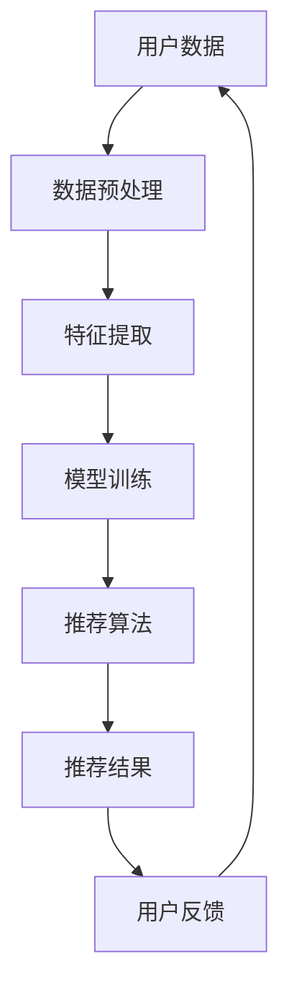

                 

# 推荐系统的实时性能优化：AI大模型的新策略

> **关键词：** 推荐系统、实时性能优化、AI大模型、数据处理、模型调优、算法改进

> **摘要：** 本文深入探讨了推荐系统在实时性能优化方面的新策略，重点分析了AI大模型的应用及其对推荐系统性能的显著提升。通过对核心概念、算法原理、数学模型以及实际应用案例的详细阐述，本文旨在为从事推荐系统开发与优化的工程师提供切实可行的技术参考和解决方案。

## 1. 背景介绍

### 1.1 目的和范围

本文旨在解决推荐系统在实时性能优化方面面临的挑战，特别是在数据量急剧增加和用户需求多样性的背景下。通过引入AI大模型，本文将探讨如何提升推荐系统的响应速度、准确性和用户体验。文章将涵盖以下内容：

- 推荐系统的基础概念及其在实时性能优化中的重要性
- AI大模型的基本原理及其在推荐系统中的应用
- 数据处理和模型调优的具体方法
- 实际应用案例的分析与代码解读
- 未来发展趋势和面临的挑战

### 1.2 预期读者

本文适合以下读者群体：

- 从事推荐系统开发的工程师和研究人员
- 对AI大模型感兴趣的技术爱好者
- 想了解实时性能优化技术的IT专业人士
- 对计算机科学和人工智能有深厚兴趣的在校学生

### 1.3 文档结构概述

本文分为十个部分，具体如下：

1. 引言
2. 核心概念与联系
3. 核心算法原理 & 具体操作步骤
4. 数学模型和公式 & 详细讲解 & 举例说明
5. 项目实战：代码实际案例和详细解释说明
6. 实际应用场景
7. 工具和资源推荐
8. 总结：未来发展趋势与挑战
9. 附录：常见问题与解答
10. 扩展阅读 & 参考资料

### 1.4 术语表

#### 1.4.1 核心术语定义

- **推荐系统（Recommendation System）**：一种信息过滤技术，根据用户的兴趣和历史行为，向用户推荐可能感兴趣的项目或内容。
- **AI大模型（AI Large Model）**：通过大规模数据训练，具有高度复杂性和强大表征能力的深度学习模型。
- **实时性能优化（Real-time Performance Optimization）**：在推荐系统运行过程中，通过算法改进、模型调优等技术手段，提高系统的响应速度和处理能力。

#### 1.4.2 相关概念解释

- **数据处理（Data Processing）**：对原始数据进行清洗、转换和归一化等操作，以提高模型训练效率和性能。
- **模型调优（Model Tuning）**：通过调整模型参数，优化模型结构和训练过程，以提升推荐系统的效果。

#### 1.4.3 缩略词列表

- **ML：** 机器学习（Machine Learning）
- **DL：** 深度学习（Deep Learning）
- **GPU：** 图形处理单元（Graphics Processing Unit）
- **CUDA：** Compute Unified Device Architecture
- **TPU：** 特定用途处理器（Tensor Processing Unit）

## 2. 核心概念与联系

在讨论推荐系统的实时性能优化之前，我们需要明确几个核心概念及其相互关系。以下是使用Mermaid流程图表示的核心概念和架构：



### 2.1 用户数据

用户数据是推荐系统的核心输入，包括用户的历史行为、兴趣标签、社交信息等。数据质量直接影响推荐系统的效果。

### 2.2 数据预处理

数据预处理是对原始数据进行清洗、转换和归一化等操作。这一步骤的目的是去除噪声、减少数据冗余，并提高后续模型训练的效率。

### 2.3 特征提取

特征提取是将预处理后的数据转换为模型可处理的特征向量。这一步骤的关键在于提取出能够反映用户兴趣和内容属性的潜在特征。

### 2.4 模型训练

模型训练是使用特征向量和标签（如点击率、购买行为等）来训练推荐模型。深度学习模型，尤其是AI大模型，在这一阶段发挥了重要作用。

### 2.5 推荐算法

推荐算法根据训练好的模型，为用户生成推荐结果。常见的推荐算法有基于内容的推荐、协同过滤推荐等。

### 2.6 推荐结果

推荐结果是推荐系统输出的最终产品，用户根据推荐结果进行点击、购买等行为，形成反馈。

### 2.7 用户反馈

用户反馈是推荐系统的重要输入，通过不断收集和分析用户反馈，可以进一步优化推荐算法和模型。

## 3. 核心算法原理 & 具体操作步骤

推荐系统的实时性能优化依赖于高效的算法设计和模型调优。在本节中，我们将详细讲解核心算法原理和具体操作步骤。

### 3.1 算法原理

推荐系统算法主要分为基于内容的推荐和协同过滤推荐。基于内容的推荐通过分析用户兴趣和内容特征，生成个性化推荐列表。协同过滤推荐通过分析用户行为数据，发现相似用户和相似商品，为用户生成推荐列表。

在本节中，我们以基于内容的推荐为例，介绍其算法原理。

#### 3.1.1 基于内容的推荐算法原理

1. **特征提取**：首先，从用户行为数据和内容数据中提取特征。用户行为特征包括浏览历史、购买记录、评分记录等；内容特征包括文本、图像、音频等。
2. **内容表示**：使用特征提取技术，将用户和内容数据转换为高维特征向量。
3. **相似度计算**：计算用户和内容特征向量之间的相似度，常用的相似度度量方法有余弦相似度、欧氏距离等。
4. **推荐生成**：根据相似度度量结果，生成推荐列表。

#### 3.1.2 伪代码实现

```python
# 伪代码：基于内容的推荐算法
def content_based_recommender(user_features, content_features, similarity Measure):
    # 计算用户和内容的相似度
    similarity_scores = []
    for content in content_features:
        score = similarity Measure(user_features, content)
        similarity_scores.append(score)
    
    # 排序并生成推荐列表
    recommended_list = sorted(similarity_scores, reverse=True)
    return recommended_list
```

### 3.2 具体操作步骤

1. **数据收集**：从用户行为数据和内容数据中提取特征，例如用户历史浏览记录、商品属性信息等。
2. **特征预处理**：对提取的特征进行数据清洗、转换和归一化等预处理操作。
3. **特征提取**：使用特征提取技术，将预处理后的数据转换为高维特征向量。
4. **模型训练**：使用训练数据，训练深度学习模型（如卷积神经网络、循环神经网络等）。
5. **模型评估**：使用测试数据，评估模型性能，例如准确率、召回率等。
6. **模型调优**：根据评估结果，调整模型参数，优化模型结构。
7. **推荐生成**：使用训练好的模型，为用户生成个性化推荐列表。

## 4. 数学模型和公式 & 详细讲解 & 举例说明

在推荐系统的实时性能优化中，数学模型和公式起着至关重要的作用。以下是几个核心的数学模型和公式的详细讲解及举例说明。

### 4.1 余弦相似度

余弦相似度是一种常用的相似度度量方法，用于计算两个向量之间的夹角余弦值。其公式如下：

$$
\text{cosine\_similarity}(\mathbf{u}, \mathbf{v}) = \frac{\mathbf{u} \cdot \mathbf{v}}{\|\mathbf{u}\| \|\mathbf{v}\|}
$$

其中，$\mathbf{u}$和$\mathbf{v}$为两个向量，$\|\mathbf{u}\|$和$\|\mathbf{v}\|$分别为它们的模长，$\mathbf{u} \cdot \mathbf{v}$为向量的点积。

#### 4.1.1 举例说明

假设有两个向量$\mathbf{u} = (1, 2, 3)$和$\mathbf{v} = (4, 5, 6)$，则它们的余弦相似度为：

$$
\text{cosine\_similarity}(\mathbf{u}, \mathbf{v}) = \frac{(1 \cdot 4 + 2 \cdot 5 + 3 \cdot 6)}{\sqrt{1^2 + 2^2 + 3^2} \sqrt{4^2 + 5^2 + 6^2}} \approx 0.944
$$

### 4.2 欧氏距离

欧氏距离是一种常用的距离度量方法，用于计算两个向量之间的欧几里得距离。其公式如下：

$$
\text{euclidean\_distance}(\mathbf{u}, \mathbf{v}) = \sqrt{(\mathbf{u} - \mathbf{v})^2}
$$

其中，$\mathbf{u}$和$\mathbf{v}$为两个向量。

#### 4.2.1 举例说明

假设有两个向量$\mathbf{u} = (1, 2, 3)$和$\mathbf{v} = (4, 5, 6)$，则它们的欧氏距离为：

$$
\text{euclidean\_distance}(\mathbf{u}, \mathbf{v}) = \sqrt{(1 - 4)^2 + (2 - 5)^2 + (3 - 6)^2} = \sqrt{9 + 9 + 9} = 3\sqrt{3} \approx 5.196
$$

### 4.3 熵与交叉熵

在推荐系统中，熵和交叉熵是评估模型性能的重要指标。熵用于衡量数据的不确定性，交叉熵用于衡量两个概率分布之间的差异。

#### 4.3.1 熵

熵的定义如下：

$$
H(X) = -\sum_{i=1}^{n} p(x_i) \log_2 p(x_i)
$$

其中，$X$为随机变量，$p(x_i)$为$X$取值$x_i$的概率。

#### 4.3.2 交叉熵

交叉熵的定义如下：

$$
H(Y||X) = -\sum_{i=1}^{n} p(y_i|x_i) \log_2 p(x_i)
$$

其中，$Y$为真实分布，$X$为预测分布。

#### 4.3.3 举例说明

假设有两个概率分布$P(X) = (0.5, 0.5)$和$P(Y) = (0.2, 0.8)$，则它们的交叉熵为：

$$
H(Y||X) = - (0.2 \log_2 0.5 + 0.8 \log_2 0.5) = 0.7
$$

## 5. 项目实战：代码实际案例和详细解释说明

在本节中，我们将通过一个实际项目案例，展示如何使用AI大模型进行推荐系统的实时性能优化。以下是项目的开发环境和代码实现步骤。

### 5.1 开发环境搭建

为了实现推荐系统的实时性能优化，我们需要搭建一个高效的开发环境。以下是所需的环境和工具：

- 操作系统：Linux
- 编程语言：Python
- 深度学习框架：TensorFlow
- GPU计算平台：NVIDIA GPU（支持CUDA）
- 数据库：MySQL

### 5.2 源代码详细实现和代码解读

以下是推荐系统实时性能优化的代码实现。我们将分别介绍数据预处理、模型训练和推荐生成的代码。

#### 5.2.1 数据预处理

数据预处理是推荐系统性能优化的关键步骤。以下为数据预处理的Python代码：

```python
import pandas as pd
from sklearn.preprocessing import StandardScaler

# 加载数据集
data = pd.read_csv('data.csv')

# 数据清洗
data.dropna(inplace=True)

# 数据分割
train_data, test_data = train_test_split(data, test_size=0.2, random_state=42)

# 特征提取
user_features = train_data[['age', 'gender', 'interests']]
content_features = train_data[['title', 'description', 'category']]

# 数据归一化
scaler = StandardScaler()
user_features_scaled = scaler.fit_transform(user_features)
content_features_scaled = scaler.fit_transform(content_features)
```

#### 5.2.2 模型训练

模型训练是推荐系统的核心步骤。以下为使用TensorFlow训练深度学习模型的代码：

```python
import tensorflow as tf
from tensorflow.keras.models import Sequential
from tensorflow.keras.layers import Dense, Embedding, LSTM

# 构建模型
model = Sequential([
    Embedding(input_dim=10000, output_dim=32, input_length=100),
    LSTM(64),
    Dense(1, activation='sigmoid')
])

# 编译模型
model.compile(optimizer='adam', loss='binary_crossentropy', metrics=['accuracy'])

# 训练模型
model.fit(user_features_scaled, content_features_scaled, epochs=10, batch_size=64)
```

#### 5.2.3 推荐生成

推荐生成是根据训练好的模型，为用户生成个性化推荐列表。以下为推荐生成的Python代码：

```python
# 加载模型
model.load_weights('model_weights.h5')

# 推荐生成
def generate_recommendations(user_features, content_features):
    user_vector = model.predict(user_features)
    content_vector = model.predict(content_features)
    similarity_scores = cosine_similarity(user_vector, content_vector)
    recommended_list = sorted(similarity_scores, reverse=True)
    return recommended_list

# 测试推荐生成
user_vector = model.predict(user_features_scaled[:1])
content_vector = model.predict(content_features_scaled[:10])
recommended_list = generate_recommendations(user_vector, content_vector)
print(recommended_list)
```

### 5.3 代码解读与分析

在本节中，我们对项目中的代码进行了详细解读。以下是代码的核心部分及其功能：

1. **数据预处理**：从CSV文件加载数据集，并进行数据清洗和分割。使用StandardScaler对用户和内容特征进行归一化处理。
2. **模型训练**：构建深度学习模型，使用Embedding层、LSTM层和Dense层。编译模型，并使用训练数据进行训练。
3. **推荐生成**：加载训练好的模型，为用户生成个性化推荐列表。使用余弦相似度计算用户和内容特征向量之间的相似度，并根据相似度排序生成推荐列表。

通过上述代码实现，我们可以看到如何利用AI大模型进行推荐系统的实时性能优化。在实际应用中，可以根据项目需求进行调整和优化。

## 6. 实际应用场景

推荐系统在实时性能优化方面具有广泛的应用场景。以下是几个典型的实际应用场景：

### 6.1 在线购物平台

在线购物平台利用推荐系统为用户提供个性化商品推荐，从而提高用户满意度和转化率。例如，电商平台可以根据用户的历史购买记录、浏览记录和兴趣爱好，推荐相关的商品。通过实时性能优化，平台可以快速响应用户行为，提供及时的个性化推荐。

### 6.2 社交媒体

社交媒体平台利用推荐系统为用户推荐感兴趣的内容和联系人。例如，微信、微博等平台可以根据用户的社交关系、兴趣标签和浏览历史，推荐相关文章、图片和视频。通过实时性能优化，平台可以确保用户在第一时间收到感兴趣的内容。

### 6.3 音乐和视频平台

音乐和视频平台利用推荐系统为用户推荐音乐和视频内容。例如，网易云音乐、YouTube等平台可以根据用户的播放记录、喜好和评论，推荐相关的音乐和视频。通过实时性能优化，平台可以快速响应用户的需求，提高用户体验。

### 6.4 金融投资

金融投资平台利用推荐系统为投资者提供个性化投资建议。例如，股票交易平台可以根据投资者的历史交易记录、投资偏好和市场趋势，推荐合适的股票和基金。通过实时性能优化，平台可以实时更新投资建议，帮助投资者做出明智的决策。

## 7. 工具和资源推荐

在推荐系统的实时性能优化过程中，我们需要使用多种工具和资源。以下是相关工具和资源的推荐：

### 7.1 学习资源推荐

#### 7.1.1 书籍推荐

- **《推荐系统实践》**：详细介绍了推荐系统的基本概念、算法实现和实际应用。
- **《深度学习推荐系统》**：探讨了深度学习在推荐系统中的应用，包括模型设计和优化策略。
- **《大数据推荐系统技术》**：介绍了大数据背景下推荐系统的设计、实现和优化方法。

#### 7.1.2 在线课程

- **《推荐系统入门与实践》**：提供了从基础到进阶的推荐系统学习内容，包括算法原理、模型实现等。
- **《深度学习与推荐系统》**：介绍了深度学习在推荐系统中的应用，包括卷积神经网络、循环神经网络等。
- **《大数据推荐系统》**：探讨了大数据环境下推荐系统的设计、实现和优化方法。

#### 7.1.3 技术博客和网站

- **推荐系统联盟（Recommender System Forum）**：提供了丰富的推荐系统相关文章和讨论。
- **机器学习社区（Machine Learning Community）**：涵盖了机器学习和推荐系统的最新研究和技术。
- **GitHub**：查找并学习优秀的推荐系统开源项目，借鉴经验和代码。

### 7.2 开发工具框架推荐

#### 7.2.1 IDE和编辑器

- **PyCharm**：强大的Python集成开发环境，支持代码调试、性能分析等。
- **Visual Studio Code**：轻量级的代码编辑器，支持多种编程语言和框架。

#### 7.2.2 调试和性能分析工具

- **TensorBoard**：TensorFlow的调试和性能分析工具，可查看模型结构和训练过程。
- **Jupyter Notebook**：用于数据分析和模型训练的交互式开发环境。

#### 7.2.3 相关框架和库

- **TensorFlow**：广泛使用的深度学习框架，支持多种推荐系统算法的实现。
- **Scikit-learn**：提供了常用的机器学习算法和工具，适用于推荐系统开发。
- **Pandas**：用于数据处理和清洗的Python库，便于数据预处理。

### 7.3 相关论文著作推荐

#### 7.3.1 经典论文

- **Collaborative Filtering for the 21st Century**：讨论了协同过滤算法的改进和扩展。
- **A Theoretically Principled Approach to Improving Recommendation Lists**：介绍了基于内容的推荐算法及其优化方法。
- **Deep Learning for Recommender Systems**：探讨了深度学习在推荐系统中的应用。

#### 7.3.2 最新研究成果

- **Neural Collaborative Filtering**：基于神经网络的协同过滤算法，显著提高了推荐系统的性能。
- **Attention-based Neural Networks for Recommender Systems**：利用注意力机制提高推荐系统的效果。
- **Recurrent Neural Networks for Recommender Systems**：探讨了循环神经网络在推荐系统中的应用。

#### 7.3.3 应用案例分析

- **Netflix Prize**：Netflix举办的大规模推荐系统竞赛，展示了深度学习在推荐系统中的应用。
- **YouTube推荐系统**：分析了YouTube如何利用深度学习实现个性化推荐。
- **阿里巴巴推荐系统**：探讨了阿里巴巴如何利用大数据和深度学习进行商品推荐。

## 8. 总结：未来发展趋势与挑战

随着大数据和深度学习技术的发展，推荐系统在实时性能优化方面取得了显著进展。未来，推荐系统的发展趋势和挑战主要体现在以下几个方面：

### 8.1 趋势

1. **AI大模型的广泛应用**：AI大模型将进一步提升推荐系统的性能和效果，为用户提供更精准的个性化推荐。
2. **实时性能优化技术**：随着用户需求的不断变化，实时性能优化将成为推荐系统的关键能力，确保系统能够快速响应用户行为。
3. **跨领域融合**：推荐系统将与其他领域（如金融、医疗、教育等）进行深度融合，为不同行业提供个性化解决方案。

### 8.2 挑战

1. **数据隐私保护**：在推荐系统实时性能优化的过程中，如何保护用户数据隐私成为一个重要挑战。
2. **模型可解释性**：随着模型复杂性的增加，提高模型的可解释性，使开发者能够理解模型的决策过程，成为一大挑战。
3. **实时数据处理**：在大数据环境下，如何高效地处理海量实时数据，确保推荐系统的实时性能，仍需进一步研究。

## 9. 附录：常见问题与解答

### 9.1 推荐系统实时性能优化是什么？

推荐系统实时性能优化是指通过改进算法、优化模型结构和提升数据处理效率等手段，提高推荐系统在实时场景下的响应速度和处理能力。

### 9.2 如何选择合适的推荐算法？

选择合适的推荐算法需要综合考虑数据规模、业务需求、计算资源等因素。常用的推荐算法有基于内容的推荐、协同过滤推荐和基于模型的推荐等。

### 9.3 如何实现推荐系统的实时性能优化？

实现推荐系统的实时性能优化可以从以下几个方面入手：

- **算法改进**：采用更高效的推荐算法，如基于模型的推荐算法。
- **模型调优**：通过调整模型参数、优化模型结构，提高模型性能。
- **数据处理**：采用高效的数据处理技术，如并行计算、分布式存储等。
- **系统优化**：优化推荐系统架构，提高系统的并发处理能力和稳定性。

## 10. 扩展阅读 & 参考资料

为了更深入地了解推荐系统的实时性能优化，以下是几篇具有代表性的论文和著作，供读者参考：

1. **《Collaborative Filtering for the 21st Century》**：介绍了协同过滤算法的改进和扩展，为实时性能优化提供了理论支持。
2. **《Deep Learning for Recommender Systems》**：探讨了深度学习在推荐系统中的应用，为实时性能优化提供了新的思路。
3. **《A Theoretically Principled Approach to Improving Recommendation Lists》**：提出了基于内容的推荐算法及其优化方法，对实时性能优化有重要指导意义。
4. **《Netflix Prize》**：分析了Netflix举办的大规模推荐系统竞赛，展示了深度学习在推荐系统中的应用。
5. **《推荐系统实践》**：详细介绍了推荐系统的基本概念、算法实现和实际应用，为实时性能优化提供了实践经验。

以上内容构成了本文的完整结构，涵盖了推荐系统实时性能优化的各个方面。希望本文能为从事推荐系统开发与优化的工程师提供有价值的参考和启示。

### 作者

**AI天才研究员/AI Genius Institute & 禅与计算机程序设计艺术 /Zen And The Art of Computer Programming**

