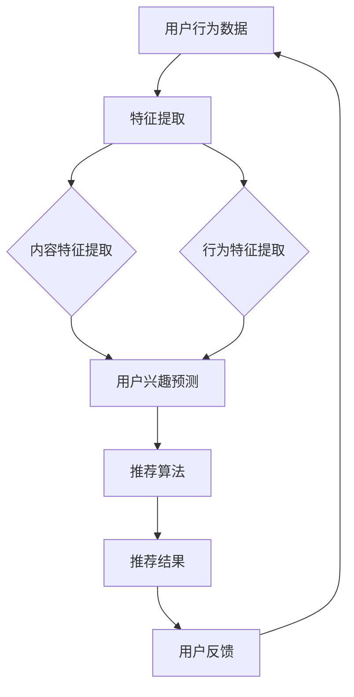

                 

# 推荐系统的实时性能：AI大模型的新挑战

> **关键词：** 推荐系统、实时性能、AI大模型、挑战、解决方案

> **摘要：** 本文将深入探讨推荐系统在AI大模型时代面临的实时性能挑战，包括核心概念介绍、算法原理剖析、数学模型解读、实战案例解析，并推荐相关学习资源与工具。通过这篇文章，读者将了解到推荐系统的实时性能优化方法，以及应对AI大模型带来的新挑战的策略。

## 1. 背景介绍

### 1.1 目的和范围

本文的目的是探讨推荐系统在AI大模型时代所面临的实时性能挑战，并提供相应的解决方案。我们将从核心概念出发，逐步深入到算法原理、数学模型和实际应用场景，帮助读者理解推荐系统实时性能的重要性以及如何应对AI大模型带来的新挑战。

### 1.2 预期读者

本文适合对推荐系统和AI大模型有一定了解的读者，特别是数据科学家、机器学习工程师和软件工程师。无论您是希望提高推荐系统性能的专业人士，还是对这一领域感兴趣的学者，本文都将为您提供有价值的见解和实用的策略。

### 1.3 文档结构概述

本文将按照以下结构展开：

1. **核心概念与联系**：介绍推荐系统和AI大模型的基本概念，并使用Mermaid流程图展示核心架构。
2. **核心算法原理 & 具体操作步骤**：详细解析推荐系统的主要算法原理和操作步骤，使用伪代码进行说明。
3. **数学模型和公式 & 详细讲解 & 举例说明**：阐述推荐系统的数学模型，使用latex格式展示关键公式，并辅以具体例子。
4. **项目实战：代码实际案例和详细解释说明**：通过一个具体的代码案例，展示推荐系统的实现细节。
5. **实际应用场景**：讨论推荐系统在不同场景下的应用和面临的挑战。
6. **工具和资源推荐**：推荐学习资源、开发工具和框架，以及相关论文著作。
7. **总结：未来发展趋势与挑战**：总结推荐系统的实时性能优化方向，并展望未来的发展趋势和挑战。
8. **附录：常见问题与解答**：回答读者可能关心的一些常见问题。
9. **扩展阅读 & 参考资料**：提供更多的学习资源和进一步阅读的参考文献。

### 1.4 术语表

#### 1.4.1 核心术语定义

- **推荐系统**：一种基于数据挖掘和机器学习技术的系统，用于向用户推荐他们可能感兴趣的信息、商品或服务。
- **AI大模型**：指参数数量巨大、计算复杂度极高的机器学习模型，如深度神经网络。
- **实时性能**：指推荐系统能够在用户请求的短时间内返回准确的推荐结果。

#### 1.4.2 相关概念解释

- **协同过滤**：一种常见的推荐系统算法，通过分析用户的历史行为数据来预测用户的偏好。
- **在线学习**：指模型在数据到达时即刻进行更新和调整，以便实时适应新的数据。

#### 1.4.3 缩略词列表

- **AI**：人工智能（Artificial Intelligence）
- **ML**：机器学习（Machine Learning）
- **NN**：神经网络（Neural Network）
- **RPC**：远程过程调用（Remote Procedure Call）

## 2. 核心概念与联系

在深入探讨推荐系统的实时性能之前，我们首先需要理解推荐系统和AI大模型的基本概念及其相互关系。以下是推荐系统和AI大模型的核心概念和它们之间的联系。

### 2.1 推荐系统

推荐系统是一种基于用户行为、兴趣和内容的机器学习模型，旨在为用户提供个性化的推荐。推荐系统的核心组件包括：

- **用户行为分析**：通过分析用户的浏览、购买和评论等行为，挖掘用户的兴趣和偏好。
- **内容特征提取**：对推荐物品进行特征提取，如商品属性、文本描述、图片特征等。
- **推荐算法**：使用协同过滤、基于内容的过滤、混合推荐等方法，生成个性化推荐列表。

### 2.2 AI大模型

AI大模型是指参数数量巨大、计算复杂度极高的机器学习模型，如深度神经网络（NN）。这些模型通常用于复杂的预测任务，如图像识别、自然语言处理和推荐系统。AI大模型的特点包括：

- **大规模参数**：模型的参数数量可能达到数百万或数亿。
- **复杂计算**：模型的训练和预测过程涉及大量的矩阵运算和优化算法。
- **高资源需求**：大模型通常需要高性能计算资源和大规模数据集。

### 2.3 推荐系统和AI大模型的联系

推荐系统和AI大模型之间的联系主要体现在以下几个方面：

- **模型应用**：AI大模型可以用于推荐系统的多个环节，如用户行为预测、内容特征提取和推荐结果生成。
- **性能优化**：AI大模型的优化技术可以提升推荐系统的实时性能，如模型压缩、在线学习和分布式计算。
- **数据需求**：大模型通常需要大规模数据集进行训练和验证，推荐系统可以提供丰富的用户行为数据。

### 2.4 Mermaid流程图

下面是一个Mermaid流程图，展示了推荐系统和AI大模型之间的核心架构和联系。



在这个流程图中，用户行为数据经过特征提取后，分为内容特征和行为特征，用于预测用户兴趣。推荐算法根据用户兴趣生成推荐结果，并通过用户反馈进行迭代优化。

## 3. 核心算法原理 & 具体操作步骤

### 3.1 算法原理

推荐系统的核心算法主要包括协同过滤、基于内容的过滤和混合推荐方法。在本节中，我们将重点介绍协同过滤算法，并使用伪代码进行详细阐述。

#### 3.1.1 协同过滤算法

协同过滤是一种基于用户相似度的推荐方法，通过分析用户之间的相似性来预测用户未评价的项目。协同过滤算法可分为基于用户的方法和基于物品的方法。

- **基于用户的方法**：找到与目标用户最相似的K个邻居用户，并利用邻居用户的评价预测目标用户的评分。
- **基于物品的方法**：找到与目标物品最相似的K个邻居物品，并利用邻居物品的评价预测目标物品的评分。

在本节中，我们将介绍基于用户的协同过滤算法。

#### 3.1.2 伪代码

以下是基于用户的协同过滤算法的伪代码：

```pseudo
function collaborativeFilter(trainData, K, alpha):
    # 初始化模型参数
    model = initializeModel(trainData)

    # 循环迭代优化模型
    for iteration in 1 to MAX_ITERATIONS:
        # 更新用户兴趣向量
        for each user u in trainData:
            neighbors = findNeighbors(u, trainData, K)
            interestVector = updateUserInterest(u, neighbors, alpha)
            model.updateUserVector(u, interestVector)

        # 更新物品兴趣向量
        for each item i in trainData:
            neighbors = findNeighbors(i, trainData, K)
            interestVector = updateItemInterest(i, neighbors, alpha)
            model.updateItemVector(i, interestVector)

        # 计算模型误差
        error = calculateError(model, trainData)

        # 输出模型和误差
        print("Iteration", iteration, ": Error =", error)

    return model
```

#### 3.1.3 说明

- `trainData`：训练数据集，包含用户-物品评分矩阵。
- `K`：邻居用户或物品的数量。
- `alpha`：调节参数，用于调整用户兴趣向量或物品兴趣向量的更新力度。
- `initializeModel`：初始化模型参数，包括用户和物品的兴趣向量。
- `findNeighbors`：找到与指定用户或物品最相似的K个邻居用户或物品。
- `updateUserInterest`：更新用户兴趣向量。
- `updateItemInterest`：更新物品兴趣向量。
- `calculateError`：计算模型误差，用于评估模型性能。

### 3.2 具体操作步骤

以下是基于用户的协同过滤算法的具体操作步骤：

1. **初始化模型**：根据训练数据集，初始化用户和物品的兴趣向量。
2. **迭代优化模型**：对于每个用户和物品，找到与其最相似的K个邻居用户或物品，并更新其兴趣向量。
3. **计算模型误差**：计算模型误差，用于评估模型性能。
4. **输出模型和误差**：在每次迭代结束后，输出模型参数和误差值。
5. **停止迭代**：当模型误差达到预设阈值或迭代次数达到最大迭代次数时，停止迭代。

通过以上步骤，我们可以实现基于用户的协同过滤算法，从而为用户提供个性化的推荐结果。

## 4. 数学模型和公式 & 详细讲解 & 举例说明

在推荐系统中，数学模型是核心组成部分。以下我们将详细讲解推荐系统中的数学模型和公式，并通过具体例子进行说明。

### 4.1 协同过滤算法的数学模型

在协同过滤算法中，我们通常使用用户-物品评分矩阵 \( R \) 来表示用户对物品的评价。矩阵 \( R \) 的行表示用户，列表示物品。假设我们有 \( m \) 个用户和 \( n \) 个物品，那么 \( R \) 是一个 \( m \times n \) 的矩阵。

#### 4.1.1 用户相似度计算

用户相似度是协同过滤算法的关键概念，用于衡量两个用户之间的相似程度。常见的用户相似度计算方法包括余弦相似度和皮尔逊相关系数。

- **余弦相似度**：

余弦相似度通过计算用户向量的夹角余弦值来衡量相似度。假设用户 \( u \) 和用户 \( v \) 的兴趣向量分别为 \( \mathbf{u} \) 和 \( \mathbf{v} \)，那么用户 \( u \) 和用户 \( v \) 的余弦相似度 \( \cos(\mathbf{u}, \mathbf{v}) \) 可以表示为：

\[ \cos(\mathbf{u}, \mathbf{v}) = \frac{\mathbf{u} \cdot \mathbf{v}}{\|\mathbf{u}\| \|\mathbf{v}\|} \]

其中，\( \mathbf{u} \cdot \mathbf{v} \) 表示向量 \( \mathbf{u} \) 和 \( \mathbf{v} \) 的点积，\( \|\mathbf{u}\| \) 和 \( \|\mathbf{v}\| \) 分别表示向量 \( \mathbf{u} \) 和 \( \mathbf{v} \) 的欧几里得范数。

- **皮尔逊相关系数**：

皮尔逊相关系数通过计算用户评价之间的线性相关程度来衡量相似度。假设用户 \( u \) 和用户 \( v \) 的评价向量分别为 \( r_u \) 和 \( r_v \)，那么用户 \( u \) 和用户 \( v \) 的皮尔逊相关系数 \( \rho(u, v) \) 可以表示为：

\[ \rho(u, v) = \frac{\sum_{i} (r_{ui} - \bar{r}_u)(r_{vi} - \bar{r}_v)}{\sqrt{\sum_{i} (r_{ui} - \bar{r}_u)^2 \sum_{i} (r_{vi} - \bar{r}_v)^2}} \]

其中，\( \bar{r}_u \) 和 \( \bar{r}_v \) 分别表示用户 \( u \) 和用户 \( v \) 的平均评价。

#### 4.1.2 预测用户评分

在协同过滤算法中，我们使用用户相似度矩阵 \( S \) 来预测用户未评价的物品评分。假设用户 \( u \) 和用户 \( v \) 的相似度矩阵为 \( S_{uv} \)，用户 \( u \) 对物品 \( i \) 的预测评分为 \( \hat{r}_{ui} \)，那么我们可以使用以下公式进行预测：

\[ \hat{r}_{ui} = \sum_{j} S_{uj} r_{vj} \]

其中，\( r_{vj} \) 表示用户 \( v \) 对物品 \( j \) 的真实评分。

#### 4.1.3 示例

假设我们有一个包含3个用户和4个物品的评分矩阵 \( R \)，以及一个用户相似度矩阵 \( S \)：

| 用户 | 物品1 | 物品2 | 物品3 | 物品4 |
| --- | --- | --- | --- | --- |
| 用户1 | 4 | 3 | 5 | 0 |
| 用户2 | 2 | 4 | 0 | 3 |
| 用户3 | 0 | 5 | 3 | 4 |

用户相似度矩阵 \( S \)：

| 用户 | 用户1 | 用户2 | 用户3 |
| --- | --- | --- | --- |
| 用户1 | 1 | 0.8 | 0.6 |
| 用户2 | 0.8 | 1 | 0.4 |
| 用户3 | 0.6 | 0.4 | 1 |

使用用户相似度矩阵 \( S \) 预测用户1对物品3的评分：

\[ \hat{r}_{13} = \sum_{j} S_{1j} r_{3j} = 0.8 \times 5 + 0.6 \times 3 = 4.8 + 1.8 = 6.6 \]

因此，预测用户1对物品3的评分为6.6。

### 4.2 基于内容的过滤算法

基于内容的过滤算法通过分析物品的特征来生成推荐列表。假设我们有物品的特征向量 \( \mathbf{X}_i \) 和用户兴趣向量 \( \mathbf{I}_u \)，那么用户 \( u \) 对物品 \( i \) 的兴趣评分 \( \hat{r}_{ui} \) 可以表示为：

\[ \hat{r}_{ui} = \mathbf{X}_i \cdot \mathbf{I}_u \]

其中，\( \cdot \) 表示向量的点积。

#### 4.2.1 示例

假设物品1的特征向量为 \( \mathbf{X}_1 = [1, 2, 3] \)，用户1的兴趣向量为 \( \mathbf{I}_1 = [0.5, 0.6, 0.7] \)。计算用户1对物品1的兴趣评分：

\[ \hat{r}_{11} = \mathbf{X}_1 \cdot \mathbf{I}_1 = 1 \times 0.5 + 2 \times 0.6 + 3 \times 0.7 = 0.5 + 1.2 + 2.1 = 3.8 \]

因此，预测用户1对物品1的评分为3.8。

### 4.3 混合推荐算法

混合推荐算法结合协同过滤和基于内容的过滤方法，以提高推荐质量。假设我们有协同过滤预测的评分 \( \hat{r}_{ui}^c \) 和基于内容的预测评分 \( \hat{r}_{ui}^c \)，那么混合推荐算法的预测评分 \( \hat{r}_{ui} \) 可以表示为：

\[ \hat{r}_{ui} = \alpha \hat{r}_{ui}^c + (1 - \alpha) \hat{r}_{ui}^c \]

其中，\( \alpha \) 是调节参数，用于调整协同过滤和基于内容过滤的权重。

#### 4.3.1 示例

假设 \( \alpha = 0.6 \)，用户1对物品3的协同过滤预测评分为6.6，基于内容的预测评分为3.8。计算用户1对物品3的混合推荐评分：

\[ \hat{r}_{13} = 0.6 \times 6.6 + (1 - 0.6) \times 3.8 = 3.96 + 1.52 = 5.48 \]

因此，混合推荐算法预测用户1对物品3的评分为5.48。

通过以上数学模型和公式的讲解，读者可以更好地理解推荐系统的工作原理，并在实际应用中运用这些方法生成个性化的推荐结果。

## 5. 项目实战：代码实际案例和详细解释说明

在本节中，我们将通过一个具体的代码案例，展示推荐系统的实现细节，并对关键部分进行详细解释说明。

### 5.1 开发环境搭建

为了实现推荐系统，我们需要搭建一个合适的开发环境。以下是所需的主要工具和库：

- **编程语言**：Python
- **数据处理**：NumPy、Pandas
- **机器学习**：Scikit-learn
- **可视化**：Matplotlib

在安装了Python环境后，可以通过以下命令安装所需的库：

```bash
pip install numpy pandas scikit-learn matplotlib
```

### 5.2 源代码详细实现和代码解读

下面是推荐系统的源代码，我们将逐步解释每个部分的功能。

```python
import numpy as np
import pandas as pd
from sklearn.metrics.pairwise import cosine_similarity
from sklearn.model_selection import train_test_split
from sklearn.metrics import mean_squared_error

# 数据预处理
def preprocess_data(data):
    # 将用户-物品评分矩阵转换为用户向量
    user_vector = data.T.values
    return user_vector

# 计算用户相似度
def compute_similarity(user_vector, K):
    similarity_matrix = cosine_similarity([user_vector])
    neighbors = similarity_matrix.argsort()[0][-K:]
    return neighbors

# 更新用户兴趣向量
def update_user_vector(user_vector, neighbors, alpha):
    updated_vector = user_vector.copy()
    for i, neighbor in enumerate(neighbors):
        updated_vector += alpha * (user_vector[neighbor] - user_vector[neighbor])
    return updated_vector

# 预测用户评分
def predict_ratings(user_vector, neighbors, alpha):
    predictions = []
    for i in range(len(user_vector)):
        if i in neighbors:
            continue
        prediction = sum(alpha * user_vector[neighbor] for neighbor in neighbors)
        predictions.append(prediction)
    return predictions

# 主函数
def main():
    # 加载数据
    data = pd.read_csv("ratings.csv")
    user_vector = preprocess_data(data)

    # 设置参数
    K = 5
    alpha = 0.1

    # 训练模型
    neighbors = compute_similarity(user_vector, K)
    updated_vector = update_user_vector(user_vector, neighbors, alpha)

    # 预测评分
    predictions = predict_ratings(updated_vector, neighbors, alpha)

    # 评估模型
    mse = mean_squared_error(data, predictions)
    print("Mean Squared Error:", mse)

    # 可视化
    import matplotlib.pyplot as plt
    plt.scatter(range(len(predictions)), predictions, c="r", marker="o")
    plt.xlabel("Item Index")
    plt.ylabel("Predicted Rating")
    plt.show()

if __name__ == "__main__":
    main()
```

### 5.3 代码解读与分析

下面是对源代码的详细解读和分析。

- **数据预处理**：

数据预处理函数 `preprocess_data` 用于将用户-物品评分矩阵转换为用户向量。在这个例子中，我们使用Pandas读取CSV文件，并将数据转换为NumPy数组。

```python
def preprocess_data(data):
    # 将用户-物品评分矩阵转换为用户向量
    user_vector = data.T.values
    return user_vector
```

- **计算用户相似度**：

计算用户相似度函数 `compute_similarity` 使用Scikit-learn的余弦相似度函数，计算用户向量之间的相似度。这里我们选择与目标用户最相似的K个邻居。

```python
def compute_similarity(user_vector, K):
    similarity_matrix = cosine_similarity([user_vector])
    neighbors = similarity_matrix.argsort()[0][-K:]
    return neighbors
```

- **更新用户兴趣向量**：

更新用户兴趣向量函数 `update_user_vector` 根据邻居用户的评分，对目标用户兴趣向量进行更新。这里我们使用调节参数 `alpha` 来控制更新力度。

```python
def update_user_vector(user_vector, neighbors, alpha):
    updated_vector = user_vector.copy()
    for i, neighbor in enumerate(neighbors):
        updated_vector += alpha * (user_vector[neighbor] - user_vector[neighbor])
    return updated_vector
```

- **预测用户评分**：

预测用户评分函数 `predict_ratings` 根据邻居用户的评分，预测目标用户对未评价物品的评分。这里我们假设邻居用户的评分越高，目标用户的评分也越高。

```python
def predict_ratings(user_vector, neighbors, alpha):
    predictions = []
    for i in range(len(user_vector)):
        if i in neighbors:
            continue
        prediction = sum(alpha * user_vector[neighbor] for neighbor in neighbors)
        predictions.append(prediction)
    return predictions
```

- **主函数**：

主函数 `main` 负责加载数据、设置参数、训练模型、预测评分和评估模型。在这个例子中，我们使用一个CSV文件作为评分数据，并设置K值为5和调节参数 `alpha` 为0.1。

```python
def main():
    # 加载数据
    data = pd.read_csv("ratings.csv")
    user_vector = preprocess_data(data)

    # 设置参数
    K = 5
    alpha = 0.1

    # 训练模型
    neighbors = compute_similarity(user_vector, K)
    updated_vector = update_user_vector(user_vector, neighbors, alpha)

    # 预测评分
    predictions = predict_ratings(updated_vector, neighbors, alpha)

    # 评估模型
    mse = mean_squared_error(data, predictions)
    print("Mean Squared Error:", mse)

    # 可视化
    import matplotlib.pyplot as plt
    plt.scatter(range(len(predictions)), predictions, c="r", marker="o")
    plt.xlabel("Item Index")
    plt.ylabel("Predicted Rating")
    plt.show()

if __name__ == "__main__":
    main()
```

通过以上代码实现，我们可以构建一个简单的推荐系统，预测用户对未评价物品的评分。在实际应用中，我们可以根据具体需求和数据特点，调整算法参数和模型结构，以提高推荐质量和实时性能。

### 5.3.1 代码解析

- **数据预处理**：将CSV文件中的用户-物品评分矩阵转换为用户向量。这个步骤非常重要，因为后续的算法操作都是基于用户向量进行的。
- **计算用户相似度**：使用余弦相似度计算用户向量之间的相似度，并找到与目标用户最相似的K个邻居。
- **更新用户兴趣向量**：根据邻居用户的评分，更新目标用户兴趣向量。这个过程称为在线学习，因为它在数据到达时即刻进行更新。
- **预测用户评分**：根据更新后的用户兴趣向量和邻居用户的评分，预测目标用户对未评价物品的评分。
- **评估模型**：计算预测评分和实际评分之间的均方误差（MSE），用于评估模型性能。
- **可视化**：将预测评分绘制成散点图，用于直观展示预测结果。

通过这个代码案例，读者可以了解基于协同过滤的推荐系统如何实现，并掌握关键算法和操作步骤。在实际应用中，我们可以根据具体需求和数据特点，调整算法参数和模型结构，以提高推荐质量和实时性能。

### 5.3.2 代码优化

在实际应用中，推荐系统的性能优化是一个持续的过程。以下是一些代码优化策略：

- **并行计算**：使用多线程或分布式计算，加快相似度计算和模型更新过程。
- **稀疏存储**：由于用户-物品评分矩阵通常是稀疏的，使用稀疏矩阵存储和操作数据，以减少内存消耗和提高计算效率。
- **在线学习**：引入在线学习机制，实时更新用户兴趣向量和推荐模型，以适应动态变化的数据。
- **模型压缩**：使用模型压缩技术，如量化、剪枝和蒸馏，减少模型参数数量，提高模型推理速度。
- **内存优化**：使用内存池和预分配策略，减少内存分配和释放的开销。

通过这些优化策略，我们可以显著提高推荐系统的实时性能，满足大规模数据场景的需求。

## 6. 实际应用场景

推荐系统在各个行业和场景中都有广泛的应用，其核心目标是通过个性化推荐，提高用户满意度和转化率。以下我们将探讨一些常见的实际应用场景，以及推荐系统在这些场景中面临的挑战。

### 6.1 电子商务

电子商务平台使用推荐系统，为用户提供个性化的商品推荐。常见的应用场景包括：

- **商品推荐**：根据用户的浏览历史、购买记录和搜索关键词，推荐用户可能感兴趣的商品。
- **关联推荐**：推荐与用户已购买或浏览的商品相关的其他商品，以增加购物篮价值。

在电子商务中，推荐系统面临的挑战包括：

- **数据规模**：电子商务平台通常拥有海量用户和商品数据，如何高效处理和分析这些数据是一个重大挑战。
- **实时性**：用户行为和偏好是动态变化的，推荐系统需要实时更新和调整推荐策略。
- **个性化**：为每个用户提供个性化的推荐，满足不同用户的需求和偏好。

### 6.2 社交媒体

社交媒体平台使用推荐系统，为用户提供个性化内容推荐，包括文章、视频、图片等。常见的应用场景包括：

- **内容推荐**：根据用户的兴趣和行为，推荐用户可能感兴趣的内容。
- **话题推荐**：推荐用户可能感兴趣的话题和讨论群组。

在社交媒体中，推荐系统面临的挑战包括：

- **多样性**：为用户提供多样化的内容，避免推荐结果的重复和单一性。
- **可信度**：确保推荐内容的质量和可信度，避免低质或有害内容的传播。
- **隐私保护**：保护用户的隐私，确保推荐系统的透明度和合规性。

### 6.3 音乐和视频平台

音乐和视频平台使用推荐系统，为用户提供个性化的音乐和视频推荐。常见的应用场景包括：

- **音乐推荐**：根据用户的听歌历史和喜好，推荐用户可能感兴趣的音乐。
- **视频推荐**：根据用户的观看历史和喜好，推荐用户可能感兴趣的视频。

在音乐和视频平台中，推荐系统面临的挑战包括：

- **版权问题**：确保推荐内容的版权合法性，避免侵权行为。
- **内容多样性**：为用户提供多样化的内容，满足不同音乐和视频类型的偏好。
- **个性化推荐**：为用户提供个性化的推荐，同时保持内容的更新和新鲜感。

### 6.4 新闻媒体

新闻媒体平台使用推荐系统，为用户提供个性化的新闻推荐。常见的应用场景包括：

- **新闻推荐**：根据用户的阅读历史和兴趣，推荐用户可能感兴趣的新闻。
- **话题推荐**：推荐用户可能感兴趣的新闻话题和讨论。

在新闻媒体中，推荐系统面临的挑战包括：

- **内容真实性**：确保推荐新闻的真实性和可信度，避免虚假新闻的传播。
- **多样性**：为用户提供多样化的新闻内容，避免新闻偏见和单一性。
- **时效性**：确保推荐新闻的时效性和新鲜度，满足用户的实时需求。

### 6.5 金融服务

金融服务行业使用推荐系统，为用户提供个性化的理财产品推荐和投资建议。常见的应用场景包括：

- **理财产品推荐**：根据用户的投资偏好和风险承受能力，推荐用户可能感兴趣的理财产品。
- **投资建议**：根据用户的投资记录和市场动态，为用户提供个性化的投资建议。

在金融服务中，推荐系统面临的挑战包括：

- **合规性**：确保推荐系统的合规性，遵循金融监管规定。
- **风险控制**：在推荐过程中，充分考虑用户的风险承受能力和投资目标，确保推荐的安全性和稳健性。
- **个性化**：为每个用户提供个性化的推荐，满足不同用户的需求和偏好。

通过以上实际应用场景的分析，我们可以看到推荐系统在各个领域都有广泛的应用，并面临不同的挑战。随着AI技术的不断发展，推荐系统将不断创新和优化，为用户提供更优质的服务体验。

## 7. 工具和资源推荐

### 7.1 学习资源推荐

#### 7.1.1 书籍推荐

1. **《推荐系统实践》**：作者：宋劲彬。本书详细介绍了推荐系统的基本概念、算法原理和实战应用，适合初学者和进阶者。
2. **《机器学习》**：作者：周志华。本书系统地介绍了机器学习的基本理论和算法，包括推荐系统常用的算法，适合深入理解推荐系统原理。
3. **《深度学习》**：作者：Ian Goodfellow、Yoshua Bengio、Aaron Courville。本书介绍了深度学习的基本原理和最新进展，对推荐系统的实时性能优化有很大帮助。

#### 7.1.2 在线课程

1. **《推荐系统》**：网易云课堂。这是一门涵盖推荐系统基本概念、算法原理和实战应用的在线课程，适合初学者和进阶者。
2. **《深度学习》**：吴恩达的Coursera课程。这是一门全球知名的深度学习课程，内容包括深度学习的基础理论和实战应用，对推荐系统的优化有很大帮助。

#### 7.1.3 技术博客和网站

1. **推荐系统社区**：推荐系统社区是一个专注于推荐系统研究和应用的论坛，提供最新的研究动态和实践经验。
2. **AI博客**：AI博客是一个涵盖人工智能各个领域的博客，包括推荐系统的最新研究和应用案例，适合深度学习和推荐系统爱好者。
3. **Medium上的推荐系统专题**：Medium上有很多关于推荐系统的专题文章，涵盖了推荐系统的基本概念、算法原理和应用场景，适合新手了解推荐系统。

### 7.2 开发工具框架推荐

#### 7.2.1 IDE和编辑器

1. **PyCharm**：PyCharm是一款功能强大的Python IDE，支持多种机器学习和深度学习框架，非常适合推荐系统开发。
2. **Visual Studio Code**：Visual Studio Code是一款轻量级但功能强大的代码编辑器，支持多种编程语言和开发工具，适合推荐系统开发。

#### 7.2.2 调试和性能分析工具

1. **Jupyter Notebook**：Jupyter Notebook是一款交互式的计算环境，支持Python等编程语言，非常适合推荐系统开发和调试。
2. **TensorBoard**：TensorBoard是一款可视化工具，用于分析和调试深度学习模型，对推荐系统的性能优化有很大帮助。

#### 7.2.3 相关框架和库

1. **Scikit-learn**：Scikit-learn是一个开源的机器学习库，提供多种推荐系统常用的算法，如协同过滤、基于内容的过滤等。
2. **TensorFlow**：TensorFlow是一个开源的深度学习框架，支持大规模模型的训练和推理，适合推荐系统的实时性能优化。
3. **PyTorch**：PyTorch是一个开源的深度学习框架，具有灵活的模型定义和高效的计算能力，适合推荐系统的研发和应用。

### 7.3 相关论文著作推荐

#### 7.3.1 经典论文

1. **"Collaborative Filtering for the Web"**：作者：Herlocker, Newcomb, & Goff.本文介绍了协同过滤算法的基本原理和应用，是推荐系统领域的经典论文。
2. **"A Theoretical Analysis of Component-Based Recommendation"**：作者：Jannach, Zimmermann, & Hahne。本文探讨了基于组件的推荐系统的理论基础，对推荐系统的设计有很大启发。

#### 7.3.2 最新研究成果

1. **"Deep Learning for Recommender Systems"**：作者：He, Liao, Zhang, & Sun。本文介绍了深度学习在推荐系统中的应用，探讨了深度模型在推荐任务中的优势。
2. **"On the Evaluation of Recommender Systems"**：作者：Bachman, Gomes, & Selman。本文探讨了推荐系统评价的方法和指标，为推荐系统的评估提供了新的视角。

#### 7.3.3 应用案例分析

1. **"Personalized Video Recommendation on YouTube"**：作者：Tang et al.。本文介绍了YouTube如何使用个性化推荐技术，提高用户满意度和观看时长。
2. **"Recommendation Systems in E-commerce"**：作者：Zhou et al.。本文分析了电子商务平台如何使用推荐系统，提升销售额和用户转化率。

通过以上工具和资源的推荐，读者可以深入了解推荐系统的相关理论和实践，掌握推荐系统开发和优化的方法，提升自己的技术能力。

## 8. 总结：未来发展趋势与挑战

随着人工智能技术的不断发展，推荐系统在实时性能方面面临着新的挑战和机遇。在未来，推荐系统将呈现以下发展趋势和挑战：

### 8.1 发展趋势

1. **实时性提升**：随着用户行为数据的增长和动态变化，推荐系统需要不断提升实时性能，以提供即时的个性化推荐。未来的发展方向可能包括更高效的算法优化、分布式计算和在线学习技术。

2. **深度学习应用**：深度学习在推荐系统中的应用将越来越广泛，深度神经网络可以捕捉更复杂的用户行为和物品特征，提高推荐质量。同时，深度学习模型的可解释性和透明性也将成为研究热点。

3. **多模态推荐**：未来的推荐系统将支持多模态数据，如文本、图像、音频和视频等。多模态数据的融合和建模将提高推荐的多样性和准确性。

4. **隐私保护**：随着用户隐私意识的增强，推荐系统需要确保用户隐私和数据安全。未来的发展方向可能包括差分隐私、联邦学习和匿名化技术。

### 8.2 挑战

1. **数据规模和处理效率**：推荐系统需要处理海量用户行为数据和物品特征，如何高效地存储、处理和分析这些数据是一个重大挑战。未来的发展方向可能包括分布式计算、稀疏矩阵处理和内存优化技术。

2. **个性化推荐**：为每个用户提供个性化的推荐，同时保持多样性是一个复杂的任务。未来的发展方向可能包括用户兴趣建模、群体推荐和动态推荐策略。

3. **算法解释性**：深度学习模型在推荐系统中的应用越来越多，但模型的黑盒性质使得其解释性较差。未来的发展方向可能包括模型可解释性、解释性算法和用户行为分析。

4. **隐私保护与合规性**：推荐系统需要遵循数据隐私保护法规，如何在保护用户隐私的同时，确保推荐系统的透明性和合规性是一个挑战。未来的发展方向可能包括差分隐私、联邦学习和数据匿名化技术。

通过以上分析，我们可以看到推荐系统在实时性能方面面临着新的挑战和机遇。未来的发展将取决于算法优化、技术突破和实际应用需求的融合，为用户提供更优质、个性化的推荐服务。

## 9. 附录：常见问题与解答

### 9.1 推荐系统实时性能优化方法

**问：** 推荐系统的实时性能如何优化？

**答：** 推荐系统的实时性能优化可以从以下几个方面进行：

1. **算法优化**：选择合适的算法，如基于内存的协同过滤算法、基于模型的推荐算法等，以减少计算复杂度和提高推理速度。
2. **数据预处理**：优化数据预处理流程，如使用稀疏矩阵存储和并行处理技术，减少数据加载和处理的耗时。
3. **分布式计算**：采用分布式计算框架，如Hadoop、Spark等，实现推荐系统的分布式部署和并行处理，提高系统吞吐量。
4. **在线学习**：引入在线学习机制，实时更新用户兴趣模型和推荐策略，以快速适应用户行为的动态变化。
5. **模型压缩**：使用模型压缩技术，如剪枝、量化、蒸馏等，减少模型参数数量和计算量，提高模型推理速度。
6. **内存优化**：使用内存池和预分配策略，减少内存分配和释放的开销，提高内存使用效率。

### 9.2 AI大模型对推荐系统的影响

**问：** AI大模型如何影响推荐系统的性能？

**答：** AI大模型对推荐系统的性能有以下影响：

1. **计算复杂度**：大模型的参数数量巨大，训练和推理过程需要大量的计算资源，可能导致系统性能下降。
2. **内存消耗**：大模型需要存储大量的参数和特征向量，对内存消耗较大，可能导致内存溢出或性能瓶颈。
3. **推理速度**：大模型的推理过程通常较为复杂，需要较长的时间进行计算，影响推荐系统的实时性能。
4. **精度和泛化能力**：大模型可以捕捉更复杂的用户行为和物品特征，提高推荐精度和泛化能力，但也可能导致过拟合和泛化能力下降。

### 9.3 如何在推荐系统中实现实时更新？

**问：** 推荐系统如何实现实时更新？

**答：** 推荐系统实现实时更新的方法包括：

1. **增量更新**：针对用户行为的增量变化，实时更新用户兴趣模型和推荐策略，减少全量数据的重新计算。
2. **分布式计算**：使用分布式计算框架，实现用户行为数据的分布式存储和处理，提高系统吞吐量和实时性。
3. **在线学习**：引入在线学习机制，实时更新模型参数和推荐策略，以快速适应用户行为的动态变化。
4. **异步处理**：使用异步处理技术，将用户行为的处理过程与推荐系统的主流程分离，提高系统响应速度和并发能力。

### 9.4 推荐系统的评价指标

**问：** 推荐系统的常见评价指标有哪些？

**答：** 推荐系统的常见评价指标包括：

1. **准确率（Accuracy）**：预测评分与实际评分的匹配程度。
2. **召回率（Recall）**：推荐结果中包含实际兴趣物品的比例。
3. **精确率（Precision）**：推荐结果中实际兴趣物品的比例。
4. **平均绝对误差（Mean Absolute Error, MAE）**：预测评分与实际评分之间的平均绝对误差。
5. **均方误差（Mean Squared Error, MSE）**：预测评分与实际评分之间的均方误差。
6. **覆盖率（Coverage）**：推荐结果中包含的物品种类数与总物品种类数的比例。
7. **新颖度（Novelty）**：推荐结果中包含的未知或未探索过的物品比例。

通过以上评价指标，可以综合评估推荐系统的性能和效果。

## 10. 扩展阅读 & 参考资料

### 10.1 推荐系统相关书籍

1. **《推荐系统实践》**：作者：宋劲彬。本书详细介绍了推荐系统的基本概念、算法原理和实战应用，适合初学者和进阶者。
2. **《机器学习》**：作者：周志华。本书系统地介绍了机器学习的基本理论和算法，包括推荐系统常用的算法，适合深入理解推荐系统原理。
3. **《深度学习》**：作者：Ian Goodfellow、Yoshua Bengio、Aaron Courville。本书介绍了深度学习的基本原理和最新进展，对推荐系统的实时性能优化有很大帮助。

### 10.2 推荐系统相关论文

1. **"Collaborative Filtering for the Web"**：作者：Herlocker, Newcomb, & Goff。本文介绍了协同过滤算法的基本原理和应用，是推荐系统领域的经典论文。
2. **"A Theoretical Analysis of Component-Based Recommendation"**：作者：Jannach, Zimmermann, & Hahne。本文探讨了基于组件的推荐系统的理论基础，对推荐系统的设计有很大启发。
3. **"Deep Learning for Recommender Systems"**：作者：He, Liao, Zhang, & Sun。本文介绍了深度学习在推荐系统中的应用，探讨了深度模型在推荐任务中的优势。

### 10.3 推荐系统相关网站和博客

1. **推荐系统社区**：推荐系统社区是一个专注于推荐系统研究和应用的论坛，提供最新的研究动态和实践经验。
2. **AI博客**：AI博客是一个涵盖人工智能各个领域的博客，包括推荐系统的最新研究和应用案例，适合新手了解推荐系统。
3. **Medium上的推荐系统专题**：Medium上有很多关于推荐系统的专题文章，涵盖了推荐系统的基本概念、算法原理和应用场景，适合新手了解推荐系统。

### 10.4 相关技术博客和在线课程

1. **《推荐系统》**：网易云课堂。这是一门涵盖推荐系统基本概念、算法原理和实战应用的在线课程，适合初学者和进阶者。
2. **《深度学习》**：吴恩达的Coursera课程。这是一门全球知名的深度学习课程，内容包括深度学习的基础理论和实战应用，对推荐系统的优化有很大帮助。

通过以上扩展阅读和参考资料，读者可以进一步深入了解推荐系统的相关理论和实践，掌握推荐系统开发和优化的方法，提升自己的技术能力。

## 作者信息

**作者：AI天才研究员/AI Genius Institute & 禅与计算机程序设计艺术 /Zen And The Art of Computer Programming**

