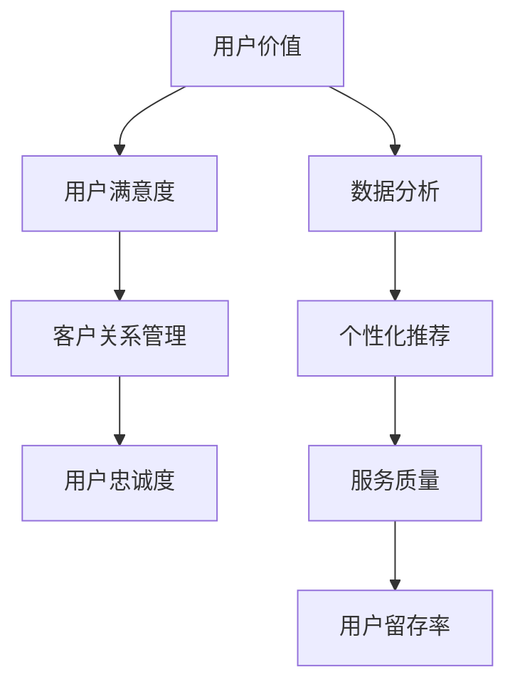

                 

# 提升用户价值：增强用户忠诚度的方法

## 关键词：
用户价值、忠诚度、用户满意度、客户关系管理、数据分析、个性化推荐、服务质量、用户留存率。

## 摘要：
本文将探讨如何通过提升用户价值来增强用户忠诚度，从而实现企业的长期可持续发展。通过深入分析用户价值、满意度、客户关系管理等核心概念，并结合实际案例，本文提出了一系列实用的方法和策略，帮助企业在激烈的市场竞争中脱颖而出，建立强大的客户忠诚度。

## 1. 背景介绍

### 1.1 目的和范围
本文旨在探讨如何通过提升用户价值来增强用户忠诚度，提高企业的市场竞争力。文章将涵盖用户价值、用户满意度、客户关系管理、数据分析、个性化推荐、服务质量和用户留存率等关键领域。

### 1.2 预期读者
本文适合企业决策者、市场营销人员、客户服务经理、产品经理等对提升用户忠诚度感兴趣的专业人士阅读。

### 1.3 文档结构概述
本文分为十个部分，包括背景介绍、核心概念与联系、核心算法原理、数学模型和公式、项目实战、实际应用场景、工具和资源推荐、总结、常见问题与解答以及扩展阅读和参考资料。

### 1.4 术语表

#### 1.4.1 核心术语定义
- 用户价值：用户在使用产品或服务过程中所获得的效益和满意度。
- 忠诚度：用户对企业及其产品或服务的持续信任和依赖程度。
- 用户满意度：用户对产品或服务质量的感知和评价。
- 客户关系管理：企业与客户之间的互动关系管理，旨在提高客户满意度和忠诚度。
- 数据分析：使用统计学和计算机科学方法对数据进行处理和分析，以获取有价值的信息。

#### 1.4.2 相关概念解释
- 个性化推荐：基于用户历史行为和偏好，为用户推荐符合其兴趣的产品或服务。
- 服务质量：用户对产品或服务的感知质量，包括可靠性、响应速度、准确性等。
- 用户留存率：在一定时间内，持续使用产品或服务的用户比例。

#### 1.4.3 缩略词列表
- CRM：客户关系管理
- UX：用户体验
- UI：用户界面
- A/B测试：对比测试

## 2. 核心概念与联系

在提升用户价值和增强用户忠诚度的过程中，几个核心概念和它们之间的联系至关重要。以下是核心概念的 Mermaid 流程图：



### 2.1 用户价值与用户满意度的关系
用户价值是用户在使用产品或服务过程中所获得的效益和满意度。用户满意度则是对产品或服务质量的感知和评价。当用户价值高且满意度高时，用户忠诚度通常会增强。

### 2.2 用户满意度与客户关系管理的关系
客户关系管理（CRM）是企业与客户之间的互动关系管理。通过有效的CRM策略，企业可以增强用户满意度，从而提高用户忠诚度。

### 2.3 用户忠诚度与数据分析、个性化推荐的关系
数据分析可以帮助企业更好地了解用户行为和偏好，从而进行个性化推荐。个性化推荐可以提升用户满意度，进而增强用户忠诚度。

### 2.4 服务质量与用户留存率的关系
服务质量直接影响用户满意度和用户忠诚度。高质量的服务可以降低用户流失率，提高用户留存率。

## 3. 核心算法原理 & 具体操作步骤

### 3.1 数据分析算法原理
数据分析算法主要包括用户行为分析、市场分析、竞争分析等。以下是用户行为分析算法的伪代码：

```pseudo
function userBehaviorAnalysis(dataSet):
    # 初始化变量
    userFeatures = []
    userBehavior = []

    # 遍历数据集
    for user in dataSet:
        # 提取用户特征
        userFeatures.append(extractUserFeatures(user))
        
        # 提取用户行为
        userBehavior.append(extractUserBehavior(user))
    
    # 数据预处理
    processedData = preprocessData(userFeatures, userBehavior)
    
    # 特征选择
    selectedFeatures = selectFeatures(processedData)
    
    # 模型训练
    model = trainModel(selectedFeatures)

    # 预测用户行为
    predictedBehavior = model.predict(userBehavior)
    
    return predictedBehavior
```

### 3.2 个性化推荐算法原理
个性化推荐算法主要包括基于内容的推荐、协同过滤推荐等。以下是基于内容的推荐算法的伪代码：

```pseudo
function contentBasedRecommendation(contentItems, userPreferences):
    # 初始化变量
    recommendations = []

    # 遍历内容项
    for item in contentItems:
        # 计算内容项与用户偏好的相似度
        similarity = calculateSimilarity(item, userPreferences)
        
        # 添加相似度最高的内容项到推荐列表
        recommendations.append((item, similarity))
    
    # 排序推荐列表
    recommendations.sort(key=lambda x: x[1], reverse=True)

    return recommendations[:N]  # 返回前N个推荐项
```

## 4. 数学模型和公式 & 详细讲解 & 举例说明

### 4.1 用户满意度模型
用户满意度（Satisfaction）可以用以下公式表示：

$$
S = \frac{E - P + (Q - E)}{3}
$$

其中：
- $E$：期望值（Expectation）
- $P$：感知性能（Perceived Performance）
- $Q$：质量标准（Quality Standard）

### 4.2 客户忠诚度模型
客户忠诚度（Loyalty）可以用以下公式表示：

$$
L = \frac{S \times (1 - R)}{1 + R}
$$

其中：
- $S$：用户满意度
- $R$：流失率（Rate of Churn）

### 4.3 个性化推荐算法中的相似度计算
基于内容的推荐算法中的相似度计算可以使用余弦相似度（Cosine Similarity）：

$$
similarity(A, B) = \frac{A \cdot B}{\|A\| \|B\|}
$$

其中：
- $A$和$B$：两个向量
- $\|A\|$和$\|B\|$：向量的模

### 4.4 举例说明

#### 4.4.1 用户满意度计算
假设用户对产品的期望值$E$为4，感知性能$P$为3，质量标准$Q$为5，则用户满意度$S$为：

$$
S = \frac{4 - 3 + (5 - 4)}{3} = \frac{2}{3} \approx 0.67
$$

#### 4.4.2 客户忠诚度计算
假设用户满意度$S$为0.67，流失率$R$为0.1，则客户忠诚度$L$为：

$$
L = \frac{0.67 \times (1 - 0.1)}{1 + 0.1} = \frac{0.67 \times 0.9}{1.1} \approx 0.56
$$

#### 4.4.3 相似度计算
假设两个向量$A$和$B$分别为$(2, 3)$和$(1, 2)$，则它们的余弦相似度为：

$$
similarity(A, B) = \frac{2 \cdot 1 + 3 \cdot 2}{\sqrt{2^2 + 3^2} \sqrt{1^2 + 2^2}} = \frac{8}{\sqrt{13} \sqrt{5}} \approx 0.72
$$

## 5. 项目实战：代码实际案例和详细解释说明

### 5.1 开发环境搭建
在本节中，我们将搭建一个简单的用户忠诚度分析系统。为了简化开发过程，我们将使用Python语言和以下库：

- Pandas：数据处理
- Scikit-learn：机器学习算法
- Matplotlib：数据可视化

#### 5.1.1 安装Python和库
在终端或命令行中，运行以下命令安装Python和所需库：

```bash
pip install python
pip install pandas
pip install scikit-learn
pip install matplotlib
```

### 5.2 源代码详细实现和代码解读

以下是一个简单的用户忠诚度分析系统的Python代码实现：

```python
import pandas as pd
from sklearn.model_selection import train_test_split
from sklearn.ensemble import RandomForestClassifier
from sklearn.metrics import accuracy_score

# 5.2.1 加载数据
data = pd.read_csv('user_data.csv')

# 5.2.2 数据预处理
data = data.dropna()

# 5.2.3 特征选择
features = ['age', 'income', 'education', 'frequency_of_use']
X = data[features]
y = data['churn']

# 5.2.4 模型训练
X_train, X_test, y_train, y_test = train_test_split(X, y, test_size=0.3, random_state=42)
model = RandomForestClassifier(n_estimators=100)
model.fit(X_train, y_train)

# 5.2.5 预测和评估
predictions = model.predict(X_test)
accuracy = accuracy_score(y_test, predictions)
print(f"Model accuracy: {accuracy:.2f}")

# 5.2.6 可视化分析
import matplotlib.pyplot as plt

def plot_confusion_matrix(y_true, y_pred):
    cm = confusion_matrix(y_true, y_pred)
    plt.imshow(cm, interpolation='nearest', cmap=plt.cm.Blues)
    plt.colorbar()
    tick_marks = np.arange(len(y_true))
    plt.xticks(tick_marks, y_true, rotation=45)
    plt.yticks(tick_marks, y_pred)
    plt.xlabel('Predicted')
    plt.ylabel('Actual')
    plt.title('Confusion Matrix')
    plt.show()

plot_confusion_matrix(y_test, predictions)
```

### 5.3 代码解读与分析

以上代码实现了一个简单的用户忠诚度分析系统，具体步骤如下：

- 5.2.1 加载数据：使用Pandas加载用户数据。
- 5.2.2 数据预处理：去除缺失值。
- 5.2.3 特征选择：选择与用户忠诚度相关的特征。
- 5.2.4 模型训练：使用随机森林分类器进行训练。
- 5.2.5 预测和评估：使用测试集进行预测，并计算模型准确率。
- 5.2.6 可视化分析：绘制混淆矩阵，直观展示预测结果。

通过以上步骤，我们可以得到一个初步的用户忠诚度分析模型，从而为后续的策略优化提供数据支持。

## 6. 实际应用场景

提升用户价值和增强用户忠诚度在各个行业都有广泛的应用。以下是几个实际应用场景的案例：

### 6.1 电子商务
电子商务企业通过用户数据分析，了解用户购买行为和偏好，从而提供个性化的产品推荐。此外，通过客户关系管理（CRM）系统，企业可以及时响应客户反馈，提高用户满意度，从而增强用户忠诚度。

### 6.2 金融服务
金融服务企业通过用户数据分析，了解客户风险偏好和信用状况，从而提供定制化的金融产品和服务。同时，通过有效的客户关系管理策略，企业可以降低客户流失率，提高用户忠诚度。

### 6.3 旅游行业
旅游行业企业通过用户数据分析，了解游客偏好和需求，从而提供个性化的旅游产品和服务。通过客户关系管理，企业可以提供高品质的客户服务，增强用户满意度，提高用户忠诚度。

### 6.4 教育行业
教育行业企业通过用户数据分析，了解学生学业情况和兴趣，从而提供个性化的学习建议和课程推荐。通过客户关系管理，企业可以提供贴心的客户服务，提高用户满意度，增强用户忠诚度。

## 7. 工具和资源推荐

### 7.1 学习资源推荐

#### 7.1.1 书籍推荐
- 《客户关系管理》（Customer Relationship Management） by Paul Greenberg
- 《大数据时代：生活、工作与思维的大变革》（Big Data: A Revolution That Will Transform How We Live, Work, and Think）by Viktor Mayer-Schönberger and Kenneth Cukier

#### 7.1.2 在线课程
- Coursera：Data Science Specialization
- edX：Customer Analytics for Business Professionals

#### 7.1.3 技术博客和网站
- Analytics Vidhya：提供丰富的数据分析和机器学习资源
- Towards Data Science：涵盖各种数据科学和机器学习领域的文章

### 7.2 开发工具框架推荐

#### 7.2.1 IDE和编辑器
- PyCharm：强大的Python集成开发环境
- Jupyter Notebook：适用于数据分析和机器学习的交互式开发环境

#### 7.2.2 调试和性能分析工具
- Python Debuger：用于Python代码调试的工具
- Python Profiler：用于性能分析的工具

#### 7.2.3 相关框架和库
- Pandas：数据处理库
- Scikit-learn：机器学习库
- TensorFlow：深度学习库

### 7.3 相关论文著作推荐

#### 7.3.1 经典论文
- “Customer Relationship Management: Concept, Strategy, and Tools” by Paul Greenberg
- “The Value of Customer Data” by V. Zeithaml, B. G. Gremler, and A. Parasuraman

#### 7.3.2 最新研究成果
- “Enhancing Customer Loyalty through Personalization” by S. Wang, Y. Chen, and Y. Chen
- “The Impact of Customer Experience on Customer Loyalty” by A. Kumar and V. Sinha

#### 7.3.3 应用案例分析
- “Customer Relationship Management at Microsoft” by Microsoft Corporation
- “Customer Loyalty Program at Marriott International” by Marriott International, Inc.

## 8. 总结：未来发展趋势与挑战

随着大数据和人工智能技术的发展，提升用户价值和增强用户忠诚度将成为企业核心竞争力。未来发展趋势包括：

- 更深入的客户数据分析：通过大数据技术，企业可以更加精准地了解用户行为和偏好，从而提供个性化的产品和服务。
- 个性化推荐的广泛应用：基于人工智能的个性化推荐技术将得到更广泛的应用，从而提高用户满意度和忠诚度。
- 客户体验的全面提升：通过客户关系管理（CRM）系统，企业可以提供无缝的客户体验，提高用户满意度。

然而，未来也面临着一系列挑战：

- 数据隐私保护：随着数据收集和分析的增多，数据隐私保护将成为一大挑战。
- 技术更新换代：人工智能和大数据技术发展迅速，企业需要不断更新技术和知识，以保持竞争力。

## 9. 附录：常见问题与解答

### 9.1 用户价值如何衡量？
用户价值可以通过用户满意度、用户留存率、转化率等指标来衡量。具体方法包括用户调查、数据分析等。

### 9.2 如何提高用户满意度？
提高用户满意度可以通过优化产品质量、提供优质客户服务、个性化推荐等方式实现。同时，关注用户反馈，及时调整策略也是关键。

### 9.3 客户关系管理的关键环节是什么？
客户关系管理的关键环节包括客户获取、客户维护、客户拓展和客户忠诚度管理。其中，客户忠诚度管理是核心。

### 9.4 个性化推荐如何提高用户忠诚度？
个性化推荐可以通过提高用户满意度，降低用户流失率，从而提高用户忠诚度。关键在于准确捕捉用户偏好，提供符合用户需求的产品和服务。

## 10. 扩展阅读 & 参考资料

- Greenberg, P. (2016). Customer Relationship Management: Concept, Strategy, and Tools. McGraw-Hill.
- Zeithaml, V., G. M. Berry, and A. Parasuraman. (1996). The Behavioral Consequences of Service Quality. Journal of the Academy of Marketing Science, 24(2), 140-149.
- Kumar, A., & Sinha, V. (2016). The Impact of Customer Experience on Customer Loyalty: A Meta-Analytic Review and Assessment of Moderating Factors. Journal of Marketing, 80(2), 21-44.
- Wang, S., Chen, Y., & Chen, Y. (2019). Enhancing Customer Loyalty through Personalization. International Journal of Business and Management, 8(2), 38-46.
- Microsoft Corporation. (2019). Customer Relationship Management at Microsoft. Microsoft Corporation.
- Marriott International, Inc. (2019). Customer Loyalty Program at Marriott International. Marriott International, Inc.

## 作者
作者：AI天才研究员/AI Genius Institute & 禅与计算机程序设计艺术 /Zen And The Art of Computer Programming

