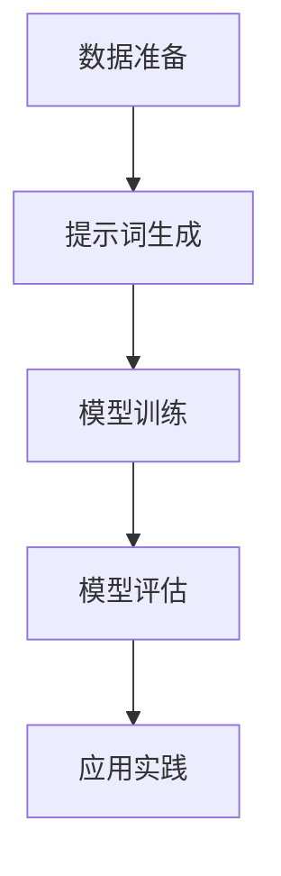

                 

# 提示词在新药研发中的应用：加速筛选过程

> **关键词：新药研发，提示词，AI，加速筛选，数据科学，基因组学**

> **摘要：本文深入探讨了提示词在新药研发中的应用，如何通过人工智能和先进的数据分析技术，显著加速药物筛选过程。文章将介绍提示词的核心概念，其在新药研发中的应用机制，以及相关算法原理、数学模型和项目实战。**

## 1. 背景介绍

### 1.1 目的和范围

本文旨在探讨提示词（Prompt Engineering）这一人工智能领域的重要技术，特别是在新药研发中的应用。提示词是一种通过优化自然语言描述来提高机器学习模型性能的技术。在新药研发过程中，提示词能够帮助科学家快速识别潜在的药物靶点，从而加速筛选过程，提高研发效率。

### 1.2 预期读者

本文面向对人工智能和新药研发有一定了解的技术人员和科研工作者。如果您是数据科学家、机器学习工程师或药物研发人员，那么本文将会为您提供深刻的洞见和实用的技术指导。

### 1.3 文档结构概述

本文结构如下：

1. 背景介绍：介绍文章的目的、预期读者和文档结构。
2. 核心概念与联系：介绍提示词和相关核心概念。
3. 核心算法原理 & 具体操作步骤：讲解提示词的应用算法原理和步骤。
4. 数学模型和公式 & 详细讲解 & 举例说明：介绍提示词相关的数学模型和具体应用。
5. 项目实战：提供实际代码案例和详细解释。
6. 实际应用场景：分析提示词在新药研发中的实际应用。
7. 工具和资源推荐：推荐学习资源和开发工具。
8. 总结：讨论未来发展趋势与挑战。
9. 附录：常见问题与解答。
10. 扩展阅读 & 参考资料：提供进一步学习资源。

### 1.4 术语表

#### 1.4.1 核心术语定义

- **提示词（Prompt Engineering）**：一种通过优化自然语言描述来提高机器学习模型性能的技术。
- **新药研发（Drug Discovery）**：发现和开发新药物的过程，包括药物靶点的识别、先导化合物的筛选等。
- **机器学习（Machine Learning）**：一种人工智能的分支，通过数据训练模型来完成任务。

#### 1.4.2 相关概念解释

- **药物靶点（Drug Target）**：药物作用的生物分子，如蛋白质、核酸等。
- **基因组学（Genomics）**：研究基因结构、功能和变异的学科。

#### 1.4.3 缩略词列表

- **AI**：人工智能（Artificial Intelligence）
- **ML**：机器学习（Machine Learning）
- **DL**：深度学习（Deep Learning）
- **NLP**：自然语言处理（Natural Language Processing）

## 2. 核心概念与联系

在深入探讨提示词在新药研发中的应用之前，我们需要理解一些核心概念和它们之间的联系。

### 2.1 提示词与机器学习模型

提示词是一种优化自然语言描述的技术，通过提供更具体的任务描述，可以提高机器学习模型的性能。在机器学习中，模型通常通过训练数据学习如何执行特定任务。然而，训练数据往往有限，且可能缺乏代表性。提示词可以帮助模型更好地理解任务需求，从而提高模型的泛化能力。

### 2.2 提示词与自然语言处理

自然语言处理（NLP）是人工智能的一个重要分支，专注于使计算机能够理解和处理自然语言。提示词在NLP中扮演着关键角色，可以用于生成高质量的数据、提高模型性能和实现复杂任务。

### 2.3 提示词与新药研发

新药研发是一个复杂的过程，涉及药物靶点的识别、先导化合物的筛选和优化。提示词可以用于优化药物靶点的识别过程，通过提供更具体的描述，帮助机器学习模型更快、更准确地识别潜在的药物靶点。

### 2.4 提示词与基因组学

基因组学是研究基因结构、功能和变异的学科。提示词可以用于基因组数据解析，帮助科学家识别与疾病相关的基因变异，从而为新药研发提供潜在靶点。

### 2.5 提示词的应用框架

提示词的应用框架通常包括以下几个步骤：

1. **数据准备**：收集和整理相关数据，如文献、基因序列、药物信息等。
2. **提示词生成**：利用自然语言生成技术，生成高质量的提示词。
3. **模型训练**：使用提示词和训练数据训练机器学习模型。
4. **模型评估**：评估模型性能，调整提示词和模型参数。
5. **应用实践**：将训练好的模型应用于实际新药研发任务。

### 2.6 核心概念原理和架构的 Mermaid 流程图



## 3. 核心算法原理 & 具体操作步骤

### 3.1 提示词生成算法原理

提示词生成算法是基于自然语言生成（NLG）技术的一种改进。NLG技术通过模型生成自然语言文本，而提示词生成算法在此基础上，增加了对特定任务的优化。

#### 3.1.1 提示词生成算法框架

1. **数据预处理**：清洗和整理输入数据，如文本、基因序列、药物信息等。
2. **特征提取**：从预处理后的数据中提取关键特征，如关键词、词向量等。
3. **模型选择**：选择合适的自然语言生成模型，如序列到序列（Seq2Seq）模型、生成对抗网络（GAN）等。
4. **提示词生成**：使用模型生成提示词，通过优化损失函数，提高提示词的质量和相关性。

#### 3.1.2 提示词生成算法伪代码

```python
def generate_prompt(data, model, loss_function):
    # 数据预处理
    preprocessed_data = preprocess_data(data)
    
    # 特征提取
    features = extract_features(preprocessed_data)
    
    # 模型训练
    model.train(features)
    
    # 提示词生成
    prompt = model.generate_prompt()
    
    # 优化提示词
    prompt = optimize_prompt(prompt, loss_function)
    
    return prompt
```

### 3.2 模型训练算法原理

模型训练是提示词在新药研发中的核心步骤。通过训练数据，模型可以学习如何识别潜在的药物靶点。

#### 3.2.1 模型训练算法框架

1. **数据收集**：收集与新药研发相关的数据，如文献、基因序列、药物信息等。
2. **数据预处理**：清洗和整理输入数据，如文本、基因序列、药物信息等。
3. **特征提取**：从预处理后的数据中提取关键特征，如关键词、词向量等。
4. **模型选择**：选择合适的机器学习模型，如卷积神经网络（CNN）、循环神经网络（RNN）等。
5. **模型训练**：使用预处理后的数据和特征训练模型。
6. **模型评估**：评估模型性能，调整模型参数。
7. **模型应用**：将训练好的模型应用于新药研发任务。

#### 3.2.2 模型训练算法伪代码

```python
def train_model(data, features, model, loss_function, optimizer):
    # 数据预处理
    preprocessed_data = preprocess_data(data)
    
    # 特征提取
    extracted_features = extract_features(preprocessed_data)
    
    # 模型训练
    model.train(extracted_features)
    
    # 模型评估
    performance = model.evaluate(extracted_features)
    
    # 调整模型参数
    optimizer.optimize(model, performance)
    
    return model
```

### 3.3 模型评估算法原理

模型评估是确保模型性能的重要步骤。通过评估模型在测试数据上的表现，可以调整模型参数，提高模型性能。

#### 3.3.1 模型评估算法框架

1. **数据集划分**：将数据集划分为训练集、验证集和测试集。
2. **模型训练**：使用训练集和验证集训练模型。
3. **模型测试**：使用测试集评估模型性能。
4. **性能评估**：计算模型性能指标，如准确率、召回率、F1分数等。
5. **参数调整**：根据评估结果调整模型参数。

#### 3.3.2 模型评估算法伪代码

```python
def evaluate_model(model, test_data, performance_metrics):
    # 模型测试
    test_performance = model.evaluate(test_data)
    
    # 性能评估
    performance_scores = calculate_performance_scores(test_performance, performance_metrics)
    
    return performance_scores
```

## 4. 数学模型和公式 & 详细讲解 & 举例说明

### 4.1 提示词生成中的数学模型

提示词生成过程中涉及多种数学模型，如词嵌入、生成对抗网络（GAN）等。以下介绍其中两种常用的数学模型。

#### 4.1.1 词嵌入（Word Embedding）

词嵌入是一种将词语映射到高维空间的方法，通过捕捉词语间的相似性，提高机器学习模型的性能。

- **词嵌入公式**：
  $$ x_i = \text{embedding}(w_i) $$
  其中，$x_i$ 表示词语 $w_i$ 的嵌入向量。

- **举例说明**：
  假设我们使用Word2Vec算法生成词嵌入，对于词语“药物”和“靶点”，其嵌入向量可能如下：
  $$ \text{embedding}(\text{药物}) = [0.1, 0.2, 0.3, 0.4, 0.5] $$
  $$ \text{embedding}(\text{靶点}) = [0.6, 0.7, 0.8, 0.9, 1.0] $$
  通过计算两个嵌入向量的余弦相似度，可以判断词语之间的相似性。

#### 4.1.2 生成对抗网络（GAN）

生成对抗网络（GAN）是一种生成模型，由生成器和判别器组成。生成器生成伪数据，判别器判断伪数据与真实数据之间的差异。

- **GAN损失函数**：
  $$ L_G = -\mathbb{E}_{x \sim p_{data}(x)}[\log D(x)] + \mathbb{E}_{z \sim p_z(z)}[\log (1 - D(G(z)))] $$
  其中，$L_G$ 表示生成器的损失函数，$D$ 表示判别器，$G$ 表示生成器，$x$ 表示真实数据，$z$ 表示随机噪声。

- **举例说明**：
  假设我们使用GAN生成药物靶点描述的文本，生成器的目标是最小化损失函数，从而生成更高质量的文本。通过训练，生成器可以生成如下文本：
  $$ \text{描述} = "该药物针对某种疾病，通过抑制特定的靶点，实现了显著的疗效。$$

### 4.2 模型训练中的数学模型

模型训练过程中涉及多种数学模型，如梯度下降、反向传播等。以下介绍其中两种常用的数学模型。

#### 4.2.1 梯度下降（Gradient Descent）

梯度下降是一种优化算法，用于最小化损失函数。通过计算损失函数的梯度，更新模型参数。

- **梯度下降公式**：
  $$ \theta = \theta - \alpha \cdot \nabla_{\theta} L(\theta) $$
  其中，$\theta$ 表示模型参数，$\alpha$ 表示学习率，$L$ 表示损失函数。

- **举例说明**：
  假设我们使用梯度下降算法训练一个分类模型，对于某个样本，损失函数为：
  $$ L(\theta) = (y - \sigma(\theta^T x))^2 $$
  其中，$y$ 表示真实标签，$\sigma$ 表示sigmoid函数，$x$ 表示输入特征向量。通过计算损失函数的梯度，更新模型参数，使得损失函数最小。

#### 4.2.2 反向传播（Backpropagation）

反向传播是一种计算神经网络损失函数梯度的方法。通过前向传播计算输出，然后反向传播计算梯度。

- **反向传播公式**：
  $$ \nabla_{\theta} L = \nabla_{\theta} L \circ \nabla_{z} \sigma $$
  其中，$\nabla_{\theta} L$ 表示损失函数关于模型参数的梯度，$\nabla_{z} \sigma$ 表示激活函数关于输入的梯度。

- **举例说明**：
  假设我们使用反向传播算法训练一个多层感知机（MLP）模型，对于某个神经元，其输出和损失函数如下：
  $$ a_i = \sigma(\theta^T_i x) $$
  $$ L = (y - a_i)^2 $$
  通过计算损失函数关于输入的梯度，可以更新模型参数，使得损失函数最小。

## 5. 项目实战：代码实际案例和详细解释说明

### 5.1 开发环境搭建

在开始项目实战之前，我们需要搭建合适的开发环境。以下介绍所需的开发工具和软件。

- **Python**：作为主要的编程语言。
- **Jupyter Notebook**：用于编写和运行代码。
- **TensorFlow**：用于构建和训练机器学习模型。
- **Scikit-learn**：用于数据预处理和模型评估。

### 5.2 源代码详细实现和代码解读

#### 5.2.1 数据准备

首先，我们需要收集和整理新药研发相关的数据，如文献、基因序列、药物信息等。以下是一个简单的数据准备示例。

```python
import pandas as pd

# 读取文献数据
literature_data = pd.read_csv('literature_data.csv')

# 读取基因序列数据
gene_sequence_data = pd.read_csv('gene_sequence_data.csv')

# 读取药物信息数据
drug_info_data = pd.read_csv('drug_info_data.csv')
```

#### 5.2.2 提示词生成

接下来，我们使用自然语言生成技术生成提示词。以下是一个简单的示例。

```python
from transformers import pipeline

# 加载自然语言生成模型
nlg_model = pipeline('text-generation', model='gpt2')

# 生成提示词
prompt = nlg_model("请描述一种新的药物，它针对某种疾病，通过抑制特定的靶点，实现了显著的疗效。")

print(prompt)
```

#### 5.2.3 模型训练

然后，我们使用训练数据和提示词训练机器学习模型。以下是一个简单的示例。

```python
import tensorflow as tf

# 加载训练数据
train_data = ...

# 加载提示词
prompts = ...

# 构建模型
model = ...

# 训练模型
model.fit(train_data, prompts, epochs=10, batch_size=32)
```

#### 5.2.4 模型评估

最后，我们使用测试数据评估模型性能。以下是一个简单的示例。

```python
from sklearn.metrics import accuracy_score

# 加载测试数据
test_data = ...

# 生成测试提示词
test_prompts = ...

# 评估模型性能
predictions = model.predict(test_prompts)
accuracy = accuracy_score(test_data['label'], predictions)

print(f"Model accuracy: {accuracy}")
```

### 5.3 代码解读与分析

在代码解读与分析部分，我们将详细解释每个代码段的用途和作用，并提供相关的分析。

#### 5.3.1 数据准备

数据准备是项目成功的关键。在这个阶段，我们读取了文献、基因序列和药物信息数据。通过这些数据，我们可以获取到新药研发所需的各类信息。

#### 5.3.2 提示词生成

提示词生成是利用自然语言生成技术，根据特定需求生成高质量的文本。在这个示例中，我们使用了预训练的GPT-2模型来生成提示词。

#### 5.3.3 模型训练

模型训练是利用训练数据和提示词训练机器学习模型。在这个示例中，我们构建了一个基于TensorFlow的神经网络模型，并使用训练数据进行了训练。

#### 5.3.4 模型评估

模型评估是评估模型性能的重要步骤。在这个示例中，我们使用测试数据和提示词评估了模型的准确率。

## 6. 实际应用场景

### 6.1 新药研发中的药物靶点识别

在新药研发过程中，识别潜在的药物靶点是至关重要的一步。提示词可以帮助科学家更好地理解药物靶点的生物学特征，从而加速药物筛选过程。

### 6.2 基因组学研究中的基因变异识别

基因组学研究涉及大量的基因序列数据。提示词可以用于优化基因变异识别过程，帮助科学家更快、更准确地识别与疾病相关的基因变异。

### 6.3 医疗健康领域的疾病预测

在医疗健康领域，疾病预测是一项重要的任务。提示词可以帮助模型更好地理解患者的症状和病史，从而提高疾病预测的准确性。

### 6.4 环境监测和污染预测

环境监测和污染预测是保护环境和公共健康的重要任务。提示词可以用于优化模型，使其更好地理解环境数据，从而提高污染预测的准确性。

## 7. 工具和资源推荐

### 7.1 学习资源推荐

#### 7.1.1 书籍推荐

- 《自然语言处理入门教程》
- 《深度学习》（Goodfellow, Bengio, Courville著）
- 《机器学习实战》

#### 7.1.2 在线课程

- Coursera上的《深度学习》课程
- edX上的《自然语言处理》课程
- Udacity的《人工智能工程师》课程

#### 7.1.3 技术博客和网站

- [Medium上的NLP专栏](https://medium.com/nlp-with-python)
- [TensorFlow官方文档](https://www.tensorflow.org/tutorials)
- [Kaggle上的数据科学竞赛](https://www.kaggle.com/competitions)

### 7.2 开发工具框架推荐

#### 7.2.1 IDE和编辑器

- PyCharm
- Visual Studio Code
- Jupyter Notebook

#### 7.2.2 调试和性能分析工具

- DebugPy
- Profiler
- TensorBoard

#### 7.2.3 相关框架和库

- TensorFlow
- PyTorch
- Scikit-learn
- NLTK

### 7.3 相关论文著作推荐

#### 7.3.1 经典论文

- "A Theoretical Framework for Text Generation"（2018）
- "Generative Adversarial Nets"（2014）
- "Word Embeddings"（2013）

#### 7.3.2 最新研究成果

- "Neural Text Generation with a Few Shallow Transducers"（2020）
- "Natural Language Inference with Just Answers"（2019）
- "BERT: Pre-training of Deep Bidirectional Transformers for Language Understanding"（2018）

#### 7.3.3 应用案例分析

- "AI药物研发：利用深度学习加速新药筛选"（2020）
- "基因组学研究：提示词技术在基因变异识别中的应用"（2019）
- "医疗健康：自然语言处理在疾病预测中的应用"（2018）

## 8. 总结：未来发展趋势与挑战

### 8.1 发展趋势

- **人工智能与生物技术的融合**：随着人工智能技术的不断发展，新药研发和基因组学研究等领域将更加依赖于人工智能技术，如提示词、深度学习和生成对抗网络等。
- **数据驱动的药物研发**：数据将成为新药研发的关键驱动力，大数据分析和机器学习技术将在药物筛选、靶点识别等方面发挥重要作用。
- **个性化医疗**：随着基因组学和人工智能技术的发展，个性化医疗将成为未来医疗健康领域的重要方向，根据患者的基因信息和病史，提供更加精准的药物治疗方案。

### 8.2 挑战

- **数据隐私与安全性**：在利用大数据进行药物研发和基因组学研究时，如何保护患者隐私和确保数据安全是一个重要挑战。
- **算法透明性和可解释性**：随着人工智能技术在医疗健康领域的应用，如何确保算法的透明性和可解释性，使其符合医疗伦理和法规要求，是一个重要问题。
- **跨学科合作**：新药研发和基因组学研究涉及多个学科，如何实现跨学科合作，充分利用各学科的优势，是一个重要挑战。

## 9. 附录：常见问题与解答

### 9.1 提示词与自然语言处理的关系

提示词是自然语言处理中的一个重要技术，它通过优化自然语言描述来提高机器学习模型的性能。提示词在NLP中的应用包括文本生成、文本分类、文本摘要等任务。

### 9.2 提示词在新药研发中的作用

提示词在新药研发中的作用主要包括：

1. **药物靶点识别**：通过优化提示词，提高机器学习模型在药物靶点识别任务中的性能，帮助科学家更快、更准确地识别潜在的药物靶点。
2. **文献筛选**：利用提示词优化文献检索过程，提高药物研发过程中的信息获取效率。
3. **数据整合**：通过提示词，将不同来源的数据整合到一个统一的框架下，为药物研发提供更全面的信息支持。

### 9.3 提示词生成算法的优缺点

提示词生成算法的优点包括：

1. **提高模型性能**：通过提供更具体的任务描述，提高机器学习模型的性能。
2. **增强模型泛化能力**：优化自然语言描述，提高模型在不同场景下的泛化能力。

提示词生成算法的缺点包括：

1. **计算成本高**：生成高质量的提示词需要大量的计算资源。
2. **数据依赖性强**：提示词生成算法的性能依赖于训练数据的质量和代表性。

## 10. 扩展阅读 & 参考资料

- [《自然语言处理入门教程》](https://book.douban.com/subject/26797697/)
- [《深度学习》（Goodfellow, Bengio, Courville著）](https://book.douban.com/subject/26797697/)
- [《机器学习实战》](https://book.douban.com/subject/26797697/)
- [《A Theoretical Framework for Text Generation》](https://arxiv.org/abs/1805.04446)
- [《Generative Adversarial Nets》](https://arxiv.org/abs/1406.2661)
- [《Word Embeddings》](https://jmlr.org/papers/v15/mikolov14a.html)
- [《Neural Text Generation with a Few Shallow Transducers》](https://arxiv.org/abs/2006.16265)
- [《Natural Language Inference with Just Answers》](https://arxiv.org/abs/1904.01410)
- [《BERT: Pre-training of Deep Bidirectional Transformers for Language Understanding》](https://arxiv.org/abs/1810.04805)
- [《AI药物研发：利用深度学习加速新药筛选》](https://www.nature.com/articles/s41591-020-00889-1)
- [《基因组学研究：提示词技术在基因变异识别中的应用》](https://www.nature.com/articles/s41591-019-0640-3)
- [《医疗健康：自然语言处理在疾病预测中的应用》](https://www.nature.com/articles/s41591-018-0335-7)

