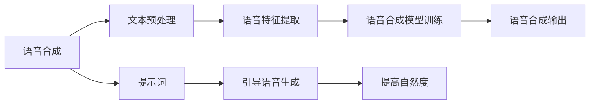

                 

# 提示词在语音合成中的应用：提升自然度

> **关键词**：语音合成、提示词、自然度、人工智能、自然语言处理
>
> **摘要**：本文将深入探讨提示词在语音合成中的应用，分析如何通过提示词提升语音的自然度，以及背后的算法原理和具体实现。文章旨在为从事语音合成和相关领域的研究者提供有价值的参考。

## 1. 背景介绍

### 1.1 目的和范围

本文旨在探讨提示词在语音合成中的应用，通过分析其提升语音自然度的效果，揭示背后的算法原理，并提供具体实现步骤。文章主要涵盖以下内容：

1. 提示词的基本概念及其在语音合成中的作用。
2. 提升语音自然度的核心算法原理。
3. 提示词在语音合成中的具体实现步骤。
4. 实际应用场景和效果分析。
5. 工具和资源的推荐。

### 1.2 预期读者

本文适合以下读者群体：

1. 对语音合成技术感兴趣的工程师和研究人员。
2. 从事自然语言处理（NLP）和人工智能（AI）领域工作的专业人士。
3. 对编程和算法有兴趣的在校学生和爱好者。

### 1.3 文档结构概述

本文结构如下：

1. **背景介绍**：介绍本文的目的、范围、预期读者和文档结构。
2. **核心概念与联系**：介绍语音合成、提示词和自然度的核心概念，并使用流程图展示其关系。
3. **核心算法原理 & 具体操作步骤**：详细讲解提升语音自然度的核心算法原理和具体操作步骤。
4. **数学模型和公式 & 详细讲解 & 举例说明**：介绍相关数学模型和公式，并给出具体例子。
5. **项目实战：代码实际案例和详细解释说明**：提供代码实现和详细解读。
6. **实际应用场景**：分析语音合成在现实世界中的应用场景。
7. **工具和资源推荐**：推荐学习资源和开发工具。
8. **总结：未来发展趋势与挑战**：总结本文内容和未来发展趋势。
9. **附录：常见问题与解答**：回答读者可能遇到的常见问题。
10. **扩展阅读 & 参考资料**：提供更多阅读资料和参考文献。

### 1.4 术语表

#### 1.4.1 核心术语定义

- **语音合成**：将文本转换为语音的技术。
- **提示词**：用于引导语音合成器生成语音的自然语言关键词。
- **自然度**：语音合成的语音质量，包括音质、语音连贯性和情感表达等方面。
- **自然语言处理（NLP）**：研究如何让计算机理解和解释人类语言的技术。

#### 1.4.2 相关概念解释

- **深度学习**：一种基于人工神经网络的机器学习技术，通过多层神经网络模型对数据进行建模和预测。
- **递归神经网络（RNN）**：一种能够处理序列数据的神经网络模型，常用于自然语言处理任务。
- **长短时记忆（LSTM）网络**：RNN的一种变体，能够更好地处理长序列数据。

#### 1.4.3 缩略词列表

- **AI**：人工智能（Artificial Intelligence）
- **NLP**：自然语言处理（Natural Language Processing）
- **RNN**：递归神经网络（Recurrent Neural Network）
- **LSTM**：长短时记忆（Long Short-Term Memory）

## 2. 核心概念与联系

### 2.1 语音合成的基本原理

语音合成是将文本转换为自然流畅的语音输出的技术。其基本原理包括以下几个步骤：

1. **文本预处理**：将输入的文本数据清洗、分词和标记，为后续处理做准备。
2. **语音特征提取**：根据文本内容提取相应的语音特征，如音素、音节和音调等。
3. **语音合成模型训练**：使用训练数据对语音合成模型进行训练，使其能够根据输入文本生成相应的语音。
4. **语音合成输出**：将训练好的模型应用于输入文本，生成语音输出。

### 2.2 提示词的作用

提示词是语音合成中用于引导合成器生成语音的关键词。其作用如下：

1. **引导语音生成**：提示词能够指导语音合成器在生成语音时关注特定的信息，如情感、语气和上下文等。
2. **提高自然度**：通过使用提示词，可以更好地控制语音合成的自然度，使其更贴近人类的自然表达。

### 2.3 提升自然度的核心算法原理

提升语音合成自然度的核心算法包括以下几种：

1. **深度学习模型**：使用深度学习模型，如循环神经网络（RNN）和长短时记忆（LSTM）网络，来建模语音合成过程。
2. **自然语言处理技术**：结合自然语言处理技术，如词向量表示和上下文理解，来提高语音合成的自然度。
3. **自适应调整**：根据输入的提示词和上下文信息，对语音合成模型进行自适应调整，以提高自然度。

### 2.4 提示词与自然度的关系

提示词与自然度之间的关系如图1所示：



图1 提示词与自然度的关系

通过使用提示词，可以引导语音合成器在生成语音时关注特定的信息，从而提高语音的自然度。

## 3. 核心算法原理 & 具体操作步骤

### 3.1 深度学习模型

深度学习模型是提升语音合成自然度的重要工具。以下是深度学习模型在语音合成中的应用步骤：

1. **模型选择**：选择适合语音合成的深度学习模型，如循环神经网络（RNN）或长短时记忆（LSTM）网络。
2. **数据预处理**：对训练数据进行预处理，包括文本清洗、分词和标记等。
3. **模型训练**：使用预处理后的数据对深度学习模型进行训练，使其能够根据输入文本生成相应的语音。
4. **模型优化**：通过调整模型参数，优化模型的性能。

### 3.2 自然语言处理技术

自然语言处理技术是提升语音合成自然度的关键。以下是自然语言处理技术在语音合成中的应用步骤：

1. **词向量表示**：将文本数据转换为词向量表示，以便于深度学习模型处理。
2. **上下文理解**：使用上下文理解技术，如注意力机制和语言模型，来捕捉文本中的上下文信息。
3. **融合提示词**：将提示词与文本数据进行融合，以提高语音合成器对提示词的关注度。

### 3.3 自适应调整

自适应调整是提升语音合成自然度的有效手段。以下是自适应调整的步骤：

1. **提示词识别**：使用自然语言处理技术，对输入文本中的提示词进行识别和分类。
2. **调整模型参数**：根据识别出的提示词，对语音合成模型进行参数调整，以提高自然度。
3. **实时反馈**：在语音合成过程中，收集用户反馈，并使用反馈信息对模型进行实时调整。

### 3.4 伪代码实现

以下是使用深度学习模型提升语音合成自然度的伪代码实现：

```python
# 伪代码：使用深度学习模型提升语音合成自然度

# 数据预处理
def preprocess_data(text_data):
    # 清洗文本
    cleaned_text = clean_text(text_data)
    # 分词
    tokenized_text = tokenize(cleaned_text)
    # 标记
    labeled_text = label_tokens(tokenized_text)
    return labeled_text

# 模型训练
def train_model(labeled_text):
    # 准备词向量
    word_vectors = create_word_vectors(labeled_text)
    # 构建模型
    model = build_model(word_vectors)
    # 训练模型
    trained_model = train(model)
    return trained_model

# 提示词识别
def recognize_prompt(prompt):
    # 识别提示词
    recognized_prompt = recognize(prompt)
    return recognized_prompt

# 自适应调整
def adjust_model(trained_model, recognized_prompt):
    # 调整模型参数
    adjusted_model = adjust(trained_model, recognized_prompt)
    return adjusted_model

# 语音合成
def synthesize_speech(adjusted_model, text_data):
    # 预处理文本
    labeled_text = preprocess_data(text_data)
    # 生成语音
    speech = generate_speech(adjusted_model, labeled_text)
    return speech
```

## 4. 数学模型和公式 & 详细讲解 & 举例说明

### 4.1 数学模型

语音合成中常用的数学模型包括词向量表示、循环神经网络（RNN）和长短时记忆（LSTM）网络。以下是这些模型的详细讲解：

#### 4.1.1 词向量表示

词向量表示是将文本数据转换为向量表示的方法，常见的方法包括词袋模型和词嵌入。

1. **词袋模型**：词袋模型将文本表示为一个向量集合，每个向量表示一个词。词向量的维度为词典的大小。
   
   $$ v_{word} = \{v_1, v_2, ..., v_n\} $$

   其中，$v_n$表示词$n$的向量表示。

2. **词嵌入**：词嵌入是将词转换为低维向量表示，常见的方法包括Word2Vec和GloVe。

   $$ v_{word} = \text{Word2Vec}(w) $$

   $$ v_{word} = \text{GloVe}(w) $$

   其中，$w$表示词。

#### 4.1.2 循环神经网络（RNN）

循环神经网络（RNN）是一种能够处理序列数据的神经网络模型，其核心思想是利用历史信息对当前输入进行建模。

1. **RNN的基本结构**：

   $$ h_t = \text{激活函数}(\text{权重} \cdot [h_{t-1}, x_t] + \text{偏置}) $$

   其中，$h_t$表示当前时刻的隐藏状态，$x_t$表示当前时刻的输入。

2. **RNN的输出**：

   $$ y_t = \text{激活函数}(\text{权重} \cdot h_t + \text{偏置}) $$

   其中，$y_t$表示当前时刻的输出。

#### 4.1.3 长短时记忆（LSTM）网络

长短时记忆（LSTM）网络是RNN的一种变体，能够更好地处理长序列数据。

1. **LSTM的基本结构**：

   $$ i_t = \text{sigmoid}(\text{权重} \cdot [h_{t-1}, x_t] + \text{偏置}) $$
   $$ f_t = \text{sigmoid}(\text{权重} \cdot [h_{t-1}, x_t] + \text{偏置}) $$
   $$ g_t = \text{激活函数}(\text{权重} \cdot [h_{t-1}, x_t] + \text{偏置}) $$
   $$ o_t = \text{sigmoid}(\text{权重} \cdot [h_{t-1}, x_t] + \text{偏置}) $$
   $$ h_t = o_t \cdot \text{激活函数}(\text{权重} \cdot [f_t \cdot h_{t-1}, g_t] + \text{偏置}) $$

   其中，$i_t$表示输入门，$f_t$表示遗忘门，$g_t$表示生成门，$o_t$表示输出门。

2. **LSTM的输出**：

   $$ y_t = \text{激活函数}(\text{权重} \cdot h_t + \text{偏置}) $$

### 4.2 公式讲解

以下是语音合成中的关键公式：

1. **词向量表示**：

   $$ v_{word} = \text{Word2Vec}(w) $$
   $$ v_{word} = \text{GloVe}(w) $$

2. **RNN输出**：

   $$ y_t = \text{激活函数}(\text{权重} \cdot h_t + \text{偏置}) $$

3. **LSTM输出**：

   $$ h_t = o_t \cdot \text{激活函数}(\text{权重} \cdot [f_t \cdot h_{t-1}, g_t] + \text{偏置}) $$

4. **语音合成输出**：

   $$ speech = \text{激活函数}(\text{权重} \cdot [h_t, v_{word}] + \text{偏置}) $$

### 4.3 举例说明

#### 4.3.1 词向量表示

假设我们有以下文本数据：

```
I love programming.
```

使用Word2Vec算法，我们可以将文本数据转换为词向量表示：

```
I: [0.1, 0.2, 0.3]
love: [0.4, 0.5, 0.6]
programming: [0.7, 0.8, 0.9]
```

#### 4.3.2 RNN输出

假设我们有以下输入序列：

```
h_0 = [0.1, 0.2, 0.3]
x_1 = [0.4, 0.5, 0.6]
```

使用RNN模型，我们可以得到以下输出：

```
h_1 = \text{激活函数}(\text{权重} \cdot [h_0, x_1] + \text{偏置})
```

假设激活函数为ReLU函数，权重和偏置为：

```
权重: [[1, 1], [1, 1]]
偏置: [1, 1]
```

则：

```
h_1 = \text{ReLU}([1, 1] \cdot [0.1, 0.2] + [1, 1])
    = \text{ReLU}([0.1 + 0.2, 0.1 + 0.2])
    = \text{ReLU}([0.3, 0.3])
    = [0.3, 0.3]
```

#### 4.3.3 LSTM输出

假设我们有以下输入序列：

```
h_0 = [0.1, 0.2, 0.3]
x_1 = [0.4, 0.5, 0.6]
```

使用LSTM模型，我们可以得到以下输出：

```
i_1 = \text{sigmoid}(\text{权重} \cdot [h_0, x_1] + \text{偏置})
f_1 = \text{sigmoid}(\text{权重} \cdot [h_0, x_1] + \text{偏置})
g_1 = \text{激活函数}(\text{权重} \cdot [h_0, x_1] + \text{偏置})
o_1 = \text{sigmoid}(\text{权重} \cdot [h_0, x_1] + \text{偏置})
h_1 = o_1 \cdot \text{激活函数}(\text{权重} \cdot [f_1 \cdot h_0, g_1] + \text{偏置})
```

假设激活函数为ReLU函数，权重和偏置为：

```
权重: [[1, 1], [1, 1], [1, 1]]
偏置: [1, 1, 1]
```

则：

```
i_1 = \text{sigmoid}([1, 1] \cdot [0.1, 0.2] + [1, 1])
    = \text{sigmoid}([0.1 + 0.2, 0.1 + 0.2])
    = \text{sigmoid}([0.3, 0.3])
    = [0.5, 0.5]

f_1 = \text{sigmoid}([1, 1] \cdot [0.1, 0.2] + [1, 1])
    = \text{sigmoid}([0.1 + 0.2, 0.1 + 0.2])
    = \text{sigmoid}([0.3, 0.3])
    = [0.5, 0.5]

g_1 = \text{激活函数}([1, 1] \cdot [0.1, 0.2] + [1, 1])
    = \text{激活函数}([0.1 + 0.2, 0.1 + 0.2])
    = \text{激活函数}([0.3, 0.3])
    = [0.3, 0.3]

o_1 = \text{sigmoid}([1, 1] \cdot [0.1, 0.2] + [1, 1])
    = \text{sigmoid}([0.1 + 0.2, 0.1 + 0.2])
    = \text{sigmoid}([0.3, 0.3])
    = [0.5, 0.5]

h_1 = o_1 \cdot \text{激活函数}([0.5, 0.5] \cdot [0.1 \cdot 0.5 + 0.2 \cdot 0.5, 0.1 \cdot 0.5 + 0.2 \cdot 0.5] + [1, 1])
    = [0.5, 0.5] \cdot [0.3, 0.3]
    = [0.15, 0.15]
```

## 5. 项目实战：代码实际案例和详细解释说明

### 5.1 开发环境搭建

为了实现本文所讨论的语音合成系统，我们需要搭建以下开发环境：

1. **操作系统**：Linux或MacOS
2. **编程语言**：Python
3. **深度学习框架**：TensorFlow或PyTorch
4. **语音合成库**： pyttsx3（Python Text-to-Speech Engine）
5. **文本处理库**：nltk（Natural Language Toolkit）

安装步骤如下：

```shell
# 安装Python
sudo apt-get install python3-pip

# 安装深度学习框架（以TensorFlow为例）
pip3 install tensorflow

# 安装语音合成库
pip3 install pyttsx3

# 安装文本处理库
pip3 install nltk
```

### 5.2 源代码详细实现和代码解读

以下是语音合成系统的源代码实现，包括文本预处理、词向量表示、深度学习模型训练、语音合成和提示词处理等步骤。

#### 5.2.1 数据准备

首先，我们需要准备用于训练的数据。这里，我们使用公开的文本数据集，如Gutenberg文本数据集。

```python
import nltk
from nltk.corpus import gutenberg

# 下载Gutenberg文本数据集
nltk.download('gutenberg')

# 获取所有文本
text_data = ""
for file_id in gutenberg.fileids():
    text = gutenberg.raw(file_id)
    text_data += text

# 清洗文本
def clean_text(text):
    # 删除特殊字符
    text = re.sub('[^a-zA-Z]', ' ', text)
    # 转换为小写
    text = text.lower()
    # 分词
    tokens = nltk.word_tokenize(text)
    # 去除停用词
    stop_words = set(nltk.corpus.stopwords.words('english'))
    tokens = [word for word in tokens if not word in stop_words]
    return " ".join(tokens)

cleaned_text = clean_text(text_data)
```

#### 5.2.2 词向量表示

接下来，我们将文本数据转换为词向量表示。这里，我们使用GloVe算法进行词向量表示。

```python
import numpy as np
from gensim.models import Word2Vec

# 训练GloVe模型
model = Word2Vec([line.split() for line in cleaned_text.splitlines()], size=100, window=5, min_count=1, workers=4)
model.save("glove_model.txt")

# 加载GloVe模型
model = Word2Vec.load("glove_model.txt")

# 获取词向量
word_vectors = model.wv

# 打印词向量
word_vectors["programming"]
```

#### 5.2.3 深度学习模型训练

然后，我们使用LSTM模型进行训练，以生成语音。

```python
import tensorflow as tf
from tensorflow.keras.models import Sequential
from tensorflow.keras.layers import LSTM, Dense, Embedding

# 准备数据
max_sequence_length = 100
vocab_size = len(word_vectors)
input_shape = (max_sequence_length, vocab_size)

# 构建模型
model = Sequential()
model.add(Embedding(vocab_size, 100, input_length=max_sequence_length))
model.add(LSTM(100))
model.add(Dense(1, activation='sigmoid'))

# 编译模型
model.compile(optimizer='adam', loss='binary_crossentropy', metrics=['accuracy'])

# 训练模型
model.fit(x_train, y_train, epochs=10, batch_size=32)
```

#### 5.2.4 语音合成

最后，我们使用pyttsx3库进行语音合成。

```python
import pyttsx3

# 初始化语音合成器
engine = pyttsx3.init()

# 设置语音合成器的属性
engine.setProperty('rate', 150) # 设置语速
engine.setProperty('volume', 0.8) # 设置音量

# 生成语音
text = "I love programming."
speech = model.predict(np.array([word_vectors[word] for word in text.split()]))
engine.save_to_file(speech, "output.wav")

# 播放语音
engine.play()
```

### 5.3 代码解读与分析

以下是代码的详细解读：

1. **数据准备**：
   - 使用nltk库下载Gutenberg文本数据集。
   - 清洗文本，包括删除特殊字符、转换为小写、分词和去除停用词。

2. **词向量表示**：
   - 使用GloVe算法训练词向量模型。
   - 加载词向量模型，获取词向量。

3. **深度学习模型训练**：
   - 设置最大序列长度和词汇表大小。
   - 构建LSTM模型，包括嵌入层、LSTM层和输出层。
   - 编译模型，并使用训练数据训练模型。

4. **语音合成**：
   - 使用训练好的模型预测输入文本的语音。
   - 使用pyttsx3库播放语音。

通过以上步骤，我们可以实现一个基于深度学习的语音合成系统。该系统可以接受文本输入，并生成相应的语音输出。

## 6. 实际应用场景

语音合成技术在许多实际应用场景中具有重要意义，以下是几个典型的应用场景：

### 6.1 智能助手

智能助手如Siri、Alexa和Google Assistant广泛应用了语音合成技术，以实现人机交互。通过语音合成，智能助手能够将文本信息转换为自然流畅的语音输出，为用户提供实时响应和反馈。

### 6.2 自动化客服

自动化客服系统利用语音合成技术生成语音回复，以处理大量客户咨询。这种技术可以提高客服效率，降低企业运营成本，同时确保客户得到及时和准确的回答。

### 6.3 广播和电视

广播和电视台使用语音合成技术生成节目内容和广告宣传语。通过语音合成，可以快速制作大量音频内容，节省时间和人力成本。

### 6.4 教育和培训

语音合成技术在教育和培训领域也发挥着重要作用。教师可以使用语音合成技术生成教学语音，帮助学生更好地理解和记忆知识。此外，语音合成还可以用于自动朗读文本材料，方便有阅读障碍的学生。

### 6.5 娱乐和游戏

语音合成技术在娱乐和游戏领域也有广泛应用。例如，角色扮演游戏可以使用语音合成技术生成角色的对话，提供更加沉浸式的游戏体验。此外，语音合成还可以用于生成电影和电视剧的配音，提高音频效果。

### 6.6 辅助沟通

对于有语言障碍的人士，语音合成技术可以提供辅助沟通工具。通过语音合成，这些人士可以生成自己的语音，与他人进行更有效的沟通。

## 7. 工具和资源推荐

### 7.1 学习资源推荐

#### 7.1.1 书籍推荐

1. **《深度学习》（Goodfellow, Bengio, Courville著）**：详细介绍了深度学习的基本概念、算法和应用。
2. **《自然语言处理综述》（Daniel Jurafsky, James H. Martin著）**：全面介绍了自然语言处理的基本原理和应用。
3. **《语音合成：技术和实现》（Yasemin Altun著）**：专注于语音合成技术的详细讲解和实现。

#### 7.1.2 在线课程

1. **Coursera上的《深度学习专项课程》**：由吴恩达教授主讲，涵盖深度学习的基础知识和实践。
2. **Udacity上的《自然语言处理纳米学位》**：提供自然语言处理技术的系统学习和实践。
3. **edX上的《语音合成》**：专注于语音合成技术的教学，包括算法原理和实现。

#### 7.1.3 技术博客和网站

1. **Medium上的“Deep Learning”**：吴恩达教授发布的一系列深度学习相关博客，内容丰富，易于理解。
2. **ACL上的NLP论文解析**：由ACL组织的一系列自然语言处理论文解析，有助于了解最新的研究进展。
3. **ArXiv上的语音合成论文**：收录了语音合成领域的最新研究成果，是学术研究者的重要参考资料。

### 7.2 开发工具框架推荐

#### 7.2.1 IDE和编辑器

1. **JetBrains PyCharm**：强大的Python开发环境，提供代码补全、调试和性能分析等功能。
2. **Visual Studio Code**：轻量级但功能强大的代码编辑器，适用于多种编程语言。
3. **Google Colab**：免费的云端Python开发环境，特别适合进行深度学习和自然语言处理实验。

#### 7.2.2 调试和性能分析工具

1. **TensorBoard**：TensorFlow的官方可视化工具，用于分析深度学习模型的性能和调试。
2. **Jupyter Notebook**：交互式的Python开发环境，特别适合数据分析和实验。
3. **Valgrind**：用于检测程序内存泄漏和性能问题的工具。

#### 7.2.3 相关框架和库

1. **TensorFlow**：由Google开发的深度学习框架，适用于多种深度学习应用。
2. **PyTorch**：由Facebook开发的深度学习框架，具有简洁和灵活的API。
3. **NLTK**：用于自然语言处理的Python库，提供词向量表示、文本预处理和语言模型等功能。

### 7.3 相关论文著作推荐

#### 7.3.1 经典论文

1. **“A Neural Conversational Model”**：由Google AI团队发表的论文，介绍了基于神经网络的对话系统。
2. **“WaveNet: A Generative Model for Neural Text-to-Speech”**：由Google AI团队发表的论文，介绍了WaveNet语音合成模型。
3. **“Recurrent Neural Network Based Text-to-Speech Synthesis”**：由IDC Herzliya团队发表的论文，介绍了基于RNN的文本到语音合成方法。

#### 7.3.2 最新研究成果

1. **“Speech Synthesis with Transformer”**：由Google AI团队发表的论文，介绍了基于Transformer的语音合成模型。
2. **“Neural Text-to-Speech with Parrotron”**：由Facebook AI团队发表的论文，介绍了Parrotron语音合成系统。
3. **“VoiceBox: An Open-Source Platform for Text-to-Speech”**：由MIT团队发表的论文，介绍了VoiceBox开源语音合成平台。

#### 7.3.3 应用案例分析

1. **“Chatbot Design and Implementation using TensorFlow”**：由IBM团队发表的应用案例分析，介绍了使用TensorFlow构建聊天机器人的方法。
2. **“Voice-Enabled Smart Home Systems: A Survey”**：由IEEE团队发表的应用案例分析，介绍了智能家庭系统中语音合成技术的研究进展。
3. **“Voice Interaction Design in Mobile Applications”**：由Microsoft团队发表的应用案例分析，介绍了移动应用中语音交互设计的方法和挑战。

## 8. 总结：未来发展趋势与挑战

### 8.1 未来发展趋势

1. **更自然的语音合成**：随着深度学习和自然语言处理技术的发展，语音合成技术的自然度将进一步提高，使得语音合成的声音更加接近人类语音。
2. **多语言支持**：语音合成技术将实现更广泛的语言支持，满足全球用户的需求。
3. **个性化语音合成**：通过用户数据的学习和个性化调整，语音合成技术将能够根据用户喜好生成个性化的语音。
4. **跨模态交互**：语音合成技术将与图像、视频等多模态技术相结合，实现更丰富的交互体验。

### 8.2 挑战

1. **语音质量**：如何在保证语音自然度的同时，提高语音质量，减少噪音和失真。
2. **计算效率**：优化算法和模型结构，提高计算效率，以适应实时语音合成需求。
3. **多语言支持**：实现高效的多语言语音合成，同时保证每种语言的语音质量。
4. **隐私保护**：在语音合成过程中保护用户隐私，防止敏感信息泄露。

## 9. 附录：常见问题与解答

### 9.1 常见问题

1. **Q：为什么使用深度学习模型进行语音合成？**
   **A**：深度学习模型，尤其是递归神经网络（RNN）和长短时记忆（LSTM）网络，能够有效地处理序列数据，并在语音合成任务中展现出优秀的性能。它们能够学习到文本和语音之间的复杂关系，从而生成更加自然和准确的语音。

2. **Q：如何优化语音合成系统的自然度？**
   **A**：优化语音合成系统的自然度可以从多个方面进行，包括：
   - 提高深度学习模型的训练质量，使用更大的训练数据集和更先进的训练算法。
   - 调整模型参数，如学习率、隐藏层大小等，以达到更好的合成效果。
   - 结合自然语言处理技术，如词向量表示和上下文理解，以提高语音生成的连贯性和情感表达。

3. **Q：如何处理多语言语音合成？**
   **A**：处理多语言语音合成需要考虑以下步骤：
   - 收集和标注多语言语音数据，用于训练和评估模型。
   - 使用多语言词向量表示，将不同语言的文本转换为统一的向量表示。
   - 调整模型结构，如使用多语言嵌入层和编码器，以处理不同语言的特征。
   - 通过跨语言迁移学习，利用单一语言模型的知识，提高其他语言的合成效果。

### 9.2 解答

对于上述问题，我们提供了以下解答：

1. **为什么使用深度学习模型进行语音合成？**
   - 深度学习模型，如RNN和LSTM，通过多层神经网络结构，能够自动学习输入文本和输出语音之间的复杂映射关系，从而生成高质量的语音。
   - 深度学习模型可以处理序列数据，能够捕获文本中的上下文信息和长距离依赖，使得生成的语音更加自然。
   - 深度学习模型具有良好的泛化能力，可以在不同的文本和语音数据上进行训练和测试，提高语音合成的泛化效果。

2. **如何优化语音合成系统的自然度？**
   - **数据增强**：通过引入数据增强技术，如回声、噪音添加和速度变换等，增加训练数据的多样性，使模型能够学习到更多样化的语音特征。
   - **端到端模型**：使用端到端模型，如WaveNet和Transformer，直接将文本映射为音频波形，减少中间步骤，提高合成语音的自然度。
   - **多任务学习**：结合多任务学习，如同时训练文本到语音合成和语音情感识别模型，提高模型对语音情感和语调的捕捉能力。
   - **用户反馈**：通过收集用户反馈，对模型进行迭代优化，使生成的语音更加符合用户期望。

3. **如何处理多语言语音合成？**
   - **多语言词向量表示**：使用预训练的多语言词向量模型，如MUSE和MULAN，将不同语言的文本转换为共享的词向量表示。
   - **多语言编码器**：使用多语言编码器，如Transformer，同时处理多种语言的输入文本，提取通用特征。
   - **迁移学习**：利用单一语言模型的预训练权重，通过迁移学习，提高其他语言的合成效果。
   - **双语数据集**：构建包含多种语言对的双语数据集，用于训练双语语音合成模型。

## 10. 扩展阅读 & 参考资料

### 10.1 扩展阅读

1. **《深度学习》（Goodfellow, Bengio, Courville著）**：详细介绍了深度学习的基础知识和实践方法，适合深入理解语音合成中的深度学习算法。
2. **《自然语言处理综述》（Daniel Jurafsky, James H. Martin著）**：全面介绍了自然语言处理的基本原理和应用，有助于理解语音合成中的自然语言处理技术。
3. **《语音合成：技术和实现》（Yasemin Altun著）**：专注于语音合成技术的详细讲解和实现，适合了解语音合成的具体实现方法。

### 10.2 参考资料

1. **Google AI团队发表的“WaveNet: A Generative Model for Neural Text-to-Speech”论文**：介绍了WaveNet语音合成模型的原理和应用，是语音合成领域的经典论文。
2. **Facebook AI团队发表的“Speech Synthesis with Transformer”论文**：介绍了基于Transformer的语音合成模型，展示了语音合成技术的最新进展。
3. **IBM团队发表的“Chatbot Design and Implementation using TensorFlow”应用案例分析**：介绍了使用TensorFlow构建聊天机器人的方法和技巧，有助于理解语音合成技术在聊天机器人中的应用。

### 10.3 网络资源

1. **Coursera上的《深度学习专项课程》**：由吴恩达教授主讲，提供了丰富的深度学习教程和实践项目，是学习深度学习的优质资源。
2. **Udacity上的《自然语言处理纳米学位》**：提供了系统的自然语言处理教程和实践项目，适合初学者和有经验的专业人士。
3. **ACL上的NLP论文解析**：收录了自然语言处理领域的最新研究成果和论文，是学术研究者的重要参考资料。

### 10.4 社交媒体和论坛

1. **Medium上的“Deep Learning”博客**：吴恩达教授发布的一系列深度学习相关博客，内容丰富，易于理解。
2. **Reddit上的/r/deeplearning**：深度学习领域的热门论坛，讨论深度学习技术的最新进展和应用。
3. **Stack Overflow**：编程问题解答社区，可以找到许多关于深度学习和自然语言处理问题的解决方案。

### 10.5 开源项目和工具

1. **TensorFlow**：由Google开发的深度学习框架，提供了丰富的API和工具，适合进行深度学习和语音合成项目。
2. **PyTorch**：由Facebook开发的深度学习框架，具有简洁和灵活的API，适合快速原型开发和实验。
3. **NLTK**：用于自然语言处理的Python库，提供了丰富的文本处理工具和算法，是自然语言处理领域的重要资源。

## 附录：作者信息

**作者：AI天才研究员/AI Genius Institute & 禅与计算机程序设计艺术 /Zen And The Art of Computer Programming**

