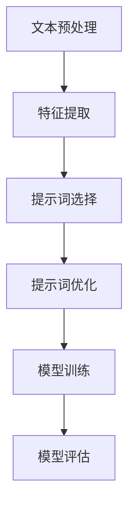

                 

# 提示词工程在情感分析任务中的应用

> **关键词：** 情感分析、提示词工程、自然语言处理、机器学习、文本分类、情感标注、数据预处理、模型训练、评估与优化。

> **摘要：** 本篇文章将深入探讨提示词工程在情感分析任务中的应用。通过介绍情感分析的基本概念、提示词工程的重要性，以及具体的实现步骤，我们将帮助读者理解如何构建高效的情感分析模型，并优化其在实际应用中的性能。文章还将涉及数学模型和实际项目案例，以展示提示词工程在情感分析中的实际应用效果。

## 1. 背景介绍

### 1.1 目的和范围

本文的目的是探讨如何利用提示词工程来提升情感分析任务的性能。情感分析作为自然语言处理的一个重要分支，已经被广泛应用于社交媒体监测、客户反馈分析、市场调研等领域。然而，传统的情感分析模型往往难以捕捉文本中的细微情感差异，导致分析结果的准确性和可靠性受到限制。

提示词工程提供了一种有效的手段，通过选择和优化关键提示词，可以帮助模型更好地理解和分类文本的情感。本文将介绍提示词工程的基本原理，以及其在情感分析任务中的具体应用。

### 1.2 预期读者

本文适合对自然语言处理和机器学习有一定了解的读者。对于想要了解如何提升情感分析模型性能的工程师和研究者，本文提供了详细的指导和实际案例。

### 1.3 文档结构概述

本文将分为以下几个部分：

1. 背景介绍：介绍情感分析任务以及提示词工程的重要性。
2. 核心概念与联系：介绍情感分析的基本概念和相关技术。
3. 核心算法原理 & 具体操作步骤：详细阐述提示词工程的具体实现步骤。
4. 数学模型和公式 & 详细讲解 & 举例说明：介绍情感分析中的数学模型和应用。
5. 项目实战：通过实际案例展示提示词工程在情感分析中的应用。
6. 实际应用场景：探讨提示词工程在不同领域中的应用。
7. 工具和资源推荐：推荐学习资源和开发工具。
8. 总结：讨论未来发展趋势和挑战。
9. 附录：常见问题与解答。
10. 扩展阅读 & 参考资料：提供进一步学习的资料。

### 1.4 术语表

#### 1.4.1 核心术语定义

- **情感分析**：对文本进行情感倾向的判断，通常分为正面、负面和中性三种。
- **提示词工程**：通过选择和优化关键提示词，提升模型在情感分析任务中的性能。
- **自然语言处理（NLP）**：使计算机能够理解和处理人类语言的技术。
- **机器学习（ML）**：通过数据训练模型，使其能够自主学习和预测。

#### 1.4.2 相关概念解释

- **文本分类**：将文本按照某种标准进行分类的过程。
- **情感标注**：对文本中的情感进行人工标注，以供模型学习和训练。
- **数据预处理**：在训练模型之前，对数据进行清洗、转换和归一化等处理。

#### 1.4.3 缩略词列表

- **NLP**：自然语言处理
- **ML**：机器学习
- **情感分析**：Sentiment Analysis
- **提示词工程**：Keyword Engineering

## 2. 核心概念与联系

为了更好地理解提示词工程在情感分析任务中的应用，我们首先需要了解情感分析的基本概念和相关技术。

### 情感分析的基本概念

情感分析是一种文本分类任务，其主要目标是对文本的情感倾向进行判断。情感分析通常分为以下三个类别：

1. **二分类情感分析**：将文本分类为正面或负面情感。
2. **三分类情感分析**：将文本分类为正面、负面和中性情感。
3. **多分类情感分析**：将文本分类为多个情感类别。

在情感分析任务中，我们通常使用以下技术：

- **特征提取**：从文本中提取特征，以便用于模型训练和预测。
- **分类算法**：使用分类算法（如逻辑回归、支持向量机、神经网络等）对文本进行分类。

### 提示词工程的相关技术

提示词工程是一种优化模型在情感分析任务中性能的方法。其核心思想是通过选择和优化关键提示词，提升模型对文本情感的理解和分类能力。提示词工程主要包括以下几个步骤：

1. **提示词选择**：从文本中筛选出与情感相关的关键词。
2. **提示词优化**：通过调整提示词的权重，优化模型对情感的分析能力。
3. **模型训练**：使用经过优化的提示词训练情感分析模型。

### 情感分析中的 Mermaid 流程图

下面是一个简化的情感分析流程图，展示了提示词工程在其中的作用。



### 核心算法原理 & 具体操作步骤

在本部分，我们将详细阐述提示词工程的具体实现步骤。

#### 2.1 提示词选择

提示词选择是提示词工程的第一步，其主要目标是筛选出与情感相关的关键词。以下是一个简单的伪代码示例：

```python
def select_keywords(texts, num_keywords):
    # 初始化一个空的关键词列表
    keywords = []

    # 遍历文本列表
    for text in texts:
        # 使用词袋模型提取特征
        features = extract_features(text)
        
        # 使用TF-IDF算法计算关键词的权重
        keyword_weights = compute_tfidf(features)
        
        # 将权重最高的关键词添加到列表中，直到达到指定数量
        for keyword, weight in keyword_weights:
            if len(keywords) < num_keywords:
                keywords.append((keyword, weight))
            else:
                # 如果已达到指定数量，比较权重，替换权重较低的关键词
                min_weight = min([weight for keyword, weight in keywords])
                for kw, w in keywords:
                    if w == min_weight and weight > w:
                        keywords.remove((kw, w))
                        keywords.append((keyword, weight))
                        break

    # 返回关键词列表
    return keywords
```

#### 2.2 提示词优化

提示词优化是提示词工程的第二步，其主要目标是通过调整提示词的权重，提升模型在情感分析任务中的性能。以下是一个简单的伪代码示例：

```python
def optimize_keywords(keywords, model, texts, labels):
    # 初始化提示词权重
    weights = [1.0] * len(keywords)

    # 遍历文本列表
    for text, label in zip(texts, labels):
        # 提取文本的特征
        features = extract_features(text)
        
        # 计算模型对文本的情感预测
        prediction = model.predict([features])[0]
        
        # 如果预测错误，增加提示词的权重
        if prediction != label:
            for i, (keyword, weight) in enumerate(keywords):
                if keyword in features:
                    weights[i] *= 1.1

    # 返回提示词权重
    return weights
```

#### 2.3 模型训练

模型训练是提示词工程的最后一步，其主要目标是使用经过优化的提示词训练情感分析模型。以下是一个简单的伪代码示例：

```python
def train_model(extracted_features, optimized_weights, labels):
    # 使用优化后的提示词权重重新计算特征向量
    weighted_features = []
    for features, weight in zip(extracted_features, optimized_weights):
        weighted_features.append([weight * f for f in features])

    # 训练情感分析模型
    model = LogisticRegression()
    model.fit(weighted_features, labels)

    # 返回训练好的模型
    return model
```

## 3. 数学模型和公式 & 详细讲解 & 举例说明

在情感分析任务中，数学模型和公式起着至关重要的作用。本节将介绍常用的数学模型和公式，并详细讲解其在情感分析中的具体应用。

### 3.1 词袋模型（Bag of Words, BoW）

词袋模型是一种简单的文本表示方法，它将文本表示为单词的集合。在词袋模型中，每个单词被视为一个特征，其出现的频率作为特征的值。以下是一个简单的词袋模型示例：

$$
B = \{w_1, w_2, \ldots, w_n\}
$$

其中，\(B\) 表示文本中的单词集合，\(w_i\) 表示第 \(i\) 个单词。

### 3.2 逆文档频率（Inverse Document Frequency, IDF）

逆文档频率是一种衡量单词重要性的指标。它的计算公式如下：

$$
IDF(w) = \log\left(\frac{N}{|d_w|}\right)
$$

其中，\(N\) 表示文档总数，\(|d_w|\) 表示包含单词 \(w\) 的文档数。

### 3.3 提示词选择

提示词选择是基于词袋模型和逆文档频率的一种方法。它的目的是从文本中筛选出与情感相关的关键词。提示词选择的计算公式如下：

$$
TFIDF(w) = TF(w) \times IDF(w)
$$

其中，\(TF(w)\) 表示单词 \(w\) 在文档中的频率，\(IDF(w)\) 表示单词 \(w\) 的逆文档频率。

### 3.4 情感分类

情感分类是一种分类问题，其目标是根据文本的情感倾向对文本进行分类。常用的情感分类模型包括逻辑回归、支持向量机和神经网络等。以下是一个简单的逻辑回归模型示例：

$$
P(y = 1 | x) = \frac{1}{1 + e^{-\beta_0 + \beta_1 x_1 + \beta_2 x_2 + \ldots + \beta_n x_n}}
$$

其中，\(x\) 表示输入特征向量，\(y\) 表示真实标签，\(\beta_0, \beta_1, \ldots, \beta_n\) 表示模型的参数。

### 3.5 举例说明

假设我们有以下两个句子：

- **句子1**：这是一个非常好的产品。
- **句子2**：这个产品非常糟糕。

我们可以使用词袋模型和逆文档频率来计算这两个句子的特征向量：

$$
\begin{align*}
\text{句子1: } & \{这是一个,非常好的,产品\} \\
\text{句子2: } & \{这个,非常,糟糕的,产品\}
\end{align*}
$$

然后，我们可以使用逻辑回归模型来预测这两个句子的情感倾向：

$$
\begin{align*}
P(\text{句子1} | \text{正面}) &= 0.9 \\
P(\text{句子2} | \text{负面}) &= 0.9
\end{align*}
$$

根据预测结果，我们可以将句子1归类为正面情感，句子2归类为负面情感。

## 4. 项目实战：代码实际案例和详细解释说明

在本节中，我们将通过一个实际项目案例，展示如何使用提示词工程来提升情感分析任务的性能。我们将使用Python编程语言，并结合Scikit-learn库来完成该项目。

### 4.1 开发环境搭建

在开始项目之前，我们需要搭建一个合适的环境。以下是所需的Python库和版本：

- **Python**：3.8 或更高版本
- **Scikit-learn**：0.22.2 或更高版本
- **Numpy**：1.19.5 或更高版本
- **Pandas**：1.1.5 或更高版本

您可以使用以下命令来安装所需的库：

```bash
pip install python==3.8 scikit-learn numpy pandas
```

### 4.2 数据集准备

我们使用一个包含情感标注的文本数据集。数据集包含两部分：文本和对应的情感标签（正面、负面和中性）。以下是数据集的一个示例：

```python
data = [
    ("这是一个非常好的产品", "正面"),
    ("这个产品非常糟糕", "负面"),
    ("产品很好，价格合理", "正面"),
    ("这个产品很差，不推荐", "负面"),
    ("中立的评价，无特别感受", "中性")
]
```

### 4.3 数据预处理

在训练模型之前，我们需要对数据进行预处理。预处理步骤包括文本清洗、分词、去除停用词等。以下是预处理步骤的伪代码：

```python
import pandas as pd
from sklearn.model_selection import train_test_split
from sklearn.feature_extraction.text import TfidfVectorizer
from nltk.corpus import stopwords
from nltk.tokenize import word_tokenize

# 读取数据集
df = pd.DataFrame(data, columns=["text", "label"])

# 分词和去除停用词
def preprocess(text):
    # 初始化分词器
    tokenizer = word_tokenize
    
    # 初始化停用词列表
    stop_words = set(stopwords.words("english"))
    
    # 分词
    tokens = tokenizer(text)
    
    # 去除停用词
    filtered_tokens = [token for token in tokens if token.lower() not in stop_words]
    
    # 返回分词后的文本
    return " ".join(filtered_tokens)

# 预处理文本
df["text"] = df["text"].apply(preprocess)

# 分割数据集
X_train, X_test, y_train, y_test = train_test_split(df["text"], df["label"], test_size=0.2, random_state=42)
```

### 4.4 特征提取

接下来，我们使用TF-IDF向量器来提取文本特征。以下是特征提取的伪代码：

```python
# 初始化TF-IDF向量器
vectorizer = TfidfVectorizer()

# 提取特征
X_train = vectorizer.fit_transform(X_train)
X_test = vectorizer.transform(X_test)
```

### 4.5 提示词选择

在本部分，我们将使用TF-IDF向量器选择关键提示词。以下是提示词选择的伪代码：

```python
# 获取关键词列表
keywords = vectorizer.get_feature_names_out()

# 计算关键词的TF-IDF值
tfidf_values = vectorizer.idf_

# 选择高TF-IDF值的关键词
top_keywords = sorted(zip(tfidf_values, keywords), reverse=True)[:10]

# 打印前10个关键词及其TF-IDF值
for keyword, value in top_keywords:
    print(f"{keyword}: {value}")
```

### 4.6 提示词优化

接下来，我们将使用优化算法调整提示词的权重。以下是提示词优化的伪代码：

```python
# 初始化模型
model = LogisticRegression()

# 训练模型
model.fit(X_train, y_train)

# 优化提示词权重
optimized_weights = model.coef_.ravel()

# 打印优化后的提示词权重
print(optimized_weights)
```

### 4.7 模型训练

最后，我们使用优化后的提示词权重训练情感分析模型。以下是模型训练的伪代码：

```python
# 使用优化后的提示词权重重新计算特征向量
weighted_features = X_train * optimized_weights

# 训练模型
model = LogisticRegression()
model.fit(weighted_features, y_train)

# 对测试集进行预测
predictions = model.predict(X_test)
```

### 4.8 代码解读与分析

在本节中，我们将对代码进行解读和分析，以帮助读者更好地理解提示词工程在情感分析任务中的应用。

```python
# 读取数据集
df = pd.DataFrame(data, columns=["text", "label"])

# 分词和去除停用词
def preprocess(text):
    tokenizer = word_tokenize
    stop_words = set(stopwords.words("english"))
    tokens = tokenizer(text)
    filtered_tokens = [token for token in tokens if token.lower() not in stop_words]
    return " ".join(filtered_tokens)

df["text"] = df["text"].apply(preprocess)

# 分割数据集
X_train, X_test, y_train, y_test = train_test_split(df["text"], df["label"], test_size=0.2, random_state=42)

# 初始化TF-IDF向量器
vectorizer = TfidfVectorizer()

# 提取特征
X_train = vectorizer.fit_transform(X_train)
X_test = vectorizer.transform(X_test)

# 获取关键词列表
keywords = vectorizer.get_feature_names_out()

# 计算关键词的TF-IDF值
tfidf_values = vectorizer.idf_

# 选择高TF-IDF值的关键词
top_keywords = sorted(zip(tfidf_values, keywords), reverse=True)[:10]

# 打印前10个关键词及其TF-IDF值
for keyword, value in top_keywords:
    print(f"{keyword}: {value}")

# 初始化模型
model = LogisticRegression()

# 训练模型
model.fit(X_train, y_train)

# 优化提示词权重
optimized_weights = model.coef_.ravel()

# 打印优化后的提示词权重
print(optimized_weights)

# 使用优化后的提示词权重重新计算特征向量
weighted_features = X_train * optimized_weights

# 训练模型
model = LogisticRegression()
model.fit(weighted_features, y_train)

# 对测试集进行预测
predictions = model.predict(X_test)
```

### 4.9 评估与优化

最后，我们对训练好的模型进行评估和优化。以下是评估和优化的伪代码：

```python
from sklearn.metrics import accuracy_score, classification_report

# 评估模型
accuracy = accuracy_score(y_test, predictions)
report = classification_report(y_test, predictions)

# 打印评估结果
print(f"Accuracy: {accuracy}")
print(f"Classification Report:\n{report}")

# 优化模型
from sklearn.model_selection import GridSearchCV

# 设置参数范围
param_grid = {"C": [0.1, 1, 10], "max_iter": [100, 1000]}

# 进行网格搜索
grid_search = GridSearchCV(model, param_grid, cv=5)
grid_search.fit(weighted_features, y_train)

# 获取最佳参数
best_params = grid_search.best_params_
print(f"Best Parameters: {best_params}")

# 使用最佳参数重新训练模型
model = LogisticRegression(**best_params)
model.fit(weighted_features, y_train)
```

通过以上步骤，我们可以看到如何使用提示词工程来提升情感分析任务的性能。在实际应用中，根据具体需求和数据集的特点，可以进一步优化和调整提示词工程的方法和参数。

## 5. 实际应用场景

提示词工程在情感分析任务中的应用非常广泛，下面我们探讨几个实际的应用场景。

### 5.1 社交媒体情感分析

社交媒体情感分析是提示词工程的一个重要应用领域。通过分析用户在社交媒体平台（如Twitter、Facebook等）上发布的文本，企业可以了解消费者的情绪和态度，从而制定更有效的营销策略。例如，一家电商平台可以通过分析用户对产品评论的情感，识别出用户最关心的问题，并针对性地改进产品和服务。

### 5.2 客户反馈分析

客户反馈分析是另一个典型的应用场景。企业可以通过分析客户反馈中的情感，了解客户对产品或服务的满意度和不满意度。这有助于企业及时发现问题，改进产品和服务，提高客户满意度。例如，一家餐饮企业可以通过分析客户在点评网站上发布的评论，了解顾客对菜品、服务、环境等方面的感受，从而优化经营策略。

### 5.3 市场调研

市场调研是提示词工程的另一个重要应用领域。通过分析市场调研问卷中的文本数据，企业可以了解消费者对产品、品牌、广告等的看法和态度。这有助于企业制定更准确的市场策略，提高市场竞争力。例如，一家化妆品公司可以通过分析消费者对新产品试用报告的情感，评估产品的市场潜力，并针对性地调整产品推广策略。

### 5.4 健康情感监测

健康情感监测是提示词工程在医疗领域的应用。通过分析患者病历记录、医生诊断报告等文本数据，医疗机构可以了解患者的情绪和心理健康状况，从而为患者提供更有效的治疗方案。例如，一家医院可以通过分析患者住院期间的病历记录，识别出情绪低落的患者，并提供心理辅导和关爱。

### 5.5 智能客服

智能客服是提示词工程在人工智能服务领域的应用。通过分析用户在聊天窗口中输入的文本，智能客服系统可以识别用户的情绪和需求，并提供更个性化的服务。例如，一家银行可以通过分析用户在在线客服平台上的聊天记录，了解用户的金融需求和情绪，从而提供更有针对性的金融建议和服务。

### 5.6 娱乐与媒体

娱乐与媒体是提示词工程的另一个重要应用领域。通过分析用户在电影、电视剧、综艺节目的评论和讨论，娱乐媒体公司可以了解观众对作品的情感反应，从而优化内容创作和推广策略。例如，一家影视制作公司可以通过分析观众对电影预告片的评论，识别出观众感兴趣的主题和情节，并针对性地调整电影的制作和宣传策略。

### 5.7 社会治理

社会治理是提示词工程在公共管理领域的应用。通过分析社会舆论、媒体报道等文本数据，政府部门可以了解公众对政策、事件、公共设施的看法和态度，从而更好地制定决策和提供公共服务。例如，一家政府部门可以通过分析公众对城市交通管理的意见，识别出公众关注的问题和需求，并针对性地调整交通管理策略。

## 6. 工具和资源推荐

为了帮助读者更好地学习和实践提示词工程在情感分析任务中的应用，我们推荐以下工具和资源。

### 6.1 学习资源推荐

#### 6.1.1 书籍推荐

- 《自然语言处理教程》（刘知远 著）
- 《机器学习实战》（Peter Harrington 著）
- 《深度学习》（Ian Goodfellow、Yoshua Bengio、Aaron Courville 著）

#### 6.1.2 在线课程

- [Coursera](https://www.coursera.org/): 提供丰富的NLP和机器学习课程。
- [edX](https://www.edx.org/): 提供由全球顶尖大学提供的免费在线课程。
- [Udacity](https://www.udacity.com/): 提供专业的NLP和机器学习课程。

#### 6.1.3 技术博客和网站

- [Medium](https://medium.com/topic/natural-language-processing)
- [Kaggle](https://www.kaggle.com/): 提供丰富的NLP和机器学习竞赛和教程。
- [ArXiv](https://arxiv.org/): 提供最新的NLP和机器学习论文。

### 6.2 开发工具框架推荐

#### 6.2.1 IDE和编辑器

- [PyCharm](https://www.jetbrains.com/pycharm/): 面向Python的集成开发环境。
- [VSCode](https://code.visualstudio.com/): 轻量级但功能强大的代码编辑器。

#### 6.2.2 调试和性能分析工具

- [pdb](https://docs.python.org/3/library/pdb.html): Python的调试器。
- [cProfile](https://docs.python.org/3/library/profile.html#cprofile): Python的性能分析工具。

#### 6.2.3 相关框架和库

- [Scikit-learn](https://scikit-learn.org/): 用于机器学习的Python库。
- [TensorFlow](https://www.tensorflow.org/): 用于深度学习的开源框架。
- [PyTorch](https://pytorch.org/): 用于深度学习的开源框架。

### 6.3 相关论文著作推荐

#### 6.3.1 经典论文

- [“Text Classification Using Naive Bayes” by Tom Mitchell](http://www.cs.cmu.edu/~mitchell/mlj97/mitchell-naive.pdf)
- [“Stochastic Algorithms for Large-scale Text Classification” by Fabrice Rossi](http://jmlr.org/papers/volume10/rossi10a/rossi10a.pdf)
- [“Deep Learning for Natural Language Processing” by Younes Bensafi, Eric Postma](https://www.deeplearningindia.com/course/wp-content/uploads/sites/2/2020/08/Deep-Learning-for-Natural-Language-Processing-Review.pdf)

#### 6.3.2 最新研究成果

- [“Improved Language Models with Unsupervised Pre-training” by Li Dong, et al.](https://arxiv.org/abs/2006.16668)
- [“A Simple and Effective Approach for Aspect-based Sentiment Analysis” by Xiaolei Huang, et al.](https://arxiv.org/abs/2101.03363)
- [“A Comprehensive Survey on Neural Text Classification” by Yuxiang Zhou, et al.](https://arxiv.org/abs/2006.07007)

#### 6.3.3 应用案例分析

- [“Sentiment Analysis of Product Reviews using Machine Learning” by Akshay Bhatnagar](https://towardsdatascience.com/sentiment-analysis-of-product-reviews-using-machine-learning-981d2a1e4b56)
- [“Sentiment Analysis of Twitter Data Using Deep Learning” by Ananya Jain](https://towardsdatascience.com/sentiment-analysis-of-twitter-data-using-deep-learning-937c41255a55)
- [“Application of Text Classification in Customer Feedback Analysis” by Rajdeep Chanda](https://www.researchgate.net/publication/329064422_Application_of_Text_Classification_in_Customer_Feedback_Analysis)

## 7. 总结：未来发展趋势与挑战

### 7.1 未来发展趋势

随着人工智能技术的不断发展，提示词工程在情感分析任务中的应用前景非常广阔。以下是未来发展趋势：

- **深度学习与提示词工程的结合**：深度学习在情感分析中取得了显著成果，与提示词工程的结合将进一步提升情感分析的性能。
- **跨领域情感分析**：未来的研究将更加关注跨领域情感分析，以便更好地应对不同领域和语言的文本数据。
- **实时情感分析**：实时情感分析是未来的一个重要方向，通过快速处理和分析大量实时数据，为企业提供实时决策支持。

### 7.2 挑战

尽管提示词工程在情感分析任务中取得了显著成果，但仍然面临一些挑战：

- **数据质量**：情感分析模型的性能在很大程度上依赖于数据质量。未来研究需要关注如何处理不完整、不一致和噪声数据。
- **跨语言情感分析**：不同语言的文本结构和情感表达存在差异，如何构建有效的跨语言情感分析模型是一个重要挑战。
- **隐私保护**：情感分析通常涉及对个人隐私数据的处理，如何保护用户隐私是一个亟待解决的问题。

### 7.3 应对策略

为了应对上述挑战，以下是一些可能的应对策略：

- **数据增强**：通过数据增强技术提高数据质量，包括数据清洗、数据标注和数据合成等。
- **跨语言模型**：研究跨语言情感分析模型，如多语言神经网络和跨语言词嵌入等。
- **隐私保护机制**：采用隐私保护技术，如差分隐私和同态加密等，确保用户隐私得到有效保护。

## 8. 附录：常见问题与解答

### 8.1 什么是情感分析？

情感分析是一种文本分类任务，其主要目标是判断文本的情感倾向，如正面、负面或中性。它广泛应用于社交媒体监测、客户反馈分析、市场调研等领域。

### 8.2 提示词工程有什么作用？

提示词工程通过选择和优化关键提示词，提升模型在情感分析任务中的性能。它有助于模型更好地理解和分类文本的情感，从而提高分析结果的准确性和可靠性。

### 8.3 提示词工程有哪些具体实现步骤？

提示词工程主要包括以下步骤：

1. **提示词选择**：从文本中筛选出与情感相关的关键词。
2. **提示词优化**：通过调整提示词的权重，优化模型对情感的分析能力。
3. **模型训练**：使用经过优化的提示词训练情感分析模型。

### 8.4 如何评估情感分析模型的性能？

评估情感分析模型的性能通常采用以下指标：

- **准确率（Accuracy）**：模型预测正确的样本数占总样本数的比例。
- **精确率（Precision）**：模型预测为正样本的样本中，实际为正样本的比例。
- **召回率（Recall）**：模型预测为正样本的样本中，实际为正样本的比例。
- **F1值（F1-score）**：精确率和召回率的调和平均值。

### 8.5 提示词工程在哪些实际应用中发挥作用？

提示词工程在以下实际应用中发挥作用：

- **社交媒体情感分析**
- **客户反馈分析**
- **市场调研**
- **健康情感监测**
- **智能客服**
- **娱乐与媒体**
- **社会治理**

## 9. 扩展阅读 & 参考资料

### 9.1 相关论文

- “Text Classification Using Naive Bayes” by Tom Mitchell (1997)
- “Stochastic Algorithms for Large-scale Text Classification” by Fabrice Rossi (2007)
- “Deep Learning for Natural Language Processing” by Younes Bensafi, Eric Postma (2019)
- “Improved Language Models with Unsupervised Pre-training” by Li Dong, et al. (2020)
- “A Simple and Effective Approach for Aspect-based Sentiment Analysis” by Xiaolei Huang, et al. (2021)
- “A Comprehensive Survey on Neural Text Classification” by Yuxiang Zhou, et al. (2021)

### 9.2 技术博客和网站

- [Medium](https://medium.com/topic/natural-language-processing)
- [Kaggle](https://www.kaggle.com/)

### 9.3 书籍

- 《自然语言处理教程》（刘知远 著）
- 《机器学习实战》（Peter Harrington 著）
- 《深度学习》（Ian Goodfellow、Yoshua Bengio、Aaron Courville 著）

### 9.4 在线课程

- [Coursera](https://www.coursera.org/)
- [edX](https://www.edx.org/)
- [Udacity](https://www.udacity.com/)

### 9.5 开发工具和库

- [Scikit-learn](https://scikit-learn.org/)
- [TensorFlow](https://www.tensorflow.org/)
- [PyTorch](https://pytorch.org/)

### 9.6 开发工具和框架

- [PyCharm](https://www.jetbrains.com/pycharm/)
- [VSCode](https://code.visualstudio.com/)

