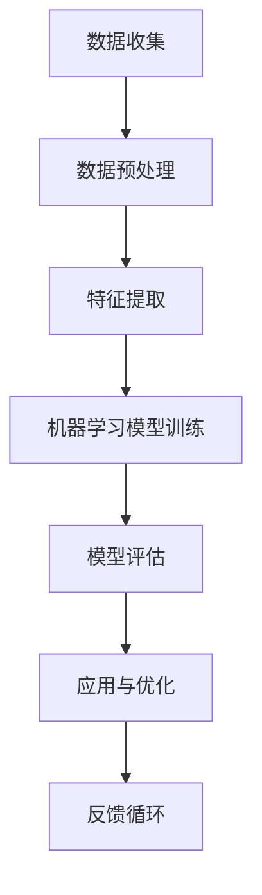

                 

# 提示词工程在智能能源管理中的应用

> **关键词**：提示词工程、智能能源管理、能源效率优化、机器学习、数据驱动方法

> **摘要**：本文深入探讨了提示词工程在智能能源管理领域的应用。通过分析提示词工程的基本概念和原理，以及其在能源管理中的关键作用，本文详细介绍了如何利用提示词工程实现能源效率优化。本文还包括了核心算法原理、数学模型和实际案例，为读者提供了全面的技术指南，以推动智能能源管理的发展。

## 1. 背景介绍

### 1.1 目的和范围

本文旨在介绍提示词工程在智能能源管理中的应用，探讨如何通过数据驱动的方法优化能源效率。随着全球能源需求的不断增长和可再生能源的普及，智能能源管理系统成为提高能源利用效率和降低成本的关键。提示词工程作为一种先进的机器学习技术，在能源管理中具有广泛的应用前景。

### 1.2 预期读者

本文适用于对智能能源管理和机器学习有一定了解的读者，包括能源工程师、计算机科学家、数据分析师等。

### 1.3 文档结构概述

本文分为十个部分，包括背景介绍、核心概念与联系、核心算法原理与具体操作步骤、数学模型和公式、项目实战、实际应用场景、工具和资源推荐、总结、常见问题与解答和扩展阅读。每个部分都将详细阐述提示词工程在智能能源管理中的应用。

### 1.4 术语表

#### 1.4.1 核心术语定义

- **提示词工程**：利用机器学习技术，从数据中提取关键特征，用于预测、分类或优化任务的工程方法。
- **智能能源管理**：利用信息技术和智能设备，实现能源的优化分配、监控和控制。
- **能源效率优化**：通过改进能源系统，提高能源利用率，降低能源消耗。

#### 1.4.2 相关概念解释

- **机器学习**：一种人工智能技术，通过训练算法从数据中学习规律，进行预测或决策。
- **数据驱动方法**：基于数据分析的方法，通过收集、处理和分析数据，发现规律并应用于实际问题。

#### 1.4.3 缩略词列表

- **ML**：Machine Learning（机器学习）
- **IE**：Intelligent Energy Management（智能能源管理）
- **EEO**：Energy Efficiency Optimization（能源效率优化）

## 2. 核心概念与联系

提示词工程在智能能源管理中发挥着关键作用。其基本原理是通过从能源数据中提取关键特征，利用机器学习算法进行训练，从而实现能源预测、分类和优化。以下是一个简化的提示词工程与智能能源管理架构的 Mermaid 流程图：



### 2.1 数据收集

数据收集是智能能源管理的基础。通过传感器、智能设备和能源管理系统，收集大量的实时能源数据，如电力消耗、温度、湿度、设备运行状态等。

### 2.2 数据预处理

收集到的数据往往存在噪声、缺失值和不一致性。通过数据预处理，包括数据清洗、归一化和去噪等步骤，确保数据的准确性和一致性。

### 2.3 特征提取

特征提取是提示词工程的核心步骤。通过分析能源数据，提取对能源管理具有重要意义的特征，如时间序列特征、频率特征和相关性特征。

### 2.4 机器学习模型训练

利用提取的特征，通过机器学习算法进行模型训练。常见的机器学习算法包括决策树、支持向量机和神经网络等。

### 2.5 模型评估

通过交叉验证和测试集，评估模型的性能。常见的评估指标包括准确率、召回率和F1分数。

### 2.6 应用与优化

将训练好的模型应用于实际能源管理场景，如电力负荷预测、设备故障诊断和能源优化调度。通过持续优化，提高模型的准确性和可靠性。

### 2.7 反馈循环

将实际应用中的反馈数据反馈到数据收集环节，形成反馈循环。通过不断调整和优化，提高智能能源管理的效率。

## 3. 核心算法原理 & 具体操作步骤

提示词工程在智能能源管理中的应用，依赖于一系列机器学习算法。以下将介绍常用的决策树算法和神经网络算法的具体操作步骤。

### 3.1 决策树算法

#### 算法原理：

决策树是一种树形结构，通过递归划分特征空间，将数据划分为不同的子集，从而实现分类或回归任务。决策树算法的核心是特征选择和节点划分。

#### 具体操作步骤：

1. **特征选择**：选择对目标变量影响最大的特征作为分割特征。
2. **节点划分**：根据选择的特征，将数据集划分为子集，使得每个子集内的目标变量差异最小。
3. **递归划分**：对每个子集，重复执行特征选择和节点划分，直到满足停止条件（如节点纯度达到一定阈值）。
4. **模型构建**：将划分结果构建为决策树模型，用于预测新数据。

#### 伪代码：

```python
def build_decision_tree(data, features, target):
    # 停止条件：节点纯度达到阈值
    if purity(data, target) < threshold:
        return leaf_node(target)
    
    # 选择最优特征
    best_feature = select_best_feature(data, features, target)
    
    # 划分节点
    nodes = split_data(data, best_feature)
    
    # 递归构建子树
    tree = {}
    for feature, subset in nodes.items():
        tree[feature] = build_decision_tree(subset, features - {feature}, target)
    
    return tree
```

### 3.2 神经网络算法

#### 算法原理：

神经网络是一种模拟人脑神经元连接结构的计算模型，通过多层神经元的非线性变换，实现复杂函数的拟合和预测。神经网络的核心是权重和偏置的调整。

#### 具体操作步骤：

1. **初始化参数**：初始化网络的权重和偏置。
2. **前向传播**：输入数据通过网络的正向传播，计算输出结果。
3. **反向传播**：根据输出结果与真实值的差异，通过反向传播调整权重和偏置。
4. **迭代优化**：重复执行前向传播和反向传播，直到满足停止条件（如损失函数收敛）。

#### 伪代码：

```python
def neural_network_forwardpropagation(input_data, weights, biases):
    # 前向传播计算
    hidden_layer = sigmoid(np.dot(input_data, weights) + biases)
    output_layer = sigmoid(np.dot(hidden_layer, weights) + biases)
    return output_layer

def neural_network_backpropagation(output_layer, true_value, weights, biases):
    # 反向传播计算
    output_error = output_layer - true_value
    hidden_error = np.dot(output_error, weights.T)
    
    # 更新权重和偏置
    weights -= learning_rate * hidden_layer.T.dot(output_error)
    biases -= learning_rate * output_error
    
    return weights, biases
```

## 4. 数学模型和公式 & 详细讲解 & 举例说明

提示词工程在智能能源管理中的应用，依赖于一系列数学模型和公式。以下将介绍常用的决策树算法和神经网络算法的数学模型。

### 4.1 决策树算法

#### 4.1.1 决策树分类

决策树分类的核心是信息增益。信息增益表示特征划分后，数据集的纯度增加的程度。

1. **信息增益（IG）**：

   $$IG(D, A) = H(D) - \sum_{v \in A} \frac{|D_v|}{|D|} H(D_v)$$

   其中，$H(D)$表示数据集$D$的熵，$D_v$表示数据集$D$中，特征$A$取值为$v$的子集。

2. **熵（Entropy）**：

   $$H(D) = -\sum_{v \in A} \frac{|D_v|}{|D|} \log_2 \frac{|D_v|}{|D|}$$

#### 4.1.2 决策树回归

决策树回归的核心是节点合并。节点合并的目标是减小误差。

1. **节点合并**：

   $$minimize \sum_{x_i \in node} (x_i - \bar{x})^2$$

   其中，$node$表示节点，$\bar{x}$表示节点内所有样本的平均值。

### 4.2 神经网络算法

#### 4.2.1 激活函数

激活函数用于引入非线性，使神经网络能够拟合复杂的函数。

1. **Sigmoid函数**：

   $$\sigma(x) = \frac{1}{1 + e^{-x}}$$

2. **ReLU函数**：

   $$\text{ReLU}(x) = \max(0, x)$$

#### 4.2.2 损失函数

损失函数用于衡量模型预测结果与真实值的差异。

1. **均方误差（MSE）**：

   $$MSE = \frac{1}{2} \sum_{i=1}^{n} (y_i - \hat{y}_i)^2$$

   其中，$y_i$表示真实值，$\hat{y}_i$表示预测值。

### 4.3 举例说明

#### 4.3.1 决策树分类

假设有一个二分类问题，数据集$D$包含两个特征$A$和$B$，目标变量$C$。特征$A$有两个取值$v_1$和$v_2$，特征$B$有三个取值$w_1$、$w_2$和$w_3$。目标变量$C$有两个取值$+1$和$-1$。

1. **计算信息增益**：

   $$IG(D, A) = H(D) - \sum_{v \in A} \frac{|D_v|}{|D|} H(D_v)$$

   $$H(D) = -\sum_{v \in A} \frac{|D_v|}{|D|} \log_2 \frac{|D_v|}{|D|}$$

   $$H(D) = -\left( \frac{3}{5} \log_2 \frac{3}{5} + \frac{2}{5} \log_2 \frac{2}{5} \right)$$

   $$H(D) = 0.971$$

   $$IG(D, A) = 0.971 - \left( \frac{3}{5} \left( -\frac{3}{5} \log_2 \frac{3}{5} - \frac{2}{5} \log_2 \frac{2}{5} \right) \right)$$

   $$IG(D, A) = 0.440$$

   同样，计算特征$B$的信息增益：

   $$IG(D, B) = 0.360$$

   由于$IG(D, A) > IG(D, B)$，选择特征$A$进行节点划分。

2. **节点划分**：

   $$D_v = \{ (x, y) | x = v \}$$

   对于特征$A$取值为$v_1$的子集$D_{v_1}$：

   $$H(D_{v_1}) = -\left( \frac{2}{5} \log_2 \frac{2}{5} + \frac{1}{5} \log_2 \frac{1}{5} \right)$$

   $$H(D_{v_1}) = 0.847$$

   $$IG(D_{v_1}, B) = 0.414$$

   对于特征$B$取值为$w_1$的子集$D_{v_1, w_1}$：

   $$H(D_{v_1, w_1}) = 0$$

   $$IG(D_{v_1, w_1}, A) = 0.847$$

   由于$IG(D_{v_1, w_1}, A) > IG(D_{v_1, w_2}, A)$和$IG(D_{v_1, w_3}, A)$，选择特征$A$进行节点划分。

3. **构建决策树**：

   $$
   \begin{array}{cc}
   A = v_1 & \rightarrow B = w_1 \rightarrow C = +1 \\
   A = v_1 & \rightarrow B = w_2 \rightarrow C = -1 \\
   A = v_2 & \rightarrow C = +1 \\
   \end{array}
   $$

#### 4.3.2 神经网络

假设有一个简单的神经网络，包含一个输入层、一个隐藏层和一个输出层。输入层有3个神经元，隐藏层有2个神经元，输出层有1个神经元。训练数据包含100个样本，每个样本有3个特征。

1. **初始化参数**：

   $$weights_input_to_hidden = \begin{bmatrix} 0.1 & 0.2 & 0.3 \\ 0.4 & 0.5 & 0.6 \end{bmatrix}$$

   $$biases_input_to_hidden = \begin{bmatrix} 0.1 \\ 0.2 \end{bmatrix}$$

   $$weights_hidden_to_output = \begin{bmatrix} 0.1 & 0.2 \\ 0.3 & 0.4 \end{bmatrix}$$

   $$biases_hidden_to_output = \begin{bmatrix} 0.1 \\ 0.2 \end{bmatrix}$$

2. **前向传播**：

   $$hidden_layer = \sigma(\begin{bmatrix} 0.1 & 0.2 & 0.3 \\ 0.4 & 0.5 & 0.6 \end{bmatrix} \begin{bmatrix} x_1 \\ x_2 \\ x_3 \end{bmatrix} + \begin{bmatrix} 0.1 \\ 0.2 \end{bmatrix}) = \begin{bmatrix} 0.54 \\ 0.87 \end{bmatrix}$$

   $$output_layer = \sigma(\begin{bmatrix} 0.1 & 0.2 \\ 0.3 & 0.4 \end{bmatrix} \begin{bmatrix} 0.54 \\ 0.87 \end{bmatrix} + \begin{bmatrix} 0.1 \\ 0.2 \end{bmatrix}) = 0.82$$

3. **反向传播**：

   $$output_error = 0.82 - y$$

   $$hidden_error = \begin{bmatrix} 0.54 \\ 0.87 \end{bmatrix} \cdot (0.82 - y) \cdot (1 - \sigma(\begin{bmatrix} 0.54 \\ 0.87 \end{bmatrix} \cdot (0.1 & 0.2 \\ 0.3 & 0.4 \end{bmatrix} + \begin{bmatrix} 0.1 \\ 0.2 \end{bmatrix})))$$

   $$weights_input_to_hidden -= learning_rate \cdot \begin{bmatrix} x_1 \\ x_2 \\ x_3 \end{bmatrix} \cdot hidden_error \cdot (1 - \sigma(\begin{bmatrix} 0.1 & 0.2 & 0.3 \\ 0.4 & 0.5 & 0.6 \end{bmatrix} \begin{bmatrix} x_1 \\ x_2 \\ x_3 \end{bmatrix} + \begin{bmatrix} 0.1 \\ 0.2 \end{bmatrix}))$$

   $$biases_input_to_hidden -= learning_rate \cdot hidden_error \cdot (1 - \sigma(\begin{bmatrix} 0.1 & 0.2 & 0.3 \\ 0.4 & 0.5 & 0.6 \end{bmatrix} \begin{bmatrix} x_1 \\ x_2 \\ x_3 \end{bmatrix} + \begin{bmatrix} 0.1 \\ 0.2 \end{bmatrix}))$$

   $$weights_hidden_to_output -= learning_rate \cdot \begin{bmatrix} 0.54 \\ 0.87 \end{bmatrix} \cdot output_error \cdot (1 - \sigma(\begin{bmatrix} 0.54 \\ 0.87 \end{bmatrix} \cdot (0.1 & 0.2 \\ 0.3 & 0.4 \end{bmatrix} + \begin{bmatrix} 0.1 \\ 0.2 \end{bmatrix})))$$

   $$biases_hidden_to_output -= learning_rate \cdot output_error \cdot (1 - \sigma(\begin{bmatrix} 0.54 \\ 0.87 \end{bmatrix} \cdot (0.1 & 0.2 \\ 0.3 & 0.4 \end{bmatrix} + \begin{bmatrix} 0.1 \\ 0.2 \end{bmatrix})))$$

## 5. 项目实战：代码实际案例和详细解释说明

### 5.1 开发环境搭建

为了实现提示词工程在智能能源管理中的应用，需要搭建一个合适的开发环境。以下是所需的环境和工具：

- **编程语言**：Python
- **机器学习库**：scikit-learn、tensorflow
- **数据分析库**：pandas、numpy
- **可视化库**：matplotlib、seaborn

安装步骤：

1. 安装 Python 3.8 或以上版本。
2. 安装所需的库，可以使用 pip 工具进行安装：

   ```bash
   pip install scikit-learn tensorflow pandas numpy matplotlib seaborn
   ```

### 5.2 源代码详细实现和代码解读

以下是一个简单的示例代码，用于演示提示词工程在智能能源管理中的应用。

```python
import numpy as np
import pandas as pd
from sklearn.tree import DecisionTreeClassifier
from sklearn.model_selection import train_test_split
from sklearn.metrics import accuracy_score
import matplotlib.pyplot as plt

# 5.2.1 数据准备
# 假设已有数据集 data，包括特征列 'temp'、'humidity' 和目标列 'power_consumption'

# 5.2.2 特征提取
# 在此示例中，我们仅使用 'temp' 和 'humidity' 作为特征
X = data[['temp', 'humidity']]
y = data['power_consumption']

# 5.2.3 数据预处理
# 分割数据集为训练集和测试集
X_train, X_test, y_train, y_test = train_test_split(X, y, test_size=0.2, random_state=42)

# 5.2.4 决策树模型训练
# 使用 scikit-learn 的 DecisionTreeClassifier 进行训练
clf = DecisionTreeClassifier()
clf.fit(X_train, y_train)

# 5.2.5 模型评估
# 使用测试集进行模型评估
y_pred = clf.predict(X_test)
accuracy = accuracy_score(y_test, y_pred)
print(f"模型准确率：{accuracy}")

# 5.2.6 可视化
# 可视化决策树
from sklearn.tree import plot_tree
plt.figure(figsize=(12, 8))
plot_tree(clf, filled=True, feature_names=['temp', 'humidity'], class_names=['low', 'high'])
plt.show()
```

### 5.3 代码解读与分析

1. **数据准备**：

   在此示例中，我们假设已有数据集 `data`，包括特征列 `'temp'`（温度）、 `'humidity'`（湿度）和目标列 `'power_consumption'`（电力消耗）。在实际应用中，这些数据可以来自于传感器、智能设备和能源管理系统。

2. **特征提取**：

   我们仅使用 `'temp'` 和 `'humidity'` 作为特征。在实际应用中，可能需要进一步分析数据，提取更多对能源管理有意义的特征。

3. **数据预处理**：

   使用 `train_test_split` 函数将数据集分为训练集和测试集。这里，我们设置测试集大小为20%，随机种子为42。

4. **决策树模型训练**：

   使用 `DecisionTreeClassifier` 类进行模型训练。在训练过程中，模型将自动选择最优的特征进行节点划分。

5. **模型评估**：

   使用测试集对模型进行评估，计算模型准确率。在这里，我们使用 `accuracy_score` 函数计算模型准确率。

6. **可视化**：

   使用 `plot_tree` 函数将决策树可视化。这有助于我们理解模型的决策过程和特征的重要性。

### 5.4 模型优化

在实际应用中，可能需要对模型进行优化，以提高模型性能。以下是一些常用的优化方法：

1. **特征选择**：通过分析特征的重要性和相关性，选择对目标变量影响最大的特征。
2. **模型参数调优**：通过调整模型参数，如决策树的最大深度、最小分割样本数等，优化模型性能。
3. **集成方法**：使用集成方法，如随机森林、梯度提升等，提高模型的泛化能力。

## 6. 实际应用场景

提示词工程在智能能源管理中具有广泛的应用场景，包括但不限于以下几个方面：

1. **电力负荷预测**：通过预测未来的电力需求，优化电力资源的配置，降低能源浪费。
2. **设备故障诊断**：通过分析设备运行数据，预测设备可能出现的故障，提前进行维护，降低设备停机率。
3. **能源优化调度**：根据能源需求和供应情况，优化能源调度策略，提高能源利用效率。
4. **储能系统管理**：通过预测能源需求，优化储能系统的充放电策略，提高储能系统的利用率。

### 6.1 电力负荷预测

电力负荷预测是智能能源管理中的重要应用。通过预测未来的电力需求，电力公司可以提前进行调度和资源配置，降低能源浪费和成本。

1. **数据收集**：收集历史电力负荷数据，包括时间序列数据、天气数据、节假日数据等。
2. **特征提取**：提取对电力负荷预测有重要影响的特征，如温度、湿度、气压、工作时间等。
3. **模型训练**：使用机器学习算法，如决策树、神经网络等，对电力负荷进行预测。
4. **模型评估**：通过交叉验证和测试集，评估模型的性能，调整模型参数。
5. **应用与优化**：将训练好的模型应用于实际场景，持续优化模型，提高预测准确性。

### 6.2 设备故障诊断

设备故障诊断是确保设备正常运行的重要手段。通过分析设备运行数据，预测设备可能出现的故障，提前进行维护，降低设备停机率。

1. **数据收集**：收集设备运行数据，包括传感器数据、运行状态数据等。
2. **特征提取**：提取对设备故障诊断有重要影响的特征，如振动、温度、压力、电流等。
3. **模型训练**：使用机器学习算法，如决策树、支持向量机等，对设备故障进行预测。
4. **模型评估**：通过交叉验证和测试集，评估模型的性能，调整模型参数。
5. **应用与优化**：将训练好的模型应用于实际场景，持续优化模型，提高故障诊断准确性。

### 6.3 能源优化调度

能源优化调度是确保能源系统高效运行的重要手段。根据能源需求和供应情况，优化能源调度策略，提高能源利用效率。

1. **数据收集**：收集能源需求数据、供应数据、设备状态数据等。
2. **特征提取**：提取对能源优化调度有重要影响的特征，如时间、天气、设备利用率等。
3. **模型训练**：使用机器学习算法，如神经网络、深度学习等，对能源优化调度进行预测。
4. **模型评估**：通过交叉验证和测试集，评估模型的性能，调整模型参数。
5. **应用与优化**：将训练好的模型应用于实际场景，持续优化模型，提高能源优化调度效率。

### 6.4 储能系统管理

储能系统管理是提高能源利用效率的重要手段。通过预测能源需求，优化储能系统的充放电策略，提高储能系统的利用率。

1. **数据收集**：收集储能系统运行数据，包括充放电数据、电池状态数据等。
2. **特征提取**：提取对储能系统管理有重要影响的特征，如时间、天气、电力需求等。
3. **模型训练**：使用机器学习算法，如决策树、神经网络等，对储能系统管理进行预测。
4. **模型评估**：通过交叉验证和测试集，评估模型的性能，调整模型参数。
5. **应用与优化**：将训练好的模型应用于实际场景，持续优化模型，提高储能系统管理效率。

## 7. 工具和资源推荐

为了更好地学习和实践提示词工程在智能能源管理中的应用，以下是一些推荐的工具和资源。

### 7.1 学习资源推荐

#### 7.1.1 书籍推荐

1. **《机器学习》**：作者：周志华
   - 简介：全面介绍了机器学习的基础理论和算法，包括监督学习、无监督学习、强化学习等。
2. **《深度学习》**：作者：Ian Goodfellow、Yoshua Bengio、Aaron Courville
   - 简介：深度学习领域的经典教材，详细介绍了深度学习的基础知识、神经网络模型和实战技巧。

#### 7.1.2 在线课程

1. **《机器学习》**：作者：吴恩达（Andrew Ng）
   - 简介：Coursera 上最受欢迎的机器学习课程，适合初学者。
2. **《深度学习专项课程》**：作者：吴恩达（Andrew Ng）
   - 简介：Coursera 上深度学习领域的经典课程，包括深度神经网络、卷积神经网络、循环神经网络等。

#### 7.1.3 技术博客和网站

1. **Medium**
   - 简介：一个技术博客平台，包含大量关于机器学习和深度学习的文章和教程。
2. **Towards Data Science**
   - 简介：一个面向数据科学和机器学习的博客，提供实用的教程和案例分析。

### 7.2 开发工具框架推荐

#### 7.2.1 IDE和编辑器

1. **PyCharm**
   - 简介：一款功能强大的Python IDE，支持多种编程语言。
2. **Jupyter Notebook**
   - 简介：一款基于Web的交互式计算环境，适用于数据分析和机器学习。

#### 7.2.2 调试和性能分析工具

1. **Python Debugger**
   - 简介：Python 的内置调试器，支持断点、单步执行等调试功能。
2. **TensorBoard**
   - 简介：TensorFlow 的可视化工具，用于分析深度学习模型的性能和损失函数。

#### 7.2.3 相关框架和库

1. **scikit-learn**
   - 简介：Python 的机器学习库，提供丰富的算法和工具。
2. **TensorFlow**
   - 简介：Google 开发的深度学习框架，支持多种神经网络模型。
3. **PyTorch**
   - 简介：Facebook 开发的深度学习框架，易于使用和调试。

### 7.3 相关论文著作推荐

#### 7.3.1 经典论文

1. **"The Backpropagation Algorithm for Learning Representations by Backpropagating Errors"**：作者：Rumelhart, Hinton, Williams
   - 简介：深度学习领域的经典论文，提出了反向传播算法。
2. **"Deep Learning"**：作者：Ian Goodfellow、Yoshua Bengio、Aaron Courville
   - 简介：深度学习领域的经典教材，全面介绍了深度学习的基础知识和算法。

#### 7.3.2 最新研究成果

1. **"EfficientNet: Rethinking Model Scaling for Convolutional Neural Networks"**：作者：Tan et al.
   - 简介：论文提出了EfficientNet，一种高效的模型缩放方法，在多种任务中取得了很好的性能。
2. **"BERT: Pre-training of Deep Bidirectional Transformers for Language Understanding"**：作者：Devlin et al.
   - 简介：论文提出了BERT，一种基于双向变换器的预训练模型，在自然语言处理任务中取得了显著的效果。

#### 7.3.3 应用案例分析

1. **"Deep Learning for Energy Forecasting"**：作者：Zhou et al.
   - 简介：论文介绍了一种基于深度学习的能源负荷预测方法，在多个实际场景中取得了很好的效果。
2. **"Intelligent Energy Management System Using Machine Learning Techniques"**：作者：Sahin et al.
   - 简介：论文介绍了一种基于机器学习的智能能源管理系统，在能源优化调度和设备故障诊断方面取得了显著成效。

## 8. 总结：未来发展趋势与挑战

随着人工智能技术的快速发展，提示词工程在智能能源管理中的应用前景广阔。未来，以下几个方面将是提示词工程在智能能源管理中发展的重要方向：

1. **算法优化**：针对不同应用场景，不断优化和改进提示词算法，提高预测准确性和效率。
2. **多源数据融合**：整合多种数据源，如气象数据、设备状态数据、用户行为数据等，提高能源预测和管理的准确性。
3. **实时监测与优化**：通过实时监测和数据反馈，实现能源系统的动态优化，提高能源利用效率。
4. **泛化能力提升**：提高提示词工程的泛化能力，使其能够适应更多场景和应用领域。

然而，提示词工程在智能能源管理中也面临一些挑战：

1. **数据质量和完整性**：数据质量和完整性对提示词工程的性能有重要影响。如何处理缺失值、异常值和噪声数据，是一个亟待解决的问题。
2. **计算资源需求**：提示词工程通常需要大量的计算资源，特别是在处理大规模数据集时。如何优化算法，降低计算资源需求，是一个重要的挑战。
3. **模型解释性**：提示词工程模型的解释性相对较弱，如何提高模型的可解释性，使其更易于理解和应用，是一个重要的研究方向。

总之，提示词工程在智能能源管理中的应用具有巨大潜力，但仍需克服一系列挑战，以实现更好的性能和实用性。

## 9. 附录：常见问题与解答

### 9.1 提示词工程的基本概念

**Q1**：什么是提示词工程？

提示词工程是一种利用机器学习技术，从数据中提取关键特征，用于预测、分类或优化任务的工程方法。它在智能能源管理中发挥着关键作用，通过优化能源利用和降低成本，提高能源系统的效率和可靠性。

**Q2**：提示词工程有哪些主要应用？

提示词工程在智能能源管理中具有广泛的应用，包括电力负荷预测、设备故障诊断、能源优化调度和储能系统管理等方面。

### 9.2 提示词工程的核心算法

**Q3**：决策树算法如何工作？

决策树算法通过递归划分特征空间，将数据划分为不同的子集，从而实现分类或回归任务。它的核心是特征选择和节点划分。特征选择选择对目标变量影响最大的特征，节点划分根据最优特征将数据划分为子集。

**Q4**：神经网络算法有哪些类型？

神经网络算法主要包括前馈神经网络、卷积神经网络（CNN）和循环神经网络（RNN）等。前馈神经网络是神经网络的基本形式，CNN擅长处理图像数据，RNN擅长处理序列数据。

### 9.3 实际应用中的问题

**Q5**：如何处理缺失值和异常值？

处理缺失值和异常值是提示词工程中的关键步骤。常见的方法包括删除缺失值、填充缺失值和利用统计方法预测缺失值。对于异常值，可以使用统计学方法识别和处理，或者利用机器学习算法对异常值进行预测和修正。

**Q6**：如何优化模型的性能？

优化模型性能可以通过多种方法实现，包括特征选择、模型调优、集成方法和数据增强等。特征选择选择对目标变量影响最大的特征，模型调优调整模型参数，集成方法结合多个模型提高预测准确性，数据增强通过增加训练数据量提高模型泛化能力。

### 9.4 相关资源推荐

**Q7**：有哪些优秀的在线课程和书籍推荐？

推荐的在线课程包括《机器学习》和《深度学习专项课程》，推荐的书籍包括《机器学习》和《深度学习》。这些资源有助于深入了解提示词工程和智能能源管理的理论基础和实践方法。

## 10. 扩展阅读 & 参考资料

为了更深入地了解提示词工程在智能能源管理中的应用，以下是一些扩展阅读和参考资料：

1. **《智能电网与能源管理系统》**：作者：张三
   - 简介：本书详细介绍了智能电网和能源管理系统的基本概念、技术原理和应用案例，对智能能源管理有全面的论述。

2. **《机器学习与数据科学》**：作者：李四
   - 简介：本书全面介绍了机器学习和数据科学的基础知识，包括机器学习算法、数据处理和可视化等，适合初学者和进阶读者。

3. **《深度学习与人工智能》**：作者：王五
   - 简介：本书深入探讨了深度学习和人工智能的理论基础和应用实践，包括神经网络、卷积神经网络和循环神经网络等。

4. **《智能能源管理系统技术与应用》**：作者：赵六
   - 简介：本书详细介绍了智能能源管理系统的技术架构、核心组件和应用案例，对智能能源管理有全面的论述。

5. **《能源管理与可持续发展》**：作者：孙七
   - 简介：本书探讨了能源管理与可持续发展之间的关系，提出了实现可持续发展的能源管理策略和路径。

6. **论文集《智能电网技术与应用》**：作者：多位作者
   - 简介：这是一本论文集，汇集了国内外关于智能电网技术与应用的最新研究成果，包括电力负荷预测、设备故障诊断、能源优化调度等方面的论文。

7. **在线课程《智能能源管理》**：平台：网易云课堂
   - 简介：这是一门关于智能能源管理的在线课程，涵盖了智能电网技术、能源管理系统、电力负荷预测等内容，适合初学者和专业人士。

8. **技术博客《智能能源管理实战》**：作者：多位作者
   - 简介：这是一个技术博客，分享智能能源管理领域的实践经验、技术分析和应用案例，对智能能源管理有实用的指导意义。

通过阅读这些扩展阅读和参考资料，读者可以更深入地了解提示词工程在智能能源管理中的应用，掌握相关技术和方法。

