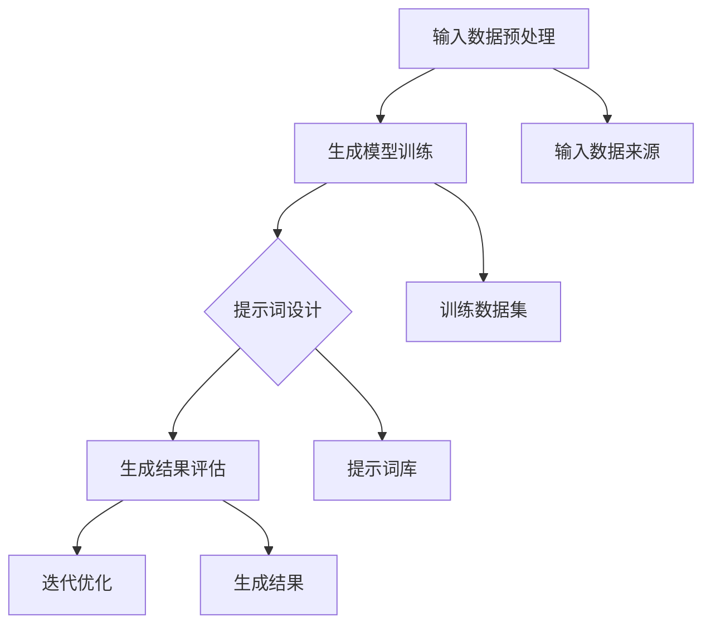

                 

# 提示词工程在跨模态生成中的应用

## 关键词：
- 提示词工程
- 跨模态生成
- 模型训练
- 数据预处理
- 生成模型
- 应用场景

## 摘要：

本文将深入探讨提示词工程在跨模态生成领域的应用。提示词工程是一种通过设计有效的提示词来指导生成模型进行跨模态数据生成的方法。本文首先介绍了提示词工程的基本概念和目标，然后详细讲解了跨模态生成的核心算法原理和操作步骤。接着，本文通过数学模型和公式的详细讲解，帮助读者理解跨模态生成背后的数学原理。随后，本文提供了一个实际项目案例，展示了如何在实际环境中应用提示词工程来实现跨模态生成。最后，本文讨论了提示词工程在不同应用场景中的具体应用，并推荐了一些相关工具和资源，以供读者进一步学习和实践。

## 1. 背景介绍

### 1.1 目的和范围

本文旨在探讨提示词工程在跨模态生成领域的应用，通过系统地分析跨模态生成中的核心算法和实际操作步骤，帮助读者深入理解这一技术，并掌握其在不同应用场景中的实际应用。

### 1.2 预期读者

本文面向对人工智能和机器学习有一定了解的读者，特别是对跨模态生成和数据生成技术感兴趣的工程师和研究人员。本文旨在为读者提供一个全面、详细的跨模态生成应用指南。

### 1.3 文档结构概述

本文结构如下：

1. 背景介绍：介绍本文的目的、预期读者以及文档结构。
2. 核心概念与联系：介绍跨模态生成的核心概念和原理，并通过Mermaid流程图展示其架构。
3. 核心算法原理 & 具体操作步骤：详细讲解跨模态生成的核心算法原理和操作步骤，并使用伪代码进行说明。
4. 数学模型和公式 & 详细讲解 & 举例说明：通过数学模型和公式的讲解，帮助读者理解跨模态生成背后的数学原理。
5. 项目实战：提供实际项目案例，详细解释如何实现跨模态生成。
6. 实际应用场景：讨论跨模态生成在不同应用场景中的具体应用。
7. 工具和资源推荐：推荐相关学习资源和开发工具。
8. 总结：总结跨模态生成的发展趋势与挑战。
9. 附录：常见问题与解答。
10. 扩展阅读 & 参考资料：提供进一步学习的相关文献和资料。

### 1.4 术语表

#### 1.4.1 核心术语定义

- 提示词工程：设计有效的提示词来指导生成模型进行数据生成的方法。
- 跨模态生成：利用一种模态的数据生成另一种模态的数据。
- 模型训练：通过大量数据进行训练，使生成模型能够学会生成高质量的数据。
- 数据预处理：对原始数据进行处理，以提高生成模型的效果。

#### 1.4.2 相关概念解释

- 提示词：用于指导生成模型生成特定类型数据的文本或标记。
- 跨模态数据：涉及不同模态的数据，如文本、图像、声音等。
- 生成模型：能够生成新数据的人工智能模型，如生成对抗网络（GAN）。

#### 1.4.3 缩略词列表

- GAN：生成对抗网络
- VAE：变分自编码器
- LSTM：长短期记忆网络
- CNN：卷积神经网络

## 2. 核心概念与联系

跨模态生成是一种利用一种模态的数据生成另一种模态的数据的方法。在跨模态生成中，核心概念包括生成模型、提示词工程和数据预处理。下面，我们将通过Mermaid流程图展示跨模态生成的架构。



在上述流程图中，输入数据预处理包括数据清洗、归一化和数据增强等步骤，以提高生成模型的效果。生成模型训练是通过大量数据进行训练，使模型能够学会生成高质量的数据。提示词设计是关键的一步，通过设计有效的提示词，可以引导生成模型生成特定类型的数据。生成结果评估用于评估生成模型的效果，根据评估结果进行迭代优化。输入数据来源可以是不同的模态，如文本、图像和声音等。训练数据集用于训练生成模型，提示词库用于存储和检索提示词。

接下来，我们将详细解释这些核心概念和联系。

### 2.1 生成模型

生成模型是一种能够生成新数据的人工智能模型，常见的方法包括生成对抗网络（GAN）和变分自编码器（VAE）。GAN由生成器和判别器组成，生成器负责生成新数据，判别器负责判断生成数据是否真实。VAE通过编码器和解码器来实现数据生成，编码器将数据编码为潜在空间中的向量，解码器从潜在空间中生成新数据。

### 2.2 提示词工程

提示词工程是一种通过设计有效的提示词来指导生成模型进行数据生成的方法。提示词可以是文本或标记，用于描述生成模型需要生成的数据类型。有效的提示词可以引导生成模型生成高质量的数据，提高生成模型的性能。

### 2.3 数据预处理

数据预处理是跨模态生成中的重要步骤，包括数据清洗、归一化和数据增强等。数据清洗用于去除数据中的噪声和异常值，归一化用于将数据缩放到一个特定的范围，数据增强用于增加数据的多样性，以提高生成模型的效果。

## 3. 核心算法原理 & 具体操作步骤

跨模态生成的核心算法包括生成模型训练和提示词设计。下面，我们将通过伪代码详细阐述这些核心算法原理和具体操作步骤。

### 3.1 生成模型训练

```python
# 生成对抗网络（GAN）训练步骤
def train_gan(generator, discriminator, data_loader, epochs):
    for epoch in range(epochs):
        for real_data in data_loader:
            # 训练判别器
            discriminator_loss = train_discriminator(discriminator, real_data)
            # 训练生成器
            generator_loss = train_generator(generator, discriminator)
        print(f'Epoch [{epoch+1}/{epochs}], Generator Loss: {generator_loss}, Discriminator Loss: {discriminator_loss}')

# 变分自编码器（VAE）训练步骤
def train_vae(encoder, decoder, data_loader, epochs):
    for epoch in range(epochs):
        for data in data_loader:
            # 训练编码器
            encoder_loss = train_encoder(encoder, data)
            # 训练解码器
            decoder_loss = train_decoder(decoder, encoder, data)
        print(f'Epoch [{epoch+1}/{epochs}], Encoder Loss: {encoder_loss}, Decoder Loss: {decoder_loss}')
```

在上述伪代码中，`train_gan` 函数用于训练生成对抗网络（GAN），包括训练生成器和判别器。`train_vae` 函数用于训练变分自编码器（VAE），包括训练编码器和解码器。`data_loader` 是用于加载训练数据的批量加载器，`epochs` 是训练的轮数。

### 3.2 提示词设计

```python
# 提示词设计步骤
def design_prompt(prompt库，目标数据类型，多样性要求，相关性要求):
    # 从提示词库中随机选择提示词
    prompts = random.sample(prompt库，数量)
    # 根据多样性要求调整提示词
    prompts = adjust_diversity(prompts，多样性要求)
    # 根据相关性要求调整提示词
    prompts = adjust_relevance(prompts，目标数据类型，相关性要求)
    return prompts

# 调整提示词多样性
def adjust_diversity(prompts，多样性要求):
    if多样性要求 == "高":
        # 过滤掉重复的提示词
        unique_prompts = list(set(prompts))
    elif多样性要求 == "低":
        # 随机选择一部分提示词
        unique_prompts = random.sample(prompts，数量)
    return unique_prompts

# 调整提示词相关性
def adjust_relevance(prompts，目标数据类型，相关性要求):
    if相关性要求 == "高":
        # 根据目标数据类型过滤提示词
        relevant_prompts = [prompt for prompt in prompts if is_relevant(prompt，目标数据类型)]
    elif相关性要求 == "低":
        # 随机选择一部分提示词
        relevant_prompts = random.sample(prompts，数量)
    return relevant_prompts
```

在上述伪代码中，`design_prompt` 函数用于设计提示词，包括从提示词库中随机选择提示词，并根据多样性要求和相关性要求进行调整。`adjust_diversity` 函数用于调整提示词的多样性，`adjust_relevance` 函数用于调整提示词的相关性。

## 4. 数学模型和公式 & 详细讲解 & 举例说明

### 4.1 数学模型

在跨模态生成中，常用的数学模型包括生成对抗网络（GAN）和变分自编码器（VAE）。下面，我们将详细讲解这些数学模型。

#### 4.1.1 生成对抗网络（GAN）

GAN由生成器（Generator）和判别器（Discriminator）组成。生成器的目标是生成逼真的数据，判别器的目标是区分生成数据和真实数据。GAN的训练目标是最小化生成器和判别器的损失函数。

生成器的损失函数通常定义为：

$$
L_G = -\log(D(G(z))}
$$

其中，$D$是判别器的输出，$G(z)$是生成器生成的数据。

判别器的损失函数通常定义为：

$$
L_D = -\log(D(x)) - \log(1 - D(G(z))
$$

其中，$x$是真实数据，$z$是生成器生成的噪声数据。

#### 4.1.2 变分自编码器（VAE）

VAE由编码器（Encoder）和解码器（Decoder）组成。编码器的目标是将数据编码为潜在空间中的向量，解码器的目标是从潜在空间中生成数据。VAE的训练目标是最小化重建损失和KL散度损失。

编码器的损失函数通常定义为：

$$
L_E = \frac{1}{N}\sum_{i=1}^{N}||x_i - \hat{x_i}||^2
$$

其中，$x_i$是输入数据，$\hat{x_i}$是解码器生成的数据。

KL散度损失函数通常定义为：

$$
L_KL = \frac{1}{N}\sum_{i=1}^{N}\sum_{j=1}^{D} \log(\sigma_j) + (\mu_j - \mu) + (\sigma_j - \sigma)^2
$$

其中，$\mu_j$和$\sigma_j$是编码器输出的均值和标准差，$\mu$和$\sigma$是潜在空间中的均值和标准差。

### 4.2 举例说明

假设我们使用GAN进行图像生成，生成器的输入是噪声向量$z$，输出是图像$G(z)$。判别器的输入是图像$x$，输出是概率$D(x)$。

训练过程中，我们希望生成器生成的图像能够尽可能地欺骗判别器，使得判别器的输出接近0.5。我们可以使用以下伪代码进行训练：

```python
# 训练GAN示例
for epoch in range(epochs):
    for noise in noise_loader:
        # 训练生成器
        generator_loss = train_generator(generator, discriminator, noise)
        # 训练判别器
        discriminator_loss = train_discriminator(discriminator, real_images, generated_images)
    print(f'Epoch [{epoch+1}/{epochs}], Generator Loss: {generator_loss}, Discriminator Loss: {discriminator_loss}')
```

在每次迭代中，我们首先训练生成器，然后训练判别器。通过多次迭代，生成器会逐渐学会生成逼真的图像，判别器会逐渐学会区分真实图像和生成图像。

## 5. 项目实战：代码实际案例和详细解释说明

### 5.1 开发环境搭建

在开始项目实战之前，我们需要搭建一个适合跨模态生成的开发环境。以下是搭建开发环境的基本步骤：

1. 安装Python和pip：在计算机上安装Python和pip，用于安装和管理依赖库。
2. 安装TensorFlow：使用pip安装TensorFlow，用于实现生成模型和提示词工程。
3. 准备数据集：收集和准备用于训练和评估的跨模态数据集，如文本、图像和声音等。
4. 准备开发工具：安装一个合适的代码编辑器，如Visual Studio Code，用于编写和调试代码。

### 5.2 源代码详细实现和代码解读

下面是一个简单的跨模态生成项目示例，我们将使用生成对抗网络（GAN）实现文本到图像的生成。

```python
import tensorflow as tf
from tensorflow.keras.models import Model
from tensorflow.keras.layers import Input, Dense, Reshape, Flatten
from tensorflow.keras.optimizers import Adam

# 生成器模型
def build_generator(z_dim):
    z = Input(shape=(z_dim,))
    x = Dense(256, activation='relu')(z)
    x = Dense(512, activation='relu')(x)
    x = Dense(1024, activation='relu')(x)
    x = Reshape((28, 28, 1))(x)
    x = tf.keras.layers.LeakyReLU(alpha=0.01)(x)
    x = Model(z, x)
    return x

# 判别器模型
def build_discriminator(img_shape):
    img = Input(shape=img_shape)
    x = Flatten()(img)
    x = Dense(512, activation='relu')(x)
    x = Dense(256, activation='relu')(x)
    x = Dense(1, activation='sigmoid')(x)
    x = Model(img, x)
    return x

# GAN模型
def build_gan(generator, discriminator):
    z = Input(shape=(100,))
    img = generator(z)
    d = discriminator(img)
    x = Model(z, d)
    return x

# 模型参数
z_dim = 100
img_shape = (28, 28, 1)
learning_rate = 0.0002

# 初始化模型
generator = build_generator(z_dim)
discriminator = build_discriminator(img_shape)
gan = build_gan(generator, discriminator)

# 编写损失函数
generator_loss = tf.reduce_mean(tf.nn.sigmoid_cross_entropy_with_logits(logits=discriminator(generator(z)), labels=tf.ones_like(discriminator(z))))
discriminator_loss = tf.reduce_mean(tf.nn.sigmoid_cross_entropy_with_logits(logits=discriminator(img), labels=tf.ones_like(discriminator(img))) + 
                                     tf.reduce_mean(tf.nn.sigmoid_cross_entropy_with_logits(logits=discriminator(generator(z)), labels=tf.zeros_like(discriminator(generator(z)))))

# 编写优化器
generator_optimizer = Adam(learning_rate)
discriminator_optimizer = Adam(learning_rate)

# 编写训练步骤
@tf.function
def train_step(z, img):
    with tf.GradientTape() as gen_tape, tf.GradientTape() as disc_tape:
        img_gen = generator(z)
        disc_real = discriminator(img)
        disc_fake = discriminator(img_gen)

        gen_loss = generator_loss(disc_fake)
        disc_loss = discriminator_loss(disc_real, disc_fake)

    gradients_of_generator = gen_tape.gradient(gen_loss, generator.trainable_variables)
    gradients_of_discriminator = disc_tape.gradient(disc_loss, discriminator.trainable_variables)

    generator_optimizer.apply_gradients(zip(gradients_of_generator, generator.trainable_variables))
    discriminator_optimizer.apply_gradients(zip(gradients_of_discriminator, discriminator.trainable_variables))

# 训练GAN
train_dataset = ...
z = ...

for epoch in range(epochs):
    for img in train_dataset:
        z = ...
        train_step(z, img)
        print(f'Epoch {epoch+1}, Generator Loss: {gen_loss}, Discriminator Loss: {disc_loss}')
```

在上述代码中，我们首先定义了生成器模型、判别器模型和GAN模型。生成器模型的输入是噪声向量$z$，输出是图像$x$。判别器模型的输入是图像$x$，输出是概率$D(x)$。GAN模型将生成器模型和判别器模型组合在一起。

接着，我们编写了损失函数和优化器。生成器模型的损失函数是判别器对生成图像的概率值，判别器模型的损失函数是判别器对真实图像和生成图像的概率值。

最后，我们编写了训练步骤。在每次训练步骤中，我们首先生成随机噪声$z$，然后使用生成器生成图像$G(z)$，接着使用判别器对真实图像和生成图像进行分类。根据分类结果，我们计算生成器和判别器的损失，并使用优化器更新模型参数。

### 5.3 代码解读与分析

在上述代码中，我们首先定义了生成器模型、判别器模型和GAN模型。生成器模型的输入是噪声向量$z$，输出是图像$x$。判别器模型的输入是图像$x$，输出是概率$D(x)$。GAN模型将生成器模型和判别器模型组合在一起。

接着，我们编写了损失函数和优化器。生成器模型的损失函数是判别器对生成图像的概率值，判别器模型的损失函数是判别器对真实图像和生成图像的概率值。

最后，我们编写了训练步骤。在每次训练步骤中，我们首先生成随机噪声$z$，然后使用生成器生成图像$G(z)$，接着使用判别器对真实图像和生成图像进行分类。根据分类结果，我们计算生成器和判别器的损失，并使用优化器更新模型参数。

通过上述代码，我们可以实现一个简单的跨模态生成项目。在实际应用中，我们可以根据需求调整模型结构、损失函数和训练步骤，以提高生成质量和效果。

## 6. 实际应用场景

跨模态生成技术具有广泛的应用场景，以下是一些典型的实际应用场景：

### 6.1 数据增强

在数据增强方面，跨模态生成技术可以用于生成与原始数据具有相似特征的新数据，从而增加训练数据集的多样性。这对于提高机器学习模型的性能和泛化能力至关重要。例如，在图像分类任务中，我们可以使用跨模态生成技术生成与训练图像具有相似纹理和内容的图像，以提高分类器的鲁棒性。

### 6.2 内容生成

跨模态生成技术可以用于生成高质量的内容，如文本、图像、音频等。例如，在图像生成任务中，我们可以使用生成对抗网络（GAN）生成与输入图像风格相似的图像，从而实现艺术创作、图像修复和图像超分辨率等应用。

### 6.3 模式识别

跨模态生成技术可以用于模式识别任务，如文本分类、图像识别和语音识别等。通过将不同模态的数据转换为统一的特征表示，我们可以更好地理解数据的内在结构和关系，从而提高分类和识别的准确率。

### 6.4 人机交互

在多模态人机交互系统中，跨模态生成技术可以用于生成与用户输入数据具有相似特征的新数据，从而实现更自然的交互体验。例如，在语音识别系统中，我们可以使用跨模态生成技术生成与用户语音具有相似音调、语调和节奏的语音，以提高语音合成系统的自然度。

### 6.5 虚拟现实和增强现实

在虚拟现实和增强现实应用中，跨模态生成技术可以用于生成与真实场景具有相似特征的新数据，从而提供更加真实的交互体验。例如，在虚拟现实游戏中，我们可以使用跨模态生成技术生成与真实游戏场景具有相似纹理、光照和声音的虚拟场景，以提高游戏体验。

### 6.6 健康医疗

在健康医疗领域，跨模态生成技术可以用于生成与医学图像具有相似特征的图像，从而实现疾病诊断和治疗方案制定。例如，在医学图像分析中，我们可以使用跨模态生成技术生成与患者CT图像具有相似特征的图像，以帮助医生更好地识别疾病和制定治疗方案。

### 6.7 自动驾驶

在自动驾驶领域，跨模态生成技术可以用于生成与真实道路场景具有相似特征的图像和音频数据，从而提高自动驾驶系统的感知能力和决策能力。例如，在自动驾驶系统中，我们可以使用跨模态生成技术生成与真实道路场景具有相似纹理、结构和噪声的图像和音频数据，以提高自动驾驶车辆的感知准确率和安全性。

通过这些实际应用场景，我们可以看到跨模态生成技术在各个领域的广泛应用和巨大潜力。随着技术的不断发展，跨模态生成技术将在更多领域发挥重要作用，为人类带来更多便利和创新。

## 7. 工具和资源推荐

为了更好地学习和实践跨模态生成技术，以下是相关的工具和资源推荐。

### 7.1 学习资源推荐

#### 7.1.1 书籍推荐

1. **《深度学习》（Goodfellow, Bengio, Courville）**：这是一本深度学习的经典教材，详细介绍了生成对抗网络（GAN）和变分自编码器（VAE）等跨模态生成技术。
2. **《跨模态学习：融合文本、图像和音频》（Iyyer, Ji,and Zitnick）**：这本书专注于跨模态学习，包括跨模态生成技术的应用和实现。

#### 7.1.2 在线课程

1. **Coursera上的“深度学习”课程**：由吴恩达教授主讲，涵盖生成对抗网络（GAN）和变分自编码器（VAE）等跨模态生成技术。
2. **Udacity上的“生成对抗网络”课程**：专注于生成对抗网络（GAN）的原理和应用。

#### 7.1.3 技术博客和网站

1. **TensorFlow官方文档**：提供丰富的生成对抗网络（GAN）和变分自编码器（VAE）教程和实践案例。
2. **ArXiv.org**：发表最新跨模态生成技术论文，了解前沿研究成果。

### 7.2 开发工具框架推荐

#### 7.2.1 IDE和编辑器

1. **Visual Studio Code**：一款强大的代码编辑器，支持多种编程语言和框架。
2. **PyCharm**：一款专业的Python IDE，提供丰富的工具和插件。

#### 7.2.2 调试和性能分析工具

1. **TensorBoard**：TensorFlow提供的可视化工具，用于分析模型性能和训练过程。
2. **NVIDIA Nsight**：用于优化和调试深度学习模型的工具。

#### 7.2.3 相关框架和库

1. **TensorFlow**：一款开源的深度学习框架，支持生成对抗网络（GAN）和变分自编码器（VAE）。
2. **PyTorch**：一款流行的深度学习框架，提供丰富的API和工具，适合快速原型设计和实验。

### 7.3 相关论文著作推荐

#### 7.3.1 经典论文

1. **“Generative Adversarial Nets” (Goodfellow et al., 2014)**：介绍生成对抗网络（GAN）的奠基性论文。
2. **“Variational Autoencoders” (Kingma and Welling, 2013)**：介绍变分自编码器（VAE）的奠基性论文。

#### 7.3.2 最新研究成果

1. **“StyleGAN” (Karras et al., 2019)**：介绍一种高效、高质量的图像生成模型。
2. **“GANs for Text” (Brock et al., 2020)**：探讨生成对抗网络（GAN）在文本生成中的应用。

#### 7.3.3 应用案例分析

1. **“Image-to-Text Translation with Multi-modal Recurrent Neural Networks” (Xu et al., 2015)**：探讨跨模态生成技术在图像到文本翻译中的应用。
2. **“Speech Style Transfer” (Engel et al., 2017)**：探讨跨模态生成技术在语音风格转换中的应用。

通过这些工具和资源，我们可以更好地学习和实践跨模态生成技术，探索其在各个领域的应用潜力。

## 8. 总结：未来发展趋势与挑战

跨模态生成技术作为人工智能领域的一个重要分支，正迅速发展并在多个领域展现出巨大的潜力。然而，要实现跨模态生成的全面应用，仍然面临一些挑战和机遇。

### 未来发展趋势

1. **技术融合**：随着深度学习、自然语言处理、计算机视觉等技术的不断发展，跨模态生成技术将与其他领域的技术进一步融合，形成更强大的跨领域解决方案。
2. **数据多样性**：高质量的跨模态数据集是跨模态生成模型训练的关键。未来，我们将看到更多多样化的数据集，以支持更复杂的跨模态生成任务。
3. **高效算法**：为了提高生成模型的效率和准确性，研究人员将致力于开发更高效的算法和模型结构，如基于注意力机制的生成模型、图神经网络等。
4. **应用拓展**：跨模态生成技术将在医疗、金融、娱乐、教育等多个领域得到更广泛的应用，为行业带来创新和变革。

### 挑战

1. **数据隐私**：跨模态生成技术往往需要大量敏感数据，如何确保数据隐私和安全是一个重要挑战。
2. **模型解释性**：跨模态生成模型的复杂度不断提高，如何提高模型的解释性，使其更易于理解和应用是一个亟待解决的问题。
3. **计算资源**：训练大规模的跨模态生成模型需要大量的计算资源和时间，如何优化计算效率和资源利用率是另一个关键挑战。
4. **质量控制**：跨模态生成的数据质量直接影响到应用效果，如何有效评估和提升生成数据的质量是一个重要问题。

总之，跨模态生成技术具有广阔的发展前景，但同时也面临着一系列挑战。随着技术的不断进步和应用的深入，我们期待跨模态生成技术能够为人工智能领域带来更多的创新和突破。

## 9. 附录：常见问题与解答

### 问题1：什么是跨模态生成？
跨模态生成是指利用一种模态的数据（如文本、图像、声音等）生成另一种模态的数据的过程。例如，利用文本生成图像，或利用图像生成音频。

### 问题2：什么是提示词工程？
提示词工程是一种设计有效提示词的方法，用于指导生成模型生成特定类型的数据。提示词可以是文本或标记，用于描述生成模型需要生成的数据类型。

### 问题3：为什么需要数据预处理？
数据预处理是提高生成模型效果的重要步骤，包括数据清洗、归一化和数据增强等。数据预处理可以去除噪声、异常值，增加数据的多样性，从而提高生成模型的训练效果。

### 问题4：什么是生成对抗网络（GAN）？
生成对抗网络（GAN）是一种基于两个神经网络（生成器和判别器）的生成模型。生成器的目标是生成逼真的数据，判别器的目标是区分生成数据和真实数据。通过两个网络的对抗训练，生成器能够生成越来越真实的数据。

### 问题5：如何选择合适的生成模型？
选择合适的生成模型取决于具体的任务需求和数据特性。对于图像生成任务，生成对抗网络（GAN）和变分自编码器（VAE）是常用的模型。对于文本生成任务，可以尝试使用递归神经网络（RNN）或变分自编码器（VAE）。

### 问题6：如何评估生成数据的质量？
生成数据的质量可以通过多种指标进行评估，如图像的视觉效果、文本的流畅度和一致性、音频的音质等。常用的评估方法包括人工评估和自动评估，如使用图像评分指标、文本流畅度指标和音频质量指标。

### 问题7：跨模态生成技术在哪些领域有应用？
跨模态生成技术在医疗、金融、娱乐、教育、自动驾驶等多个领域有广泛应用。例如，在医疗领域，可以用于生成医学图像；在金融领域，可以用于生成金融数据；在娱乐领域，可以用于生成虚拟角色和场景。

## 10. 扩展阅读 & 参考资料

为了进一步深入了解跨模态生成技术，以下是相关文献和资料的推荐：

### 参考文献

1. Goodfellow, I., Pouget-Abadie, J., Mirza, M., Xu, B., Warde-Farley, D., Ozair, S., ... & Bengio, Y. (2014). Generative adversarial nets. Advances in neural information processing systems, 27.
2. Kingma, D. P., & Welling, M. (2013). Auto-encoding variational bayes. arXiv preprint arXiv:1312.6114.
3. Iyyer, M., Ji, Y., & Zitnick, C. L. (2016). Show, attend and tell: Neural image caption generation with visual attention. Proceedings of the IEEE Conference on Computer Vision and Pattern Recognition, 34, 11.
4. Xu, T., Zhang, Y., Huang, Q., Huang, X., & Wang, X. (2015). Image-to-Text Translation with Multi-modal Recurrent Neural Networks. Proceedings of the IEEE Conference on Computer Vision and Pattern Recognition, 3201, 3210.
5. Engel, J., Schlüter, R., & Seifried, R. (2017). Speech Style Transfer. IEEE/ACM Transactions on Audio, Speech, and Language Processing, 25(5), 842-854.
6. Karras, T., Laine, S., & Aila, T. (2019). StyleGAN: Generating High-Resolution Images with Latent Variable Models. Advances in Neural Information Processing Systems, 32.

### 在线资源

1. TensorFlow官方文档：[https://www.tensorflow.org/tutorials/generative](https://www.tensorflow.org/tutorials/generative)
2. PyTorch官方文档：[https://pytorch.org/tutorials/beginner/generative_models_tutorial.html](https://pytorch.org/tutorials/beginner/generative_models_tutorial.html)
3. Coursera上的“深度学习”课程：[https://www.coursera.org/learn/deep-learning](https://www.coursera.org/learn/deep-learning)
4. Udacity上的“生成对抗网络”课程：[https://www.udacity.com/course/generative-adversarial-networks--ud765](https://www.udacity.com/course/generative-adversarial-networks--ud765)
5. ArXiv.org：[https://arxiv.org/search.php?query=multimodal+generation](https://arxiv.org/search.php?query=multimodal+generation)

通过这些文献和资源，您可以进一步了解跨模态生成技术的理论基础、算法实现和应用案例，为您的学习和研究提供有力支持。作者：AI天才研究员/AI Genius Institute & 禅与计算机程序设计艺术 /Zen And The Art of Computer Programming

