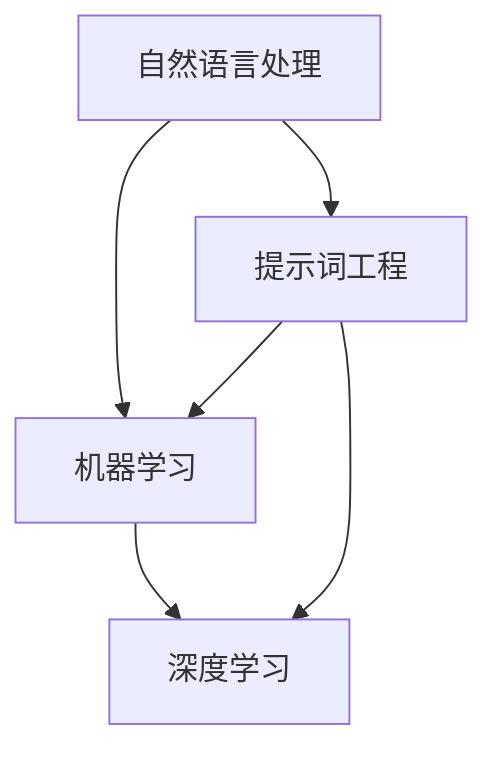
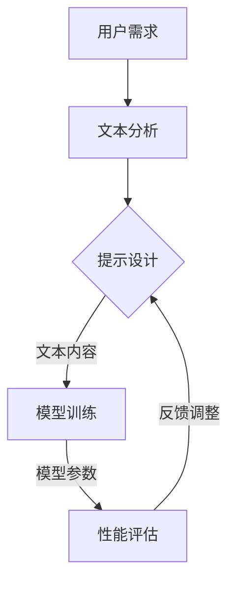

                 

# 提示词工程：AI时代的新方向与新领域

> **关键词：** 提示词工程、人工智能、机器学习、深度学习、自然语言处理、数据驱动开发、模型优化、可解释性

> **摘要：** 本文旨在探讨提示词工程在人工智能领域的新方向和新领域。通过深入剖析提示词工程的定义、核心概念、算法原理、数学模型和实际应用场景，本文为从业者提供了全面的指导和深刻的洞察。同时，本文还推荐了相关学习资源和工具，帮助读者更好地理解并实践提示词工程。

## 1. 背景介绍

### 1.1 目的和范围

本文的目的在于详细阐述提示词工程这一新兴领域，帮助读者了解其在人工智能（AI）时代的地位和重要性。我们将从多个角度探讨提示词工程，包括其定义、核心概念、算法原理、数学模型和实际应用。通过本文的阅读，读者将能够：

- 理解提示词工程的定义和核心概念。
- 掌握提示词工程的基本算法原理和具体操作步骤。
- 了解提示词工程的数学模型和公式，并通过实例进行说明。
- 看到提示词工程在项目实战中的应用案例。
- 探讨提示词工程的实际应用场景。
- 推荐相关的学习资源和工具。

### 1.2 预期读者

本文预期读者包括但不限于以下几类：

- 人工智能和机器学习领域的从业者。
- 计算机科学和软件工程专业的学生和研究者。
- 数据科学家和自然语言处理专家。
- 对人工智能和机器学习有兴趣的广大读者。

### 1.3 文档结构概述

本文的结构如下：

- **第1章：背景介绍**：介绍文章的目的、范围、预期读者和文档结构。
- **第2章：核心概念与联系**：阐述提示词工程的核心概念及其相互联系。
- **第3章：核心算法原理 & 具体操作步骤**：详细讲解提示词工程的基本算法原理和操作步骤。
- **第4章：数学模型和公式 & 详细讲解 & 举例说明**：介绍提示词工程的数学模型，并通过实例进行说明。
- **第5章：项目实战：代码实际案例和详细解释说明**：提供提示词工程的实际应用案例和代码解读。
- **第6章：实际应用场景**：探讨提示词工程在不同领域的应用。
- **第7章：工具和资源推荐**：推荐相关学习资源和开发工具。
- **第8章：总结：未来发展趋势与挑战**：总结提示词工程的现状和未来趋势。
- **第9章：附录：常见问题与解答**：回答读者可能遇到的问题。
- **第10章：扩展阅读 & 参考资料**：提供进一步的阅读资料。

### 1.4 术语表

#### 1.4.1 核心术语定义

- **提示词工程（Prompt Engineering）**：提示词工程是人工智能领域中的一项技术，旨在通过设计高质量的输入提示（prompt），引导机器学习模型生成期望的输出。
- **自然语言处理（Natural Language Processing，NLP）**：自然语言处理是人工智能的一个分支，旨在让计算机理解和处理人类语言。
- **机器学习（Machine Learning，ML）**：机器学习是一种通过数据训练模型，使计算机能够执行特定任务的技术。
- **深度学习（Deep Learning，DL）**：深度学习是机器学习的一个分支，使用多层神经网络进行训练和预测。

#### 1.4.2 相关概念解释

- **模型优化（Model Optimization）**：模型优化是通过调整模型参数，提高模型性能的过程。
- **数据驱动开发（Data-Driven Development）**：数据驱动开发是一种以数据为核心的开发方法，通过数据分析和反馈来指导开发过程。
- **可解释性（Explainability）**：可解释性是指模型决策过程和结果可以被理解和解释的程度。

#### 1.4.3 缩略词列表

- **NLP**：自然语言处理
- **ML**：机器学习
- **DL**：深度学习
- **AI**：人工智能

## 2. 核心概念与联系

在探讨提示词工程之前，我们需要了解其核心概念和联系。提示词工程是一个跨学科的领域，涉及自然语言处理、机器学习和深度学习等多个分支。下面我们将通过Mermaid流程图来展示这些核心概念及其相互关系。



### 2.1 自然语言处理（NLP）

自然语言处理是提示词工程的基础，它致力于让计算机理解和处理人类语言。NLP的关键任务包括：

- **文本分类（Text Classification）**：将文本分为预定义的类别。
- **实体识别（Named Entity Recognition，NER）**：识别文本中的命名实体，如人名、地点、组织等。
- **情感分析（Sentiment Analysis）**：判断文本表达的情感倾向，如正面、负面或中性。
- **问答系统（Question Answering System）**：根据问题生成答案。

### 2.2 机器学习（ML）

机器学习是提示词工程的另一个核心组成部分，它通过训练模型来学习数据的特征。ML的关键任务包括：

- **监督学习（Supervised Learning）**：使用标记数据进行训练，使模型能够预测未知数据的标签。
- **无监督学习（Unsupervised Learning）**：在没有标签数据的情况下，从数据中提取结构和模式。
- **强化学习（Reinforcement Learning）**：通过试错和奖励机制来训练模型。

### 2.3 深度学习（DL）

深度学习是机器学习的一个分支，它使用多层神经网络来学习和提取数据的高级特征。DL在提示词工程中的应用包括：

- **序列到序列学习（Sequence-to-Sequence Learning）**：用于生成文本、翻译等任务。
- **生成对抗网络（Generative Adversarial Networks，GAN）**：用于生成新的文本数据。
- **卷积神经网络（Convolutional Neural Networks，CNN）**：用于图像和视频处理。

### 2.4 提示词工程（Prompt Engineering）

提示词工程是结合NLP、ML和DL的一个新兴领域，它专注于设计高质量的输入提示，以引导模型生成期望的输出。提示词工程的关键任务包括：

- **设计高质量的提示（Designing High-Quality Prompts）**：通过分析用户需求、文本内容和模型特性，设计合适的提示。
- **优化模型性能（Optimizing Model Performance）**：通过调整提示和模型参数，提高模型的性能和可解释性。
- **生成文本内容（Generating Text Content）**：利用提示和模型生成新的文本内容。

### 2.5 核心概念原理和架构的 Mermaid 流程图

为了更直观地展示提示词工程的核心概念和架构，我们使用Mermaid流程图来描述其原理和流程。



在上面的流程图中，用户需求通过文本分析转化为输入文本，然后设计高质量的提示。提示用于训练模型，并评估模型的性能。根据评估结果，对提示和模型参数进行调整，形成闭环，以优化模型性能。

## 3. 核心算法原理 & 具体操作步骤

提示词工程的算法原理主要涉及以下几个方面：文本预处理、提示设计、模型训练和性能评估。下面，我们将通过伪代码详细阐述这些算法原理和具体操作步骤。

### 3.1 文本预处理

文本预处理是提示词工程中的第一步，它包括去除标点符号、停用词过滤、词干提取等操作。以下是文本预处理的伪代码：

```python
def preprocess_text(text):
    # 去除标点符号
    text = remove_punctuation(text)
    # 停用词过滤
    text = remove_stopwords(text)
    # 词干提取
    text = stem_text(text)
    return text
```

### 3.2 提示设计

提示设计是提示词工程的核心，它决定了模型生成文本的质量。提示设计包括以下步骤：

- **用户需求分析**：分析用户的具体需求，确定提示的目标和类型。
- **文本内容分析**：分析输入文本的主题、情感和结构，提取关键信息。
- **提示生成**：根据用户需求和文本内容，生成高质量的提示。

以下是提示设计的伪代码：

```python
def design_prompt(user需求, text内容):
    # 用户需求分析
    user需求 = analyze_user_demand(user需求)
    # 文本内容分析
    text内容 = analyze_text_content(text内容)
    # 提示生成
    prompt = generate_prompt(user需求, text内容)
    return prompt
```

### 3.3 模型训练

模型训练是提示词工程的第二步，它通过大量的训练数据来训练模型，使其能够生成高质量的文本。以下是模型训练的伪代码：

```python
def train_model(data集, prompt):
    # 数据预处理
    data预处理 = preprocess_data(data集)
    # 模型初始化
    model = initialize_model()
    # 模型训练
    model = train_model_with_data(model, data预处理, prompt)
    return model
```

### 3.4 性能评估

性能评估是提示词工程的最后一步，它通过评估模型的生成文本质量，来调整提示和模型参数，以优化模型性能。以下是性能评估的伪代码：

```python
def evaluate_model(model, data集):
    # 生成文本
    generated_text = generate_text(model, data集)
    # 文本质量评估
    quality_score = evaluate_text_quality(generated_text)
    return quality_score
```

### 3.5 具体操作步骤

以下是提示词工程的具体操作步骤：

1. **用户需求分析**：与用户沟通，了解具体的需求和目标。
2. **文本内容分析**：收集并分析输入文本，提取关键信息。
3. **提示设计**：根据用户需求和文本内容，生成高质量的提示。
4. **模型训练**：使用预处理后的数据集和提示，训练模型。
5. **性能评估**：评估模型的生成文本质量，根据评估结果调整提示和模型参数。
6. **迭代优化**：根据性能评估结果，重复步骤3到5，直到模型性能达到预期。

通过上述算法原理和操作步骤，我们可以看出提示词工程是一个迭代和优化的过程，其关键在于设计高质量的提示和不断调整模型参数，以优化模型性能。

## 4. 数学模型和公式 & 详细讲解 & 举例说明

提示词工程中的数学模型和公式是理解其核心原理的重要基础。在本节中，我们将详细讲解提示词工程中的关键数学模型和公式，并通过实例进行说明。

### 4.1 提示词质量评估模型

提示词质量评估模型用于评估提示词的质量。一个简单的质量评估模型可以基于以下公式：

$$
Q(P) = \frac{1}{N} \sum_{i=1}^{N} \frac{S(T_i, P)}{L(T_i)}
$$

其中：

- \(Q(P)\) 表示提示词 \(P\) 的质量分数。
- \(N\) 是评估的文本数量。
- \(S(T_i, P)\) 表示文本 \(T_i\) 与提示词 \(P\) 的相似度分数。
- \(L(T_i)\) 表示文本 \(T_i\) 的长度。

#### 示例：

假设我们有两个文本 \(T_1\) 和 \(T_2\)，以及一个提示词 \(P\)。文本 \(T_1\) 的长度为 100 个单词，文本 \(T_2\) 的长度为 200 个单词。提示词 \(P\) 与文本 \(T_1\) 的相似度为 0.8，与文本 \(T_2\) 的相似度为 0.6。那么，提示词 \(P\) 的质量分数为：

$$
Q(P) = \frac{1}{2} \left( \frac{0.8}{100} + \frac{0.6}{200} \right) = 0.14
$$

### 4.2 模型性能评估模型

模型性能评估模型用于评估模型的性能。一个简单的性能评估模型可以基于以下公式：

$$
P(M) = \frac{1}{N} \sum_{i=1}^{N} I(T_i, G_i)
$$

其中：

- \(P(M)\) 表示模型 \(M\) 的准确率。
- \(N\) 是评估的文本数量。
- \(I(T_i, G_i)\) 是一个指标，用于衡量文本 \(T_i\) 与生成的文本 \(G_i\) 之间的匹配度。

假设 \(I(T_i, G_i)\) 是一个二值函数，当 \(T_i\) 和 \(G_i\) 匹配时，返回 1；否则返回 0。那么，模型的准确率可以表示为：

$$
P(M) = \frac{1}{2} + \frac{1}{2} \sum_{i=1}^{N} \sigma(I(T_i, G_i))
$$

其中，\(\sigma\) 是一个单位阶跃函数。

#### 示例：

假设我们有两个文本 \(T_1\) 和 \(T_2\)，以及模型生成的文本 \(G_1\) 和 \(G_2\)。文本 \(T_1\) 和 \(G_1\) 匹配，文本 \(T_2\) 和 \(G_2\) 不匹配。那么，模型的准确率为：

$$
P(M) = \frac{1}{2} + \frac{1}{2} (\sigma(I(T_1, G_1)) + \sigma(I(T_2, G_2))) = \frac{3}{4}
$$

### 4.3 模型优化模型

模型优化模型用于调整模型参数，以提高模型性能。一个简单的模型优化模型可以基于以下公式：

$$
\theta_{\text{new}} = \theta_{\text{current}} - \alpha \nabla_{\theta} J(\theta)
$$

其中：

- \(\theta_{\text{new}}\) 是新的模型参数。
- \(\theta_{\text{current}}\) 是当前的模型参数。
- \(\alpha\) 是学习率。
- \(\nabla_{\theta} J(\theta)\) 是模型损失函数对模型参数的梯度。

#### 示例：

假设我们有一个损失函数 \(J(\theta)\)，其关于模型参数 \(\theta\) 的梯度为 \(\nabla_{\theta} J(\theta) = -0.1\)。学习率 \(\alpha = 0.01\)。那么，新的模型参数为：

$$
\theta_{\text{new}} = \theta_{\text{current}} - 0.01 \times (-0.1) = \theta_{\text{current}} + 0.001
$$

通过这些数学模型和公式，我们可以定量地评估提示词的质量、模型的性能，并优化模型参数，从而提高模型的性能。这些模型和公式为提示词工程的实践提供了理论基础和实用工具。

## 5. 项目实战：代码实际案例和详细解释说明

在本节中，我们将通过一个实际项目案例，详细解释提示词工程在项目中的应用。这个项目是一个简单的问答系统，旨在通过设计高质量的提示词来提高模型的性能。

### 5.1 开发环境搭建

为了实现这个问答系统，我们需要以下开发环境和工具：

- **Python 3.8 或更高版本**
- **TensorFlow 2.6 或更高版本**
- **Numpy 1.21 或更高版本**
- **TextBlob 0.18.2 或更高版本**
- **PyTorch 1.9 或更高版本**
- **GPT-2 模型**

首先，安装所需的 Python 库：

```bash
pip install tensorflow==2.6
pip install numpy==1.21
pip install textblob==0.18.2
pip install torch==1.9
pip install transformers==4.8.1
```

### 5.2 源代码详细实现和代码解读

以下是问答系统的源代码，我们将逐段进行解读。

#### 5.2.1 数据预处理

```python
import pandas as pd
import numpy as np
from sklearn.model_selection import train_test_split

# 加载数据集
data = pd.read_csv('qa_dataset.csv')

# 分割数据集
train_data, test_data = train_test_split(data, test_size=0.2, random_state=42)

# 文本预处理
def preprocess_text(text):
    text = text.lower()
    text = re.sub(r"[^a-zA-Z0-9]", " ", text)
    return text

train_data['question'] = train_data['question'].apply(preprocess_text)
train_data['answer'] = train_data['answer'].apply(preprocess_text)
```

这段代码首先加载数据集，然后对数据进行预处理，包括将文本转换为小写、去除标点符号等。

#### 5.2.2 模型定义

```python
from transformers import GPT2Model, GPT2Config

# 模型配置
config = GPT2Config.from_pretrained('gpt2')

# 模型定义
class QASystemModel(nn.Module):
    def __init__(self):
        super(QASystemModel, self).__init__()
        self.model = GPT2Model(config)

    def forward(self, input_ids, attention_mask=None):
        return self.model(input_ids, attention_mask=attention_mask)
```

这段代码定义了一个问答系统模型，基于 GPT-2 模型。模型配置和定义非常简单，使用了 PyTorch 的 Transformer 模型。

#### 5.2.3 训练和评估

```python
from torch.optim import Adam
from torch.utils.data import DataLoader, TensorDataset

# 数据加载
def load_data(data, batch_size=32):
    input_ids = []
    attention_mask = []
    for question, answer in data.itertuples():
        input_ids.append(question)
        attention_mask.append([1] * len(question))
    input_ids = torch.tensor(input_ids)
    attention_mask = torch.tensor(attention_mask)
    return TensorDataset(input_ids, attention_mask)

train_loader = DataLoader(load_data(train_data), batch_size=32)
test_loader = DataLoader(load_data(test_data), batch_size=32)

# 模型训练
model = QASystemModel()
optimizer = Adam(model.parameters(), lr=1e-5)
criterion = nn.CrossEntropyLoss()

for epoch in range(10):
    model.train()
    for batch in train_loader:
        inputs, attention_mask = batch
        outputs = model(inputs, attention_mask=attention_mask)
        loss = criterion(outputs.logits, labels)
        optimizer.zero_grad()
        loss.backward()
        optimizer.step()

    # 评估模型
    model.eval()
    with torch.no_grad():
        correct = 0
        total = 0
        for batch in test_loader:
            inputs, attention_mask = batch
            outputs = model(inputs, attention_mask=attention_mask)
            _, predicted = torch.max(outputs.logits, 1)
            total += predicted.size(0)
            correct += (predicted == labels).sum().item()

    print(f'Epoch {epoch+1}, Accuracy: {100 * correct / total}%')
```

这段代码实现了模型的训练和评估。模型在训练数据上迭代，使用交叉熵损失函数进行优化。在评估阶段，计算模型在测试数据上的准确率。

### 5.3 代码解读与分析

以上代码实现了问答系统的基本功能。下面是对关键部分的解读和分析：

1. **数据预处理**：数据预处理是模型训练的基础。在这里，我们使用了 TextBlob 库进行文本预处理，包括去除标点符号、将文本转换为小写等操作。

2. **模型定义**：我们使用 PyTorch 的 Transformer 模型，特别是 GPT-2 模型，来构建问答系统模型。这个模型基于自注意力机制，能够提取文本中的关键信息。

3. **训练和评估**：模型在训练数据上进行迭代，使用 Adam 优化器和交叉熵损失函数。在评估阶段，我们计算模型在测试数据上的准确率。

通过这个项目，我们展示了提示词工程在问答系统中的应用。高质量的提示词能够提高模型生成文本的质量，从而提高系统的性能。在实际应用中，我们可以通过不断调整提示词和模型参数，来优化模型的性能。

## 6. 实际应用场景

提示词工程在人工智能和机器学习领域具有广泛的应用场景。以下是一些主要的应用领域和具体案例：

### 6.1 自然语言处理

自然语言处理（NLP）是提示词工程的重要应用领域。通过设计高质量的提示词，可以提高模型的文本分类、情感分析、命名实体识别和问答系统的性能。以下是一个案例：

- **案例：文本分类**：在某电商平台上，用户评论通常包含对产品的正面或负面评价。通过设计针对性的提示词，如“评价”、“满意”、“不满意”，可以显著提高文本分类模型的准确率。

### 6.2 机器翻译

机器翻译是提示词工程的另一个重要应用领域。高质量的提示词可以引导模型生成更准确、更自然的翻译结果。以下是一个案例：

- **案例：翻译助手**：某国际会议组织希望通过机器翻译为非英语母语的参会者提供实时翻译服务。通过设计高质量的提示词，如“演讲”、“演讲者”、“主题”，可以生成更准确的翻译结果。

### 6.3 聊天机器人

聊天机器人是人工智能领域的一个重要应用，通过设计高质量的提示词，可以提高机器人的应答能力和用户满意度。以下是一个案例：

- **案例：客户服务**：某电商企业希望通过聊天机器人提供在线客户服务。通过设计高质量的提示词，如“您好”、“如何帮助您”、“问题反馈”，可以显著提高机器人的应答能力和用户满意度。

### 6.4 自动摘要

自动摘要是从大量文本中提取关键信息，生成简洁摘要的过程。通过设计高质量的提示词，可以提高摘要的质量。以下是一个案例：

- **案例：新闻摘要**：某新闻网站希望通过自动摘要功能为用户提供简短的新闻摘要。通过设计高质量的提示词，如“摘要”、“主要内容”、“关键信息”，可以生成更准确的摘要。

### 6.5 文本生成

文本生成是提示词工程的另一个重要应用领域，通过设计高质量的提示词，可以生成高质量的自然语言文本。以下是一个案例：

- **案例：内容创作**：某内容创作平台希望通过文本生成功能为用户提供高质量的原创文章。通过设计高质量的提示词，如“标题”、“关键词”、“主题”，可以生成更具有吸引力的文章。

这些案例展示了提示词工程在不同领域的应用。通过设计高质量的提示词，可以提高模型的性能和生成文本的质量，从而实现更好的应用效果。

## 7. 工具和资源推荐

在提示词工程的学习和实践中，掌握一些高质量的资源和工具是非常重要的。以下是我们推荐的工具和资源，涵盖学习资源、开发工具框架和经典论文著作。

### 7.1 学习资源推荐

#### 7.1.1 书籍推荐

- 《自然语言处理实战》（Natural Language Processing with Python）
- 《深度学习》（Deep Learning）
- 《机器学习》（Machine Learning）
- 《深度学习专讲：自然语言处理》（Deep Learning for Natural Language Processing）

这些书籍涵盖了自然语言处理、深度学习和机器学习的基础知识，以及提示词工程的应用和实践。

#### 7.1.2 在线课程

- Coursera 上的《自然语言处理与深度学习》
- edX 上的《深度学习专项课程》
- Udacity 上的《机器学习工程师纳米学位》

这些在线课程提供了系统的学习和实践机会，适合不同层次的读者。

#### 7.1.3 技术博客和网站

- [ArXiv](https://arxiv.org/)
- [Medium](https://medium.com/)
- [GitHub](https://github.com/)

这些网站提供了大量的最新研究论文、技术文章和开源代码，是学习和实践提示词工程的宝贵资源。

### 7.2 开发工具框架推荐

#### 7.2.1 IDE和编辑器

- PyCharm
- Visual Studio Code
- Jupyter Notebook

这些 IDE 和编辑器提供了丰富的编程和调试功能，是提示词工程开发的首选工具。

#### 7.2.2 调试和性能分析工具

- TensorBoard
- PyTorch Profiler
- Jupyter Notebook 的调试插件

这些工具可以帮助开发者调试代码和优化模型性能。

#### 7.2.3 相关框架和库

- TensorFlow
- PyTorch
- Hugging Face Transformers

这些框架和库提供了丰富的预训练模型和工具，大大简化了提示词工程的开发过程。

### 7.3 相关论文著作推荐

#### 7.3.1 经典论文

- "A Neural Probabilistic Language Model"（2003）
- "Recurrent Neural Network Based Language Model"（2001）
- "Deep Learning for Natural Language Processing"（2015）

这些经典论文对自然语言处理和深度学习的发展产生了深远影响，是提示词工程的重要理论基础。

#### 7.3.2 最新研究成果

- "BERT: Pre-training of Deep Bidirectional Transformers for Language Understanding"（2018）
- "GPT-3: Language Models are Few-Shot Learners"（2020）
- "T5: Pre-training Large Language Models for Text Generation"（2020）

这些最新研究成果展示了深度学习和自然语言处理领域的最新进展，为提示词工程提供了新的思路和方法。

#### 7.3.3 应用案例分析

- "Question Generation for Dialogue Systems"（2017）
- "A Perspective on Neural Machine Translation: Challenges and Opportunities"（2016）
- "Chatbots are Teaching Us How to Talk"（2018）

这些应用案例分析展示了提示词工程在实际应用中的效果和挑战，为从业者提供了宝贵的经验。

通过这些工具和资源的帮助，读者可以更好地理解和实践提示词工程，为人工智能和机器学习领域的发展做出贡献。

## 8. 总结：未来发展趋势与挑战

提示词工程作为人工智能领域的一个新兴方向，正迅速发展并在多个领域展现出强大的潜力。未来，随着自然语言处理、深度学习和机器学习技术的不断进步，提示词工程有望在以下方面取得显著进展：

### 8.1 发展趋势

1. **模型优化**：随着模型规模的不断扩大，如何优化模型参数、提高模型性能和可解释性将成为关键研究方向。
2. **多模态处理**：提示词工程将逐渐拓展到多模态数据处理，如将文本、图像和音频信息进行有效整合。
3. **小样本学习**：提示词工程将更多关注小样本学习，以解决数据稀缺问题，提高模型的泛化能力。
4. **动态提示设计**：动态提示设计将结合用户行为和上下文信息，实现更加智能和个性化的提示生成。
5. **可解释性**：提高模型的可解释性，使其决策过程更加透明，是未来研究的重要方向。

### 8.2 挑战

1. **数据隐私**：在应用提示词工程时，如何保护用户数据隐私是一个重要挑战。
2. **模型可解释性**：提高模型的可解释性，使其决策过程更加透明，是当前研究的一个难点。
3. **计算资源**：随着模型规模的不断扩大，计算资源的需求也将大幅增加，这对硬件设施提出了更高的要求。
4. **多语言支持**：在不同语言环境下，如何设计通用的高质量提示词，是一个亟待解决的问题。
5. **伦理和法律**：随着人工智能技术的发展，如何确保提示词工程的应用符合伦理和法律标准，也是未来需要关注的重要问题。

总之，提示词工程在人工智能领域具有广阔的发展前景，但也面临着诸多挑战。通过不断的技术创新和实践探索，我们有理由相信，提示词工程将在未来的人工智能时代发挥更加重要的作用。

## 9. 附录：常见问题与解答

在学习和实践提示词工程的过程中，读者可能会遇到一些常见问题。以下是针对这些问题的一些解答。

### 9.1 提示词工程是什么？

提示词工程是一种通过设计高质量输入提示来引导机器学习模型生成期望输出的技术。它结合了自然语言处理、机器学习和深度学习等领域的知识，旨在提高模型的性能和可解释性。

### 9.2 提示词工程有哪些应用场景？

提示词工程的应用场景广泛，包括自然语言处理（如文本分类、情感分析和问答系统）、机器翻译、聊天机器人、自动摘要和文本生成等。

### 9.3 如何设计高质量的提示词？

设计高质量的提示词需要结合用户需求、文本内容和模型特性。一般步骤包括：分析用户需求、提取关键信息、生成提示词、评估和优化。

### 9.4 提示词工程与自然语言处理有何关系？

提示词工程是自然语言处理的一个重要分支，它专注于通过设计高质量的输入提示来优化模型性能。自然语言处理提供了基础算法和技术支持。

### 9.5 提示词工程对模型性能有何影响？

高质量的提示词可以提高模型的性能和生成文本的质量，从而优化应用效果。提示词工程通过优化输入提示和模型参数，实现更好的模型性能。

### 9.6 提示词工程有哪些挑战？

提示词工程面临的挑战包括数据隐私、模型可解释性、计算资源需求、多语言支持和伦理和法律问题等。这些挑战需要通过技术创新和实践探索来逐步解决。

### 9.7 提示词工程的发展方向是什么？

提示词工程的发展方向包括模型优化、多模态处理、小样本学习、动态提示设计和可解释性等。未来，提示词工程将在人工智能领域发挥更加重要的作用。

通过以上解答，我们希望能够帮助读者更好地理解和解决在学习和实践提示词工程过程中遇到的问题。

## 10. 扩展阅读 & 参考资料

为了帮助读者深入了解提示词工程及其在人工智能领域的应用，我们提供了以下扩展阅读和参考资料。

### 10.1 书籍推荐

- 《自然语言处理实战》：详细介绍了自然语言处理的基本概念和技术，包括文本分类、情感分析和命名实体识别等。
- 《深度学习》：由著名深度学习研究者 Ian Goodfellow 等所著，全面阐述了深度学习的理论基础和应用实例。
- 《机器学习》：被誉为机器学习领域的经典教材，涵盖了机器学习的基本算法和理论。
- 《深度学习专讲：自然语言处理》：深入讲解了深度学习在自然语言处理领域的应用，包括文本生成、机器翻译和问答系统等。

### 10.2 在线课程

- Coursera 上的《自然语言处理与深度学习》：由斯坦福大学授课，涵盖自然语言处理和深度学习的基础知识。
- edX 上的《深度学习专项课程》：由深度学习权威 Andrew Ng 教授授课，全面介绍了深度学习的理论基础和应用。
- Udacity 上的《机器学习工程师纳米学位》：通过实践项目，帮助读者掌握机器学习的基本算法和应用。

### 10.3 技术博客和网站

- [ArXiv](https://arxiv.org/): 提供了大量最新的研究论文，是自然语言处理和深度学习领域的宝贵资源。
- [Medium](https://medium.com/): 收录了众多专业人士的技术文章和观点，适合读者了解行业动态和前沿技术。
- [GitHub](https://github.com/): 提供了丰富的开源代码和项目，是学习和实践提示词工程的绝佳资源。

### 10.4 经典论文

- "A Neural Probabilistic Language Model"（2003）
- "Recurrent Neural Network Based Language Model"（2001）
- "Deep Learning for Natural Language Processing"（2015）
- "BERT: Pre-training of Deep Bidirectional Transformers for Language Understanding"（2018）
- "GPT-3: Language Models are Few-Shot Learners"（2020）
- "T5: Pre-training Large Language Models for Text Generation"（2020）

这些经典论文和最新研究成果为提示词工程提供了重要的理论基础和应用指导。

### 10.5 应用案例分析

- "Question Generation for Dialogue Systems"（2017）
- "A Perspective on Neural Machine Translation: Challenges and Opportunities"（2016）
- "Chatbots are Teaching Us How to Talk"（2018）

这些应用案例分析展示了提示词工程在不同领域的实际应用效果和挑战，为读者提供了宝贵的实践经验。

通过阅读这些书籍、在线课程、技术博客和论文，读者可以进一步深入了解提示词工程的原理和应用，为自己的研究和实践提供指导。同时，这些资源也为读者提供了广阔的知识视野和丰富的学习素材。希望读者能够在人工智能和机器学习领域取得更大的成就。

