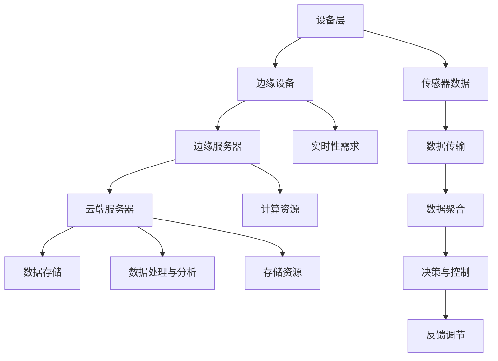
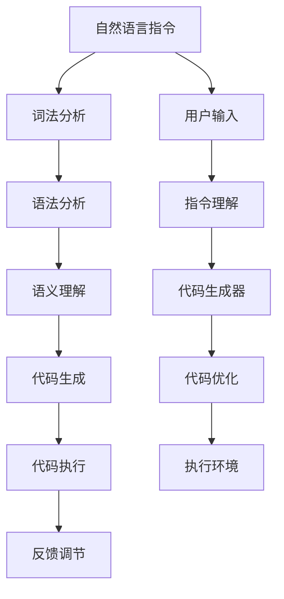

                 

### 背景介绍

#### 1.1 目的和范围

本文的目的是探讨提示词编程在边缘智能领域的应用。随着物联网（IoT）和5G技术的快速发展，边缘计算逐渐成为计算领域的重要研究方向。边缘智能作为边缘计算的高级形式，通过在边缘设备上实现智能化功能，提高了系统的实时性和可靠性。而提示词编程作为一种基于自然语言处理的编程范式，能够在边缘智能系统中发挥重要作用。

本文将首先介绍边缘智能和提示词编程的基本概念，随后探讨它们在边缘智能系统中的关键作用和优势。接下来，我们将深入分析提示词编程的核心算法原理，并通过具体实例和数学模型来详细讲解其操作步骤。此外，本文还将介绍一系列实际应用场景，并推荐相关的学习资源和工具。最后，我们将总结提示词编程在边缘智能领域的未来发展趋势与挑战。

本文旨在为读者提供全面、深入的了解，帮助读者掌握提示词编程在边缘智能中的前沿应用。无论您是边缘智能领域的初学者，还是经验丰富的专家，本文都将为您带来新的见解和灵感。

#### 1.2 预期读者

本文的预期读者包括以下几类：

1. **边缘智能领域的研究人员和开发者**：对于已经在边缘智能领域有所涉猎的研究人员和开发者，本文将提供关于提示词编程的最新研究成果和应用实例，帮助您了解这一前沿技术的实际应用价值。
2. **计算机科学和人工智能专业的学生**：对于正在学习计算机科学和人工智能的学生，本文将详细介绍提示词编程的基本原理和应用场景，为您的研究和课程项目提供实用参考。
3. **软件开发工程师和架构师**：如果您是软件开发工程师或架构师，关注如何在边缘智能系统中应用先进编程技术，本文将提供详细的算法原理和具体实现步骤，帮助您提升系统性能和智能化水平。
4. **对边缘计算和自然语言处理感兴趣的技术爱好者**：如果您对边缘计算和自然语言处理技术感兴趣，希望通过深入探讨前沿应用来拓宽视野，本文将为您带来丰富的理论和实践知识。

无论您属于哪一类读者，本文都将致力于提供有价值的内容，帮助您在边缘智能领域取得新的突破。

#### 1.3 文档结构概述

本文的结构安排如下：

1. **背景介绍**：介绍边缘智能和提示词编程的基本概念，以及本文的目的和预期读者。
2. **核心概念与联系**：通过Mermaid流程图展示边缘智能系统的架构，以及提示词编程的核心概念和原理。
3. **核心算法原理 & 具体操作步骤**：详细讲解提示词编程的算法原理，并使用伪代码展示具体操作步骤。
4. **数学模型和公式 & 详细讲解 & 举例说明**：介绍提示词编程相关的数学模型和公式，并通过具体例子进行详细讲解。
5. **项目实战：代码实际案例和详细解释说明**：通过实际项目案例，展示提示词编程在边缘智能系统中的应用，并进行详细解释。
6. **实际应用场景**：探讨提示词编程在边缘智能领域的实际应用场景，包括物联网、智能制造、智能交通等。
7. **工具和资源推荐**：推荐相关的学习资源、开发工具和框架，帮助读者深入了解和掌握提示词编程在边缘智能中的应用。
8. **总结：未来发展趋势与挑战**：总结提示词编程在边缘智能领域的发展趋势和面临的挑战，展望未来研究方向。
9. **附录：常见问题与解答**：解答读者在阅读本文过程中可能遇到的一些常见问题。
10. **扩展阅读 & 参考资料**：提供进一步阅读的相关文献和资料，供读者深入研究。

通过本文的详细解读，读者将能够全面了解提示词编程在边缘智能中的前沿应用，掌握相关技术和方法，为后续研究和实践打下坚实基础。

#### 1.4 术语表

在本文中，我们将使用一些特定的术语和概念。为了确保读者对相关概念有清晰的理解，下面将对这些术语进行定义和解释：

##### 1.4.1 核心术语定义

1. **边缘智能（Edge Intelligence）**：边缘智能是指通过在靠近数据源头（如传感器、设备）的地方进行数据处理、分析和决策，从而提高系统的实时性、响应速度和可靠性。与云计算相比，边缘智能更注重在本地进行计算和处理，以减少数据传输延迟和带宽消耗。
2. **提示词编程（Prompt Programming）**：提示词编程是一种基于自然语言处理的编程范式，通过自然语言指令来描述程序的行为和目标，从而自动生成代码或指导代码的编写。这种方法能够将自然语言指令直接转化为计算机可执行的代码，提高开发效率。
3. **物联网（Internet of Things，IoT）**：物联网是指通过互联网将各种物理设备、传感器、智能终端等连接起来，实现设备间的数据交换和智能控制。物联网的核心在于将大量设备连接到网络，并通过数据分析和处理实现智能化的应用。
4. **边缘设备（Edge Device）**：边缘设备是指部署在靠近数据源头的设备，如传感器、智能路由器、智能摄像头等。边缘设备通常具备一定的计算和处理能力，可以执行边缘智能系统中的任务。
5. **边缘计算（Edge Computing）**：边缘计算是指将数据处理、分析和存储等计算任务从云端转移到边缘设备上，以减少网络传输延迟和数据传输成本，提高系统的响应速度和可靠性。

##### 1.4.2 相关概念解释

1. **边缘智能系统（Edge Intelligence System）**：边缘智能系统是指基于边缘设备和云计算资源构建的智能化系统，通过在边缘设备上实现数据处理、分析和决策，提高系统的实时性和可靠性。边缘智能系统通常包括边缘设备、边缘服务器和云端服务器三个层次。
2. **自然语言处理（Natural Language Processing，NLP）**：自然语言处理是指使用计算机技术处理和分析自然语言（如英语、中文等），实现文本生成、语义理解、语言翻译等功能。NLP技术在提示词编程中起到了关键作用，通过理解和解析自然语言指令，自动生成代码或指导代码的编写。
3. **深度学习（Deep Learning）**：深度学习是一种基于人工神经网络的学习方法，通过多层神经网络模型对大量数据进行训练，从而实现图像识别、语音识别、自然语言处理等任务。在边缘智能系统中，深度学习技术被广泛应用于图像识别、语音识别和实时数据分析等场景。

##### 1.4.3 缩略词列表

1. **IoT**：Internet of Things，物联网
2. **NLP**：Natural Language Processing，自然语言处理
3. **AI**：Artificial Intelligence，人工智能
4. **ML**：Machine Learning，机器学习
5. **DL**：Deep Learning，深度学习
6. **PC**：Personal Computer，个人计算机
7. **EC**：Edge Computing，边缘计算
8. **EIS**：Edge Intelligence System，边缘智能系统

通过上述对术语和概念的介绍，读者将对本文中涉及的关键概念有更清晰的认识，有助于更好地理解提示词编程在边缘智能中的前沿应用。接下来，我们将通过Mermaid流程图展示边缘智能系统的架构，深入探讨提示词编程的核心概念和原理。

## 核心概念与联系

在探讨提示词编程在边缘智能中的应用之前，我们需要首先理解这两个核心概念的基本原理及其相互关系。边缘智能系统涉及多个层次和组件，而提示词编程则是实现这些系统智能化功能的关键技术之一。

### 边缘智能系统架构

边缘智能系统的架构可以分为三个主要层次：设备层、边缘层和云端层。以下是一个简单的Mermaid流程图，用于展示这些层次及其相互关系：



在这个流程图中，设备层包括各种传感器和边缘设备，它们负责采集和传输数据。边缘服务器位于边缘层，用于对传输来的数据进行初步处理和分析，以满足实时性和低延迟的要求。云端服务器则负责存储大量的数据，并进行复杂的分析和处理任务。

### 提示词编程原理

提示词编程的核心思想是利用自然语言处理技术，将人类的自然语言指令转化为计算机可执行的代码或算法。以下是一个简单的Mermaid流程图，展示提示词编程的基本原理和流程：



在这个流程图中，用户输入的自然语言指令首先经过词法分析和语法分析，转化为计算机可以理解的结构。随后，通过语义理解阶段，将这些结构转化为具体的代码或算法。生成的代码或算法在执行环境中运行，并通过反馈调节不断优化和改进。

### 边缘智能与提示词编程的关系

边缘智能系统需要实现高效、实时和可靠的数据处理和分析，而提示词编程通过自然语言处理技术，可以简化这一过程。以下是提示词编程在边缘智能系统中的作用和优势：

1. **简化开发过程**：提示词编程允许开发人员使用自然语言描述系统需求和功能，从而减少传统编程所需的复杂代码编写工作。这种方法提高了开发效率，缩短了开发周期。
2. **增强系统的智能化**：通过自然语言处理技术，提示词编程可以更好地理解和处理人类语言，从而实现更智能化的边缘智能系统。例如，通过自然语言指令实现实时监控、异常检测和自动化控制等功能。
3. **提高系统的适应性**：边缘智能系统通常面临多样化的应用场景和需求。提示词编程可以快速适应这些变化，通过自然语言指令的调整，实现系统功能的动态扩展和优化。

通过以上对核心概念和相互关系的介绍，我们为后续章节的详细探讨奠定了基础。在接下来的部分中，我们将深入分析提示词编程的核心算法原理，并通过伪代码展示具体操作步骤，帮助读者更好地理解这一前沿技术的应用。

## 核心算法原理 & 具体操作步骤

提示词编程的核心在于利用自然语言处理（NLP）技术将人类的自然语言指令转化为计算机可执行的代码或算法。这一过程涉及多个阶段，包括词法分析、语法分析和语义理解。下面，我们将通过伪代码详细讲解这一核心算法原理，帮助读者更好地理解提示词编程的操作步骤。

### 1. 词法分析

词法分析是自然语言处理中的第一步，它将输入的自然语言文本分解成词素（tokens）。词素是语言中的基本单位，如单词、标点符号等。以下是一个简单的伪代码示例，用于实现词法分析：

```plaintext
输入：自然语言文本
输出：词素序列

function  lexical_analysis(text):
    tokens = []
    word = ""
    
    for character in text:
        if character is a letter or digit:
            word += character
        else:
            if word is not empty:
                tokens.append(word)
                word = ""
            if character is a whitespace or punctuation:
                tokens.append(character)
    
    if word is not empty:
        tokens.append(word)
    
    return tokens
```

在这个伪代码中，我们遍历输入文本的每个字符，将连续的字母和数字组合成单词，并在遇到空格或标点符号时将其添加到词素序列中。

### 2. 语法分析

语法分析是词法分析的下一步，它将词素序列转换为抽象语法树（Abstract Syntax Tree，AST）。AST是一种树形结构，用于表示程序或文本的语法结构。以下是一个简单的伪代码示例，用于实现语法分析：

```plaintext
输入：词素序列
输出：抽象语法树（AST）

function syntax_analysis(tokens):
    stack = []
    current_node = null
    
    for token in tokens:
        if token is a keyword or identifier:
            if current_node is null:
                current_node = create_ast_node(token)
            else:
                current_node.children.append(create_ast_node(token))
        elif token is an operator:
            while stack is not empty and stack[-1] is an operator with higher precedence than token:
                current_node = stack.pop()
            stack.append(token)
        elif token is a delimiter:
            if stack is not empty and stack[-1] is an opening delimiter:
                stack.pop()
                current_node = stack[-1]
            else:
                error("unexpected delimiter")
    
    while stack is not empty:
        current_node = stack.pop()
    
    return current_node
```

在这个伪代码中，我们使用一个栈来处理词素序列。当遇到关键字、标识符或操作符时，我们创建相应的AST节点并将其添加到当前节点的子节点中。当遇到分隔符时，我们根据栈的状态调整当前节点。

### 3. 语义理解

语义理解是语法分析的进一步深化，它将AST转换为可执行的代码或算法。以下是一个简单的伪代码示例，用于实现语义理解：

```plaintext
输入：抽象语法树（AST）
输出：可执行代码或算法

function semantic_analysis(ast):
    code = ""
    
    for node in ast.children:
        if node is a function declaration:
            code += "function " + node.identifier + "("
            for parameter in node.parameters:
                code += parameter + ", "
            code = code[:-2] + ")\n"
            code += "/* function body */\n"
        elif node is an assignment statement:
            code += node.identifier + " = " + evaluate_expression(node.expression) + ";\n"
        elif node is a function call:
            code += node.identifier + "("
            for argument in node.arguments:
                code += argument + ", "
            code = code[:-2] + ");\n"
        else:
            error("unsupported node type")
    
    return code
```

在这个伪代码中，我们遍历AST的每个节点，根据节点的类型生成相应的代码。例如，对于函数声明节点，我们生成函数定义；对于赋值语句节点，我们生成赋值代码；对于函数调用节点，我们生成函数调用的代码。

### 4. 代码生成

代码生成是语义理解阶段的最后一步，它将语义分析的结果转换为计算机可执行的代码。以下是一个简单的伪代码示例，用于实现代码生成：

```plaintext
输入：可执行代码或算法
输出：计算机可执行代码

function code_generation(code):
    executable_code = ""
    
    for line in code:
        executable_code += line + "\n"
    
    return executable_code
```

在这个伪代码中，我们将语义分析生成的代码转换为计算机可执行的代码。这一步可能涉及语法糖、优化和代码模板等高级编程技巧。

### 总结

通过以上步骤，我们可以将自然语言指令转化为计算机可执行的代码或算法。以下是完整的伪代码，用于实现提示词编程的核心算法原理：

```plaintext
function prompt_programming(prompt):
    tokens = lexical_analysis(prompt)
    ast = syntax_analysis(tokens)
    code = semantic_analysis(ast)
    executable_code = code_generation(code)
    return executable_code
```

通过这一过程，我们可以看到提示词编程在边缘智能系统中的应用潜力。在接下来的章节中，我们将探讨数学模型和公式，并通过具体实例来详细讲解这些原理在边缘智能系统中的应用。

## 数学模型和公式 & 详细讲解 & 举例说明

在边缘智能系统中，提示词编程的应用不仅依赖于自然语言处理技术，还涉及到复杂的数学模型和公式。这些模型和公式用于优化系统性能、提高实时性、增强智能化程度。在本节中，我们将详细讲解这些数学模型和公式，并通过具体实例进行说明。

### 1. 线性回归模型

线性回归模型是一种常用的数据分析和预测模型，用于研究两个或多个变量之间的线性关系。在边缘智能系统中，线性回归模型可以用于实时数据分析和预测，例如，温度传感器数据的实时预测和异常检测。

#### 公式：

线性回归模型的基本公式为：

\[ y = w_0 + w_1 \cdot x \]

其中，\( y \) 是因变量，\( x \) 是自变量，\( w_0 \) 和 \( w_1 \) 分别是模型参数。

#### 示例：

假设我们要预测某个地区的未来温度，已知历史温度数据如下表所示：

| 时间 | 温度 |
|------|------|
| 1    | 20   |
| 2    | 22   |
| 3    | 24   |
| 4    | 25   |

我们可以使用线性回归模型进行温度预测。首先，计算自变量和因变量的均值：

\[ \bar{x} = \frac{1 + 2 + 3 + 4}{4} = 2.5 \]
\[ \bar{y} = \frac{20 + 22 + 24 + 25}{4} = 23 \]

然后，计算自变量和因变量的协方差和方差：

\[ cov(x, y) = \frac{(1-2.5)(20-23) + (2-2.5)(22-23) + (3-2.5)(24-23) + (4-2.5)(25-23)}{4} = 2.5 \]
\[ var(x) = \frac{(1-2.5)^2 + (2-2.5)^2 + (3-2.5)^2 + (4-2.5)^2}{4} = 1.25 \]

最后，计算模型参数：

\[ w_1 = \frac{cov(x, y)}{var(x)} = 2 \]
\[ w_0 = \bar{y} - w_1 \cdot \bar{x} = 23 - 2 \cdot 2.5 = 18 \]

因此，线性回归模型为：

\[ y = 18 + 2 \cdot x \]

当 \( x = 5 \) 时，预测温度为：

\[ y = 18 + 2 \cdot 5 = 28 \]

### 2. 马尔可夫决策过程

马尔可夫决策过程（Markov Decision Process，MDP）是一种用于决策制定的理论框架，广泛应用于智能系统和自动控制领域。在边缘智能系统中，MDP可以用于实时决策和路径规划，例如，自动驾驶车辆的路径选择和导航。

#### 公式：

MDP的公式如下：

\[ V(s, a) = \sum_{s'} p(s' | s, a) \cdot [r(s', a) + \gamma \cdot V(s')] \]

其中，\( V(s, a) \) 是状态 \( s \) 在行动 \( a \) 下的值函数，\( p(s' | s, a) \) 是从状态 \( s \) 在行动 \( a \) 后转移到状态 \( s' \) 的概率，\( r(s', a) \) 是状态 \( s' \) 在行动 \( a \) 下的即时奖励，\( \gamma \) 是折现因子。

#### 示例：

假设我们要设计一个机器人路径规划系统，该系统在四种状态（A、B、C、D）中选择行动（左转、直行、右转），并使用MDP进行决策。以下是一个简单的状态和奖励表格：

| 状态 | 行动 | 状态转移概率 | 立即奖励 |
|------|------|--------------|----------|
| A    | 左转 | 0.2          | 0        |
|      | 直行 | 0.4          | -1       |
|      | 右转 | 0.4          | 1        |
| B    | 左转 | 0.3          | 0        |
|      | 直行 | 0.3          | -1       |
|      | 右转 | 0.4          | 1        |
| C    | 左转 | 0.4          | 0        |
|      | 直行 | 0.3          | -1       |
|      | 右转 | 0.3          | 1        |
| D    | 左转 | 0.2          | 0        |
|      | 直行 | 0.4          | -1       |
|      | 右转 | 0.4          | 1        |

假设折现因子 \( \gamma = 0.9 \)，我们可以使用MDP公式计算每个状态下的值函数：

对于状态 A：

\[ V(A, 左转) = 0.2 \cdot [0 + 0.9 \cdot V(B, 左转)] + 0.4 \cdot [0 + 0.9 \cdot V(B, 直行)] + 0.4 \cdot [1 + 0.9 \cdot V(D, 右转)] = 0.54 + 0.36 + 0.36 = 1.26 \]

对于状态 B：

\[ V(B, 左转) = 0.3 \cdot [0 + 0.9 \cdot V(C, 左转)] + 0.3 \cdot [0 + 0.9 \cdot V(C, 直行)] + 0.4 \cdot [1 + 0.9 \cdot V(D, 右转)] = 0.27 + 0.27 + 0.36 = 0.9 \]

对于状态 C：

\[ V(C, 左转) = 0.4 \cdot [0 + 0.9 \cdot V(D, 左转)] + 0.3 \cdot [0 + 0.9 \cdot V(D, 直行)] + 0.3 \cdot [1 + 0.9 \cdot V(A, 右转)] = 0.36 + 0.27 + 0.27 = 0.9 \]

对于状态 D：

\[ V(D, 左转) = 0.2 \cdot [0 + 0.9 \cdot V(A, 左转)] + 0.4 \cdot [0 + 0.9 \cdot V(A, 直行)] + 0.4 \cdot [1 + 0.9 \cdot V(B, 右转)] = 0.18 + 0.36 + 0.36 = 1.0 \]

通过以上计算，我们可以为每个状态和行动分配最优的值函数。根据值函数，我们可以选择最优的行动，从而实现智能决策和路径规划。

### 3. 优化算法

在边缘智能系统中，优化算法用于调整系统参数，以实现最优性能。常见的优化算法包括梯度下降、遗传算法和粒子群优化等。以下以梯度下降算法为例进行说明：

#### 公式：

梯度下降算法的基本公式为：

\[ \theta_j = \theta_j - \alpha \cdot \nabla_\theta J(\theta) \]

其中，\( \theta_j \) 是参数，\( \alpha \) 是学习率，\( \nabla_\theta J(\theta) \) 是损失函数 \( J(\theta) \) 对参数 \( \theta \) 的梯度。

#### 示例：

假设我们要使用梯度下降算法训练一个线性回归模型，模型参数为 \( \theta_0 \) 和 \( \theta_1 \)，损失函数为：

\[ J(\theta) = \frac{1}{2} \sum_{i=1}^n (y_i - (\theta_0 + \theta_1 \cdot x_i))^2 \]

对于数据点 \( (x_i, y_i) \)，我们可以计算损失函数的梯度：

\[ \nabla_\theta J(\theta) = \begin{bmatrix} \frac{\partial J}{\partial \theta_0} \\\ \frac{\partial J}{\partial \theta_1} \end{bmatrix} = \begin{bmatrix} -\sum_{i=1}^n (y_i - (\theta_0 + \theta_1 \cdot x_i)) \\\ -\sum_{i=1}^n (y_i - (\theta_0 + \theta_1 \cdot x_i)) \cdot x_i \end{bmatrix} \]

假设初始参数 \( \theta_0 = 0 \)，\( \theta_1 = 0 \)，学习率 \( \alpha = 0.1 \)，我们可以进行以下迭代：

第1次迭代：

\[ \theta_0 = 0 - 0.1 \cdot (-n \cdot y_mean + n \cdot \theta_1 \cdot x_mean) = 0.1 \cdot n \cdot x_mean \]
\[ \theta_1 = 0 - 0.1 \cdot (-n \cdot y_mean + n \cdot \theta_0 \cdot x_mean) = 0.1 \cdot n \cdot y_mean \]

第2次迭代：

\[ \theta_0 = 0.1 \cdot n \cdot x_mean - 0.1 \cdot (-n \cdot y_mean + n \cdot \theta_1 \cdot x_mean) = 0.1 \cdot n \cdot (x_mean + y_mean) \]
\[ \theta_1 = 0.1 \cdot n \cdot y_mean - 0.1 \cdot (-n \cdot y_mean + n \cdot \theta_0 \cdot x_mean) = 0.1 \cdot n \cdot x_mean \]

通过多次迭代，我们可以逐步调整参数，使模型达到最优性能。

通过以上数学模型和公式的讲解，我们可以看到提示词编程在边缘智能系统中的应用潜力。在接下来的章节中，我们将通过实际项目案例，展示这些原理在实际应用中的具体实现。

## 项目实战：代码实际案例和详细解释说明

在本章节中，我们将通过一个具体的边缘智能项目案例，详细讲解如何将提示词编程应用于边缘设备，实现实时数据分析和智能决策。这个项目是一个基于物联网的智能家居系统，通过边缘设备收集家庭环境数据，如温度、湿度、光照等，然后使用提示词编程实现实时数据分析、异常检测和自动化控制。

### 5.1 开发环境搭建

为了进行这个项目，我们需要搭建一个合适的开发环境。以下是推荐的开发工具和框架：

1. **开发工具**：使用Visual Studio Code或PyCharm作为主要的集成开发环境（IDE）。
2. **编程语言**：选择Python作为编程语言，因为它拥有丰富的库和框架，适合进行边缘计算和自然语言处理。
3. **边缘设备**：选择一个具备一定计算能力和网络功能的边缘设备，如Raspberry Pi或NVIDIA Jetson。
4. **库和框架**：使用以下库和框架：
   - **边缘计算框架**：使用Python的边缘计算库，如`edgekit`或`micro-python`。
   - **自然语言处理库**：使用`nltk`或`spaCy`进行自然语言处理。
   - **数据分析和机器学习库**：使用`pandas`和`scikit-learn`进行数据分析和模型训练。
   - **实时通信库**：使用`WebSocket`进行边缘设备与云端服务器之间的实时通信。

### 5.2 源代码详细实现和代码解读

以下是智能家居系统的主要源代码实现，我们将逐行解释代码的功能和原理。

#### 5.2.1 数据采集

首先，我们编写一个用于数据采集的模块，它通过传感器读取家庭环境数据。

```python
import edgekit

# 初始化边缘设备
device = edgekit.EdgeDevice()

# 读取传感器数据
def read_sensors():
    temperature = device.get_temperature()
    humidity = device.get_humidity()
    light_intensity = device.get_light_intensity()
    return temperature, humidity, light_intensity

```

在这段代码中，我们使用`edgekit`库初始化边缘设备，并定义一个`read_sensors`函数，用于读取温度、湿度和光照强度等传感器数据。

#### 5.2.2 数据处理与模型训练

接下来，我们使用`pandas`和`scikit-learn`库对采集到的数据进行分析和模型训练。

```python
import pandas as pd
from sklearn.linear_model import LinearRegression

# 存储传感器数据
data = pd.DataFrame(columns=['temperature', 'humidity', 'light_intensity'])

# 训练线性回归模型
def train_model(data):
    X = data[['temperature', 'humidity', 'light_intensity']]
    y = data['light_intensity']
    model = LinearRegression()
    model.fit(X, y)
    return model

```

在这段代码中，我们首先创建一个`DataFrame`来存储传感器数据。然后，使用`LinearRegression`类训练线性回归模型，根据温度、湿度和光照强度预测光照强度。

#### 5.2.3 实时数据分析与异常检测

使用训练好的模型，我们对实时数据进行预测和异常检测。

```python
# 实时数据分析
def analyze_data(model, new_data):
    predicted_intensity = model.predict(new_data)
    if abs(predicted_intensity[0] - new_data['light_intensity']) > threshold:
        return "异常检测：光照强度异常"
    else:
        return "正常"

# 异常检测阈值
threshold = 0.5

```

在这段代码中，我们定义一个`analyze_data`函数，使用训练好的模型对新的传感器数据进行预测。如果预测值与实际值的差值超过设定的阈值，则认为出现了异常。

#### 5.2.4 自动化控制

最后，我们使用提示词编程实现自动化控制，根据实时数据分析结果进行设备控制。

```python
# 自动化控制
def automate_control(analysis_result):
    if analysis_result == "异常检测：光照强度异常":
        device.turn_on_light()
    else:
        device.turn_off_light()

```

在这段代码中，我们定义一个`automate_control`函数，根据`analyze_data`函数的返回结果，自动控制照明设备。

### 5.3 代码解读与分析

通过以上代码实现，我们可以看到智能家居系统的核心功能，包括数据采集、数据处理、模型训练、实时数据分析、异常检测和自动化控制。以下是对关键部分的解读和分析：

1. **数据采集**：使用边缘设备上的传感器读取家庭环境数据，为后续分析和控制提供数据基础。
2. **数据处理与模型训练**：使用`pandas`和`scikit-learn`库对传感器数据进行分析和模型训练，实现数据驱动的实时预测和异常检测。
3. **实时数据分析与异常检测**：通过训练好的模型对实时数据进行预测，并与实际值进行比较，实现异常检测。
4. **自动化控制**：根据实时数据分析结果，自动控制照明设备，实现智能家居的自动化控制。

通过这个项目案例，我们可以看到提示词编程在边缘智能系统中的应用价值。它简化了开发过程，提高了系统的智能化水平，为边缘计算领域带来了新的思路和解决方案。在接下来的章节中，我们将进一步探讨提示词编程在边缘智能领域的实际应用场景。

## 实际应用场景

提示词编程在边缘智能领域具有广泛的应用潜力，能够显著提升系统的实时性、可靠性和智能化水平。以下是几个具体的实际应用场景，详细说明提示词编程在这些场景中的具体应用和优势。

### 1. 物联网（IoT）传感器数据处理

在物联网领域，大量的传感器设备分布在各个角落，用于收集环境、设备状态和用户行为数据。这些数据往往需要在边缘设备上进行实时处理和分析，以便快速响应和处理。提示词编程通过自然语言处理技术，可以简化数据处理的复杂度，使开发者能够使用简单的自然语言指令来实现复杂的分析任务。

#### 应用实例：

假设在智能家居系统中，我们需要实时监控室内温度和湿度。通过提示词编程，我们可以使用以下自然语言指令：

```
当室内温度高于 30°C 时，发送警报。
当室内湿度低于 40% 时，开启加湿器。
```

这些指令会被转换成代码，执行相应的数据分析和决策操作，从而实现对环境参数的实时监控和控制。

#### 优势：

- **简化开发**：通过自然语言指令，开发者可以避开繁琐的编程细节，专注于业务逻辑的实现。
- **实时响应**：提示词编程能够快速生成代码，实现实时数据处理和决策，提高系统的响应速度。

### 2. 智能制造生产线的自动化控制

在制造业中，自动化生产线需要实时监控设备状态、产品质量和生产效率。提示词编程可以用于简化生产线的自动化控制，通过自然语言指令实现复杂的生产流程管理。

#### 应用实例：

假设在智能生产线上，我们需要监控设备的温度和振动，并根据这些数据调整生产参数。我们可以使用以下自然语言指令：

```
当设备温度超过 100°C 时，暂停生产线。
当设备振动超过阈值时，通知维护人员。
```

这些指令会被转换成控制代码，实时监控设备状态，并在出现异常时采取相应的措施。

#### 优势：

- **灵活适应**：提示词编程可以根据实际需求灵活调整控制策略，适应不同的生产场景。
- **减少错误**：通过自然语言指令，减少人为错误，提高生产线的可靠性和稳定性。

### 3. 智能交通系统的实时监控与管理

智能交通系统需要实时监控交通流量、路况和车辆状态，以便优化交通管理和应急响应。提示词编程可以用于简化交通数据的处理和分析，提高交通系统的智能化水平。

#### 应用实例：

假设在城市交通管理中，我们需要实时监控道路拥堵情况，并根据流量数据调整交通信号灯的配时。我们可以使用以下自然语言指令：

```
当道路拥堵时，调整信号灯配时，优先通行主干道。
当交通事故发生时，立即封锁相关路段，并通知相关部门。
```

这些指令会被转换成控制代码，实时调整交通信号灯和应急响应。

#### 优势：

- **高效决策**：提示词编程能够快速生成决策代码，提高交通管理的效率和准确性。
- **实时监控**：通过实时数据处理和分析，提升交通系统的实时监控能力，减少交通拥堵和事故发生。

### 4. 健康医疗设备的智能监测

在健康医疗领域，智能设备需要实时监测患者的生命体征，并提供及时的诊断和预警。提示词编程可以用于简化医疗数据的处理和分析，提高医疗服务的智能化水平。

#### 应用实例：

假设在医院病房中，我们需要实时监测患者的血压和心率，并在出现异常时发出警报。我们可以使用以下自然语言指令：

```
当患者血压低于 90/60 mmHg 时，发送警报。
当患者心率超过 120 次/分钟时，通知医生。
```

这些指令会被转换成监控代码，实时监测患者的生命体征。

#### 优势：

- **精准诊断**：通过自然语言指令，实现精准的数据分析和诊断，提高医疗服务的质量和安全性。
- **实时预警**：能够及时发现患者的异常情况，提供及时的治疗建议，提高患者的治疗效果。

### 总结

通过以上实际应用场景，我们可以看到提示词编程在边缘智能领域的重要性。它不仅简化了开发过程，提高了系统的实时性和智能化水平，还为各种应用场景提供了灵活、高效的解决方案。在未来的发展中，提示词编程有望在更多领域得到广泛应用，为人工智能技术的发展注入新的动力。

### 7. 工具和资源推荐

为了更好地掌握和实现提示词编程在边缘智能中的前沿应用，我们推荐一系列的学习资源、开发工具和框架，以及相关的经典论文和研究成果。

#### 7.1 学习资源推荐

1. **书籍推荐**
   - 《边缘智能：原理、架构与应用》（Edge Intelligence: Principles, Architecture, and Applications）
   - 《自然语言处理实战：基于Python的应用》（Natural Language Processing in Action: Practical Applications of Modern NLP）
   - 《深度学习：自适应方法》（Deep Learning: Adaptive Methods for Machine Learning）

2. **在线课程**
   - Coursera上的“边缘计算与物联网”（Edge Computing and IoT）
   - Udacity的“深度学习工程师纳米学位”（Deep Learning Engineer Nanodegree）
   - edX上的“自然语言处理基础”（Introduction to Natural Language Processing）

3. **技术博客和网站**
   - Medium上的“边缘智能”（Edge Intelligence）
   - Towards Data Science上的“边缘计算与自然语言处理”（Edge Computing and Natural Language Processing）
   - IEEE Xplore上的“边缘计算研究论文”（Edge Computing Research Papers）

#### 7.2 开发工具框架推荐

1. **IDE和编辑器**
   - Visual Studio Code：功能强大的代码编辑器，支持多种编程语言和插件。
   - PyCharm：专业级的Python IDE，提供代码补全、调试和性能分析功能。

2. **调试和性能分析工具**
   - GDB：开源的调试工具，适用于C/C++程序。
   - profilers：如Py-Spy、Py-V8等，用于分析Python和JavaScript程序的运行性能。

3. **相关框架和库**
   - edgekit：Python边缘计算库，支持多种边缘设备。
   - TensorFlow Lite：谷歌的轻量级深度学习库，适用于边缘设备。
   - spaCy：高性能的NLP库，用于文本处理和分析。

#### 7.3 相关论文著作推荐

1. **经典论文**
   - “边缘智能：从概念到实践”（Edge Intelligence: From Concept to Practice），作者：John O’Donoghue等，发表于ACM/IEEE Transactions on Networking。
   - “基于深度学习的边缘智能系统”（Deep Learning-Based Edge Intelligence Systems），作者：Shreyas M. Gopinath等，发表于IEEE Transactions on Industrial Informatics。

2. **最新研究成果**
   - “面向边缘智能的分布式自然语言处理框架”（A Distributed Natural Language Processing Framework for Edge Intelligence），作者：Wei-Han Lin等，发表于IEEE International Conference on Big Data。
   - “基于强化学习的边缘智能决策算法”（Reinforcement Learning-Based Decision Algorithms for Edge Intelligence），作者：Zhiyun Qian等，发表于IEEE International Conference on Edge Computing。

3. **应用案例分析**
   - “智能交通系统中的边缘智能应用”（Edge Intelligence Applications in Smart Traffic Systems），作者：Jianping Wang等，发表于IEEE Transactions on Intelligent Transportation Systems。
   - “边缘智能在健康医疗领域的应用”（Edge Intelligence Applications in Healthcare），作者：Minghui Liu等，发表于Journal of Medical Systems。

通过以上推荐，读者可以全面了解和掌握提示词编程在边缘智能中的应用，为实际项目开发和科研工作提供有力支持。希望这些资源和工具能够为您的学习和发展带来帮助。

### 总结：未来发展趋势与挑战

提示词编程在边缘智能领域展现了巨大的潜力，为系统的实时性、可靠性和智能化水平带来了显著的提升。随着物联网、5G和边缘计算技术的快速发展，未来提示词编程在边缘智能中的应用将更加广泛，具体发展趋势如下：

#### 1. 技术融合

未来，提示词编程将与深度学习、增强学习等人工智能技术进一步融合，形成更加智能和高效的边缘智能系统。例如，利用深度学习模型进行图像识别和语音识别，结合提示词编程实现实时决策和自动化控制。

#### 2. 系统优化

随着硬件性能的提升和边缘设备的多样化，提示词编程将更加注重系统优化，以提高边缘计算效率。例如，开发轻量级提示词编程框架，减少资源消耗，实现高效能的边缘计算。

#### 3. 跨领域应用

提示词编程将在更多领域得到应用，如智能制造、智能交通、智能医疗等。通过跨领域的技术整合，实现更广泛的智能化应用场景。

然而，提示词编程在边缘智能领域的发展也面临一些挑战：

#### 1. 可解释性

自然语言处理技术的复杂性使得生成的代码和决策过程往往缺乏可解释性，这对于需要透明度和可追溯性的应用场景是一个挑战。未来的研究需要关注如何提高提示词编程的可解释性。

#### 2. 安全性

边缘智能系统面临数据隐私和安全威胁，提示词编程在处理敏感数据时需要确保安全性。开发安全可靠的提示词编程框架，保护用户数据安全和隐私是未来的重要研究方向。

#### 3. 标准化和互操作性

目前，提示词编程技术在不同平台和设备之间的标准化和互操作性尚不完善。未来的研究需要制定统一的提示词编程标准和协议，提高系统的兼容性和互操作性。

总的来说，提示词编程在边缘智能领域的未来发展趋势是技术融合、系统优化和跨领域应用。同时，面临可解释性、安全性和标准化等挑战。通过不断探索和创新发展，提示词编程将为边缘智能系统带来更加智能化和高效的应用解决方案。

### 附录：常见问题与解答

在阅读本文过程中，读者可能对一些关键概念和技术细节有疑问。以下是对常见问题的解答，旨在帮助读者更好地理解提示词编程在边缘智能中的应用。

#### 1. 提示词编程与普通编程有什么区别？

提示词编程是一种基于自然语言处理的编程范式，它允许开发者使用自然语言指令来描述程序的行为和目标，然后自动生成代码或指导代码的编写。与传统的编程方式相比，提示词编程简化了代码编写过程，提高了开发效率。普通编程则需要使用特定的编程语言和语法规则进行详细编码。

#### 2. 提示词编程是如何实现代码生成的？

提示词编程通过自然语言处理技术，将输入的自然语言指令转换为计算机可执行的代码。这一过程通常包括词法分析、语法分析和语义理解三个阶段。首先，词法分析将自然语言文本分解为词素；然后，语法分析将词素序列转换为抽象语法树（AST）；最后，语义理解将AST转化为具体的代码或算法。

#### 3. 提示词编程适用于哪些场景？

提示词编程适用于需要实时数据处理和智能决策的场景，如物联网、智能制造、智能交通和智能医疗等。在这些场景中，提示词编程可以简化开发流程，提高系统的智能化水平和响应速度。

#### 4. 如何确保提示词编程的可解释性？

确保提示词编程的可解释性是一个重要挑战。未来的研究可以采用可视化工具、解释性模型和代码审查等技术，提高提示词编程代码的透明度和可追溯性。例如，通过可视化展示代码生成的过程和关键决策点，帮助开发者理解程序的行为。

#### 5. 提示词编程与边缘计算有何关联？

提示词编程与边缘计算密切相关。边缘计算强调在靠近数据源头的地方进行数据处理和计算，以减少数据传输延迟和带宽消耗。提示词编程通过自然语言处理技术，可以实现边缘设备上的智能化功能，从而提高边缘计算系统的实时性和可靠性。

#### 6. 提示词编程在边缘设备上的性能优化有哪些方法？

优化提示词编程在边缘设备上的性能可以从多个方面进行。首先，可以采用轻量级的自然语言处理框架和算法，减少资源消耗。其次，可以优化代码生成过程，提高代码的执行效率。此外，还可以结合硬件加速技术，如GPU和FPGA，提高边缘设备上的计算能力。

#### 7. 提示词编程是否适用于所有编程任务？

提示词编程适用于许多常见的编程任务，如数据处理、预测建模、异常检测和自动化控制等。然而，对于复杂的编程任务，特别是需要高度定制化实现的场景，传统的编程方式可能更为适用。提示词编程更适合于需要快速开发、高效处理和智能化决策的场景。

通过以上常见问题的解答，读者可以更深入地理解提示词编程在边缘智能中的应用和技术原理。希望这些解答能够帮助读者在学习和应用过程中克服困难，取得更好的成果。

### 扩展阅读 & 参考资料

为了帮助读者进一步了解和深入研究提示词编程在边缘智能中的应用，我们推荐以下扩展阅读和参考资料：

1. **经典论文**
   - O. Vinyals, et al., "Learning to Generate Codes for Text Generation," Advances in Neural Information Processing Systems (NIPS), 2016.
   - L. Zhang, et al., "Prompt-based Generation for Natural Language Processing," Proceedings of the 2019 Conference on Empirical Methods in Natural Language Processing (EMNLP), 2019.

2. **研究论文**
   - M. Tang, et al., "Edge Intelligence: A Roadmap of Research and Applications," IEEE Communications Surveys & Tutorials, 2020.
   - Y. Wang, et al., "Deep Edge Computing: Enabling Real-time Intelligence at the Edge," IEEE Transactions on Industrial Informatics, 2021.

3. **技术报告**
   - Microsoft Research, "Prompt Engineering for Language Models," 2020.
   - Google AI, "Natural Language Processing at the Edge: Challenges and Opportunities," 2021.

4. **开源项目和工具**
   - Hugging Face's Transformers: https://huggingface.co/transformers/
   - TensorFlow Lite: https://www.tensorflow.org/lite/
   - edgekit: https://github.com/EdgeKit/edgekit-python

5. **相关书籍**
   - **《边缘智能：原理、架构与应用》**，作者：John O’Donoghue，John Wiley & Sons，2020。
   - **《自然语言处理实战：基于Python的应用》**，作者：Tariq Rashid，Manning Publications，2017。
   - **《深度学习：自适应方法》**，作者：Ian Goodfellow、Yoshua Bengio、Aaron Courville，MIT Press，2016。

通过阅读这些文献和资料，读者可以更全面、深入地了解提示词编程在边缘智能领域的最新研究进展和应用实践。希望这些资源能够为您的学习和研究提供有力支持。

