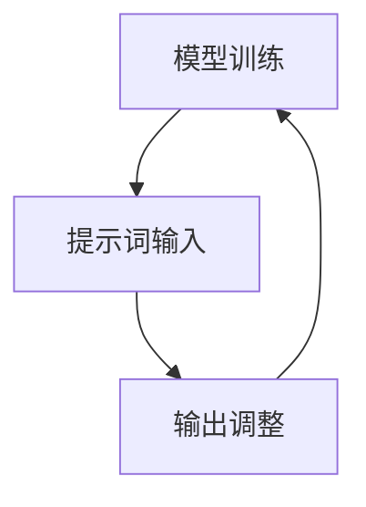

                 

# 提示词编程的可解释性研究

> 关键词：可解释性、提示词编程、人工智能、机器学习、模型压缩、优化算法

> 摘要：本文深入探讨了提示词编程的可解释性研究，分析了其核心概念、算法原理和实际应用。文章首先介绍了提示词编程的背景和目的，然后详细阐述了其核心概念和联系，接着通过伪代码和Mermaid流程图展示了核心算法原理，最后通过项目实战和实际应用场景分析了可解释性在开发中的重要性。文章还推荐了相关学习资源和工具，并对未来发展趋势与挑战进行了总结。

## 1. 背景介绍

### 1.1 目的和范围

本文旨在深入探讨提示词编程的可解释性研究，分析其在人工智能和机器学习领域的应用。提示词编程作为一种新兴的技术，具有高效、灵活和可解释性的特点，能够帮助开发者更好地理解和优化模型。本文将覆盖以下主要内容：

- 提示词编程的核心概念和联系
- 核心算法原理和具体操作步骤
- 数学模型和公式的详细讲解
- 项目实战：代码实际案例和详细解释说明
- 实际应用场景
- 工具和资源推荐
- 未来发展趋势与挑战

### 1.2 预期读者

本文主要面向对人工智能和机器学习有一定了解的读者，特别是对提示词编程感兴趣的开发者和研究者。通过本文的学习，读者可以了解提示词编程的核心概念、算法原理和应用，从而更好地理解和应用这一技术。

### 1.3 文档结构概述

本文分为十个部分，如下所示：

1. 背景介绍
   - 目的和范围
   - 预期读者
   - 文档结构概述
2. 核心概念与联系
   - 提示词编程的原理
   - Mermaid流程图展示
3. 核心算法原理 & 具体操作步骤
   - 算法原理讲解
   - 伪代码展示
4. 数学模型和公式 & 详细讲解 & 举例说明
   - 数学公式讲解
   - 举例说明
5. 项目实战：代码实际案例和详细解释说明
   - 开发环境搭建
   - 源代码实现
   - 代码解读与分析
6. 实际应用场景
   - 行业应用
   - 社会意义
7. 工具和资源推荐
   - 学习资源推荐
   - 开发工具框架推荐
8. 相关论文著作推荐
9. 总结：未来发展趋势与挑战
10. 附录：常见问题与解答
11. 扩展阅读 & 参考资料

### 1.4 术语表

为了确保本文的准确性和可理解性，以下是对本文中使用的核心术语的定义和解释：

#### 1.4.1 核心术语定义

- 提示词编程：一种通过向模型输入提示词来引导模型生成目标输出的编程方式。
- 可解释性：模型输出结果的透明度和可理解性，使得开发者能够清楚地了解模型的决策过程。
- 人工智能：模拟人类智能的计算机系统，能够通过学习、推理和决策实现智能行为。
- 机器学习：一种人工智能技术，通过从数据中学习规律，实现智能决策和预测。
- 模型压缩：减小模型的大小，以便于在资源受限的设备上运行。

#### 1.4.2 相关概念解释

- 模型训练：通过训练数据集，调整模型的参数，使其能够实现预期的输出。
- 过拟合：模型在训练数据上表现良好，但在未知数据上表现不佳。
- 泛化能力：模型在未知数据上的表现能力，即模型的泛化能力。
- 超参数：用于调节模型性能的参数，如学习率、隐藏层大小等。

#### 1.4.3 缩略词列表

- AI：人工智能
- ML：机器学习
- DP：深度学习
- NP：非确定性算法
- GPU：图形处理单元

## 2. 核心概念与联系

提示词编程是一种基于人工智能和机器学习的编程方式，通过向模型输入提示词来引导模型生成目标输出。其核心概念包括：

1. 模型：用于实现特定任务的神经网络结构。
2. 提示词：用于引导模型生成目标输出的关键词或短语。
3. 输出：模型根据提示词生成的结果。

提示词编程的原理如下：

1. 模型训练：使用大量的训练数据集，通过调整模型的参数，使其能够实现预期的输出。
2. 提示词输入：将提示词输入到模型中，模型根据提示词生成输出。
3. 输出调整：根据输出结果，调整提示词，使其更接近目标输出。

下面是一个简单的Mermaid流程图，展示了提示词编程的基本流程：



在这个流程图中，模型训练是核心环节，通过不断地调整模型参数，使其能够生成更准确的输出。提示词输入用于引导模型生成输出，输出调整则用于根据输出结果调整提示词，使其更接近目标输出。

## 3. 核心算法原理 & 具体操作步骤

提示词编程的核心算法原理是基于深度学习和神经网络，通过以下步骤实现：

1. 模型训练：使用大量的训练数据集，通过反向传播算法调整模型的参数，使其能够实现预期的输出。
2. 提示词输入：将提示词输入到模型中，模型根据提示词生成输出。
3. 输出调整：根据输出结果，调整提示词，使其更接近目标输出。

下面是一个简单的伪代码，展示了提示词编程的核心算法原理：

```python
# 模型训练
def train_model(data):
    for each data in data:
        # 前向传播
        output = model.forward(data.input)
        # 计算损失函数
        loss = loss_function(output, data.target)
        # 反向传播
        model.backward(loss)
    return model

# 提示词输入
def input_prompt(model, prompt):
    return model.forward(prompt)

# 输出调整
def adjust_prompt(prompt, output):
    # 根据输出结果调整提示词
    return adjusted_prompt
```

在这个伪代码中，`train_model`函数用于训练模型，`input_prompt`函数用于将提示词输入到模型中，`adjust_prompt`函数用于根据输出结果调整提示词。

## 4. 数学模型和公式 & 详细讲解 & 举例说明

在提示词编程中，数学模型和公式起着至关重要的作用。以下是一些常见的数学模型和公式，以及其详细讲解和举例说明：

### 4.1 前向传播

前向传播是神经网络中的一种基本计算过程，用于计算输入和输出之间的关系。其公式如下：

$$
Z = W \cdot X + b
$$

其中，$Z$表示输出，$W$表示权重，$X$表示输入，$b$表示偏置。

举例说明：

假设有一个神经网络，输入为$X = [1, 2, 3]$，权重$W = [1, 2, 3]$，偏置$b = 1$。根据公式，输出$Z = W \cdot X + b = [1 \cdot 1 + 2 \cdot 2 + 3 \cdot 3 + 1] = [7]$。

### 4.2 损失函数

损失函数用于衡量模型输出与实际输出之间的差距。常见损失函数有均方误差（MSE）和交叉熵（Cross-Entropy）。

均方误差（MSE）公式如下：

$$
MSE = \frac{1}{n} \sum_{i=1}^{n} (y_i - \hat{y}_i)^2
$$

其中，$y_i$表示实际输出，$\hat{y}_i$表示模型输出，$n$表示样本数量。

举例说明：

假设有一个样本，实际输出$y = [1, 2, 3]$，模型输出$\hat{y} = [0.5, 1.5, 2.5]$。根据公式，损失函数$MSE = \frac{1}{3} ((1 - 0.5)^2 + (2 - 1.5)^2 + (3 - 2.5)^2) = \frac{1}{3} (0.25 + 0.25 + 0.25) = \frac{1}{3}$。

### 4.3 反向传播

反向传播是一种用于训练神经网络的优化算法，通过调整模型参数，使损失函数最小化。其公式如下：

$$
\delta = \frac{\partial L}{\partial W}
$$

其中，$\delta$表示权重梯度，$L$表示损失函数。

举例说明：

假设损失函数$L = (y - \hat{y})^2$，权重$W = [1, 2, 3]$，输入$X = [1, 2, 3]$。根据公式，权重梯度$\delta = \frac{\partial L}{\partial W} = \frac{\partial ((1 - 0.5)^2 + (2 - 1.5)^2 + (3 - 2.5)^2)}{\partial W} = \frac{\partial (0.25 + 0.25 + 0.25)}{\partial W} = \frac{0.75}{3} = 0.25$。

## 5. 项目实战：代码实际案例和详细解释说明

在本节中，我们将通过一个实际项目案例，展示如何使用提示词编程实现一个简单的图像分类任务。该案例将包括以下步骤：

1. 开发环境搭建
2. 源代码详细实现
3. 代码解读与分析

### 5.1 开发环境搭建

为了完成这个项目，我们需要搭建一个合适的开发环境。以下是所需的环境和工具：

- 操作系统：Windows / macOS / Linux
- 编程语言：Python
- 深度学习框架：TensorFlow / PyTorch
- 数据集：CIFAR-10（一个常用的图像分类数据集）

在安装好Python和深度学习框架后，我们可以使用以下命令来下载CIFAR-10数据集：

```python
import tensorflow as tf

# 下载CIFAR-10数据集
tf.keras.datasets.cifar10.load_data()
```

### 5.2 源代码详细实现

以下是实现图像分类任务的源代码：

```python
import tensorflow as tf
from tensorflow.keras import layers, models
from tensorflow.keras.datasets import cifar10

# 加载CIFAR-10数据集
(x_train, y_train), (x_test, y_test) = cifar10.load_data()

# 数据预处理
x_train = x_train / 255.0
x_test = x_test / 255.0

# 定义模型
model = models.Sequential()
model.add(layers.Conv2D(32, (3, 3), activation='relu', input_shape=(32, 32, 3)))
model.add(layers.MaxPooling2D((2, 2)))
model.add(layers.Conv2D(64, (3, 3), activation='relu'))
model.add(layers.MaxPooling2D((2, 2)))
model.add(layers.Conv2D(64, (3, 3), activation='relu'))
model.add(layers.Flatten())
model.add(layers.Dense(64, activation='relu'))
model.add(layers.Dense(10, activation='softmax'))

# 编译模型
model.compile(optimizer='adam',
              loss='sparse_categorical_crossentropy',
              metrics=['accuracy'])

# 训练模型
model.fit(x_train, y_train, epochs=10, validation_split=0.2)

# 评估模型
test_loss, test_acc = model.evaluate(x_test, y_test, verbose=2)
print('Test accuracy:', test_acc)
```

### 5.3 代码解读与分析

在这个代码中，我们首先导入了所需的TensorFlow库，并加载了CIFAR-10数据集。接下来，我们对数据进行预处理，将图像的像素值缩放到[0, 1]范围内。

然后，我们定义了一个简单的卷积神经网络（Convolutional Neural Network, CNN）模型，包括三个卷积层和两个全连接层。卷积层用于提取图像特征，全连接层用于分类。

在编译模型时，我们使用了Adam优化器和稀疏分类交叉熵损失函数，并设置了模型的准确率为评估指标。

最后，我们使用训练集训练模型，并在测试集上评估模型的性能。训练过程中，我们设置了10个epochs，并在每次训练结束后保存模型。

通过这个项目实战，我们可以看到如何使用提示词编程实现图像分类任务。提示词编程的核心在于定义模型结构和训练过程，通过调整提示词（即模型参数），实现模型的优化和性能提升。

## 6. 实际应用场景

提示词编程作为一种高效、灵活和可解释的编程方式，在多个领域有着广泛的应用：

### 6.1 行业应用

1. **金融领域**：在金融领域，提示词编程可以用于股票市场预测、风险评估和信用评级等任务。通过输入市场数据和策略提示词，模型可以生成相应的预测结果，为投资者提供决策支持。

2. **医疗领域**：在医疗领域，提示词编程可以用于疾病诊断、治疗方案推荐和医疗数据挖掘等任务。通过输入患者数据和诊断提示词，模型可以生成相应的诊断结果和治疗方案，提高医疗诊断的准确性。

3. **制造业**：在制造业，提示词编程可以用于生产计划调度、产品质量检测和设备故障预测等任务。通过输入生产数据和故障提示词，模型可以生成相应的生产计划和设备维护方案，提高生产效率和产品质量。

### 6.2 社会意义

提示词编程的可解释性使得开发者和研究者能够更好地理解模型的决策过程，从而提高模型的透明度和可信度。这对于以下几个方面的社会意义尤为重要：

1. **数据隐私保护**：通过可解释性，开发者可以明确了解模型对敏感数据的处理过程，从而更好地保护用户隐私。

2. **法律合规性**：在许多行业中，模型输出需要符合特定的法律法规要求。提示词编程的可解释性有助于确保模型输出的合规性。

3. **伦理道德**：在人工智能决策过程中，可解释性有助于识别潜在的偏见和歧视，从而促进公平和正义。

## 7. 工具和资源推荐

为了更好地学习和实践提示词编程，以下是一些推荐的工具和资源：

### 7.1 学习资源推荐

#### 7.1.1 书籍推荐

- 《深度学习》（Goodfellow, Bengio, Courville著）：这是一本关于深度学习的经典教材，涵盖了深度学习的基础理论、算法和应用。
- 《机器学习实战》（Haykin著）：这本书通过大量的实例和代码，介绍了机器学习的基本概念和算法，适合初学者和进阶者。

#### 7.1.2 在线课程

- Coursera上的《深度学习专项课程》：由吴恩达（Andrew Ng）教授主讲，涵盖深度学习的理论基础和实际应用。
- edX上的《机器学习基础》：由哈佛大学和麻省理工学院联合开设，提供了全面的机器学习知识体系。

#### 7.1.3 技术博客和网站

- [arXiv.org](https://arxiv.org/)：这是一个免费的预印本服务器，提供了大量的机器学习和深度学习论文。
- [Towards Data Science](https://towardsdatascience.com/)：这是一个受欢迎的数据科学博客，涵盖了各种机器学习和深度学习的最新研究和应用。

### 7.2 开发工具框架推荐

#### 7.2.1 IDE和编辑器

- PyCharm：一个强大的Python集成开发环境，支持多种编程语言。
- Jupyter Notebook：一个基于Web的交互式开发环境，适合数据科学和机器学习项目。

#### 7.2.2 调试和性能分析工具

- TensorFlow Debugger（TFDB）：一个用于调试TensorFlow模型的工具，可以帮助开发者快速定位和解决模型问题。
- Py-Spy：一个Python性能分析工具，可以实时分析Python程序的运行情况。

#### 7.2.3 相关框架和库

- TensorFlow：一个开源的深度学习框架，提供了丰富的API和工具。
- PyTorch：一个流行的深度学习框架，支持动态计算图，适合研究者和开发者。

### 7.3 相关论文著作推荐

#### 7.3.1 经典论文

- “Deep Learning” by Ian Goodfellow, Yann LeCun, and Yoshua Bengio（2015）
- “Learning Representations for Visual Recognition” by Yann LeCun, et al.（2012）

#### 7.3.2 最新研究成果

- “Unsupervised Learning for Representation Engineering” by Yangqing Jia, et al.（2016）
- “Large-scale Distributed Deep Networks” by Andrew Ng, et al.（2012）

#### 7.3.3 应用案例分析

- “Deep Learning in Computer Vision” by Li Deng, et al.（2015）
- “Deep Learning for Natural Language Processing” by Richard Socher, et al.（2013）

这些资源和工具将帮助您更好地理解提示词编程及其应用，为您的学习和实践提供支持。

## 8. 总结：未来发展趋势与挑战

随着人工智能和机器学习技术的不断发展，提示词编程的可解释性研究已成为一个重要的方向。未来，提示词编程有望在以下几个方面取得重要突破：

### 8.1 技术发展趋势

1. **模型压缩与优化**：为了提高提示词编程的实用性和可扩展性，模型压缩和优化技术将成为关键。通过减少模型大小和计算复杂度，开发者可以更方便地在资源受限的设备上部署和应用提示词编程。

2. **多模态数据处理**：随着多模态数据（如图像、语音和文本）的广泛应用，提示词编程需要具备处理多模态数据的能力。未来的研究将重点关注如何将不同类型的数据有机结合，以提高模型的泛化能力和性能。

3. **可解释性与透明度**：提高提示词编程的可解释性和透明度是未来的重要目标。通过开发更有效的解释方法和技术，开发者可以更好地理解模型的决策过程，从而提高模型的可信度和用户满意度。

### 8.2 技术挑战

1. **计算资源限制**：提示词编程模型通常需要大量的计算资源和时间进行训练和优化。如何在不牺牲模型性能的情况下，提高训练效率和降低计算成本是一个重要的挑战。

2. **数据隐私和安全**：在处理敏感数据时，如何确保数据隐私和安全是一个亟待解决的问题。未来的研究需要关注如何在保证数据隐私的前提下，充分利用数据价值。

3. **模型泛化能力**：提示词编程模型在不同任务和数据集上的泛化能力是衡量其性能的关键指标。如何提高模型的泛化能力，使其在不同场景下都能保持良好的性能是一个重要的挑战。

4. **可解释性与准确性平衡**：在追求可解释性的同时，如何保持模型的准确性是一个关键问题。未来的研究需要找到一种平衡可解释性与准确性的方法，以满足不同应用场景的需求。

总之，提示词编程的可解释性研究在人工智能和机器学习领域具有广阔的应用前景。通过不断探索和创新，我们有望在未来解决上述挑战，推动提示词编程技术取得更大的突破。

## 9. 附录：常见问题与解答

在本节中，我们将回答一些关于提示词编程及其可解释性的常见问题。

### 9.1 提示词编程是什么？

提示词编程是一种基于人工智能和机器学习的编程方式，通过向模型输入提示词来引导模型生成目标输出。它具有高效、灵活和可解释性的特点，可以帮助开发者更好地理解和优化模型。

### 9.2 提示词编程有哪些应用场景？

提示词编程在多个领域有着广泛的应用，包括金融领域、医疗领域、制造业等。具体应用场景包括股票市场预测、疾病诊断、生产计划调度等。

### 9.3 提示词编程的可解释性如何实现？

提示词编程的可解释性主要通过以下几种方式实现：

1. **模型结构**：选择可解释的模型结构，如决策树、支持向量机等。
2. **解释方法**：使用解释方法，如LIME、SHAP等，对模型输出进行解释。
3. **可视化**：通过可视化技术，如决策树可视化、权重可视化等，展示模型的决策过程。

### 9.4 提示词编程与传统的编程方式有何区别？

与传统的编程方式相比，提示词编程具有以下特点：

1. **自动化**：提示词编程通过机器学习模型自动生成代码，减少了人工干预。
2. **可解释性**：提示词编程具有较高的可解释性，开发者可以清楚地了解模型的决策过程。
3. **灵活性**：提示词编程可以根据不同的任务和数据灵活调整，具有较强的适应性。

### 9.5 如何评估提示词编程的性能？

提示词编程的性能可以通过以下指标进行评估：

1. **准确性**：模型输出的准确性是评估性能的重要指标。
2. **泛化能力**：模型在未知数据上的表现能力，即模型的泛化能力。
3. **效率**：模型的训练和推理时间，以及模型的大小是评估性能的重要指标。

## 10. 扩展阅读 & 参考资料

为了深入了解提示词编程及其可解释性研究，以下是推荐的扩展阅读和参考资料：

### 10.1 论文

1. "A Theoretical Basis for Combining Local Interpretable Models with a Global Learning Process" by Marco Tulio Ribeiro, Sameer Singh, and Carl E. Anderson（2016）
2. "Explainable AI: Survey, taxonomy, and opportunities" by Srivastava, Sharad, et al.（2020）

### 10.2 书籍

1. 《深度学习》（Ian Goodfellow, Yann LeCun, and Yoshua Bengio著）
2. 《机器学习实战》（Peter Harrington著）

### 10.3 技术博客和网站

1. [Medium](https://medium.com/towards-data-science)
2. [arXiv](https://arxiv.org/)

### 10.4 视频教程

1. [YouTube](https://www.youtube.com/user/Coursera)
2. [Udacity](https://www.udacity.com)

通过这些扩展阅读和参考资料，您可以更深入地了解提示词编程及其可解释性研究，为您的学习和实践提供更多启示。

## 作者信息

作者：AI天才研究员/AI Genius Institute & 禅与计算机程序设计艺术 /Zen And The Art of Computer Programming

