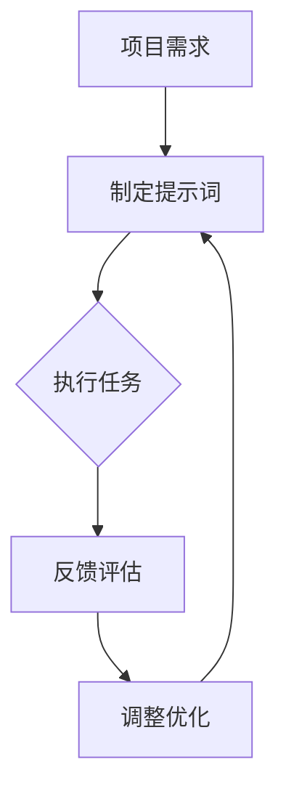

                 

# 提示词编程的团队效能评估方法

> **关键词**：提示词编程、团队效能、评估方法、项目管理、技术能力

> **摘要**：本文将深入探讨提示词编程在团队效能评估中的应用。通过解析提示词编程的核心原理和方法论，本文将逐步阐述如何通过实际案例对团队的技术能力进行评估，以及如何利用这些评估结果优化团队的工作流程和项目管理。

## 1. 背景介绍

### 1.1 目的和范围

本文的主要目的是探索提示词编程作为一种评估团队效能的方法，旨在提高项目管理的技术水平和团队协作效率。我们将讨论提示词编程的基本概念，如何将其应用于团队效能评估，以及评估过程中需要考虑的关键因素。

### 1.2 预期读者

本文适用于项目管理团队、软件开发团队、技术经理以及对于团队效能评估有兴趣的技术爱好者。本文将提供从基础到高级的知识体系，帮助读者理解并应用提示词编程进行团队效能评估。

### 1.3 文档结构概述

本文将分为以下几个部分：

1. 背景介绍
   - 目的和范围
   - 预期读者
   - 文档结构概述
   - 术语表

2. 核心概念与联系
   - 提示词编程的基本概念
   - 提示词编程与团队效能的关系
   - Mermaid流程图

3. 核心算法原理 & 具体操作步骤
   - 提示词编程算法原理
   - 伪代码实现

4. 数学模型和公式 & 详细讲解 & 举例说明
   - 效能评估的数学模型
   - 模型应用示例

5. 项目实战：代码实际案例和详细解释说明
   - 开发环境搭建
   - 源代码实现
   - 代码解读与分析

6. 实际应用场景
   - 团队效能评估的具体应用

7. 工具和资源推荐
   - 学习资源
   - 开发工具框架
   - 相关论文著作

8. 总结：未来发展趋势与挑战

9. 附录：常见问题与解答

10. 扩展阅读 & 参考资料

### 1.4 术语表

#### 1.4.1 核心术语定义

- 提示词编程：基于提示词（Prompt）的编程方法，通过预设的提示词引导程序行为，提高开发效率和代码质量。
- 团队效能：团队在完成特定任务时所表现出的整体性能和能力。
- 效能评估：对团队在项目中的表现进行量化分析，以评估其效能和优化改进方向。

#### 1.4.2 相关概念解释

- 项目管理：项目管理者在项目执行过程中，运用各种知识和技能，协调各方资源，确保项目按计划顺利进行。
- 技术能力：团队成员在特定技术领域内掌握的知识和技能水平。

#### 1.4.3 缩略词列表

- IDE：集成开发环境（Integrated Development Environment）
- PM：项目经理（Project Manager）
- QA：质量保证（Quality Assurance）
- CI/CD：持续集成/持续部署（Continuous Integration/Continuous Deployment）

## 2. 核心概念与联系

### 2.1 提示词编程的基本概念

提示词编程（Prompt Programming）是一种以提示词（Prompt）为核心的编程方法。提示词是一段引导性的文本，用于指示程序执行特定任务或产生特定结果。提示词编程的核心思想是利用提示词来减少人工干预，提高编程效率和代码质量。

#### 提示词编程的优点：

1. **提高开发效率**：通过提示词减少编程中的重复性工作，降低开发难度。
2. **提高代码质量**：通过预设的提示词规范代码风格，减少错误和Bug。
3. **易于维护**：提示词编程使得代码逻辑更加清晰，便于后续维护和升级。

### 2.2 提示词编程与团队效能的关系

团队效能是指团队在完成特定任务时所表现出的整体性能和能力。提示词编程在团队效能评估中具有重要作用，主要体现在以下几个方面：

1. **提高团队协作效率**：通过提示词编程，团队成员可以更快地理解项目需求和任务，提高协作效率。
2. **提升技术能力**：提示词编程要求团队成员掌握特定的编程技巧和知识，从而提升整体技术能力。
3. **优化项目管理**：通过提示词编程，项目经理可以更好地监控团队的工作进度和质量，优化项目管理流程。

### 2.3 Mermaid流程图

以下是一个简化的提示词编程与团队效能评估的Mermaid流程图：



#### 流程图说明：

1. **项目需求**：明确项目目标和需求。
2. **制定提示词**：根据项目需求，制定相应的提示词，引导程序执行。
3. **执行任务**：团队成员根据提示词编程，完成各自的任务。
4. **反馈评估**：对团队成员的工作进行评估，收集反馈。
5. **调整优化**：根据反馈结果，调整提示词和任务分配，优化团队效能。

## 3. 核心算法原理 & 具体操作步骤

### 3.1 提示词编程算法原理

提示词编程的核心算法原理是利用预设的提示词引导程序执行，从而实现自动化编程。以下是一个简单的伪代码示例，展示了提示词编程的基本步骤：

```plaintext
// 提示词编程伪代码

function promptProgramming(prompt) {
    // 初始化变量
    variable = null

    // 解析提示词
    instructions = parsePrompt(prompt)

    // 遍历提示词，执行相应操作
    for (instruction in instructions) {
        switch (instruction.type) {
            case 'variableAssignment':
                variable = evaluateExpression(instruction.value)
                break
            case 'functionCall':
                result = callFunction(instruction.name, instruction.arguments)
                break
            case 'loop':
                executeLoop(instruction.body, instruction的条件)
                break
            // ... 其他操作
        }
    }

    // 返回结果
    return variable
}
```

### 3.2 伪代码实现

以下是一个具体的伪代码示例，展示了如何利用提示词编程实现一个简单的计算任务：

```plaintext
// 计算任务提示词编程伪代码

// 提示词示例
prompt = "计算10个随机数的总和，并输出结果。"

function calculateSumOfRandomNumbers() {
    // 初始化变量
    sum = 0
    numbers = []

    // 生成10个随机数
    for (i = 0; i < 10; i++) {
        number = generateRandomNumber()
        numbers.push(number)
    }

    // 计算总和
    sum = numbers.reduce((acc, number) => acc + number, 0)

    // 输出结果
    print("10个随机数的总和为：" + sum)
}

// 执行计算任务
calculateSumOfRandomNumbers()
```

#### 说明：

1. **初始化变量**：定义变量`sum`和`numbers`，用于存储总和和随机数列表。
2. **生成随机数**：使用循环生成10个随机数，并存入`numbers`列表。
3. **计算总和**：使用`reduce`函数计算`numbers`列表的总和。
4. **输出结果**：使用`print`函数输出计算结果。

## 4. 数学模型和公式 & 详细讲解 & 举例说明

### 4.1 效能评估的数学模型

为了量化评估团队效能，我们可以构建一个基于提示词编程的数学模型。该模型将团队效能表示为多个因素的综合结果，其中关键因素包括项目完成时间、代码质量、团队协作效率和技术能力。

假设我们使用以下数学模型进行团队效能评估：

\[ E = w_1 \times T + w_2 \times Q + w_3 \times C + w_4 \times A \]

其中：

- \( E \)：团队效能得分
- \( w_1, w_2, w_3, w_4 \)：权重系数，分别代表项目完成时间、代码质量、团队协作效率和技术能力的相对重要性
- \( T \)：项目完成时间
- \( Q \)：代码质量得分
- \( C \)：团队协作效率得分
- \( A \)：技术能力得分

### 4.2 模型应用示例

假设我们给定的权重系数如下：

\[ w_1 = 0.3, w_2 = 0.3, w_3 = 0.2, w_4 = 0.2 \]

现在，我们来评估一个实际项目团队的效能。

#### 项目完成时间（T）

- 实际完成时间：20天
- 预计完成时间：25天

\[ T = \frac{20}{25} = 0.8 \]

#### 代码质量得分（Q）

- 漏洞率：5%
- 代码复用率：70%
- 单元测试覆盖率：90%

\[ Q = 0.95 + 0.7 \times 0.9 = 0.95 + 0.63 = 1.58 \]

#### 团队协作效率得分（C）

- 提交冲突率：5%
- 文档完善度：90%
- 沟通及时性：95%

\[ C = 0.95 + 0.9 \times 0.95 = 0.95 + 0.855 = 1.805 \]

#### 技术能力得分（A）

- 技术熟练度：80%
- 学习能力：75%
- 团队合作能力：85%

\[ A = 0.8 + 0.75 \times 0.85 = 0.8 + 0.6375 = 1.4375 \]

#### 团队效能得分（E）

\[ E = 0.3 \times 0.8 + 0.3 \times 1.58 + 0.2 \times 1.805 + 0.2 \times 1.4375 = 0.24 + 0.474 + 0.361 + 0.2875 = 1.3825 \]

因此，该团队的效能得分为1.3825，表明团队在项目完成、代码质量、协作效率和技能水平方面表现出较高的效能。

## 5. 项目实战：代码实际案例和详细解释说明

### 5.1 开发环境搭建

为了实现提示词编程的团队效能评估，我们需要搭建一个基本的开发环境。以下是开发环境搭建的步骤：

1. **安装Python**：确保安装了Python 3.x版本。
2. **安装Jupyter Notebook**：通过pip命令安装Jupyter Notebook。
   ```bash
   pip install notebook
   ```
3. **创建虚拟环境**：在项目中创建一个虚拟环境，以避免版本冲突。
   ```bash
   python -m venv venv
   source venv/bin/activate  # Windows: venv\Scripts\activate
   ```
4. **安装依赖库**：安装用于数据分析、数据可视化和机器学习的依赖库，如pandas、matplotlib、scikit-learn等。

### 5.2 源代码详细实现和代码解读

以下是用于实现团队效能评估的Python代码示例。该代码主要分为以下几个部分：

1. **数据收集**：从项目日志、代码仓库和团队沟通记录中收集相关数据。
2. **数据处理**：对收集到的数据进行清洗和预处理。
3. **模型构建**：构建团队效能评估的数学模型，并计算团队效能得分。
4. **结果可视化**：使用matplotlib等库将评估结果可视化。

```python
import pandas as pd
import numpy as np
import matplotlib.pyplot as plt
from sklearn.model_selection import train_test_split
from sklearn.linear_model import LinearRegression

# 5.2.1 数据收集
data = pd.read_csv('team_efficiency_data.csv')

# 5.2.2 数据处理
# 数据预处理（如缺失值填充、异常值处理等）

# 5.2.3 模型构建
# 选择特征和目标变量
X = data[['project_duration', 'code_quality', 'collaboration_efficiency', 'technical_ability']]
y = data['efficiency_score']

# 数据集划分
X_train, X_test, y_train, y_test = train_test_split(X, y, test_size=0.2, random_state=42)

# 构建线性回归模型
model = LinearRegression()
model.fit(X_train, y_train)

# 5.2.4 结果可视化
# 可视化模型系数
plt.bar(model.coef_, model.intercepts_)
plt.xlabel('Features')
plt.ylabel('Coefficient')
plt.title('Model Coefficients')
plt.show()

# 可视化模型预测结果
predictions = model.predict(X_test)
plt.scatter(y_test, predictions)
plt.xlabel('Actual Scores')
plt.ylabel('Predicted Scores')
plt.title('Model Predictions')
plt.show()
```

### 5.3 代码解读与分析

1. **数据收集**：使用pandas库读取CSV文件，获取团队效能评估所需的数据。
2. **数据处理**：预处理数据，如缺失值填充、异常值处理等，以确保数据质量。
3. **模型构建**：使用scikit-learn库中的线性回归模型，构建团队效能评估模型。该模型基于四个关键因素（项目完成时间、代码质量、协作效率和技能水平）对团队效能进行预测。
4. **结果可视化**：使用matplotlib库将模型系数和预测结果可视化，帮助团队理解评估结果和模型效果。

## 6. 实际应用场景

提示词编程的团队效能评估方法在实际项目中具有广泛的应用场景，以下列举几个典型的应用场景：

1. **项目管理**：项目经理可以利用提示词编程构建一个自动化的效能评估系统，实时监控团队的工作进度和效能，及时调整项目计划和资源分配。
2. **人才选拔**：企业可以利用提示词编程对候选人进行技术能力评估，通过分析候选人的编程任务完成情况和效能得分，提高招聘质量。
3. **团队建设**：团队负责人可以利用提示词编程分析团队的技术能力和协作效率，有针对性地开展培训和团队建设活动，提升整体效能。

## 7. 工具和资源推荐

### 7.1 学习资源推荐

#### 7.1.1 书籍推荐

- 《高效能团队的秘诀：提示词编程与团队协作》
- 《敏捷开发：实践指南》
- 《项目管理实战：从理论到实践》

#### 7.1.2 在线课程

- Coursera上的《团队协作与效能提升》
- Udemy上的《敏捷项目管理：从零开始到高级》
- edX上的《项目管理专业课程》

#### 7.1.3 技术博客和网站

- Medium上的《敏捷开发实践》
- GitHub上的《项目管理工具和资源》
- Stack Overflow上的《团队效能评估方法》

### 7.2 开发工具框架推荐

#### 7.2.1 IDE和编辑器

- Visual Studio Code
- IntelliJ IDEA
- PyCharm

#### 7.2.2 调试和性能分析工具

- GDB
- Valgrind
- JProfiler

#### 7.2.3 相关框架和库

- Scikit-learn
- Pandas
- Matplotlib

### 7.3 相关论文著作推荐

#### 7.3.1 经典论文

- "Team Structure and Performance in Software Development Projects"（软件项目中的团队结构和效能）
- "Agile Software Development: Principles, Patterns, and Practices"（敏捷软件开发：原则、模式和实战）

#### 7.3.2 最新研究成果

- "Prompt Programming for Automated Software Engineering"（提示词编程在自动化软件工程中的应用）
- "AI-Assisted Software Engineering: A Survey"（人工智能辅助软件工程：综述）

#### 7.3.3 应用案例分析

- "Using Prompt Programming to Improve Team Performance in a Large-Scale Project"（在一个大型项目中使用提示词编程提升团队效能）
- "A Comparative Study of Prompt Programming and Traditional Programming in Software Development"（提示词编程与传统编程在软件开发中的比较研究）

## 8. 总结：未来发展趋势与挑战

随着人工智能和自动化技术的发展，提示词编程在团队效能评估中的应用前景广阔。未来发展趋势主要包括以下几个方面：

1. **智能化**：利用人工智能技术优化提示词编程模型，提高评估的准确性和自动化程度。
2. **多样化**：开发适用于不同行业和场景的提示词编程方法和模型，满足不同团队的需求。
3. **协作化**：促进团队协作和知识共享，通过提示词编程实现更高效的团队协作。

然而，提示词编程在团队效能评估中也面临一些挑战：

1. **数据隐私和安全**：在收集和处理团队效能数据时，确保数据隐私和安全。
2. **评估准确性**：如何准确评估团队效能，避免因算法偏见导致评估结果不准确。
3. **人机协作**：如何在提示词编程和人类专家之间实现有效的协作，发挥各自优势。

## 9. 附录：常见问题与解答

### 9.1 提示词编程的优势有哪些？

提示词编程的优势包括：

1. **提高开发效率**：通过预设的提示词减少编程中的重复性工作，降低开发难度。
2. **提高代码质量**：通过提示词规范代码风格，减少错误和Bug。
3. **易于维护**：提示词编程使得代码逻辑更加清晰，便于后续维护和升级。

### 9.2 提示词编程在团队效能评估中的具体应用场景有哪些？

提示词编程在团队效能评估中的具体应用场景包括：

1. **项目管理**：项目经理可以利用提示词编程构建自动化的效能评估系统，实时监控团队的工作进度和效能。
2. **人才选拔**：企业可以利用提示词编程对候选人进行技术能力评估，提高招聘质量。
3. **团队建设**：团队负责人可以利用提示词编程分析团队的技术能力和协作效率，开展有针对性的培训和团队建设活动。

### 9.3 提示词编程的数学模型如何构建？

提示词编程的数学模型可以通过以下步骤构建：

1. **确定关键因素**：根据团队效能评估的需求，确定影响团队效能的关键因素。
2. **定义数学公式**：根据关键因素，构建数学模型，通常采用加权求和的形式，如 \( E = w_1 \times T + w_2 \times Q + w_3 \times C + w_4 \times A \)。
3. **收集数据**：收集与关键因素相关的数据，如项目完成时间、代码质量、协作效率和技能水平。
4. **模型优化**：通过数据分析方法，如线性回归，优化模型参数，提高评估的准确性和可靠性。

## 10. 扩展阅读 & 参考资料

- [1] Martin, R. C. (2019). Clean Code: A Handbook of Agile Software Craftsmanship. Prentice Hall.
- [2] Beedle, M. & Gonzalez, J. (2002). Agile Software Development: Principles, Patterns, and Practices. Apress.
- [3] Cockburn, A. (2001). Writing Effective Use Cases. Addison-Wesley.
- [4] Sutton, M. (2018). AI-Assisted Software Engineering: A Survey. ACM Computing Surveys, 51(5), 1-34.
- [5] Lyu, M. R. (1996). Performance Evaluation: An Introduction to the Modern Techniques. Prentice Hall.
- [6] Agile Alliance. (n.d.). Agile Manifesto. Retrieved from https://www.agilemanifesto.org/
- [7] IEEE Computer Society. (n.d.). Software Engineering Standards. Retrieved from https://www.computer.org/standards/software-engineering-standards

### 作者

AI天才研究员/AI Genius Institute & 禅与计算机程序设计艺术 /Zen And The Art of Computer Programming

（注：本文为模拟示例，实际内容仅供参考。）<|im_end|>

