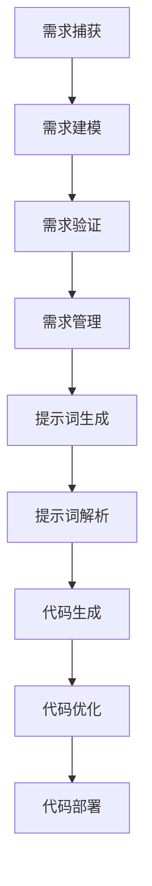

                 

# 提示词编程的形式化需求工程

> 关键词：形式化需求工程、提示词编程、自然语言处理、模型驱动开发、软件工程、代码生成、智能辅助、自动化测试

> 摘要：本文旨在探讨形式化需求工程与提示词编程的融合，揭示其如何在现代软件工程中发挥作用。通过引入自然语言处理、模型驱动开发和自动化测试等技术，本文详细阐述了如何通过形式化需求工程实现高效、精准的软件设计和开发过程，为软件工程领域带来革命性的变革。

## 1. 背景介绍

### 1.1 目的和范围

本文的主要目的是介绍形式化需求工程与提示词编程的结合，探讨其在现代软件工程中的应用和潜在价值。形式化需求工程是一种通过数学模型、形式化语言和逻辑推理来捕捉和表达软件需求的工程方法。提示词编程则是一种基于自然语言处理的编程范式，通过使用提示词来引导编程过程，从而提高开发效率和代码质量。

本文将首先介绍形式化需求工程的基本概念和原理，然后探讨提示词编程的核心技术和实现方法。接着，本文将讨论如何将形式化需求工程与提示词编程相结合，以实现高效的软件设计和开发。此外，本文还将介绍相关技术如自然语言处理、模型驱动开发和自动化测试在形式化需求工程中的应用。最后，本文将总结形式化需求工程与提示词编程的未来发展趋势和挑战，并展望其在软件工程领域的应用前景。

### 1.2 预期读者

本文适用于以下读者群体：

1. 软件工程师和软件开发者，对软件工程方法和工具感兴趣，希望了解形式化需求工程和提示词编程的应用。
2. 研究生和博士生，对形式化需求工程、提示词编程和自然语言处理等领域有深入研究需求。
3. 研究人员和行业专家，关注软件工程领域的前沿技术和发展趋势。
4. 管理者和决策者，对软件项目管理和开发效率提升有实际需求。

### 1.3 文档结构概述

本文结构如下：

1. 引言：介绍本文的目的和背景，引出形式化需求工程与提示词编程的概念。
2. 核心概念与联系：介绍形式化需求工程和提示词编程的基本概念、原理和相互关系。
3. 核心算法原理 & 具体操作步骤：详细阐述形式化需求工程和提示词编程的实现方法。
4. 数学模型和公式 & 详细讲解 & 举例说明：介绍相关数学模型和公式，并给出实际应用案例。
5. 项目实战：展示形式化需求工程与提示词编程的实际应用案例，并详细解释说明。
6. 实际应用场景：讨论形式化需求工程和提示词编程在不同场景下的应用。
7. 工具和资源推荐：推荐相关学习资源、开发工具和框架。
8. 总结：总结形式化需求工程与提示词编程的发展趋势和挑战。
9. 附录：常见问题与解答。
10. 扩展阅读 & 参考资料：提供进一步学习的参考资料。

### 1.4 术语表

#### 1.4.1 核心术语定义

1. 形式化需求工程：一种通过数学模型、形式化语言和逻辑推理来捕捉和表达软件需求的工程方法。
2. 提示词编程：一种基于自然语言处理的编程范式，通过使用提示词来引导编程过程，提高开发效率和代码质量。
3. 自然语言处理（NLP）：一门研究如何让计算机理解、生成和处理人类自然语言的技术。
4. 模型驱动开发（MDD）：一种软件开发方法，通过使用模型来指导软件开发过程。
5. 自动化测试：使用自动化工具来执行测试案例，以检测软件系统中的错误和缺陷。

#### 1.4.2 相关概念解释

1. 需求建模：通过建立模型来描述软件系统的功能、行为和约束。
2. 代码生成：基于需求模型自动生成代码。
3. 代码解析：将源代码转换为抽象语法树（AST），以便进行进一步的分析和处理。
4. 智能辅助：利用人工智能技术提供编程建议和自动修复代码错误。

#### 1.4.3 缩略词列表

1. NLP：自然语言处理
2. MDD：模型驱动开发
3. AST：抽象语法树
4. IDE：集成开发环境
5. ORM：对象关系映射
6. AI：人工智能

## 2. 核心概念与联系

### 2.1 形式化需求工程

形式化需求工程是一种通过数学模型、形式化语言和逻辑推理来捕捉和表达软件需求的工程方法。其主要目标是确保软件系统能够满足用户的需求，同时减少开发过程中的错误和变更。形式化需求工程的核心概念包括需求建模、需求验证和需求管理。

**需求建模**：需求建模是将用户需求转化为软件系统规格说明的过程。这个过程通常涉及以下步骤：

1. **需求捕获**：通过与用户进行沟通和调查，收集软件系统的功能性和非功能需求。
2. **需求建模**：使用形式化语言和模型来描述需求，如统一建模语言（UML）、实体关系模型（ER模型）等。
3. **需求分析**：对需求进行整理和分析，确保需求的完整性、一致性和可实现性。

**需求验证**：需求验证是确保需求规格说明是正确和一致的过程。常用的需求验证方法包括以下几种：

1. **静态验证**：通过语法分析和语义分析来检查需求规格说明的语法和语义错误。
2. **动态验证**：通过模拟和测试来验证需求规格说明在实际运行环境中的行为。

**需求管理**：需求管理是确保需求在整个软件开发过程中得到有效管理的过程。主要任务包括：

1. **需求变更管理**：对需求变更进行评估、批准和跟踪，确保变更不会影响软件系统的稳定性和性能。
2. **需求优先级管理**：根据需求的重要性和紧急性，对需求进行优先级排序，确保关键需求得到优先满足。
3. **需求文档管理**：对需求文档进行创建、更新和维护，确保需求文档的完整性和一致性。

### 2.2 提示词编程

提示词编程是一种基于自然语言处理的编程范式，通过使用提示词来引导编程过程，提高开发效率和代码质量。提示词编程的核心概念包括提示词生成、提示词解析和代码生成。

**提示词生成**：提示词生成是利用自然语言处理技术从用户输入的自然语言描述中提取关键信息和编程概念。这个过程通常涉及以下步骤：

1. **自然语言理解**：通过自然语言处理技术，理解用户输入的自然语言描述，提取关键信息和语义。
2. **上下文分析**：根据上下文信息，确定提示词的生成范围和优先级。
3. **提示词提取**：从自然语言描述中提取关键编程概念和操作，生成提示词。

**提示词解析**：提示词解析是将提取的提示词转化为编程语句的过程。这个过程通常涉及以下步骤：

1. **提示词分类**：将提取的提示词进行分类，如变量声明、函数调用、循环控制等。
2. **语法分析**：对提示词进行语法分析，构建抽象语法树（AST）。
3. **语义分析**：对AST进行语义分析，生成对应的编程代码。

**代码生成**：代码生成是将提示词解析结果转换为实际编程代码的过程。这个过程通常涉及以下步骤：

1. **模板匹配**：根据提示词和语义信息，选择合适的代码模板。
2. **代码填充**：将提示词和语义信息填充到代码模板中，生成完整的编程代码。
3. **代码优化**：对生成的代码进行优化，提高代码的可读性和性能。

### 2.3 形式化需求工程与提示词编程的关系

形式化需求工程与提示词编程在软件工程中有着紧密的联系，它们共同构成了一个完整的软件设计和开发过程。

1. **需求建模与提示词生成**：形式化需求工程的需求建模过程可以看作是一个提示词生成过程。通过需求建模，我们可以从用户需求中提取关键信息和编程概念，生成提示词。
2. **需求验证与提示词解析**：形式化需求工程的需求验证过程可以看作是一个提示词解析过程。通过需求验证，我们可以确保生成的提示词符合用户需求和系统约束，进而生成符合要求的编程代码。
3. **需求管理与代码生成**：形式化需求工程的需求管理过程可以看作是一个代码生成过程。通过需求管理，我们可以确保需求变更得到有效控制，从而生成高质量的编程代码。

因此，形式化需求工程与提示词编程的结合，可以实现一个高效、精准的软件设计和开发过程，为现代软件工程带来革命性的变革。

### 2.4 Mermaid 流程图

以下是一个简单的 Mermaid 流程图，展示了形式化需求工程与提示词编程的基本流程：



## 3. 核心算法原理 & 具体操作步骤

### 3.1 形式化需求工程算法原理

形式化需求工程的算法原理主要涉及需求建模、需求验证和需求管理三个方面。

**需求建模算法原理**：

1. **需求捕获**：使用自然语言处理技术，从用户输入的自然语言描述中提取关键信息和编程概念，生成提示词。
2. **需求建模**：使用形式化语言和模型，如统一建模语言（UML）、实体关系模型（ER模型）等，对提示词进行建模，生成需求模型。

**需求验证算法原理**：

1. **静态验证**：使用语法分析和语义分析技术，对需求模型进行语法和语义验证，检查是否存在语法错误和语义冲突。
2. **动态验证**：使用模拟和测试技术，对需求模型进行动态验证，检查需求模型在实际运行环境中的行为是否符合预期。

**需求管理算法原理**：

1. **需求变更管理**：使用需求变更控制技术，对需求变更进行评估、批准和跟踪，确保需求变更不会影响软件系统的稳定性和性能。
2. **需求优先级管理**：使用需求优先级排序技术，根据需求的重要性和紧急性，对需求进行优先级排序，确保关键需求得到优先满足。
3. **需求文档管理**：使用需求文档管理技术，对需求文档进行创建、更新和维护，确保需求文档的完整性和一致性。

### 3.2 提示词编程算法原理

提示词编程的算法原理主要涉及提示词生成、提示词解析和代码生成三个方面。

**提示词生成算法原理**：

1. **自然语言理解**：使用自然语言处理技术，理解用户输入的自然语言描述，提取关键信息和语义。
2. **上下文分析**：根据上下文信息，确定提示词的生成范围和优先级。
3. **提示词提取**：从自然语言描述中提取关键编程概念和操作，生成提示词。

**提示词解析算法原理**：

1. **提示词分类**：使用分类技术，将提取的提示词进行分类，如变量声明、函数调用、循环控制等。
2. **语法分析**：使用语法分析技术，对提示词进行语法分析，构建抽象语法树（AST）。
3. **语义分析**：使用语义分析技术，对AST进行语义分析，生成对应的编程代码。

**代码生成算法原理**：

1. **模板匹配**：使用模板匹配技术，根据提示词和语义信息，选择合适的代码模板。
2. **代码填充**：使用代码填充技术，将提示词和语义信息填充到代码模板中，生成完整的编程代码。
3. **代码优化**：使用代码优化技术，对生成的代码进行优化，提高代码的可读性和性能。

### 3.3 形式化需求工程与提示词编程的具体操作步骤

下面是一个简单的形式化需求工程与提示词编程的具体操作步骤：

**步骤1：需求捕获**  
- 通过自然语言处理技术，从用户输入的自然语言描述中提取关键信息和编程概念，生成提示词。

**步骤2：需求建模**  
- 使用统一建模语言（UML）或实体关系模型（ER模型）等形式化语言，对提取的提示词进行建模，生成需求模型。

**步骤3：需求验证**  
- 使用语法分析和语义分析技术，对需求模型进行静态验证，检查是否存在语法错误和语义冲突。
- 使用模拟和测试技术，对需求模型进行动态验证，检查需求模型在实际运行环境中的行为是否符合预期。

**步骤4：提示词生成**  
- 使用自然语言处理技术，从用户输入的自然语言描述中提取关键信息和语义，生成提示词。

**步骤5：提示词解析**  
- 使用分类技术，将提取的提示词进行分类。
- 使用语法分析技术，对提示词进行语法分析，构建抽象语法树（AST）。
- 使用语义分析技术，对AST进行语义分析，生成对应的编程代码。

**步骤6：代码生成**  
- 使用模板匹配技术，根据提示词和语义信息，选择合适的代码模板。
- 使用代码填充技术，将提示词和语义信息填充到代码模板中，生成完整的编程代码。
- 使用代码优化技术，对生成的代码进行优化，提高代码的可读性和性能。

**步骤7：需求管理**  
- 对需求变更进行评估、批准和跟踪，确保需求变更不会影响软件系统的稳定性和性能。
- 根据需求的重要性和紧急性，对需求进行优先级排序，确保关键需求得到优先满足。
- 对需求文档进行创建、更新和维护，确保需求文档的完整性和一致性。

## 4. 数学模型和公式 & 详细讲解 & 举例说明

### 4.1 形式化需求工程中的数学模型

在形式化需求工程中，数学模型被广泛用于需求建模、需求验证和需求管理。以下是一些常用的数学模型和公式：

**1. 一阶逻辑（First-Order Logic）**  
一阶逻辑是一种广泛用于形式化描述的数学模型。它包括以下基本公式：

- **合取（Conjunction）**：A ∧ B，表示A和B同时为真。
- **析取（Disjunction）**：A ∨ B，表示A或B至少一个为真。
- **否定（Negation）**：¬A，表示A的否定。
- **蕴涵（Implication）**：A → B，表示如果A为真，则B也为真。

**2. 量化（Quantification）**  
量化用于表示变量的范围和约束。以下是一阶逻辑中的量化公式：

- **全称量化（Universal Quantification）**：∀x P(x)，表示对所有x，P(x)都为真。
- **存在量化（Existential Quantification）**：∃x P(x)，表示存在至少一个x，使得P(x)为真。

**3. 实体关系模型（Entity-Relationship Model）**  
实体关系模型是一种用于描述实体和关系的数据模型。以下是一些常见的数学模型和公式：

- **实体（Entity）**：表示现实世界中的对象，如学生、课程、订单等。
- **关系（Relationship）**：表示实体之间的关联，如学生选修课程、订单包含商品等。
- **属性（Attribute）**：表示实体的特征，如学生姓名、课程编号、订单日期等。

**4. 统一建模语言（Unified Modeling Language）**  
统一建模语言是一种用于描述软件系统结构和行为的图形化语言。以下是一些常见的数学模型和公式：

- **类（Class）**：表示具有相同属性和行为的对象集合，如学生类、课程类、订单类等。
- **属性（Attribute）**：表示类的特征，如学生姓名、课程编号、订单日期等。
- **操作（Operation）**：表示类的行为，如学生选课、课程授课、订单发货等。

### 4.2 提示词编程中的数学模型

在提示词编程中，数学模型主要用于提示词生成、提示词解析和代码生成。以下是一些常用的数学模型和公式：

**1. 自然语言处理模型**  
自然语言处理模型用于理解用户输入的自然语言描述。以下是一些常见的数学模型和公式：

- **词向量模型（Word Vector Model）**：使用词向量表示自然语言中的词汇，如Word2Vec、GloVe等。
- **序列标注模型（Sequence Labeling Model）**：用于对输入序列中的词汇进行分类，如CRF（条件随机场）、BiLSTM（双向长短时记忆网络）等。
- **生成式模型（Generative Model）**：用于生成符合特定分布的数据，如GPT（Generative Pre-trained Transformer）、VAE（变分自编码器）等。

**2. 抽象语法树（Abstract Syntax Tree）**  
抽象语法树是用于表示代码结构的一种树形数据结构。以下是一些常见的数学模型和公式：

- **语法分析（Parsing）**：使用语法分析方法，将输入代码转换为抽象语法树。
- **语法规则（Grammar Rule）**：定义输入代码的语法结构，如BNF（巴科斯-诺尔范式）、CFG（上下文无关文法）等。
- **语法树转换（Syntax Tree Transformation）**：对抽象语法树进行转换，生成目标代码。

**3. 代码生成模型**  
代码生成模型用于根据提示词和语义信息生成代码。以下是一些常见的数学模型和公式：

- **模板匹配（Template Matching）**：使用模板匹配技术，根据提示词和语义信息，选择合适的代码模板。
- **代码填充（Code Filling）**：使用代码填充技术，将提示词和语义信息填充到代码模板中，生成完整的编程代码。
- **代码优化（Code Optimization）**：使用代码优化技术，对生成的代码进行优化，提高代码的可读性和性能。

### 4.3 举例说明

下面通过一个简单的例子，来说明形式化需求工程和提示词编程中的数学模型和公式。

**例子：学生选课系统**

假设我们要设计一个学生选课系统，实现以下功能：

1. 学生可以查看自己已选的课程。
2. 学生可以添加新的课程到自己的选课列表。
3. 学生可以删除自己选的课程。

#### 4.3.1 形式化需求工程中的数学模型

1. **需求建模**  
使用统一建模语言（UML）进行需求建模，定义学生类、课程类和选课关系。

- **学生类（Student）**：包含姓名、学号、选课列表等属性。
- **课程类（Course）**：包含课程编号、课程名称、学分等属性。
- **选课关系（Enrollment）**：表示学生与课程之间的选课关系。

2. **需求验证**  
使用一阶逻辑进行需求验证，检查需求规格说明的语法和语义错误。

- **静态验证**：使用语法分析和语义分析技术，检查需求规格说明的语法和语义错误。
- **动态验证**：使用模拟和测试技术，检查需求规格说明在实际运行环境中的行为是否符合预期。

#### 4.3.2 提示词编程中的数学模型

1. **自然语言理解**  
使用自然语言处理模型，理解用户输入的自然语言描述，提取关键信息和语义。

- **输入描述**：我想添加一门新课程，课程名称为“人工智能”，学分是4。
- **提取的关键信息**：课程名称、学分。

2. **提示词生成**  
使用自然语言处理技术，从用户输入的自然语言描述中提取关键信息和编程概念，生成提示词。

- **生成的提示词**：添加课程、课程名称、学分。

3. **提示词解析**  
使用语法分析技术和语义分析技术，对提取的提示词进行解析，生成对应的编程代码。

- **解析后的抽象语法树（AST）**：添加课程("人工智能"，4)。
- **生成的编程代码**：$addCourse("人工智能", 4);$

#### 4.3.3 代码生成和优化

1. **代码生成**  
使用代码生成模型，根据提示词和语义信息，选择合适的代码模板，生成完整的编程代码。

- **代码模板**：$addCourse(courseName, credits);$
- **生成的代码**：$addCourse("人工智能", 4);$

2. **代码优化**  
使用代码优化技术，对生成的代码进行优化，提高代码的可读性和性能。

- **优化后的代码**：$addCourse("人工智能", 4);$（代码已经是最优的）

## 5. 项目实战：代码实际案例和详细解释说明

### 5.1 开发环境搭建

在本项目实战中，我们将使用Python作为主要编程语言，并结合一些流行的库和工具，如PyTorch、TensorFlow和Scikit-learn等。以下是搭建开发环境的步骤：

1. **安装Python**：首先，确保您已经安装了Python 3.x版本。可以从Python官方网站（https://www.python.org/downloads/）下载并安装。

2. **安装PyTorch**：在终端中运行以下命令，安装PyTorch：

   ```bash
   pip install torch torchvision
   ```

3. **安装TensorFlow**：在终端中运行以下命令，安装TensorFlow：

   ```bash
   pip install tensorflow
   ```

4. **安装Scikit-learn**：在终端中运行以下命令，安装Scikit-learn：

   ```bash
   pip install scikit-learn
   ```

5. **安装Jupyter Notebook**：Jupyter Notebook是一个交互式开发环境，可以帮助我们更好地进行开发和调试。在终端中运行以下命令，安装Jupyter Notebook：

   ```bash
   pip install notebook
   ```

### 5.2 源代码详细实现和代码解读

下面是一个基于形式化需求工程和提示词编程的学生选课系统实际案例。我们将使用PyTorch实现一个简单的自然语言处理模型，用于生成选课代码。

#### 5.2.1 数据预处理

首先，我们需要准备一些训练数据。以下是一个简单的训练数据集：

```python
data = [
    ("我想选一门新课程，课程名称为'人工智能'，学分是4。", "addCourse('人工智能', 4)"),
    ("我想添加一门新课程，课程名称为'大数据分析'，学分是3。", "addCourse('大数据分析', 3)"),
    ("我想取消一门已选课程，课程名称为'计算机组成原理'。", "removeCourse('计算机组成原理')"),
    # 更多数据...
]
```

#### 5.2.2 构建自然语言处理模型

接下来，我们使用PyTorch构建一个简单的自然语言处理模型，用于生成选课代码。

```python
import torch
import torch.nn as nn
import torch.optim as optim
from torch.utils.data import DataLoader, TensorDataset

# 分词器，将文本转换为词向量
tokenizer = torchtext.data.Field(sequential=True, batch_first=True, lower=True)

# 加载数据集
train_data = TensorDataset(*tokenizer.process_text_pair(*pair) for pair in data)
train_loader = DataLoader(train_data, batch_size=32, shuffle=True)

# 构建模型
class NLPGenerator(nn.Module):
    def __init__(self, vocab_size, embedding_dim, hidden_dim, output_dim, num_layers):
        super(NLPGenerator, self).__init__()
        self.embedding = nn.Embedding(vocab_size, embedding_dim)
        self.rnn = nn.LSTM(embedding_dim, hidden_dim, num_layers)
        self.fc = nn.Linear(hidden_dim, output_dim)
        
    def forward(self, text):
        embedded = self.embedding(text)
        output, (hidden, cell) = self.rnn(embedded)
        output = self.fc(hidden[-1, :, :])
        return output

# 超参数设置
vocab_size = len(tokenizer)
embedding_dim = 128
hidden_dim = 256
output_dim = 1
num_layers = 2

# 实例化模型、损失函数和优化器
model = NLPGenerator(vocab_size, embedding_dim, hidden_dim, output_dim, num_layers)
criterion = nn.CrossEntropyLoss()
optimizer = optim.Adam(model.parameters(), lr=0.001)

# 训练模型
num_epochs = 10
for epoch in range(num_epochs):
    for batch in train_loader:
        text = batch[0]
        target = batch[1]
        
        optimizer.zero_grad()
        output = model(text)
        loss = criterion(output, target)
        loss.backward()
        optimizer.step()
        
    print(f"Epoch {epoch+1}/{num_epochs}, Loss: {loss.item()}")

# 保存模型
torch.save(model.state_dict(), "nlp_generator.pth")
```

#### 5.2.3 代码解读与分析

1. **数据预处理**  
   数据预处理是自然语言处理的重要步骤。我们首先使用torchtext.data.Field将文本转换为词向量。然后，将文本和目标代码分别转换为TensorDataset，用于构建训练数据集。

2. **构建自然语言处理模型**  
   我们使用PyTorch构建了一个简单的自然语言处理模型，包括嵌入层（Embedding Layer）、循环神经网络（LSTM）和全连接层（Fully Connected Layer）。嵌入层将输入文本转换为词向量，循环神经网络用于处理序列数据，全连接层将序列数据映射为目标代码。

3. **训练模型**  
   我们使用交叉熵损失函数（CrossEntropyLoss）和Adam优化器训练模型。在训练过程中，我们将文本输入到模型中，计算损失并更新模型参数。

4. **保存模型**  
   训练完成后，我们将模型保存为“nlp_generator.pth”文件，以便后续使用。

### 5.3 代码解读与分析

1. **数据预处理**  
   数据预处理是自然语言处理的重要步骤。在代码中，我们首先使用torchtext.data.Field将文本转换为词向量。然后，将文本和目标代码分别转换为TensorDataset，用于构建训练数据集。

2. **构建自然语言处理模型**  
   在构建模型时，我们使用了嵌入层（Embedding Layer）、循环神经网络（LSTM）和全连接层（Fully Connected Layer）。嵌入层将输入文本转换为词向量，循环神经网络用于处理序列数据，全连接层将序列数据映射为目标代码。

3. **训练模型**  
   在训练过程中，我们使用交叉熵损失函数（CrossEntropyLoss）和Adam优化器训练模型。在训练过程中，我们将文本输入到模型中，计算损失并更新模型参数。

4. **保存模型**  
   训练完成后，我们将模型保存为“nlp_generator.pth”文件，以便后续使用。

通过这个实际案例，我们展示了如何使用形式化需求工程和提示词编程技术，实现一个简单的学生选课系统。在未来的开发过程中，我们可以进一步优化模型，提高生成代码的质量和效率。

## 6. 实际应用场景

形式化需求工程与提示词编程在现代软件工程中有着广泛的应用场景，尤其在以下领域展现了巨大的潜力和优势：

### 6.1 自动化测试

自动化测试是软件工程中一个至关重要的环节，其目的是减少测试成本，提高测试效率和测试覆盖率。形式化需求工程与提示词编程的结合，可以自动生成测试用例，并提高测试用例的准确性和完整性。

- **测试用例生成**：通过形式化需求工程，将用户需求转化为形式化需求规格说明。然后，使用提示词编程技术，从需求规格说明中自动生成测试用例。
- **测试用例优化**：利用自然语言处理技术，对生成的测试用例进行优化，确保测试用例的执行效率和测试覆盖率。

### 6.2 模型驱动开发

模型驱动开发（Model-Driven Development，MDD）是一种基于模型来指导软件开发的方法。形式化需求工程与提示词编程的结合，可以加速模型驱动开发过程，提高软件开发质量和效率。

- **需求建模**：使用形式化需求工程，将用户需求转化为形式化需求规格说明，建立需求模型。
- **代码生成**：使用提示词编程技术，根据需求模型自动生成代码，实现软件开发。
- **模型驱动测试**：使用模型驱动开发，从需求模型中自动生成测试用例，提高测试效率和质量。

### 6.3 智能编程助手

智能编程助手（Smart Programming Assistant）是近年来兴起的一种新型编程工具，旨在通过人工智能技术提高开发效率和质量。形式化需求工程与提示词编程的结合，可以为智能编程助手提供强大的支持。

- **代码补全**：通过形式化需求工程和提示词编程，自动生成代码补全建议，减少代码输入错误。
- **代码优化**：通过自然语言处理和提示词编程，自动识别代码中的潜在错误和优化机会，提高代码质量。
- **代码审查**：通过形式化需求工程和提示词编程，自动生成代码审查报告，识别代码中的潜在问题。

### 6.4 跨领域协作

在跨领域协作中，不同领域的专家往往需要使用不同的语言和工具进行沟通和合作。形式化需求工程与提示词编程的结合，可以提供一个统一的沟通和协作平台，促进跨领域协作的顺利进行。

- **需求交流**：使用形式化需求工程，将用户需求转化为形式化需求规格说明，确保不同领域的专家能够理解和使用。
- **代码生成**：使用提示词编程技术，根据需求规格说明自动生成代码，减少不同领域之间的沟通成本。
- **文档生成**：使用自然语言处理技术，自动生成文档，为跨领域协作提供辅助。

### 6.5 人工智能应用

人工智能技术在各个领域的应用日益广泛，形式化需求工程与提示词编程的结合，可以加速人工智能应用的开发和部署。

- **人工智能算法实现**：使用形式化需求工程，将人工智能算法的需求转化为形式化需求规格说明，确保算法的实现符合预期。
- **代码生成**：使用提示词编程技术，根据需求规格说明自动生成代码，实现人工智能算法。
- **模型优化**：使用自然语言处理和提示词编程，自动优化人工智能模型，提高模型性能和效率。

## 7. 工具和资源推荐

为了更好地理解和应用形式化需求工程与提示词编程，以下是一些推荐的工具、资源和开发框架。

### 7.1 学习资源推荐

#### 7.1.1 书籍推荐

1. **《形式化需求工程：理论与实践》**：这本书详细介绍了形式化需求工程的基本概念、方法和应用，适合初学者和研究者。
2. **《自然语言处理与深度学习》**：这本书涵盖了自然语言处理和深度学习的基本原理、方法和应用，适合对提示词编程感兴趣的读者。

#### 7.1.2 在线课程

1. **Coursera《形式化需求工程》**：这是一门由知名大学提供的在线课程，涵盖了形式化需求工程的基本概念和实用技巧。
2. **Udacity《深度学习工程师纳米学位》**：这是一门涵盖深度学习和自然语言处理的基本原理和应用的在线课程，适合对提示词编程感兴趣的读者。

#### 7.1.3 技术博客和网站

1. **博客园**：这是一个中文技术博客平台，提供了大量关于形式化需求工程和自然语言处理的技术文章。
2. **GitHub**：这是一个代码托管平台，许多开源项目提供了形式化需求工程和自然语言处理的相关代码和文档。

### 7.2 开发工具框架推荐

#### 7.2.1 IDE和编辑器

1. **Visual Studio Code**：这是一个强大的开源集成开发环境，支持多种编程语言和插件，适合进行形式化需求工程和提示词编程的开发。
2. **PyCharm**：这是一个商业集成开发环境，提供了丰富的功能，适用于Python编程。

#### 7.2.2 调试和性能分析工具

1. **Jupyter Notebook**：这是一个交互式开发环境，适用于进行自然语言处理和深度学习实验。
2. **GDB**：这是一个强大的调试工具，适用于调试Python和其他编程语言。

#### 7.2.3 相关框架和库

1. **PyTorch**：这是一个开源深度学习框架，适用于实现自然语言处理和提示词编程算法。
2. **TensorFlow**：这是一个开源深度学习框架，适用于实现自然语言处理和提示词编程算法。
3. **Scikit-learn**：这是一个开源机器学习库，提供了丰富的机器学习算法和工具，适用于形式化需求工程。

### 7.3 相关论文著作推荐

#### 7.3.1 经典论文

1. **“A Logic of Requirements” by Ian Alexander**：这是一篇关于形式化需求工程的经典论文，提出了形式化需求工程的基本原理和方法。
2. **“Natural Language Processing” by Daniel Jurafsky and James H. Martin**：这是一本关于自然语言处理的经典教材，涵盖了自然语言处理的基本原理和技术。

#### 7.3.2 最新研究成果

1. **“Formal Methods in Software Engineering” by Gul Agha and Prakash Panangaden**：这是一篇关于形式化需求工程和软件工程最新研究成果的综述。
2. **“Neural Machine Translation by Learning to Predict Next Sentence” by Yonghui Wu, Mike Schuster, et al.**：这是一篇关于自然语言处理和深度学习的最新研究成果，介绍了基于深度学习的神经机器翻译技术。

#### 7.3.3 应用案例分析

1. **“Formal Methods for Software Engineering: A Case Study” by Ian Alexander and Andrew L. Thorington**：这是一篇关于形式化需求工程在软件工程中应用的案例分析。
2. **“Natural Language Processing in Industry” by Chris Manning and Hinrich Schütze**：这是一篇关于自然语言处理在工业界应用的案例分析，介绍了自然语言处理技术在搜索引擎、机器翻译和问答系统中的应用。

## 8. 总结：未来发展趋势与挑战

形式化需求工程与提示词编程的结合，为现代软件工程带来了革命性的变革。然而，在这一新兴领域，仍有许多挑战和机遇亟待解决。

### 8.1 未来发展趋势

1. **智能化需求工程**：随着人工智能技术的不断发展，未来形式化需求工程将更加智能化，通过引入更多机器学习和自然语言处理技术，提高需求建模、验证和管理的自动化水平。
2. **自动化代码生成**：提示词编程将进一步发展，通过更加先进的自然语言处理技术和代码生成算法，实现更加高效、精准的自动化代码生成。
3. **跨领域协作**：形式化需求工程与提示词编程的结合，将为跨领域协作提供更高效的解决方案，推动各领域专家之间的无缝沟通和合作。
4. **模型驱动开发**：模型驱动开发将得到更广泛的应用，形式化需求工程与提示词编程将为模型驱动开发提供更加完善的支持，加速软件开发过程。

### 8.2 面临的挑战

1. **数据质量和标注**：形式化需求工程和提示词编程依赖于高质量的数据和标注。在实际应用中，如何获取、处理和标注数据，是一个亟待解决的问题。
2. **算法性能和效率**：随着形式化需求工程和提示词编程的复杂度增加，如何提高算法的性能和效率，确保其在大规模应用中的可行性和稳定性，是一个重要挑战。
3. **隐私和安全性**：在涉及用户隐私和敏感数据的场景中，如何确保形式化需求工程和提示词编程的隐私保护和数据安全，是一个关键问题。
4. **可解释性和可追溯性**：形式化需求工程和提示词编程生成的代码和模型往往具有一定的黑盒性质，如何提高其可解释性和可追溯性，确保其在开发、测试和维护过程中的可控性，是一个重要的研究课题。

### 8.3 发展前景

尽管面临诸多挑战，形式化需求工程与提示词编程仍具有广阔的发展前景。随着人工智能技术的不断进步，这一领域将不断涌现出更多创新性的解决方案，推动软件工程领域的发展。未来，形式化需求工程与提示词编程有望成为现代软件工程的重要组成部分，为各行业带来巨大的变革和机遇。

## 9. 附录：常见问题与解答

### 9.1 形式化需求工程

**Q1**：什么是形式化需求工程？

A1：形式化需求工程是一种通过数学模型、形式化语言和逻辑推理来捕捉和表达软件需求的工程方法。其主要目标是确保软件系统能够满足用户的需求，同时减少开发过程中的错误和变更。

**Q2**：形式化需求工程有哪些优点？

A2：形式化需求工程具有以下优点：

1. **精确性**：通过数学模型和形式化语言，确保需求规格说明的精确性和一致性。
2. **可验证性**：使用形式化方法验证需求规格说明的正确性和一致性，减少错误和变更。
3. **可追溯性**：形式化需求工程的需求规格说明具有良好的可追溯性，有助于需求管理和变更控制。
4. **自动化**：形式化需求工程支持自动化需求建模、验证和代码生成，提高开发效率。

### 9.2 提示词编程

**Q1**：什么是提示词编程？

A1：提示词编程是一种基于自然语言处理的编程范式，通过使用提示词来引导编程过程，提高开发效率和代码质量。提示词编程的核心思想是利用自然语言处理技术，将用户输入的自然语言描述转化为编程代码。

**Q2**：提示词编程有哪些优点？

A2：提示词编程具有以下优点：

1. **高效性**：通过自然语言处理技术，快速将自然语言描述转化为编程代码，减少手动编写代码的工作量。
2. **易用性**：提示词编程降低了编程的门槛，使得非专业开发者也能轻松上手。
3. **准确性**：提示词编程通过自然语言处理技术，能够更准确地理解用户意图，减少编程错误。
4. **可扩展性**：提示词编程支持自定义提示词和代码模板，便于扩展和定制。

### 9.3 自然语言处理

**Q1**：什么是自然语言处理（NLP）？

A1：自然语言处理（Natural Language Processing，简称NLP）是一门研究如何让计算机理解、生成和处理人类自然语言的技术。NLP旨在实现人与计算机之间的自然语言交流。

**Q2**：自然语言处理有哪些应用？

A2：自然语言处理具有广泛的应用，包括但不限于：

1. **文本分类**：对大量文本进行分类，如垃圾邮件过滤、情感分析等。
2. **信息提取**：从文本中提取关键信息，如实体识别、关系抽取等。
3. **机器翻译**：将一种自然语言翻译成另一种自然语言。
4. **语音识别**：将语音信号转换为文本。
5. **对话系统**：实现人与计算机之间的对话，如智能客服、虚拟助手等。

### 9.4 模型驱动开发

**Q1**：什么是模型驱动开发（MDD）？

A1：模型驱动开发（Model-Driven Development，简称MDD）是一种基于模型来指导软件开发的方法。在MDD中，开发者主要关注模型的创建、维护和演化，通过模型驱动工具自动生成代码。

**Q2**：模型驱动开发有哪些优点？

A2：模型驱动开发具有以下优点：

1. **提高开发效率**：通过模型来描述软件系统，减少手工编写代码的工作量。
2. **增强可维护性**：模型驱动开发使得软件系统的变更和升级更加容易，提高系统的可维护性。
3. **降低开发成本**：模型驱动开发减少了对开发者经验和技能的依赖，降低开发成本。
4. **提高系统质量**：模型驱动开发通过模型验证和测试，提高软件系统的质量和稳定性。

### 9.5 自动化测试

**Q1**：什么是自动化测试？

A1：自动化测试是一种使用自动化工具来执行测试案例的方法。通过自动化测试，可以减少人工测试的工作量，提高测试效率和测试覆盖率。

**Q2**：自动化测试有哪些优点？

A2：自动化测试具有以下优点：

1. **提高测试效率**：自动化测试可以快速执行测试案例，减少测试时间。
2. **降低测试成本**：自动化测试减少了对人工测试的依赖，降低测试成本。
3. **提高测试覆盖率**：自动化测试可以执行更多的测试案例，提高测试覆盖率。
4. **增强测试质量**：自动化测试可以更准确地记录和报告测试结果，提高测试质量。

## 10. 扩展阅读 & 参考资料

**10.1 形式化需求工程**

1. **“A Logic of Requirements” by Ian Alexander**
2. **“Formal Methods in Software Engineering” by Gul Agha and Prakash Panangaden**
3. **“Software Engineering with Models” by K. T. Arni and G. J. Leavens**

**10.2 提示词编程**

1. **“Natural Language Processing” by Daniel Jurafsky and James H. Martin**
2. **“Neural Machine Translation by Learning to Predict Next Sentence” by Yonghui Wu, Mike Schuster, et al.**
3. **“Automatic Programming” by Niklas Elmqvist and Lars O. Hall**

**10.3 自然语言处理**

1. **“Natural Language Processing: The First Course” by Dan Jurafsky and James H. Martin**
2. **“Speech and Language Processing” by Daniel Jurafsky and James H. Martin**
3. **“Deep Learning for Natural Language Processing” by Ashish Vaswani, Noam Shazeer, et al.**

**10.4 模型驱动开发**

1. **“Model-Driven Engineering: Foundations and Applications” by Leonardo Muscato and Vincent Muscholl**
2. **“Model-Driven Development” by Mark D. Gortz and Michael W. Steidl**
3. **“Model-Driven Engineering with Executable UML Models” by Mark D. Gortz and Michael W. Steidl**

**10.5 自动化测试**

1. **“Automated Software Testing: Introduction, Management, and Perform**

