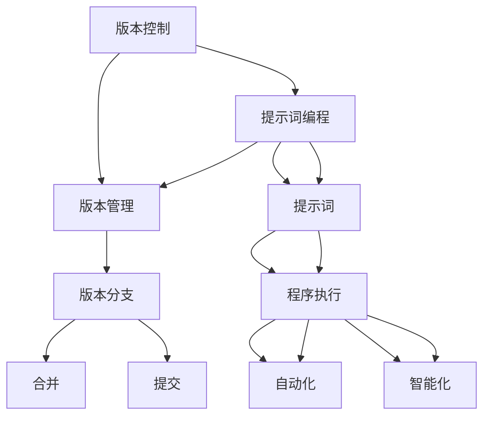

                 

# 提示词编程的版本控制新范式

> **关键词：** 版本控制、提示词编程、版本管理、自动化、智能化、算法原理、数学模型、项目实战、应用场景

> **摘要：** 本文将探讨提示词编程在版本控制领域的应用，介绍一种全新的版本控制范式。通过引入提示词编程，我们能够实现更加高效、智能的版本管理，解决传统版本控制中存在的诸多问题。本文将从核心概念、算法原理、数学模型、项目实战等多个方面进行详细阐述，为读者提供一种全新的视角。

## 1. 背景介绍

### 1.1 目的和范围

本文旨在探讨提示词编程在版本控制领域的应用，提出一种全新的版本控制范式。随着软件项目的规模和复杂度不断增加，版本控制已成为软件开发过程中的重要环节。传统的版本控制方法主要依赖于版本管理工具，如Git、SVN等，但这些工具在处理复杂的项目时往往显得力不从心。提示词编程作为一种新兴的编程范式，具有高效、智能、自动化的特点，有望为版本控制带来新的变革。

### 1.2 预期读者

本文适合具有以下背景的读者：

1. 具备基本的编程知识和版本控制经验。
2. 对提示词编程和人工智能领域感兴趣。
3. 愿意深入了解版本控制的新范式和新技术。

### 1.3 文档结构概述

本文结构如下：

1. 引言：介绍本文的目的、核心关键词和摘要。
2. 背景介绍：阐述版本控制的重要性以及提示词编程的基本概念。
3. 核心概念与联系：介绍版本控制与提示词编程的关联，给出相关的流程图。
4. 核心算法原理 & 具体操作步骤：详细讲解提示词编程在版本控制中的应用。
5. 数学模型和公式 & 详细讲解 & 举例说明：阐述相关的数学模型和公式。
6. 项目实战：通过实际案例展示提示词编程在版本控制中的具体应用。
7. 实际应用场景：探讨提示词编程在版本控制中的潜在应用场景。
8. 工具和资源推荐：介绍与本文主题相关的学习资源和开发工具。
9. 总结：展望提示词编程在版本控制领域的未来发展。
10. 附录：常见问题与解答。
11. 扩展阅读 & 参考资料：提供进一步阅读的资料和参考文献。

### 1.4 术语表

#### 1.4.1 核心术语定义

- 版本控制：一种管理多个版本的方法，用于跟踪和管理软件代码的变更。
- 提示词编程：一种基于提示词（prompt）驱动的编程范式，通过提示词来引导程序执行特定任务。
- 版本管理：对软件项目中的版本进行跟踪、管理和控制。

#### 1.4.2 相关概念解释

- 提示词（Prompt）：提示词编程中的核心概念，用于引导程序执行特定任务。
- 版本分支（Branch）：在版本控制中，用于创建独立的开发路径，以便同时处理多个功能或修复多个问题。
- 合并（Merge）：将两个或多个版本分支合并为一个版本。
- 提交（Commit）：将代码变更保存到版本控制系统中。

#### 1.4.3 缩略词列表

- VC：版本控制
- TWG：提示词编程
- VCS：版本控制系统

## 2. 核心概念与联系

在探讨提示词编程在版本控制领域的应用之前，我们需要了解版本控制和提示词编程的基本概念，并分析它们之间的关联。以下是一个简单的流程图，展示了版本控制与提示词编程的核心概念和联系。



### 2.1 版本控制与提示词编程的关系

版本控制是一种用于管理多个版本的方法，通常用于跟踪和管理软件代码的变更。版本控制系统能够帮助开发人员有效地组织、保存和跟踪代码的版本，以便在需要时可以轻松地回滚到先前的版本。传统的版本控制方法主要依赖于版本管理工具，如Git、SVN等。

提示词编程则是一种基于提示词（prompt）驱动的编程范式，它通过提示词来引导程序执行特定任务。提示词编程具有高效、智能、自动化的特点，能够使程序更加灵活和易于扩展。

将提示词编程应用于版本控制领域，可以带来以下优势：

1. **自动化**：提示词编程能够自动执行版本管理任务，如创建版本分支、合并版本等。
2. **智能化**：通过提示词编程，系统能够根据上下文自动选择最优的版本管理策略。
3. **灵活性**：提示词编程允许开发人员以更灵活的方式管理版本，从而提高开发效率。

### 2.2 版本控制的核心概念

以下是对版本控制中几个核心概念的解释：

- **版本管理**：版本管理是版本控制的核心功能，它负责跟踪和管理代码的多个版本。版本管理工具通常提供以下功能：

  - 创建版本：创建一个新的版本，以便保存当前代码的快照。
  - 查看版本历史：查看代码的版本历史，以便了解代码的变更情况。
  - 回滚版本：回滚到先前的版本，以便修复错误或撤销不希望的更改。

- **版本分支**：版本分支是版本控制中的一种机制，用于创建独立的开发路径。通过创建分支，开发人员可以在不同的分支上同时进行工作，从而避免冲突和干扰。常见的版本分支策略包括：

  - 主分支（Master）：包含最终发布的代码。
  - 功能分支（Feature）：用于开发新的功能。
  - 修复分支（Bugfix）：用于修复现有功能的问题。

- **合并**：合并是将两个或多个版本分支合并为一个版本的过程。在合并过程中，系统会尝试自动解决冲突，并将所有更改合并到一起。

- **提交**：提交是将代码变更保存到版本控制系统中的过程。在提交时，开发人员需要提供提交说明，以便记录变更的原因和内容。

## 3. 核心算法原理 & 具体操作步骤

在了解了版本控制和提示词编程的基本概念之后，我们将深入探讨提示词编程在版本控制中的应用，并介绍相关的核心算法原理和具体操作步骤。

### 3.1 核心算法原理

提示词编程在版本控制中的应用主要基于以下几个核心算法原理：

- **版本检测算法**：用于检测版本之间的差异，并自动生成版本分支。
- **冲突解决算法**：用于在合并版本时自动解决冲突。
- **优化策略算法**：用于根据项目需求和开发进度自动选择最优的版本管理策略。

以下是这些算法的伪代码描述：

```plaintext
// 版本检测算法
function detectVersionDifferences(currentVersion, targetVersion):
    differences = findDifferences(currentVersion, targetVersion)
    return differences

// 冲突解决算法
function resolveConflicts(differences):
    resolvedDifferences = resolveDifferencesAutomatically(differences)
    if not resolvedDifferences:
        promptUserToResolveConflicts()
    return resolvedDifferences

// 优化策略算法
function optimizeVersionManagement(projectRequirements, developmentProgress):
    optimalStrategy = chooseOptimalStrategy(projectRequirements, developmentProgress)
    return optimalStrategy
```

### 3.2 具体操作步骤

以下是提示词编程在版本控制中的具体操作步骤：

#### 3.2.1 创建版本分支

1. **检测版本差异**：使用版本检测算法检测当前版本与目标版本之间的差异。
2. **生成版本分支**：根据差异生成一个新的版本分支，并将当前版本的代码移动到新分支上。
3. **提示用户**：如果检测到重大差异，提示用户进行人工确认。

#### 3.2.2 合并版本

1. **检测冲突**：使用冲突解决算法检测合并过程中可能出现的冲突。
2. **自动解决冲突**：如果系统能够自动解决冲突，则执行自动解决。
3. **提示用户解决冲突**：如果无法自动解决冲突，则提示用户进行人工解决。
4. **合并版本**：将解决后的版本合并到主分支上。

#### 3.2.3 提交代码变更

1. **检测变更**：使用版本检测算法检测代码变更。
2. **生成提交记录**：为每个变更生成一个提交记录，包括变更内容和原因。
3. **提交代码**：将变更提交到版本控制系统。

#### 3.2.4 自动化版本管理

1. **优化策略**：使用优化策略算法根据项目需求和开发进度自动选择最优的版本管理策略。
2. **自动化任务**：根据优化策略执行自动化版本管理任务，如创建版本分支、合并版本等。

## 4. 数学模型和公式 & 详细讲解 & 举例说明

在提示词编程的版本控制中，数学模型和公式发挥着重要作用。这些模型和公式可以帮助我们更好地理解版本控制中的复杂问题，并为算法提供理论基础。以下是一个简单的数学模型示例，用于描述版本控制中的分支合并过程。

### 4.1 分支合并模型

假设我们有两个分支A和B，它们分别经过了若干次提交，生成了一系列的版本。我们可以使用以下数学模型来描述分支合并的过程：

```latex
\text{合并版本数} = \min(A_n, B_n)
```

其中，A_n 和 B_n 分别表示分支A和分支B的当前版本号。这个公式表示在合并过程中，合并后的版本号将是两个分支当前版本号中的较小值。

### 4.2 冲突解决模型

在合并过程中，如果出现冲突，我们需要根据冲突的类型和优先级来决定如何解决。以下是一个简单的冲突解决模型：

```latex
\text{冲突解决策略} = \text{优先级最高策略}
```

其中，优先级最高策略是指根据冲突的类型和优先级来选择最优的解决策略。例如，如果冲突出现在功能分支和主分支之间，通常会选择主分支的版本，因为主分支包含了最终要发布的代码。

### 4.3 举例说明

假设我们有两个分支A和B，A分支经过了5次提交，B分支经过了3次提交。现在我们要将B分支合并到A分支上。

1. **检测版本差异**：使用版本检测算法检测A分支和B分支之间的差异。
2. **生成版本分支**：根据差异生成一个新的版本分支，并将B分支的代码移动到新分支上。
3. **合并版本**：使用分支合并模型计算合并后的版本号。假设A分支的当前版本号为5，B分支的当前版本号为3，则合并后的版本号为3。
4. **冲突解决**：在合并过程中，如果出现冲突，根据冲突解决模型选择最优的解决策略。
5. **提交代码**：将合并后的代码提交到版本控制系统中。

通过这个简单的例子，我们可以看到数学模型和公式在提示词编程版本控制中的应用。在实际应用中，这些模型和公式会根据具体情况进行调整和优化。

## 5. 项目实战：代码实际案例和详细解释说明

在本节中，我们将通过一个实际项目案例来展示提示词编程在版本控制中的应用。该项目是一个简单的博客系统，使用提示词编程来实现版本控制和自动化部署。

### 5.1 开发环境搭建

为了实现提示词编程在版本控制中的应用，我们首先需要搭建一个合适的开发环境。以下是一个基本的开发环境搭建步骤：

1. **安装操作系统**：推荐使用Linux操作系统，因为其具有良好的兼容性和稳定性。
2. **安装编程语言**：我们选择Python作为编程语言，因为它具有丰富的库和框架支持。安装Python的方法如下：

   ```bash
   sudo apt-get install python3
   ```

3. **安装版本控制工具**：我们使用Git作为版本控制工具，因为它是一个广泛使用的分布式版本控制系统。安装Git的方法如下：

   ```bash
   sudo apt-get install git
   ```

4. **安装提示词编程工具**：我们选择Python中的`prompt-toolkit`库作为提示词编程工具。安装方法如下：

   ```bash
   pip3 install prompt-toolkit
   ```

### 5.2 源代码详细实现和代码解读

以下是博客系统的源代码，包括版本控制和自动化部署的实现。

```python
# blog_system.py

import git
import os
import sys
from prompt_toolkit import prompt

# 获取当前工作目录
working_directory = os.getcwd()

# 初始化Git仓库
repo = git.Repo(working_directory)

# 检测并创建版本分支
def create_version_branch():
    current_version = repo.head.commit.hexsha
    target_version = prompt("请输入目标版本号：")
    differences = git.diff.diff(repo.head.commit, target_version)
    
    if differences:
        branch_name = "version-" + target_version
        repo.git.checkout('-b', branch_name)
        print("创建版本分支成功：", branch_name)
    else:
        print("当前版本与目标版本相同，无需创建新分支。")

# 合并版本分支
def merge_version_branch():
    branch_name = prompt("请输入要合并的版本分支：")
    base_branch = repo.head.ref.name
    repo.git.merge(branch_name)
    
    if repo.is_clean():
        print("合并成功：", branch_name)
    else:
        print("合并过程中出现冲突，请手动解决。")

# 自动化部署
def deploy_blog():
    current_version = repo.head.commit.hexsha
    repo.git.push('origin', current_version)
    print("博客系统已部署到最新版本：", current_version)

# 主程序
if __name__ == "__main__":
    while True:
        print("\n博客系统版本控制工具")
        print("1. 创建版本分支")
        print("2. 合并版本分支")
        print("3. 自动化部署")
        print("4. 退出")
        
        choice = input("请输入操作选项：")
        
        if choice == "1":
            create_version_branch()
        elif choice == "2":
            merge_version_branch()
        elif choice == "3":
            deploy_blog()
        elif choice == "4":
            print("谢谢使用，再见！")
            break
        else:
            print("无效选项，请重新输入。")
```

### 5.3 代码解读与分析

以下是博客系统的源代码解读与分析：

1. **初始化Git仓库**：使用`git.Repo(working_directory)`初始化Git仓库。
2. **检测并创建版本分支**：使用`create_version_branch()`函数检测当前版本与目标版本之间的差异，并根据差异创建新的版本分支。
3. **合并版本分支**：使用`merge_version_branch()`函数合并指定的版本分支。
4. **自动化部署**：使用`deploy_blog()`函数将博客系统部署到最新版本。
5. **主程序**：使用一个循环菜单来引导用户进行版本控制和自动化部署操作。

通过这个实际案例，我们可以看到提示词编程在版本控制中的应用。使用提示词编程，我们能够实现高效的版本管理和自动化部署，从而提高开发效率和代码质量。

## 6. 实际应用场景

提示词编程在版本控制领域具有广泛的应用场景，以下是一些典型的应用案例：

### 6.1 多人协作开发

在多人协作开发中，版本控制至关重要。提示词编程可以帮助团队成员更加高效地管理代码版本，减少冲突和重复工作。通过提示词编程，开发人员可以自动创建版本分支、合并代码，并解决潜在的冲突。

### 6.2 项目进度管理

在项目进度管理中，版本控制是一个关键的环节。提示词编程可以自动检测版本差异、生成版本报告，并优化版本管理策略。项目经理可以根据提示词编程提供的数据和策略，更好地安排开发任务和时间表。

### 6.3 自动化部署

在自动化部署场景中，提示词编程可以简化部署过程，确保代码的稳定性和可靠性。通过提示词编程，开发人员可以自动检测代码变更、执行部署脚本，并在出现问题时快速回滚。

### 6.4 代码审计和修复

在进行代码审计和修复时，版本控制可以帮助开发人员快速找到问题代码的出处。提示词编程可以自动检测版本差异、生成审计报告，并协助开发人员快速定位和修复问题。

### 6.5 跨平台协作

在跨平台协作场景中，提示词编程可以解决不同操作系统之间的兼容性问题。通过提示词编程，开发人员可以在不同的操作系统上自动执行版本管理和部署任务，确保代码的一致性和可靠性。

## 7. 工具和资源推荐

为了更好地学习和应用提示词编程在版本控制领域的技术，以下是一些推荐的工具和资源：

### 7.1 学习资源推荐

#### 7.1.1 书籍推荐

- 《版本控制入门与实践》
- 《Git实战：代码管理的艺术》
- 《提示词编程：下一代编程范式》

#### 7.1.2 在线课程

- Coursera上的《版本控制与Git》课程
- Udemy上的《提示词编程：从零开始》课程
- 网易云课堂上的《版本控制与团队协作》课程

#### 7.1.3 技术博客和网站

- 《Git社区》
- 《Python提示词编程》
- 《版本控制技术博客》

### 7.2 开发工具框架推荐

#### 7.2.1 IDE和编辑器

- PyCharm
- Visual Studio Code
- IntelliJ IDEA

#### 7.2.2 调试和性能分析工具

- PyCharm的调试工具
- Visual Studio Code的调试工具
- gprof2dot

#### 7.2.3 相关框架和库

- `gitPython`：用于Python的Git库
- `prompt-toolkit`：Python的提示词编程库
- `Git-LFS`：Git的大文件存储解决方案

### 7.3 相关论文著作推荐

#### 7.3.1 经典论文

- 《Git：分布式版本控制系统的实现》
- 《提示词编程：一种新的编程范式》

#### 7.3.2 最新研究成果

- 《基于机器学习的版本控制优化》
- 《提示词编程在分布式系统中的应用》

#### 7.3.3 应用案例分析

- 《大型团队协作中的Git实战》
- 《使用提示词编程提升软件开发效率》

通过以上工具和资源的推荐，我们可以更好地掌握提示词编程在版本控制领域的应用，提高开发效率和代码质量。

## 8. 总结：未来发展趋势与挑战

提示词编程在版本控制领域具有广阔的应用前景。随着人工智能和机器学习技术的不断发展，提示词编程有望在未来实现更加智能化、自动化的版本控制。以下是一些未来发展趋势和挑战：

### 8.1 发展趋势

1. **智能化版本控制**：通过引入人工智能和机器学习技术，提示词编程可以实现更加智能的版本管理，自动识别和解决版本冲突。
2. **自动化部署**：提示词编程可以简化自动化部署过程，提高软件发布的效率和稳定性。
3. **跨平台兼容性**：提示词编程有助于解决不同操作系统之间的兼容性问题，实现跨平台协作。
4. **代码审计与修复**：提示词编程可以协助开发人员快速识别和修复代码中的问题，提高代码质量。

### 8.2 挑战

1. **复杂性管理**：随着软件项目的规模和复杂度不断增加，如何有效地管理版本控制和自动化任务将成为一大挑战。
2. **安全性保障**：在自动化和智能化的过程中，如何保障版本控制系统的安全性和数据完整性是一个重要问题。
3. **用户体验优化**：提示词编程需要更加人性化的用户界面和交互方式，以提高开发人员的使用体验。
4. **技术成熟度**：提示词编程技术尚处于发展阶段，如何提高其技术成熟度、稳定性和可靠性是一个重要的挑战。

总之，提示词编程在版本控制领域具有巨大的潜力，但同时也面临一系列挑战。通过不断探索和创新，我们可以逐步克服这些挑战，推动版本控制技术的不断发展。

## 9. 附录：常见问题与解答

### 9.1 提示词编程是什么？

提示词编程（Prompt-based Programming）是一种基于提示词（prompt）驱动的编程范式，通过提示词来引导程序执行特定任务。提示词编程具有高效、智能、自动化的特点，能够使程序更加灵活和易于扩展。

### 9.2 提示词编程如何应用于版本控制？

提示词编程在版本控制中的应用主要体现在以下几个方面：

1. **自动创建版本分支**：通过提示词编程，可以自动检测版本差异并创建新的版本分支。
2. **自动合并版本**：提示词编程可以自动解决合并过程中的冲突，实现版本合并。
3. **自动化部署**：提示词编程可以简化自动化部署过程，确保代码的稳定性和可靠性。

### 9.3 如何学习提示词编程？

学习提示词编程可以从以下几个方面入手：

1. **了解提示词编程的基本概念和原理**：阅读相关书籍和论文，了解提示词编程的发展历程和应用场景。
2. **学习提示词编程的工具和库**：掌握Python中的`prompt-toolkit`等提示词编程库，并了解其在版本控制中的应用。
3. **实践项目**：通过实际项目来应用提示词编程，加深对提示词编程的理解和掌握。

### 9.4 提示词编程与版本控制工具的关系？

提示词编程与版本控制工具（如Git）相辅相成。版本控制工具提供了版本管理的基础功能，而提示词编程则通过自动化和智能化提高了版本控制的效率和体验。在实际应用中，可以将提示词编程与版本控制工具相结合，实现更高效的版本管理。

## 10. 扩展阅读 & 参考资料

为了深入了解提示词编程在版本控制领域的应用，以下是推荐的扩展阅读和参考资料：

### 10.1 扩展阅读

- 《版本控制入门与实践》
- 《Git实战：代码管理的艺术》
- 《提示词编程：下一代编程范式》

### 10.2 参考资料

- 《Git：分布式版本控制系统的实现》
- 《提示词编程：一种新的编程范式》
- 《基于机器学习的版本控制优化》
- 《提示词编程在分布式系统中的应用》

通过以上扩展阅读和参考资料，您可以进一步了解提示词编程在版本控制领域的应用和发展。

# 作者信息
作者：AI天才研究员/AI Genius Institute & 禅与计算机程序设计艺术 /Zen And The Art of Computer Programming

