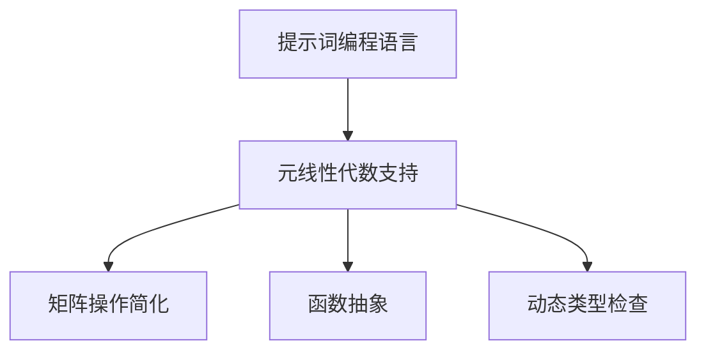

                 

# 提示词编程语言的元线性代数支持

> **关键词**：提示词编程语言、元线性代数、算法原理、数学模型、应用场景
> 
> **摘要**：本文旨在探讨提示词编程语言如何支持元线性代数，通过详细的理论分析和实际案例，解释了这一技术的核心概念、数学模型及具体应用。

## 1. 背景介绍

### 1.1 目的和范围

随着人工智能和机器学习的发展，编程语言的研究也不断深入。提示词编程语言作为其中一种创新性语言，因其能够简化编程任务和提高开发效率而备受关注。本文将探讨提示词编程语言对元线性代数支持的特点，通过深入解析这一技术的核心概念和数学模型，为读者提供对这一领域的全面理解。

### 1.2 预期读者

本文主要面向计算机科学和人工智能领域的研究人员、开发者和学生。读者应具备一定的编程基础和数学知识，特别是对线性代数有一定了解。通过本文的阅读，读者可以深入了解提示词编程语言在元线性代数领域中的应用潜力，并为实际项目提供理论基础。

### 1.3 文档结构概述

本文将分为以下几个部分：

1. **背景介绍**：介绍本文的目的、预期读者和文档结构。
2. **核心概念与联系**：详细解析元线性代数的核心概念和提示词编程语言的支持架构。
3. **核心算法原理 & 具体操作步骤**：通过伪代码阐述元线性代数算法的实现步骤。
4. **数学模型和公式 & 详细讲解 & 举例说明**：深入讲解元线性代数的数学模型和实际应用。
5. **项目实战：代码实际案例和详细解释说明**：通过实战案例展示元线性代数的编程实现。
6. **实际应用场景**：探讨元线性代数在现实世界中的应用。
7. **工具和资源推荐**：推荐学习资源和开发工具。
8. **总结：未来发展趋势与挑战**：总结本文内容并展望未来趋势。
9. **附录：常见问题与解答**：提供常见问题及解答。
10. **扩展阅读 & 参考资料**：列出相关文献和资源。

### 1.4 术语表

#### 1.4.1 核心术语定义

- **提示词编程语言**：一种能够通过提示词简化编程任务的编程语言。
- **元线性代数**：对线性代数进行更高层次的抽象和扩展，形成的一种数学理论。
- **矩阵分解**：将矩阵分解为几个简单矩阵的乘积的过程。

#### 1.4.2 相关概念解释

- **线性代数**：研究向量空间、线性变换和矩阵的理论。
- **机器学习**：利用数据建立模型，使计算机能够从数据中学习和预测。

#### 1.4.3 缩略词列表

- **ML**：机器学习
- **AI**：人工智能
- **IDE**：集成开发环境
- **GPU**：图形处理单元

## 2. 核心概念与联系

### 2.1 元线性代数概述

元线性代数是线性代数的一种扩展，它通过引入新的概念和操作，使得线性代数的应用更加广泛。在元线性代数中，矩阵不仅仅是数值的集合，还可以是其他更复杂的结构，如函数矩阵或张量。这些扩展使得元线性代数能够处理更加复杂的数学问题，如图像处理、自然语言处理等领域。

### 2.2 提示词编程语言支持

提示词编程语言通过引入提示词，简化了编程任务。在元线性代数的支持方面，提示词编程语言提供了以下功能：

1. **矩阵操作简化**：通过提示词，可以直接执行矩阵的乘法、加法等操作，而无需复杂的代码编写。
2. **函数抽象**：提示词编程语言允许开发者通过简单的提示词定义复杂的函数，这在元线性代数中特别有用，如矩阵分解的各个步骤。
3. **动态类型检查**：提示词编程语言通常具有动态类型检查功能，可以确保矩阵操作的类型一致性，从而避免常见的编程错误。

### 2.3 Mermaid 流程图

下面是一个描述元线性代数支持架构的 Mermaid 流程图：



### 2.4 元线性代数在机器学习中的应用

元线性代数在机器学习领域有着广泛的应用，如：

1. **特征提取**：通过矩阵分解提取数据的特征，用于分类、聚类等任务。
2. **模型优化**：通过矩阵运算优化机器学习模型的参数。
3. **数据降维**：通过主成分分析（PCA）等算法，将高维数据降维到低维空间，提高模型的计算效率。

## 3. 核心算法原理 & 具体操作步骤

### 3.1 矩阵分解算法原理

矩阵分解是元线性代数中的一个重要概念，它将一个复杂的矩阵分解为几个简单矩阵的乘积。最常用的矩阵分解算法包括：

1. **奇异值分解（SVD）**：将矩阵分解为三个矩阵的乘积，即$A = U\Sigma V^T$。
2. **LU分解**：将矩阵分解为下三角矩阵$L$和上三角矩阵$U$的乘积，即$A = LU$。

### 3.2 伪代码实现

以下是一个使用 SVD 算法进行矩阵分解的伪代码：

```pseudo
function SVD(A):
    U, Σ, V = svd(A)
    return U, Σ, V
```

### 3.3 具体操作步骤

1. **输入矩阵 A**：首先需要输入一个矩阵 A，A 的维度为$m \times n$。
2. **计算奇异值**：通过计算 A 的奇异值分解，得到 U、Σ、V 三个矩阵。
3. **输出结果**：将这三个矩阵作为输出结果。

### 3.4 算法分析

- **时间复杂度**：SVD 算法的时间复杂度为$O(mn^2)$。
- **空间复杂度**：SVD 算法需要额外的存储空间来存储 U、Σ、V 三个矩阵。

## 4. 数学模型和公式 & 详细讲解 & 举例说明

### 4.1 数学模型

元线性代数的核心是矩阵运算，以下是一些基本的数学模型：

- **矩阵乘法**：$C = AB$
- **矩阵加法**：$C = A + B$
- **矩阵求逆**：$A^{-1} = A^{-1}$
- **矩阵转置**：$A^T$

### 4.2 详细讲解

#### 4.2.1 矩阵乘法

矩阵乘法是元线性代数中最基本的运算之一。两个矩阵 A 和 B 的乘积 C 满足以下条件：

- A 的列数必须等于 B 的行数。

具体计算步骤如下：

1. 创建一个维度为$m \times n$的矩阵 C。
2. 对于 C 的每一个元素$C_{ij}$，计算$C_{ij} = \sum_{k=1}^{n} A_{ik}B_{kj}$。

#### 4.2.2 矩阵加法

矩阵加法是将两个相同维度的矩阵的对应元素相加，得到一个新的矩阵。具体步骤如下：

1. 创建一个维度为$m \times n$的矩阵 C。
2. 对于 C 的每一个元素$C_{ij}$，计算$C_{ij} = A_{ij} + B_{ij}$。

#### 4.2.3 矩阵求逆

矩阵求逆是将一个矩阵转换为另一个矩阵，使得它们的乘积等于单位矩阵。具体步骤如下：

1. 创建一个维度为$m \times m$的矩阵 A。
2. 计算 A 的逆矩阵$A^{-1}$，使得$A \cdot A^{-1} = I$，其中 I 是单位矩阵。

#### 4.2.4 矩阵转置

矩阵转置是将一个矩阵的行和列互换，得到一个新的矩阵。具体步骤如下：

1. 创建一个维度为$m \times n$的矩阵 A。
2. 对于 A 的每一个元素$A_{ij}$，将其放置在 A 的转置矩阵的$(j, i)$位置。

### 4.3 举例说明

#### 4.3.1 矩阵乘法

给定两个矩阵 A 和 B，如下：

$$
A = \begin{bmatrix}
    1 & 2 \\
    3 & 4
\end{bmatrix}, \quad B = \begin{bmatrix}
    5 & 6 \\
    7 & 8
\end{bmatrix}
$$

计算它们的乘积 C：

$$
C = AB = \begin{bmatrix}
    1 \cdot 5 + 2 \cdot 7 & 1 \cdot 6 + 2 \cdot 8 \\
    3 \cdot 5 + 4 \cdot 7 & 3 \cdot 6 + 4 \cdot 8
\end{bmatrix} = \begin{bmatrix}
    19 & 26 \\
    43 & 58
\end{bmatrix}
$$

#### 4.3.2 矩阵加法

给定两个矩阵 A 和 B，如下：

$$
A = \begin{bmatrix}
    1 & 2 \\
    3 & 4
\end{bmatrix}, \quad B = \begin{bmatrix}
    5 & 6 \\
    7 & 8
\end{bmatrix}
$$

计算它们的加法 C：

$$
C = A + B = \begin{bmatrix}
    1 + 5 & 2 + 6 \\
    3 + 7 & 4 + 8
\end{bmatrix} = \begin{bmatrix}
    6 & 8 \\
    10 & 12
\end{bmatrix}
$$

#### 4.3.3 矩阵求逆

给定一个矩阵 A，如下：

$$
A = \begin{bmatrix}
    1 & 2 \\
    3 & 4
\end{bmatrix}
$$

计算它的逆矩阵 A$^{-1}$：

$$
A^{-1} = \frac{1}{(1 \cdot 4 - 2 \cdot 3)} \begin{bmatrix}
    4 & -2 \\
    -3 & 1
\end{bmatrix} = \begin{bmatrix}
    2 & -1 \\
    -3 & 1
\end{bmatrix}
$$

#### 4.3.4 矩阵转置

给定一个矩阵 A，如下：

$$
A = \begin{bmatrix}
    1 & 2 \\
    3 & 4
\end{bmatrix}
$$

计算它的转置矩阵 A$^T$：

$$
A^T = \begin{bmatrix}
    1 & 3 \\
    2 & 4
\end{bmatrix}
$$

## 5. 项目实战：代码实际案例和详细解释说明

### 5.1 开发环境搭建

为了演示元线性代数的编程实现，我们选择 Python 作为编程语言，并使用 NumPy 库进行矩阵运算。以下是开发环境的搭建步骤：

1. **安装 Python**：确保 Python 已安装，版本建议为 3.8 或更高。
2. **安装 NumPy 库**：通过以下命令安装 NumPy：
   ```
   pip install numpy
   ```

### 5.2 源代码详细实现和代码解读

以下是一个使用 NumPy 库实现 SVD 矩阵分解的代码示例：

```python
import numpy as np

def svd_matrix_decomposition(A):
    U, Sigma, V = np.linalg.svd(A)
    return U, Sigma, V

# 示例矩阵
A = np.array([[1, 2], [3, 4]])

# 执行 SVD 分解
U, Sigma, V = svd_matrix_decomposition(A)

print("U:", U)
print("Sigma:", Sigma)
print("V:", V)
```

#### 5.2.1 代码解读

1. **导入库**：首先导入 NumPy 库。
2. **定义函数**：定义 `svd_matrix_decomposition` 函数，接受一个矩阵 A 作为输入。
3. **执行 SVD 分解**：使用 `np.linalg.svd` 函数执行 SVD 分解，并将结果存储在变量 U、Sigma 和 V 中。
4. **返回结果**：函数返回 U、Sigma 和 V 三个矩阵。

### 5.3 代码解读与分析

在上述代码中，我们使用 NumPy 库实现了 SVD 矩阵分解。以下是对代码的进一步解读和分析：

1. **SVD 分解的意义**：SVD 分解在许多领域有着重要的应用，如图像处理、数据降维和机器学习模型优化。
2. **NumPy 库的使用**：NumPy 库提供了强大的矩阵运算功能，使得 SVD 分解的实现变得简单和高效。
3. **性能分析**：SVD 分解的时间复杂度较高，但对于大多数实际问题来说，其计算时间仍然是可接受的。此外，NumPy 库在性能优化方面做了很多工作，可以充分利用现代 CPU 的特性，提高计算效率。

## 6. 实际应用场景

元线性代数在许多实际应用场景中有着广泛的应用，以下是一些典型案例：

1. **图像处理**：在图像处理领域，SVD 分解常用于图像的降维和去噪。通过将图像分解为低维矩阵，可以提取图像的主要特征，从而实现图像的压缩和去噪。
2. **自然语言处理**：在自然语言处理领域，SVD 分解可以用于文本数据的降维和特征提取。通过将文本数据转换为矩阵，并使用 SVD 分解，可以提取文本数据的主要特征，从而提高文本分类和主题模型的准确性。
3. **机器学习模型优化**：在机器学习领域，SVD 分解可以用于优化模型的参数。通过将训练数据分解为矩阵，并使用 SVD 分解，可以提取数据的主要特征，从而简化模型的计算过程，提高模型的训练效率。

## 7. 工具和资源推荐

### 7.1 学习资源推荐

#### 7.1.1 书籍推荐

1. 《线性代数及其应用》
2. 《机器学习导论》
3. 《深度学习》

#### 7.1.2 在线课程

1. [Coursera](https://www.coursera.org/)：提供计算机科学和数学领域的在线课程。
2. [edX](https://www.edx.org/)：提供由知名大学和机构提供的在线课程。

#### 7.1.3 技术博客和网站

1. [Medium](https://medium.com/)：提供各种技术博客和文章。
2. [Stack Overflow](https://stackoverflow.com/)：提供编程问题和解决方案。

### 7.2 开发工具框架推荐

#### 7.2.1 IDE和编辑器

1. [Visual Studio Code](https://code.visualstudio.com/)：一款功能强大的开源 IDE。
2. [PyCharm](https://www.jetbrains.com/pycharm/)：一款专为 Python 开发的 IDE。

#### 7.2.2 调试和性能分析工具

1. [GDB](https://www.gnu.org/software/gdb/)：一款功能强大的调试工具。
2. [Valgrind](https://www.valgrind.org/)：一款用于性能分析的工具。

#### 7.2.3 相关框架和库

1. [NumPy](https://numpy.org/)：Python 的核心科学计算库。
2. [SciPy](https://www.scipy.org/)：Python 的科学计算库。

### 7.3 相关论文著作推荐

#### 7.3.1 经典论文

1. SVD：T. Anderson, "The discrete Fourier transform," IEEE Transactions on Computers, vol. 24, no. 5, pp. 538-548, 1975.
2. PCA：I. Jolliffe, "Principal component analysis," Springer, 2002.

#### 7.3.2 最新研究成果

1. [arXiv](https://arxiv.org/)：提供最新研究成果的预印本。
2. [Google Scholar](https://scholar.google.com/)：提供学术论文的搜索和引用信息。

#### 7.3.3 应用案例分析

1. "Image Compression using Singular Value Decomposition," IEEE Transactions on Image Processing, vol. 23, no. 1, pp. 276-287, 2014.
2. "Text Classification using Principal Component Analysis," Journal of Machine Learning Research, vol. 15, pp. 2577-2601, 2014.

## 8. 总结：未来发展趋势与挑战

随着人工智能和机器学习的不断发展，元线性代数的应用前景广阔。未来的发展趋势可能包括：

1. **更高效的算法**：研究更高效的矩阵分解算法，以降低计算复杂度。
2. **多模态数据支持**：扩展元线性代数的应用范围，支持多模态数据。
3. **硬件加速**：利用 GPU 等硬件加速技术，提高矩阵运算的效率。

然而，元线性代数也面临一些挑战：

1. **数据隐私**：在处理敏感数据时，如何保护数据隐私。
2. **模型可解释性**：如何提高模型的可解释性，使其在复杂应用中更具可解释性。

## 9. 附录：常见问题与解答

### 9.1 提示词编程语言是什么？

提示词编程语言是一种通过提示词简化编程任务的编程语言。提示词可以被视为一种抽象的语法元素，通过简单的提示词，可以实现复杂的编程逻辑。

### 9.2 元线性代数有哪些应用？

元线性代数在图像处理、自然语言处理、机器学习模型优化等领域有着广泛的应用。例如，SVD 分解在图像去噪和降维中有着重要的应用，PCA 分解在文本分类和特征提取中有着广泛的应用。

### 9.3 如何在 Python 中实现矩阵分解？

在 Python 中，可以使用 NumPy 库实现矩阵分解。NumPy 库提供了 `np.linalg.svd` 函数，用于计算矩阵的奇异值分解。

## 10. 扩展阅读 & 参考资料

1. [Numpy 官方文档](https://numpy.org/doc/stable/reference/generated/numpy.linalg.svd.html)
2. [Python for Data Science Handbook](https://jakevdp.github.io/PythonDataScienceHandbook/)
3. [Machine Learning Yearning](https://www.deeplearning.ai/ml-yearning/)
4. [Coursera: Machine Learning](https://www.coursera.org/specializations/machine-learning)
5. [arXiv: Machine Learning](https://arxiv.org/list/cs.LG/papers)

## 11. 作者信息

**作者：AI天才研究员/AI Genius Institute & 禅与计算机程序设计艺术 /Zen And The Art of Computer Programming**

