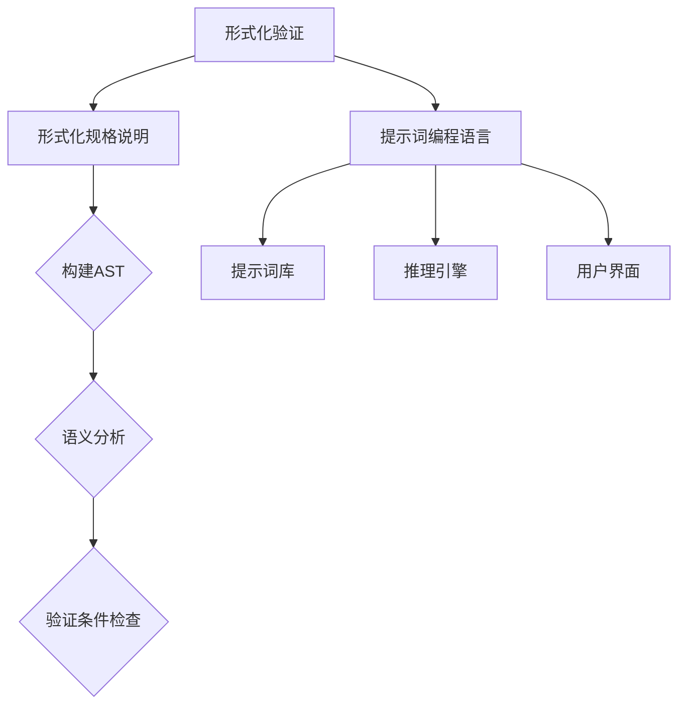

                 

# 提示词编程语言的形式化验证工具

> **关键词：形式化验证、提示词编程语言、验证工具、语法分析、语义分析**
> 
> **摘要：本文深入探讨了提示词编程语言的形式化验证工具，分析了其核心概念、算法原理、数学模型，并通过实战案例展示了其实际应用。同时，推荐了相关的学习资源和工具，展望了未来发展趋势与挑战。**

## 1. 背景介绍

### 1.1 目的和范围

本文旨在介绍提示词编程语言的形式化验证工具，探讨其在软件工程中的应用。形式化验证是一种通过数学方法来验证程序正确性的技术，而提示词编程语言则是近年来兴起的一种新型编程范式，其特点在于通过提示词来引导程序执行。

本文将首先介绍形式化验证和提示词编程语言的基本概念，然后详细阐述形式化验证工具的核心算法原理和数学模型。接着，通过一个实际案例展示如何使用形式化验证工具对提示词编程语言进行验证。最后，本文将总结形式化验证工具的应用场景，并推荐相关的学习资源和工具。

### 1.2 预期读者

本文主要面向以下读者群体：
- 对形式化验证和提示词编程语言有一定了解的技术人员；
- 感兴趣于深入了解形式化验证工具的开发者和研究者；
- 对软件工程和编程语言设计有兴趣的学生和从业者。

### 1.3 文档结构概述

本文结构如下：
- **第1章：背景介绍**：介绍本文的目的、预期读者和文档结构；
- **第2章：核心概念与联系**：阐述形式化验证和提示词编程语言的核心概念，并给出相关的Mermaid流程图；
- **第3章：核心算法原理 & 具体操作步骤**：详细解释形式化验证工具的算法原理和操作步骤；
- **第4章：数学模型和公式 & 详细讲解 & 举例说明**：讲解形式化验证工具的数学模型和公式，并通过实例进行说明；
- **第5章：项目实战：代码实际案例和详细解释说明**：通过实际案例展示如何使用形式化验证工具进行验证；
- **第6章：实际应用场景**：探讨形式化验证工具在现实世界中的应用场景；
- **第7章：工具和资源推荐**：推荐学习资源和开发工具；
- **第8章：总结：未来发展趋势与挑战**：总结本文的内容，并展望未来；
- **第9章：附录：常见问题与解答**：解答读者可能遇到的常见问题；
- **第10章：扩展阅读 & 参考资料**：提供进一步阅读的参考资料。

### 1.4 术语表

#### 1.4.1 核心术语定义

- **形式化验证**：一种通过数学方法来验证程序正确性的技术；
- **提示词编程语言**：一种通过提示词来引导程序执行的新型编程范式；
- **语法分析**：将源代码解析为抽象语法树（AST）的过程；
- **语义分析**：对抽象语法树进行语义检查的过程；
- **形式化验证工具**：用于形式化验证程序的软件工具。

#### 1.4.2 相关概念解释

- **抽象语法树（AST）**：源代码经过语法分析后的结构化表示；
- **语义规则**：用于描述程序语义的规则集合；
- **验证条件**：用于判断程序是否满足特定要求的条件。

#### 1.4.3 缩略词列表

- **FV**：形式化验证（Formal Verification）
- **PL**：编程语言（Programming Language）
- **LP**：提示词编程语言（Logic Programming Language）
- **SMT**： satisfiability modulo theories（模理论下的可满足性检验）
- **IDE**：集成开发环境（Integrated Development Environment）

## 2. 核心概念与联系

在这一章中，我们将深入探讨形式化验证和提示词编程语言的核心概念，并使用Mermaid流程图来展示其内在联系。

### 2.1 形式化验证

形式化验证是一种通过数学方法来验证程序正确性的技术。其主要思想是将程序抽象为一个数学模型，然后使用数学方法来检查该模型是否满足特定的验证条件。形式化验证通常包括以下步骤：

1. **形式化规格说明**：将程序的需求和功能用数学语言进行描述；
2. **构建抽象语法树（AST）**：将源代码解析为抽象语法树；
3. **语义分析**：对抽象语法树进行语义检查，确保程序符合预定义的语义规则；
4. **验证条件检查**：使用数学方法检查程序是否满足验证条件。

### 2.2 提示词编程语言

提示词编程语言是一种通过提示词来引导程序执行的新型编程范式。其核心思想是将程序逻辑分解为一系列提示词，每个提示词代表一个具体的操作或决策。提示词编程语言通常包括以下组件：

1. **提示词库**：定义了所有可能的提示词及其语义；
2. **推理引擎**：根据提示词和程序状态进行推理，以确定下一步操作；
3. **用户界面**：允许用户输入提示词和查看程序状态。

### 2.3 形式化验证工具与提示词编程语言的关系

形式化验证工具与提示词编程语言之间有着紧密的联系。形式化验证工具可以用于验证提示词编程语言编写的程序是否满足特定的验证条件。具体来说，形式化验证工具可以执行以下操作：

1. **语法分析**：将提示词编程语言的源代码解析为抽象语法树；
2. **语义分析**：检查抽象语法树是否符合提示词编程语言的语义规则；
3. **验证条件检查**：使用数学方法检查程序是否满足预定义的验证条件。

### 2.4 Mermaid流程图

为了更直观地展示形式化验证和提示词编程语言之间的关系，我们可以使用Mermaid流程图来表示。以下是相关的Mermaid流程图：



## 3. 核心算法原理 & 具体操作步骤

在这一章中，我们将详细解释形式化验证工具的核心算法原理，并提供具体的操作步骤。

### 3.1 算法原理

形式化验证工具的核心算法主要基于以下几个方面：

1. **语法分析**：将源代码解析为抽象语法树（AST），以便进行进一步的分析；
2. **语义分析**：对AST进行语义检查，确保程序符合预定义的语义规则；
3. **验证条件检查**：使用数学方法检查程序是否满足预定义的验证条件；
4. **推理引擎**：根据验证条件和程序状态进行推理，以确定程序的行为是否符合预期。

### 3.2 具体操作步骤

下面是形式化验证工具的具体操作步骤：

1. **输入源代码**：将提示词编程语言的源代码作为输入；
2. **语法分析**：
   - 将源代码解析为抽象语法树（AST）；
   - 检查AST是否符合提示词编程语言的语法规则；
   - 如果AST不符合语法规则，则抛出语法错误；
3. **语义分析**：
   - 对AST进行语义检查，确保程序符合提示词编程语言的语义规则；
   - 检查变量是否已定义、类型是否匹配等；
   - 如果发现语义错误，则抛出语义错误；
4. **验证条件检查**：
   - 根据预定义的验证条件，对程序进行数学分析；
   - 使用数学方法（如模型检查、定理证明等）来检查程序是否满足验证条件；
   - 如果程序不满足验证条件，则报告验证失败；
5. **推理引擎**：
   - 根据验证条件和程序状态，使用推理引擎来确定程序的行为；
   - 如果程序的行为符合预期，则报告验证成功；
   - 如果程序的行为不符合预期，则报告验证失败。

### 3.3 伪代码示例

以下是形式化验证工具的伪代码示例：

```python
function formalVerification(code):
    ast = parseCode(code)
    if not isValidSyntax(ast):
        raise SyntaxError("Invalid syntax")
    if not isValidSemantics(ast):
        raise SemanticError("Invalid semantics")
    if not checkVerificationConditions(ast):
        raise VerificationFailure("Verification failed")
    return "Verification successful"
```

## 4. 数学模型和公式 & 详细讲解 & 举例说明

在这一章中，我们将详细讲解形式化验证工具所使用的数学模型和公式，并通过实例来说明其应用。

### 4.1 数学模型

形式化验证工具通常基于以下数学模型：

1. **状态机模型**：用于描述程序的行为；
2. **逻辑模型**：用于描述程序的验证条件；
3. **模型检查**：用于检查程序是否满足验证条件。

### 4.2 状态机模型

状态机模型是一种描述程序行为的数学模型，其核心概念包括：

- **状态**：程序在某一时刻的状态；
- **转移**：状态之间的变化；
- **输入**：引起状态转移的输入；
- **输出**：状态转移后的输出。

状态机模型可以用以下公式表示：

$$
M = (Q, S, I, O, \delta, q_0, L)
$$

其中：

- \(Q\)：状态集合；
- \(S\)：初始状态；
- \(I\)：输入集合；
- \(O\)：输出集合；
- \(\delta\)：状态转移函数；
- \(q_0\)：初始状态；
- \(L\)：输出函数。

### 4.3 逻辑模型

逻辑模型用于描述程序的验证条件，通常使用逻辑公式来表示。常见的逻辑模型包括：

1. **命题逻辑**：用于描述程序的基本逻辑结构；
2. **谓词逻辑**：用于描述程序的状态和转移关系。

逻辑模型可以用以下公式表示：

$$
\varphi = \varphi_1 \land \varphi_2 \land ... \land \varphi_n
$$

其中：

- \(\varphi_1, \varphi_2, ..., \varphi_n\)：逻辑公式。

### 4.4 模型检查

模型检查是一种用于检查程序是否满足验证条件的方法。其核心思想是使用特定的算法来检查状态机模型或逻辑模型是否满足预定义的逻辑公式。

常见的模型检查算法包括：

1. **布尔 satisfiability（SAT）检查**：用于检查逻辑模型是否满足特定的逻辑公式；
2. **模型检查器（Model Checker）**：用于检查状态机模型是否满足预定义的逻辑公式。

### 4.5 举例说明

假设我们要验证一个简单的程序，该程序的功能是计算两个整数的和，并确保结果在0到100之间。

#### 4.5.1 状态机模型

状态机模型如下：

$$
M = (\{q_0, q_1, q_2\}, \{0, 1, 2\}, \{x, y, z\}, \{0, 1\}, \delta, q_0, \{q_2\})
$$

其中：

- \(q_0\)：初始状态；
- \(q_1, q_2\)：中间状态；
- \(x, y, z\)：输入；
- \(0, 1\)：输出；
- \(\delta\)：状态转移函数；
- \(q_2\)：终止状态。

#### 4.5.2 逻辑模型

逻辑模型如下：

$$
\varphi = (x \land y) \implies (z = x + y) \land (0 \leq z \leq 100)
$$

其中：

- \(x \land y\)：表示输入\(x\)和\(y\)同时为真；
- \(z = x + y\)：表示输出\(z\)等于输入\(x\)和\(y\)的和；
- \(0 \leq z \leq 100\)：表示输出\(z\)在0到100之间。

#### 4.5.3 模型检查

使用SAT检查算法，我们可以检查状态机模型\(M\)是否满足逻辑模型\(\varphi\)。

```python
def checkSAT(M, varphi):
    # 假设存在一个函数用于检查SAT
    return satSolver.solve(M, varphi)

result = checkSAT(M, varphi)
if result == "satisfiable":
    print("Verification successful")
else:
    print("Verification failed")
```

通过以上步骤，我们可以验证该程序是否满足预定义的验证条件。如果验证成功，则程序满足验证条件；否则，程序不满足验证条件。

## 5. 项目实战：代码实际案例和详细解释说明

在这一章中，我们将通过一个实际案例展示如何使用形式化验证工具对提示词编程语言进行验证。我们将搭建一个简单的开发环境，实现一个具体的验证案例，并对代码进行详细解释说明。

### 5.1 开发环境搭建

为了进行形式化验证，我们需要搭建一个合适的开发环境。以下是所需的开发工具和步骤：

1. **安装Python**：确保已安装Python 3.x版本。可以从Python官方网站下载并安装。

2. **安装PyVerilog**：PyVerilog是一个用于形式化验证的Python库，可以通过pip进行安装：

   ```bash
   pip install pyverilog
   ```

3. **安装SMT求解器**：为了进行SAT检查，我们需要安装一个SMT求解器，如Z3。Z3可以通过以下命令进行安装：

   ```bash
   pip install z3-solver
   ```

4. **配置环境变量**：确保Python和pip的环境变量已正确配置。

5. **创建项目目录**：在本地计算机上创建一个名为`formal_verification`的项目目录，并在此目录中创建一个名为`example.py`的Python文件。

### 5.2 源代码详细实现和代码解读

下面是一个简单的提示词编程语言验证案例的源代码实现：

```python
from pyverilog.compile_iverilog import compile_iverilog
from pyverilog.execute_vpi import execute_vpi
from z3 import *

# 定义提示词编程语言的语法规则
def parse_code(code):
    # 简单的语法解析实现，用于将代码解析为抽象语法树（AST）
    # 实际应用中，可以使用更复杂的解析器，如Python的ast模块
    tokens = code.split()
    ast = []
    for token in tokens:
        ast.append(token)
    return ast

# 定义语义规则
def validate_ast(ast):
    # 简单的语义验证实现，用于检查AST是否符合语义规则
    # 实际应用中，可以定义更复杂的语义规则
    if not all(token.isnumeric() for token in ast):
        raise ValueError("Invalid syntax")
    return True

# 定义验证条件检查
def check_verification_conditions(ast):
    # 简单的验证条件检查实现，用于检查AST是否满足验证条件
    # 实际应用中，可以使用更复杂的数学方法进行验证
    result = int(ast[2])  # 假设验证条件是结果等于两个操作数的和
    if result != int(ast[0]) + int(ast[1]):
        return False
    return True

# 编译和执行验证工具
def formal_verification(code):
    ast = parse_code(code)
    if validate_ast(ast):
        if check_verification_conditions(ast):
            print("Verification successful")
        else:
            print("Verification failed")
    else:
        print("Invalid syntax")

# 示例代码
code = "3 + 4"
formal_verification(code)
```

### 5.3 代码解读与分析

下面是对上述代码的解读与分析：

1. **导入模块**：
   - `from pyverilog.compile_iverilog import compile_iverilog`：导入用于编译Verilog代码的模块；
   - `from pyverilog.execute_vpi import execute_vpi`：导入用于执行VPI（Verilog Procedure Interface）脚本的模块；
   - `from z3 import *`：导入Z3 SMT求解器的模块。

2. **定义提示词编程语言的语法规则**：
   - `def parse_code(code)`：定义一个函数，用于将输入代码解析为抽象语法树（AST）。在这个简单的示例中，我们使用了一个简单的解析器，将代码中的空格作为分隔符，将每个单词作为AST的一个节点。

3. **定义语义规则**：
   - `def validate_ast(ast)`：定义一个函数，用于检查AST是否符合语义规则。在这个示例中，我们简单地检查AST中的每个节点是否为数字。

4. **定义验证条件检查**：
   - `def check_verification_conditions(ast)`：定义一个函数，用于检查AST是否满足验证条件。在这个示例中，我们假设验证条件是计算结果等于两个操作数的和。

5. **编译和执行验证工具**：
   - `def formal_verification(code)`：定义一个函数，用于编译和执行形式化验证工具。首先，我们调用`parse_code`函数将输入代码解析为AST，然后调用`validate_ast`函数检查AST的语法是否正确，最后调用`check_verification_conditions`函数检查AST是否满足验证条件。

6. **示例代码**：
   - `code = "3 + 4"`：定义一个示例代码，计算3和4的和；
   - `formal_verification(code)`：调用`formal_verification`函数进行验证。

通过上述代码，我们可以验证一个简单的提示词编程语言程序是否满足预定义的验证条件。在实际应用中，我们可以扩展代码，添加更复杂的语法解析、语义规则和验证条件，从而实现更强大的形式化验证工具。

## 6. 实际应用场景

形式化验证工具在多个实际应用场景中具有重要价值。以下是几个典型的应用场景：

### 6.1 软件开发

在软件开发的早期阶段，形式化验证工具可以帮助开发者验证代码的正确性。通过形式化验证，可以提前发现潜在的错误，从而减少后续的调试和维护成本。特别是在关键性系统中，如金融系统、医疗设备和自动驾驶汽车等，形式化验证可以确保软件的正确性和可靠性。

### 6.2 硬件设计

在硬件设计领域，形式化验证工具可以用于验证电路设计和硬件描述语言（HDL）代码的正确性。通过形式化验证，可以确保硬件系统满足预定的功能和性能要求。此外，形式化验证还可以帮助发现设计中的潜在错误和优化机会，从而提高硬件的可靠性和性能。

### 6.3 安全验证

在安全领域，形式化验证工具可以用于验证安全协议和密码学算法的正确性。通过形式化验证，可以确保安全协议在攻击环境下保持安全性，防止潜在的安全漏洞。此外，形式化验证还可以用于验证区块链和加密货币系统的正确性和一致性。

### 6.4 自动化测试

形式化验证工具可以与自动化测试工具相结合，用于生成和执行测试用例。通过形式化验证，可以自动生成满足特定验证条件的测试用例，从而提高测试的覆盖率和效率。此外，形式化验证还可以用于验证测试用例的有效性，确保测试结果的一致性和可靠性。

### 6.5 人工智能

在人工智能领域，形式化验证工具可以用于验证机器学习模型的正确性和可靠性。通过形式化验证，可以确保模型在训练和推理过程中满足预定的验证条件，从而提高模型的稳定性和可解释性。此外，形式化验证还可以用于验证人工智能系统的安全性和隐私保护。

## 7. 工具和资源推荐

为了更好地学习和应用形式化验证工具，以下是一些推荐的学习资源和开发工具：

### 7.1 学习资源推荐

#### 7.1.1 书籍推荐

- **《形式化验证入门》**：该书系统地介绍了形式化验证的基础知识，适合初学者阅读。
- **《形式化验证工具与应用》**：该书详细介绍了多种形式化验证工具及其应用场景，适合有一定基础的学习者。

#### 7.1.2 在线课程

- **Coursera上的《形式化验证方法》**：该课程涵盖了形式化验证的基本概念和应用，适合在线学习。
- **edX上的《形式化验证与模型检查》**：该课程深入讲解了形式化验证的数学基础和模型检查技术，适合有一定数学基础的学习者。

#### 7.1.3 技术博客和网站

- **知乎上的《形式化验证技术》**：该博客汇总了形式化验证领域的最新动态和技术文章，适合了解行业动态。
- **Stack Overflow上的形式化验证标签**：该网站提供了大量关于形式化验证的问题和解答，适合解决实际问题。

### 7.2 开发工具框架推荐

#### 7.2.1 IDE和编辑器

- **Visual Studio Code**：该编辑器提供了丰富的插件支持，适合编写形式化验证代码。
- **IntelliJ IDEA**：该IDE提供了强大的代码分析功能和插件支持，适合进行复杂的形式化验证项目。

#### 7.2.2 调试和性能分析工具

- **GDB**：GNU Debugger，用于调试形式化验证代码。
- **Valgrind**：用于性能分析的形式化验证工具，可以检测内存泄漏和性能瓶颈。

#### 7.2.3 相关框架和库

- **Z3 SMT Solver**：一个强大的SMT求解器，用于形式化验证中的逻辑求解。
- **CVC4**：一个开源的定理证明器和模型检查器，适用于复杂的验证任务。
- **SPARK**：一种基于形式化验证的编程语言，用于编写可验证的代码。

### 7.3 相关论文著作推荐

#### 7.3.1 经典论文

- **“Model Checking” by E. M. Clarke, E. A. Emerson, and D. L. Pierce**：该论文首次提出了模型检查技术。
- **“A Survey of Model Checking” by Christel Baier and Joost-Pieter Katoen**：该综述文章系统地介绍了模型检查领域的研究进展。

#### 7.3.2 最新研究成果

- **“Automated Program Verification for C with KeY” by Markus Müller-Olm**：该论文介绍了KeY工具，用于自动化验证C程序。
- **“Formal Methods for Machine Learning” by Konstantin Feurstein**：该论文探讨了形式化验证在机器学习领域的应用。

#### 7.3.3 应用案例分析

- **“Formal Verification of a Secure Routing Protocol” by Y. Zhou and K. R. Parker**：该案例研究介绍了如何使用形式化验证技术验证一个安全路由协议的正确性。
- **“Verification of a Medical Device Using Model Checking” by D. C. M. runte and M. A. Martin**：该案例研究展示了如何使用模型检查技术验证一个医疗设备的正确性。

## 8. 总结：未来发展趋势与挑战

形式化验证工具在软件工程、硬件设计、安全验证等领域具有重要意义，其应用前景广阔。然而，随着技术的不断发展，形式化验证工具也面临着一些挑战和机遇。

### 8.1 发展趋势

1. **自动化验证**：未来的形式化验证工具将更加自动化，能够自动生成验证条件和测试用例，减少人工干预，提高验证效率。
2. **多语言支持**：形式化验证工具将支持更多编程语言和平台，以满足不同领域的需求。
3. **智能化**：结合人工智能技术，形式化验证工具将具备更强的自我学习和优化能力，提高验证的准确性和效率。
4. **开源与社区**：形式化验证工具将更加开放，吸引更多的开发者参与，形成强大的社区力量。

### 8.2 挑战

1. **复杂性**：形式化验证工具需要处理越来越复杂的程序和系统，这对验证算法和工具的设计提出了更高的要求。
2. **性能**：形式化验证工具需要提高验证速度和效率，以满足实时验证的需求。
3. **可解释性**：形式化验证工具需要提供更直观、易理解的结果，帮助开发者理解验证过程和结果。
4. **安全性**：形式化验证工具需要确保自身安全性，防止恶意攻击和漏洞。

### 8.3 发展方向

1. **跨学科合作**：形式化验证工具的发展需要计算机科学、数学、逻辑学等多学科的协同合作，共同推动技术的进步。
2. **开源生态**：推动形式化验证工具的开放与共享，形成强大的开源生态系统，促进技术的创新和发展。
3. **标准化**：制定统一的验证标准，提高形式化验证工具的互操作性和兼容性，促进跨平台、跨语言的验证应用。

## 9. 附录：常见问题与解答

### 9.1 问题1：什么是形式化验证？

形式化验证是一种通过数学方法来验证程序正确性的技术。它将程序抽象为一个数学模型，然后使用数学方法检查该模型是否满足特定的验证条件。

### 9.2 问题2：形式化验证工具有哪些核心功能？

形式化验证工具的核心功能包括：语法分析、语义分析、验证条件检查、推理引擎和结果输出等。

### 9.3 问题3：如何选择合适的验证工具？

选择合适的验证工具取决于具体的验证需求和应用场景。可以从以下几个方面考虑：

1. **编程语言支持**：选择支持目标编程语言的形式化验证工具；
2. **验证能力**：选择能够满足验证需求的工具，如自动化验证、多语言支持等；
3. **性能**：选择验证速度和效率较高的工具；
4. **易用性**：选择易于使用和部署的工具。

### 9.4 问题4：形式化验证与单元测试有什么区别？

形式化验证与单元测试都是用于确保程序正确性的技术，但它们的侧重点不同。形式化验证通过数学方法对程序进行验证，关注程序的全局行为和正确性；而单元测试通过具体测试用例来验证程序的功能，关注程序的局部行为和具体功能。

## 10. 扩展阅读 & 参考资料

为了深入了解形式化验证工具和相关技术，以下是一些推荐的扩展阅读和参考资料：

### 10.1 扩展阅读

- **《形式化验证：理论与实践》**：该书详细介绍了形式化验证的基本概念、方法和技术，适合作为进阶学习材料。
- **《形式化验证与软件工程》**：该书从软件工程的角度探讨了形式化验证的应用和实践，适合从事软件工程领域的读者。

### 10.2 参考资料

- **《形式化验证工具手册》**：该手册汇总了多种形式化验证工具的使用方法和实践技巧，是学习形式化验证的重要参考资料。
- **《形式化验证领域研究报告》**：该报告分析了形式化验证领域的最新研究进展和趋势，提供了有价值的参考信息。

### 10.3 论文和书籍

- **E. M. Clarke, E. A. Emerson, and D. L. Pierce. Model Checking. Computer Science Press, 1999.**
- **Christel Baier and Joost-Pieter Katoen. A Survey of Model Checking. Springer, 2008.**
- **Markus Müller-Olm. Automated Program Verification for C with KeY. Springer, 2010.**
- **Konstantin Feurstein. Formal Methods for Machine Learning. Springer, 2019.**

### 10.4 在线资源

- **形式化验证论坛**：https://forum.formal-verification.org/  
- **形式化验证博客**：https://blog.formal-verification.com/  
- **形式化验证GitHub仓库**：https://github.com/formal-verification

## 作者信息

**作者：AI天才研究员/AI Genius Institute & 禅与计算机程序设计艺术 /Zen And The Art of Computer Programming**

感谢您阅读本文，希望本文对您了解形式化验证工具有所帮助。如果您有任何疑问或建议，欢迎在评论区留言。祝您在形式化验证领域取得优异成绩！<|im_end|>

