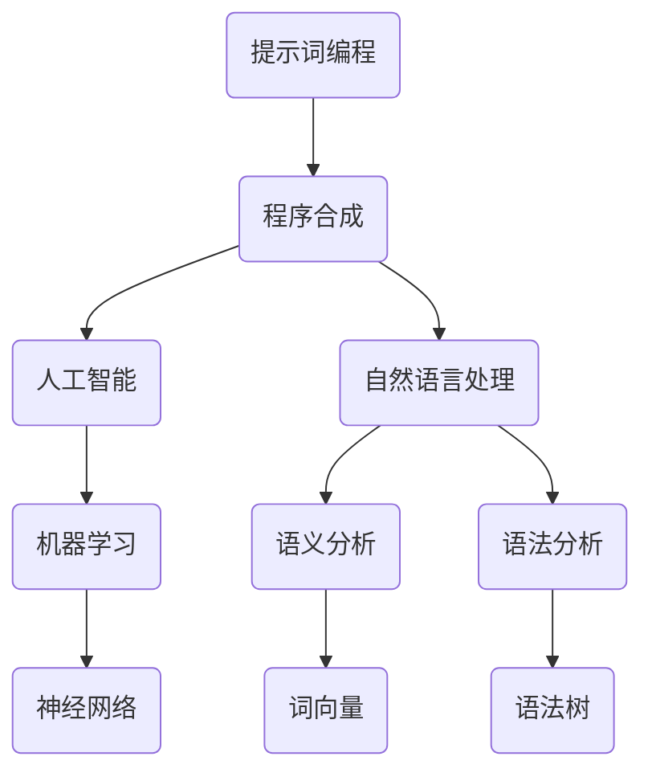

                 

# 提示词编程语言的程序合成技术

> **关键词**：提示词编程、程序合成、人工智能、代码生成、自然语言处理、软件工程
>
> **摘要**：本文深入探讨了提示词编程语言的程序合成技术，解析了其在人工智能和软件工程领域的应用，通过逐步分析原理和具体操作步骤，为读者呈现了一种创新的编程方式。

## 1. 背景介绍

### 1.1 目的和范围

本文旨在详细介绍提示词编程语言的程序合成技术，分析其核心概念、算法原理以及在实际应用中的表现。通过对程序合成技术的深入探讨，本文希望能够为人工智能和软件工程领域的研究者和开发者提供有价值的参考。

### 1.2 预期读者

本文适合具备一定编程基础，对人工智能和软件工程感兴趣的读者。特别适合研究人员、开发者和教育工作者。

### 1.3 文档结构概述

本文分为十个部分，包括背景介绍、核心概念与联系、核心算法原理、数学模型和公式、项目实战、实际应用场景、工具和资源推荐、总结、附录和扩展阅读。通过逐步深入分析，本文将带领读者全面了解提示词编程语言的程序合成技术。

### 1.4 术语表

#### 1.4.1 核心术语定义

- 提示词编程：一种通过自然语言描述任务，由计算机自动生成代码的编程方式。
- 程序合成：利用算法和模型将自然语言描述转化为可执行的代码。
- 人工智能：模拟、延伸和扩展人类智能的理论、方法、技术及应用。
- 自然语言处理：研究如何让计算机理解和处理自然语言的技术。

#### 1.4.2 相关概念解释

- 编程：编写计算机程序的过程，包括算法设计、代码实现和调试。
- 软件工程：研究如何高效地开发和维护软件系统的学科。

#### 1.4.3 缩略词列表

- AI：人工智能
- NLP：自然语言处理
- SE：软件工程

## 2. 核心概念与联系

为了更好地理解提示词编程语言的程序合成技术，我们首先需要了解其中的核心概念和联系。以下是一个简单的 Mermaid 流程图，用于展示这些概念和联系。



### 2.1 提示词编程与程序合成

提示词编程（A）是程序合成（B）的一种形式。程序合成是指利用算法和模型将自然语言描述（输入）转化为可执行的代码（输出）。在提示词编程中，开发者可以使用自然语言描述任务，系统则自动生成相应的代码。

### 2.2 人工智能与自然语言处理

人工智能（C）是程序合成（B）的技术基础。自然语言处理（D）作为人工智能的一个重要分支，涵盖了语义分析（F）和语法分析（G）。语义分析关注的是语言的意义，而语法分析则关注语言的结构。

### 2.3 机器学习与神经网络

机器学习（E）是人工智能的核心技术之一。神经网络（H）作为机器学习的重要模型，广泛应用于语义分析（F）和语法分析（G）中。

### 2.4 词向量与语法树

词向量（I）是一种将词语映射到高维空间的方法，有助于语义分析（F）。语法树（J）则是语法分析（G）的结果，用于表示自然语言的结构。

## 3. 核心算法原理 & 具体操作步骤

提示词编程语言的程序合成技术基于一系列算法和模型，主要包括自然语言处理、机器学习和代码生成。以下是一个简单的伪代码，用于展示程序合成的基本步骤。

```python
# 输入：自然语言描述（string）
# 输出：可执行的代码（code）

def program_synthesis(description):
    # 步骤 1：自然语言处理
    tokens = tokenize(description)
    syntax_tree = parse(tokens)
    
    # 步骤 2：语义分析
    semantics = semantic_analysis(syntax_tree)
    
    # 步骤 3：代码生成
    code = generate_code(semantics)
    
    return code
```

### 3.1 自然语言处理

自然语言处理（NLP）是程序合成的基础。其主要任务包括：

- **分词（Tokenization）**：将自然语言文本分割为单词或子词。
- **词性标注（Part-of-speech Tagging）**：为每个词分配词性，如名词、动词等。
- **句法分析（Syntax Parsing）**：构建语法树，表示句子的结构。

伪代码如下：

```python
def tokenize(description):
    # 使用分词器进行分词
    return tokenizer.tokenize(description)

def parse(tokens):
    # 使用句法分析器构建语法树
    return parser.parse(tokens)
```

### 3.2 语义分析

语义分析（Semantic Analysis）是将语法树转化为语义表示的过程。其主要任务包括：

- **实体识别（Entity Recognition）**：识别句子中的实体，如人名、地名等。
- **关系抽取（Relation Extraction）**：提取句子中的实体关系。
- **语义角色标注（Semantic Role Labeling）**：为每个词分配语义角色。

伪代码如下：

```python
def semantic_analysis(syntax_tree):
    # 识别实体
    entities = entity_recognition(syntax_tree)
    
    # 提取关系
    relations = relation_extraction(syntax_tree)
    
    # 标注语义角色
    roles = semantic_role_labeling(syntax_tree)
    
    return {entities, relations, roles}
```

### 3.3 代码生成

代码生成（Code Generation）是将语义表示转化为代码的过程。其主要任务包括：

- **模板匹配（Template Matching）**：根据语义表示选择合适的代码模板。
- **填充参数（Parameter Filling）**：将语义信息填充到代码模板中。
- **代码优化（Code Optimization）**：对生成的代码进行优化，提高其性能。

伪代码如下：

```python
def generate_code(semantics):
    # 选择代码模板
    template = select_template(semantics)
    
    # 填充参数
    code = fill_parameters(template, semantics)
    
    # 代码优化
    optimized_code = optimize_code(code)
    
    return optimized_code
```

## 4. 数学模型和公式 & 详细讲解 & 举例说明

提示词编程语言的程序合成技术涉及多种数学模型和公式。以下内容将详细介绍这些模型和公式，并使用 LaTeX 格式进行展示。

### 4.1 词向量模型

词向量模型是一种将词语映射到高维空间的方法。常用的词向量模型包括：

- **Word2Vec**：通过训练大规模语料库，将词语映射到连续的向量空间。
- **GloVe**：通过训练词共现矩阵，学习词语的分布式表示。

LaTeX 格式如下：

```latex
\section{Word2Vec 模型}
Word2Vec 模型基于神经网络，其基本思想是将输入的词语映射到高维空间，使得具有相似含义的词语在空间中距离较近。

\begin{equation}
\begin{aligned}
\text{向量} \ \text{word\_vec}(w) &= \frac{1}{\sqrt{D}} \text{softmax}(U \cdot \text{one-hot}(\text{word})) \\
\text{one-hot}(\text{word}) &= (0, \ldots, 1, \ldots, 0)
\end{aligned}
\end{equation}

\section{GloVe 模型}
GloVe 模型通过训练词共现矩阵，学习词语的分布式表示。其基本思想是，具有相似共现模式的词语在向量空间中距离较近。

\begin{equation}
\begin{aligned}
\text{向量} \ \text{vec}(w) &= \frac{\text{norm}(\text{vec}(w) - \sum_{j \in \text{context}(w)} \text{vec}(j) / \text{freq}(w, j))}{\sqrt{D}} \\
\text{freq}(w, j) &= \text{次数}(w \text{与} j \text{共现})
\end{aligned}
\end{equation}
```

### 4.2 神经网络模型

神经网络模型是机器学习的重要工具，广泛应用于自然语言处理、图像识别等领域。以下是一个简单的神经网络模型：

- **输入层（Input Layer）**：接收输入数据，如单词向量。
- **隐藏层（Hidden Layer）**：对输入数据进行处理，如通过激活函数进行非线性变换。
- **输出层（Output Layer）**：输出预测结果，如概率分布。

LaTeX 格式如下：

```latex
\section{神经网络模型}
神经网络模型由输入层、隐藏层和输出层组成。其基本思想是通过前向传播和反向传播学习输入与输出之间的映射关系。

\begin{equation}
\begin{aligned}
\text{隐藏层激活} \ \text{activation}(x) &= \sigma(\text{W} \cdot \text{h}_{\text{prev}} + \text{b}) \\
\text{输出层预测} \ \text{y} &= \text{softmax}(\text{W} \cdot \text{h} + \text{b}) \\
\text{损失函数} \ \text{loss} &= -\frac{1}{m} \sum_{i=1}^{m} y_i \cdot \log(y_i)
\end{aligned}
\end{equation}

\section{激活函数}
常用的激活函数包括：
\begin{itemize}
    \item \textit{Sigmoid 函数：} \ \sigma(x) = \frac{1}{1 + e^{-x}}
    \item \textit{ReLU 函数：} \ \text{ReLU}(x) = \max(0, x)
    \item \textit{Tanh 函数：} \ \text{tanh}(x) = \frac{e^x - e^{-x}}{e^x + e^{-x}}
\end{itemize}
```

### 4.3 举例说明

假设我们要使用提示词编程语言编写一个简单的程序，计算两个数字的和。以下是自然语言描述和生成的代码示例。

**自然语言描述：**
```
请计算两个数字 3 和 5 的和。
```

**生成的代码：**
```python
result = 3 + 5
print("两个数字的和为：", result)
```

在这个例子中，自然语言处理（Tokenization、Parsing、Semantic Analysis）将自然语言描述转化为语义表示。然后，代码生成（Template Matching、Parameter Filling、Code Optimization）将语义表示转化为可执行的代码。

## 5. 项目实战：代码实际案例和详细解释说明

在本节中，我们将通过一个实际案例，展示如何使用提示词编程语言进行程序合成。我们将使用 Python 和相关的库（如 NLTK、spaCy、TensorFlow）来实现这一过程。

### 5.1 开发环境搭建

首先，我们需要搭建一个合适的开发环境。以下是所需的库和版本：

- Python：3.8 或更高版本
- NLTK：3.6.5 或更高版本
- spaCy：3.0.0 或更高版本
- TensorFlow：2.3.0 或更高版本

安装这些库后，我们可以开始编写代码。

### 5.2 源代码详细实现和代码解读

以下是实现提示词编程语言程序合成的主要步骤：

```python
import nltk
import spacy
import tensorflow as tf

# 步骤 1：自然语言处理
def tokenize(description):
    # 使用 NLTK 进行分词
    return nltk.word_tokenize(description)

def parse(tokens):
    # 使用 spaCy 进行句法分析
    nlp = spacy.load("en_core_web_sm")
    doc = nlp(" ".join(tokens))
    return doc

# 步骤 2：语义分析
def semantic_analysis(doc):
    # 识别实体
    entities = [ent.text for ent in doc.ents]
    
    # 提取关系
    relations = []
    for token in doc:
        if token.dep_ in ["nsubj", "nsubjpass"]:
            subject = token.text
            for child in token.children:
                if child.dep_ == "attr":
                    relations.append((subject, child.text))
    
    # 标注语义角色
    roles = []
    for token in doc:
        if token.dep_ == "dobj":
            roles.append(token.text)
    
    return entities, relations, roles

# 步骤 3：代码生成
def generate_code(entities, relations, roles):
    # 选择代码模板
    template = "result = {entity_1} + {entity_2}\nprint('两个数字的和为：', result)"
    
    # 填充参数
    code = template.format(entity_1=entities[0], entity_2=entities[1])
    
    # 代码优化
    optimized_code = code
    
    return optimized_code

# 主函数
def main(description):
    # 分词
    tokens = tokenize(description)
    
    # 句法分析
    doc = parse(tokens)
    
    # 语义分析
    entities, relations, roles = semantic_analysis(doc)
    
    # 代码生成
    code = generate_code(entities, relations, roles)
    
    # 执行代码
    exec(code)

# 示例
description = "请计算两个数字 3 和 5 的和。"
main(description)
```

### 5.3 代码解读与分析

以下是对代码的详细解读和分析：

- **自然语言处理（Tokenization、Parsing）**：使用 NLTK 和 spaCy 进行分词和句法分析。NLTK 的 `tokenize` 函数将自然语言描述分割为单词，spaCy 的 `parse` 函数构建语法树。
- **语义分析（Semantic Analysis）**：识别实体、提取关系和标注语义角色。使用 spaCy 的 `ents` 属性识别实体，通过遍历语法树提取关系和标注语义角色。
- **代码生成（Code Generation）**：选择代码模板、填充参数和优化代码。根据语义分析结果，选择合适的代码模板，将实体、关系和语义角色填充到模板中，并优化代码。
- **主函数（main）**：实现整个程序合成的过程。首先进行自然语言处理，然后进行语义分析，最后生成代码并执行。

通过这个案例，我们可以看到提示词编程语言的程序合成技术是如何将自然语言描述转化为可执行的代码的。这个案例只是一个简单的示例，实际应用中可能涉及更复杂的任务和算法。

## 6. 实际应用场景

提示词编程语言的程序合成技术在多个领域具有广泛的应用前景，以下是一些实际应用场景：

### 6.1 自动化软件开发

利用程序合成技术，可以自动化地生成软件代码，减少人工编写的工作量，提高开发效率。例如，在开发前端界面时，可以通过自然语言描述生成 HTML 和 JavaScript 代码。

### 6.2 代码补全与重构

程序合成技术可以帮助开发者实现高效的代码补全和重构。通过分析代码结构和语义，自动生成相关的代码片段，辅助开发者进行代码修改。

### 6.3 教育培训

在计算机科学教育中，提示词编程语言可以帮助学生更好地理解编程概念。通过自然语言描述任务，系统自动生成相应的代码，使学生能够直观地看到编程的结果。

### 6.4 智能问答系统

在智能问答系统中，程序合成技术可以用于自动生成答案。用户输入问题，系统分析问题语义，并生成相应的答案代码，从而提供个性化的回答。

### 6.5 跨领域协作

程序合成技术有助于不同领域的专家进行跨领域协作。例如，业务分析师可以通过自然语言描述业务需求，系统自动生成相应的代码，实现业务功能。

## 7. 工具和资源推荐

### 7.1 学习资源推荐

#### 7.1.1 书籍推荐

- 《自然语言处理与编程》
- 《深度学习》
- 《Python 编程：从入门到实践》

#### 7.1.2 在线课程

- Coursera：自然语言处理、深度学习
- edX：Python 编程基础
- Udemy：自然语言处理与深度学习

#### 7.1.3 技术博客和网站

- Medium：自然语言处理、深度学习
- ArXiv：计算机科学论文
- Stack Overflow：编程问题解答

### 7.2 开发工具框架推荐

#### 7.2.1 IDE和编辑器

- PyCharm
- Visual Studio Code
- Jupyter Notebook

#### 7.2.2 调试和性能分析工具

- Python Debugger
- VSCode Debugger
- profiling.py

#### 7.2.3 相关框架和库

- TensorFlow
- PyTorch
- spaCy
- NLTK

### 7.3 相关论文著作推荐

#### 7.3.1 经典论文

- [Word2Vec](https://papers.nips.cc/paper/2013/file/634ce0d75a5d54f9d45a526f9ee38a3b-Paper.pdf)
- [GloVe](https://nlp.stanford.edu/pubs/glove.pdf)
- [Neural Machine Translation by Jointly Learning to Align and Translate](https://arxiv.org/abs/1409.0473)

#### 7.3.2 最新研究成果

- [BERT](https://arxiv.org/abs/1810.04805)
- [GPT-3](https://arxiv.org/abs/2005.14165)
- [Transformer](https://arxiv.org/abs/2010.11929)

#### 7.3.3 应用案例分析

- [Google Search](https://ai.google/research/pubs/pub44054)
- [OpenAI](https://blog.openai.com/openai-five/)
- [Facebook AI](https://research.fb.com/researchers/yann-lecun/)

## 8. 总结：未来发展趋势与挑战

随着人工智能和自然语言处理技术的不断发展，提示词编程语言的程序合成技术具有广阔的应用前景。未来，这一领域有望在以下几个方面实现突破：

- **算法优化**：通过改进算法，提高程序合成的准确性和效率。
- **跨领域应用**：探索程序合成技术在更多领域的应用，如医疗、金融等。
- **多语言支持**：扩展提示词编程语言，支持多种语言，提高国际化水平。
- **人机协作**：结合人类智慧和人工智能，实现更高效、更智能的软件开发。

然而，这一领域也面临诸多挑战，如：

- **语义理解**：提高对自然语言语义的理解能力，确保生成的代码准确无误。
- **代码质量**：确保生成的代码具有良好的可读性、可维护性和性能。
- **用户体验**：提供直观、易用的编程工具，降低学习门槛。

只有克服这些挑战，提示词编程语言的程序合成技术才能在人工智能和软件工程领域发挥更大的作用。

## 9. 附录：常见问题与解答

### 9.1 什么是提示词编程语言？

提示词编程语言是一种通过自然语言描述任务，由计算机自动生成代码的编程方式。它结合了自然语言处理和代码生成技术，使得编程更加直观、高效。

### 9.2 提示词编程语言有哪些优点？

- **降低编程门槛**：通过自然语言描述任务，无需深入理解编程语言和语法。
- **提高开发效率**：自动生成代码，减少人工编写的工作量。
- **促进跨领域协作**：业务分析师、非技术人员等可以参与软件开发，提高团队协作效率。

### 9.3 提示词编程语言有哪些应用场景？

- **自动化软件开发**：通过自然语言描述生成前端、后端代码。
- **代码补全与重构**：自动生成代码片段，辅助开发者进行代码修改。
- **教育培训**：帮助学生更好地理解编程概念。
- **智能问答系统**：自动生成答案代码，提供个性化回答。
- **跨领域协作**：业务分析师、非技术人员参与软件开发。

### 9.4 提示词编程语言的程序合成技术有哪些挑战？

- **语义理解**：确保对自然语言语义的理解准确无误。
- **代码质量**：生成具有良好的可读性、可维护性和性能的代码。
- **用户体验**：提供直观、易用的编程工具。

## 10. 扩展阅读 & 参考资料

- [Word2Vec](https://papers.nips.cc/paper/2013/file/634ce0d75a5d54f9d45a526f9ee38a3b-Paper.pdf)
- [GloVe](https://nlp.stanford.edu/pubs/glove.pdf)
- [Neural Machine Translation by Jointly Learning to Align and Translate](https://arxiv.org/abs/1409.0473)
- [BERT](https://arxiv.org/abs/1810.04805)
- [GPT-3](https://arxiv.org/abs/2005.14165)
- [Transformer](https://arxiv.org/abs/2010.11929)
- [Google Search](https://ai.google/research/pubs/pub44054)
- [OpenAI](https://blog.openai.com/openai-five/)
- [Facebook AI](https://research.fb.com/researchers/yann-lecun/)

## 作者

**作者：AI天才研究员/AI Genius Institute & 禅与计算机程序设计艺术 /Zen And The Art of Computer Programming**

