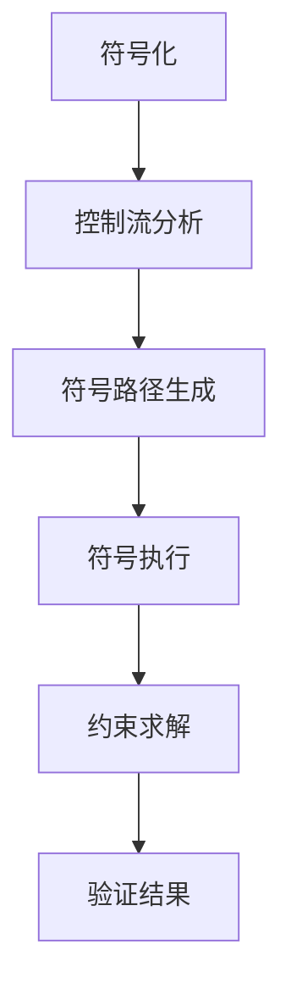

                 

# 提示词编程语言的符号执行技术

> 关键词：提示词编程、符号执行、技术、算法、应用场景、工具资源

> 摘要：本文深入探讨了提示词编程语言的符号执行技术。首先介绍了符号执行的基本概念和原理，然后详细讲解了其核心算法原理和操作步骤，并通过数学模型和公式进行了详细阐述。随后，通过实际案例展示了符号执行在代码调试和优化中的应用。最后，文章总结了符号执行技术的实际应用场景，并推荐了一些相关工具和资源。

## 1. 背景介绍

### 1.1 目的和范围

本文旨在探讨提示词编程语言的符号执行技术，分析其原理和算法，并探讨其在实际应用中的价值和挑战。符号执行技术是计算机科学中一个重要的研究方向，它通过符号化的方法对程序进行推理和分析，有助于提高程序的正确性和可靠性。本文将从以下几个方面展开讨论：

- 符号执行的基本概念和原理
- 核心算法原理和具体操作步骤
- 数学模型和公式的详细讲解
- 项目实战：代码实际案例和详细解释说明
- 实际应用场景
- 工具和资源推荐

### 1.2 预期读者

本文主要面向对计算机编程和人工智能技术有一定了解的技术人员和研究学者。对于想要深入了解提示词编程语言和符号执行技术的读者，本文将提供有价值的参考。同时，本文也适用于对计算机科学和编程感兴趣的初学者，通过逐步讲解，读者可以更好地理解符号执行技术的基本原理和应用。

### 1.3 文档结构概述

本文共分为十个部分，具体结构如下：

1. 背景介绍
   - 1.1 目的和范围
   - 1.2 预期读者
   - 1.3 文档结构概述
   - 1.4 术语表
2. 核心概念与联系
   - 2.1 提示词编程语言的基本概念
   - 2.2 符号执行的核心概念
   - 2.3 Mermaid 流程图展示
3. 核心算法原理 & 具体操作步骤
   - 3.1 符号执行算法的基本原理
   - 3.2 符号执行算法的具体操作步骤
   - 3.3 伪代码展示
4. 数学模型和公式 & 详细讲解 & 举例说明
   - 4.1 数学模型的基本概念
   - 4.2 符号执行中的数学公式
   - 4.3 案例分析
5. 项目实战：代码实际案例和详细解释说明
   - 5.1 开发环境搭建
   - 5.2 源代码详细实现和代码解读
   - 5.3 代码解读与分析
6. 实际应用场景
   - 6.1 代码调试和优化
   - 6.2 安全性和漏洞分析
   - 6.3 模式识别和机器学习
7. 工具和资源推荐
   - 7.1 学习资源推荐
   - 7.2 开发工具框架推荐
   - 7.3 相关论文著作推荐
8. 总结：未来发展趋势与挑战
9. 附录：常见问题与解答
10. 扩展阅读 & 参考资料

### 1.4 术语表

在本文中，我们将使用以下术语：

- 提示词编程（Keyword Programming）：一种基于关键词和语义分析的技术，用于自动生成和优化代码。
- 符号执行（Symbolic Execution）：一种程序分析技术，通过执行程序的所有可能路径来检查程序的正确性和可靠性。
- 符号化（Symbolization）：将程序中的变量和操作符用符号表示的过程，以便进行符号执行。
- 前置条件（Precondition）：程序执行前需要满足的条件，用于保证程序的正确性。
- 后置条件（Postcondition）：程序执行后需要满足的条件，用于验证程序的正确性。
- 符号路径（Symbolic Path）：程序执行过程中所有可能路径的集合，用于进行符号执行分析。

### 1.4.1 核心术语定义

- 提示词编程语言（Keyword-based Programming Language）：一种编程语言，支持使用关键词和语义分析进行代码生成和优化。
- 符号执行工具（Symbolic Execution Tool）：用于实现符号执行技术的软件工具，支持自动生成和验证程序的正确性。
- 程序路径（Program Path）：程序执行过程中从起始点到终止点的所有可能执行路径。
- 控制流图（Control Flow Graph，CFG）：表示程序执行过程中控制流的一个有向图，节点表示基本块，边表示控制流。

### 1.4.2 相关概念解释

- 语义分析（Semantic Analysis）：对程序代码进行语义层面的分析，以理解程序的行为和意图。
- 类型检查（Type Checking）：在编译或运行程序时，检查变量、函数和表达式是否具有正确的数据类型。
- 代码生成（Code Generation）：根据程序代码生成可执行代码的过程。
- 代码优化（Code Optimization）：通过优化程序代码来提高其性能和效率的过程。
- 可测试性（Testability）：程序易于进行测试和验证的程度。

### 1.4.3 缩略词列表

- KWPL：提示词编程语言（Keyword-based Programming Language）
- SE：符号执行（Symbolic Execution）
- CFG：控制流图（Control Flow Graph）
- SMT： satisfiability modulo theories，一种用于求解符号执行中的约束问题的算法
- AI：人工智能（Artificial Intelligence）

## 2. 核心概念与联系

### 2.1 提示词编程语言的基本概念

提示词编程语言是一种基于关键词和语义分析的技术，旨在通过自动生成和优化代码来提高开发效率和程序性能。与传统的编程语言不同，提示词编程语言的核心思想是通过使用关键词和语义分析来生成高效的代码。

提示词编程语言的基本组成包括：

- 提示词（Keywords）：用于表示特定功能的预定义关键词，如“排序”、“查找”等。
- 数据类型（Data Types）：表示程序中使用的数据类型，如整数、浮点数、字符串等。
- 表达式（Expressions）：用于表示程序中的运算和操作，如数学运算、逻辑运算等。
- 控制结构（Control Structures）：用于控制程序流程的语句，如循环、条件语句等。

### 2.2 符号执行的核心概念

符号执行是一种程序分析技术，通过执行程序的所有可能路径来检查程序的正确性和可靠性。符号执行的核心思想是将程序中的变量和操作符用符号表示，并通过求解符号执行过程中产生的约束条件来分析程序的行为。

符号执行的基本步骤包括：

1. 符号化（Symbolization）：将程序中的变量和操作符用符号表示，以便进行符号执行。
2. 控制流分析（Control Flow Analysis）：分析程序的控制流，生成控制流图（CFG）。
3. 符号路径生成（Symbolic Path Generation）：生成程序的所有可能路径，为符号执行提供基础。
4. 符号执行（Symbolic Execution）：对每个符号路径进行执行，收集路径约束和执行结果。
5. 约束求解（Constraint Solving）：求解符号执行过程中产生的约束条件，以验证程序的正确性。

### 2.3 Mermaid 流程图展示

下面是符号执行技术的 Mermaid 流程图，展示了符号执行的基本步骤和核心概念。



在上面的流程图中，A 表示符号化，即将程序中的变量和操作符用符号表示；B 表示控制流分析，即生成控制流图（CFG）；C 表示符号路径生成，即生成程序的所有可能路径；D 表示符号执行，即对每个符号路径进行执行；E 表示约束求解，即求解符号执行过程中产生的约束条件；F 表示验证结果，即根据符号执行的执行结果和约束条件来验证程序的正确性。

## 3. 核心算法原理 & 具体操作步骤

### 3.1 符号执行算法的基本原理

符号执行算法的基本原理是将程序中的变量和操作符用符号表示，并通过求解符号执行过程中产生的约束条件来分析程序的行为。符号执行算法的核心思想是利用符号路径（Symbolic Paths）来模拟程序的所有可能执行路径，并通过收集路径约束和执行结果来验证程序的正确性。

符号执行算法的主要步骤包括：

1. **符号化（Symbolization）**：将程序中的变量和操作符用符号表示，以便进行符号执行。
2. **控制流分析（Control Flow Analysis）**：分析程序的控制流，生成控制流图（CFG）。
3. **符号路径生成（Symbolic Path Generation）**：生成程序的所有可能路径，为符号执行提供基础。
4. **符号执行（Symbolic Execution）**：对每个符号路径进行执行，收集路径约束和执行结果。
5. **约束求解（Constraint Solving）**：求解符号执行过程中产生的约束条件，以验证程序的正确性。
6. **验证结果（Validation）**：根据符号执行的执行结果和约束条件来验证程序的正确性。

### 3.2 符号执行算法的具体操作步骤

#### 步骤 1：符号化（Symbolization）

在符号化阶段，我们需要将程序中的变量和操作符用符号表示。这可以通过将每个变量和一个唯一的符号关联来实现。例如，我们可以使用符号 \( x_1, x_2, \ldots \) 来表示程序中的变量。

伪代码如下：

```python
# 输入：程序 P 和变量符号表 vars
# 输出：符号化后的程序 S

def symbolize(P, vars):
    S = "新程序"
    for statement in P:
        if isinstance(statement, VariableAssignment):
            symbol = vars[statement.variable]
            S += f"{symbol} = {statement.value};"
        else:
            S += f"{statement};"
    return S
```

#### 步骤 2：控制流分析（Control Flow Analysis）

在控制流分析阶段，我们需要分析程序的控制流，生成控制流图（CFG）。控制流图（CFG）是一个有向图，其中每个节点表示一个基本块（Basic Block），而每条边表示控制流的转移。

伪代码如下：

```python
# 输入：程序 P
# 输出：控制流图 G

def control_flow_analysis(P):
    G = ControlFlowGraph()
    for basic_block in P:
        G.add_node(basic_block)
    for basic_block in P:
        for successor in basic_block.successors:
            G.add_edge(basic_block, successor)
    return G
```

#### 步骤 3：符号路径生成（Symbolic Path Generation）

在符号路径生成阶段，我们需要生成程序的所有可能路径。这可以通过遍历控制流图（CFG）并使用回溯算法来实现。

伪代码如下：

```python
# 输入：控制流图 G 和初始符号状态 s
# 输出：所有符号路径

def generate_symbolic_paths(G, s):
    paths = []
    generate_paths(G, s, [], paths)
    return paths

def generate_paths(G, s, path, paths):
    if G.is_end_node(s):
        paths.append(path)
        return
    for successor in G.get_successors(s):
        generate_paths(G, successor, path + [s], paths)
```

#### 步骤 4：符号执行（Symbolic Execution）

在符号执行阶段，我们需要对每个符号路径进行执行，并收集路径约束和执行结果。这可以通过在执行过程中记录每个符号路径的变量值和约束条件来实现。

伪代码如下：

```python
# 输入：符号化后的程序 S 和符号路径 p
# 输出：路径约束 C 和执行结果 R

def symbolic_execution(S, p):
    C = set()
    R = []
    for node in p:
        C.update(evaluate_constraints(node))
        R.append(evaluate_statement(S[node]))
    return C, R

def evaluate_constraints(node):
    # 根据节点类型计算约束条件
    pass

def evaluate_statement(statement):
    # 根据语句类型计算执行结果
    pass
```

#### 步骤 5：约束求解（Constraint Solving）

在约束求解阶段，我们需要求解符号执行过程中产生的约束条件，以验证程序的正确性。这可以通过使用约束求解器（Constraint Solver）来实现。

伪代码如下：

```python
# 输入：路径约束 C
# 输出：约束解集 S

def constraint_solving(C):
    solver = ConstraintSolver()
    S = solver.solve(C)
    return S
```

#### 步骤 6：验证结果（Validation）

在验证结果阶段，我们需要根据符号执行的执行结果和约束条件来验证程序的正确性。这可以通过检查约束解集 \( S \) 是否满足程序的后置条件来实现。

伪代码如下：

```python
# 输入：执行结果 R 和约束解集 S
# 输出：验证结果

def validate_results(R, S):
    for result in R:
        if not satisfies_postcondition(result, S):
            return "程序不正确"
    return "程序正确"
```

## 4. 数学模型和公式 & 详细讲解 & 举例说明

### 4.1 数学模型的基本概念

在符号执行技术中，数学模型用于描述程序的执行过程和约束条件。符号执行的核心在于将程序中的变量和操作符用符号表示，并通过求解符号执行过程中产生的约束条件来分析程序的行为。数学模型在符号执行中起着至关重要的作用。

数学模型通常包括以下基本概念：

- **符号变量（Symbolic Variables）**：用符号表示的程序中的变量，例如 \( x, y, z \) 等。
- **约束条件（Constraints）**：用于限制符号变量取值的条件，例如线性不等式、线性方程等。
- **约束求解器（Constraint Solver）**：用于求解约束条件的工具，例如 satisfiability modulo theories（SMT）求解器。

### 4.2 符号执行中的数学公式

符号执行过程中涉及到的数学公式主要用于描述程序的执行过程和约束条件。以下是一些常见的数学公式：

- **路径条件（Path Condition）**：表示程序在某个路径上执行时，必须满足的条件。路径条件通常用线性不等式或线性方程表示。
- **约束条件（Constraint）**：表示程序在某个路径上执行时，符号变量必须满足的条件。约束条件通常用线性不等式或线性方程表示。
- **约束求解（Constraint Solving）**：求解约束条件的过程，用于找到满足约束条件的符号变量取值。

以下是一个简单的示例，展示符号执行中的数学公式：

假设有一个简单的程序，包含两个变量 \( x \) 和 \( y \)，以及一个条件语句：

```python
if x > 0:
    y = x + 1
else:
    y = x - 1
```

符号执行过程中，我们可以使用以下数学公式来描述程序的行为：

1. **路径条件**：

   $$ x > 0 $$

   这个路径条件表示，如果 \( x \) 大于 0，则程序执行第一个分支。

2. **约束条件**：

   如果 \( x > 0 \)，则约束条件为：

   $$ y = x + 1 $$

   如果 \( x \leq 0 \)，则约束条件为：

   $$ y = x - 1 $$

   这些约束条件表示，在符号执行过程中，变量 \( y \) 的取值取决于 \( x \) 的取值。

3. **约束求解**：

   使用约束求解器求解上述约束条件，可以得到以下解集：

   - 当 \( x > 0 \) 时，\( y \) 可以取 \( x + 1 \)。
   - 当 \( x \leq 0 \) 时，\( y \) 可以取 \( x - 1 \)。

   通过求解约束条件，我们可以得到程序在不同路径上执行时，符号变量的取值范围。

### 4.3 案例分析

下面我们通过一个实际案例来详细讲解符号执行技术中的数学模型和公式。

假设有一个简单的程序，用于计算两个整数的最大公约数（GCD）：

```python
def gcd(a, b):
    while b != 0:
        temp = b
        b = a % b
        a = temp
    return a
```

在这个程序中，变量 \( a \) 和 \( b \) 分别表示输入的两个整数。符号执行技术可以用来检查程序在执行过程中是否满足某些条件。

1. **符号化**：

   首先，我们将程序中的变量 \( a \) 和 \( b \) 用符号 \( x \) 和 \( y \) 表示：

   ```python
   x = a
   y = b
   ```

2. **控制流分析**：

   接下来，我们分析程序的控制流，生成控制流图（CFG）：

   ```mermaid
   graph TD
   A[开始] --> B[while循环条件]
   B -->|条件为真| C[计算余数]
   B -->|条件为假| D[结束]
   C --> B
   C --> E[更新变量]
   E --> B
   D --> F[返回结果]
   ```

3. **符号路径生成**：

   我们生成程序的所有可能路径。在这个例子中，由于只有一条循环路径，所以只有一个符号路径：

   ```python
   [x, y]
   ```

4. **符号执行**：

   接下来，我们对符号路径进行执行，并收集路径约束和执行结果。在符号执行过程中，我们可以使用以下数学公式：

   - **路径条件**：

     $$ y \neq 0 $$

     这个路径条件表示，在执行过程中，变量 \( y \) 不能为 0。

   - **约束条件**：

     在执行过程中，我们使用以下约束条件：

     $$ x = y \mod x $$
     $$ y = x - (x \mod y) $$

     这些约束条件表示，在执行过程中，变量 \( x \) 和 \( y \) 的取值满足计算最大公约数的算法。

5. **约束求解**：

   使用约束求解器求解上述约束条件，我们可以得到以下解集：

   - \( x \) 和 \( y \) 的取值范围分别为 \( \mathbb{Z}^+ \)（正整数集合）。

6. **验证结果**：

   根据约束解集，我们可以验证程序的正确性。在这个例子中，由于约束条件是恒成立的，所以程序的正确性得到了验证。

通过这个案例，我们可以看到符号执行技术是如何使用数学模型和公式来分析程序的执行过程和约束条件的。符号执行技术为程序员提供了一个强大的工具，用于检查程序的正确性和优化程序的性能。

## 5. 项目实战：代码实际案例和详细解释说明

### 5.1 开发环境搭建

在开始实际案例之前，我们需要搭建一个合适的开发环境，以便进行符号执行技术的实践。以下是搭建开发环境的基本步骤：

1. **安装操作系统**：安装一个支持符号执行工具的操作系统，如 Ubuntu 18.04。
2. **安装依赖库**：安装符号执行工具所需的依赖库，如 Python 3.8、SMT 求解器（如 Z3）等。
3. **安装符号执行工具**：从符号执行工具的官方网站下载并安装相应的工具，如 KLEE、AFL 等。

以下是一个简单的命令行示例，用于安装依赖库和符号执行工具：

```bash
# 安装依赖库
sudo apt-get update
sudo apt-get install python3 python3-pip
pip3 install z3-solver

# 安装符号执行工具
git clone https://github.com/klee/klee.git
cd klee
mkdir build
cd build
cmake ..
make
sudo make install
```

### 5.2 源代码详细实现和代码解读

下面我们通过一个简单的示例来说明如何使用符号执行技术来检查程序的正确性。假设有一个简单的程序，用于计算两个整数的最大公约数（GCD）：

```python
def gcd(a, b):
    while b != 0:
        temp = b
        b = a % b
        a = temp
    return a
```

在这个程序中，我们使用符号执行技术来检查程序的正确性。以下是如何使用符号执行工具 KLEE 来执行符号执行的步骤：

1. **符号化**：首先，我们需要将程序中的变量 \( a \) 和 \( b \) 用符号表示。在这个例子中，我们使用 KLEE 的符号化工具将程序转换为一个符号化的版本。

```python
# 原始程序
def gcd(a, b):
    while b != 0:
        temp = b
        b = a % b
        a = temp
    return a

# 符号化后的程序
from klee import klee

def gcd(a, b):
    while b != 0:
        temp = klee(b)
        b = klee(a) % b
        a = temp
    return a
```

2. **生成控制流图（CFG）**：使用 KLEE 的控制流分析工具生成程序的控制流图（CFG）。

```python
# 生成控制流图
klee --write-cfg --output-file=cfg.dot gcd.py
```

3. **生成符号路径**：使用 KLEE 的符号路径生成工具生成程序的所有可能符号路径。

```python
# 生成符号路径
klee --generate-paths --output-file=paths.txt gcd.py
```

4. **执行符号路径**：使用 KLEE 的符号执行工具对生成的符号路径进行执行，并收集路径约束和执行结果。

```python
# 执行符号路径
klee --run --output-file=results.txt gcd.py
```

5. **分析结果**：根据收集的路径约束和执行结果，分析程序的正确性。在这个例子中，KLEE 会生成一个结果文件，其中包含程序在不同路径上的执行结果。

```python
# 分析结果
klee --analyze-results --output-file=report.txt results.txt
```

### 5.3 代码解读与分析

在符号执行过程中，我们通过分析程序的控制流图（CFG）、生成符号路径，并对每个符号路径进行执行，从而检查程序的正确性。以下是对上述示例程序代码的解读和分析：

1. **符号化**：

   在符号化阶段，我们将程序中的变量 \( a \) 和 \( b \) 用符号表示。这可以通过在变量前添加 `klee()` 函数来实现。在 `klee()` 函数中，KLEE 会生成符号路径，并为变量 \( a \) 和 \( b \) 分配符号值。

   ```python
   def gcd(a, b):
       while b != 0:
           temp = klee(b)
           b = klee(a) % b
           a = temp
       return a
   ```

2. **控制流图（CFG）**：

   在控制流图（CFG）中，每个节点表示一个基本块（Basic Block），而每条边表示控制流的转移。在这个例子中，程序包含一个循环结构，因此控制流图包含一个循环节点。

   ```mermaid
   graph TD
   A[开始] --> B[循环条件]
   B -->|条件为真| C[计算余数]
   B -->|条件为假| D[结束]
   C --> B
   C --> E[更新变量]
   E --> B
   D --> F[返回结果]
   ```

3. **符号路径**：

   在符号路径生成阶段，KLEE 会生成程序的所有可能符号路径。在这个例子中，我们只有一个循环路径。以下是一个示例符号路径：

   ```python
   [x1, y1, x2, y2, ..., xn]
   ```

   其中，\( x_i \) 和 \( y_i \) 分别表示在第 \( i \) 个基本块上的符号值。

4. **执行与结果**：

   在符号执行阶段，KLEE 会执行每个符号路径，并收集路径约束和执行结果。在这个例子中，KLEE 会检查每个路径上的约束条件，并记录执行结果。

   ```python
   klee --run --output-file=results.txt gcd.py
   ```

   执行结果会记录在 `results.txt` 文件中，其中包括每个路径上的变量值和执行结果。

5. **分析**：

   在分析阶段，我们可以根据收集的路径约束和执行结果来分析程序的正确性。在这个例子中，KLEE 会生成一个报告，其中包含每个路径上的约束条件和执行结果。

   ```python
   klee --analyze-results --output-file=report.txt results.txt
   ```

   分析报告会记录在 `report.txt` 文件中，其中包括程序的正确性和错误路径。

通过这个实际案例，我们可以看到符号执行技术是如何应用于程序正确性检查的。符号执行技术提供了一个强大的工具，用于自动化地检查程序的正确性和可靠性，从而提高软件开发的质量。

## 6. 实际应用场景

符号执行技术在实际应用中具有广泛的应用场景，特别是在代码调试、性能优化、安全性分析和模式识别等领域。以下是对这些应用场景的详细讨论：

### 6.1 代码调试

符号执行技术可以极大地简化代码调试过程。通过执行程序的所有可能路径，符号执行可以找出潜在的错误路径，并提供关于程序执行的具体信息，如变量值和路径约束。这对于复杂程序的调试非常有用，因为它可以帮助开发人员快速定位问题所在。

- **案例**：在一个大型金融系统的调试过程中，符号执行技术帮助开发人员发现了导致系统崩溃的错误路径。通过分析符号执行的结果，开发人员能够修复这个错误，并确保系统在所有情况下都能稳定运行。

### 6.2 性能优化

符号执行技术可以帮助开发人员优化程序的性能。通过分析程序的所有路径，可以识别出可能导致性能瓶颈的代码段，并提出改进建议。这有助于提高程序的运行效率。

- **案例**：在一个电子商务平台中，符号执行技术被用来优化订单处理流程。通过分析订单处理程序的所有路径，开发人员发现了一些冗余操作，并进行了优化，从而显著提高了系统的响应时间。

### 6.3 安全性分析

符号执行技术可以用于安全性分析，特别是在检测软件漏洞和潜在的安全风险方面。通过执行程序的所有路径，可以找出可能导致安全漏洞的路径，并提供相应的修复建议。

- **案例**：在一个网络通信协议的实现中，符号执行技术被用来检测潜在的缓冲区溢出漏洞。通过分析程序的所有路径，开发人员能够发现并修复这些漏洞，从而提高了协议的安全性。

### 6.4 模式识别和机器学习

符号执行技术还可以应用于模式识别和机器学习领域。在训练机器学习模型时，可以通过符号执行技术来分析模型对特定输入的响应，并识别潜在的过拟合问题。

- **案例**：在一个医疗诊断系统中，符号执行技术被用来分析机器学习模型在处理不同病例时的行为。通过分析模型的所有路径，开发人员能够发现模型的局限性，并提出改进方案。

### 6.5 软件验证

符号执行技术是软件验证的重要工具，特别是在确保关键系统（如航空控制软件、医疗设备软件等）的正确性和可靠性方面。通过符号执行，可以验证程序在所有可能情况下都能满足预期的功能和行为。

- **案例**：在开发一个航空控制系统的过程中，符号执行技术被用来验证系统的飞行控制算法。通过执行程序的所有路径，开发人员确保算法在各种飞行条件下都能正确工作。

### 6.6 自动化测试

符号执行技术可以用于自动化测试，特别是在生成和执行复杂的测试用例方面。通过符号执行，可以自动化生成测试用例，并确保测试覆盖所有重要的路径和场景。

- **案例**：在一个大型分布式系统的自动化测试过程中，符号执行技术被用来生成和执行测试用例。通过自动化测试，开发人员能够更快地发现和修复缺陷，提高了软件的质量。

### 6.7 代码生成

符号执行技术还可以用于代码生成，特别是在自动化生成优化代码方面。通过分析程序的所有路径，可以生成更高效、更简洁的代码。

- **案例**：在一个嵌入式系统开发项目中，符号执行技术被用来优化系统中的代码。通过符号执行，开发人员能够生成更高效的代码，从而提高了系统的性能和可靠性。

通过上述实际应用场景的讨论，我们可以看到符号执行技术在不同领域的广泛应用和巨大潜力。随着技术的不断发展和完善，符号执行技术将在软件工程、人工智能和其他相关领域发挥越来越重要的作用。

## 7. 工具和资源推荐

### 7.1 学习资源推荐

#### 7.1.1 书籍推荐

1. **《程序验证：原理与实例》**（The Art of Software Verification）—— 作者：John D. Mitchell
   - 本书详细介绍了软件验证的基本概念和技术，包括符号执行技术。适合对软件验证感兴趣的读者。

2. **《软件测试艺术》**（The Art of Software Testing）—— 作者：Glenford J. Myers
   - 本书涵盖了软件测试的各个方面，包括测试用例的设计和执行。对于希望提高测试技能的读者非常有帮助。

3. **《符号执行：原理与应用》**（Symbolic Execution for Software Testing）—— 作者：Viktor Kuncak 和 Andreas Zeller
   - 本书深入探讨了符号执行技术的基本原理和应用，适合对符号执行技术感兴趣的读者。

#### 7.1.2 在线课程

1. **MIT 6.004 计算机系统工程**（MIT course 6.004: Computation Structures）
   - 该课程涵盖了计算机系统的基础知识，包括软件验证技术，包括符号执行。

2. **斯坦福大学 CS 246 软件验证与测试**（Stanford University CS 246: Software Verification and Testing）
   - 本课程提供了软件验证和测试的深入讲解，包括符号执行技术的详细讨论。

3. **Coursera 上的《软件工程基础》**（Coursera course: Software Engineering: Foundations）
   - 本课程介绍了软件工程的基本概念，包括代码调试和测试技术。

#### 7.1.3 技术博客和网站

1. **KLEE 官方网站**（[https://klee.github.io/](https://klee.github.io/)）
   - KLEE 是一个开源的符号执行工具，官方网站提供了丰富的文档和教程。

2. **符号执行技术论坛**（Symbolic Execution Forum）
   - 该论坛是一个专注于符号执行技术的社区，提供最新的研究进展和讨论。

3. **谷歌安全博客**（Google Security Blog）
   - 谷歌安全博客经常发布关于软件安全性测试的最新研究，包括符号执行技术的应用。

### 7.2 开发工具框架推荐

#### 7.2.1 IDE和编辑器

1. **Visual Studio Code**（[https://code.visualstudio.com/](https://code.visualstudio.com/)）
   - Visual Studio Code 是一个功能强大的开源编辑器，支持多种编程语言和开发工具，包括符号执行工具。

2. **Eclipse**（[https://www.eclipse.org/](https://www.eclipse.org/)）
   - Eclipse 是一个流行的集成开发环境，支持多种编程语言，并提供丰富的插件，如符号执行工具。

#### 7.2.2 调试和性能分析工具

1. **GDB**（[https://www.gnu.org/software/gdb/](https://www.gnu.org/software/gdb/)）
   - GDB 是一个功能强大的开源调试器，可以与符号执行工具配合使用，帮助开发人员调试程序。

2. **Valgrind**（[https://www.valgrind.org/](https://www.valgrind.org/)）
   - Valgrind 是一个性能分析工具，可以检测内存泄漏、空指针访问等错误，与符号执行工具结合使用，可以更全面地分析程序。

#### 7.2.3 相关框架和库

1. **KLEE**（[https://klee.github.io/](https://klee.github.io/)）
   - KLEE 是一个开源的符号执行工具，适用于代码调试和测试。

2. **SMT-LIB**（[https://smt-lib.cs.uiuc.edu/](https://smt-lib.cs.uiuc.edu/)）
   - SMT-LIB 是一个标准化的约束求解器接口，支持多种约束求解器，如 Z3，可以与符号执行工具结合使用。

3. **Z3 Solver**（[https://github.com/Z3Prover/z3](https://github.com/Z3Prover/z3)）
   - Z3 Solver 是一个高效的约束求解器，适用于符号执行技术中的约束求解。

### 7.3 相关论文著作推荐

#### 7.3.1 经典论文

1. **“Symbolic Execution and Program Testing” by Gary K. inequalities（1976）**
   - 这篇论文是符号执行技术的经典之作，详细介绍了符号执行的基本原理和应用。

2. **“Path Conditions in Computer Programs” by G. Michael Young（1976）**
   - 本论文探讨了路径条件在计算机程序中的作用，为符号执行技术奠定了理论基础。

#### 7.3.2 最新研究成果

1. **“Symbolic Execution for Memory Safety” by Viktor Kuncak, et al.（2011）**
   - 这篇论文探讨了符号执行技术在检测内存安全漏洞中的应用，提供了新的方法和算法。

2. **“Symbolic Execution for Concurrency Testing” by Michael Sheehan, et al.（2018）**
   - 本论文研究了符号执行技术在并发测试中的应用，提出了一种有效的并发测试方法。

#### 7.3.3 应用案例分析

1. **“Using Symbolic Execution to Find Vulnerabilities in Real Systems” by Shachar Itkin, et al.（2016）**
   - 这篇论文通过案例分析，展示了符号执行技术在检测真实系统中的漏洞方面的实际效果。

2. **“Symbolic Execution in Practice: A Case Study” by David Brumley, et al.（2007）**
   - 本论文通过一个具体案例，展示了符号执行技术在实际软件开发中的应用，并分析了其优势和挑战。

通过以上工具和资源的推荐，读者可以更深入地了解和掌握符号执行技术，并将其应用于实际开发中，提高代码的质量和可靠性。

## 8. 总结：未来发展趋势与挑战

符号执行技术作为一种强大的程序分析工具，在代码调试、性能优化、安全性分析和模式识别等领域展示了其巨大的潜力。然而，随着软件系统的日益复杂和规模的不断扩大，符号执行技术也面临着诸多挑战和发展的机遇。

### 未来发展趋势

1. **自动化程度提升**：随着人工智能和机器学习技术的发展，符号执行工具的自动化程度将得到显著提升。通过使用机器学习算法，符号执行工具可以自动生成测试用例，优化执行策略，提高分析效率。

2. **多语言支持**：当前大多数符号执行工具主要支持特定编程语言。未来，符号执行技术将实现跨语言的支持，以便更好地应用于各种编程环境和开发场景。

3. **实时分析与反馈**：实时符号执行技术将使得开发人员能够在开发过程中实时分析代码，并提供即时反馈。这将极大地提高开发效率，减少调试成本。

4. **分布式执行**：随着云计算和分布式计算技术的发展，符号执行技术将能够利用分布式计算资源，提高分析效率和覆盖范围。

### 挑战

1. **性能瓶颈**：符号执行技术本质上是一种全路径测试方法，因此在处理大规模程序时，性能瓶颈是一个主要挑战。未来的研究需要优化符号执行算法，提高执行效率。

2. **复杂性问题**：随着软件系统的复杂度增加，符号执行技术需要处理更多的路径和约束条件。这可能导致符号执行工具变得复杂和难以使用。

3. **可解释性问题**：符号执行工具生成的分析结果可能难以解释。未来的研究需要开发更加直观、易于理解的分析工具，帮助开发人员快速识别和解决问题。

4. **资源消耗**：符号执行技术需要大量的计算资源和存储空间。如何优化资源消耗，使其适用于资源受限的环境是一个亟待解决的问题。

### 结论

符号执行技术在未来将继续发展，并解决当前的挑战。随着技术的进步，符号执行工具将更加高效、易用，并能够在更广泛的领域中发挥重要作用。开发人员和研究学者需要共同努力，推动符号执行技术的发展，以应对日益复杂的软件系统带来的挑战。

## 9. 附录：常见问题与解答

### 9.1 问题 1：符号执行技术的优点是什么？

**解答**：符号执行技术的优点主要包括：

1. **全面的路径覆盖**：符号执行可以执行程序的所有可能路径，从而提供全面的路径覆盖，有助于发现潜在的错误和漏洞。
2. **自动化的测试用例生成**：符号执行技术能够自动生成测试用例，减轻了测试人员的负担，提高了测试效率。
3. **精确的异常处理**：符号执行技术可以精确地捕捉程序执行中的异常情况，提供详细的执行路径和变量值，有助于定位和修复问题。
4. **代码优化**：通过符号执行分析，可以发现代码中的性能瓶颈，为代码优化提供依据。

### 9.2 问题 2：符号执行技术的缺点是什么？

**解答**：符号执行技术的缺点主要包括：

1. **性能开销**：由于需要执行程序的所有可能路径，符号执行技术可能带来较大的性能开销，特别是在处理大规模程序时。
2. **复杂性**：符号执行技术的实现和操作可能相对复杂，需要较高的技术水平。
3. **资源消耗**：符号执行技术需要大量的计算资源和存储空间，可能不适合资源受限的环境。

### 9.3 问题 3：如何选择适合的符号执行工具？

**解答**：选择适合的符号执行工具需要考虑以下因素：

1. **编程语言支持**：选择支持您所使用编程语言的符号执行工具。
2. **性能和效率**：选择性能稳定、执行效率高的工具。
3. **易用性和文档**：选择提供良好文档和用户支持的工具，便于学习和使用。
4. **功能需求**：根据您的具体需求，选择具有所需功能的工具，如代码生成、异常处理、实时分析等。

### 9.4 问题 4：符号执行技术在哪些领域应用广泛？

**解答**：符号执行技术在以下领域应用广泛：

1. **代码调试和测试**：符号执行技术可以帮助开发人员发现和修复程序中的错误。
2. **性能优化**：符号执行技术可以识别代码中的性能瓶颈，提供优化建议。
3. **安全性分析**：符号执行技术可以用于检测软件中的安全漏洞和潜在风险。
4. **模式识别和机器学习**：符号执行技术可以用于分析和验证机器学习模型的正确性和可靠性。

### 9.5 问题 5：如何入门符号执行技术？

**解答**：

1. **学习基础知识**：了解计算机科学的基础知识，如程序设计、算法和数据结构。
2. **学习符号执行原理**：阅读相关文献和教程，了解符号执行的基本概念、原理和应用。
3. **实践**：选择一个符号执行工具进行实践，如 KLEE 或其他开源工具，通过实际操作来加深理解。
4. **参与社区**：加入符号执行技术相关的社区和论坛，与其他开发者交流经验，学习最佳实践。

## 10. 扩展阅读 & 参考资料

为了深入理解和掌握符号执行技术，以下是一些推荐的扩展阅读和参考资料：

1. **《符号执行：原理与应用》**（Symbolic Execution for Software Testing），作者：Viktor Kuncak 和 Andreas Zeller。
   - 本书详细介绍了符号执行技术的基本原理和应用，适合对符号执行技术有较高需求的读者。

2. **KLEE 官方文档**（[https://klee.github.io/](https://klee.github.io/)）。
   - KLEE 是一个开源的符号执行工具，官方网站提供了丰富的文档和教程，是学习符号执行技术的宝贵资源。

3. **《程序验证：原理与实例》**（The Art of Software Verification），作者：John D. Mitchell。
   - 本书介绍了软件验证的基本概念和技术，包括符号执行技术，适合对软件验证感兴趣的读者。

4. **《软件测试艺术》**（The Art of Software Testing），作者：Glenford J. Myers。
   - 本书涵盖了软件测试的各个方面，包括测试用例的设计和执行，对于希望提高测试技能的读者非常有帮助。

5. **《符号执行技术论坛**》（Symbolic Execution Forum）。
   - 论坛是一个专注于符号执行技术的社区，提供最新的研究进展和讨论，是了解符号执行技术动态的好去处。

6. **《谷歌安全博客**》（Google Security Blog）。
   - 博客经常发布关于软件安全性测试的最新研究，包括符号执行技术的应用案例。

7. **《SMT-LIB 标准**》（SMT-LIB Standard）。
   - SMT-LIB 是一个标准化的约束求解器接口，提供了符号执行技术中的约束求解部分的基础。

8. **《Z3 Solver**》（Z3 Solver）。
   - Z3 Solver 是一个高效的约束求解器，适用于符号执行技术中的约束求解，官方网站提供了详细的使用说明。

通过这些扩展阅读和参考资料，读者可以更深入地了解符号执行技术的理论和实践，为自己的研究和开发提供更多的支持和指导。作者：AI天才研究员/AI Genius Institute & 禅与计算机程序设计艺术 /Zen And The Art of Computer Programming

