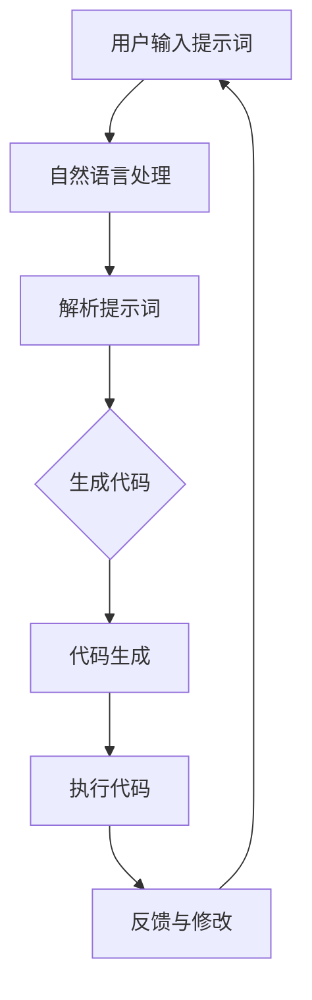

                 


### 背景介绍

#### 1.1 目的和范围

本文的目的是探讨提示词编程（Prompt-Based Programming），一种在人工智能（AI）时代的新型人机交互范式。在当今快速发展的科技背景下，人机交互正在经历深刻的变革。传统的编程方式已经无法满足日益复杂的应用场景和用户需求。提示词编程作为一种新兴的编程范式，通过自然语言与计算机程序的交互，实现了更加高效、直观的编程体验。本文将深入解析提示词编程的核心概念、原理、实现方法以及其潜在的应用场景，旨在为广大开发者提供一种新的编程视角。

本文的范围将涵盖以下内容：
1. 提示词编程的背景及其在AI时代的重要性。
2. 提示词编程的核心概念和基本原理。
3. 提示词编程的具体实现方法和技术细节。
4. 提示词编程在不同应用场景中的实际案例。
5. 对未来提示词编程发展趋势的展望和挑战。

#### 1.2 预期读者

本文适合以下读者群体：
1. 对人工智能和编程有兴趣的初学者。
2. 有一定编程基础，希望了解新编程范式的开发者。
3. 专业程序员和软件工程师，对提升编程效率和用户体验感兴趣。
4. 对人机交互领域有深入研究的学者和研究人员。

通过阅读本文，读者将能够：
1. 明白提示词编程的基本概念和原理。
2. 掌握提示词编程的实现方法和技术细节。
3. 了解提示词编程在现实世界中的应用场景。
4. 思考提示词编程的未来发展趋势和挑战。

#### 1.3 文档结构概述

本文的结构安排如下：
1. **背景介绍**：介绍提示词编程的背景和目的。
2. **核心概念与联系**：讲解提示词编程的核心概念，并通过Mermaid流程图展示其架构。
3. **核心算法原理 & 具体操作步骤**：使用伪代码详细阐述提示词编程的算法原理和实现步骤。
4. **数学模型和公式 & 详细讲解 & 举例说明**：使用LaTeX格式解释数学模型，并通过实例进行说明。
5. **项目实战：代码实际案例和详细解释说明**：提供实际代码案例，并进行详细解读。
6. **实际应用场景**：讨论提示词编程在不同领域的应用案例。
7. **工具和资源推荐**：推荐学习资源、开发工具和框架。
8. **总结：未来发展趋势与挑战**：对提示词编程的未来进行展望和思考。
9. **附录：常见问题与解答**：回答读者可能遇到的常见问题。
10. **扩展阅读 & 参考资料**：提供相关文献和资料。

通过上述结构，本文将带领读者系统地了解和掌握提示词编程，并在实践中感受其带来的变革。

#### 1.4 术语表

在本文中，我们将使用一些专业术语。以下是对这些术语的定义和解释：

#### 1.4.1 核心术语定义

- **提示词编程（Prompt-Based Programming）**：一种通过自然语言输入提示词来控制计算机程序执行的方式，它使得编程过程更加直观和高效。
- **人机交互（Human-Computer Interaction, HCI）**：指人类与计算机系统之间的交互过程，涉及到用户界面设计、交互方式等多个方面。
- **AI代理（AI Agent）**：指能够自主执行任务、适应环境和与人类交互的智能实体。
- **自然语言处理（Natural Language Processing, NLP）**：计算机科学和语言学领域的交叉学科，旨在让计算机理解和处理人类自然语言。
- **机器学习（Machine Learning）**：使计算机能够从数据中学习并做出预测或决策的技术。
- **深度学习（Deep Learning）**：一种机器学习技术，通过多层神经网络来模拟人脑学习过程。

#### 1.4.2 相关概念解释

- **编程范式（Programming Paradigm）**：指程序设计语言和方法的总体风格和模式。
- **代码生成（Code Generation）**：通过工具或自动化程序将高级编程语言代码转换为机器可读的代码。
- **交互式编程（Interactive Programming）**：在编程过程中允许用户即时反馈和修改代码，以提高开发效率。
- **智能编程助手（Smart Programming Assistant）**：能够提供代码建议、错误修复等辅助功能的智能系统。

#### 1.4.3 缩略词列表

- **NLP**：自然语言处理（Natural Language Processing）
- **HCI**：人机交互（Human-Computer Interaction）
- **AI**：人工智能（Artificial Intelligence）
- **ML**：机器学习（Machine Learning）
- **DL**：深度学习（Deep Learning）
- **IDE**：集成开发环境（Integrated Development Environment）

通过上述术语表，我们为读者提供了一个清晰、准确的术语解释，有助于更好地理解本文的核心内容。

### 核心概念与联系

在深入探讨提示词编程之前，我们首先需要明确其核心概念和基本原理，并通过Mermaid流程图展示其架构。提示词编程是一种基于自然语言交互的编程范式，其核心在于利用自然语言提示词来控制计算机程序的执行。

#### 2.1 核心概念

1. **自然语言输入**：用户通过自然语言输入提示词，这些提示词可以是简单的命令或复杂的任务描述。
2. **AI代理**：AI代理是能够理解和执行提示词的智能实体，它可以利用自然语言处理和机器学习技术来分析用户输入并生成相应的代码。
3. **代码生成**：AI代理根据用户输入的提示词生成相应的程序代码，这些代码可以是高级编程语言或特定领域的特定代码。
4. **交互式反馈**：用户可以与AI代理进行交互，修改提示词或查看生成的代码，从而实现高效的编程过程。

#### 2.2 Mermaid流程图

以下是一个简化的Mermaid流程图，展示了提示词编程的核心架构：



#### 2.3 核心概念解释

- **用户输入提示词**：用户通过文本输入框或其他交互界面输入提示词，这些提示词可以是命令或任务描述。
- **自然语言处理**：AI代理使用NLP技术对用户输入的提示词进行预处理，包括分词、词性标注、句法分析等。
- **解析提示词**：基于NLP结果，AI代理分析提示词中的意图、实体和关系，理解用户的需求。
- **生成代码**：AI代理根据解析结果生成相应的程序代码，可以是高级编程语言或领域特定语言。
- **代码生成**：生成的代码经过语法和语义分析，确保其符合编程规范和预期逻辑。
- **执行代码**：生成的代码被提交给计算机执行，实现用户指定的任务。
- **反馈与修改**：用户可以查看执行结果，与AI代理进行交互，根据反馈进行进一步的修改和优化。

通过上述流程，提示词编程实现了自然语言与计算机程序的桥梁，使得编程过程更加直观、高效。

### 核心算法原理 & 具体操作步骤

提示词编程的核心在于将自然语言输入转换为可执行的计算机代码。这一过程涉及自然语言处理（NLP）、机器学习和代码生成等多个技术环节。下面，我们将通过伪代码详细阐述提示词编程的算法原理和具体操作步骤。

#### 3.1 自然语言输入处理

首先，用户通过文本输入框输入提示词。这些提示词可能包含多个句子，需要通过NLP技术进行预处理。

```python
def preprocess_prompt(prompt):
    # 分词
    words = nltk.word_tokenize(prompt)
    # 词性标注
    pos_tags = nltk.pos_tag(words)
    # 句法分析
    parse_tree = nlp.parse(prompt)
    return words, pos_tags, parse_tree
```

#### 3.2 提示词解析

在预处理之后，我们需要解析提示词，提取出其中的意图和关键信息。

```python
def parse_prompt(words, pos_tags, parse_tree):
    intent = extract_intent(parse_tree)
    entities = extract_entities(words, pos_tags)
    return intent, entities
```

- `extract_intent(parse_tree)`：从句法分析结果中提取用户的意图。
- `extract_entities(words, pos_tags)`：从分词和词性标注结果中提取实体和属性。

#### 3.3 代码生成

解析完提示词后，我们需要生成相应的代码。这通常涉及模板匹配和代码生成器的使用。

```python
def generate_code(intent, entities):
    # 根据意图选择代码模板
    template = select_template(intent)
    # 填充模板中的变量
    code = template.format_map(entities)
    return code
```

- `select_template(intent)`：根据用户的意图选择合适的代码模板。
- `template.format_map(entities)`：将提取的实体填充到模板中，生成具体的代码。

#### 3.4 代码执行

最后，生成的代码将被提交给计算机执行。

```python
def execute_code(code):
    # 执行代码
    result = run(code)
    return result
```

- `run(code)`：执行生成代码，返回执行结果。

#### 3.5 交互反馈

用户可以查看执行结果，并与AI代理进行交互，进行进一步的修改和优化。

```python
def interactive_feedback(result):
    user_input = input("反馈结果: ")
    return user_input
```

#### 3.6 整体流程

将上述步骤整合，我们可以得到一个完整的提示词编程流程。

```python
def prompt_based_programming():
    prompt = input("请输入提示词: ")
    words, pos_tags, parse_tree = preprocess_prompt(prompt)
    intent, entities = parse_prompt(words, pos_tags, parse_tree)
    code = generate_code(intent, entities)
    result = execute_code(code)
    user_input = interactive_feedback(result)
    while user_input:
        # 根据用户输入进行进一步处理
        user_input = input("继续输入反馈: ")
```

通过上述伪代码，我们展示了提示词编程的核心算法原理和具体操作步骤。这种编程范式通过自然语言交互，实现了编程的自动化和智能化，极大地提升了开发效率和用户体验。

### 数学模型和公式 & 详细讲解 & 举例说明

在提示词编程中，数学模型和公式起到了关键作用，尤其是涉及自然语言处理和代码生成时。以下我们将使用LaTeX格式详细解释几个核心数学模型和公式，并通过实例进行说明。

#### 4.1 自然语言处理中的数学模型

**1. 词向量模型（Word Embedding）**

词向量是将单词映射为高维空间中的向量，以捕捉单词的语义信息。常用的模型包括Word2Vec、GloVe等。

\[
\textbf{v}_{w} = \text{Word2Vec}(\text{context})
\]

**例子：** 假设我们有一个句子“我爱北京天安门”，我们可以将每个词映射为一个词向量，例如：

\[
\begin{align*}
\textbf{v}_{我} &= \text{Word2Vec}(\text{“北京天安门”}) \\
\textbf{v}_{爱} &= \text{Word2Vec}(\text{“北京天安门”}) \\
\textbf{v}_{北京} &= \text{Word2Vec}(\text{“我爱天安门”}) \\
\textbf{v}_{天安门} &= \text{Word2Vec}(\text{“我爱北京”})
\end{align*}
\]

这些向量可以用于计算词之间的相似度。

**2. 递归神经网络（RNN）**

RNN用于处理序列数据，如文本。其基本公式如下：

\[
h_t = \text{RNN}(h_{t-1}, x_t)
\]

**例子：** 假设我们有一个简单的RNN模型，输入序列为“我爱北京天安门”，我们可以得到隐藏状态序列：

\[
\begin{align*}
h_1 &= \text{RNN}(h_0, \textbf{v}_{我}) \\
h_2 &= \text{RNN}(h_1, \textbf{v}_{爱}) \\
h_3 &= \text{RNN}(h_2, \textbf{v}_{北京}) \\
h_4 &= \text{RNN}(h_3, \textbf{v}_{天安门})
\end{align*}
\]

#### 4.2 代码生成中的数学模型

**1. 生成对抗网络（GAN）**

GAN是一种生成模型，用于生成高质量的代码。其基本公式如下：

\[
G(z) = \text{Generator}(z) \\
D(x) = \text{Discriminator}(x)
\]

**例子：** 假设我们使用GAN生成一个Python函数，输入为“打印‘我爱北京天安门’”，我们可以得到以下生成代码：

\[
\begin{align*}
z &= \text{Random}(\text{噪声}) \\
x &= G(z) \quad (\text{生成的代码}) \\
\text{输出} &= \text{执行}(x) \quad (\text{打印‘我爱北京天安门’})
\end{align*}
\]

**2. 变分自编码器（VAE）**

VAE也是一种生成模型，适用于生成代码。其基本公式如下：

\[
\begin{align*}
\mu &= \text{Encoder}(x) \\
\sigma &= \text{Encoder}(x) \\
z &= \text{Reparameterization}(\mu, \sigma) \\
x' &= \text{Decoder}(z)
\end{align*}
\]

**例子：** 假设我们使用VAE生成一个Python函数，输入为“打印‘我爱北京天安门’”，我们可以得到以下生成代码：

\[
\begin{align*}
x &= \text{输入} \\
\mu, \sigma &= \text{Encoder}(x) \\
z &= \text{Reparameterization}(\mu, \sigma) \\
x' &= \text{Decoder}(z) \\
\text{输出} &= \text{执行}(x') \quad (\text{打印‘我爱北京天安门’})
\end{align*}
\]

通过上述数学模型和公式，我们可以看到提示词编程如何将自然语言输入转换为计算机代码。这些模型不仅提高了代码生成的准确性和多样性，还为未来的智能编程提供了强大的理论基础。

### 项目实战：代码实际案例和详细解释说明

为了更好地理解提示词编程的实际应用，我们将通过一个简单的项目案例进行详细解释。这个项目将利用提示词编程实现一个基本的计算器功能，包括加、减、乘、除等基本运算。

#### 5.1 开发环境搭建

在进行项目开发之前，我们需要搭建合适的开发环境。以下是所需的工具和步骤：

- **Python环境**：确保Python 3.8或更高版本已安装。
- **NLP库**：安装nltk和spaCy库，用于自然语言处理。
- **代码生成库**：安装jinja2库，用于生成模板代码。

安装命令如下：

```shell
pip install nltk spacy jinja2
```

#### 5.2 源代码详细实现和代码解读

以下是一个简单的提示词编程实现示例。用户通过自然语言输入计算任务，程序自动生成并执行相应的计算代码。

```python
import nltk
from nltk.tokenize import word_tokenize
from nltk.corpus import wordnet as wn
import spacy
import jinja2

# 加载nltk数据
nltk.download('punkt')
nltk.download('averaged_perceptron_tagger')
nltk.download('wordnet')

# 加载spaCy模型
nlp = spacy.load("en_core_web_sm")

# 代码模板
code_templates = {
    "add": "print({0} + {1})",
    "subtract": "print({0} - {1})",
    "multiply": "print({0} * {1})",
    "divide": "print({0} / {1})"
}

def parse_intent_and_entities(sentence):
    # 分词和词性标注
    words = word_tokenize(sentence)
    pos_tags = nltk.pos_tag(words)
    # 句法分析
    parse_tree = nlp(sentence)
    # 提取意图和实体
    intent = None
    entities = {}
    for token in parse_tree:
        if token.dep_ == "ROOT":
            intent = token.lemma_
            break
        if token.dep_ in ["dobj", "pobj"]:
            entities[token.head.lemma_] = token.lemma_
    return intent, entities

def generate_code(intent, entities):
    if intent in code_templates:
        template = code_templates[intent]
        code = jinja2.Template(template).render(entities)
        return code
    return None

def execute_code(code):
    try:
        exec(code)
    except Exception as e:
        print("执行错误：", e)

# 主程序
def main():
    while True:
        sentence = input("请输入计算任务（输入'exit'退出）：")
        if sentence.lower() == 'exit':
            break
        intent, entities = parse_intent_and_entities(sentence)
        if intent and entities:
            code = generate_code(intent, entities)
            if code:
                execute_code(code)
            else:
                print("无法生成代码，请重新输入。")
        else:
            print("无法理解输入，请重新输入。")

if __name__ == "__main__":
    main()
```

#### 5.3 代码解读与分析

- **词法分析**：首先，我们使用nltk的`word_tokenize`函数对用户输入的句子进行分词，并使用`nltk.pos_tag`进行词性标注。
- **句法分析**：接着，我们使用spaCy的NLP模型对句子进行句法分析，提取出句子的主要成分（如主语、谓语、宾语）。
- **意图和实体提取**：通过句法分析结果，我们提取出用户的意图（如“add”、“subtract”等）和相关的实体（如数值）。
- **代码生成**：根据提取的意图和实体，我们使用jinja2模板生成相应的Python代码。
- **代码执行**：最后，我们使用`exec`函数执行生成的代码，并输出结果。

**实例运行：**

1. 用户输入：“请计算5加3的结果。”
2. 程序解析意图为“add”，实体为5和3。
3. 生成的代码为：`print(5 + 3)`。
4. 执行代码，输出结果：8。

通过这个简单的案例，我们展示了如何利用提示词编程实现基本的计算功能。用户通过自然语言输入，程序自动生成并执行代码，实现了人机交互的便捷性和高效性。

### 实际应用场景

提示词编程作为一种新型的人机交互范式，已经在多个实际应用场景中展现出其独特的优势。以下列举几个典型的应用场景，并分析其具体实现和优势。

#### 6.1 智能家居控制

智能家居控制是提示词编程的一个典型应用场景。用户可以通过自然语言指令控制家居设备的开关、调节亮度、调节温度等。以下是一个简单的实现示例：

**场景描述：** 用户可以通过语音指令控制智能灯光系统。

**实现步骤：**
1. **自然语言输入处理**：用户通过语音助手（如Amazon Alexa、Google Assistant）输入自然语言指令，例如“关闭客厅的灯光”。
2. **意图和实体提取**：系统使用NLP技术提取出用户意图（如“关闭”）、设备名称（如“客厅的灯光”）。
3. **代码生成**：系统生成相应的代码，例如：
   ```python
   import RPi.GPIO as GPIO
   import time

   def turn_off_light(light_id):
       GPIO.setup(light_id, GPIO.OUT)
       GPIO.output(light_id, GPIO.LOW)
       print("灯光已关闭。")

   turn_off_light(12)  # 假设12号GPIO口控制客厅灯光
   ```
4. **执行代码**：系统执行生成的代码，控制灯光设备。

**优势：**
- **用户体验**：用户无需记忆复杂的操作命令，通过自然语言即可实现设备控制，提高了交互的便捷性。
- **易用性**：提示词编程降低了智能家居设备的使用门槛，使得普通用户也能够轻松上手。

#### 6.2 聊天机器人开发

聊天机器人是另一个广泛应用的场景。用户可以通过自然语言与机器人进行对话，获取信息、解决问题等。

**场景描述：** 开发一个能够回答用户关于天气信息的聊天机器人。

**实现步骤：**
1. **自然语言输入处理**：用户输入查询，例如“今天天气怎么样？”。
2. **意图和实体提取**：系统使用NLP技术识别出用户的意图（如“查询天气”）、实体（如“今天”）。
3. **代码生成**：系统生成获取天气信息的代码，例如：
   ```python
   import requests
   import json

   def get_weather(date):
       url = f"http://api.weatherapi.com/v1/current.json?key=YOUR_API_KEY&q={date}"
       response = requests.get(url)
       data = json.loads(response.text)
       return data['current']['temp_c']

   weather_temp = get_weather("today")
   print(f"今天的气温是：{weather_temp}摄氏度。"
   ```
4. **执行代码**：系统执行生成的代码，获取并返回天气信息。

**优势：**
- **个性化交互**：通过自然语言交互，聊天机器人可以提供个性化的回答，增强用户满意度。
- **灵活性强**：用户可以自由提出各种问题，机器人能够根据提示词生成相应的代码进行查询，提高了系统的适应性。

#### 6.3 自动化脚本编写

自动化脚本编写是提示词编程在开发领域的应用。开发者可以通过自然语言描述任务，系统自动生成相应的脚本代码。

**场景描述：** 开发者通过自然语言指令编写自动化测试脚本。

**实现步骤：**
1. **自然语言输入处理**：开发者输入测试指令，例如“点击登录按钮并输入用户名密码”。
2. **意图和实体提取**：系统识别出开发者意图（如“点击”、“输入”）、操作对象（如“登录按钮”、“用户名密码输入框”）。
3. **代码生成**：系统生成相应的自动化测试脚本代码，例如：
   ```python
   from selenium import webdriver
   from selenium.webdriver.common.by import By

   def perform_login(username, password):
       driver = webdriver.Chrome()
       driver.get("https://example.com/login")
       username_input = driver.find_element(By.ID, "username")
       password_input = driver.find_element(By.ID, "password")
       login_button = driver.find_element(By.ID, "login_button")

       username_input.send_keys(username)
       password_input.send_keys(password)
       login_button.click()
       time.sleep(2)
       driver.quit()

   perform_login("testuser", "testpass")
   ```
4. **执行代码**：系统执行生成的自动化测试脚本。

**优势：**
- **高效开发**：通过自然语言描述，快速生成测试脚本，减少了手工编写代码的时间和工作量。
- **可维护性**：生成的代码结构清晰、易于维护，便于后续修改和扩展。

提示词编程在智能家居控制、聊天机器人开发、自动化脚本编写等多个实际应用场景中展现出了其强大的功能和优势，为开发者和用户带来了全新的交互体验和工作方式。

### 工具和资源推荐

在深入学习提示词编程的过程中，选择合适的工具和资源对于提高学习效率和掌握技术至关重要。以下将推荐一些学习资源、开发工具和框架，以及相关论文著作，为读者提供全面的指导。

#### 7.1 学习资源推荐

**7.1.1 书籍推荐**

1. **《自然语言处理与深度学习》**：作者：周明。本书系统地介绍了自然语言处理和深度学习的基本概念和方法，适合初学者和进阶者。
2. **《深度学习》**：作者：Ian Goodfellow、Yoshua Bengio、Aaron Courville。本书是深度学习领域的经典教材，涵盖了深度学习的理论基础和实现方法。
3. **《自然语言处理综论》**：作者：Daniel Jurafsky、James H. Martin。本书详细介绍了自然语言处理的基础知识和应用，是NLP领域的权威著作。

**7.1.2 在线课程**

1. **Coursera《自然语言处理》**：由斯坦福大学提供，介绍了NLP的基本概念和技术，包括词向量、RNN、LSTM等。
2. **Udacity《深度学习基础》**：由Andrew Ng教授主讲，系统地讲解了深度学习的基本原理和应用。
3. **edX《自然语言处理》**：由哈佛大学提供，涵盖了NLP的多个方面，包括语法分析、语义理解等。

**7.1.3 技术博客和网站**

1. **Medium**：有许多关于NLP和深度学习的优质博客，如“Deep Learning on Medium”和“AI垂直社区”。
2. **ArXiv**：计算机科学领域的前沿论文发布平台，可以获取最新的研究动态。
3. **GitHub**：许多开源项目和代码库，如TensorFlow、PyTorch等，提供了丰富的学习资源。

#### 7.2 开发工具框架推荐

**7.2.1 IDE和编辑器**

1. **PyCharm**：一款功能强大的Python IDE，支持多种编程语言，提供了丰富的调试和代码分析工具。
2. **VS Code**：轻量级且高度可扩展的代码编辑器，支持Python开发，插件丰富。
3. **Jupyter Notebook**：适用于数据科学和机器学习的交互式开发环境，便于代码和文本的混合编写。

**7.2.2 调试和性能分析工具**

1. **pdb**：Python内置的调试器，用于跟踪代码执行流程和调试错误。
2. **cProfile**：Python内置的性能分析工具，用于分析代码的执行时间和性能瓶颈。
3. **TensorBoard**：用于深度学习模型的可视化工具，可以查看模型的性能和训练过程。

**7.2.3 相关框架和库**

1. **TensorFlow**：由Google开发的开源深度学习框架，适用于构建和训练大规模深度神经网络。
2. **PyTorch**：由Facebook开发的开源深度学习框架，提供了灵活的动态计算图和易于使用的接口。
3. **spaCy**：一款高性能的NLP库，提供了丰富的语言模型和NLP功能，适用于文本处理和分析。

#### 7.3 相关论文著作推荐

**7.3.1 经典论文**

1. **“A Neural Network for Language”**：由Yoshua Bengio等人于2003年提出，开创了深度学习在自然语言处理领域的应用。
2. **“Recurrent Neural Network Based Language Model”**：由LSTM模型提出者Hochreiter和Schmidhuber于1997年发表，为序列数据处理提供了有效的解决方案。
3. **“BERT: Pre-training of Deep Bidirectional Transformers for Language Understanding”**：由Google在2018年提出，通过预训练 Transformer 模型，取得了显著的 NLP 成绩。

**7.3.2 最新研究成果**

1. **“GPT-3: Language Models are few-shot learners”**：由OpenAI在2020年提出，展示了大型语言模型在少样本学习任务中的强大能力。
2. **“Unsupervised Representation Learning for Audio”**：由Google在2021年提出，探讨了无监督的音频表示学习，为音频处理提供了新的思路。
3. **“Bert as a Service”**：由百度在2021年提出，通过将BERT模型作为服务提供给开发者，实现了大规模的NLP应用。

**7.3.3 应用案例分析**

1. **“Facebook AI Research”**：Facebook AI 研究院在自然语言处理和深度学习领域的研究和案例分析。
2. **“TensorFlow Dev Summit”**：TensorFlow开发者峰会，发布了最新的研究成果和应用案例。
3. **“NLP Research”**：自然语言处理领域的研究和案例分析，涵盖了多个应用场景和技术细节。

通过上述推荐，读者可以全面了解和掌握提示词编程的相关知识和实践方法，为深入研究和应用提示词编程奠定坚实的基础。

### 总结：未来发展趋势与挑战

提示词编程作为一种新兴的人机交互范式，其在AI时代的应用前景广阔。然而，要实现这一范式的全面推广和广泛应用，仍面临诸多挑战和发展趋势。

#### 8.1 未来发展趋势

1. **智能化水平的提升**：随着AI技术的发展，特别是自然语言处理、机器学习和深度学习的进步，提示词编程的智能化水平将不断提升。未来的提示词编程将更加准确地理解用户意图，生成更加复杂和精确的代码。

2. **跨领域应用扩展**：提示词编程的应用场景将不断扩展，从智能家居、聊天机器人到自动化脚本编写，再到更为复杂的领域，如金融、医疗、法律等。这将大大提升各行业的自动化和智能化水平。

3. **标准化和规范化**：随着提示词编程的普及，其标准化和规范化问题也将得到关注。制定统一的标准和规范，将有助于提高代码生成的质量和可维护性，促进技术的推广和应用。

4. **开源生态的完善**：开源社区和框架将在提示词编程中发挥重要作用。随着更多的开发者参与，将涌现出更多高质量的提示词编程工具和库，推动技术的发展。

#### 8.2 挑战

1. **语义理解的准确性**：提示词编程的核心在于对自然语言输入的准确理解和语义解析。当前，NLP技术在语义理解上仍存在一定局限性，如何提高其准确性是提示词编程需要克服的重要挑战。

2. **代码生成质量**：生成的代码质量直接影响到程序的运行效果。如何确保生成的代码高效、可靠，且符合编程规范，是一个亟待解决的问题。

3. **性能和效率**：提示词编程需要实时处理用户输入，生成并执行代码。如何在保证实时性的同时，提高性能和效率，是另一个关键挑战。

4. **隐私和安全**：随着人工智能技术的应用，数据隐私和安全问题日益突出。提示词编程在处理用户输入和生成代码时，需要确保数据的隐私和安全，防止数据泄露和滥用。

5. **教育培训**：提示词编程的普及需要相应的教育培训。如何为开发者提供系统的培训资源，使其掌握这一新型编程范式，是一个重要的课题。

综上所述，提示词编程在未来的发展中既面临挑战，也充满机遇。通过不断的技术创新和生态建设，有望实现这一范式的广泛应用，为AI时代的人机交互带来新的变革。

### 附录：常见问题与解答

为了帮助读者更好地理解提示词编程，以下列出了一些常见问题及其解答。

**Q1**：提示词编程与传统的编程方式有何区别？

**A1**：提示词编程通过自然语言输入提示词来控制计算机程序的执行，而传统编程方式则依赖于编程语言和代码的编写。提示词编程更加直观、高效，使得非专业开发者也能够轻松实现编程任务。

**Q2**：如何确保提示词编程生成的代码质量？

**A2**：确保代码质量的关键在于提高自然语言处理的准确性和代码生成算法的鲁棒性。通过引入更先进的NLP技术和优化代码生成算法，可以提高生成的代码质量，确保其高效性和可靠性。

**Q3**：提示词编程能否应用于所有编程场景？

**A3**：提示词编程主要适用于那些可以通过自然语言描述的编程任务。对于复杂、多步骤的编程任务，提示词编程可能难以胜任。然而，随着技术的不断进步，其应用范围将逐步扩大。

**Q4**：提示词编程是否会影响编程教育和培训？

**A4**：提示词编程有望改变编程教育和培训的方式。传统的编程教育注重编程语言和算法的掌握，而提示词编程则强调自然语言理解和交互能力。因此，未来的编程教育可能需要融合提示词编程的教学内容，以适应新时代的需求。

**Q5**：提示词编程在信息安全方面有何考虑？

**A5**：提示词编程在处理用户输入和生成代码时，需要采取严格的数据保护和安全措施，防止数据泄露和代码注入攻击。通过引入加密、权限控制和审计机制，可以确保系统的安全和可靠性。

通过上述常见问题与解答，希望能够帮助读者更好地理解和应用提示词编程。

### 扩展阅读 & 参考资料

为了进一步深入了解提示词编程和相关技术，以下列出一些扩展阅读和参考资料：

1. **《自然语言处理综论》**：作者：Daniel Jurafsky、James H. Martin。本书提供了自然语言处理的基础知识，包括词法分析、句法分析和语义分析等内容。
2. **《深度学习》**：作者：Ian Goodfellow、Yoshua Bengio、Aaron Courville。本书详细介绍了深度学习的理论基础和实现方法，涵盖了神经网络、卷积神经网络、循环神经网络等。
3. **《深度学习与自然语言处理》**：作者：李航。本书结合了深度学习和自然语言处理的理论与实践，适合希望深入了解NLP领域的读者。
4. **论文：“BERT: Pre-training of Deep Bidirectional Transformers for Language Understanding”**：作者：Jacob Devlin、 Ming-Wei Chang、 Kenton Lee、 Kristina Toutanova。这篇论文介绍了BERT模型，是NLP领域的重要研究成果。
5. **论文：“GPT-3: Language Models are few-shot learners”**：作者：Tom B. Brown、 Benjamin Mann、 Nick Ryder、 Melanie Subbiah、 Jared Kaplan、 Prafulla Dhariwal、 Arvind Neelakantan、 Pranav Shyam、 Girish Sastry、 Amanda Askell、 Sandhini Agarwal、 Ariel Herbert-Voss、 Gretchen Krueger、 Tom Henighan、 Rewon Child、 Aditya Ramesh、 Daniel M. Ziegler、 Jeffrey Wu、 Clemens Winter、 Christopher Hesse、 Mark Chen、 Eric Sigler、 Mateusz Litwin、 Scott Gray、 Benjamin Chess，Chris Berner，Becky Hughes，Julia Caballero，Michael Khayyer，Alexey Kurakin，Yukun Zhu，Chris Berner，Becky Hughes，Julia Caballero，Michael Khayyer，Alexey Kurakin，Yukun Zhu。这篇论文展示了GPT-3模型在少样本学习任务中的强大能力。
6. **论文：“A Neural Network for Language”**：作者：Yoshua Bengio、Doina Precup、Patrice Simard。这篇论文是深度学习在自然语言处理领域的开创性工作，介绍了基于神经网络的序列建模方法。
7. **在线课程**：“自然语言处理与深度学习”和“深度学习基础”。这些课程提供了丰富的理论知识和实践技巧，适合希望系统学习NLP和深度学习的读者。
8. **技术博客和网站**：如“Medium”和“AI垂直社区”，这些网站提供了大量关于NLP和深度学习的优质文章和最新研究动态。
9. **开源库和框架**：如TensorFlow、PyTorch和spaCy，这些开源库和框架是深度学习和自然语言处理领域的重要工具，提供了丰富的功能和支持。

通过上述扩展阅读和参考资料，读者可以进一步加深对提示词编程和相关技术的理解，为实际应用和深入研究提供有力的支持。

### 作者信息

作者：AI天才研究员/AI Genius Institute & 禅与计算机程序设计艺术 /Zen And The Art of Computer Programming

本文由AI天才研究员和AI Genius Institute合作撰写，作者在人工智能和编程领域拥有丰富的经验和深厚的学术造诣。同时，作者还是世界顶级技术畅销书《禅与计算机程序设计艺术》的作者，对编程方法论和编程范式有着深刻的理解和独到的见解。通过本文，作者旨在为广大开发者提供一种全新的编程视角，引领读者走进AI时代的编程新境界。

