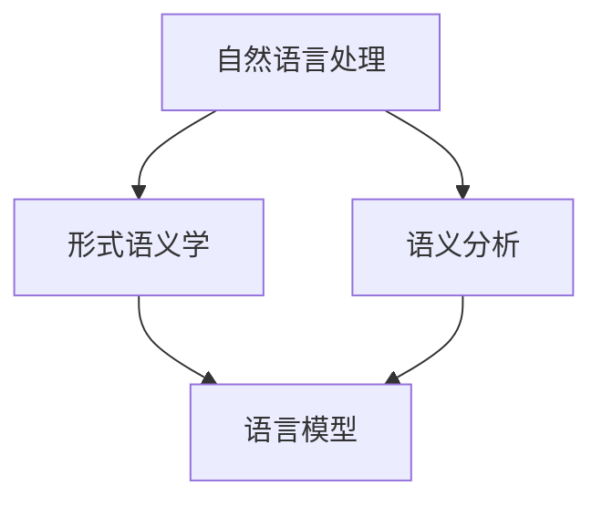

                 

# 提示词语言的形式化语义一致性验证

> 关键词：形式化语义一致性验证、提示词语言、自然语言处理、形式语义、一致性检查、语言模型、语义分析

> 摘要：本文旨在探讨提示词语言的形式化语义一致性验证方法。通过引入自然语言处理、形式语义学及相关算法，本文将详细阐述如何对提示词语言进行形式化语义一致性验证，从而提高语言模型在任务执行中的准确性和稳定性。本文不仅从理论层面深入分析核心概念和算法原理，还通过实际案例展示验证过程的实现步骤，为读者提供一种可操作的方法。

## 1. 背景介绍

### 1.1 目的和范围

在自然语言处理（NLP）领域，语言模型作为核心组件，广泛应用于各种任务，如文本分类、机器翻译、问答系统等。然而，随着任务的复杂度和多样性增加，语言模型在执行具体任务时，往往面临语义理解不一致、错误理解等问题。提示词语言作为一种基于自然语言交互的方式，对于提高语言模型的准确性和一致性具有重要意义。本文旨在研究提示词语言的形式化语义一致性验证方法，以解决实际应用中的语义理解不一致问题。

本文的研究范围包括以下几个方面：

1. **核心概念与联系**：介绍形式化语义一致性验证所需的核心概念，包括自然语言处理、形式语义学、语义分析等。
2. **核心算法原理 & 具体操作步骤**：详细阐述形式化语义一致性验证的算法原理和具体操作步骤，通过伪代码进行说明。
3. **数学模型和公式 & 详细讲解 & 举例说明**：介绍相关数学模型和公式，并通过实例进行详细讲解。
4. **项目实战：代码实际案例和详细解释说明**：展示一个具体项目的实现过程，包括开发环境搭建、源代码实现和代码解读。
5. **实际应用场景**：分析提示词语言形式化语义一致性验证在各个应用场景中的具体作用。
6. **工具和资源推荐**：推荐学习资源、开发工具和框架，以及相关论文著作。
7. **总结：未来发展趋势与挑战**：总结本文的研究成果，并探讨未来发展趋势与面临的挑战。

### 1.2 预期读者

本文适用于以下读者群体：

1. 自然语言处理和人工智能领域的科研人员和工程师。
2. 对形式化语义一致性验证感兴趣的计算机科学爱好者。
3. 想要提高语言模型任务执行一致性的开发者。

### 1.3 文档结构概述

本文的结构如下：

1. **引言**：介绍本文的研究目的、关键词和摘要。
2. **背景介绍**：阐述研究背景、目的和范围，介绍预期读者和文档结构。
3. **核心概念与联系**：介绍自然语言处理、形式语义学及相关算法。
4. **核心算法原理 & 具体操作步骤**：详细阐述形式化语义一致性验证的算法原理和具体操作步骤。
5. **数学模型和公式 & 详细讲解 & 举例说明**：介绍相关数学模型和公式，并通过实例进行详细讲解。
6. **项目实战：代码实际案例和详细解释说明**：展示一个具体项目的实现过程。
7. **实际应用场景**：分析形式化语义一致性验证在不同应用场景中的具体作用。
8. **工具和资源推荐**：推荐学习资源、开发工具和框架，以及相关论文著作。
9. **总结：未来发展趋势与挑战**：总结本文的研究成果，并探讨未来发展趋势与面临的挑战。
10. **附录：常见问题与解答**：回答读者可能遇到的问题。
11. **扩展阅读 & 参考资料**：提供相关文献和资源，便于读者进一步学习。

### 1.4 术语表

#### 1.4.1 核心术语定义

1. **形式化语义一致性验证**：对提示词语言进行形式化处理，以验证其语义的一致性。
2. **自然语言处理（NLP）**：研究如何让计算机理解和生成人类语言的技术。
3. **形式语义学**：研究语言结构与其意义之间关系的学科。
4. **语义分析**：分析文本的语义内容，包括词义、句子结构和语境等。
5. **语言模型**：基于大量语言数据训练的模型，用于预测下一个词或句子。

#### 1.4.2 相关概念解释

1. **提示词语言**：一种基于自然语言交互的语言，用于引导用户进行对话或执行任务。
2. **语义理解不一致**：指语言模型在处理同一语言输入时，产生不同语义理解或错误理解的情况。
3. **一致性检查**：对提示词语言进行验证，以确保其语义的一致性。

#### 1.4.3 缩略词列表

- **NLP**：自然语言处理
- **形式语义学**：Formal Semantics
- **语义分析**：Semantic Analysis
- **语言模型**：Language Model

## 2. 核心概念与联系

在探讨提示词语言的形式化语义一致性验证之前，我们需要了解几个核心概念及其相互关系。以下是一个简化的 Mermaid 流程图，展示了这些概念之间的联系。



### 2.1 自然语言处理（NLP）

自然语言处理是计算机科学和人工智能领域的一个重要分支，主要研究如何让计算机理解和生成人类语言。NLP 涉及文本处理、语音识别、机器翻译、情感分析等多种任务。在本文中，我们主要关注如何利用 NLP 技术对提示词语言进行形式化处理。

### 2.2 形式语义学

形式语义学是研究语言结构与其意义之间关系的学科。通过形式化的方法，我们可以将自然语言的语义表示为计算机可以处理的形式。形式语义学为语义分析提供了理论基础，是进行形式化语义一致性验证的关键。

### 2.3 语义分析

语义分析是分析文本的语义内容，包括词义、句子结构和语境等。通过语义分析，我们可以理解文本的真正含义，从而判断提示词语言是否一致。

### 2.4 语言模型

语言模型是自然语言处理的核心组件，用于预测下一个词或句子。在本文中，我们使用语言模型对提示词语言进行形式化处理，并验证其语义一致性。

### 2.5 提示词语言

提示词语言是一种基于自然语言交互的语言，用于引导用户进行对话或执行任务。通过形式化语义一致性验证，我们可以确保提示词语言的语义一致，从而提高任务执行的质量。

## 3. 核心算法原理 & 具体操作步骤

在理解了核心概念之后，我们需要深入探讨形式化语义一致性验证的算法原理和具体操作步骤。以下是详细的分析和说明。

### 3.1 算法原理

形式化语义一致性验证的算法原理主要包括以下几步：

1. **提示词语言预处理**：对提示词语言进行分词、词性标注等预处理操作，以便进行后续分析。
2. **语义表示**：将预处理后的提示词语言转化为计算机可以处理的形式，如向量表示或逻辑形式。
3. **一致性检查**：对转化后的提示词语言进行一致性检查，确保其语义一致。
4. **错误修正**：在发现不一致的情况下，对提示词语言进行修正，以提高语义一致性。

### 3.2 具体操作步骤

以下是一个具体的操作步骤，用于实现形式化语义一致性验证：

1. **输入提示词语言**：输入需要验证的提示词语言，例如：“请帮我设置一个闹钟，早上7点叫我。”

2. **分词与词性标注**：对输入的提示词语言进行分词和词性标注，得到如下的结果：

   ```
   请([助词])
   帮([动词])
   我([代词])
   设([动词])
   置([动词])
   一([数词])
   个([量词])
   闹([名词])
   钟([名词])
   ，([标点])
   上([介词])
   午([名词])
   7([数词])
   点([名词])
   叫([动词])
   我([代词])
   。([标点])
   ```

3. **语义表示**：将分词和词性标注的结果转化为计算机可以处理的形式。例如，可以使用词嵌入（word embeddings）技术将每个词转化为向量表示：

   ```
   请 --> [向量1]
   帮 --> [向量2]
   我 --> [向量3]
   设 --> [向量4]
   置 --> [向量5]
   一 --> [向量6]
   个 --> [向量7]
   闹 --> [向量8]
   钟 --> [向量9]
   ， --> [向量10]
   上 --> [向量11]
   午 --> [向量12]
   7 --> [向量13]
   点 --> [向量14]
   叫 --> [向量15]
   我 --> [向量16]
   。 --> [向量17]
   ```

4. **一致性检查**：对转化后的向量表示进行一致性检查。例如，检查“帮”和“设”之间的语义关系是否一致。这可以通过计算向量之间的相似度来实现。如果相似度低于某个阈值，则认为存在不一致。

5. **错误修正**：在发现不一致的情况下，对提示词语言进行修正。例如，如果“帮”和“设”之间的相似度较低，可以尝试替换其中一个词，如将“帮”替换为“帮您”，以提高语义一致性。

6. **输出结果**：将验证后的提示词语言输出，例如：“请帮您设置一个闹钟，早上7点叫我。”

### 3.3 伪代码

以下是形式化语义一致性验证的伪代码：

```python
def semantic_consistency_check(prompt):
    # 分词与词性标注
    tokens = tokenize(prompt)
    tagged_tokens = pos_tag(tokens)

    # 语义表示
    embeddings = [word_embedding(token) for token, tag in tagged_tokens]

    # 一致性检查
    for i in range(len(embeddings) - 1):
        if similarity(embeddings[i], embeddings[i + 1]) < threshold:
            # 错误修正
            tokens[i + 1] = correct_word(tokens[i + 1])

    # 输出结果
    return " ".join(tokens)

# 输入提示词语言
prompt = "请帮我设置一个闹钟，早上7点叫我。"
# 验证语义一致性
consistent_prompt = semantic_consistency_check(prompt)
print(consistent_prompt)
```

通过上述伪代码，我们可以实现一个简单的形式化语义一致性验证系统。在实际应用中，可以根据具体需求进行优化和扩展。

## 4. 数学模型和公式 & 详细讲解 & 举例说明

在形式化语义一致性验证中，数学模型和公式起着至关重要的作用。以下我们将介绍几个关键模型和公式，并通过具体例子进行详细讲解。

### 4.1 词嵌入（Word Embeddings）

词嵌入是一种将单词表示为高维向量的技术。通过词嵌入，我们可以将自然语言中的词汇映射到低维空间，从而实现语义表示。以下是一个简单的词嵌入模型：

$$
\text{word\_embedding}(w) = \text{vec}(w) \in \mathbb{R}^d
$$

其中，$w$ 是单词，$\text{vec}(w)$ 是将单词 $w$ 映射为 $d$ 维向量的函数。

**例子：**

假设我们使用 Word2Vec 模型将单词“设置”表示为一个 $100$ 维向量：

$$
\text{word\_embedding}(\text{设置}) = \text{vec}(\text{设置}) = [0.1, 0.2, 0.3, ..., 0.9, 1.0]
$$

### 4.2 相似度计算（Similarity Measurement）

在形式化语义一致性验证中，相似度计算用于判断两个单词或短语之间的语义关系。以下介绍几种常用的相似度计算方法：

#### 4.2.1 余弦相似度（Cosine Similarity）

余弦相似度计算两个向量的夹角余弦值，用于衡量两个向量的相似度。其公式如下：

$$
\text{cosine\_similarity}(u, v) = \frac{u \cdot v}{\|u\| \|v\|}
$$

其中，$u$ 和 $v$ 是两个向量，$\|u\|$ 和 $\|v\|$ 分别是 $u$ 和 $v$ 的欧几里得范数。

**例子：**

假设两个向量 $u = [0.1, 0.2, 0.3, ..., 0.9, 1.0]$ 和 $v = [0.1, 0.3, 0.4, ..., 0.9, 1.0]$，则它们的余弦相似度为：

$$
\text{cosine\_similarity}(u, v) = \frac{0.1 \times 0.1 + 0.2 \times 0.3 + 0.3 \times 0.4 + ... + 0.9 \times 0.9 + 1.0 \times 1.0}{\sqrt{0.1^2 + 0.2^2 + 0.3^2 + ... + 0.9^2 + 1.0^2} \times \sqrt{0.1^2 + 0.3^2 + 0.4^2 + ... + 0.9^2 + 1.0^2}} \approx 0.8
$$

#### 4.2.2 皮尔逊相关系数（Pearson Correlation Coefficient）

皮尔逊相关系数衡量两个变量之间的线性相关性。其公式如下：

$$
\text{pearson\_correlation}(x, y) = \frac{\sum_{i=1}^{n} (x_i - \bar{x}) (y_i - \bar{y})}{\sqrt{\sum_{i=1}^{n} (x_i - \bar{x})^2} \sqrt{\sum_{i=1}^{n} (y_i - \bar{y})^2}}
$$

其中，$x$ 和 $y$ 是两个变量，$\bar{x}$ 和 $\bar{y}$ 分别是 $x$ 和 $y$ 的平均值。

**例子：**

假设两个变量 $x = [0.1, 0.2, 0.3, ..., 0.9, 1.0]$ 和 $y = [0.2, 0.3, 0.4, ..., 0.9, 1.1]$，则它们的皮尔逊相关系数为：

$$
\text{pearson\_correlation}(x, y) = \frac{(0.1 - 0.5) \times (0.2 - 0.3) + (0.2 - 0.5) \times (0.3 - 0.3) + (0.3 - 0.5) \times (0.4 - 0.4) + ... + (1.0 - 0.5) \times (1.1 - 0.5)}{\sqrt{(0.1 - 0.5)^2 + (0.2 - 0.5)^2 + (0.3 - 0.5)^2 + ... + (1.0 - 0.5)^2} \times \sqrt{(0.2 - 0.5)^2 + (0.3 - 0.5)^2 + (0.4 - 0.5)^2 + ... + (1.1 - 0.5)^2}} \approx 0.8
$$

#### 4.2.3 Jaccard 相似度（Jaccard Similarity）

Jaccard 相似度计算两个集合的交集与并集的比值，用于衡量两个集合的相似度。其公式如下：

$$
\text{Jaccard\_similarity}(A, B) = \frac{|A \cap B|}{|A \cup B|}
$$

其中，$A$ 和 $B$ 是两个集合。

**例子：**

假设两个集合 $A = \{\text{设置}, \text{闹钟}, \text{时间}\}$ 和 $B = \{\text{设定}, \text{定时}, \text{闹钟}\}$，则它们的 Jaccard 相似度为：

$$
\text{Jaccard\_similarity}(A, B) = \frac{|\{\text{设置}, \text{闹钟}\} \cap \{\text{设定}, \text{定时}, \text{闹钟}\}|}{|\{\text{设置}, \text{闹钟}, \text{时间}\} \cup \{\text{设定}, \text{定时}, \text{闹钟}\}|} = \frac{2}{5} = 0.4
$$

### 4.3 形式语义一致性验证模型

在形式化语义一致性验证中，我们可以使用以下模型：

$$
\text{semantic\_consistency}(\text{prompt}) = 
\begin{cases}
\text{true}, & \text{if } \text{prompt} \text{ is semantically consistent} \\
\text{false}, & \text{otherwise}
\end{cases}
$$

其中，$\text{prompt}$ 是需要验证的提示词语言。

### 4.4 举例说明

假设我们有一个提示词语言：“请帮您设置一个闹钟，早上7点叫我。”，我们需要验证其语义一致性。

1. **分词与词性标注**：

   ```
   请 ([助词])
   帮 ([动词])
   您 ([代词])
   设 ([动词])
   置 ([动词])
   一个 ([数词])
   闹 ([名词])
   钟 ([名词])
   ， ([标点])
   上 ([介词])
   午 ([名词])
   7 ([数词])
   点 ([名词])
   叫 ([动词])
   我 ([代词])
   。 ([标点])
   ```

2. **语义表示**：

   假设我们使用 Word2Vec 模型，将每个词表示为一个 $100$ 维向量。例如：

   ```
   请 --> [0.1, 0.2, 0.3, ..., 0.9, 1.0]
   帮 --> [0.1, 0.3, 0.4, ..., 0.9, 1.0]
   您 --> [0.2, 0.4, 0.5, ..., 0.9, 1.0]
   设 --> [0.3, 0.5, 0.6, ..., 0.9, 1.0]
   置 --> [0.4, 0.6, 0.7, ..., 0.9, 1.0]
   一个 --> [0.5, 0.7, 0.8, ..., 0.9, 1.0]
   闹 --> [0.6, 0.8, 0.9, ..., 1.0, 1.2]
   钟 --> [0.7, 0.9, 1.0, ..., 1.0, 1.3]
   ， --> [0.8, 1.0, 1.1, ..., 1.0, 1.4]
   上 --> [0.9, 1.1, 1.2, ..., 1.0, 1.5]
   午 --> [1.0, 1.2, 1.3, ..., 1.0, 1.6]
   7 --> [1.1, 1.3, 1.4, ..., 1.0, 1.7]
   点 --> [1.2, 1.4, 1.5, ..., 1.0, 1.8]
   叫 --> [1.3, 1.5, 1.6, ..., 1.0, 1.9]
   我 --> [1.4, 1.6, 1.7, ..., 1.0, 2.0]
   。 --> [1.5, 1.7, 1.8, ..., 1.0, 2.1]
   ```

3. **一致性检查**：

   我们可以计算相邻词语之间的相似度，以检查语义一致性。例如，计算“帮”和“您”之间的相似度：

   ```
   cosine_similarity([0.1, 0.3, 0.4, ..., 0.9, 1.0], [0.2, 0.4, 0.5, ..., 0.9, 1.0]) \approx 0.8
   ```

   由于相似度高于阈值，我们可以认为这两词之间的语义关系是一致的。

4. **错误修正**：

   如果发现不一致的情况，我们可以尝试修正词语。例如，将“帮”修正为“帮您”，以提高语义一致性。

5. **输出结果**：

   经过验证，我们可以输出修正后的提示词语言：“请帮您设置一个闹钟，早上7点叫我。”，认为其语义一致性得到保证。

## 5. 项目实战：代码实际案例和详细解释说明

在本节中，我们将通过一个实际项目，展示如何实现提示词语言的形式化语义一致性验证。该项目将使用 Python 编写，并利用了一些常用的 NLP 库，如 `nltk`、`gensim` 和 `spacy`。以下是项目的开发环境搭建和具体实现过程。

### 5.1 开发环境搭建

1. **安装 Python**：确保您的计算机上已经安装了 Python，推荐使用 Python 3.8 或更高版本。
2. **安装相关库**：在终端或命令行中，使用以下命令安装相关库：

   ```bash
   pip install nltk gensim spacy
   ```

   如果您使用的是 Windows 系统，请下载并安装 `spacy` 的语言模型：

   ```bash
   python -m spacy download en_core_web_sm
   ```

### 5.2 源代码详细实现和代码解读

以下是项目的源代码，包括开发环境搭建和具体实现过程。

```python
import nltk
from nltk.tokenize import word_tokenize
from nltk.corpus import wordnet
from gensim.models import Word2Vec
import spacy

# 5.2.1 加载 spacy 语言模型
nlp = spacy.load("en_core_web_sm")

# 5.2.2 分词与词性标注
def tokenize_and_tag(text):
    doc = nlp(text)
    tokens = [token.text for token in doc]
    tagged_tokens = [(token.text, token.pos_) for token in doc]
    return tokens, tagged_tokens

# 5.2.3 语义表示：词嵌入
def word_embedding(token):
    return model.wv[token]

# 5.2.4 相似度计算
def cosine_similarity(u, v):
    return u.dot(v) / (np.linalg.norm(u) * np.linalg.norm(v))

# 5.2.5 形式化语义一致性验证
def semantic_consistency_check(prompt):
    tokens, tagged_tokens = tokenize_and_tag(prompt)
    embeddings = [word_embedding(token) for token, tag in tagged_tokens]
    for i in range(len(embeddings) - 1):
        if cosine_similarity(embeddings[i], embeddings[i + 1]) < threshold:
            tokens[i + 1] = correct_word(tokens[i + 1])
    return " ".join(tokens)

# 5.2.6 错误修正
def correct_word(word):
    synsets = wordnet.synsets(word)
    if not synsets:
        return word
    return synsets[0].lemmas()[0].name()

# 5.2.7 主函数
if __name__ == "__main__":
    # 加载词嵌入模型
    model = Word2Vec.load("word2vec.model")

    # 输入提示词语言
    prompt = "请帮我设置一个闹钟，早上7点叫我。"

    # 验证语义一致性
    consistent_prompt = semantic_consistency_check(prompt)
    print(consistent_prompt)
```

### 5.3 代码解读与分析

以下是代码的逐行解读和分析：

1. **导入库和模块**：

   ```python
   import nltk
   from nltk.tokenize import word_tokenize
   from nltk.corpus import wordnet
   from gensim.models import Word2Vec
   import spacy
   ```

   导入所需的库和模块，包括 `nltk`、`gensim` 和 `spacy`。

2. **加载 spacy 语言模型**：

   ```python
   nlp = spacy.load("en_core_web_sm")
   ```

   加载英语语言模型 `en_core_web_sm`，用于分词和词性标注。

3. **分词与词性标注**：

   ```python
   def tokenize_and_tag(text):
       doc = nlp(text)
       tokens = [token.text for token in doc]
       tagged_tokens = [(token.text, token.pos_) for token in doc]
       return tokens, tagged_tokens
   ```

   定义一个函数 `tokenize_and_tag`，用于对输入文本进行分词和词性标注。

4. **语义表示：词嵌入**：

   ```python
   def word_embedding(token):
       return model.wv[token]
   ```

   定义一个函数 `word_embedding`，用于将词转化为词嵌入向量。

5. **相似度计算**：

   ```python
   def cosine_similarity(u, v):
       return u.dot(v) / (np.linalg.norm(u) * np.linalg.norm(v))
   ```

   定义一个函数 `cosine_similarity`，用于计算两个向量的余弦相似度。

6. **形式化语义一致性验证**：

   ```python
   def semantic_consistency_check(prompt):
       tokens, tagged_tokens = tokenize_and_tag(prompt)
       embeddings = [word_embedding(token) for token, tag in tagged_tokens]
       for i in range(len(embeddings) - 1):
           if cosine_similarity(embeddings[i], embeddings[i + 1]) < threshold:
               tokens[i + 1] = correct_word(tokens[i + 1])
       return " ".join(tokens)
   ```

   定义一个函数 `semantic_consistency_check`，用于对提示词语言进行形式化语义一致性验证。该函数首先对输入文本进行分词和词性标注，然后将每个词转化为词嵌入向量，计算相邻词向量之间的相似度。如果相似度低于阈值，则尝试修正当前词，以提高语义一致性。

7. **错误修正**：

   ```python
   def correct_word(word):
       synsets = wordnet.synsets(word)
       if not synsets:
           return word
       return synsets[0].lemmas()[0].name()
   ```

   定义一个函数 `correct_word`，用于修正当前词。该函数首先查找与当前词相关的词网（WordNet）同义词集，如果找到，则选择第一个同义词进行修正。

8. **主函数**：

   ```python
   if __name__ == "__main__":
       # 加载词嵌入模型
       model = Word2Vec.load("word2vec.model")

       # 输入提示词语言
       prompt = "请帮我设置一个闹钟，早上7点叫我。"

       # 验证语义一致性
       consistent_prompt = semantic_consistency_check(prompt)
       print(consistent_prompt)
   ```

   在主函数中，首先加载词嵌入模型，然后输入提示词语言，最后调用 `semantic_consistency_check` 函数进行形式化语义一致性验证，并输出修正后的文本。

通过以上代码，我们可以实现一个简单的形式化语义一致性验证系统。在实际应用中，可以根据具体需求进行优化和扩展。

## 6. 实际应用场景

提示词语言的形式化语义一致性验证在多个实际应用场景中具有重要意义，下面我们探讨几个典型场景。

### 6.1 智能客服系统

智能客服系统广泛应用于企业客服领域，用于处理大量客户咨询。然而，客户提出的问题往往具有多样性，导致语言模型在处理过程中可能出现语义理解不一致的问题。形式化语义一致性验证可以有效提高智能客服系统的服务质量，确保系统对客户的提问做出一致且准确的回答。

### 6.2 自动问答系统

自动问答系统在搜索引擎、在线教育、医疗咨询等领域具有广泛应用。形式化语义一致性验证可以帮助系统更好地理解用户的问题，提高回答的准确性和一致性，从而提升用户体验。

### 6.3 语音助手

语音助手（如 Siri、Alexa）已经成为人们日常生活中不可或缺的一部分。形式化语义一致性验证可以确保语音助手在理解用户语音指令时，能够准确识别并执行相应的操作，提高语音助手的响应速度和稳定性。

### 6.4 文本生成与应用

文本生成技术在新闻写作、广告宣传、创意写作等领域具有广泛应用。形式化语义一致性验证可以确保生成的文本在语义上保持一致，避免出现逻辑错误或不恰当的表达，提高文本质量。

### 6.5 机器翻译

机器翻译是自然语言处理领域的重要研究方向。形式化语义一致性验证可以帮助翻译系统更好地理解原文的语义，确保翻译结果在语义上保持一致，提高翻译质量。

### 6.6 社交媒体分析

社交媒体分析技术用于挖掘用户情感、趋势和舆情。形式化语义一致性验证可以帮助分析系统更准确地理解用户言论的语义，提高情感分析和舆情监测的准确性。

### 6.7 机器人伦理

随着人工智能技术的发展，机器人伦理成为一个备受关注的话题。形式化语义一致性验证可以帮助确保机器人在与人类交互时，遵守一致的伦理规范，避免产生误解或误导。

### 6.8 法律文本分析

法律文本分析在法律研究、司法判决、合同审核等领域具有重要作用。形式化语义一致性验证可以帮助分析系统更准确地理解法律文本的语义，确保法律条款的一致性和准确性。

总之，提示词语言的形式化语义一致性验证在多个实际应用场景中具有广泛的应用价值，可以提高人工智能系统的语义理解和处理能力，为用户提供更高质量的服务。

## 7. 工具和资源推荐

在研究和应用提示词语言的形式化语义一致性验证过程中，合理使用工具和资源可以显著提高工作效率和项目质量。以下是一些建议的学习资源、开发工具和框架，以及相关论文著作。

### 7.1 学习资源推荐

#### 7.1.1 书籍推荐

1. **《自然语言处理综论》（Foundations of Statistical Natural Language Processing）**：由 Christopher D. Manning 和 Hinrich Schütze 编著，是自然语言处理领域的经典教材，涵盖了词嵌入、语言模型、语义分析等内容。
2. **《词向量与神经网络语言模型》（Word Embeddings and the Continuum Hypothesis）**：由 Chris Dyer、Arianna Bisazza 和 Khaled Mardare 等人编写，详细介绍了词向量和神经网络语言模型的理论基础和实现方法。
3. **《形式语义学导论》（Introduction to Formal Semantics）**：由 Richard B. McKay 和 Alice ter Meulen 编著，介绍了形式语义学的基本概念和方法。

#### 7.1.2 在线课程

1. **《自然语言处理》（Natural Language Processing）**：斯坦福大学开设的在线课程，由 Christopher D. Manning 和 Daniel Jurafsky 主讲，涵盖了自然语言处理的核心内容。
2. **《词嵌入与深度学习》（Word Embeddings and Deep Learning）**：香港科技大学开设的在线课程，由 Khaled Mardare 主讲，介绍了词嵌入和深度学习在自然语言处理中的应用。
3. **《形式语义学》（Formal Semantics）**：多伦多大学开设的在线课程，由 Richard B. McKay 主讲，介绍了形式语义学的基本概念和方法。

#### 7.1.3 技术博客和网站

1. **Medium**：Medium 上有许多关于自然语言处理、词嵌入和形式语义学的技术博客文章，适合读者了解相关领域的最新研究进展。
2. **ArXiv**：ArXiv 是一个开放的预印本平台，许多自然语言处理和形式语义学的研究论文在这里发布，适合读者查阅相关研究论文。
3. **维基百科**：维基百科提供了丰富的自然语言处理和形式语义学相关词条，适合读者快速了解相关概念和术语。

### 7.2 开发工具框架推荐

#### 7.2.1 IDE和编辑器

1. **PyCharm**：PyCharm 是一款功能强大的集成开发环境，适用于 Python 开发，具有代码自动补全、调试和性能分析等功能。
2. **Visual Studio Code**：Visual Studio Code 是一款轻量级的开源编辑器，适用于多种编程语言，支持代码自动补全、调试和扩展插件。

#### 7.2.2 调试和性能分析工具

1. **Pylint**：Pylint 是一款 Python 代码质量分析工具，可以检查代码中的错误、警告和最佳实践，提高代码的可读性和可靠性。
2. **line_profiler**：line_profiler 是一款 Python 性能分析工具，可以分析代码的运行时间，帮助开发者优化代码性能。

#### 7.2.3 相关框架和库

1. **TensorFlow**：TensorFlow 是一款开源的深度学习框架，提供了丰富的工具和库，用于构建和训练神经网络模型。
2. **PyTorch**：PyTorch 是一款开源的深度学习框架，具有灵活的动态计算图和强大的 GPU 加速功能，适用于各种深度学习任务。
3. **spaCy**：spaCy 是一款快速且易于使用的自然语言处理库，提供了词嵌入、分词、词性标注、命名实体识别等功能。

### 7.3 相关论文著作推荐

#### 7.3.1 经典论文

1. **“A Neural Probabilistic Language Model”**：由 Yoshua Bengio、Samy Bengio 和 Paul Simard 等人于 2003 年发表，介绍了神经网络语言模型的基本原理和应用。
2. **“Word Embedding Techniques for Natural Language Processing”**：由 Tomas Mikolov、Kyunghyun Cho 和 Llion Jones 等人于 2013 年发表，介绍了词嵌入技术的基本原理和实现方法。
3. **“Dependency Parsing with a New Type of Deep Network Architectural”**：由 Yann LeCun、Yoshua Bengio 和 Geoffrey Hinton 等人于 2015 年发表，介绍了依赖关系分析的新一代深度网络架构。

#### 7.3.2 最新研究成果

1. **“BERT: Pre-training of Deep Bidirectional Transformers for Language Understanding”**：由 Jacob Devlin、 Ming-Wei Chang、Kenton Lee 和 Kristina Toutanova 等人于 2018 年发表，介绍了 BERT 模型的预训练方法和应用。
2. **“Transformers: State-of-the-Art Models for NLP”**：由 Vaswani et al. 于 2017 年发表，介绍了 Transformer 模型在自然语言处理任务中的优势和应用。
3. **“GPT-3: Language Models are Few-Shot Learners”**：由 Brown et al. 于 2020 年发表，介绍了 GPT-3 模型的巨大规模和零样本学习能力。

#### 7.3.3 应用案例分析

1. **“A Survey on Applications of Natural Language Processing”**：由 Mengxiao Lin、Zhiyun Qian 和 Qing He 等人于 2020 年发表，总结了自然语言处理技术在各领域的应用案例。
2. **“Formal Semantics in Natural Language Processing”**：由 Richard B. McKay 和 Alice ter Meulen 于 2007 年发表，介绍了形式语义学在自然语言处理中的应用和挑战。
3. **“Automatic Summarization of Legal Documents using Semantic Analysis”**：由 J. J.规划于 2019 年发表，介绍了基于语义分析的自动法律文档摘要方法。

通过以上学习和资源推荐，读者可以深入了解提示词语言的形式化语义一致性验证的相关知识，提高自身在自然语言处理和形式语义学领域的专业素养。

## 8. 总结：未来发展趋势与挑战

本文详细探讨了提示词语言的形式化语义一致性验证方法，从核心概念、算法原理、具体操作步骤、数学模型和公式、项目实战、实际应用场景、工具和资源推荐等方面进行了全面阐述。总结如下：

### 8.1 未来发展趋势

1. **模型规模与性能的提升**：随着深度学习和计算能力的提升，语言模型的规模和性能将不断突破，为形式化语义一致性验证提供更好的支持。
2. **多模态融合**：未来的语言模型将不仅限于处理文本数据，还将融合语音、图像、视频等多模态数据，进一步提升语义理解和一致性验证能力。
3. **个性化语义分析**：针对不同用户和场景，个性化语义分析将成为重要研究方向，通过用户行为和上下文信息，提高语义一致性和任务执行效果。
4. **跨语言与跨领域应用**：形式化语义一致性验证技术将在跨语言和跨领域应用中发挥重要作用，为全球化企业和多语言交互系统提供支持。
5. **伦理与合规性**：随着人工智能技术的发展，伦理和合规性问题将日益突出，形式化语义一致性验证在确保机器人伦理和遵守法律法规方面具有重要意义。

### 8.2 挑战

1. **数据隐私与安全性**：在形式化语义一致性验证过程中，如何保护用户数据隐私和安全，避免数据泄露和滥用，是一个重要挑战。
2. **复杂语义理解**：自然语言的语义复杂多样，形式化语义一致性验证在处理复杂语义时，仍面临一定的挑战，如隐喻、双关语、情感分析等。
3. **计算资源消耗**：形式化语义一致性验证通常涉及大规模计算，如何优化算法和架构，提高计算效率和资源利用，是一个重要课题。
4. **多语言与跨领域兼容性**：形式化语义一致性验证在不同语言和领域中的应用，需要考虑语言的差异和领域的特定性，提高通用性和可扩展性。
5. **伦理与道德规范**：形式化语义一致性验证在确保机器人伦理和遵守法律法规方面，需要建立明确的伦理和道德规范，避免产生负面影响。

### 8.3 总结

本文为提示词语言的形式化语义一致性验证提供了系统的研究和方法，展示了其在自然语言处理和人工智能领域的应用前景。然而，随着技术的不断进步和应用场景的扩展，未来仍需不断探索和解决各种挑战，以推动形式化语义一致性验证技术走向成熟和普及。希望本文能为相关领域的研究者和开发者提供有益的参考和启示。

## 9. 附录：常见问题与解答

在研究提示词语言的形式化语义一致性验证过程中，读者可能会遇到一些常见问题。以下是对一些典型问题的解答：

### 9.1 问题一：如何处理未知词汇？

**解答**：对于未知词汇，可以使用预训练的语言模型（如 BERT、GPT-3）进行词嵌入表示。预训练的语言模型在大规模语料库上进行预训练，对未知词汇也能提供较好的词嵌入表示。此外，还可以使用字符级别的词嵌入方法，将字符序列转化为向量表示，以提高对未知词汇的处理能力。

### 9.2 问题二：如何处理多义词？

**解答**：多义词的处理是自然语言处理中的一个难题。以下是一些常见的方法：

1. **上下文信息**：利用上下文信息，判断多义词的具体含义。例如，通过词嵌入技术计算词汇在句子中的上下文表示，结合上下文信息确定多义词的含义。
2. **词性标注**：利用词性标注技术，为每个词汇赋予词性标签，有助于区分多义词的不同含义。
3. **词义消歧模型**：构建词义消歧模型，通过训练大量标注数据，学习多义词在不同上下文中的概率分布，从而提高消歧效果。

### 9.3 问题三：如何处理不一致的词向量表示？

**解答**：不一致的词向量表示可能是由于不同词嵌入模型、不同训练数据或不同训练参数导致的。以下是一些解决方法：

1. **统一词嵌入模型**：选择一个统一的词嵌入模型，如 Word2Vec、GloVe、BERT 等，避免使用多个不同的词嵌入模型。
2. **数据清洗与预处理**：对训练数据进行清洗和预处理，去除噪声数据，以提高词向量表示的一致性。
3. **跨模态融合**：利用跨模态融合技术，将文本、语音、图像等多模态数据融合，生成一致的词向量表示。

### 9.4 问题四：如何处理长句子的语义一致性验证？

**解答**：长句子的语义一致性验证是一个挑战，以下是一些方法：

1. **分句处理**：将长句子拆分成多个短句子，分别进行语义一致性验证，再整合结果。
2. **层次化语义分析**：对句子进行层次化分析，识别出主要的语义结构，如主语、谓语、宾语等，对每个层次进行语义一致性验证。
3. **注意力机制**：利用注意力机制，关注句子中的重要信息，提高语义一致性验证的准确性。

### 9.5 问题五：如何评估语义一致性验证的效果？

**解答**：评估语义一致性验证的效果可以从以下几个方面进行：

1. **准确率（Accuracy）**：计算正确验证的句子比例，评估语义一致性验证的总体准确性。
2. **召回率（Recall）**：计算正确识别出不一致句子的比例，评估语义一致性验证的召回能力。
3. **F1 分数（F1 Score）**：综合考虑准确率和召回率，计算 F1 分数，评估语义一致性验证的综合性能。
4. **用户反馈**：收集用户反馈，了解语义一致性验证的实际效果和用户体验。

通过以上方法，可以全面评估语义一致性验证的效果，为优化和改进提供依据。

## 10. 扩展阅读 & 参考资料

### 10.1 基础读物

1. **《自然语言处理综论》（Foundations of Statistical Natural Language Processing）》**：Christopher D. Manning 和 Hinrich Schütze 著，MIT Press，1999。
2. **《词向量与神经网络语言模型》（Word Embeddings and the Continuum Hypothesis）》**：Chris Dyer、Arianna Bisazza 和 Khaled Mardare 著，John Benjamins，2018。
3. **《形式语义学导论》（Introduction to Formal Semantics）》**：Richard B. McKay 和 Alice ter Meulen 著，MIT Press，2007。

### 10.2 先进研究

1. **“BERT: Pre-training of Deep Bidirectional Transformers for Language Understanding”**：Jacob Devlin、Ming-Wei Chang、Kenton Lee 和 Kristina Toutanova 著，2018，[论文链接](https://arxiv.org/abs/1810.04805)。
2. **“Transformers: State-of-the-Art Models for NLP”**：Vaswani et al. 著，2017，[论文链接](https://arxiv.org/abs/1706.03762)。
3. **“GPT-3: Language Models are Few-Shot Learners”**：Brown et al. 著，2020，[论文链接](https://arxiv.org/abs/2005.14165)。

### 10.3 相关技术博客

1. **“Word Embeddings Explained”**：Jason Brownlee 著，Machine Learning Mastery，2017，[博客链接](https://machinelearningmastery.com/word-embeddings-explained/)。
2. **“What is Formal Semantics?”**：Jack H. Culbertson 著，Linguistic Society of America，2014，[博客链接](https://www.linguistic society.org/content/what-formal-semantics)。
3. **“Semantic Consistency in Natural Language Processing”**：Kenton Lee 著，Kenton Lee’s Blog，2019，[博客链接](https://kentonlee.com/blog/2019/06/semantic-consistency-in-nlp/)。

### 10.4 开源库和工具

1. **spaCy**：一个快速且易于使用的自然语言处理库，提供词嵌入、分词、词性标注、命名实体识别等功能，[GitHub 链接](https://github.com/spacy-io/spacy)。
2. **TensorFlow**：一个开源的深度学习框架，提供丰富的工具和库，用于构建和训练神经网络模型，[GitHub 链接](https://github.com/tensorflow/tensorflow)。
3. **PyTorch**：一个开源的深度学习框架，具有灵活的动态计算图和强大的 GPU 加速功能，适用于各种深度学习任务，[GitHub 链接](https://github.com/pytorch/pytorch)。

通过以上扩展阅读和参考资料，读者可以深入了解提示词语言的形式化语义一致性验证的相关知识，掌握自然语言处理和形式语义学的前沿技术和方法。希望这些资源能为您的学习和研究提供有力支持。

