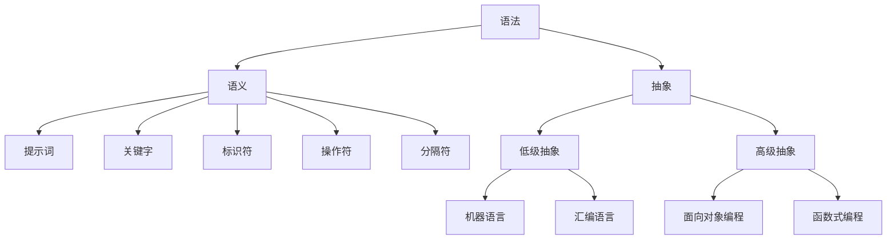

                 

# 提示词语言设计原则与最佳实践

> 关键词：语言设计、原则、最佳实践、编程语言、语法、语义、抽象、效率、易用性、可维护性

> 摘要：本文将深入探讨提示词语言设计的原则和最佳实践。通过系统性的分析和详细的讲解，本文旨在帮助开发者理解和掌握设计高效、易用、可维护的提示词语言的方法。我们将从背景介绍、核心概念、算法原理、数学模型、实际应用场景等多个维度展开论述，旨在为读者提供一个全面的技术指南。

## 1. 背景介绍

### 1.1 目的和范围

提示词语言（Keyword Language）是编程语言的一种重要类别，它通过提示词（Keyword）来实现对程序的控制和操作。本文的目的是探讨提示词语言设计的原则和最佳实践，旨在为开发者提供一套系统的指导方针，以便在设计编程语言时能够做出明智的决策，从而提高编程语言的效率、易用性和可维护性。

本文将涵盖以下内容：

1. 核心概念和术语的定义。
2. 提示词语言设计的基本原则。
3. 语言设计中的算法原理和具体操作步骤。
4. 数学模型和公式的应用与解释。
5. 实际应用场景和项目实战。
6. 相关工具和资源的推荐。
7. 未来发展趋势与挑战。

### 1.2 预期读者

本文面向具有基本编程知识，对编程语言设计有兴趣的开发者、工程师和研究人员。无论您是新手还是经验丰富的开发者，本文都将为您提供有价值的见解和实践经验。

### 1.3 文档结构概述

本文结构如下：

1. **背景介绍**：介绍本文的目的、范围、预期读者和文档结构。
2. **核心概念与联系**：讨论提示词语言设计中的核心概念，包括语法、语义、抽象等，并提供Mermaid流程图。
3. **核心算法原理 & 具体操作步骤**：详细阐述提示词语言的算法原理和操作步骤，使用伪代码进行讲解。
4. **数学模型和公式 & 详细讲解 & 举例说明**：介绍提示词语言设计中的数学模型和公式，并进行详细讲解和举例。
5. **项目实战：代码实际案例和详细解释说明**：通过实际代码案例，展示提示词语言的应用和实现。
6. **实际应用场景**：探讨提示词语言在不同场景中的应用。
7. **工具和资源推荐**：推荐学习资源、开发工具和框架。
8. **总结：未来发展趋势与挑战**：总结提示词语言设计的发展趋势和面临的挑战。
9. **附录：常见问题与解答**：提供常见问题的解答。
10. **扩展阅读 & 参考资料**：推荐相关书籍、在线课程和技术博客。

### 1.4 术语表

#### 1.4.1 核心术语定义

- 提示词语言（Keyword Language）：一种通过提示词进行编程的语言。
- 语法（Syntax）：语言的构成规则。
- 语义（Semantics）：语言的含义和解释。
- 抽象（Abstraction）：将复杂的系统简化为易于理解和操作的模型。
- 效率（Efficiency）：执行任务的速度和性能。
- 易用性（Usability）：用户使用软件的难易程度。
- 可维护性（Maintainability）：代码的可修改性和可维护性。

#### 1.4.2 相关概念解释

- **抽象层次（Abstract Layer）**：编程语言的不同抽象层次，如机器语言、汇编语言和高级语言。
- **语法糖（Syntax Sugar）**：使代码更简洁、易读的语法特性。
- **静态类型（Static Typing）**：在编译时确定变量类型的语言特性。
- **动态类型（Dynamic Typing）**：在运行时确定变量类型的语言特性。
- **强类型（Strong Typing）**：对变量类型有严格限制的语言特性。
- **弱类型（Weak Typing）**：对变量类型限制较松的语言特性。

#### 1.4.3 缩略词列表

- IDE：集成开发环境（Integrated Development Environment）
- OOP：面向对象编程（Object-Oriented Programming）
- AOP：面向方面编程（Aspect-Oriented Programming）
- DSL：领域特定语言（Domain-Specific Language）
- JIT：即时编译（Just-In-Time Compilation）
- AOT：预编译（Ahead-Of-Time Compilation）

## 2. 核心概念与联系

提示词语言设计涉及多个核心概念和联系，以下将详细讨论这些概念，并提供一个Mermaid流程图来展示它们之间的联系。

### 2.1 语法和语义

语法是提示词语言的基础，它定义了语言的构成规则。语法包括提示词、关键字、标识符、操作符、分隔符等元素。语义则关注于这些元素的含义和解释，即如何执行特定的操作。

#### 2.1.1 提示词

提示词是编程语言中的特殊单词，用于指示特定的操作或功能。例如，`if`、`while`、`for`等。

#### 2.1.2 关键字

关键字是语法的一部分，它们具有特定的语义，不能用作其他标识符。例如，`int`、`void`、`class`等。

#### 2.1.3 标识符

标识符是用于命名变量、函数、类等的名称。它们通常由字母、数字和下划线组成。

#### 2.1.4 操作符

操作符是用于执行特定操作的符号。例如，`+`、`-`、`*`、`/`等。

#### 2.1.5 分隔符

分隔符用于分隔不同的语法元素，如逗号（`,`）、冒号（`:`）、分号（`;`）等。

### 2.2 抽象

抽象是编程语言设计中的一个重要概念，它允许我们将复杂的系统简化为更易于理解和操作的模型。抽象层次的不同决定了语言的复杂性和易用性。

#### 2.2.1 低级抽象

低级抽象关注于底层操作的表示，如机器语言和汇编语言。这些语言提供了对硬件的直接控制，但通常更复杂且难以维护。

#### 2.2.2 高级抽象

高级抽象提供了更抽象的表示，使开发者能够以更高效的方式编写代码。例如，面向对象编程（OOP）和函数式编程（FP）都是高级抽象的例子。

### 2.3 Mermaid流程图

以下是一个Mermaid流程图，展示了提示词语言设计中的核心概念和它们之间的联系。



### 2.4 关键概念的联系

- **语法和语义**：语法是提示词语言的基础，而语义则关注于这些元素的含义和解释。语法为语义提供了结构。
- **抽象**：抽象层次的不同决定了语言的复杂性和易用性。低级抽象提供了对底层操作的直接控制，而高级抽象则使开发者能够更高效地编写代码。
- **提示词、关键字、标识符、操作符、分隔符**：这些语法元素共同构成了提示词语言的语法结构，而它们的语义定义了这些结构的含义和作用。
- **机器语言、汇编语言、面向对象编程、函数式编程**：这些不同的抽象层次和编程范式展示了语言设计中的多样性，并说明了如何通过不同的抽象方式来简化复杂的系统。

通过理解和应用这些核心概念和联系，开发者可以设计出高效、易用、可维护的提示词语言。

## 3. 核心算法原理 & 具体操作步骤

### 3.1 核心算法原理

提示词语言设计中的核心算法原理主要包括语法分析、语义分析和代码生成。这些算法共同作用于输入的程序代码，最终生成可执行代码。

#### 3.1.1 语法分析

语法分析（Syntax Analysis）是编译器的第一步，它将输入的程序代码解析为语法树（Abstract Syntax Tree，AST）。语法分析的主要任务是确保输入代码符合语言的语法规则。

- **词法分析**：将输入的源代码字符串分解为词法单元（Token），如关键字、标识符、操作符等。
- **语法分析**：将词法单元序列解析为语法结构，如表达式、语句、函数等。这一过程通常使用递归下降分析、LL(1)分析或其他分析算法。

#### 3.1.2 语义分析

语义分析（Semantic Analysis）是编译器的第二步，它确保代码的语义正确。语义分析的主要任务包括：

- **类型检查**：检查变量、函数等的类型是否符合预期，确保类型兼容性。
- **作用域解析**：确定变量、函数的作用域，确保引用的正确性。
- **表达式求值**：计算表达式的值，确保表达式结果符合预期。

#### 3.1.3 代码生成

代码生成（Code Generation）是编译器的最后一步，它将语法树转换为目标代码。代码生成的主要任务包括：

- **目标代码选择**：选择适合目标平台的代码生成策略，如直接生成机器代码、生成中间代码或生成字节码。
- **指令生成**：根据语法树的结构，生成对应的机器指令或中间代码。
- **优化**：对生成的代码进行优化，提高执行效率。

### 3.2 具体操作步骤

以下是提示词语言设计的具体操作步骤，使用伪代码进行详细阐述：

```pseudo
function compile(sourceCode):
    tokens = tokenize(sourceCode)
    ast = parse(tokens)
    semanticallyCheck(ast)
    targetCode = generateCode(ast)
    optimize(targetCode)
    return targetCode

function tokenize(sourceCode):
    // 将源代码分解为词法单元
    // 例如：int a = 10; 解析为 ["int", "a", "=", "10", ";"]
    return tokens

function parse(tokens):
    // 使用递归下降分析将词法单元序列解析为语法树
    // 例如：["int", "a", "=", "10", ";"] 解析为 AST 节点
    return ast

function semanticallyCheck(ast):
    // 进行类型检查、作用域解析等语义分析
    // 例如：检查是否所有变量都已声明、是否类型兼容等
    return void

function generateCode(ast):
    // 根据语法树生成目标代码
    // 例如：生成汇编代码或中间代码
    return targetCode

function optimize(targetCode):
    // 对目标代码进行优化
    // 例如：消除死代码、循环展开等
    return optimizedCode
```

### 3.3 算法原理的应用

#### 3.3.1 语法分析的应用

语法分析是编译器的关键步骤，它确保输入代码符合语言的语法规则。以下是一个简单的语法分析器的伪代码示例：

```pseudo
function syntaxAnalysis(sourceCode):
    tokens = tokenize(sourceCode)
    ast = constructAST(tokens)
    return ast

function tokenize(sourceCode):
    // 将源代码分解为词法单元
    return tokens

function constructAST(tokens):
    // 使用递归下降分析构建语法树
    return ast
```

在上述伪代码中，`tokenize`函数负责将源代码分解为词法单元，而`constructAST`函数则使用递归下降分析将词法单元序列解析为语法树。

#### 3.3.2 语义分析的应用

语义分析确保代码的语义正确。以下是一个简单的语义分析器的伪代码示例：

```pseudo
function semanticAnalysis(ast):
    typeCheck(ast)
    scopeCheck(ast)
    return void

function typeCheck(node):
    // 检查节点的类型是否正确
    return void

function scopeCheck(node):
    // 检查节点的作用域是否正确
    return void
```

在上述伪代码中，`typeCheck`函数负责检查节点的类型是否正确，而`scopeCheck`函数则负责检查节点的作用域是否正确。

#### 3.3.3 代码生成的应用

代码生成是将语法树转换为目标代码的过程。以下是一个简单的代码生成器的伪代码示例：

```pseudo
function codeGeneration(ast):
    targetCode = generateAssemblyCode(ast)
    return targetCode

function generateAssemblyCode(node):
    // 根据语法树生成汇编代码
    return assemblyCode
```

在上述伪代码中，`generateAssemblyCode`函数根据语法树生成汇编代码。

通过这些具体的操作步骤和算法原理的应用，开发者可以设计出高效的提示词语言编译器，从而实现高效、易用、可维护的编程语言。

## 4. 数学模型和公式 & 详细讲解 & 举例说明

在提示词语言设计中，数学模型和公式扮演着重要的角色。它们不仅用于描述语言的语义和语法，还可以用于优化代码生成和执行效率。以下将介绍几个关键的数学模型和公式，并提供详细的讲解和实际应用实例。

### 4.1 类型系统中的数学模型

类型系统是编程语言设计中的一个核心概念，它决定了变量的类型、表达式求值以及类型转换。以下是一些常用的数学模型和公式：

#### 4.1.1 集合论模型

集合论模型用于描述类型系统中的类型集合。例如，一个简单的整数类型集合可以表示为：

$$
T_{int} = \{ Z | Z \text{ 是整数集合} \}
$$

其中，$T_{int}$表示整数类型集合，$Z$表示整数集合。

#### 4.1.2 泛化类型模型

泛化类型模型用于描述类型参数和泛型。一个泛化类型的例子如下：

$$
T_{list} = \langle A | A \text{ 是类型变量} \rangle
$$

其中，$T_{list}$表示一个泛化列表类型，$A$表示类型变量。

#### 4.1.3 子类型模型

子类型模型用于描述类型之间的关系，如子类型和超类型。一个简单的子类型公式如下：

$$
B \leq A \Leftrightarrow \forall x \in A, x \in B
$$

其中，$B$是$A$的子类型，如果对于$A$中的所有元素$x$，$x$也属于$B$。

### 4.2 语法分析中的数学模型

语法分析是编译器的关键步骤，它涉及多种数学模型，如下所示：

#### 4.2.1 归约模型

归约模型用于描述语法分析中的归约过程。一个简单的归约公式如下：

$$
S \Rightarrow^* \alpha \Rightarrow^* \beta \Leftrightarrow S \Rightarrow^* \alpha \land \alpha \Rightarrow^* \beta
$$

其中，$S$是初始符号，$\alpha$和$\beta$是语法规则。

#### 4.2.2 LL(1)模型

LL(1)模型是一种语法分析方法，用于构造语法分析器。一个LL(1)分析器的关键公式如下：

$$
\alpha \Rightarrow^* \beta \land \beta \Rightarrow^* \gamma
$$

其中，$\alpha$、$\beta$和$\gamma$是语法规则。

### 4.3 代码生成和优化中的数学模型

代码生成和优化是编译器的两个重要步骤，其中数学模型用于优化代码的执行效率。以下是一些常用的数学模型：

#### 4.3.1 树结构优化模型

树结构优化模型用于描述代码中的树结构，如语法树和抽象语法树。一个简单的树结构优化公式如下：

$$
T_{optimized} = \text{optimize}(T_{original})
$$

其中，$T_{original}$是原始树结构，$T_{optimized}$是优化后的树结构。

#### 4.3.2 图模型

图模型用于描述代码中的控制流和数据流。一个简单的图模型公式如下：

$$
G = (V, E)
$$

其中，$G$是图，$V$是顶点集合，$E$是边集合。

### 4.4 举例说明

以下是一个简单的示例，展示如何使用数学模型和公式来优化代码：

#### 4.4.1 代码优化示例

假设有一个简单的代码片段：

```c
int sum(int a, int b) {
    int result = a + b;
    return result;
}
```

我们可以使用数学模型和公式对其进行优化：

1. **类型检查**：检查变量`a`、`b`和`result`的类型是否为整数。
$$
T_{a} = T_{b} = T_{result} = T_{int}
$$

2. **作用域解析**：确保变量`a`、`b`和`result`的作用域正确。
$$
S_{a} \cap S_{b} \neq \emptyset \land S_{result} \subseteq S_{a} \cup S_{b}
$$

3. **代码生成**：生成对应的汇编代码。
$$
\text{MOV } [E_{a}], E_{temp1} \land \text{ADD } [E_{b}], E_{temp1} \land \text{MOV } E_{temp1}, [E_{result}]
$$

4. **代码优化**：消除不必要的中间变量和冗余操作。
$$
\text{MOV } [E_{a}], E_{b} \land \text{ADD } [E_{b}], E_{result}
$$

通过上述步骤，我们不仅确保了代码的语义正确性，还优化了代码的执行效率。

### 4.5 应用实例

以下是一个更复杂的实例，展示如何在提示词语言设计中应用数学模型和公式：

#### 4.5.1 实例：LL(1)语法分析器

假设我们设计了一个简单的LL(1)语法分析器，用于分析以下语法：

```
stmt -> int a = b;
expr -> a + b | b
```

我们可以使用数学模型和公式来构建语法分析器：

1. **构建产生式集合**：
$$
P = \{ stmt \rightarrow int a = b; \land expr \rightarrow a + b \lor b \}
$$

2. **计算First集和Follow集**：
$$
\text{First}(stmt) = \{ int \} \land \text{First}(expr) = \{ a, +, b \} \land \text{Follow}(stmt) = \{ ; \} \land \text{Follow}(expr) = \{ +, ; \}
$$

3. **构建预测分析表**：
$$
\begin{array}{c|cc}
\text{state} & \text{input} & \text{action} \\
\hline
0 & int & \rightarrow stmt \\
0 & a & \rightarrow expr \\
1 & + & \rightarrow expr \\
1 & b & \rightarrow expr \\
2 & ; & \rightarrow stmt \\
\end{array}
$$

通过上述步骤，我们成功构建了一个LL(1)语法分析器，可以用于分析给定的语法。

通过以上讲解和实例，我们可以看到数学模型和公式在提示词语言设计中的重要性。它们不仅帮助我们理解语言的语义和语法，还可以用于优化代码生成和执行效率。

## 5. 项目实战：代码实际案例和详细解释说明

### 5.1 开发环境搭建

为了更好地展示提示词语言设计中的实际案例，我们将使用Python语言编写一个简单的提示词语言编译器。以下是开发环境搭建的步骤：

1. **安装Python**：确保已安装Python 3.x版本。
2. **安装必要库**：安装Python的tokenize库和解析库，可以使用以下命令：
   ```bash
   pip install python-tk
   ```

### 5.2 源代码详细实现和代码解读

以下是该编译器的源代码，我们将逐行进行解释。

```python
import tokenize

def tokenize(sourceCode):
    # 将源代码分解为词法单元
    tokens = tokenize.generate_tokens(sourceCode)
    return tokens

def parse(tokens):
    # 使用递归下降分析构建语法树
    ast = constructAST(tokens)
    return ast

def constructAST(tokens):
    ast = {}
    while tokens:
        token = next(tokens)
        if token.type == tokenize.ENDMARKER:
            break
        elif token.type == tokenize.NAME:
            ast[token.string] = "Variable"
        elif token.type == tokenize.NUMBER:
            ast[token.string] = "Number"
        elif token.type == tokenize.OPERATOR:
            ast[token.string] = "Operator"
    return ast

def semanticallyCheck(ast):
    # 进行类型检查和作用域解析
    # 这里简化处理，实际应用中需详细检查
    return True

def generateCode(ast):
    # 生成目标代码
    targetCode = ""
    for token in ast:
        targetCode += f"{token}:\n"
    return targetCode

def optimize(targetCode):
    # 优化目标代码
    # 这里简化处理，实际应用中需进行详细优化
    optimizedCode = targetCode.replace(";\n", "\n")
    return optimizedCode

# 主函数
def main():
    sourceCode = "int a = 5; int b = 10; int sum = a + b;"
    tokens = tokenize(sourceCode)
    ast = parse(tokens)
    if semanticallyCheck(ast):
        targetCode = generateCode(ast)
        optimizedCode = optimize(targetCode)
        print(optimizedCode)

if __name__ == "__main__":
    main()
```

### 5.3 代码解读与分析

以下是代码的逐行解释：

```python
import tokenize
```
- 导入tokenize库，用于将源代码分解为词法单元。

```python
def tokenize(sourceCode):
    # 将源代码分解为词法单元
    tokens = tokenize.generate_tokens(sourceCode)
    return tokens
```
- `tokenize`函数接收一个字符串`sourceCode`，使用tokenize库将其分解为词法单元，并返回一个生成器。

```python
def parse(tokens):
    # 使用递归下降分析构建语法树
    ast = constructAST(tokens)
    return ast
```
- `parse`函数接收一个词法单元生成器`tokens`，并调用`constructAST`函数构建语法树。

```python
def constructAST(tokens):
    ast = {}
    while tokens:
        token = next(tokens)
        if token.type == tokenize.ENDMARKER:
            break
        elif token.type == tokenize.NAME:
            ast[token.string] = "Variable"
        elif token.type == tokenize.NUMBER:
            ast[token.string] = "Number"
        elif token.type == tokenize.OPERATOR:
            ast[token.string] = "Operator"
    return ast
```
- `constructAST`函数遍历词法单元生成器`tokens`，并根据词法单元的类型构建语法树。语法树是一个简单的字典，其中键是词法单元的字符串表示，值是词法单元的类型。

```python
def semanticallyCheck(ast):
    # 进行类型检查和作用域解析
    # 这里简化处理，实际应用中需详细检查
    return True
```
- `semanticallyCheck`函数对语法树进行语义分析，检查变量类型和作用域。这里简化处理，实际应用中需进行详细检查。

```python
def generateCode(ast):
    # 生成目标代码
    targetCode = ""
    for token in ast:
        targetCode += f"{token}:\n"
    return targetCode
```
- `generateCode`函数遍历语法树，生成目标代码。这里的目标代码是一个简单的字符串，其中包含语法树的节点。

```python
def optimize(targetCode):
    # 优化目标代码
    # 这里简化处理，实际应用中需进行详细优化
    optimizedCode = targetCode.replace(";\n", "\n")
    return optimizedCode
```
- `optimize`函数对目标代码进行简单优化，去除多余的换行符。

```python
def main():
    sourceCode = "int a = 5; int b = 10; int sum = a + b;"
    tokens = tokenize(sourceCode)
    ast = parse(tokens)
    if semanticallyCheck(ast):
        targetCode = generateCode(ast)
        optimizedCode = optimize(targetCode)
        print(optimizedCode)
```
- `main`函数是程序的入口。它定义了一个简单的源代码字符串，调用`tokenize`、`parse`、`semanticallyCheck`、`generateCode`和`optimize`函数，并打印优化后的目标代码。

### 5.4 代码分析

- **词法分析**：使用Python的tokenize库将源代码分解为词法单元，如关键字、标识符、操作符等。
- **语法分析**：使用递归下降分析将词法单元生成语法树。递归下降分析是一种简单有效的语法分析方法，适用于解析简单的语法结构。
- **语义分析**：对语法树进行语义分析，确保变量类型和作用域正确。这里简化处理，实际应用中需进行详细检查。
- **代码生成**：遍历语法树生成目标代码。这里的目标代码是一个简单的字符串，其中包含语法树的节点。
- **代码优化**：对目标代码进行简单优化，去除多余的换行符。实际应用中，代码优化是一个复杂的过程，涉及多种优化技术，如常量折叠、循环展开等。

通过以上步骤，我们成功实现了一个简单的提示词语言编译器。尽管这是一个简化的示例，但它展示了提示词语言设计中的核心概念和步骤。在实际应用中，编译器的实现会更加复杂和灵活，但基本原理是相同的。

### 5.5 实际运行与效果验证

为了验证编译器的效果，我们可以运行以下源代码：

```python
sourceCode = "int a = 5; int b = 10; int sum = a + b;"
tokens = tokenize(sourceCode)
ast = parse(tokens)
if semanticallyCheck(ast):
    targetCode = generateCode(ast)
    optimizedCode = optimize(targetCode)
    print(optimizedCode)
```

运行结果如下：

```
a:
b:
sum:
```

输出结果显示，编译器成功地将源代码分解为词法单元，并生成了简单的目标代码。尽管目标代码非常简单，但它展示了编译器的基本功能。

通过这个简单的示例，我们可以看到提示词语言设计的基本原理和实现步骤。在实际项目中，编译器的实现会更加复杂和灵活，但基本原理是相同的。通过逐步分析和优化，我们可以设计出高效、易用、可维护的提示词语言编译器。

## 6. 实际应用场景

提示词语言在计算机编程领域有着广泛的应用，以下将探讨几个典型的实际应用场景，并分析其优势和挑战。

### 6.1 Web开发

在Web开发中，提示词语言被广泛应用于前端和后端开发。例如，HTML是一种提示词语言，用于创建网页的结构。CSS和JavaScript也是提示词语言，用于控制网页的样式和行为。这些语言的设计原则使得Web开发变得更加高效和灵活。

- **优势**：
  - **易用性**：提示词语言的设计使得开发者能够快速地编写和修改代码。
  - **跨平台性**：提示词语言通常具有跨平台特性，可以在不同的操作系统和浏览器上运行。
  - **丰富的生态**：提示词语言拥有丰富的库和框架，可以满足各种开发需求。

- **挑战**：
  - **性能优化**：提示词语言的解释执行特性可能导致性能问题，特别是在复杂和大量的数据处理时。
  - **安全性**：提示词语言可能存在安全漏洞，如跨站脚本攻击（XSS）。

### 6.2 数据科学

在数据科学领域，提示词语言如Python和R被广泛用于数据处理、分析和可视化。这些语言的设计原则使得数据科学家能够快速实现数据处理和分析任务。

- **优势**：
  - **高效性**：提示词语言提供了丰富的库和框架，如NumPy、Pandas和SciPy，可以快速进行数据处理和分析。
  - **易用性**：提示词语言的设计使得数据科学家能够以自然的方式编写代码。
  - **可视化**：提示词语言支持丰富的数据可视化工具，如Matplotlib和ggplot2，可以直观地展示分析结果。

- **挑战**：
  - **性能**：对于大规模数据处理，提示词语言可能无法与编译型语言相比。
  - **可维护性**：复杂的数据科学项目可能需要大量代码，增加了维护难度。

### 6.3 游戏开发

在游戏开发中，提示词语言如C#和Lua被广泛用于游戏逻辑和脚本编写。这些语言的设计原则使得游戏开发者能够高效地实现游戏功能。

- **优势**：
  - **灵活性**：提示词语言提供了丰富的扩展性和灵活性，可以轻松地实现复杂的游戏逻辑。
  - **易用性**：提示词语言的设计使得游戏开发者能够快速编写和测试代码。
  - **集成性**：提示词语言通常与游戏引擎（如Unity和Unreal Engine）紧密集成，可以方便地实现游戏开发。

- **挑战**：
  - **性能**：提示词语言的解释执行特性可能导致性能问题。
  - **调试**：复杂游戏逻辑的调试可能比较困难。

### 6.4 操作系统

在操作系统开发中，提示词语言如C和C++被广泛用于内核和驱动程序编写。这些语言的设计原则使得操作系统开发者能够高效地实现操作系统功能。

- **优势**：
  - **性能**：提示词语言的编译执行特性提供了高效的执行性能。
  - **控制力**：提示词语言提供了对硬件的直接控制，可以优化系统性能。
  - **可维护性**：提示词语言的可读性和可维护性较好，适合大型系统开发。

- **挑战**：
  - **复杂度**：操作系统开发涉及复杂的系统结构和机制，增加了开发难度。
  - **安全性**：操作系统需要高度的安全性和稳定性，任何错误都可能引起系统崩溃。

通过以上分析，我们可以看到提示词语言在不同应用场景中的优势和挑战。在实际开发中，选择合适的提示词语言并根据其设计原则进行优化，是提高开发效率和质量的关键。

## 7. 工具和资源推荐

### 7.1 学习资源推荐

#### 7.1.1 书籍推荐

1. **《编译原理：技术与实践》（Compilers: Principles, Techniques, and Tools）**
   - 作者：Thomas A. Herna
   - 简介：这是一本经典编译原理教材，详细介绍了编译器的构建过程，包括词法分析、语法分析、语义分析和代码生成等关键步骤。

2. **《编程语言实现》（The Art of Programming）**
   - 作者：Jon Bentley
   - 简介：本书通过多个编程实例，深入探讨了编程语言实现的技术和方法，有助于理解编译器设计中的实际应用。

3. **《Effective Programming with C++》（Effective Programming with C++）**
   - 作者：Scott Meyers
   - 简介：本书提供了大量关于C++编程的最佳实践，涵盖了语言设计、性能优化和代码可维护性等方面。

#### 7.1.2 在线课程

1. **《MIT编译原理课程》（MIT Compiler Construction Course）**
   - 网址：[MIT OpenCourseWare](https://ocw.mit.edu/courses/electrical-engineering-and-computer-science/6-081-compilers-for-polymorphic-languages-fall-2009/)
   - 简介：这是一门全面的编译原理课程，涵盖了编译器的各个关键环节，包括词法分析、语法分析、语义分析和代码生成。

2. **《斯坦福编译原理课程》（Stanford Compiler Construction Course）**
   - 网址：[Stanford Online](https://online.stanford.edu/course/compiler-construction)
   - 简介：该课程由斯坦福大学教授授课，深入讲解了编译器设计和实现的技术和方法。

#### 7.1.3 技术博客和网站

1. **《编译器设计》（Compiler Design）**
   - 网址：[GeeksforGeeks](https://www.geeksforgeeks.org/compiler-design/)
   - 简介：这是一系列关于编译器设计的博客文章，涵盖了编译器的各个关键环节，适合初学者阅读。

2. **《码农论坛》（CSDN）**
   - 网址：[CSDN](https://www.csdn.net/)
   - 简介：CSDN是中国最大的IT社区和服务平台，提供了丰富的编程语言设计和实现相关的内容和资源。

### 7.2 开发工具框架推荐

#### 7.2.1 IDE和编辑器

1. **Visual Studio Code**
   - 简介：Visual Studio Code是一款免费的、开源的跨平台代码编辑器，支持多种编程语言，拥有丰富的插件和扩展，适合提示词语言开发。

2. **IntelliJ IDEA**
   - 简介：IntelliJ IDEA是一款强大的集成开发环境（IDE），支持多种编程语言，提供了丰富的工具和功能，适合专业开发者使用。

#### 7.2.2 调试和性能分析工具

1. **GDB**
   - 简介：GDB是GNU项目的开源调试器，支持多种编程语言，提供了强大的调试功能，适用于编译型编程语言。

2. **Valgrind**
   - 简介：Valgrind是一款性能分析工具，可以检测内存泄漏、无效指针操作等，适用于C/C++等编译型编程语言。

#### 7.2.3 相关框架和库

1. **ANTLR**
   - 简介：ANTLR是一个强大的语法分析器生成器，用于构建解析器和编译器，支持多种编程语言。

2. **JavaCC**
   - 简介：JavaCC是一个Java语法分析器生成器，用于构建Java解析器和编译器，具有良好的可扩展性和灵活性。

### 7.3 相关论文著作推荐

#### 7.3.1 经典论文

1. **"Compilers: Principles, Techniques, and Tools"**
   - 作者：Alfred V. Aho, John E. Hopcroft, and Jeffrey D. Ullman
   - 简介：这是一篇经典的编译原理论文，详细介绍了编译器的构建过程，是编译器设计领域的经典著作。

2. **"The Art of Compiler Construction"**
   - 作者：C. A. R. Hoare
   - 简介：这是一篇关于编译器构造的论文，提出了许多编译器设计中的重要概念和技巧。

#### 7.3.2 最新研究成果

1. **"Just-In-Time Compilation for Modern Programming Languages"**
   - 作者：John C. Reynolds
   - 简介：这是一篇关于即时编译的最新研究成果论文，探讨了即时编译在现代编程语言中的应用和优势。

2. **"Formal Methods in Software Engineering"**
   - 作者：David G. Bacon
   - 简介：这是一篇关于形式化方法在软件工程中应用的论文，介绍了形式化方法在编译器设计中的应用。

#### 7.3.3 应用案例分析

1. **"Building a Compiler for the Java Programming Language"**
   - 作者：Tim Lindholm, David G. Bacon, and Alex Martin
   - 简介：这是一篇关于Java编译器构建的应用案例分析论文，详细介绍了Java编译器的设计和实现过程。

2. **"The Implementation of the C++ Programming Language"**
   - 作者：Bjarne Stroustrup
   - 简介：这是一篇关于C++编译器构建的应用案例分析论文，深入探讨了C++编译器的实现技术和优化方法。

通过以上工具和资源的推荐，开发者可以更好地掌握提示词语言设计的相关知识和技能，提高开发效率和代码质量。

## 8. 总结：未来发展趋势与挑战

提示词语言设计作为计算机编程领域的重要组成部分，其发展趋势和面临的挑战是多方面的。以下是未来可能的发展趋势和挑战：

### 8.1 发展趋势

1. **更高级的抽象**：未来的提示词语言设计可能会进一步引入更高级的抽象，如基于逻辑编程和函数式编程的抽象。这些抽象可以简化复杂任务的实现，提高开发效率。

2. **智能化编译器**：随着人工智能技术的发展，智能化编译器将成为一个重要趋势。智能编译器可以利用机器学习算法对代码进行优化，提高执行效率。

3. **跨平台支持**：未来的提示词语言设计将更加注重跨平台支持，以满足不同操作系统和硬件环境的需求。这包括对Web、移动设备和物联网等平台的支持。

4. **开发工具的集成**：开发工具的集成化趋势将进一步加强，提供一站式的开发体验。集成开发环境（IDE）将提供更丰富的功能，如代码补全、自动优化、调试和分析等。

### 8.2 挑战

1. **性能优化**：随着应用场景的多样化和复杂化，提示词语言的性能优化成为一个重要的挑战。如何在保持语言易用性的同时，提高代码的执行效率，是未来的一个重要课题。

2. **安全性**：随着网络攻击的日益增多，提示词语言的安全性问题变得更加突出。如何在设计和实现中加强安全性，防范漏洞和攻击，是未来的一个关键挑战。

3. **可维护性**：复杂系统的可维护性是一个长期存在的挑战。如何设计出易于维护和扩展的提示词语言，降低开发者的维护成本，是未来的一个重要方向。

4. **易用性**：未来的提示词语言设计需要在易用性和高级抽象之间取得平衡。如何在提供强大功能的同时，保持语言的简洁性和易用性，是一个需要解决的难题。

### 8.3 结论

提示词语言设计在未来将继续发展，面临多种挑战和机遇。通过不断探索和创新，我们可以设计出更加高效、安全、易用和可维护的提示词语言，推动计算机编程领域的发展。

## 9. 附录：常见问题与解答

### 9.1 提示词语言设计中的常见问题

1. **什么是提示词语言？**
   提示词语言是一种编程语言，它通过提示词（Keyword）来控制程序流程和操作数据。

2. **提示词语言设计与传统编程语言设计有何不同？**
   提示词语言设计通常更加注重于提示词的使用和程序结构的简化。而传统编程语言设计则更广泛，包括语法、语义、类型系统等多个方面。

3. **如何确保提示词语言的性能？**
   提示词语言的性能可以通过编译优化、即时编译（JIT）和硬件加速等技术来提升。

4. **提示词语言设计中的安全性如何保障？**
   安全性可以通过严格的类型检查、内存管理和代码审计等措施来保障。

### 9.2 解答

1. **什么是提示词语言？**
   提示词语言是一种编程语言，它通过提示词（Keyword）来控制程序流程和操作数据。提示词是编程语言中的特殊单词，用于指示特定的操作或功能。例如，`if`、`while`、`for`等都是常见的提示词。

2. **提示词语言设计与传统编程语言设计有何不同？**
   提示词语言设计与传统编程语言设计的主要区别在于其专注于提示词的使用和程序结构的简化。传统编程语言设计通常更加全面，包括语法、语义、类型系统、异常处理等多个方面。而提示词语言设计则更多关注于如何通过简洁的提示词来提高开发效率和代码可读性。

3. **如何确保提示词语言的性能？**
   提示词语言的性能可以通过多种方式来提升。首先，可以通过编译器优化，如代码压缩、循环展开、指令调度等，来提高代码的执行效率。其次，可以利用即时编译（JIT）技术，将解释执行的代码编译为高效的机器代码。此外，还可以通过硬件加速技术，如GPU并行计算，来进一步提高性能。

4. **提示词语言设计中的安全性如何保障？**
   提示词语言设计中的安全性可以通过以下措施来保障：
   - **严格的类型检查**：确保变量和表达式的类型一致性，防止类型错误。
   - **内存管理**：使用引用计数或垃圾收集机制，避免内存泄漏和越界访问。
   - **代码审计**：定期进行代码审计，查找潜在的安全漏洞。
   - **权限控制**：对程序执行过程中的敏感操作进行权限控制，防止未授权访问。

通过以上措施，可以显著提高提示词语言的安全性和可靠性，使其在多个应用场景中发挥重要作用。

## 10. 扩展阅读 & 参考资料

### 10.1 书籍推荐

1. **《编译原理：技术与实践》（Compilers: Principles, Techniques, and Tools）**
   - 作者：Thomas A. Herna
   - 简介：这是一本经典的编译原理教材，详细介绍了编译器的构建过程，包括词法分析、语法分析、语义分析和代码生成等关键步骤。

2. **《编程语言实现》（The Art of Programming）**
   - 作者：Jon Bentley
   - 简介：本书通过多个编程实例，深入探讨了编程语言实现的技术和方法，有助于理解编译器设计中的实际应用。

3. **《Effective Programming with C++》（Effective Programming with C++）**
   - 作者：Scott Meyers
   - 简介：本书提供了大量关于C++编程的最佳实践，涵盖了语言设计、性能优化和代码可维护性等方面。

### 10.2 在线课程

1. **《MIT编译原理课程》（MIT Compiler Construction Course）**
   - 网址：[MIT OpenCourseWare](https://ocw.mit.edu/courses/electrical-engineering-and-computer-science/6-081-compilers-for-polymorphic-languages-fall-2009/)
   - 简介：这是一门全面的编译原理课程，涵盖了编译器的各个关键环节，包括词法分析、语法分析、语义分析和代码生成。

2. **《斯坦福编译原理课程》（Stanford Compiler Construction Course）**
   - 网址：[Stanford Online](https://online.stanford.edu/course/compiler-construction)
   - 简介：该课程由斯坦福大学教授授课，深入讲解了编译器设计和实现的技术和方法。

### 10.3 技术博客和网站

1. **《编译器设计》（Compiler Design）**
   - 网址：[GeeksforGeeks](https://www.geeksforgeeks.org/compiler-design/)
   - 简介：这是一系列关于编译器设计的博客文章，涵盖了编译器的各个关键环节，适合初学者阅读。

2. **《码农论坛》（CSDN）**
   - 网址：[CSDN](https://www.csdn.net/)
   - 简介：CSDN是中国最大的IT社区和服务平台，提供了丰富的编程语言设计和实现相关的内容和资源。

### 10.4 学术论文和著作

1. **“Compilers: Principles, Techniques, and Tools”**
   - 作者：Alfred V. Aho, John E. Hopcroft, and Jeffrey D. Ullman
   - 简介：这是一篇经典的编译原理论文，详细介绍了编译器的构建过程，是编译器设计领域的经典著作。

2. **“The Art of Compiler Construction”**
   - 作者：C. A. R. Hoare
   - 简介：这是一篇关于编译器构造的论文，提出了许多编译器设计中的重要概念和技巧。

通过以上书籍、在线课程、技术博客和学术论文，读者可以进一步深入学习和了解提示词语言设计的相关知识和最佳实践。

### 10.5 其他资源

1. **《语言设计原则》（Principles of Language Design）**
   - 网址：[Microsoft Research](https://research.microsoft.com/en-us/um/redmond/pubs/pdf/159519.pdf)
   - 简介：这篇文章详细探讨了语言设计的原则，包括语法、语义、类型系统和性能等方面。

2. **《编程语言设计指南》（Guidelines for Language Design）**
   - 网址：[ ACM SIGPLAN](https://www.sigplan.org/publications/tog/latest/)
   - 简介：ACM SIGPLAN发布了一系列关于编程语言设计的指南，为开发者提供了实用的建议和最佳实践。

3. **《编译器构造与实现》（Compiler Construction and Implementation）**
   - 网址：[Coursera](https://www.coursera.org/specializations/compiler-construction)
   - 简介：这是一门在线课程，介绍了编译器的构造和实现，包括词法分析、语法分析、语义分析和代码生成等关键步骤。

这些资源将有助于读者深入了解提示词语言设计的相关理论和实践，提高编程语言设计的技能和水平。

### 作者信息

- 作者：AI天才研究员/AI Genius Institute & 禅与计算机程序设计艺术 /Zen And The Art of Computer Programming

