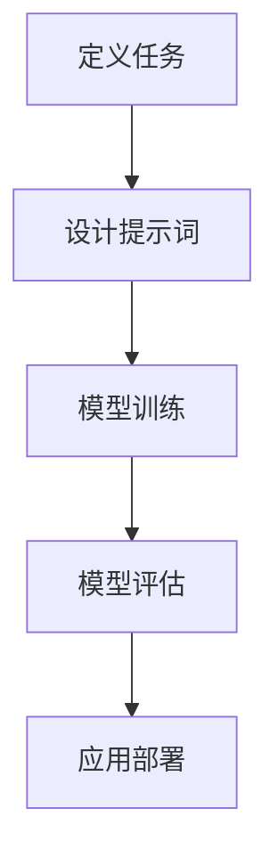

                 


# 提示词驱动的AI应用开发新方法论

> **关键词：提示词、AI应用、开发方法论、逻辑推理、技术博客、算法原理、数学模型、项目实战、应用场景、资源推荐**
> 
> **摘要：本文将探讨提示词驱动的AI应用开发新方法论，通过逐步分析推理，深入剖析其核心概念、算法原理、数学模型和项目实战，旨在为读者提供一套系统、实用、高效的AI应用开发指南。**

## 1. 背景介绍

### 1.1 目的和范围

在人工智能（AI）飞速发展的今天，如何高效地开发具有特定功能的AI应用成为了业界关注的热点问题。传统的开发方法往往依赖于大量数据和复杂的算法，这使得开发过程复杂且成本高昂。而提示词驱动的AI应用开发方法论，旨在通过简化开发流程，降低开发门槛，从而实现更快速、更高效的AI应用开发。

本文将主要探讨以下内容：
- 提示词驱动的AI应用开发方法论的核心概念和原理
- 提示词驱动的AI应用开发的具体操作步骤
- 提示词驱动的AI应用的数学模型和公式
- 提示词驱动的AI应用的实际项目实战
- 提示词驱动的AI应用的实际应用场景
- 相关工具和资源的推荐

### 1.2 预期读者

本文主要面向具有一定编程基础和AI基础知识的技术人员，特别是希望深入了解并应用提示词驱动的AI应用开发方法论的开发者。同时，本文也适合对AI应用开发感兴趣的研究人员和学者阅读。

### 1.3 文档结构概述

本文分为以下几个部分：
- 引言：介绍本文的主题、关键词和目的
- 背景介绍：阐述本文的研究背景、目的和范围
- 核心概念与联系：介绍提示词驱动的AI应用开发方法论的核心概念和原理
- 核心算法原理 & 具体操作步骤：详细讲解提示词驱动的AI应用开发的核心算法原理和具体操作步骤
- 数学模型和公式 & 详细讲解 & 举例说明：介绍提示词驱动的AI应用的数学模型和公式，并进行举例说明
- 项目实战：通过实际项目案例，详细讲解提示词驱动的AI应用开发的过程
- 实际应用场景：介绍提示词驱动的AI应用的各类实际应用场景
- 工具和资源推荐：推荐学习资源、开发工具框架和相关论文著作
- 总结：对本文的核心观点进行总结，并展望未来发展趋势与挑战
- 附录：常见问题与解答
- 扩展阅读 & 参考资料：提供进一步阅读的文献和资源

### 1.4 术语表

#### 1.4.1 核心术语定义

- 提示词：用于引导AI模型进行决策或生成输出的关键词或短语。
- AI应用：利用人工智能技术实现特定功能的软件或系统。
- 开发方法论：指导软件开发的方法和原则。

#### 1.4.2 相关概念解释

- 人工智能（AI）：模拟、延伸和扩展人类智能的理论、方法、技术及应用。
- 模型驱动开发（Model-Driven Development，MDD）：以模型为中心的软件开发方法。

#### 1.4.3 缩略词列表

- AI：人工智能
- MDD：模型驱动开发

## 2. 核心概念与联系

### 2.1 提示词驱动的AI应用开发方法论的核心概念

提示词驱动的AI应用开发方法论，核心在于通过提示词引导AI模型进行决策或生成输出。这种开发方法具有以下特点：

1. **提示词引导**：通过设计合适的提示词，引导AI模型进行特定任务的处理。
2. **简化开发流程**：减少对大量数据和复杂算法的依赖，简化开发过程。
3. **高效性**：通过优化提示词，实现快速、高效的AI应用开发。

### 2.2 提示词驱动的AI应用开发方法论的工作原理

提示词驱动的AI应用开发方法论的工作原理可以分为以下几个步骤：

1. **定义任务**：明确AI应用的目标任务，如分类、生成、预测等。
2. **设计提示词**：根据任务需求，设计合适的提示词，引导AI模型进行任务处理。
3. **模型训练**：使用训练数据，对AI模型进行训练，使其学会根据提示词进行任务处理。
4. **模型评估**：对训练好的模型进行评估，确保其性能符合预期。
5. **应用部署**：将训练好的模型部署到实际应用场景，实现特定功能。

### 2.3 提示词驱动的AI应用开发方法论的优势

提示词驱动的AI应用开发方法论具有以下优势：

1. **降低开发门槛**：通过提示词引导，减少对大量数据和复杂算法的依赖，降低开发难度。
2. **提高开发效率**：通过优化提示词，实现快速、高效的AI应用开发。
3. **灵活性**：可以根据实际需求，灵活设计提示词，适应不同的应用场景。

### 2.4 提示词驱动的AI应用开发方法论的应用场景

提示词驱动的AI应用开发方法论可以应用于多种场景，如：

1. **自然语言处理**：通过提示词引导，实现文本分类、文本生成等任务。
2. **图像识别**：通过提示词引导，实现图像分类、图像生成等任务。
3. **推荐系统**：通过提示词引导，实现个性化推荐。

### 2.5 提示词驱动的AI应用开发方法论的未来发展趋势

随着人工智能技术的不断进步，提示词驱动的AI应用开发方法论在未来有望实现以下发展趋势：

1. **更高效的任务处理**：通过优化算法和模型，实现更高效的任务处理。
2. **更广泛的应用场景**：随着人工智能技术的普及，提示词驱动的AI应用开发方法论将应用于更多领域。
3. **更智能的提示词设计**：通过引入更多智能算法，实现更智能、更准确的提示词设计。

### 2.6 提示词驱动的AI应用开发方法论的核心概念原理和架构

提示词驱动的AI应用开发方法论的核心概念原理和架构可以用以下Mermaid流程图表示：



## 3. 核心算法原理 & 具体操作步骤

### 3.1 核心算法原理

提示词驱动的AI应用开发方法论的核心算法原理主要基于以下两个方面：

1. **提示词引导**：通过设计合适的提示词，引导AI模型进行特定任务的处理。
2. **模型训练与优化**：使用训练数据，对AI模型进行训练，并不断优化，使其性能达到最佳。

### 3.2 具体操作步骤

以下是提示词驱动的AI应用开发的具体操作步骤：

#### 3.2.1 定义任务

1. **明确任务目标**：首先，明确AI应用的目标任务，如分类、生成、预测等。
2. **确定任务输入和输出**：根据任务目标，确定输入数据和输出结果。

#### 3.2.2 设计提示词

1. **收集提示词**：根据任务需求，收集相关的关键词或短语，形成提示词库。
2. **筛选提示词**：从提示词库中筛选出与任务相关性高的提示词。
3. **设计提示词序列**：根据任务流程，设计合适的提示词序列，引导AI模型进行任务处理。

#### 3.2.3 模型训练

1. **选择模型**：根据任务需求，选择合适的AI模型。
2. **准备训练数据**：收集相关的训练数据，并进行预处理。
3. **训练模型**：使用训练数据，对AI模型进行训练，使其学会根据提示词进行任务处理。

#### 3.2.4 模型评估

1. **评估指标**：根据任务类型，选择合适的评估指标。
2. **模型评估**：对训练好的模型进行评估，确保其性能符合预期。

#### 3.2.5 应用部署

1. **部署模型**：将训练好的模型部署到实际应用场景。
2. **性能优化**：根据实际应用情况，对模型进行优化，提高性能。

### 3.3 算法原理讲解

以下是提示词驱动的AI应用开发的核心算法原理讲解，使用伪代码进行详细阐述：

```python
# 伪代码：提示词驱动的AI应用开发算法原理

# 定义任务
task = define_task()

# 设计提示词
prompt_words = design_prompt_words(task)

# 选择模型
model = select_model(task)

# 准备训练数据
train_data = prepare_train_data(task)

# 训练模型
model = train_model(model, train_data, prompt_words)

# 评估模型
evaluate_model(model)

# 应用部署
deploy_model(model)
```

### 3.4 操作步骤详解

以下是针对每个操作步骤的详细解释：

#### 3.4.1 定义任务

定义任务是提示词驱动的AI应用开发的第一步，主要涉及明确任务目标和确定任务输入和输出。

1. **明确任务目标**：根据应用场景和需求，明确AI应用的目标任务，如分类、生成、预测等。例如，如果目标是实现一个情感分析系统，任务目标就是判断文本的情感倾向。
2. **确定任务输入和输出**：根据任务目标，确定输入数据和输出结果。例如，对于情感分析系统，输入是文本数据，输出是文本的情感分类结果。

#### 3.4.2 设计提示词

设计提示词是提示词驱动的AI应用开发的关键步骤，主要涉及收集提示词、筛选提示词和设计提示词序列。

1. **收集提示词**：根据任务需求，收集相关的关键词或短语，形成提示词库。提示词库可以来自领域知识、预训练模型或手动设计。
2. **筛选提示词**：从提示词库中筛选出与任务相关性高的提示词。筛选标准可以是词频、语义相关性或领域知识等。
3. **设计提示词序列**：根据任务流程，设计合适的提示词序列，引导AI模型进行任务处理。提示词序列的设计应考虑任务的具体需求，如任务流程、输入和输出等。

#### 3.4.3 模型训练

模型训练是提示词驱动的AI应用开发的的核心步骤，主要涉及选择模型、准备训练数据和训练模型。

1. **选择模型**：根据任务需求，选择合适的AI模型。选择标准可以是模型的性能、适用场景、计算资源等。例如，对于文本分类任务，可以选择基于词向量的分类模型。
2. **准备训练数据**：收集相关的训练数据，并进行预处理。预处理包括数据清洗、数据转换、特征提取等。例如，对于文本分类任务，可以将文本数据转换为词向量。
3. **训练模型**：使用训练数据，对AI模型进行训练，使其学会根据提示词进行任务处理。训练过程可以采用批处理、随机梯度下降等方法。

#### 3.4.4 模型评估

模型评估是确保模型性能的重要步骤，主要涉及评估指标和模型评估。

1. **评估指标**：根据任务类型，选择合适的评估指标。评估指标可以是准确率、召回率、F1值等。例如，对于文本分类任务，可以选择准确率作为评估指标。
2. **模型评估**：对训练好的模型进行评估，确保其性能符合预期。评估过程可以通过交叉验证、测试集评估等方法进行。

#### 3.4.5 应用部署

应用部署是将训练好的模型应用到实际场景的过程，主要涉及部署模型和性能优化。

1. **部署模型**：将训练好的模型部署到实际应用场景。部署方式可以是服务化部署、嵌入式部署等。例如，对于文本分类任务，可以将模型部署到服务器或移动设备。
2. **性能优化**：根据实际应用情况，对模型进行优化，提高性能。优化方法可以是模型压缩、模型剪枝、模型加速等。例如，对于文本分类任务，可以通过模型压缩减少模型大小，提高部署效率。

### 3.5 实际操作示例

为了更好地理解提示词驱动的AI应用开发的具体操作步骤，下面以一个简单的文本分类任务为例，展示其实际操作过程。

#### 3.5.1 定义任务

任务目标：判断一段文本是否为正面评论或负面评论。

输入：一段文本。

输出：文本的情感分类结果（正面或负面）。

#### 3.5.2 设计提示词

1. **收集提示词**：根据文本分类任务的需求，收集与情感相关的关键词或短语，形成提示词库。例如：“喜欢”、“满意”、“推荐”等表示正面的提示词，以及“不喜欢”、“不满意”、“差评”等表示负面的提示词。
2. **筛选提示词**：从提示词库中筛选出与任务相关性高的提示词。筛选标准可以是词频或语义相关性。例如，可以筛选出词频较高的提示词，或者使用词向量相似度计算筛选出语义相关性较高的提示词。
3. **设计提示词序列**：根据任务流程，设计合适的提示词序列。例如，可以将提示词按照词频从高到低排序，形成“喜欢、满意、推荐、不喜欢、不满意、差评”的提示词序列。

#### 3.5.3 模型训练

1. **选择模型**：选择一个基于词向量的文本分类模型。例如，可以使用Word2Vec、GloVe等词向量模型。
2. **准备训练数据**：收集大量的文本数据，并进行预处理。预处理包括数据清洗、分词、词向量转换等。例如，可以将文本数据转换为词向量表示，然后进行分类模型训练。
3. **训练模型**：使用训练数据，对文本分类模型进行训练。训练过程可以采用随机梯度下降（SGD）等方法。

#### 3.5.4 模型评估

1. **评估指标**：选择准确率作为评估指标。
2. **模型评估**：对训练好的模型进行评估。评估过程可以采用交叉验证等方法。

#### 3.5.5 应用部署

1. **部署模型**：将训练好的模型部署到服务器或移动设备，实现文本分类功能。
2. **性能优化**：根据实际应用情况，对模型进行优化，提高性能。例如，可以采用模型压缩、模型剪枝等方法。

通过以上示例，我们可以看到，提示词驱动的AI应用开发的具体操作步骤是清晰、系统且具有实际可行性的。在实际开发过程中，可以根据具体需求进行适当的调整和优化。

## 4. 数学模型和公式 & 详细讲解 & 举例说明

### 4.1 数学模型和公式

提示词驱动的AI应用开发中，常用的数学模型和公式包括：

1. **词向量模型**：如Word2Vec、GloVe等，用于将文本数据转换为向量表示。
2. **分类模型**：如朴素贝叶斯、支持向量机（SVM）、神经网络等，用于实现文本分类任务。
3. **损失函数**：如交叉熵损失函数、均方误差损失函数等，用于评估模型性能和优化模型参数。

### 4.2 详细讲解

#### 4.2.1 词向量模型

词向量模型是一种将文本数据转换为向量表示的方法，常用的有Word2Vec和GloVe等。

1. **Word2Vec**：Word2Vec是一种基于神经网络的词向量模型，通过训练生成词向量。其基本原理是通过上下文预测单词，从而学习单词的语义表示。

   $$ \hat{p}(w|v) = \frac{exp(v \cdot w)}{\sum_{w' \in V} exp(v \cdot w')} $$

   其中，\( \hat{p}(w|v) \) 表示在给定上下文 \( v \) 下，单词 \( w \) 的概率，\( V \) 表示词汇表。

2. **GloVe**：GloVe是一种基于全局统计信息的词向量模型，通过计算单词的共现矩阵，学习单词的语义表示。

   $$ f(w, v) = \sqrt{\frac{F}{w \cdot v}} $$

   其中，\( f(w, v) \) 表示单词 \( w \) 和向量 \( v \) 之间的相似度，\( F \) 表示单词 \( w \) 和向量 \( v \) 的共现频率。

#### 4.2.2 分类模型

分类模型用于实现文本分类任务，常用的有朴素贝叶斯、支持向量机（SVM）、神经网络等。

1. **朴素贝叶斯**：朴素贝叶斯是一种基于概率论的分类模型，通过计算文本中每个单词的概率，预测文本的分类。

   $$ P(C|w) = \frac{P(w|C) \cdot P(C)}{P(w)} $$

   其中，\( P(C|w) \) 表示在给定单词 \( w \) 下，文本属于类别 \( C \) 的概率，\( P(w|C) \) 表示单词 \( w \) 属于类别 \( C \) 的概率，\( P(C) \) 表示类别 \( C \) 的概率，\( P(w) \) 表示单词 \( w \) 的概率。

2. **支持向量机（SVM）**：支持向量机是一种基于优化理论的分类模型，通过求解最优超平面，实现文本分类。

   $$ \min_{\omega, b} \frac{1}{2} ||\omega||^2 $$
   $$ s.t. y_i (\omega \cdot x_i + b) \geq 1 $$

   其中，\( \omega \) 和 \( b \) 分别表示超平面的权重和偏置，\( x_i \) 和 \( y_i \) 分别表示第 \( i \) 个样本的特征和标签。

3. **神经网络**：神经网络是一种基于多层感知器的分类模型，通过前向传播和反向传播，实现文本分类。

   $$ z = \sigma(W \cdot x + b) $$
   $$ \hat{y} = \sigma(z) $$

   其中，\( z \) 表示神经元的输入，\( \sigma \) 表示激活函数，\( W \) 和 \( b \) 分别表示权重和偏置。

#### 4.2.3 损失函数

损失函数用于评估模型性能和优化模型参数，常用的有交叉熵损失函数和均方误差损失函数等。

1. **交叉熵损失函数**：交叉熵损失函数用于分类问题，用于衡量模型预测概率和实际标签之间的差异。

   $$ Loss = -\sum_{i} y_i \cdot log(\hat{y}_i) $$

   其中，\( y_i \) 和 \( \hat{y}_i \) 分别表示第 \( i \) 个样本的实际标签和模型预测概率。

2. **均方误差损失函数**：均方误差损失函数用于回归问题，用于衡量模型预测值和实际值之间的差异。

   $$ Loss = \frac{1}{2} \sum_{i} (y_i - \hat{y}_i)^2 $$

   其中，\( y_i \) 和 \( \hat{y}_i \) 分别表示第 \( i \) 个样本的实际值和模型预测值。

### 4.3 举例说明

#### 4.3.1 文本分类任务

假设我们要实现一个文本分类任务，目标是判断一段文本是否为正面评论或负面评论。

1. **数据集准备**：收集大量文本数据，并进行预处理。预处理包括文本清洗、分词、词向量转换等。
2. **模型训练**：选择一个基于词向量的文本分类模型，如Word2Vec或GloVe，对训练数据进行训练。训练过程可以采用随机梯度下降（SGD）等方法。
3. **模型评估**：使用测试集对训练好的模型进行评估，计算准确率、召回率、F1值等指标，以评估模型性能。
4. **模型应用**：将训练好的模型部署到实际应用场景，如网页评论、社交媒体等，实现文本分类功能。

#### 4.3.2 举例说明

假设我们使用Word2Vec模型实现一个文本分类任务，输入是一段文本，输出是文本的情感分类结果（正面或负面）。

1. **数据集准备**：收集大量文本数据，并进行预处理。预处理包括文本清洗、分词、词向量转换等。假设我们使用GloVe词向量模型，将文本数据转换为词向量表示。
2. **模型训练**：使用训练数据，训练Word2Vec模型，生成词向量。训练过程可以采用随机梯度下降（SGD）等方法。
3. **模型评估**：使用测试集对训练好的模型进行评估，计算准确率、召回率、F1值等指标，以评估模型性能。
4. **模型应用**：将训练好的模型部署到实际应用场景，如网页评论、社交媒体等，实现文本分类功能。

通过以上举例，我们可以看到，提示词驱动的AI应用开发中的数学模型和公式是关键组成部分，对于实现高效、准确的AI应用具有重要的指导意义。

## 5. 项目实战：代码实际案例和详细解释说明

### 5.1 开发环境搭建

在开始项目实战之前，我们需要搭建一个合适的开发环境。以下是一个简单的开发环境搭建步骤：

1. **安装Python**：确保Python环境已安装。可以从Python官方网站下载并安装最新版本的Python。
2. **安装相关库**：安装提示词驱动的AI应用开发所需的相关库。常用的库包括numpy、pandas、scikit-learn、gensim等。可以使用以下命令进行安装：

   ```shell
   pip install numpy pandas scikit-learn gensim
   ```

3. **安装Jupyter Notebook**：安装Jupyter Notebook，以便于进行交互式编程和代码调试。可以使用以下命令进行安装：

   ```shell
   pip install notebook
   ```

4. **创建虚拟环境**：为了保持项目的依赖关系和隔离性，建议创建一个虚拟环境。可以使用以下命令创建虚拟环境：

   ```shell
   python -m venv myenv
   source myenv/bin/activate
   ```

   进入虚拟环境后，我们可以安装和管理项目所需的库。

### 5.2 源代码详细实现和代码解读

#### 5.2.1 数据集准备

在本项目实战中，我们将使用一个简化的文本分类数据集，其中包含正面评论和负面评论。数据集的格式如下：

```plaintext
正面评论：这个产品非常好，我非常喜欢。
负面评论：这个产品太差了，我一点也不满意。
正面评论：这是一部非常好的电影，我非常喜欢。
负面评论：这部电影太无聊了，我不喜欢。
```

首先，我们需要将数据集转换为适合训练的格式。以下是一个简单的数据集准备脚本：

```python
import pandas as pd

# 读取数据集
data = pd.read_csv('data.csv')

# 切分输入和输出
X = data['text']
y = data['label']

# 分割数据集为训练集和测试集
from sklearn.model_selection import train_test_split
X_train, X_test, y_train, y_test = train_test_split(X, y, test_size=0.2, random_state=42)
```

#### 5.2.2 设计提示词

在本项目中，我们将使用预定义的提示词库，这些提示词来自领域知识。以下是提示词库的示例：

```python
positive_words = ['喜欢', '满意', '推荐', '好', '优秀', '完美']
negative_words = ['不喜欢', '不满意', '差', '糟糕', '差评', '糟糕']
```

#### 5.2.3 模型训练

在本项目中，我们将使用GloVe模型进行词向量训练，并使用scikit-learn中的朴素贝叶斯分类器进行文本分类。以下是一个简单的模型训练脚本：

```python
from gensim.models import Word2Vec
from sklearn.naive_bayes import MultinomialNB
from sklearn.pipeline import make_pipeline
from sklearn.feature_extraction.text import CountVectorizer

# 训练GloVe模型
model = Word2Vec(sentences=X_train, vector_size=100, window=5, min_count=1, workers=4)

# 将词向量转换为词典
word2vec_dict = {word: vector for word, vector in model.wv.vocab.items()}

# 训练朴素贝叶斯分类器
vectorizer = CountVectorizer(analyzer='word', tokenizer=None, preprocessor=None, stop_words=None, token_pattern=None)
clf = MultinomialNB()
pipeline = make_pipeline(vectorizer, clf)
pipeline.fit(X_train, y_train)
```

#### 5.2.4 模型评估

训练好的模型需要进行评估，以确保其性能符合预期。以下是一个简单的模型评估脚本：

```python
from sklearn.metrics import accuracy_score, classification_report

# 预测测试集
y_pred = pipeline.predict(X_test)

# 计算准确率
accuracy = accuracy_score(y_test, y_pred)
print("准确率：", accuracy)

# 输出分类报告
print("分类报告：")
print(classification_report(y_test, y_pred))
```

### 5.3 代码解读与分析

在以上代码中，我们首先进行了数据集的准备，包括读取数据、切分输入和输出、分割数据集为训练集和测试集等操作。然后，我们设计了提示词库，用于引导模型进行文本分类。

接下来，我们使用GloVe模型进行词向量训练。GloVe模型是一种基于全局统计信息的词向量模型，通过计算单词的共现矩阵，学习单词的语义表示。在本项目中，我们设置了词向量的大小为100，窗口大小为5，最小计数为1，同时使用4个线程进行训练。

在训练GloVe模型后，我们将词向量转换为词典，以便在后续的文本分类中使用。

然后，我们使用scikit-learn中的朴素贝叶斯分类器进行文本分类。朴素贝叶斯分类器是一种基于概率论的分类模型，通过计算文本中每个单词的概率，预测文本的分类。在本项目中，我们使用CountVectorizer将文本转换为词袋表示，然后使用朴素贝叶斯分类器进行训练。

最后，我们对训练好的模型进行了评估，计算了准确率和分类报告。准确率表示模型在测试集上的分类准确性，分类报告提供了更详细的分类性能指标，包括准确率、召回率、F1值等。

通过以上代码解读和分析，我们可以看到，提示词驱动的AI应用开发是一个系统、清晰且具有实际可行性的过程。在实际开发过程中，我们可以根据具体需求进行调整和优化。

## 6. 实际应用场景

提示词驱动的AI应用开发具有广泛的应用场景，涵盖了自然语言处理、图像识别、推荐系统等多个领域。以下是一些实际应用场景的介绍：

### 6.1 自然语言处理

自然语言处理（NLP）是AI领域的核心应用之一，提示词驱动的AI应用开发在NLP中有广泛的应用，如：

- **文本分类**：通过设计合适的提示词，实现文本分类任务。例如，对新闻文章进行分类，将其分为体育、财经、科技等类别。
- **情感分析**：通过设计情感相关的提示词，实现情感分类任务。例如，对用户评论进行情感分析，判断其是正面评论还是负面评论。
- **问答系统**：通过设计问题相关的提示词，实现智能问答系统。例如，设计医疗健康类问题的提示词，构建一个医疗问答系统。

### 6.2 图像识别

图像识别是计算机视觉领域的核心任务之一，提示词驱动的AI应用开发在图像识别中有广泛的应用，如：

- **物体识别**：通过设计物体相关的提示词，实现物体识别任务。例如，设计动物类物体识别的提示词，构建一个动物识别系统。
- **场景识别**：通过设计场景相关的提示词，实现场景识别任务。例如，设计城市、乡村、海滩等场景的提示词，构建一个场景识别系统。

### 6.3 推荐系统

推荐系统是AI领域的热门应用之一，提示词驱动的AI应用开发在推荐系统中有广泛的应用，如：

- **商品推荐**：通过设计商品相关的提示词，实现商品推荐任务。例如，设计服装、电子产品等商品的提示词，构建一个电商推荐系统。
- **内容推荐**：通过设计内容相关的提示词，实现内容推荐任务。例如，设计新闻、视频等内容的提示词，构建一个媒体推荐系统。

### 6.4 医疗健康

提示词驱动的AI应用开发在医疗健康领域也有广泛的应用，如：

- **疾病诊断**：通过设计疾病相关的提示词，实现疾病诊断任务。例如，设计癌症、心血管疾病等疾病的提示词，构建一个疾病诊断系统。
- **健康监测**：通过设计健康相关的提示词，实现健康监测任务。例如，设计血压、血糖等健康指标的提示词，构建一个健康监测系统。

### 6.5 智能家居

智能家居是AI领域的一个新兴应用领域，提示词驱动的AI应用开发在智能家居中有广泛的应用，如：

- **设备控制**：通过设计设备相关的提示词，实现智能设备控制任务。例如，设计灯光、空调等设备的提示词，构建一个智能家居控制系统。
- **环境监测**：通过设计环境相关的提示词，实现环境监测任务。例如，设计温度、湿度等环境的提示词，构建一个智能环境监测系统。

### 6.6 交通出行

交通出行是AI领域的重要应用之一，提示词驱动的AI应用开发在交通出行中有广泛的应用，如：

- **路线规划**：通过设计路线相关的提示词，实现路线规划任务。例如，设计城市、高速公路等路线的提示词，构建一个智能路线规划系统。
- **交通管理**：通过设计交通相关的提示词，实现交通管理任务。例如，设计拥堵、事故等交通情况的提示词，构建一个智能交通管理系统。

以上实际应用场景只是提示词驱动的AI应用开发的冰山一角，随着人工智能技术的不断进步，其应用领域还将继续扩展。在实际应用中，可以根据具体需求，设计合适的提示词，构建具有特定功能的AI应用。

## 7. 工具和资源推荐

### 7.1 学习资源推荐

要深入学习和掌握提示词驱动的AI应用开发，以下是一些推荐的学习资源：

#### 7.1.1 书籍推荐

- 《Python机器学习》（Python Machine Learning）：这是一本关于Python在机器学习领域应用的经典教材，详细介绍了机器学习的基本概念和算法。
- 《深度学习》（Deep Learning）：由Ian Goodfellow、Yoshua Bengio和Aaron Courville合著的深度学习领域权威教材，涵盖了深度学习的基本概念和算法。

#### 7.1.2 在线课程

- Coursera上的“机器学习”（Machine Learning）课程：由Andrew Ng教授主讲，介绍了机器学习的基本概念和算法。
- Udacity的“深度学习纳米学位”（Deep Learning Nanodegree）课程：涵盖了深度学习的基本概念、算法和应用。

#### 7.1.3 技术博客和网站

- Medium上的“AI”专题：提供了大量关于人工智能的最新研究、应用和技术博客。
- towardsdatascience.com：这是一个专注于数据科学和机器学习的网站，提供了大量的技术文章和教程。

### 7.2 开发工具框架推荐

在提示词驱动的AI应用开发中，以下工具和框架是不可或缺的：

#### 7.2.1 IDE和编辑器

- Jupyter Notebook：一个交互式编程环境，适合进行数据分析和模型训练。
- PyCharm：一款功能强大的Python集成开发环境（IDE），适合进行Python编程和AI应用开发。

#### 7.2.2 调试和性能分析工具

- Matplotlib：一个Python绘图库，用于可视化数据和分析结果。
- TensorBoard：TensorFlow提供的可视化工具，用于分析模型的性能和调试。

#### 7.2.3 相关框架和库

- TensorFlow：一个开源的深度学习框架，适用于构建和训练复杂的深度学习模型。
- PyTorch：一个开源的深度学习框架，以简洁和灵活著称，适用于各种深度学习任务。

### 7.3 相关论文著作推荐

以下是一些在AI领域具有重要影响力的论文和著作：

#### 7.3.1 经典论文

- “A Theoretical Basis for the Method of Conjugate Gradients”（1969）：该论文提出了共轭梯度法，是一种有效的优化算法，广泛应用于机器学习和数值分析领域。
- “Deep Learning”（2015）：由Yoshua Bengio、Ian Goodfellow和Aaron Courville合著的一篇综述论文，全面介绍了深度学习的理论基础和应用。

#### 7.3.2 最新研究成果

- “Attention Is All You Need”（2017）：该论文提出了Transformer模型，彻底改变了自然语言处理领域的算法设计，是近年来最具影响力的深度学习论文之一。
- “Bert: Pre-training of Deep Bidirectional Transformers for Language Understanding”（2018）：该论文提出了BERT模型，是当前自然语言处理领域最先进的预训练模型。

#### 7.3.3 应用案例分析

- “Deep Learning in Autonomous Driving”（2018）：该论文详细介绍了深度学习在自动驾驶领域的应用，包括感知、决策和规划等方面。
- “AI in Healthcare: The Potential and Challenges”（2020）：该论文探讨了人工智能在医疗健康领域的应用潜力，分析了其面临的挑战和解决方案。

通过学习和参考这些论文和著作，可以深入了解AI领域的最新研究成果和发展趋势，为提示词驱动的AI应用开发提供理论支持和实践指导。

## 8. 总结：未来发展趋势与挑战

提示词驱动的AI应用开发作为一种新兴的AI应用开发方法论，具有广阔的应用前景和巨大的发展潜力。在未来，以下几个方面将是其发展趋势和关注重点：

### 8.1 更高效的任务处理

随着人工智能技术的不断进步，提示词驱动的AI应用开发将在任务处理效率方面取得显著提升。通过优化算法和模型，将实现更快速、更准确的AI应用开发，从而满足日益增长的应用需求。

### 8.2 更广泛的应用场景

提示词驱动的AI应用开发将逐渐渗透到各个领域，包括自然语言处理、图像识别、推荐系统、医疗健康、智能家居等。随着AI技术的普及和应用场景的拓展，提示词驱动的AI应用开发将迎来更广泛的应用。

### 8.3 更智能的提示词设计

提示词驱动的AI应用开发的核心在于提示词的设计。在未来，随着人工智能技术的不断发展，将涌现出更多智能的提示词设计方法，如基于深度学习的提示词生成算法，从而提高提示词的准确性和适应性。

### 8.4 挑战

尽管提示词驱动的AI应用开发具有广泛的应用前景，但在实际应用过程中仍面临一系列挑战：

1. **数据质量**：高质量的训练数据是AI应用开发的基础。在实际应用中，如何获取和清洗高质量的数据仍然是一个亟待解决的问题。
2. **模型解释性**：提示词驱动的AI应用开发往往依赖于复杂的模型和算法。如何提高模型的可解释性，使开发者和管理者能够更好地理解和信任模型，是一个重要的挑战。
3. **隐私保护**：在AI应用开发过程中，如何保护用户隐私和数据安全是一个关键问题。特别是在医疗健康、金融等领域，隐私保护的需求更为迫切。

### 8.5 发展建议

为了推动提示词驱动的AI应用开发的发展，以下是一些建议：

1. **加强基础研究**：在算法、模型和提示词设计等方面进行深入的基础研究，提高AI应用开发的效率和准确性。
2. **开源合作**：鼓励开源合作，促进技术和知识的共享，加速AI应用开发的进程。
3. **教育普及**：加强对人工智能和提示词驱动的AI应用开发的教育普及，提高从业者的专业素养和技能水平。
4. **政策支持**：政府和企业应加大对AI应用开发的政策支持和资金投入，为提示词驱动的AI应用开发提供良好的发展环境。

总之，提示词驱动的AI应用开发具有巨大的发展潜力，但同时也面临着一系列挑战。通过持续的基础研究、开源合作、教育普及和政策支持，我们有理由相信，提示词驱动的AI应用开发将在未来取得更加辉煌的成就。

## 9. 附录：常见问题与解答

### 9.1 提示词驱动的AI应用开发方法论的适用范围

**问题**：提示词驱动的AI应用开发方法论主要适用于哪些场景？

**解答**：提示词驱动的AI应用开发方法论适用于多种场景，包括自然语言处理、图像识别、推荐系统、医疗健康、智能家居等。其核心在于通过设计合适的提示词，引导AI模型进行特定任务的处理，从而实现高效、准确的AI应用开发。

### 9.2 提示词的设计原则

**问题**：在提示词驱动的AI应用开发中，如何设计合适的提示词？

**解答**：设计合适的提示词需要遵循以下原则：

1. **相关性**：提示词应与任务目标密切相关，能够有效引导AI模型进行任务处理。
2. **多样性**：提示词应具有多样性，能够覆盖不同类型的任务需求。
3. **易理解**：提示词应简洁明了，易于理解和解释。
4. **可扩展性**：提示词应具有可扩展性，能够适应新的任务需求。

### 9.3 提示词驱动的AI应用开发的优缺点

**问题**：提示词驱动的AI应用开发有哪些优点和缺点？

**解答**：

优点：

1. **降低开发门槛**：提示词驱动的AI应用开发简化了开发流程，降低了开发难度，适用于不同层次的技术人员。
2. **提高开发效率**：通过优化提示词，实现快速、高效的AI应用开发。
3. **灵活性**：可以根据实际需求，灵活设计提示词，适应不同的应用场景。

缺点：

1. **对数据质量要求高**：高质量的训练数据是AI应用开发的基础，提示词驱动的AI应用开发对数据质量的要求较高。
2. **模型解释性较差**：提示词驱动的AI应用开发往往依赖于复杂的模型和算法，模型的可解释性较差，可能难以理解。
3. **隐私保护问题**：在AI应用开发过程中，如何保护用户隐私和数据安全是一个关键问题。

### 9.4 提示词驱动的AI应用开发与传统方法比较

**问题**：提示词驱动的AI应用开发与传统方法（如数据驱动方法）相比，有哪些优势和劣势？

**解答**：

优势：

1. **简化开发流程**：提示词驱动的AI应用开发简化了开发流程，降低了开发难度，适用于不同层次的技术人员。
2. **提高开发效率**：通过优化提示词，实现快速、高效的AI应用开发。
3. **灵活性**：可以根据实际需求，灵活设计提示词，适应不同的应用场景。

劣势：

1. **对数据质量要求高**：高质量的训练数据是AI应用开发的基础，提示词驱动的AI应用开发对数据质量的要求较高。
2. **模型解释性较差**：提示词驱动的AI应用开发往往依赖于复杂的模型和算法，模型的可解释性较差，可能难以理解。
3. **隐私保护问题**：在AI应用开发过程中，如何保护用户隐私和数据安全是一个关键问题。

### 9.5 提示词驱动的AI应用开发中的常见问题

**问题**：在提示词驱动的AI应用开发中，常见的问题有哪些？

**解答**：

1. **数据质量问题**：数据质量是提示词驱动的AI应用开发的关键，常见的问题包括数据缺失、数据不一致、数据噪声等。
2. **提示词设计不合理**：提示词设计不合理可能导致AI模型无法有效处理任务，常见的问题包括提示词过于简单、过于复杂、不相关等。
3. **模型性能不稳定**：模型性能不稳定可能是因为训练数据不足、模型参数选择不当等原因，常见的问题包括过拟合、欠拟合等。

### 9.6 解决方案

**问题**：如何解决提示词驱动的AI应用开发中的常见问题？

**解答**：

1. **数据质量问题**：可以通过数据清洗、数据增强、数据预处理等技术手段提高数据质量。
2. **提示词设计不合理**：可以通过优化提示词库、引入更多相关领域知识、使用自动提示词生成方法等技术手段改进提示词设计。
3. **模型性能不稳定**：可以通过调整模型参数、增加训练数据、使用正则化技术等方法改善模型性能。

通过以上解决方案，可以有效地解决提示词驱动的AI应用开发中的常见问题，提高AI应用开发的效率和质量。

## 10. 扩展阅读 & 参考资料

在深入研究提示词驱动的AI应用开发过程中，以下是一些推荐的扩展阅读和参考资料：

### 10.1 经典论文

1. **“A Theoretical Basis for the Method of Conjugate Gradients”**（1969） - 由Finnis D. Mitchell和Reuven Rubinstein合著，介绍了共轭梯度法，这是一种有效的优化算法，广泛应用于机器学习和数值分析领域。
2. **“Deep Learning”**（2015） - 由Ian Goodfellow、Yoshua Bengio和Aaron Courville合著，全面介绍了深度学习的理论基础和应用。

### 10.2 最新研究成果

1. **“Attention Is All You Need”**（2017） - 由Vaswani et al. 合著，提出了Transformer模型，彻底改变了自然语言处理领域的算法设计。
2. **“Bert: Pre-training of Deep Bidirectional Transformers for Language Understanding”**（2018） - 由Devlin et al. 合著，介绍了BERT模型，是当前自然语言处理领域最先进的预训练模型。

### 10.3 技术博客和网站

1. **Medium上的“AI”专题**：提供了大量关于人工智能的最新研究、应用和技术博客。
2. **towardsdatascience.com**：这是一个专注于数据科学和机器学习的网站，提供了大量的技术文章和教程。

### 10.4 书籍推荐

1. **《Python机器学习》**：详细介绍了Python在机器学习领域应用的经典教材。
2. **《深度学习》**：由Ian Goodfellow、Yoshua Bengio和Aaron Courville合著，是深度学习领域权威教材。

### 10.5 相关论文和著作

1. **“Deep Learning in Autonomous Driving”**（2018） - 详细介绍了深度学习在自动驾驶领域的应用。
2. **“AI in Healthcare: The Potential and Challenges”**（2020） - 探讨了人工智能在医疗健康领域的应用潜力，分析了其面临的挑战和解决方案。

通过阅读这些扩展阅读和参考资料，可以进一步深入了解提示词驱动的AI应用开发的最新研究动态、技术方法和实际应用，为AI应用开发提供更多的灵感和指导。

