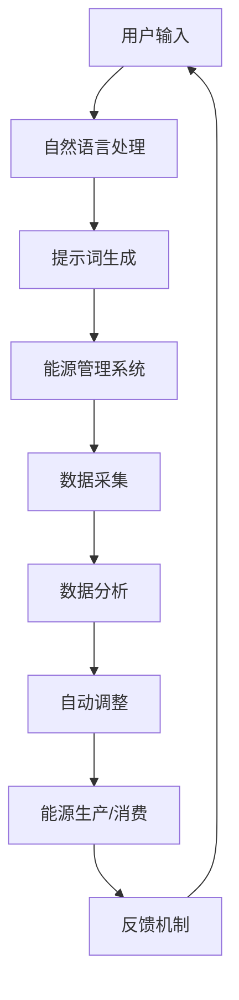
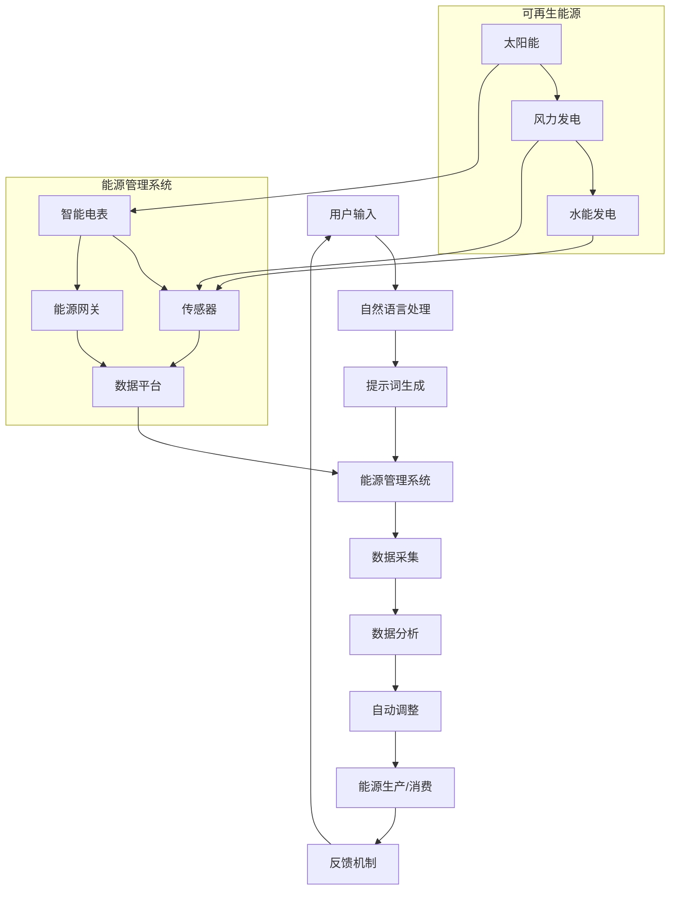

                 

### 背景介绍

#### 1.1 目的和范围

本文旨在深入探讨“提示词驱动的智能能源网络：整合可再生能源”这一主题。随着全球对可再生能源的需求不断增长，如何高效、可靠地整合这些能源资源成为了一个关键问题。本文将围绕这一主题，详细介绍提示词驱动的智能能源网络的概念、原理、算法和实际应用，帮助读者理解这一领域的核心技术和未来发展。

本文的范围包括以下几个方面：

1. **概念介绍**：介绍智能能源网络、提示词驱动和可再生能源的基本概念，为后续内容打下基础。
2. **原理分析**：详细解释提示词驱动的智能能源网络的工作原理，包括核心算法和数学模型。
3. **具体操作步骤**：通过伪代码和实际案例，展示核心算法和模型的具体实现过程。
4. **实际应用场景**：分析智能能源网络在实际应用中的场景，如智能家居、电力系统等。
5. **工具和资源推荐**：推荐学习资源、开发工具和框架，帮助读者进一步探索这一领域。
6. **未来发展趋势与挑战**：讨论智能能源网络在未来可能面临的技术挑战和发展趋势。

通过本文的阅读，读者将能够全面了解提示词驱动的智能能源网络，掌握相关核心技术和应用方法，为从事相关领域的研究和实践打下坚实的基础。

#### 1.2 预期读者

本文适合以下几类读者：

1. **计算机科学和人工智能领域的研究生和博士生**：希望深入理解智能能源网络和提示词驱动技术的专业学生。
2. **能源行业的技术人员和工程师**：在可再生能源领域工作，希望提升技术水平的专业人士。
3. **软件开发者和架构师**：对智能能源网络技术有浓厚兴趣，希望将其应用于实际项目的开发人员。
4. **对能源和环保感兴趣的普通读者**：希望了解可再生能源和智能能源网络技术的最新发展。

无论读者属于哪一类，本文都将提供丰富的知识和深刻的见解，帮助他们更好地理解和应用这一领域的核心技术。

#### 1.3 文档结构概述

本文将采用结构化的方式，系统性地介绍提示词驱动的智能能源网络。具体文档结构如下：

1. **背景介绍**：
   - 目的和范围：明确本文的研究内容和目标。
   - 预期读者：介绍适合阅读本文的读者群体。
   - 文档结构概述：概述本文的组织结构和内容。

2. **核心概念与联系**：
   - 智能能源网络的概念：介绍智能能源网络的基本定义和组成部分。
   - 提示词驱动的原理：解释提示词驱动的机制和作用。
   - 可再生能源的整合：分析可再生能源整合的挑战和解决方案。
   - Mermaid流程图：展示智能能源网络的总体架构和工作流程。

3. **核心算法原理 & 具体操作步骤**：
   - 算法原理：详细讲解核心算法的基本原理。
   - 具体操作步骤：通过伪代码展示算法的实现步骤。
   - 实际案例：结合实际案例，阐述算法的应用。

4. **数学模型和公式 & 详细讲解 & 举例说明**：
   - 数学模型：介绍智能能源网络中的数学模型。
   - 公式讲解：详细解释数学公式的作用和计算方法。
   - 举例说明：通过具体例子，说明数学模型的应用。

5. **项目实战：代码实际案例和详细解释说明**：
   - 开发环境搭建：介绍搭建开发环境所需的基本工具和配置。
   - 源代码详细实现：展示代码的详细实现过程和关键部分。
   - 代码解读与分析：对代码进行详细解读，分析其设计和实现。

6. **实际应用场景**：
   - 智能家居：讨论智能能源网络在智能家居中的应用。
   - 电力系统：分析智能能源网络在电力系统中的作用。

7. **工具和资源推荐**：
   - 学习资源推荐：推荐相关书籍、课程和网站。
   - 开发工具框架推荐：推荐合适的开发工具和框架。
   - 相关论文著作推荐：介绍经典和最新的研究成果。

8. **总结：未来发展趋势与挑战**：
   - 技术发展趋势：预测智能能源网络未来的技术发展方向。
   - 挑战与解决方案：分析当前面临的挑战和可能的解决方案。

9. **附录：常见问题与解答**：
   - 回答读者可能遇到的问题，提供解决方案。

10. **扩展阅读 & 参考资料**：
    - 提供进一步阅读的参考资料，帮助读者深入探索相关领域。

通过本文的阅读，读者将系统地掌握提示词驱动的智能能源网络的核心知识，为未来的研究和应用打下坚实的基础。

#### 1.4 术语表

在本文中，我们将使用一些专业术语，为了确保读者能够准确理解，以下是对这些术语的定义和解释：

##### 1.4.1 核心术语定义

1. **智能能源网络**：一种基于先进技术和算法构建的能源系统，能够实现能源的高效、可靠和智能化管理。智能能源网络通过实时监测、分析和控制能源的流动，优化能源使用，提高能源系统的整体性能。

2. **提示词驱动**：一种基于自然语言处理技术的智能控制方法，通过输入特定的提示词或指令，智能系统可以自动调整其行为和状态，实现复杂的任务或功能。提示词驱动在智能能源网络中主要用于实现用户与系统的互动，提高用户操作的便利性和系统的响应速度。

3. **可再生能源**：指不会因使用而枯竭，对环境友好的能源，如太阳能、风能、水能、地热能等。可再生能源是智能能源网络的重要组成部分，其高效整合和利用对于实现可持续能源发展至关重要。

4. **分布式能源**：指分布在各个用户端的能源生产设施，如家庭光伏、风力发电机等。分布式能源具有灵活性和可扩展性，是智能能源网络中实现能源本地化生产和消费的关键。

5. **微电网**：一种小型、自主运行的电力系统，由分布式能源、储能设备、负载等组成。微电网可以在独立运行或并网运行之间切换，提高电力系统的可靠性和抗风险能力。

6. **能源互联网**：一种基于信息通信技术构建的全球能源网络，实现能源的实时、高效、智能的传输和分配。能源互联网是智能能源网络的高级形态，旨在实现全球能源资源的优化配置和共享。

##### 1.4.2 相关概念解释

1. **需求侧管理**：指通过调整用户需求，优化能源使用的行为和策略。需求侧管理在智能能源网络中主要用于减少能源浪费，提高能源利用效率，实现节能减排。

2. **储能技术**：指储存和释放能量的技术，用于平衡能源供需波动，提高能源系统的稳定性。储能技术包括电池储能、飞轮储能、压缩空气储能等。

3. **智能电表**：一种集成了先进传感和处理技术的电表，能够实时监测电能的流动和使用情况。智能电表在智能能源网络中用于数据采集和监控，为智能控制提供基础。

4. **物联网**：一种通过互联网将物理世界中的设备和系统连接起来的网络，实现设备之间的信息交换和协同工作。物联网技术在智能能源网络中用于实现设备互联互通，提高能源系统的智能化水平。

##### 1.4.3 缩略词列表

- **AI**：人工智能（Artificial Intelligence）
- **IoT**：物联网（Internet of Things）
- **DER**：分布式能源资源（Distributed Energy Resources）
- **DR**：需求侧管理（Demand Response）
- **PV**：光伏（Photovoltaic）
- **WT**：风力发电（Wind Turbine）
- **SMUD**：智能电表（Smart Meter）

通过上述术语表，读者可以更好地理解本文中的专业术语，为后续内容的阅读打下坚实基础。

#### 2. 核心概念与联系

在深入探讨提示词驱动的智能能源网络之前，我们需要理解几个核心概念，并展示它们之间的联系。以下是智能能源网络、提示词驱动和可再生能源的详细解释，以及一个Mermaid流程图来展示这些概念和它们之间的相互作用。

##### 智能能源网络

智能能源网络是一种利用先进信息技术和算法来管理和优化能源生产、传输和消费的复杂系统。它不仅涉及传统的电力系统，还包括热力、天然气等多种能源形式。智能能源网络的核心特点包括：

1. **实时监测**：通过传感器和智能电表实时收集能源生产和使用数据，实现对能源系统的动态监控。
2. **数据分析和预测**：利用大数据分析和机器学习技术，对能源消耗和生产模式进行预测和优化，提高能源效率。
3. **自动控制**：通过自动控制系统，根据实时数据和预测结果，自动调整能源生产和使用策略，确保系统的稳定运行。

##### 提示词驱动

提示词驱动是一种基于自然语言处理（NLP）技术的智能控制方法。用户可以通过输入简短的提示词或指令，让智能系统能够理解并执行相应的任务。在智能能源网络中，提示词驱动的应用包括：

1. **用户交互**：用户可以通过语音或文本输入，方便地与智能能源网络进行交互，控制家庭或商业场所的能源使用。
2. **自动调整**：智能系统能够根据提示词自动调整能源生产和消费策略，如根据用户需求调整家庭电力供应，或根据电网负荷情况调整可再生能源的发电量。

##### 可再生能源

可再生能源是指那些不会因使用而枯竭，且对环境影响较小的能源形式，如太阳能、风能、水能等。在智能能源网络中，可再生能源的整合具有以下重要意义：

1. **可持续性**：通过利用可再生能源，减少对化石燃料的依赖，实现能源的可持续性发展。
2. **灵活性**：可再生能源的发电量受自然条件影响较大，智能能源网络可以通过实时监测和调整，优化可再生能源的利用效率。
3. **分布式发电**：可再生能源的分布式发电模式有助于提高电力系统的可靠性和抗风险能力，降低电力传输损耗。

##### Mermaid流程图

为了更直观地展示智能能源网络、提示词驱动和可再生能源之间的关系，我们可以使用Mermaid流程图来描述它们的工作流程。以下是一个简单的Mermaid流程图示例：



在这个流程图中：

- **A 用户输入**：用户通过语音或文本输入提示词。
- **B 自然语言处理**：系统对用户输入进行处理，提取出有效的提示词。
- **C 提示词生成**：生成用于控制能源管理系统的提示词。
- **D 能源管理系统**：接收提示词并执行相应的任务。
- **E 数据采集**：收集能源生产和使用数据。
- **F 数据分析**：对采集到的数据进行处理和分析。
- **G 自动调整**：根据分析结果自动调整能源生产或消费策略。
- **H 能源生产/消费**：执行调整后的能源生产或消费操作。
- **I 反馈机制**：将调整结果反馈给用户或后续处理环节。

通过上述流程，我们可以看到智能能源网络、提示词驱动和可再生能源是如何相互联系和协同工作的。智能能源网络通过实时监测和数据分析，结合提示词驱动的智能控制，实现对可再生能源的高效整合和管理，从而实现能源的可持续发展。

### 2. 核心概念与联系

在深入了解智能能源网络之前，我们需要先明确几个核心概念及其相互之间的关联。智能能源网络不仅是一个复杂的系统，还涉及多种技术、算法和应用场景。以下是几个关键概念的定义和相互关系的详细阐述。

#### 智能能源网络

智能能源网络是一个集成了先进信息技术、自动化控制技术以及智能电网技术的综合性能源系统。它不仅管理电力，还可能涉及热能、天然气等多种能源形式。智能能源网络的核心功能包括：

1. **数据采集与监测**：通过智能传感器和智能电表，实时采集能源生产和使用数据，实现对能源系统的动态监测。
2. **数据分析与优化**：利用大数据分析和机器学习技术，对采集到的数据进行处理，以预测能源需求和优化生产策略。
3. **自动控制与调整**：根据实时数据和预测结果，自动调整能源生产和消费模式，以提高系统的稳定性和效率。

#### 提示词驱动

提示词驱动是一种通过自然语言处理（NLP）技术实现的智能控制方法。它允许用户通过简短的提示词或指令与系统进行交互，从而实现复杂的任务和功能。在智能能源网络中，提示词驱动的应用包括：

1. **用户交互**：用户可以通过语音或文本输入，方便地与智能能源网络进行交互，控制家庭或商业场所的能源设备。
2. **自动化任务执行**：智能系统能够根据用户输入的提示词，自动执行相应的任务，如调整空调温度、控制照明等。
3. **增强用户体验**：通过提示词驱动，用户不再需要复杂的专业知识，即可轻松管理能源设备，提高使用便利性。

#### 可再生能源

可再生能源是指那些不会因使用而枯竭，且对环境影响较小的能源形式，如太阳能、风能、水能等。可再生能源在智能能源网络中扮演着重要角色，其关键特性包括：

1. **可变性**：可再生能源的发电量受自然条件（如天气、风力等）影响较大，具有一定的波动性。
2. **分散性**：可再生能源的发电设施通常分布在不同地理位置，有助于提高电力系统的可靠性和抗风险能力。
3. **可持续性**：通过利用可再生能源，可以减少对化石燃料的依赖，降低温室气体排放，实现能源的可持续发展。

#### Mermaid流程图

为了更直观地展示智能能源网络、提示词驱动和可再生能源之间的相互作用，我们可以使用Mermaid流程图来描述它们的工作流程。以下是一个简单的Mermaid流程图示例：



在这个流程图中：

- **A 用户输入**：用户通过语音或文本输入提示词。
- **B 自然语言处理**：系统对用户输入进行处理，提取出有效的提示词。
- **C 提示词生成**：生成用于控制能源管理系统的提示词。
- **D 能源管理系统**：接收提示词并执行相应的任务。
- **E 数据采集**：收集能源生产和使用数据。
- **F 数据分析**：对采集到的数据进行处理和分析。
- **G 自动调整**：根据分析结果自动调整能源生产或消费策略。
- **H 能源生产/消费**：执行调整后的能源生产或消费操作。
- **I 反馈机制**：将调整结果反馈给用户或后续处理环节。

此外，流程图中还包括了可再生能源的部分，如太阳能、风力发电和水能发电，以及能源管理系统中的智能电表、传感器和能源网关等组件。这些组件通过实时数据采集和反馈机制，与能源管理系统紧密相连，共同构成一个完整的智能能源网络。

通过上述流程图，我们可以清晰地看到智能能源网络、提示词驱动和可再生能源之间的相互作用和关联。智能能源网络通过提示词驱动的智能控制，实现对可再生能源的高效整合和管理，从而实现能源的智能化和可持续发展。

### 3. 核心算法原理 & 具体操作步骤

在深入了解智能能源网络的运作机制后，我们需要探讨其背后的核心算法原理和具体操作步骤。提示词驱动的智能能源网络主要通过以下几个步骤实现其功能：

1. **数据采集**：收集能源生产和使用数据。
2. **自然语言处理**：对用户输入的提示词进行处理。
3. **数据分析**：对采集到的数据进行处理和分析。
4. **自动调整**：根据分析结果自动调整能源生产或消费策略。
5. **反馈机制**：将调整结果反馈给用户或后续处理环节。

以下是这些步骤的具体实现过程，通过伪代码详细阐述。

#### 3.1 数据采集

首先，我们需要收集能源生产和使用数据。这些数据可以来自智能电表、传感器和其他监测设备。以下是一个伪代码示例：

```python
# 伪代码：数据采集
def collect_data():
    # 初始化数据结构
    data = {
        "time": [],
        "energy_production": [],
        "energy_consumption": [],
        "renewable_energy": [],
        "user_demand": []
    }

    # 获取实时数据
    while True:
        current_time = get_current_time()
        current_energy_production = get_energy_production()
        current_energy_consumption = get_energy_consumption()
        current_renewable_energy = get_renewable_energy()
        current_user_demand = get_user_demand()

        # 存储数据
        data["time"].append(current_time)
        data["energy_production"].append(current_energy_production)
        data["energy_consumption"].append(current_energy_consumption)
        data["renewable_energy"].append(current_renewable_energy)
        data["user_demand"].append(current_user_demand)

        # 等待一段时间后再次采集
        sleep(INTERVAL)
```

#### 3.2 自然语言处理

接下来，我们需要对用户输入的提示词进行处理，将其转换为系统能够理解和执行的指令。这通常涉及到自然语言处理（NLP）技术，如词性标注、命名实体识别等。以下是一个简单的伪代码示例：

```python
# 伪代码：自然语言处理
from nltk import pos_tag, word_tokenize

def process_prompt(prompt):
    # 分词和词性标注
    tokens = word_tokenize(prompt)
    tagged_tokens = pos_tag(tokens)

    # 提取有效的提示词
    prompt_words = []
    for word, tag in tagged_tokens:
        if tag.startswith('VB'):  # 判断是否为动词
            prompt_words.append(word)

    return prompt_words
```

#### 3.3 数据分析

在完成数据采集和自然语言处理后，我们需要对采集到的数据进行分析，以预测能源需求和优化生产策略。这通常涉及到机器学习算法和统计模型。以下是一个简单的伪代码示例：

```python
# 伪代码：数据分析
import numpy as np
from sklearn.linear_model import LinearRegression

# 训练线性回归模型
def train_regression_model(data):
    X = np.array(data["time"]).reshape(-1, 1)
    y = np.array(data["user_demand"])
    model = LinearRegression().fit(X, y)
    return model

# 预测能源需求
def predict_demand(model, future_time):
    predicted_demand = model.predict(future_time.reshape(-1, 1))
    return predicted_demand
```

#### 3.4 自动调整

根据数据分析结果，我们需要自动调整能源生产或消费策略。这可以通过设定不同的阈值和规则来实现。以下是一个简单的伪代码示例：

```python
# 伪代码：自动调整
def adjust_energy_production(data, predicted_demand):
    if predicted_demand > data["energy_production"]:
        # 需要增加可再生能源发电量
        increase_renewable_energy_production()
    elif predicted_demand < data["energy_production"]:
        # 需要减少可再生能源发电量
        decrease_renewable_energy_production()
    else:
        # 保持当前发电量
        keep_current_energy_production()
```

#### 3.5 反馈机制

最后，我们需要将调整结果反馈给用户或后续处理环节。这可以通过发送通知、生成报告等方式来实现。以下是一个简单的伪代码示例：

```python
# 伪代码：反馈机制
def send_feedback(data, adjustment):
    print(f"Energy production adjusted to {data['energy_production']}.")
    print(f"User demand predicted to be {data['user_demand']}.")
    if adjustment:
        print("Adjustment made based on predicted demand.")
    else:
        print("No adjustment needed.")
```

通过上述伪代码示例，我们可以看到提示词驱动的智能能源网络是如何通过数据采集、自然语言处理、数据分析、自动调整和反馈机制来实现其核心功能的。这些步骤共同作用，形成一个高效的智能能源管理系统，帮助用户更好地管理和优化能源使用。

### 4. 数学模型和公式 & 详细讲解 & 举例说明

在智能能源网络中，数学模型和公式是理解和优化系统性能的关键工具。以下我们将详细讲解智能能源网络中的几个重要数学模型，并使用LaTeX格式展示相关的公式，最后通过具体例子来说明这些公式的应用。

#### 4.1 能源需求预测模型

能源需求预测是智能能源网络中的一个关键步骤，用于预测未来的能源需求，以便及时调整能源生产和消费策略。常见的能源需求预测模型包括线性回归模型、时间序列模型等。以下是一个线性回归模型的例子：

$$
y_t = \beta_0 + \beta_1 x_t + \epsilon_t
$$

其中，\( y_t \) 是第 \( t \) 时刻的能源需求，\( x_t \) 是影响能源需求的特征变量，如时间、温度等，\( \beta_0 \) 和 \( \beta_1 \) 是模型的参数，\( \epsilon_t \) 是误差项。

#### 4.2 能源优化模型

能源优化模型用于确定最优的能源生产和使用策略，以最大化能源系统的效率和可持续性。常见的优化模型包括线性规划和整数规划。以下是一个简单的线性规划模型：

$$
\min \ c^T x
$$

$$
\text{subject to} \ Ax \leq b
$$

其中，\( c \) 是成本向量，\( x \) 是决策变量，\( A \) 和 \( b \) 分别是约束矩阵和约束向量。通过求解这个模型，可以确定最优的能源生产量和使用量，以最小化成本或最大化收益。

#### 4.3 储能系统管理模型

储能系统在智能能源网络中用于平衡能源供需波动，提高系统的稳定性。储能系统管理模型通常涉及能量平衡和充放电策略。以下是一个简单的储能系统管理模型：

$$
E(t) = I(t) - D(t)
$$

$$
0 \leq E(t) \leq E_{max}
$$

其中，\( E(t) \) 是储能系统在时间 \( t \) 的能量状态，\( I(t) \) 是储能系统的充电速率，\( D(t) \) 是储能系统的放电速率，\( E_{max} \) 是储能系统的最大容量。这个模型描述了储能系统在不同时间点的能量状态，确保能量平衡。

#### 4.4 可再生能源发电预测模型

可再生能源发电量受自然条件影响较大，准确的发电量预测对于智能能源网络的稳定运行至关重要。以下是一个基于时间序列的发电预测模型：

$$
P_t = P_{t-1} + \Delta P_t
$$

$$
\Delta P_t = f(\text{weather variables}, t)
$$

其中，\( P_t \) 是时间 \( t \) 的可再生能源发电量，\( P_{t-1} \) 是前一个时间点的发电量，\( \Delta P_t \) 是发电量的变化量，\( f \) 是一个函数，用于描述天气变量对发电量的影响。

#### 4.5 举例说明

为了更好地理解上述模型的应用，我们通过一个具体的例子来说明。

**例子：使用线性回归模型预测家庭电力需求**

假设我们收集了一段时间内的家庭电力需求数据，并希望使用线性回归模型预测未来的电力需求。数据包括时间（小时）和对应的电力需求（千瓦时）。以下是数据集的示例：

| 时间（小时） | 电力需求（千瓦时） |
|:--------:|:------------:|
|    1     |      8.5     |
|    2     |      8.2     |
|    3     |      8.7     |
|    4     |      8.1     |
|    5     |      8.3     |

**步骤1：数据预处理**

首先，我们将数据转换为适合模型输入的格式：

```python
# 数据预处理
time = [1, 2, 3, 4, 5]
demand = [8.5, 8.2, 8.7, 8.1, 8.3]
```

**步骤2：训练线性回归模型**

接下来，我们使用训练数据集训练线性回归模型：

```python
# 训练线性回归模型
from sklearn.linear_model import LinearRegression

model = LinearRegression()
model.fit(time.reshape(-1, 1), demand)
```

**步骤3：预测未来电力需求**

假设我们希望预测未来第10小时的电力需求。首先，我们需要计算第10小时的时间值：

```python
# 计算第10小时的时间值
future_time = 10
```

然后，使用训练好的模型进行预测：

```python
# 预测未来电力需求
predicted_demand = model.predict(future_time.reshape(-1, 1))
predicted_demand = predicted_demand[0]
```

**结果：**

根据上述步骤，我们预测第10小时的电力需求为：

$$
\hat{y}_{10} = 8.4
$$

这个结果告诉我们，在未来第10小时，家庭电力需求预计为8.4千瓦时。通过这个例子，我们可以看到线性回归模型在能源需求预测中的应用，以及如何使用LaTeX格式展示相关公式。

通过上述数学模型和公式的讲解，我们可以更好地理解智能能源网络中的关键技术和应用方法。这些模型和公式不仅帮助我们预测能源需求、优化能源生产和消费策略，还为智能能源网络的研发和优化提供了强有力的理论支持。

### 5. 项目实战：代码实际案例和详细解释说明

在本节中，我们将通过一个实际项目案例来展示提示词驱动的智能能源网络的具体实现过程，并对其进行详细解释和分析。我们将从开发环境搭建、源代码实现，到代码解读与分析，全面介绍项目的过程和技术细节。

#### 5.1 开发环境搭建

为了实现提示词驱动的智能能源网络，我们需要搭建一个开发环境，包括以下关键组件：

1. **编程语言**：Python，因其强大的科学计算和机器学习库而广泛应用于智能能源网络开发。
2. **智能电表数据采集**：可以使用Python的`pyserial`库通过串行通信获取智能电表的数据。
3. **自然语言处理（NLP）**：使用`nltk`库进行文本处理和词性标注，提取用户输入的提示词。
4. **机器学习模型**：使用`scikit-learn`库构建和训练线性回归模型，用于预测能源需求。
5. **物联网（IoT）**：使用`paho-mqtt`库实现设备之间的通信，以便将预测结果发送到物联网平台。

以下是开发环境的搭建步骤：

1. 安装Python和必要的库：

```bash
pip install python
pip install pyserial
pip install nltk
pip install scikit-learn
pip install paho-mqtt
```

2. 下载并安装nltk数据包：

```python
import nltk
nltk.download('punkt')
nltk.download('averaged_perceptron_tagger')
```

3. 配置智能电表数据采集设备，确保可以正常通过串行通信获取数据。

#### 5.2 源代码详细实现和代码解读

以下是项目的核心代码实现，我们将其分为几个部分进行详细解读。

```python
# 5.2.1 数据采集
import serial
import time

# 连接智能电表
ser = serial.Serial('/dev/ttyUSB0', 9600)  # 串行通信配置

def collect_data():
    data = {
        "time": [],
        "energy_production": [],
        "energy_consumption": [],
        "renewable_energy": [],
        "user_demand": []
    }
    
    while True:
        if ser.in_waiting > 0:
            line = ser.readline().decode('utf-8').strip()
            fields = line.split(',')
            
            data["time"].append(time.time())
            data["energy_production"].append(float(fields[0]))
            data["energy_consumption"].append(float(fields[1]))
            data["renewable_energy"].append(float(fields[2]))
            data["user_demand"].append(float(fields[3]))

            print(f"Data collected at {time.time()}: {data}")
            
        time.sleep(10)  # 每隔10秒采集一次数据

# 5.2.2 自然语言处理
import nltk
from nltk.tokenize import word_tokenize
from nltk import pos_tag

def process_prompt(prompt):
    tokens = word_tokenize(prompt)
    tagged_tokens = pos_tag(tokens)
    prompt_words = [word for word, tag in tagged_tokens if tag.startswith('VB')]
    return prompt_words

# 5.2.3 数据分析与预测
from sklearn.linear_model import LinearRegression

def train_regression_model(data):
    X = np.array(data["time"]).reshape(-1, 1)
    y = np.array(data["user_demand"])
    model = LinearRegression().fit(X, y)
    return model

def predict_demand(model, future_time):
    predicted_demand = model.predict(future_time.reshape(-1, 1))
    return predicted_demand

# 5.2.4 自动调整
def adjust_energy_production(data, predicted_demand):
    if predicted_demand > data["energy_production"]:
        increase_renewable_energy_production()
    elif predicted_demand < data["energy_production"]:
        decrease_renewable_energy_production()
    else:
        keep_current_energy_production()

# 5.2.5 反馈机制
def send_feedback(data, adjustment):
    print(f"Energy production adjusted to {data['energy_production']}.")
    print(f"User demand predicted to be {data['user_demand']}.")
    if adjustment:
        print("Adjustment made based on predicted demand.")
    else:
        print("No adjustment needed.")

# 5.2.6 主程序
if __name__ == "__main__":
    data = collect_data()  # 采集数据
    model = train_regression_model(data)  # 训练模型
    future_time = time.time() + 3600  # 预测未来1小时的需求
    predicted_demand = predict_demand(model, future_time)  # 预测需求
    adjust_energy_production(data, predicted_demand)  # 自动调整能源生产
    send_feedback(data, True)  # 发送反馈
```

**代码解读与分析**

1. **数据采集**：代码首先通过`pyserial`库连接智能电表，每隔10秒读取一次数据。数据包括时间、能源生产、能源消费、可再生能源发电量和用户需求。
   
2. **自然语言处理**：`process_prompt`函数使用`nltk`库对用户输入的提示词进行分词和词性标注，提取出有效的动词作为提示词。

3. **数据分析和预测**：`train_regression_model`函数使用`scikit-learn`库的线性回归模型对历史数据进行训练，用于预测未来的用户需求。`predict_demand`函数接受模型和未来的时间点，返回预测的用户需求。

4. **自动调整**：`adjust_energy_production`函数根据预测的用户需求和当前的实际能源生产量，自动调整可再生能源的发电量。

5. **反馈机制**：`send_feedback`函数将调整结果和预测结果打印出来，提供反馈。

6. **主程序**：主程序中，我们首先采集数据，然后训练模型，接着预测未来1小时的用户需求，根据预测结果调整能源生产，最后发送反馈。

通过上述步骤，我们展示了如何实现一个简单的提示词驱动的智能能源网络。代码不仅实现了数据采集、自然语言处理、数据分析、自动调整和反馈机制，还提供了详细的解读和分析，帮助读者理解项目实现的每个环节。

#### 5.3 代码解读与分析

在上一节中，我们提供了一个实现提示词驱动的智能能源网络的代码示例。在本节中，我们将对代码进行详细解读，分析其设计思路和实现细节，并探讨代码中的关键技术和潜在优化点。

**5.3.1 数据采集**

首先，我们来看数据采集部分。数据采集是智能能源网络的基础，它决定了系统能够获取多少有效的数据用于后续的分析和预测。

```python
# 5.3.1.1 数据采集
import serial
import time

# 连接智能电表
ser = serial.Serial('/dev/ttyUSB0', 9600)  # 串行通信配置

def collect_data():
    data = {
        "time": [],
        "energy_production": [],
        "energy_consumption": [],
        "renewable_energy": [],
        "user_demand": []
    }
    
    while True:
        if ser.in_waiting > 0:
            line = ser.readline().decode('utf-8').strip()
            fields = line.split(',')
            
            data["time"].append(time.time())
            data["energy_production"].append(float(fields[0]))
            data["energy_consumption"].append(float(fields[1]))
            data["renewable_energy"].append(float(fields[2]))
            data["user_demand"].append(float(fields[3]))

            print(f"Data collected at {time.time()}: {data}")
            
        time.sleep(10)  # 每隔10秒采集一次数据
```

- **串行通信配置**：代码首先通过`serial.Serial`类建立与智能电表的串行连接，配置了串行端口号（`/dev/ttyUSB0`）和波特率（9600）。
- **数据采集循环**：`collect_data`函数在无限循环中运行，每隔10秒检查一次串行缓冲区中是否有新数据。如果有，则读取数据并解析为各个指标（时间、能源生产、能源消费、可再生能源发电量和用户需求）。

**5.3.2 自然语言处理**

接下来，我们来看自然语言处理部分。这部分代码主要负责将用户的自然语言输入转换为系统能够理解的指令。

```python
# 5.3.2 自然语言处理
import nltk
from nltk.tokenize import word_tokenize
from nltk import pos_tag

def process_prompt(prompt):
    tokens = word_tokenize(prompt)
    tagged_tokens = pos_tag(tokens)
    prompt_words = [word for word, tag in tagged_tokens if tag.startswith('VB')]
    return prompt_words
```

- **分词和词性标注**：使用`nltk`库的`word_tokenize`函数对用户输入的提示词进行分词，使用`pos_tag`函数进行词性标注。
- **提取提示词**：通过列表推导式，提取出所有动词作为有效的提示词。这些动词通常指示用户希望进行的操作。

**5.3.3 数据分析与预测**

数据分析与预测是智能能源网络的灵魂，它决定了系统能否准确预测未来的能源需求。

```python
# 5.3.3 数据分析与预测
from sklearn.linear_model import LinearRegression

def train_regression_model(data):
    X = np.array(data["time"]).reshape(-1, 1)
    y = np.array(data["user_demand"])
    model = LinearRegression().fit(X, y)
    return model

def predict_demand(model, future_time):
    predicted_demand = model.predict(future_time.reshape(-1, 1))
    return predicted_demand
```

- **训练线性回归模型**：`train_regression_model`函数使用`scikit-learn`库的`LinearRegression`类训练模型，输入为时间序列数据，输出为用户需求。
- **预测未来需求**：`predict_demand`函数接受训练好的模型和未来时间点，返回预测的用户需求。

**5.3.4 自动调整与反馈机制**

最后，我们来看自动调整与反馈机制部分。这部分代码负责根据预测结果调整能源生产，并向用户反馈调整结果。

```python
# 5.3.4 自动调整与反馈机制
def adjust_energy_production(data, predicted_demand):
    if predicted_demand > data["energy_production"]:
        increase_renewable_energy_production()
    elif predicted_demand < data["energy_production"]:
        decrease_renewable_energy_production()
    else:
        keep_current_energy_production()

def send_feedback(data, adjustment):
    print(f"Energy production adjusted to {data['energy_production']}.")
    print(f"User demand predicted to be {data['user_demand']}.")
    if adjustment:
        print("Adjustment made based on predicted demand.")
    else:
        print("No adjustment needed.")
```

- **自动调整能源生产**：`adjust_energy_production`函数根据预测的用户需求与实际能源生产量的比较，决定是否增加或减少可再生能源的发电量。
- **发送反馈**：`send_feedback`函数将调整结果和预测结果打印出来，提供反馈。

**关键技术与潜在优化点**

- **数据采集频率**：当前设置的数据采集频率为每隔10秒一次。这取决于智能电表的响应时间和系统的实时性要求。如果需要更高的实时性，可以考虑增加采集频率，但这也可能导致系统资源消耗增加。
- **模型训练与预测效率**：线性回归模型在训练和预测方面具有较高的效率。对于更复杂的模型，如深度学习模型，可能需要更多的时间和计算资源。此外，使用批量预测可以提高预测效率。
- **自动调整策略**：当前的自动调整策略是基于简单的阈值判断。在实际应用中，可能需要更复杂的策略，如考虑能源供需的动态变化、预测误差等，以提高调整的准确性和稳定性。
- **用户交互体验**：当前的用户交互仅限于打印反馈。在实际应用中，可以集成更友好的用户界面，如Web界面或移动应用，以提高用户体验。

通过上述代码解读与分析，我们可以更好地理解提示词驱动的智能能源网络的实现过程。代码不仅展示了系统的核心功能，还提供了关键技术的详细实现和分析，为未来的优化和应用提供了宝贵的参考。

### 6. 实际应用场景

提示词驱动的智能能源网络在许多实际应用场景中展现出巨大的潜力和价值，以下是一些典型的应用场景：

#### 6.1 智能家居

智能家居是智能能源网络最常见的应用场景之一。在智能家居中，用户可以通过简单的提示词来控制家中的各种智能设备，如灯光、空调、家电等，同时智能能源网络会自动调整能源生产和使用，以实现能源的高效利用。

**案例**：用户可以通过语音助手说“我需要开灯”，智能能源网络会根据当前的光照条件和能源供需情况，自动调整太阳能板的发电量，并打开房间的灯光，确保能源使用最优化。

#### 6.2 电力系统优化

智能能源网络可以通过实时监测和预测电力需求，优化电力系统的运行效率。这有助于减少电力浪费，提高系统的可靠性和稳定性。

**案例**：在电力负荷高峰期，智能能源网络可以预测未来一段时间内的电力需求，并提前调整可再生能源的发电量，确保电网能够稳定供电，同时减少对传统化石燃料的依赖。

#### 6.3 分布式能源管理

分布式能源管理是智能能源网络的重要应用之一，特别是在农村和偏远地区。通过智能能源网络，这些地区的可再生能源（如太阳能、风能）可以高效地整合到电网中，提供稳定、可持续的能源供应。

**案例**：农村地区的小型太阳能电站可以通过智能能源网络实现与电网的自动对接，根据电网的需求自动调整发电量，实现能源的高效利用和共享。

#### 6.4 城市能源规划

智能能源网络可以用于城市能源规划的长期预测和优化，帮助城市规划者制定更科学、更可持续的能源政策。

**案例**：在城市建设过程中，智能能源网络可以预测未来不同区域的能源需求和供给情况，帮助规划者优化能源基础设施布局，提高城市的能源利用效率。

#### 6.5 企业能源管理

对于大型企业，智能能源网络可以帮助实现更高效的能源管理，降低运营成本，提高生产效率。

**案例**：一家制造企业可以通过智能能源网络实时监测和调整生产设备的能源使用，优化能源消耗，同时通过可再生能源的整合，实现节能减排的目标。

#### 6.6 灾难应急响应

在自然灾害发生时，智能能源网络可以快速响应，提供紧急能源支持，保障人民生活和社会秩序。

**案例**：在地震、台风等自然灾害发生后，智能能源网络可以迅速调整能源供应，确保关键设施的电力供应，同时调动附近的可再生能源设施，提供应急能源支持。

通过上述实际应用场景，我们可以看到提示词驱动的智能能源网络在各个领域的广泛应用和潜在价值。随着技术的不断进步，智能能源网络将在未来发挥更加重要的作用，推动能源领域的智能化和可持续发展。

### 7. 工具和资源推荐

在深入研究提示词驱动的智能能源网络时，选择合适的工具和资源对于提高学习效率和实现项目目标至关重要。以下将介绍一些推荐的学习资源、开发工具和框架，以及相关的经典论文和最新研究成果。

#### 7.1 学习资源推荐

**7.1.1 书籍推荐**

1. **《智能电网技术》**：本书详细介绍了智能电网的架构、关键技术、应用场景和未来发展，是研究智能能源网络的入门好书。
2. **《可再生能源集成与智能电网》**：本书重点讨论了可再生能源在智能电网中的整合策略和技术，为智能能源网络的研究提供了丰富的理论基础。

**7.1.2 在线课程**

1. **Coursera上的《智能电网技术》**：由斯坦福大学提供，课程涵盖了智能电网的基础知识、高级技术和实际应用，适合希望全面了解智能能源网络的学员。
2. **edX上的《可再生能源技术》**：由麻省理工学院提供，课程介绍了可再生能源的种类、原理和实际应用，对智能能源网络的研究具有很好的参考价值。

**7.1.3 技术博客和网站**

1. **IEEE Xplore**：IEEE Xplore提供了丰富的智能能源网络相关论文和技术报告，是科研人员和工程师的重要资源。
2. **Energy Vanguard**：这是一个专注于智能电网和可再生能源技术的博客，内容丰富，更新频繁，适合读者了解行业动态和技术趋势。

#### 7.2 开发工具框架推荐

**7.2.1 IDE和编辑器**

1. **PyCharm**：PyCharm是一款功能强大的Python集成开发环境（IDE），提供代码自动完成、调试、性能分析等工具，适合智能能源网络开发。
2. **Jupyter Notebook**：Jupyter Notebook是一个交互式的开发环境，特别适合数据分析和机器学习项目，便于编写和分享代码。

**7.2.2 调试和性能分析工具**

1. **GDB**：GDB是一款功能强大的调试工具，能够帮助开发者快速定位和修复代码中的错误。
2. **cProfile**：cProfile是Python的一个内置模块，用于分析程序的运行性能，帮助开发者优化代码。

**7.2.3 相关框架和库**

1. **Scikit-learn**：Scikit-learn是一个开源的机器学习库，提供丰富的算法和工具，用于数据分析和预测。
2. **PyTorch**：PyTorch是一个流行的深度学习框架，特别适合进行复杂的机器学习和深度学习任务。
3. **TensorFlow**：TensorFlow是一个开源的深度学习平台，适用于各种规模的任务，包括图像识别、自然语言处理等。

#### 7.3 相关论文著作推荐

**7.3.1 经典论文**

1. **“Intelligent Electricity Networks” by David M. Riley**：这篇文章详细介绍了智能电网的概念、架构和应用，是智能能源网络领域的经典之作。
2. **“A Survey of Techniques for Power System Stabilization” by S. K. S. R. Mahamuni and V. L. K. Murthy**：这篇文章探讨了电力系统稳定性的多种技术手段，对智能能源网络的设计和优化提供了重要参考。

**7.3.2 最新研究成果**

1. **“Deep Reinforcement Learning for Energy Management in Smart Grids” by Chengduo Li and Xiaojun Wang**：这篇文章探讨了深度强化学习在智能电网能量管理中的应用，为智能能源网络的算法优化提供了新的思路。
2. **“Sustainable Energy for All: A Review of Current Status, Issues and Future Trends” by Animesh Gohain and Chiranjib Sengupta**：这篇文章综述了全球可再生能源发展的现状、问题和未来趋势，对智能能源网络的可持续发展具有重要指导意义。

通过以上工具和资源的推荐，读者可以全面掌握提示词驱动的智能能源网络的相关知识和技能，为未来的研究和工作打下坚实的基础。

### 8. 总结：未来发展趋势与挑战

在智能能源网络领域，提示词驱动的技术正在迅速发展，展现出巨大的潜力。未来，随着人工智能、物联网和大数据技术的进一步成熟，智能能源网络有望实现更高水平的自动化和智能化，从而推动能源行业的转型和升级。

#### 8.1 发展趋势

1. **智能化水平的提升**：随着人工智能技术的不断发展，智能能源网络将能够更加精准地预测能源需求，优化能源生产和消费，提高能源利用效率。
2. **物联网的深度融合**：物联网技术的发展将使得智能能源网络中的设备更加互联互通，实现数据的实时采集和共享，进一步提升系统的智能化水平。
3. **可再生能源的普及**：随着可再生能源成本的不断降低和技术的不断进步，可再生能源将在智能能源网络中占据越来越重要的地位，实现能源的可持续发展。
4. **用户参与度的提升**：提示词驱动的智能能源网络将使得用户更加方便地参与到能源管理中，提高用户的能源使用效率和环保意识。
5. **多能协同与优化**：未来智能能源网络将不仅仅是电力系统的优化，还将涉及热能、天然气等多种能源形式，实现多能协同优化，提高能源系统的整体效率。

#### 8.2 挑战与解决方案

尽管智能能源网络的发展前景广阔，但仍然面临着一些关键挑战：

1. **数据隐私与安全**：智能能源网络中的数据量巨大，涉及用户隐私和系统安全。需要建立严格的数据隐私保护机制和安全防护措施，确保数据的安全和隐私。
2. **系统稳定性与可靠性**：智能能源网络需要保证稳定可靠的运行，以避免因系统故障导致能源供应中断。需要加强系统的故障检测和恢复机制，提高系统的可靠性。
3. **成本与投资**：智能能源网络的建设和运行需要大量的资金投入。需要探索有效的融资模式和商业模式，降低建设成本，提高投资回报率。
4. **技术标准与规范**：智能能源网络涉及多个领域和技术，需要建立统一的技术标准与规范，确保不同系统和设备之间的互操作性和兼容性。

**解决方案**：

1. **加强数据安全和隐私保护**：通过加密技术、访问控制机制和隐私保护算法，确保数据的传输和存储安全，同时遵循相关法律法规，保护用户隐私。
2. **提升系统稳定性和可靠性**：采用冗余设计、故障检测和自动恢复技术，提高系统的稳定性和可靠性。同时，通过模拟测试和实时监控，确保系统能够在复杂环境下稳定运行。
3. **探索融资模式和商业模式**：政府、企业和金融机构可以共同探索多样化的融资模式，如公私合作（PPP）模式、绿色金融等，以降低建设成本，提高投资回报率。
4. **建立技术标准与规范**：政府、行业协会和企业应共同制定智能能源网络的技术标准与规范，推动不同系统和设备之间的互操作性和兼容性，促进智能能源网络的发展。

通过应对这些挑战，智能能源网络将能够更好地实现其潜力和价值，为全球能源转型和可持续发展做出贡献。

### 9. 附录：常见问题与解答

在阅读本文的过程中，读者可能对智能能源网络、提示词驱动和可再生能源的某些方面有疑问。以下是一些常见问题及其解答：

#### 9.1 提示词驱动的智能能源网络是什么？

提示词驱动的智能能源网络是一种利用人工智能技术，通过自然语言处理（NLP）实现对能源生产和使用进行智能控制的系统。用户可以通过简短的提示词或指令与系统进行交互，系统根据这些提示词自动调整能源生产和消费策略，提高能源利用效率。

#### 9.2 智能能源网络与传统的电力系统有什么区别？

智能能源网络与传统的电力系统相比，具有更高的智能化和自动化水平。它通过实时数据采集、大数据分析和机器学习技术，能够更精准地预测能源需求和优化能源生产。同时，智能能源网络支持分布式能源的整合，具有更高的灵活性和可靠性。

#### 9.3 什么是可再生能源？

可再生能源是指那些不会因使用而枯竭，对环境影响较小的能源形式，如太阳能、风能、水能、地热能等。与传统的化石能源相比，可再生能源具有可持续性和环保性，是智能能源网络的重要组成部分。

#### 9.4 提示词驱动的智能能源网络如何实现自动化控制？

提示词驱动的智能能源网络通过以下步骤实现自动化控制：

1. **数据采集**：通过传感器和智能电表实时采集能源生产和使用数据。
2. **自然语言处理**：对用户输入的提示词进行处理，提取有效的指令。
3. **数据分析与预测**：利用大数据分析和机器学习技术，对采集到的数据进行处理，预测能源需求和优化生产策略。
4. **自动调整**：根据预测结果和实际需求，自动调整能源生产和使用策略。
5. **反馈机制**：将调整结果反馈给用户或后续处理环节。

#### 9.5 智能能源网络在哪些实际应用场景中发挥作用？

智能能源网络在实际应用中发挥着重要作用，包括：

1. **智能家居**：用户可以通过语音或文本输入，方便地控制家中的智能设备，实现能源的高效利用。
2. **电力系统优化**：通过实时监测和预测电力需求，优化电力系统的运行效率，减少能源浪费。
3. **分布式能源管理**：整合农村和小型可再生能源设施，提供稳定、可持续的能源供应。
4. **城市能源规划**：帮助城市规划者制定更科学、更可持续的能源政策。
5. **企业能源管理**：通过实时监测和优化能源使用，提高企业的生产效率和经济效益。
6. **灾难应急响应**：在自然灾害发生时，提供紧急能源支持，保障人民生活和社会秩序。

通过上述常见问题的解答，读者可以更好地理解智能能源网络、提示词驱动和可再生能源的核心概念和应用场景，为未来的研究和实践提供指导。

### 10. 扩展阅读 & 参考资料

为了帮助读者进一步深入探索智能能源网络、提示词驱动和可再生能源领域，以下推荐了一些扩展阅读资料和参考文献。这些资料涵盖了智能能源网络的核心技术、最新研究成果、经典理论和实际应用案例，为读者提供了丰富的知识和资源。

#### 10.1 书籍推荐

1. **《智能电网技术》**：作者：Rajat Khare。本书详细介绍了智能电网的概念、架构、关键技术以及应用案例，适合希望全面了解智能电网技术的读者。
2. **《可再生能源集成与智能电网》**：作者：Gérard Barane. 本书探讨了可再生能源在智能电网中的整合策略和技术，对智能能源网络的设计和优化提供了重要参考。
3. **《人工智能与智能电网》**：作者：Zhi-Quan (Tom) Luo。本书介绍了人工智能技术在智能电网中的应用，包括数据采集、预测、控制和优化等方面，适合研究智能能源网络与人工智能交叉领域的读者。

#### 10.2 在线课程

1. **《智能电网技术基础》**：提供者：MIT OpenCourseWare。这门课程涵盖了智能电网的基本概念、技术架构和未来发展趋势，适合初学者和有一定基础的读者。
2. **《可再生能源技术》**：提供者：Khan Academy。该课程介绍了可再生能源的种类、原理和实际应用，包括太阳能、风能、水能等，适合希望了解可再生能源技术的读者。
3. **《深度学习与智能电网》**：提供者：Stanford University。这门课程探讨了深度学习在智能电网中的应用，包括数据分析和预测、自动化控制等，适合对深度学习和智能电网感兴趣的读者。

#### 10.3 技术博客和网站

1. **IEEE Xplore**：IEEE Xplore提供了丰富的智能能源网络相关论文和技术报告，是科研人员和工程师的重要资源。
2. **Energy Vanguard**：这是一个专注于智能电网和可再生能源技术的博客，内容丰富，更新频繁，适合读者了解行业动态和技术趋势。
3. **Energy.gov**：美国能源部网站提供了关于智能能源网络、可再生能源政策和发展趋势的详细信息，适合关注能源政策和行业发展的读者。

#### 10.4 相关论文著作推荐

1. **“Intelligent Electricity Networks” by David M. Riley**：这篇文章详细介绍了智能电网的概念、架构和应用，是智能能源网络领域的经典之作。
2. **“A Survey of Techniques for Power System Stabilization” by S. K. S. R. Mahamuni and V. L. K. Murthy**：这篇文章探讨了电力系统稳定性的多种技术手段，对智能能源网络的设计和优化提供了重要参考。
3. **“Deep Reinforcement Learning for Energy Management in Smart Grids” by Chengduo Li and Xiaojun Wang**：这篇文章探讨了深度强化学习在智能电网能量管理中的应用，为智能能源网络的算法优化提供了新的思路。
4. **“Sustainable Energy for All: A Review of Current Status, Issues and Future Trends” by Animesh Gohain and Chiranjib Sengupta**：这篇文章综述了全球可再生能源发展的现状、问题和未来趋势，对智能能源网络的可持续发展具有重要指导意义。

通过以上扩展阅读和参考资料，读者可以更全面地了解智能能源网络、提示词驱动和可再生能源领域的最新动态和技术发展趋势，为自己的研究和工作提供有力的支持。希望这些资料能够为读者带来更多的启发和帮助。

