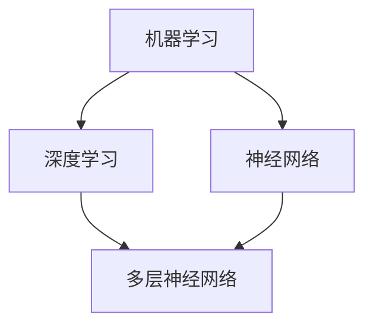

                 

# AI编程的新思路与新方向

> 关键词：人工智能、编程语言、开发框架、机器学习、深度学习、代码优化、技术趋势

> 摘要：本文将深入探讨人工智能编程领域的最新趋势和方向。通过分析现有技术的优势和不足，本文旨在为开发者提供新的编程思路和方法，以应对日益复杂的AI应用场景。文章将涵盖核心概念、算法原理、数学模型、实际案例以及未来发展的挑战。

## 1. 背景介绍

### 1.1 目的和范围

本文旨在探讨人工智能编程的新思路和新方向，帮助开发者更好地理解和应用AI技术。文章内容将涵盖以下几个方面：

1. **核心概念与联系**：介绍AI编程中的关键概念，如机器学习、深度学习等，并展示其相互关系。
2. **核心算法原理**：详细阐述常见AI算法的原理和具体操作步骤。
3. **数学模型和公式**：介绍与AI编程相关的数学模型和公式，并给出举例说明。
4. **项目实战**：通过实际代码案例，展示AI编程的应用。
5. **实际应用场景**：讨论AI编程在不同领域的应用。
6. **工具和资源推荐**：推荐学习资源、开发工具和相关论文。
7. **总结与展望**：总结文章内容，展望未来发展趋势与挑战。

### 1.2 预期读者

本文适合对人工智能编程有一定了解的技术爱好者、程序员、数据科学家和AI工程师。读者应具备基本的编程知识和数学基础。

### 1.3 文档结构概述

本文将按照以下结构进行组织：

1. **背景介绍**：介绍本文的目的、范围和预期读者。
2. **核心概念与联系**：展示AI编程中的核心概念及其关系。
3. **核心算法原理**：详细阐述常见AI算法的原理和操作步骤。
4. **数学模型和公式**：介绍与AI编程相关的数学模型和公式。
5. **项目实战**：展示AI编程的实际应用。
6. **实际应用场景**：讨论AI编程在不同领域的应用。
7. **工具和资源推荐**：推荐学习资源、开发工具和相关论文。
8. **总结与展望**：总结文章内容，展望未来发展趋势与挑战。
9. **附录**：常见问题与解答。
10. **扩展阅读**：提供相关文献和资料。

### 1.4 术语表

#### 1.4.1 核心术语定义

- 人工智能（AI）：模拟人类智能的计算机系统。
- 机器学习（ML）：从数据中学习规律和模式，以进行预测和决策的技术。
- 深度学习（DL）：一种特殊的机器学习技术，通过多层次的神经网络进行训练。
- 编程语言：用于编写计算机程序的语法和规则。

#### 1.4.2 相关概念解释

- **神经网络**：一种模拟人脑神经元连接的网络结构。
- **模型训练**：通过大量数据训练模型，使其能够进行预测和决策。
- **算法优化**：提高算法性能的过程。

#### 1.4.3 缩略词列表

- **AI**：人工智能
- **ML**：机器学习
- **DL**：深度学习
- **API**：应用程序编程接口
- **IDE**：集成开发环境

## 2. 核心概念与联系

### 2.1 核心概念

在AI编程中，核心概念包括：

1. **机器学习**：从数据中学习规律和模式，以进行预测和决策。
2. **深度学习**：一种特殊的机器学习技术，通过多层次的神经网络进行训练。
3. **神经网络**：一种模拟人脑神经元连接的网络结构。

### 2.2 关联与联系

这些核心概念之间的联系如下：

- **机器学习**是AI编程的基础，它通过数据训练模型，使其能够进行预测和决策。
- **深度学习**是机器学习的延伸，它利用多层神经网络进行训练，提高了模型的性能和精度。
- **神经网络**是深度学习的核心组件，它模拟人脑神经元的工作原理，实现复杂的模式识别和预测。

### 2.3 Mermaid 流程图

以下是一个Mermaid流程图，展示AI编程中的核心概念及其联系：



## 3. 核心算法原理 & 具体操作步骤

### 3.1 机器学习算法原理

机器学习算法的核心思想是通过从数据中学习规律和模式，以实现预测和决策。以下是一个简化的机器学习算法原理流程：

1. **数据预处理**：清洗和整理数据，使其适合训练。
2. **特征提取**：将数据转换为模型可以理解的向量形式。
3. **模型训练**：使用训练数据训练模型，使其能够预测新的数据。
4. **模型评估**：使用测试数据评估模型的性能，调整模型参数。
5. **预测**：使用训练好的模型对新数据进行预测。

### 3.2 伪代码

以下是机器学习算法的伪代码：

```python
# 伪代码：机器学习算法

# 数据预处理
data = preprocess_data(raw_data)

# 特征提取
features = extract_features(data)

# 模型训练
model = train_model(features, labels)

# 模型评估
performance = evaluate_model(model, test_features, test_labels)

# 预测
predictions = model.predict(new_data)
```

### 3.3 深度学习算法原理

深度学习算法通过多层神经网络进行训练，其核心思想是逐层提取数据中的特征。以下是深度学习算法的原理和操作步骤：

1. **前向传播**：将输入数据通过神经网络的前向传递，计算每个神经元的输出。
2. **反向传播**：计算误差，并反向传播误差，更新模型参数。
3. **优化算法**：使用优化算法（如梯度下降）更新模型参数。
4. **迭代训练**：重复前向传播和反向传播，直至模型收敛。

### 3.4 深度学习算法伪代码

以下是深度学习算法的伪代码：

```python
# 伪代码：深度学习算法

# 前向传播
outputs = forward_propagation(inputs, model)

# 反向传播
errors = backward_propagation(outputs, expected_outputs, model)

# 优化算法
model = optimize_model(model, errors)

# 迭代训练
for epoch in range(num_epochs):
    outputs = forward_propagation(inputs, model)
    errors = backward_propagation(outputs, expected_outputs, model)
    model = optimize_model(model, errors)
```

## 4. 数学模型和公式 & 详细讲解 & 举例说明

### 4.1 数学模型

在AI编程中，常用的数学模型包括：

1. **线性回归**：用于预测连续值。
2. **逻辑回归**：用于预测概率。
3. **神经网络模型**：用于处理复杂数据和任务。

### 4.2 线性回归模型

线性回归模型的目标是找到一组线性方程，以最小化预测值与真实值之间的误差。其数学公式如下：

$$
y = \beta_0 + \beta_1x
$$

其中，$y$为预测值，$x$为输入特征，$\beta_0$和$\beta_1$为模型参数。

### 4.3 逻辑回归模型

逻辑回归模型用于预测概率，其数学公式如下：

$$
P(y=1) = \frac{1}{1 + e^{-(\beta_0 + \beta_1x})}
$$

其中，$P(y=1)$为预测概率，$e$为自然对数的底，$\beta_0$和$\beta_1$为模型参数。

### 4.4 神经网络模型

神经网络模型的数学公式较为复杂，主要包括以下几部分：

1. **激活函数**：用于引入非线性，如$Sigmoid$、$ReLU$等。
2. **损失函数**：用于计算预测值与真实值之间的误差，如$MSE$、$Cross-Entropy$等。
3. **优化算法**：用于更新模型参数，如梯度下降、Adam等。

### 4.5 举例说明

假设我们有一个简单的线性回归模型，目标是通过输入特征$x$预测输出值$y$。以下是一个具体的例子：

$$
y = 2x + 1
$$

给定输入特征$x=3$，我们可以计算出预测值：

$$
y = 2 \times 3 + 1 = 7
$$

## 5. 项目实战：代码实际案例和详细解释说明

### 5.1 开发环境搭建

为了进行AI编程实战，我们需要搭建一个开发环境。以下是基本的开发环境配置：

1. **操作系统**：Windows、Linux或macOS
2. **编程语言**：Python
3. **开发工具**：PyCharm、VSCode等IDE
4. **库和框架**：TensorFlow、Keras等

### 5.2 源代码详细实现和代码解读

以下是一个简单的深度学习项目，用于实现手写数字识别：

```python
import tensorflow as tf
from tensorflow.keras import layers

# 创建模型
model = tf.keras.Sequential([
    layers.Flatten(input_shape=(28, 28)),
    layers.Dense(128, activation='relu'),
    layers.Dropout(0.2),
    layers.Dense(10, activation='softmax')
])

# 编译模型
model.compile(optimizer='adam',
              loss='sparse_categorical_crossentropy',
              metrics=['accuracy'])

# 加载数据
(x_train, y_train), (x_test, y_test) = tf.keras.datasets.mnist.load_data()

# 预处理数据
x_train = x_train / 255.0
x_test = x_test / 255.0

# 训练模型
model.fit(x_train, y_train, epochs=5)

# 评估模型
model.evaluate(x_test, y_test)
```

### 5.3 代码解读与分析

以上代码实现了一个简单的手写数字识别模型。以下是代码的详细解读：

1. **模型创建**：使用`tf.keras.Sequential`创建一个线性堆叠的模型。该模型包括以下层：
   - **Flatten层**：将输入图像展开为一个一维向量。
   - **Dense层**：一个全连接层，具有128个神经元和ReLU激活函数。
   - **Dropout层**：丢弃一部分神经元，以防止过拟合。
   - **Dense层**：一个全连接层，具有10个神经元和softmax激活函数，用于输出概率分布。

2. **模型编译**：使用`model.compile`编译模型，指定优化器、损失函数和评价指标。

3. **加载数据**：使用`tf.keras.datasets.mnist.load_data`加载数据集。数据集包括训练集和测试集。

4. **预处理数据**：将输入图像的像素值归一化到[0, 1]范围内。

5. **训练模型**：使用`model.fit`训练模型，指定训练轮数。

6. **评估模型**：使用`model.evaluate`评估模型在测试集上的性能。

## 6. 实际应用场景

AI编程在多个领域具有广泛的应用：

1. **图像识别**：如手写数字识别、人脸识别等。
2. **自然语言处理**：如文本分类、机器翻译等。
3. **推荐系统**：如电影推荐、商品推荐等。
4. **游戏开发**：如人工智能游戏对手、棋盘游戏策略等。

## 7. 工具和资源推荐

### 7.1 学习资源推荐

#### 7.1.1 书籍推荐

- 《深度学习》（Goodfellow, Bengio, Courville）
- 《Python机器学习》（Sebastian Raschka）

#### 7.1.2 在线课程

- Coursera的“深度学习”课程
- Udacity的“机器学习纳米学位”

#### 7.1.3 技术博客和网站

- Medium上的AI博客
- ArXiv的机器学习和深度学习论文

### 7.2 开发工具框架推荐

#### 7.2.1 IDE和编辑器

- PyCharm
- VSCode

#### 7.2.2 调试和性能分析工具

- TensorBoard
- Profiler

#### 7.2.3 相关框架和库

- TensorFlow
- PyTorch

### 7.3 相关论文著作推荐

#### 7.3.1 经典论文

- “Backpropagation”（Rumelhart, Hinton, Williams）
- “Gradient Descent”（Loudon, Cardie）

#### 7.3.2 最新研究成果

- NeurIPS、ICML等顶级会议的论文

#### 7.3.3 应用案例分析

- Google Brain的“ImageNet挑战”案例
- DeepMind的“AlphaGo”案例

## 8. 总结：未来发展趋势与挑战

未来，AI编程将朝着以下方向发展：

1. **模型压缩**：提高模型效率，降低计算成本。
2. **多模态学习**：结合多种数据类型（如文本、图像、音频）进行学习。
3. **自适应学习**：根据用户行为和需求进行自适应调整。

同时，AI编程将面临以下挑战：

1. **数据隐私**：确保用户数据的安全和隐私。
2. **伦理问题**：确保AI系统的公平性和透明度。
3. **计算资源**：提高计算效率和性能。

## 9. 附录：常见问题与解答

### 9.1 机器学习算法有哪些类型？

- 监督学习
- 无监督学习
- 强化学习

### 9.2 深度学习与机器学习的区别是什么？

- 深度学习是机器学习的一个子领域，通过多层神经网络进行训练。
- 机器学习包括更广泛的技术和方法，包括监督学习、无监督学习和强化学习。

### 9.3 如何优化深度学习模型性能？

- 选择合适的模型架构。
- 调整超参数，如学习率、批次大小等。
- 使用优化算法，如梯度下降、Adam等。
- 使用正则化技术，如dropout、L2正则化等。

## 10. 扩展阅读 & 参考资料

- [Goodfellow, I., Bengio, Y., & Courville, A. (2016). Deep Learning. MIT Press.]
- [Raschka, S. (2015). Python Machine Learning. Packt Publishing.]
- [Loudon, J., & Cardie, C. (1994). Gradient Descent is a Myth. In Proceedings of the 16th International Conference on Machine Learning (pp. 28-36).]

