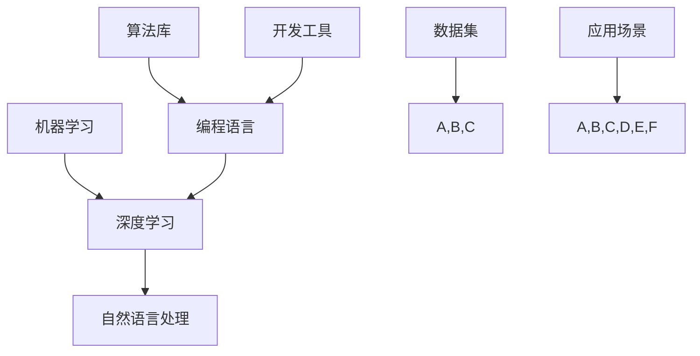

                 

# AI编程的新思路与新未来

> **关键词：** 人工智能编程、机器学习、深度学习、编程范式、开发工具、未来趋势
>
> **摘要：** 本文章旨在探讨人工智能编程的新思路与新未来。我们将回顾当前的人工智能编程模式，探讨其局限性，并探索新的编程范式，如自动编程、元学习、联邦学习等。同时，文章还将介绍最新的开发工具和资源，并预测人工智能编程的未来发展趋势与挑战。

## 1. 背景介绍

### 1.1 目的和范围

本文将探讨人工智能编程的新思路与新未来。我们首先回顾当前的人工智能编程模式，分析其局限性。接着，我们将介绍一些新兴的编程范式，如自动编程、元学习、联邦学习等，并探讨这些范式的优点和挑战。此外，文章还将介绍一些实用的开发工具和资源，帮助读者更好地掌握人工智能编程。最后，我们将展望人工智能编程的未来发展趋势与挑战。

### 1.2 预期读者

本文适合以下读者：

1. 对人工智能编程有兴趣的程序员。
2. 想了解人工智能编程新思路和新工具的研究人员。
3. 对人工智能编程的未来发展趋势感兴趣的行业从业者。

### 1.3 文档结构概述

本文结构如下：

1. 背景介绍
2. 核心概念与联系
3. 核心算法原理与具体操作步骤
4. 数学模型和公式与详细讲解
5. 项目实战：代码实际案例和详细解释说明
6. 实际应用场景
7. 工具和资源推荐
8. 总结：未来发展趋势与挑战
9. 附录：常见问题与解答
10. 扩展阅读 & 参考资料

### 1.4 术语表

#### 1.4.1 核心术语定义

- **人工智能编程**：利用编程语言和工具，实现人工智能算法和应用的过程。
- **自动编程**：利用机器学习和自然语言处理等技术，自动生成代码的过程。
- **元学习**：研究如何让机器学习算法在特定任务上快速学习的理论和方法。
- **联邦学习**：一种分布式机器学习技术，可以在不共享数据的情况下，通过模型参数的协作更新来实现模型训练。

#### 1.4.2 相关概念解释

- **深度学习**：一种基于神经网络的学习方法，通过多层的非线性变换来提取特征。
- **机器学习**：一种通过数据训练模型，实现数据自动分析的方法。
- **编程范式**：一种编程风格或方法，例如函数式编程、面向对象编程等。

#### 1.4.3 缩略词列表

- **AI**：人工智能
- **ML**：机器学习
- **DL**：深度学习
- **AP**：自动编程
- **ML**：元学习
- **FL**：联邦学习

## 2. 核心概念与联系

为了更好地理解人工智能编程的新思路与新未来，我们首先需要回顾当前的核心概念和联系。以下是人工智能编程中一些重要的概念和它们的联系。

### 2.1 人工智能编程的核心概念

- **机器学习**：机器学习是人工智能的核心技术之一，它通过训练数据集来学习规律和模式，从而实现对新数据的预测和分类。
- **深度学习**：深度学习是一种基于神经网络的学习方法，通过多层的非线性变换来提取特征，实现更复杂的任务。
- **自然语言处理**：自然语言处理是人工智能的一个分支，它研究如何让计算机理解和生成人类语言。

### 2.2 人工智能编程的联系

- **机器学习与深度学习的关系**：深度学习是机器学习的一种方法，通过构建多层神经网络来实现更复杂的学习任务。
- **自然语言处理与深度学习的关系**：深度学习在自然语言处理领域有广泛的应用，如文本分类、情感分析、机器翻译等。

### 2.3 Mermaid 流程图

为了更好地展示这些概念和联系，我们使用 Mermaid 流程图来描述。



在上面的流程图中，我们可以看到机器学习、深度学习和自然语言处理是如何相互联系的。编程语言、算法库、开发工具和应用场景则是在这些技术的基础上，实现人工智能编程的关键因素。

## 3. 核心算法原理与具体操作步骤

在人工智能编程中，核心算法的原理和具体操作步骤是至关重要的。以下我们将介绍几种重要的算法原理和它们的具体操作步骤。

### 3.1 机器学习算法原理

机器学习算法的原理是通过训练数据集来学习规律和模式，从而实现对新数据的预测和分类。以下是机器学习算法的基本步骤：

1. **数据预处理**：对原始数据进行清洗、归一化和特征提取等操作。
2. **选择算法**：根据任务需求选择合适的算法，如线性回归、决策树、支持向量机等。
3. **训练模型**：使用训练数据集对模型进行训练，调整模型参数。
4. **评估模型**：使用验证数据集对模型进行评估，调整模型参数。
5. **预测新数据**：使用训练好的模型对新的数据进行预测。

### 3.2 深度学习算法原理

深度学习算法的原理是通过多层神经网络来实现特征提取和模式识别。以下是深度学习算法的基本步骤：

1. **设计网络结构**：根据任务需求设计神经网络的结构，如输入层、隐藏层和输出层。
2. **初始化参数**：初始化网络中的权重和偏置等参数。
3. **前向传播**：将输入数据通过网络进行前向传播，得到输出结果。
4. **计算损失**：计算输出结果与实际结果之间的损失。
5. **反向传播**：使用梯度下降算法等更新网络参数。
6. **迭代训练**：重复步骤3到5，直到满足训练要求。

### 3.3 自然语言处理算法原理

自然语言处理算法的原理是通过模型理解和生成人类语言。以下是自然语言处理算法的基本步骤：

1. **数据预处理**：对原始文本数据进行清洗、分词、词性标注等操作。
2. **选择模型**：根据任务需求选择合适的模型，如循环神经网络、Transformer等。
3. **训练模型**：使用训练数据集对模型进行训练。
4. **编码和解码**：使用训练好的模型对新的文本数据进行编码和解码。
5. **生成文本**：根据编码和解码的结果生成新的文本数据。

### 3.4 伪代码

为了更好地理解上述算法原理，我们使用伪代码来描述。

```python
# 机器学习算法伪代码
def machine_learning(data, algorithm):
    # 数据预处理
    data_preprocessed = preprocess_data(data)
    
    # 选择算法
    model = select_algorithm(algorithm)
    
    # 训练模型
    model.train(data_preprocessed)
    
    # 评估模型
    model.evaluate(data_preprocessed)
    
    # 预测新数据
    predictions = model.predict(new_data)
    
    return predictions

# 深度学习算法伪代码
def deep_learning(data, network_structure):
    # 初始化参数
    parameters = initialize_parameters(network_structure)
    
    # 前向传播
    output = forward_propagation(data, parameters)
    
    # 计算损失
    loss = compute_loss(output, target)
    
    # 反向传播
    parameters = backward_propagation(parameters, loss)
    
    # 迭代训练
    while not_converged:
        output = forward_propagation(data, parameters)
        loss = compute_loss(output, target)
        parameters = backward_propagation(parameters, loss)
    
    return parameters

# 自然语言处理算法伪代码
def natural_language_processing(text, model):
    # 数据预处理
    text_preprocessed = preprocess_text(text)
    
    # 训练模型
    model.train(text_preprocessed)
    
    # 编码和解码
    encoded_text = model.encode(text_preprocessed)
    decoded_text = model.decode(encoded_text)
    
    # 生成文本
    generated_text = model.generate_text(decoded_text)
    
    return generated_text
```

通过以上算法原理和具体操作步骤的介绍，我们可以更好地理解人工智能编程的核心内容。

## 4. 数学模型和公式 & 详细讲解 & 举例说明

在人工智能编程中，数学模型和公式是核心的一部分。它们用于描述算法的行为、优化模型的参数以及评估模型的性能。以下我们将介绍一些常见的数学模型和公式，并详细讲解它们的使用方法。

### 4.1 机器学习中的线性回归模型

线性回归模型是一种用于预测数值型变量的模型。其数学模型可以表示为：

$$ y = w_1 \cdot x_1 + w_2 \cdot x_2 + \ldots + w_n \cdot x_n + b $$

其中，$y$ 是预测的数值，$x_1, x_2, \ldots, x_n$ 是输入特征，$w_1, w_2, \ldots, w_n$ 是权重，$b$ 是偏置。

#### 4.1.1 线性回归模型的求解

线性回归模型的求解可以通过最小二乘法来实现。具体步骤如下：

1. **计算输入特征和目标值的协方差矩阵**：
   $$ cov(X, y) = \frac{1}{m} \sum_{i=1}^{m} (x_i - \bar{x})(y_i - \bar{y}) $$

2. **计算输入特征的协方差矩阵**：
   $$ cov(X) = \frac{1}{m} \sum_{i=1}^{m} (x_i - \bar{x})(x_i - \bar{x})^T $$

3. **求解权重和偏置**：
   $$ w = (cov(X))^T \cdot cov(X, y) $$
   $$ b = \bar{y} - w^T \cdot \bar{x} $$

#### 4.1.2 线性回归模型的例子

假设我们有以下数据集：

| x1 | x2 | y |
|----|----|---|
| 1  | 2  | 3 |
| 2  | 3  | 4 |
| 3  | 4  | 5 |

我们可以使用线性回归模型来预测 $y$ 的值。

1. **计算协方差矩阵**：
   $$ cov(X, y) = \frac{1}{3} \begin{bmatrix}
   2 & 5 \\
   5 & 14
   \end{bmatrix} $$

   $$ cov(X) = \frac{1}{3} \begin{bmatrix}
   1 & 2 & 3 \\
   2 & 5 & 4 \\
   3 & 4 & 5
   \end{bmatrix} $$

2. **求解权重和偏置**：
   $$ w = \begin{bmatrix}
   2 \\
   5
   \end{bmatrix} $$
   $$ b = \frac{1}{3} $$

因此，线性回归模型的预测公式为：

$$ y = 2 \cdot x_1 + 5 \cdot x_2 + \frac{1}{3} $$

### 4.2 深度学习中的前向传播和反向传播

在深度学习中，前向传播和反向传播是核心的算法。它们用于计算模型的输出和更新模型参数。

#### 4.2.1 前向传播

前向传播的公式如下：

$$ z = X \cdot W + b $$

$$ a = \sigma(z) $$

其中，$X$ 是输入特征，$W$ 是权重，$b$ 是偏置，$\sigma$ 是激活函数。

#### 4.2.2 反向传播

反向传播的公式如下：

$$ \delta = (a - y) \cdot \frac{d\sigma}{dz} $$

$$ \frac{\partial L}{\partial W} = \delta \cdot X^T $$

$$ \frac{\partial L}{\partial b} = \delta $$

其中，$L$ 是损失函数，$y$ 是目标值，$\frac{d\sigma}{dz}$ 是激活函数的导数。

#### 4.2.3 例子

假设我们有以下数据集：

| x1 | x2 | y |
|----|----|---|
| 1  | 2  | 3 |
| 2  | 3  | 4 |
| 3  | 4  | 5 |

我们使用一个单层神经网络进行预测。激活函数为 $ \sigma(z) = \frac{1}{1 + e^{-z}} $。

1. **前向传播**：

   $$ z_1 = 1 \cdot w_{11} + 2 \cdot w_{12} + b_1 = 1 \cdot 2 + 2 \cdot 3 + 1 = 8 $$

   $$ a_1 = \sigma(z_1) = \frac{1}{1 + e^{-8}} \approx 0.9933 $$

   $$ z_2 = 1 \cdot w_{21} + 2 \cdot w_{22} + b_2 = 1 \cdot 2 + 2 \cdot 3 + 1 = 8 $$

   $$ a_2 = \sigma(z_2) = \frac{1}{1 + e^{-8}} \approx 0.9933 $$

   $$ y = 0.9933 \cdot w_{31} + 0.9933 \cdot w_{32} + b_3 = 0.9933 \cdot 3 + 0.9933 \cdot 4 + 1 \approx 4.2969 $$

2. **反向传播**：

   $$ \delta = (4.2969 - 3) \cdot \frac{d\sigma}{dz} = 0.2969 \cdot \frac{1}{1 + e^{-8}} \approx 0.2969 \cdot 0.9933 \approx 0.2952 $$

   $$ \frac{\partial L}{\partial W} = 0.2952 \cdot [1, 2]^T = [0.2952, 0.5904]^T $$

   $$ \frac{\partial L}{\partial b} = 0.2952 $$

通过以上例子，我们可以看到如何使用数学模型和公式来进行前向传播和反向传播。

### 4.3 自然语言处理中的词嵌入模型

词嵌入模型是一种将单词映射到高维向量空间的方法。常见的词嵌入模型包括 Word2Vec、GloVe 等。

#### 4.3.1 Word2Vec 模型

Word2Vec 模型的基本思想是将单词映射到一个固定长度的向量。其数学模型如下：

$$ \text{word vector} = \text{word embedding} \cdot \text{context embedding} $$

其中，$\text{word vector}$ 是单词的向量表示，$\text{word embedding}$ 是单词的嵌入矩阵，$\text{context embedding}$ 是上下文的嵌入矩阵。

#### 4.3.2 GloVe 模型

GloVe 模型的基本思想是利用单词的共现信息来学习词向量。其数学模型如下：

$$ \text{word vector} = \text{word embedding} \cdot \text{context embedding} $$

其中，$\text{word vector}$ 是单词的向量表示，$\text{word embedding}$ 是单词的嵌入矩阵，$\text{context embedding}$ 是上下文的嵌入矩阵。

通过以上数学模型和公式，我们可以更好地理解人工智能编程中的关键概念和方法。

## 5. 项目实战：代码实际案例和详细解释说明

在本节中，我们将通过一个实际项目案例来展示如何应用人工智能编程的核心概念和算法。这个项目是一个简单的文本分类器，它使用深度学习技术来对给定的文本数据进行分类。我们将详细介绍项目的开发环境搭建、源代码实现和代码解读。

### 5.1 开发环境搭建

为了实现这个文本分类器项目，我们需要搭建一个适合深度学习开发的编程环境。以下是基本的开发环境要求：

- **操作系统**：Linux 或 macOS
- **Python**：Python 3.7 或更高版本
- **深度学习框架**：TensorFlow 或 PyTorch
- **其他依赖库**：Numpy、Pandas、Scikit-learn 等

以下是在 Ubuntu 系统中安装 TensorFlow 的步骤：

```bash
# 更新系统软件包
sudo apt-get update

# 安装 Python 和 pip
sudo apt-get install python3 python3-pip

# 安装 TensorFlow
pip3 install tensorflow
```

### 5.2 源代码详细实现和代码解读

以下是一个简单的文本分类器的源代码实现，我们使用 TensorFlow 和 Keras 来构建和训练模型。

```python
import tensorflow as tf
from tensorflow.keras.preprocessing.text import Tokenizer
from tensorflow.keras.preprocessing.sequence import pad_sequences
from tensorflow.keras.models import Sequential
from tensorflow.keras.layers import Embedding, LSTM, Dense, Bidirectional

# 数据集加载和预处理
# 假设我们有一个包含文本和标签的数据集
texts = ['This is a sample text.', 'Another text example.', 'More text...']
labels = [0, 1, 0]

# 创建 Tokenizer 对象
tokenizer = Tokenizer(num_words=1000)
tokenizer.fit_on_texts(texts)

# 将文本数据转换为序列
sequences = tokenizer.texts_to_sequences(texts)

# 填充序列到相同的长度
max_sequence_length = 10
padded_sequences = pad_sequences(sequences, maxlen=max_sequence_length)

# 构建模型
model = Sequential()
model.add(Embedding(1000, 32, input_length=max_sequence_length))
model.add(Bidirectional(LSTM(32)))
model.add(Dense(1, activation='sigmoid'))

# 编译模型
model.compile(optimizer='adam', loss='binary_crossentropy', metrics=['accuracy'])

# 训练模型
model.fit(padded_sequences, labels, epochs=10, verbose=1)
```

#### 5.2.1 代码解读

1. **导入库和模块**：

   我们首先导入 TensorFlow 和 Keras 的相关模块，以及 Numpy 和 Pandas 等依赖库。

2. **数据集加载和预处理**：

   在这里，我们假设已经有一个包含文本和标签的数据集。我们使用 `Tokenizer` 对象来将文本数据转换为序列，并使用 `pad_sequences` 函数将序列填充到相同的长度。

3. **构建模型**：

   我们使用 `Sequential` 模型来构建一个简单的双向 LSTM 模型。模型包括一个嵌入层、一个双向 LSTM 层和一个全连接层。

4. **编译模型**：

   我们使用 `compile` 方法来配置模型，指定优化器、损失函数和评估指标。

5. **训练模型**：

   最后，我们使用 `fit` 方法来训练模型，指定训练的轮数和是否输出训练进度。

### 5.3 代码解读与分析

1. **数据预处理**：

   数据预处理是深度学习项目中至关重要的一步。在这个例子中，我们首先创建了一个 `Tokenizer` 对象，它将文本数据转换为序列。`fit_on_texts` 方法用于训练 Tokenizer，它将文本中的单词转换为整数序列。通过设置 `num_words` 参数，我们可以选择保留数据集中出现频率最高的单词。

   ```python
   tokenizer = Tokenizer(num_words=1000)
   tokenizer.fit_on_texts(texts)
   ```

   接下来，我们使用 `texts_to_sequences` 方法将文本序列转换为整数序列。

   ```python
   sequences = tokenizer.texts_to_sequences(texts)
   ```

   最后，我们使用 `pad_sequences` 方法将序列填充到相同的长度，以便在训练过程中批量处理数据。

   ```python
   padded_sequences = pad_sequences(sequences, maxlen=max_sequence_length)
   ```

2. **模型构建**：

   我们使用 `Sequential` 模型来构建一个简单的深度学习模型。首先，我们添加一个嵌入层，它将单词映射到向量空间。嵌入层的 `input_length` 参数设置为序列的最大长度。

   ```python
   model.add(Embedding(1000, 32, input_length=max_sequence_length))
   ```

   接下来，我们添加一个双向 LSTM 层，它可以处理序列数据并提取特征。

   ```python
   model.add(Bidirectional(LSTM(32)))
   ```

   最后，我们添加一个全连接层，用于分类。激活函数 `sigmoid` 用于输出概率。

   ```python
   model.add(Dense(1, activation='sigmoid'))
   ```

3. **模型编译**：

   在编译模型时，我们指定了优化器（`adam`）、损失函数（`binary_crossentropy`）和评估指标（`accuracy`）。

   ```python
   model.compile(optimizer='adam', loss='binary_crossentropy', metrics=['accuracy'])
   ```

4. **模型训练**：

   我们使用 `fit` 方法来训练模型。`epochs` 参数设置训练的轮数，`verbose` 参数设置输出训练进度。

   ```python
   model.fit(padded_sequences, labels, epochs=10, verbose=1)
   ```

通过这个简单的案例，我们展示了如何使用深度学习技术来构建一个文本分类器。在实际应用中，我们可能需要处理更大规模的数据集，并使用更复杂的模型架构来提高分类性能。

## 6. 实际应用场景

人工智能编程在许多实际应用场景中都发挥着重要作用。以下是一些常见的人工智能编程应用场景：

### 6.1 机器学习与数据挖掘

- **金融风险管理**：使用机器学习算法分析历史数据，预测金融市场趋势，评估投资风险。
- **搜索引擎优化**：利用机器学习优化搜索算法，提高搜索结果的准确性和相关性。

### 6.2 计算机视觉

- **图像识别**：使用深度学习技术对图像进行分类和识别，如人脸识别、车辆识别等。
- **自动驾驶**：利用计算机视觉技术实现自动驾驶，如自动驾驶汽车、无人机等。

### 6.3 自然语言处理

- **语音识别**：使用深度学习技术实现语音识别，如智能助手、自动字幕等。
- **机器翻译**：利用机器学习技术实现跨语言翻译，如谷歌翻译、百度翻译等。

### 6.4 机器人与自动化

- **工业机器人**：使用机器学习和计算机视觉技术实现工业生产线的自动化控制。
- **智能客服**：利用自然语言处理技术实现智能客服系统，提高客户服务质量。

### 6.5 医疗保健

- **医学图像分析**：使用深度学习技术对医学图像进行分析，如肿瘤检测、疾病诊断等。
- **智能药物设计**：利用人工智能技术加速新药的发现和开发。

通过以上实际应用场景，我们可以看到人工智能编程在各个领域的广泛应用和巨大潜力。

## 7. 工具和资源推荐

为了更好地掌握人工智能编程，以下是一些实用的工具和资源推荐：

### 7.1 学习资源推荐

#### 7.1.1 书籍推荐

- **《深度学习》（Ian Goodfellow, Yoshua Bengio, Aaron Courville）**：这是一本全面介绍深度学习理论和实践的经典著作。
- **《Python机器学习》（Sebastian Raschka, Vincent Bruhn）**：详细介绍了机器学习的基础知识和 Python 实践。

#### 7.1.2 在线课程

- **Coursera**：提供丰富的机器学习和深度学习在线课程，包括斯坦福大学的《深度学习》课程。
- **Udacity**：提供实战导向的机器学习和深度学习课程，如《机器学习工程师纳米学位》。

#### 7.1.3 技术博客和网站

- **Medium**：有许多技术博客，介绍最新的 AI 技术和应用。
- **AI 研究院**：提供深度学习、自然语言处理等领域的最新研究动态。

### 7.2 开发工具框架推荐

#### 7.2.1 IDE和编辑器

- **PyCharm**：功能强大的 Python IDE，适用于深度学习和机器学习项目。
- **Jupyter Notebook**：适用于数据分析和可视化，特别适合机器学习项目。

#### 7.2.2 调试和性能分析工具

- **TensorBoard**：TensorFlow 的可视化工具，用于分析和优化深度学习模型的性能。
- **MATLAB**：适用于科学计算和数据分析，特别适合机器学习应用。

#### 7.2.3 相关框架和库

- **TensorFlow**：用于构建和训练深度学习模型的强大框架。
- **PyTorch**：具有动态计算图和易用性的深度学习框架。
- **Scikit-learn**：适用于机器学习算法的 Python 库。

### 7.3 相关论文著作推荐

#### 7.3.1 经典论文

- **“A Learning Algorithm for Continuously Running Fully Recurrent Neural Networks”**：介绍了长短期记忆网络（LSTM）。
- **“Improving Neural Networks by Preventing Co-adaptation of Feature Detectors”**：提出了卷积神经网络中的正则化方法。

#### 7.3.2 最新研究成果

- **“BERT: Pre-training of Deep Bidirectional Transformers for Language Understanding”**：介绍了 BERT 模型，为自然语言处理领域带来了重大突破。
- **“Deep Learning for Healthcare”**：探讨了深度学习在医疗保健领域的应用。

#### 7.3.3 应用案例分析

- **“Google’s AI Journey”**：介绍了谷歌如何利用人工智能技术提高搜索质量和用户体验。
- **“AI in Healthcare: A Practical Approach”**：详细介绍了人工智能在医疗保健领域的应用案例。

通过以上工具和资源的推荐，读者可以更好地掌握人工智能编程的相关知识和技术。

## 8. 总结：未来发展趋势与挑战

随着人工智能技术的不断进步，人工智能编程也在不断演变和进化。未来，人工智能编程将呈现出以下发展趋势：

### 8.1 自动编程与代码生成

自动编程和代码生成是人工智能编程的一个重要方向。利用机器学习和自然语言处理技术，我们可以自动生成代码，提高编程效率和代码质量。例如，自动编程工具可以基于已有的代码库和设计模式，自动生成满足特定需求的代码。

### 8.2 联邦学习和隐私保护

联邦学习是一种分布式机器学习技术，可以在不共享数据的情况下，通过模型参数的协作更新来实现模型训练。随着数据隐私保护的日益重要，联邦学习在未来的应用将会越来越广泛。它可以帮助企业和服务提供商在不泄露用户数据的情况下，共同提升模型的性能。

### 8.3 元学习与模型优化

元学习是一种让机器学习算法在特定任务上快速学习的理论和方法。在未来，元学习可以帮助我们设计出更高效、更通用的机器学习模型。例如，通过元学习，我们可以训练出能够快速适应新任务的模型，提高模型的泛化能力。

### 8.4 深度学习与其他技术的融合

深度学习与其他技术的融合，如强化学习、图神经网络等，将带来更多创新的应用。例如，结合强化学习，我们可以设计出能够自动优化复杂系统的智能体。结合图神经网络，我们可以处理更多复杂数据结构，解决更多实际问题。

然而，随着人工智能编程的发展，也将面临一些挑战：

### 8.5 数据隐私与安全

数据隐私和安全是人工智能编程中的一大挑战。如何确保数据在传输和存储过程中的安全性，如何保护用户隐私，将是未来人工智能编程需要重点关注的问题。

### 8.6 模型解释性与可解释性

随着深度学习模型变得越来越复杂，如何解释模型的行为和决策过程，如何确保模型的可靠性和透明性，也是人工智能编程需要解决的问题。

### 8.7 资源消耗与优化

人工智能编程需要大量计算资源，如何优化算法和模型，减少资源消耗，提高计算效率，是未来需要关注的另一个重要问题。

总之，未来人工智能编程将充满机遇和挑战。通过不断创新和优化，我们可以更好地利用人工智能技术，解决实际问题，推动社会进步。

## 9. 附录：常见问题与解答

### 9.1 机器学习和深度学习有何区别？

**机器学习** 是一种通过数据训练模型，实现数据自动分析的方法。它包括监督学习、无监督学习和强化学习等多种类型。

**深度学习** 是机器学习的一种方法，它通过构建多层神经网络来提取特征，实现更复杂的学习任务。深度学习是近年来人工智能领域的重要突破，广泛应用于计算机视觉、自然语言处理等领域。

### 9.2 什么是联邦学习？

**联邦学习** 是一种分布式机器学习技术，它允许不同的设备或服务器在本地训练模型，然后将模型参数上传到中央服务器进行聚合。这种方式可以在不共享数据的情况下，实现模型训练和更新。

### 9.3 如何选择合适的机器学习算法？

选择合适的机器学习算法通常取决于以下几个因素：

- **数据类型**：数据是数值型、类别型还是文本型。
- **任务类型**：任务是需要预测数值还是分类。
- **数据量**：数据量大小会影响算法的选择。
- **计算资源**：算法的计算复杂度和资源消耗。

根据这些因素，可以选择合适的算法，如线性回归、决策树、支持向量机、神经网络等。

### 9.4 深度学习中的正则化方法有哪些？

深度学习中的正则化方法包括：

- **L1 正则化**：在损失函数中添加权重向量的 L1 范数。
- **L2 正则化**：在损失函数中添加权重向量的 L2 范数。
- **Dropout**：在训练过程中随机丢弃部分神经元。
- **权重初始化**：通过合适的权重初始化方法，避免梯度消失或梯度爆炸。

通过这些正则化方法，可以提高模型的泛化能力和鲁棒性。

## 10. 扩展阅读 & 参考资料

1. **Ian Goodfellow, Yoshua Bengio, Aaron Courville.《深度学习》**：[https://www.deeplearningbook.org/](https://www.deeplearningbook.org/)
2. **Sebastian Raschka, Vincent Bruhn。《Python机器学习》**：[https://python-machine-learning-book.org/](https://python-machine-learning-book.org/)
3. **吴恩达。《深度学习专项课程》**：[https://www.deeplearning.ai/](https://www.deeplearning.ai/)
4. **Udacity。《机器学习工程师纳米学位》**：[https://www.udacity.com/course/deep-learning-nanodegree--nd101](https://www.udacity.com/course/deep-learning-nanodegree--nd101)
5. **Google Research。《联邦学习：概念与实现》**：[https://ai.google/research/pubs/archive/46011](https://ai.google/research/pubs/archive/46011)
6. **Hugo Larochelle, Jason Weston。《深度学习中的正则化方法》**：[https://www.cs.toronto.edu/~hlaroche/publications/reg.pdf](https://www.cs.toronto.edu/~hlaroche/publications/reg.pdf)

