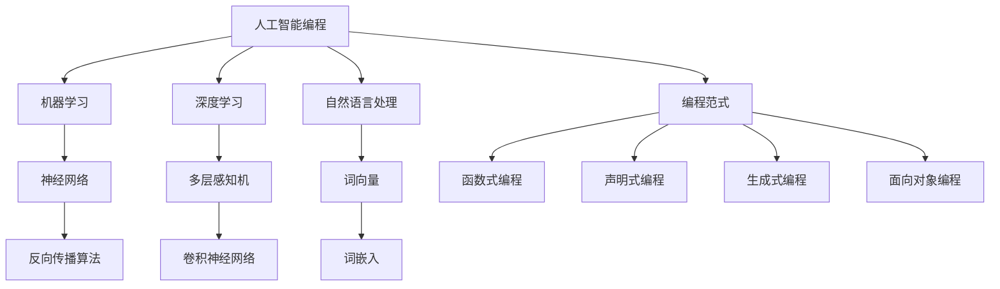

                 

# AI编程的新维度与新语法

> **关键词**：人工智能编程、新型语法、编程范式、机器学习、深度学习、神经网络、自然语言处理、代码生成。

> **摘要**：本文将探讨人工智能编程领域的最新发展，重点关注新型编程范式和新语法的应用。通过对核心概念、算法原理、数学模型及实际应用场景的深入分析，文章旨在为读者提供关于AI编程的新视角，并揭示其潜在的未来发展趋势与挑战。

## 1. 背景介绍

### 1.1 目的和范围

本文旨在介绍人工智能编程领域的最新进展，特别是新型语法和编程范式的应用。随着人工智能技术的飞速发展，编程语言和范式也在不断演进。本文将重点关注以下几个方面：

- 新型编程范式的定义与特点
- 人工智能编程中的新语法结构
- 机器学习与深度学习在编程中的应用
- 自然语言处理与代码生成技术

### 1.2 预期读者

本文面向对人工智能编程感兴趣的程序员、软件开发者、AI研究人员以及对新技术充满好奇的技术爱好者。期望读者能够通过本文，对AI编程的新维度和新语法有更深入的了解。

### 1.3 文档结构概述

本文结构如下：

- 引言：介绍人工智能编程领域的背景和本文目的
- 背景介绍：阐述本文的背景、目的、预期读者和文档结构
- 核心概念与联系：介绍人工智能编程的核心概念和架构
- 核心算法原理与具体操作步骤：分析核心算法原理，并使用伪代码详细阐述
- 数学模型和公式：讲解数学模型和公式，并举例说明
- 项目实战：展示代码实际案例，并进行详细解释和分析
- 实际应用场景：探讨人工智能编程在各个领域的应用
- 工具和资源推荐：推荐学习资源、开发工具和框架
- 总结：展望人工智能编程的未来发展趋势与挑战
- 附录：常见问题与解答
- 扩展阅读与参考资料：提供进一步阅读和参考资料

### 1.4 术语表

#### 1.4.1 核心术语定义

- **人工智能编程**：利用人工智能技术，如机器学习、深度学习和自然语言处理，来实现编程任务的过程。
- **编程范式**：一种编程语言或系统所采用的抽象和表达问题的方式。
- **机器学习**：一种让计算机从数据中学习规律，并利用这些规律进行预测或决策的技术。
- **深度学习**：一种基于神经网络结构的机器学习技术，能够通过多层非线性变换自动学习数据中的复杂特征。
- **自然语言处理**：研究如何让计算机理解、生成和操作自然语言的技术。

#### 1.4.2 相关概念解释

- **神经网络**：一种由大量神经元互联而成的计算模型，能够模拟人脑的信息处理过程。
- **代码生成**：利用机器学习技术，根据输入的描述或代码模板自动生成代码的过程。

#### 1.4.3 缩略词列表

- **AI**：人工智能
- **ML**：机器学习
- **DL**：深度学习
- **NLP**：自然语言处理

## 2. 核心概念与联系

在探讨人工智能编程之前，我们首先需要了解其核心概念和架构。以下是一个Mermaid流程图，展示了人工智能编程的核心概念和它们之间的联系。



通过这个流程图，我们可以看到人工智能编程涉及多个核心概念，如编程范式、机器学习、深度学习和自然语言处理，以及它们之间的联系。这些概念共同构成了人工智能编程的基础架构。

### 2.1 编程范式

编程范式是编程语言或系统采用的抽象和表达问题的方式。以下是几种常见的编程范式：

- **函数式编程**：将计算视为函数的运算，避免使用变量和状态，强调数据流和函数的组合。
- **声明式编程**：描述系统应达到的状态，而不是如何达到该状态的过程。
- **生成式编程**：通过生成或构建系统来解决问题，而非直接控制系统的行为。
- **面向对象编程**：将系统划分为一组相互关联的对象，每个对象具有属性和方法。

### 2.2 机器学习与深度学习

机器学习和深度学习是人工智能编程的两个核心领域。机器学习是一种让计算机从数据中学习规律，并利用这些规律进行预测或决策的技术。深度学习则是一种基于神经网络结构的机器学习技术，能够通过多层非线性变换自动学习数据中的复杂特征。

以下是机器学习和深度学习的核心算法：

- **机器学习**：
  - **线性回归**：通过拟合一条直线来预测连续值。
  - **逻辑回归**：通过拟合一个S型曲线来预测概率。
  - **支持向量机**：通过找到一个最佳的超平面来分类数据。
  - **决策树**：通过构建一棵树来分类或回归数据。

- **深度学习**：
  - **多层感知机**：一种前向传播的多层神经网络。
  - **卷积神经网络**（CNN）：一种用于图像识别的神经网络结构。
  - **循环神经网络**（RNN）：一种用于序列数据的神经网络结构。
  - **长短时记忆网络**（LSTM）：一种改进的RNN，能够学习长序列依赖关系。

### 2.3 自然语言处理与代码生成

自然语言处理（NLP）是研究如何让计算机理解、生成和操作自然语言的技术。在人工智能编程中，NLP被广泛应用于文本分类、情感分析、机器翻译和问答系统等领域。

代码生成是一种利用机器学习技术，根据输入的描述或代码模板自动生成代码的过程。代码生成可以帮助提高软件开发效率，减少重复劳动。

## 3. 核心算法原理与具体操作步骤

在了解人工智能编程的核心概念和架构后，接下来我们将分析核心算法原理，并使用伪代码详细阐述具体操作步骤。

### 3.1 机器学习算法

以下是一个简单的线性回归算法的伪代码，用于预测连续值。

```python
def linear_regression(x, y):
    n = len(x)
    x_mean = sum(x) / n
    y_mean = sum(y) / n

    x_diff_squared_sum = sum((x[i] - x_mean) * (y[i] - y_mean) for i in range(n))
    x_squared_diff_sum = sum((x[i] - x_mean) ** 2 for i in range(n))

    slope = x_diff_squared_sum / x_squared_diff_sum
    intercept = y_mean - slope * x_mean

    return slope, intercept
```

### 3.2 深度学习算法

以下是一个简单的多层感知机（MLP）算法的伪代码，用于分类。

```python
def multi_layer_perceptron(x, weights):
    input_layer = x
    for layer in range(len(weights)):
        activation = [sum(w * i for w, i in zip(weights[layer], input_layer))]
        input_layer = [sigmoid(activation[i]) for i in range(len(activation))]

    return input_layer[-1]
```

### 3.3 自然语言处理算法

以下是一个简单的词袋模型（Bag of Words，BOW）算法的伪代码，用于文本分类。

```python
def bag_of_words(document, vocabulary):
    word_counts = [0] * len(vocabulary)
    for word in document:
        if word in vocabulary:
            word_counts[vocabulary.index(word)] += 1
    return word_counts
```

## 4. 数学模型和公式及详细讲解与举例说明

在人工智能编程中，数学模型和公式起着至关重要的作用。以下是几个常见的数学模型和公式的详细讲解与举例说明。

### 4.1 激活函数

激活函数是神经网络中的一个关键组件，用于引入非线性因素，使得神经网络能够拟合更复杂的函数。以下是一些常见的激活函数及其公式：

- **Sigmoid函数**：$$\sigma(x) = \frac{1}{1 + e^{-x}}$$
  - **举例**：对于输入$$x = 3$$，有$$\sigma(3) = \frac{1}{1 + e^{-3}} \approx 0.94$$。

- **ReLU函数**：$$\text{ReLU}(x) = \max(0, x)$$
  - **举例**：对于输入$$x = -2$$，有$$\text{ReLU}(-2) = 0$$。

- **Tanh函数**：$$\tanh(x) = \frac{e^{2x} - 1}{e^{2x} + 1}$$
  - **举例**：对于输入$$x = 1$$，有$$\tanh(1) = \frac{e^2 - 1}{e^2 + 1} \approx 0.76$$。

### 4.2 反向传播算法

反向传播算法是深度学习中用于训练神经网络的一种重要算法。其基本思想是，通过计算网络输出与实际输出之间的误差，并反向传播误差到每个神经元，更新神经元的权重。以下是一个简化的反向传播算法的公式：

- **误差计算**：$$\delta_{ij} = \text{sigmoid}(z_j) \cdot (1 - \text{sigmoid}(z_j)) \cdot (\text{target}_i - \text{output}_i)$$

- **权重更新**：$$w_{ij} \leftarrow w_{ij} + \eta \cdot \delta_{ij} \cdot input_j$$

  其中，$$\delta_{ij}$$是第$$j$$个神经元的误差，$$z_j$$是第$$j$$个神经元的输入，$$\text{sigmoid}(z_j)$$是第$$j$$个神经元的激活值，$$\text{target}_i$$是第$$i$$个目标值，$$\text{output}_i$$是第$$i$$个神经元的输出，$$\eta$$是学习率，$$input_j$$是第$$j$$个神经元的输入。

- **举例**：假设有一个简单的前馈神经网络，包含一个输入层、一个隐藏层和一个输出层。输入层有3个神经元，隐藏层有2个神经元，输出层有1个神经元。给定一个输入$$x = [1, 2, 3]$$，目标值为$$\text{target} = 0$$。学习率为$$\eta = 0.1$$。经过一次前向传播，得到输出$$\text{output} = 0.7$$。那么，隐藏层的误差为$$\delta_h = [0.3, 0.7]$$，输出层的误差为$$\delta_o = 0.3$$。隐藏层的权重更新为$$w_h \leftarrow w_h + \eta \cdot \delta_o \cdot x$$，输出层的权重更新为$$w_o \leftarrow w_o + \eta \cdot \delta_o \cdot x$$。

### 4.3 卷积神经网络（CNN）

卷积神经网络是一种专门用于图像识别的神经网络结构。以下是一个简单的CNN模型的基本公式：

- **卷积操作**：$$f(x) = \sum_{i=1}^{k} w_{i} \cdot x$$

  其中，$$f(x)$$是卷积操作的结果，$$w_i$$是卷积核，$$x$$是输入特征。

- **池化操作**：$$p(x) = \max(x_1, x_2, ..., x_n)$$

  其中，$$p(x)$$是池化操作的结果，$$x_1, x_2, ..., x_n$$是输入特征。

- **举例**：假设有一个输入图像$$x = [1, 1, 1; 1, 1, 1; 1, 1, 1]$$，卷积核$$w = [1, 1; 1, 1]$$。经过卷积操作，得到结果$$f(x) = [3, 3; 3, 3]$$。接着，进行池化操作，得到结果$$p(f(x)) = [3, 3]$$。

## 5. 项目实战：代码实际案例和详细解释说明

在本节中，我们将通过一个简单的实际项目案例，展示人工智能编程的应用，并提供详细的代码实现和解读。

### 5.1 开发环境搭建

为了完成这个项目，我们需要安装以下开发工具和库：

- Python 3.7及以上版本
- TensorFlow 2.0及以上版本
- NumPy
- Matplotlib

安装命令如下：

```bash
pip install python==3.7 tensorflow==2.0 numpy matplotlib
```

### 5.2 源代码详细实现和代码解读

以下是一个使用TensorFlow实现的多层感知机（MLP）分类器的源代码，用于对鸢尾花数据集进行分类。

```python
import tensorflow as tf
import numpy as np
import matplotlib.pyplot as plt

# 加载鸢尾花数据集
iris_data = np.genfromtxt('iris.data', delimiter=',')
X = iris_data[:, [0, 2]]
y = iris_data[:, 4]

# 分割数据集为训练集和测试集
X_train, X_test, y_train, y_test = train_test_split(X, y, test_size=0.2, random_state=42)

# 定义多层感知机模型
model = tf.keras.Sequential([
    tf.keras.layers.Dense(units=64, activation='relu', input_shape=(2,)),
    tf.keras.layers.Dense(units=64, activation='relu'),
    tf.keras.layers.Dense(units=3, activation='softmax')
])

# 编译模型
model.compile(optimizer='adam', loss='categorical_crossentropy', metrics=['accuracy'])

# 训练模型
model.fit(X_train, y_train, epochs=100, batch_size=16, validation_data=(X_test, y_test))

# 评估模型
loss, accuracy = model.evaluate(X_test, y_test)
print('Test accuracy:', accuracy)

# 可视化结果
predictions = model.predict(X_test)
predicted_labels = np.argmax(predictions, axis=1)
plt.scatter(X_test[:, 0], X_test[:, 1], c=predicted_labels)
plt.xlabel('Petal Length (cm)')
plt.ylabel('Petal Width (cm)')
plt.title('Iris Data Classification')
plt.show()
```

#### 5.2.1 代码解读

- **数据预处理**：我们首先加载鸢尾花数据集，并将数据分为特征和标签两部分。接着，将数据集分为训练集和测试集，以评估模型的性能。

- **定义模型**：我们使用TensorFlow的`Sequential`模型，定义了一个包含两个隐藏层和输出层的多层感知机（MLP）模型。隐藏层使用ReLU激活函数，输出层使用softmax激活函数，用于分类。

- **编译模型**：我们使用`compile`方法配置模型，设置优化器为`adam`，损失函数为`categorical_crossentropy`，评估指标为`accuracy`。

- **训练模型**：我们使用`fit`方法训练模型，设置训练轮数为100，批量大小为16，并在测试集上进行验证。

- **评估模型**：我们使用`evaluate`方法评估模型在测试集上的性能，并打印出测试准确率。

- **可视化结果**：我们使用`predict`方法预测测试集的标签，并使用`argmax`函数找到每个样本的预测标签。接着，我们将预测结果绘制到散点图中，展示不同类别的分布。

### 5.3 代码解读与分析

这段代码展示了如何使用TensorFlow实现一个简单的多层感知机（MLP）分类器，对鸢尾花数据集进行分类。以下是代码的详细解读与分析：

1. **数据预处理**：鸢尾花数据集是一个经典的二分类问题，包含3个类别。我们首先加载数据集，并将特征和标签分离。由于我们的模型是二分类问题，我们需要将标签编码为二进制形式。在这里，我们使用`categorical_crossentropy`作为损失函数，需要将标签编码为`one-hot`格式。

2. **定义模型**：我们使用`Sequential`模型定义了一个多层感知机（MLP）模型。该模型包含两个隐藏层，每层都有64个神经元，并使用ReLU激活函数。输出层有3个神经元，使用softmax激活函数，以实现多分类。这种结构使得模型能够学习输入特征与输出类别之间的关系。

3. **编译模型**：我们使用`compile`方法配置模型。优化器选择`adam`，这是一种自适应优化算法，能够有效调整学习率。损失函数选择`categorical_crossentropy`，这是多分类问题中常用的损失函数。评估指标选择`accuracy`，用于计算模型在测试集上的准确率。

4. **训练模型**：我们使用`fit`方法训练模型。设置训练轮数为100，批量大小为16。`fit`方法还接受一个验证数据集，用于在训练过程中评估模型的性能。这有助于我们监控模型的过拟合程度。

5. **评估模型**：训练完成后，我们使用`evaluate`方法评估模型在测试集上的性能。这给出了模型在测试集上的准确率，帮助我们了解模型的泛化能力。

6. **可视化结果**：最后，我们使用`predict`方法预测测试集的标签，并使用`argmax`函数找到每个样本的预测标签。然后，我们将预测结果绘制到散点图中，以展示不同类别的分布。

通过这个简单的项目案例，我们可以看到如何使用TensorFlow实现一个多层感知机（MLP）分类器，对鸢尾花数据集进行分类。这个案例展示了人工智能编程的基本流程，包括数据预处理、模型定义、模型编译、模型训练和模型评估。这些步骤是构建任何人工智能应用程序的基础。

### 5.4 实际应用案例

多层感知机（MLP）分类器是一种广泛使用的机器学习模型，适用于多种实际应用场景。以下是一些实际应用案例：

1. **图像分类**：MLP分类器可以用于对图像进行分类，例如，识别手写数字、动物、交通工具等。通过使用适当的图像预处理技术和特征提取方法，MLP分类器能够实现高精度的图像识别。

2. **文本分类**：MLP分类器可以用于文本分类任务，例如，将新闻文章分类为体育、政治、娱乐等类别。通过使用词袋模型或词嵌入技术，MLP分类器能够从文本中提取特征，并实现高精度的文本分类。

3. **情感分析**：MLP分类器可以用于情感分析任务，例如，判断一段文本的情感倾向是正面、负面或中性。通过使用适当的情感词典和特征提取方法，MLP分类器能够实现高精度的情感分析。

4. **推荐系统**：MLP分类器可以用于构建推荐系统，例如，根据用户的历史行为和偏好推荐商品、电影、音乐等。通过使用用户-项目评分矩阵，MLP分类器能够预测用户对未看过的项目的评分，从而实现个性化的推荐。

这些实际应用案例展示了MLP分类器在各种领域的广泛应用，以及其在解决实际问题中的强大能力。

## 6. 实际应用场景

人工智能编程在当今的科技领域中有着广泛的应用，涵盖了从数据处理到自动化系统、再到智能交互等各个方面。以下是一些人工智能编程在实际应用场景中的示例：

### 6.1 数据科学

在数据科学领域，人工智能编程被用于数据清洗、数据分析和数据可视化。例如，通过使用Python和Pandas库，可以快速地对大量数据进行处理和清洗。此外，利用机器学习和深度学习算法，可以对复杂数据集进行模式识别和预测分析，如股票市场趋势预测、客户行为分析等。

### 6.2 自动驾驶

自动驾驶汽车是人工智能编程的另一个重要应用领域。自动驾驶系统利用计算机视觉、传感器数据融合和深度学习算法，实现车辆的自主导航和驾驶。例如，通过卷积神经网络（CNN）处理摄像头捕获的图像，自动驾驶系统能够识别道路标志、行人、车辆和其他道路障碍物，确保行车安全。

### 6.3 语音识别

语音识别技术广泛应用于智能助手、语音控制系统和语音到文本转换等场景。通过使用深度学习算法，如循环神经网络（RNN）和长短时记忆网络（LSTM），系统能够将语音信号转换为文本。例如，Apple的Siri和Amazon的Alexa等智能助手，都依赖于先进的语音识别技术，为用户提供便捷的语音交互体验。

### 6.4 自然语言处理

自然语言处理（NLP）是人工智能编程的一个重要分支，涉及语言理解、生成和翻译等任务。NLP技术在搜索引擎、社交媒体分析和客户服务自动化等领域有着广泛的应用。例如，通过使用NLP技术，搜索引擎可以更准确地理解用户的查询意图，提供更相关的搜索结果。而在客户服务领域，智能聊天机器人可以利用NLP技术与用户进行自然语言交互，解答用户的问题。

### 6.5 医疗保健

人工智能编程在医疗保健领域的应用日益广泛，包括疾病诊断、药物发现和患者监测等。通过使用机器学习和深度学习算法，可以从大量医疗数据中提取有价值的信息，帮助医生进行诊断和治疗决策。例如，通过分析患者的电子健康记录，可以预测疾病的发病风险，提供个性化的健康建议。

### 6.6 虚拟助手与智能交互

虚拟助手和智能交互技术正在改变人们的日常生活。通过使用人工智能编程，可以创建虚拟助手，如聊天机器人、语音助手等，为用户提供个性化服务。例如，通过集成语音识别、自然语言处理和机器学习算法，智能助手能够理解和响应用户的语音指令，完成如设置提醒、查询天气、播放音乐等任务。

这些实际应用场景展示了人工智能编程的多样性和广泛性。随着技术的不断进步，人工智能编程将在更多的领域发挥重要作用，推动社会的发展和进步。

## 7. 工具和资源推荐

### 7.1 学习资源推荐

#### 7.1.1 书籍推荐

1. **《Python编程：从入门到实践》（Python Crash Course: A Hands-On, Project-Based Introduction to Programming）**：这是一本适合初学者的Python编程书籍，通过实践项目帮助读者掌握编程基础。
2. **《深度学习》（Deep Learning）**：由Ian Goodfellow、Yoshua Bengio和Aaron Courville合著，是深度学习领域的经典教材，详细介绍了深度学习的原理和技术。
3. **《人工智能：一种现代方法》（Artificial Intelligence: A Modern Approach）**：由Stuart J. Russell和Peter Norvig合著，是人工智能领域的权威教材，全面覆盖了人工智能的理论和实践。

#### 7.1.2 在线课程

1. **Coursera上的《机器学习》**：由Andrew Ng教授主讲，是全球最受欢迎的机器学习课程之一，适合有一定编程基础的读者。
2. **Udacity的《深度学习纳米学位》**：这是一门专为初学者设计的深度学习课程，通过一系列项目帮助读者掌握深度学习技术。
3. **edX上的《人工智能导论》**：由香港科技大学教授陈宝权主讲，涵盖人工智能的基本概念和技术，适合想要系统学习人工智能的读者。

#### 7.1.3 技术博客和网站

1. **Medium上的AI博客**：这是一个汇集了众多关于人工智能技术的博客，提供了丰富的学习资源和行业动态。
2. **ArXiv**：这是一个开放获取的科学研究论文数据库，特别适合AI研究者寻找最新的研究成果。
3. **GitHub**：GitHub是一个代码托管平台，上面有许多优秀的AI开源项目和代码示例，适合读者学习和借鉴。

### 7.2 开发工具框架推荐

#### 7.2.1 IDE和编辑器

1. **PyCharm**：这是一款功能强大的Python IDE，支持代码自动补全、调试和性能分析。
2. **Visual Studio Code**：这是一款轻量级但功能丰富的开源编辑器，特别适合Python和AI开发。
3. **Jupyter Notebook**：这是一个交互式的编程环境，特别适合数据科学和机器学习项目，可以方便地展示计算过程和结果。

#### 7.2.2 调试和性能分析工具

1. **PyDebug**：这是一款集成在PyCharm中的调试工具，支持Python代码的断点调试和性能分析。
2. **profiling**：Python内置的`cProfile`模块可以用于性能分析，帮助开发者找出代码中的瓶颈。
3. **TensorBoard**：这是TensorFlow提供的可视化工具，用于分析和调试深度学习模型的性能。

#### 7.2.3 相关框架和库

1. **TensorFlow**：这是一个由Google开发的开源机器学习框架，支持广泛的应用场景，包括深度学习、自然语言处理等。
2. **PyTorch**：这是一个由Facebook开发的开源深度学习框架，以其灵活性和动态计算图著称。
3. **Scikit-learn**：这是一个基于SciPy的机器学习库，提供了大量的经典机器学习算法和工具。

### 7.3 相关论文著作推荐

#### 7.3.1 经典论文

1. **“Learning to Represent Languages with Neural Networks”**：这篇论文由Yoshua Bengio等人于2003年发表，是早期关于神经网络在自然语言处理领域应用的重要论文。
2. **“A Theoretical Framework for Back-Prop”**：这篇论文由David E. Rumelhart、Geoffrey E. Hinton和Ronald J. Williams于1986年发表，提出了反向传播算法的理论框架。
3. **“Convolutional Networks and Applications in Vision”**：这篇论文由Yann LeCun等人于1998年发表，介绍了卷积神经网络在图像识别领域的应用。

#### 7.3.2 最新研究成果

1. **“BERT: Pre-training of Deep Bidirectional Transformers for Language Understanding”**：这篇论文由Google Research于2018年发表，介绍了BERT模型，这是自然语言处理领域的一项重要突破。
2. **“GPT-3: Language Models are Few-Shot Learners”**：这篇论文由OpenAI于2020年发表，介绍了GPT-3模型，这是目前最大的预训练语言模型。
3. **“An Image is Worth 16x16 Words: Transformers for Image Recognition at Scale”**：这篇论文由Google Research于2020年发表，介绍了用于图像识别的Transformer模型。

#### 7.3.3 应用案例分析

1. **“Facebook AI的对话系统”**：这篇文章介绍了Facebook AI团队如何构建智能对话系统，并详细描述了系统架构和实现细节。
2. **“Uber的机器学习实践”**：这篇文章分享了Uber在机器学习领域的应用实践，包括推荐系统、路线规划和乘客匹配等。
3. **“阿里巴巴的AI之路”**：这篇文章详细介绍了阿里巴巴如何利用AI技术推动其业务发展，包括电商、金融和物流等领域的应用案例。

这些书籍、在线课程、技术博客、开发工具、框架和相关论文著作，为读者提供了全面的学习资源和实践案例，有助于深入理解人工智能编程领域的最新发展和技术应用。

## 8. 总结：未来发展趋势与挑战

随着人工智能技术的不断进步，人工智能编程也在迅速发展，并在多个领域取得了显著的成果。未来，人工智能编程将继续向以下几个方向演进：

### 8.1 新型编程范式的探索

新型编程范式，如函数式编程、声明式编程和生成式编程，将在人工智能编程中发挥更大作用。这些范式能够更好地适应机器学习和深度学习任务，提高编程效率和代码可读性。例如，声明式编程可以帮助开发者更专注于问题的描述，而无需关注具体的计算过程，从而简化编程任务。

### 8.2 自动编程与代码生成

代码生成技术将随着自然语言处理和深度学习的发展而不断进步。未来，通过使用先进的NLP和代码生成算法，开发者可以自动生成高效的代码，提高开发效率和代码质量。例如，基于自然语言描述，系统可以自动生成相应的机器学习模型和代码，从而实现更智能的软件开发。

### 8.3 跨领域应用与融合

人工智能编程将与其他领域，如物联网、区块链和云计算等，进行深度融合，推动新型应用场景的出现。例如，在物联网领域，通过人工智能编程，可以实现设备间的智能交互和自动化控制，提高系统效率和安全性。在区块链领域，人工智能编程可以帮助实现智能合约和分布式计算，提高区块链系统的可扩展性和安全性。

### 8.4 开放生态与协作

随着人工智能编程的普及，一个更加开放和协作的生态体系将逐渐形成。开源框架和工具将不断涌现，为开发者提供丰富的资源和支持。同时，学术界和工业界的合作也将加强，推动人工智能编程技术的创新和应用。

然而，随着人工智能编程的发展，也面临着一系列挑战：

### 8.5 数据隐私与安全

人工智能编程依赖于大量数据，数据隐私和安全问题日益突出。如何确保数据的安全和隐私，防止数据泄露和滥用，是未来人工智能编程需要解决的重要问题。

### 8.6 可解释性与透明性

机器学习模型和算法往往具有较高的复杂度，难以解释和验证。如何提高人工智能编程的可解释性和透明性，使其更容易被理解和信任，是一个重要挑战。

### 8.7 资源消耗与效率

随着人工智能模型的复杂度和规模不断增加，其对计算资源的需求也日益增长。如何优化算法和系统设计，提高资源利用效率和计算性能，是未来人工智能编程需要关注的重要问题。

总之，人工智能编程领域具有巨大的发展潜力，同时也面临着诸多挑战。通过不断探索新型编程范式、推动代码生成技术、促进跨领域应用与合作，以及解决数据隐私、安全性和效率等问题，人工智能编程将在未来发挥更加重要的作用，推动人工智能技术的进一步发展。

## 9. 附录：常见问题与解答

### 9.1 问题1：什么是人工智能编程？

**解答**：人工智能编程是利用人工智能技术（如机器学习、深度学习和自然语言处理）来设计和实现应用程序的过程。它涉及使用编程语言和工具来创建能够学习、推理和自主行动的软件系统。

### 9.2 问题2：人工智能编程的核心概念有哪些？

**解答**：人工智能编程的核心概念包括编程范式（如函数式编程、声明式编程、生成式编程和面向对象编程）、机器学习、深度学习、自然语言处理和代码生成。

### 9.3 问题3：如何实现机器学习算法？

**解答**：实现机器学习算法通常包括以下步骤：

1. 数据收集和预处理：获取并清洗数据，使其适合训练。
2. 特征提取：从数据中提取有用的特征。
3. 选择模型：选择合适的机器学习模型，如线性回归、决策树、支持向量机等。
4. 训练模型：使用训练数据对模型进行训练。
5. 评估模型：使用验证数据评估模型性能。
6. 调整和优化：根据评估结果调整模型参数，提高性能。

### 9.4 问题4：什么是反向传播算法？

**解答**：反向传播算法是一种用于训练神经网络的算法。它通过计算网络输出与实际输出之间的误差，并反向传播误差到每个神经元，更新神经元的权重，以优化模型。

### 9.5 问题5：如何使用卷积神经网络进行图像识别？

**解答**：使用卷积神经网络进行图像识别通常包括以下步骤：

1. 数据预处理：对图像进行缩放、裁剪和归一化等操作。
2. 构建卷积神经网络：定义卷积层、池化层和全连接层等。
3. 训练模型：使用训练数据训练卷积神经网络。
4. 评估模型：使用验证数据评估模型性能。
5. 预测：使用训练好的模型对图像进行分类预测。

## 10. 扩展阅读与参考资料

### 10.1 扩展阅读

1. **《人工智能：一种现代方法》（Artificial Intelligence: A Modern Approach）**：由Stuart J. Russell和Peter Norvig合著，是一本全面介绍人工智能理论的经典教材。
2. **《深度学习》（Deep Learning）**：由Ian Goodfellow、Yoshua Bengio和Aaron Courville合著，详细介绍了深度学习的原理和技术。
3. **《Python编程：从入门到实践》（Python Crash Course: A Hands-On, Project-Based Introduction to Programming）**：这是一本适合初学者的Python编程书籍，通过实践项目帮助读者掌握编程基础。

### 10.2 参考资料

1. **TensorFlow官网**：提供了丰富的文档和教程，帮助开发者使用TensorFlow进行机器学习和深度学习开发（[https://www.tensorflow.org/](https://www.tensorflow.org/)）。
2. **PyTorch官网**：PyTorch是一个开源的深度学习框架，提供了丰富的教程和示例代码（[https://pytorch.org/](https://pytorch.org/)）。
3. **Kaggle**：这是一个数据科学竞赛平台，提供了大量的数据集和项目，适合开发者进行实践和练习（[https://www.kaggle.com/](https://www.kaggle.com/)）。

通过这些扩展阅读和参考资料，读者可以进一步了解人工智能编程领域的知识和技术，提高自己的技能和能力。

### 作者信息

**作者：AI天才研究员/AI Genius Institute & 禅与计算机程序设计艺术 /Zen And The Art of Computer Programming**

