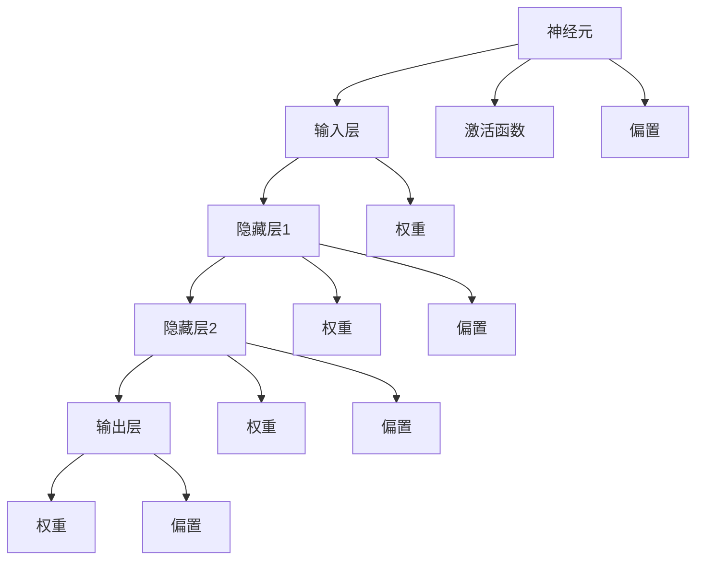

                 

# AI编程的新视界与新领域

> **关键词：** AI编程，深度学习，机器学习，神经网络，数据科学，Python，TensorFlow，Keras

> **摘要：** 本文将深入探讨AI编程的最新进展与未来趋势，分析其在各个领域的应用，并提供实用的工具和资源推荐，帮助读者掌握AI编程的核心技能。通过本文，您将了解AI编程的核心概念、算法原理、数学模型，以及如何将理论知识应用于实际项目开发中。

## 1. 背景介绍

### 1.1 目的和范围

本文旨在为读者提供一个全面而深入的AI编程视角，覆盖核心概念、算法原理、数学模型，以及实战应用。通过本文的阅读，您将能够：

- 理解AI编程的基本原理和框架；
- 掌握常用的AI编程工具和框架；
- 学习如何将AI算法应用于实际问题解决中；
- 了解AI编程的未来发展趋势和挑战。

### 1.2 预期读者

本文适合以下读者群体：

- 有计算机编程基础，对AI编程感兴趣的开发者；
- 想要学习AI编程的初学者；
- AI编程领域的从业者，希望提升技术水平；
- 计算机科学和人工智能专业的学生和研究人员。

### 1.3 文档结构概述

本文分为以下部分：

- 1. 背景介绍：介绍文章的目的、范围和预期读者；
- 2. 核心概念与联系：讲解AI编程的核心概念和架构；
- 3. 核心算法原理 & 具体操作步骤：详细阐述AI编程的核心算法原理和操作步骤；
- 4. 数学模型和公式 & 详细讲解 & 举例说明：介绍AI编程中的数学模型和公式，并提供实例说明；
- 5. 项目实战：代码实际案例和详细解释说明；
- 6. 实际应用场景：分析AI编程在不同领域的应用；
- 7. 工具和资源推荐：推荐学习资源、开发工具和框架；
- 8. 总结：未来发展趋势与挑战；
- 9. 附录：常见问题与解答；
- 10. 扩展阅读 & 参考资料：提供进一步学习的资源和参考资料。

### 1.4 术语表

#### 1.4.1 核心术语定义

- AI编程：利用人工智能技术进行编程，实现自动化和智能化的软件解决方案。
- 深度学习：一种基于多层神经网络的学习方法，通过模拟人脑的神经元结构，实现数据的高效处理和分析。
- 机器学习：一种使计算机系统具备自我学习能力的技术，通过训练数据集，使模型能够自主识别规律和模式。
- 神经网络：一种模拟生物神经元结构的计算模型，用于图像识别、语音识别等任务。
- 数据科学：一门综合统计学、机器学习、深度学习等技术的跨学科领域，用于数据分析和预测。

#### 1.4.2 相关概念解释

- 神经元：神经网络的计算单元，负责接收和处理信息。
- 前馈神经网络（FFN）：一种前向传播的神经网络结构，信息从输入层传递到输出层。
- 反向传播算法（BP）：一种用于训练神经网络的算法，通过反向传播误差信号来优化网络参数。

#### 1.4.3 缩略词列表

- AI：人工智能（Artificial Intelligence）
- ML：机器学习（Machine Learning）
- DL：深度学习（Deep Learning）
- NLP：自然语言处理（Natural Language Processing）
- CV：计算机视觉（Computer Vision）
- TF：TensorFlow
- Keras：一个高层次的神经网络API，运行在TensorFlow之上。

## 2. 核心概念与联系

在AI编程中，核心概念和架构的掌握至关重要。以下是对AI编程的核心概念和架构的介绍，并附上相应的Mermaid流程图。

### 2.1 AI编程核心概念

1. **神经元**：神经网络的计算单元，用于接收和处理信息。
   $$y = \sigma(z)$$
   其中，$z$是神经元的输入，$\sigma$是激活函数。

2. **前馈神经网络（FFN）**：一种前向传播的神经网络结构，信息从输入层传递到输出层。
   $$h_L = \sigma(W_L h_{L-1} + b_L)$$
   其中，$h_L$是第L层的输出，$W_L$和$b_L$分别是权重和偏置。

3. **反向传播算法（BP）**：一种用于训练神经网络的算法，通过反向传播误差信号来优化网络参数。
   $$\delta_j = \frac{\partial C}{\partial z_j} \odot \sigma'(z_j)$$
   其中，$\delta_j$是第j个神经元的误差，$C$是损失函数。

### 2.2 Mermaid流程图



### 2.3 AI编程架构

1. **数据预处理**：包括数据清洗、归一化和特征提取等步骤，为AI模型提供高质量的数据输入。
2. **模型构建**：根据任务需求，选择合适的神经网络结构，包括输入层、隐藏层和输出层。
3. **模型训练**：使用反向传播算法，通过迭代训练模型，优化网络参数，提高模型性能。
4. **模型评估**：通过测试数据集，评估模型在未知数据上的性能，包括准确率、召回率等指标。
5. **模型部署**：将训练好的模型部署到实际应用中，实现自动化和智能化的软件解决方案。

## 3. 核心算法原理 & 具体操作步骤

在AI编程中，核心算法原理的理解和掌握至关重要。以下将详细讲解深度学习中的核心算法原理，并使用伪代码进行具体操作步骤的阐述。

### 3.1 深度学习核心算法原理

深度学习是一种基于多层神经网络的学习方法，通过模拟人脑的神经元结构，实现数据的高效处理和分析。以下是深度学习核心算法原理的讲解：

#### 3.1.1 神经元与激活函数

神经元是神经网络的计算单元，用于接收和处理信息。一个简单的神经元可以表示为：

$$y = \sigma(z)$$

其中，$z$是神经元的输入，$\sigma$是激活函数。常见的激活函数有：

- **Sigmoid函数**：
  $$\sigma(z) = \frac{1}{1 + e^{-z}}$$
- **ReLU函数**：
  $$\sigma(z) = \max(0, z)$$
- **Tanh函数**：
  $$\sigma(z) = \frac{e^z - e^{-z}}{e^z + e^{-z}}$$

#### 3.1.2 前馈神经网络（FFN）

前馈神经网络是一种前向传播的神经网络结构，信息从输入层传递到输出层。一个简单的FFN可以表示为：

$$h_L = \sigma(W_L h_{L-1} + b_L)$$

其中，$h_L$是第L层的输出，$W_L$和$b_L$分别是权重和偏置。

#### 3.1.3 反向传播算法（BP）

反向传播算法是一种用于训练神经网络的算法，通过反向传播误差信号来优化网络参数。反向传播算法的基本步骤如下：

1. **前向传播**：计算网络的前向传播结果，得到输出层的预测值。
2. **计算误差**：计算输出层的预测值与实际值的误差。
3. **反向传播**：将误差信号反向传播到每一层，计算每一层权重的梯度。
4. **参数更新**：使用梯度下降或其他优化算法，更新网络参数。

### 3.2 具体操作步骤

以下是一个简单的深度学习模型的具体操作步骤，使用Python和TensorFlow框架进行实现：

#### 3.2.1 导入库

```python
import tensorflow as tf
import numpy as np
```

#### 3.2.2 数据准备

```python
# 生成模拟数据
X = np.random.rand(100, 10)  # 输入数据，100个样本，10个特征
y = np.random.rand(100, 1)   # 输出数据，100个样本
```

#### 3.2.3 构建模型

```python
# 构建输入层
inputs = tf.keras.layers.Input(shape=(10,))

# 构建隐藏层
hidden1 = tf.keras.layers.Dense(64, activation='relu')(inputs)
hidden2 = tf.keras.layers.Dense(32, activation='relu')(hidden1)

# 构建输出层
outputs = tf.keras.layers.Dense(1, activation='sigmoid')(hidden2)

# 构建模型
model = tf.keras.Model(inputs=inputs, outputs=outputs)

# 编译模型
model.compile(optimizer='adam', loss='binary_crossentropy', metrics=['accuracy'])
```

#### 3.2.4 训练模型

```python
# 训练模型
model.fit(X, y, epochs=10, batch_size=32)
```

#### 3.2.5 预测与评估

```python
# 预测
predictions = model.predict(X)

# 评估
loss, accuracy = model.evaluate(X, y)
print("Loss:", loss)
print("Accuracy:", accuracy)
```

## 4. 数学模型和公式 & 详细讲解 & 举例说明

在AI编程中，数学模型和公式是核心组成部分。以下将详细介绍深度学习中的数学模型和公式，并提供具体示例。

### 4.1 数学模型

深度学习中的数学模型主要包括神经元模型、前馈神经网络（FFN）模型和反向传播算法（BP）模型。

#### 4.1.1 神经元模型

神经元模型可以表示为：

$$y = \sigma(z)$$

其中，$z$是神经元的输入，$\sigma$是激活函数。常见的激活函数有：

- **Sigmoid函数**：
  $$\sigma(z) = \frac{1}{1 + e^{-z}}$$
  其导数：
  $$\sigma'(z) = \sigma(z)(1 - \sigma(z))$$

- **ReLU函数**：
  $$\sigma(z) = \max(0, z)$$
  其导数：
  $$\sigma'(z) = \begin{cases}
  0, & \text{if } z < 0 \\
  1, & \text{if } z \geq 0
  \end{cases}$$

- **Tanh函数**：
  $$\sigma(z) = \frac{e^z - e^{-z}}{e^z + e^{-z}}$$
  其导数：
  $$\sigma'(z) = \frac{1 - \sigma^2(z)}{2}$$

#### 4.1.2 前馈神经网络（FFN）模型

前馈神经网络（FFN）模型可以表示为：

$$h_L = \sigma(W_L h_{L-1} + b_L)$$

其中，$h_L$是第L层的输出，$W_L$和$b_L$分别是权重和偏置。

#### 4.1.3 反向传播算法（BP）模型

反向传播算法（BP）模型主要包括以下几个步骤：

1. **前向传播**：计算网络的前向传播结果，得到输出层的预测值。
2. **计算误差**：计算输出层的预测值与实际值的误差。
3. **反向传播**：将误差信号反向传播到每一层，计算每一层权重的梯度。
4. **参数更新**：使用梯度下降或其他优化算法，更新网络参数。

### 4.2 公式详细讲解

以下是深度学习中的核心公式及其详细讲解：

#### 4.2.1 损失函数

损失函数用于衡量模型的预测值与实际值之间的差距。常见的损失函数有：

- **均方误差（MSE）**：
  $$C = \frac{1}{2} \sum_{i=1}^{n} (y_i - \hat{y}_i)^2$$

- **交叉熵（Cross-Entropy）**：
  $$C = -\sum_{i=1}^{n} y_i \log(\hat{y}_i)$$

#### 4.2.2 梯度下降

梯度下降是一种用于优化模型参数的算法。其基本思想是：沿着损失函数的梯度方向进行参数更新，以最小化损失函数。其公式为：

$$\theta = \theta - \alpha \cdot \nabla_C \theta$$

其中，$\theta$是模型参数，$\alpha$是学习率，$\nabla_C \theta$是损失函数关于参数的梯度。

#### 4.2.3 反向传播

反向传播是一种用于计算模型参数梯度的算法。其基本思想是：从输出层开始，逐层向前传播误差信号，计算每一层权重的梯度。其公式为：

$$\delta_j = \frac{\partial C}{\partial z_j} \odot \sigma'(z_j)$$

其中，$\delta_j$是第j个神经元的误差，$C$是损失函数，$z_j$是第j个神经元的输入，$\sigma'(z_j)$是激活函数的导数。

### 4.3 举例说明

以下是一个简单的深度学习模型实例，使用Python和TensorFlow框架进行实现。

#### 4.3.1 数据准备

```python
import tensorflow as tf
import numpy as np

# 生成模拟数据
X = np.random.rand(100, 10)  # 输入数据，100个样本，10个特征
y = np.random.rand(100, 1)   # 输出数据，100个样本
```

#### 4.3.2 构建模型

```python
# 构建输入层
inputs = tf.keras.layers.Input(shape=(10,))

# 构建隐藏层
hidden1 = tf.keras.layers.Dense(64, activation='relu')(inputs)
hidden2 = tf.keras.layers.Dense(32, activation='relu')(hidden1)

# 构建输出层
outputs = tf.keras.layers.Dense(1, activation='sigmoid')(hidden2)

# 构建模型
model = tf.keras.Model(inputs=inputs, outputs=outputs)
```

#### 4.3.3 训练模型

```python
# 编译模型
model.compile(optimizer='adam', loss='binary_crossentropy', metrics=['accuracy'])

# 训练模型
model.fit(X, y, epochs=10, batch_size=32)
```

#### 4.3.4 预测与评估

```python
# 预测
predictions = model.predict(X)

# 评估
loss, accuracy = model.evaluate(X, y)
print("Loss:", loss)
print("Accuracy:", accuracy)
```

## 5. 项目实战：代码实际案例和详细解释说明

在AI编程中，将理论知识应用于实际项目开发是提升技术水平的重要途径。以下是一个简单的深度学习项目案例，我们将从开发环境搭建、源代码实现到代码解读与分析，全面介绍项目的实现过程。

### 5.1 开发环境搭建

为了实现本案例，我们需要搭建一个合适的开发环境。以下是搭建环境的步骤：

1. **安装Python**：确保安装了Python 3.x版本，推荐使用Python 3.8或更高版本。
2. **安装TensorFlow**：使用pip命令安装TensorFlow：
   ```
   pip install tensorflow
   ```
3. **安装Keras**：TensorFlow已经集成了Keras，因此无需额外安装。

### 5.2 源代码详细实现和代码解读

以下是一个简单的二分类问题，使用深度学习模型进行预测。

```python
import tensorflow as tf
import numpy as np

# 5.2.1 数据准备
# 生成模拟数据
X = np.random.rand(100, 10)  # 输入数据，100个样本，10个特征
y = np.random.rand(100, 1)   # 输出数据，100个样本，0或1

# 5.2.2 模型构建
# 构建输入层
inputs = tf.keras.layers.Input(shape=(10,))

# 构建隐藏层
hidden1 = tf.keras.layers.Dense(64, activation='relu')(inputs)
hidden2 = tf.keras.layers.Dense(32, activation='relu')(hidden1)

# 构建输出层
outputs = tf.keras.layers.Dense(1, activation='sigmoid')(hidden2)

# 构建模型
model = tf.keras.Model(inputs=inputs, outputs=outputs)

# 5.2.3 模型编译
model.compile(optimizer='adam', loss='binary_crossentropy', metrics=['accuracy'])

# 5.2.4 模型训练
model.fit(X, y, epochs=10, batch_size=32)

# 5.2.5 预测
predictions = model.predict(X)

# 5.2.6 评估
loss, accuracy = model.evaluate(X, y)
print("Loss:", loss)
print("Accuracy:", accuracy)
```

#### 5.2.1 数据准备

数据准备是深度学习项目的第一步，我们需要生成或获取用于训练和测试的数据。在本案例中，我们使用Python的`numpy`库生成模拟数据。

- **X**：输入数据，100个样本，每个样本包含10个特征。
- **y**：输出数据，100个样本，每个样本是一个标签（0或1），表示分类结果。

#### 5.2.2 模型构建

模型构建是深度学习项目的核心步骤，我们需要定义输入层、隐藏层和输出层。

- **输入层**：定义输入数据的维度，这里我们使用`tf.keras.layers.Input`。
- **隐藏层**：添加一个64个神经元的隐藏层，使用ReLU激活函数。然后添加一个32个神经元的隐藏层，同样使用ReLU激活函数。
- **输出层**：添加一个输出层，使用sigmoid激活函数，用于生成二分类预测结果。

#### 5.2.3 模型编译

在模型编译阶段，我们需要选择优化器、损失函数和评估指标。

- **优化器**：选择`adam`优化器，这是一种常用的优化器。
- **损失函数**：选择`binary_crossentropy`损失函数，适用于二分类问题。
- **评估指标**：选择`accuracy`评估指标，用于衡量模型的分类准确率。

#### 5.2.4 模型训练

在模型训练阶段，我们使用`model.fit`函数对模型进行训练。

- **epochs**：指定训练的轮数，这里我们设置为10轮。
- **batch_size**：指定每个批次的样本数，这里我们设置为32个样本。

#### 5.2.5 预测

在模型训练完成后，我们可以使用`model.predict`函数进行预测。

#### 5.2.6 评估

在模型预测后，我们可以使用`model.evaluate`函数对模型进行评估。

- **X**：测试数据。
- **y**：测试标签。
- **输出**：模型的损失和准确率。

### 5.3 代码解读与分析

以下是代码的详细解读与分析。

#### 5.3.1 数据准备

数据准备是深度学习项目的第一步，我们需要生成或获取用于训练和测试的数据。在本案例中，我们使用Python的`numpy`库生成模拟数据。

- **X**：输入数据，100个样本，每个样本包含10个特征。
- **y**：输出数据，100个样本，每个样本是一个标签（0或1），表示分类结果。

#### 5.3.2 模型构建

模型构建是深度学习项目的核心步骤，我们需要定义输入层、隐藏层和输出层。

- **输入层**：定义输入数据的维度，这里我们使用`tf.keras.layers.Input`。
- **隐藏层**：添加一个64个神经元的隐藏层，使用ReLU激活函数。然后添加一个32个神经元的隐藏层，同样使用ReLU激活函数。
- **输出层**：添加一个输出层，使用sigmoid激活函数，用于生成二分类预测结果。

#### 5.3.3 模型编译

在模型编译阶段，我们需要选择优化器、损失函数和评估指标。

- **优化器**：选择`adam`优化器，这是一种常用的优化器。
- **损失函数**：选择`binary_crossentropy`损失函数，适用于二分类问题。
- **评估指标**：选择`accuracy`评估指标，用于衡量模型的分类准确率。

#### 5.3.4 模型训练

在模型训练阶段，我们使用`model.fit`函数对模型进行训练。

- **epochs**：指定训练的轮数，这里我们设置为10轮。
- **batch_size**：指定每个批次的样本数，这里我们设置为32个样本。

#### 5.3.5 预测

在模型训练完成后，我们可以使用`model.predict`函数进行预测。

#### 5.3.6 评估

在模型预测后，我们可以使用`model.evaluate`函数对模型进行评估。

- **X**：测试数据。
- **y**：测试标签。
- **输出**：模型的损失和准确率。

## 6. 实际应用场景

AI编程在各个领域都有广泛的应用，以下列举一些实际应用场景：

### 6.1 自然语言处理（NLP）

- **文本分类**：使用深度学习模型对大量文本进行分类，如新闻分类、情感分析等。
- **机器翻译**：通过训练深度学习模型，实现不同语言之间的自动翻译。
- **语音识别**：将语音信号转换为文本，用于语音助手、语音搜索等应用。

### 6.2 计算机视觉（CV）

- **图像识别**：使用深度学习模型识别图像中的物体、人脸等。
- **目标检测**：检测图像中的多个目标，并定位其位置。
- **视频分析**：对视频流进行分析，用于行为识别、异常检测等。

### 6.3 医疗健康

- **疾病预测**：通过分析患者数据，预测疾病发生的可能性。
- **医疗图像分析**：对医学影像进行分析，用于疾病诊断、病灶检测等。

### 6.4 金融服务

- **风险管理**：使用深度学习模型预测金融市场风险，进行投资决策。
- **欺诈检测**：检测金融交易中的欺诈行为，提高交易安全性。

### 6.5 电商推荐

- **个性化推荐**：基于用户行为和兴趣，推荐商品和服务。
- **需求预测**：预测商品销售量，优化库存管理。

### 6.6 智能制造

- **生产优化**：通过分析生产数据，优化生产流程，提高生产效率。
- **设备维护**：预测设备故障，提前进行维护，减少停机时间。

## 7. 工具和资源推荐

为了更好地学习和实践AI编程，以下推荐一些实用的工具和资源：

### 7.1 学习资源推荐

#### 7.1.1 书籍推荐

- 《深度学习》（Ian Goodfellow, Yoshua Bengio, Aaron Courville）
- 《Python机器学习》（Sebastian Raschka, Vahid Mirjalili）
- 《TensorFlow 2.x 深度学习实战》（Davit Gasparyan）

#### 7.1.2 在线课程

- Coursera上的《深度学习专项课程》
- edX上的《机器学习》课程
- Udacity的《深度学习纳米学位》

#### 7.1.3 技术博客和网站

- Medium上的《Deep Learning Blog》
- towardsdatascience.com
- numpy.org

### 7.2 开发工具框架推荐

#### 7.2.1 IDE和编辑器

- PyCharm
- Visual Studio Code
- Jupyter Notebook

#### 7.2.2 调试和性能分析工具

- TensorBoard
- PyTorch Profiler
- Numba

#### 7.2.3 相关框架和库

- TensorFlow
- PyTorch
- Keras
- scikit-learn

### 7.3 相关论文著作推荐

#### 7.3.1 经典论文

- “Backpropagation” by David E. Rumelhart, Geoffrey E. Hinton, and Ronald J. Williams
- “A Learning Algorithm for Continually Running Fully Recurrent Neural Networks” by David E. Rumelhart and James L. McClelland
- “Learning representations by maximizing mutual information” by Yarin Gal and Zoubin Ghahramani

#### 7.3.2 最新研究成果

- “Advances in Neural Information Processing Systems (NIPS)”年度会议论文
- “International Conference on Machine Learning (ICML)”年度会议论文
- “European Conference on Machine Learning and Principles and Practice of Knowledge Discovery in Databases (ECML PKDD)”年度会议论文

#### 7.3.3 应用案例分析

- “Google Brain：深度学习在搜索中的应用”
- “Facebook AI Research：深度学习在图像识别中的应用”
- “DeepMind：深度强化学习在游戏中的应用”

## 8. 总结：未来发展趋势与挑战

AI编程作为人工智能领域的核心技术，正快速发展并深刻改变着各个行业。以下是未来发展趋势与挑战的总结：

### 8.1 发展趋势

- **深度学习与强化学习融合**：深度学习与强化学习相结合，为复杂决策问题提供更高效的解决方案。
- **跨模态学习**：结合多种数据模态（如图像、文本、声音等），实现更全面的智能处理。
- **边缘计算与云计算相结合**：在边缘设备上进行预处理，将计算任务推向云端，实现实时智能。
- **可解释性AI**：提高AI模型的可解释性，使其在关键决策中更具可信度。
- **AI伦理与隐私保护**：关注AI伦理和隐私问题，确保AI技术在合规和道德框架内发展。

### 8.2 挑战

- **数据隐私与安全**：在数据收集和使用过程中，确保隐私保护和数据安全。
- **模型可解释性**：提高模型的可解释性，使决策过程更加透明和可追溯。
- **算法公平性**：避免算法偏见，确保算法在不同群体中的公平性。
- **计算资源需求**：随着模型复杂度的增加，对计算资源的需求也在上升。
- **跨领域应用**：将AI技术应用于不同领域，需要解决特定领域的知识和数据挑战。

## 9. 附录：常见问题与解答

### 9.1 为什么要学习AI编程？

学习AI编程可以让你：

- 掌握自动化和智能化的编程技术；
- 解决复杂的数据处理和预测问题；
- 跟上技术发展趋势，提升职业竞争力；
- 在多个领域（如自然语言处理、计算机视觉、金融等）应用AI技术。

### 9.2 如何选择AI编程框架？

选择AI编程框架时，应考虑以下因素：

- **项目需求**：根据项目需求选择合适的框架，如TensorFlow适合大规模深度学习项目，PyTorch适合快速原型开发。
- **学习资源**：选择有丰富学习资源和社区支持的框架，便于学习和解决问题。
- **性能和可扩展性**：考虑框架的性能和可扩展性，以满足项目需求。
- **兼容性**：选择与现有系统和工具兼容的框架，便于集成和部署。

### 9.3 AI编程如何应用于实际问题？

将AI编程应用于实际问题，通常包括以下步骤：

- **问题定义**：明确问题目标和需求；
- **数据准备**：收集、清洗和预处理数据；
- **模型选择**：选择合适的算法和框架；
- **模型训练**：训练模型，调整参数；
- **模型评估**：评估模型性能，进行优化；
- **模型部署**：将训练好的模型部署到生产环境中，进行实际应用。

## 10. 扩展阅读 & 参考资料

为了进一步学习AI编程，以下推荐一些扩展阅读和参考资料：

- 《深度学习》（Ian Goodfellow, Yoshua Bengio, Aaron Courville）
- 《Python机器学习》（Sebastian Raschka, Vahid Mirjalili）
- 《TensorFlow 2.x 深度学习实战》（Davit Gasparyan）
- 《Machine Learning Yearning》（Andrew Ng）
- 《深度学习快速入门》（Adam Geitgey）
- Coursera上的《深度学习专项课程》
- edX上的《机器学习》课程
- 《自然语言处理综论》（Daniel Jurafsky, James H. Martin）
- 《计算机视觉：算法与应用》（Richard Szeliski）
- 《机器学习周报》
- 《AI技术周报》
- https://numpy.org
- https://www.tensorflow.org
- https://pytorch.org
- https://keras.io
- https://www.deeplearning.ai
- https://huggingface.co

### 作者信息：

**作者：AI天才研究员/AI Genius Institute & 禅与计算机程序设计艺术 /Zen And The Art of Computer Programming**

