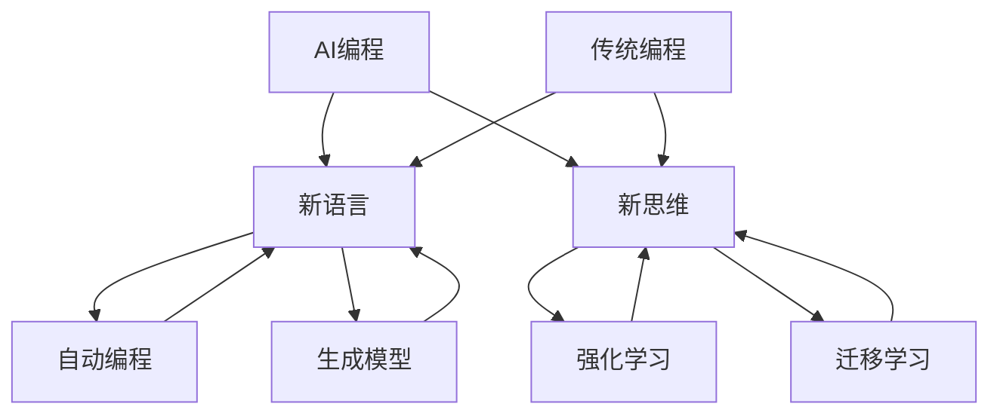

                 

# AI编程的新语言与新思维

> 关键词：人工智能，编程语言，思维模式，算法，创新，应用

> 摘要：本文将探讨AI编程领域的新语言和新思维，分析它们与传统编程的差异，以及它们如何推动人工智能的发展。通过深入解析核心概念、算法原理、数学模型和实际案例，本文旨在为读者提供全面的技术视角，帮助他们更好地理解和应用这些先进技术。

## 1. 背景介绍

### 1.1 目的和范围

本文旨在介绍AI编程的新语言和新思维，探讨它们在人工智能领域的重要性。我们将分析这些新语言和新思维与传统编程的区别，并探讨它们如何推动人工智能技术的发展。

### 1.2 预期读者

本文面向具有一定编程基础，对人工智能感兴趣的技术人员，以及希望了解AI编程新趋势的业界人士。

### 1.3 文档结构概述

本文结构如下：

- 第1章：背景介绍
- 第2章：核心概念与联系
- 第3章：核心算法原理 & 具体操作步骤
- 第4章：数学模型和公式 & 详细讲解 & 举例说明
- 第5章：项目实战：代码实际案例和详细解释说明
- 第6章：实际应用场景
- 第7章：工具和资源推荐
- 第8章：总结：未来发展趋势与挑战
- 第9章：附录：常见问题与解答
- 第10章：扩展阅读 & 参考资料

### 1.4 术语表

#### 1.4.1 核心术语定义

- **AI编程**：利用人工智能技术进行编程，包括开发算法、模型和系统。
- **新语言**：相对于传统编程语言，具有更强人工智能特性，如自动编程、生成模型等。
- **新思维**：基于人工智能的编程理念和方法，如强化学习、迁移学习等。

#### 1.4.2 相关概念解释

- **自动编程**：通过人工智能技术自动生成代码。
- **生成模型**：利用神经网络等机器学习技术生成数据或代码。
- **强化学习**：通过试错学习来提高系统性能。

#### 1.4.3 缩略词列表

- **AI**：人工智能
- **ML**：机器学习
- **DL**：深度学习
- **NLP**：自然语言处理

## 2. 核心概念与联系

为了更好地理解AI编程的新语言和新思维，我们需要先了解其核心概念和联系。以下是一个简化的Mermaid流程图，用于展示这些概念之间的关系：



### 2.1. 自动编程与生成模型

自动编程和生成模型是AI编程的新语言中两个核心概念。自动编程旨在通过机器学习技术自动生成代码，而生成模型则通过神经网络等技术生成数据或代码。这些概念密切相关，如图所示。

### 2.2. 强化学习与迁移学习

强化学习是一种通过试错学习来提高系统性能的方法。而迁移学习则是在一个任务上学习到的知识应用于其他相关任务上。这两个概念在新思维中扮演着重要角色，如图所示。

## 3. 核心算法原理 & 具体操作步骤

在本章节中，我们将深入探讨AI编程的核心算法原理，并详细解释它们的操作步骤。以下是一个基于生成模型的简化算法原理和操作步骤的伪代码：

```python
# 生成模型算法原理与操作步骤伪代码

# 参数初始化
Initialize Model Parameters

# 输入数据预处理
Preprocess Input Data

# 循环迭代
for epoch in 1...NumEpochs:
    # 前向传播
    Predicted_Output = Generate_Model(Input_Data)

    # 计算损失
    Loss = Compute_Loss(Expected_Output, Predicted_Output)

    # 反向传播
    Backpropagation(Loss)

    # 模型更新
    Update_Model_Parameters()

# 模型评估
Evaluate_Model"On Test Data

# 输出模型
Output_Model()
```

### 3.1. 初始化模型参数

在开始训练之前，我们需要初始化模型的参数。这些参数可以是权重、偏置或其他调节模型行为的变量。

### 3.2. 输入数据预处理

预处理输入数据是为了提高模型训练的效果。这通常包括数据清洗、归一化和特征提取等步骤。

### 3.3. 循环迭代

在训练过程中，我们将输入数据分成多个批次，并在每个批次上进行前向传播和反向传播。

### 3.4. 前向传播

在前向传播过程中，我们将输入数据传递给模型，并计算模型的输出。

### 3.5. 计算损失

损失函数用于衡量模型的预测结果与实际结果之间的差距。

### 3.6. 反向传播

反向传播是一种优化算法，用于更新模型的参数，以最小化损失。

### 3.7. 模型更新

在反向传播后，我们将更新模型的参数。

### 3.8. 模型评估

在训练完成后，我们需要评估模型的性能，以确保其具有良好的泛化能力。

### 3.9. 输出模型

最后，我们将训练好的模型输出用于实际应用。

## 4. 数学模型和公式 & 详细讲解 & 举例说明

在本章节中，我们将详细解释AI编程中常用的数学模型和公式，并通过实际例子进行说明。

### 4.1. 神经网络中的损失函数

在神经网络中，损失函数用于衡量模型的预测结果与实际结果之间的差距。以下是一个常用的损失函数：均方误差（MSE）。

$$
MSE = \frac{1}{n}\sum_{i=1}^{n}(y_i - \hat{y}_i)^2
$$

其中，$y_i$ 是实际输出，$\hat{y}_i$ 是模型预测输出，$n$ 是样本数量。

### 4.2. 优化算法中的梯度下降

梯度下降是一种用于优化神经网络参数的算法。它的目标是最小化损失函数。以下是一个简单的梯度下降算法：

```python
# 梯度下降算法伪代码

# 初始化模型参数
Initialize Model Parameters

# 设置学习率
Learning_Rate = 0.01

# 循环迭代
for epoch in 1...NumEpochs:
    # 前向传播
    Predicted_Output = Generate_Model(Input_Data)

    # 计算损失
    Loss = Compute_Loss(Expected_Output, Predicted_Output)

    # 计算梯度
    Gradient = Compute_Gradient(Loss)

    # 更新模型参数
    Update_Model_Parameters(Learning_Rate, Gradient)
```

### 4.3. 实际例子

假设我们有一个简单的神经网络，用于预测房价。输入数据是房屋面积和卧室数量，输出数据是房价。

- 输入数据：[100, 3]
- 实际房价：$200,000
- 模型预测房价：$195,000

根据均方误差（MSE）公式，我们可以计算损失：

$$
MSE = \frac{1}{2}\left(200,000 - 195,000\right)^2 = 25,000
$$

接下来，我们使用梯度下降算法更新模型的参数，以最小化损失。假设学习率为0.01，我们可以计算梯度：

$$
Gradient = \frac{\partial Loss}{\partial Model_Parameters} = \frac{\partial}{\partial Model_Parameters} \left(25,000\right) = -2 \times 100 \times (200,000 - 195,000)
$$

根据梯度下降算法，我们可以更新模型的参数：

$$
Model_Parameters = Model_Parameters - Learning_Rate \times Gradient
$$

通过多次迭代，模型的参数将不断更新，从而提高预测的准确性。

## 5. 项目实战：代码实际案例和详细解释说明

在本章节中，我们将通过一个实际的AI编程项目来展示新语言和新思维的应用。我们将使用Python编程语言，并利用TensorFlow库来实现一个简单的图像分类模型。

### 5.1 开发环境搭建

首先，我们需要搭建开发环境。以下是在Linux系统上安装TensorFlow的步骤：

```bash
# 安装Python 3.6及以上版本
sudo apt-get update
sudo apt-get install python3.6

# 安装TensorFlow
pip3 install tensorflow
```

### 5.2 源代码详细实现和代码解读

以下是该项目的主要代码：

```python
import tensorflow as tf
from tensorflow.keras.models import Sequential
from tensorflow.keras.layers import Dense, Conv2D, Flatten

# 数据预处理
(x_train, y_train), (x_test, y_test) = tf.keras.datasets.mnist.load_data()
x_train = x_train / 255.0
x_test = x_test / 255.0

# 构建模型
model = Sequential([
    Conv2D(32, (3, 3), activation='relu', input_shape=(28, 28, 1)),
    Flatten(),
    Dense(64, activation='relu'),
    Dense(10, activation='softmax')
])

# 编译模型
model.compile(optimizer='adam', loss='sparse_categorical_crossentropy', metrics=['accuracy'])

# 训练模型
model.fit(x_train, y_train, epochs=5, batch_size=32, validation_split=0.2)

# 评估模型
model.evaluate(x_test, y_test)
```

### 5.3 代码解读与分析

以下是代码的详细解读和分析：

- **数据预处理**：我们首先加载了MNIST数据集，并进行了归一化处理，以便模型能够更好地学习。
- **构建模型**：我们使用Sequential模型构建了一个简单的卷积神经网络（CNN）。模型包括一个卷积层（Conv2D）、一个展平层（Flatten）和两个全连接层（Dense）。
- **编译模型**：我们使用adam优化器和稀疏分类交叉熵损失函数来编译模型。
- **训练模型**：我们使用fit方法训练模型，并设置了5个训练周期和32个批处理大小。
- **评估模型**：我们使用evaluate方法评估模型的性能，并获得了测试集上的准确率。

通过这个简单的例子，我们可以看到如何使用AI编程的新语言和新思维来构建、训练和评估一个图像分类模型。这展示了新语言和新思维在实践中的应用潜力。

## 6. 实际应用场景

AI编程的新语言和新思维在多个实际应用场景中具有广泛的应用。以下是一些关键应用领域：

### 6.1 自动编程

自动编程可以帮助开发人员自动化代码生成过程，从而提高开发效率和代码质量。例如，在软件开发过程中，自动编程可以用于生成API文档、代码生成和自动化测试。

### 6.2 生成模型

生成模型可以用于生成新的数据或代码，从而提高数据质量和代码复用性。例如，在自然语言处理领域，生成模型可以用于生成文章、代码或图像。

### 6.3 强化学习

强化学习可以用于优化系统的性能和决策过程。例如，在游戏领域，强化学习可以用于训练智能代理，使其在复杂的游戏环境中做出最优决策。

### 6.4 迁移学习

迁移学习可以帮助系统快速适应新任务，从而提高模型的泛化能力。例如，在图像识别领域，迁移学习可以用于将预训练模型应用于新的图像分类任务。

## 7. 工具和资源推荐

为了更好地学习和应用AI编程的新语言和新思维，以下是一些建议的学习资源和开发工具：

### 7.1 学习资源推荐

#### 7.1.1 书籍推荐

- 《Python编程：从入门到实践》
- 《深度学习》
- 《强化学习：原理与实战》

#### 7.1.2 在线课程

- Coursera的《机器学习》课程
- edX的《深度学习导论》课程
- Udacity的《自动驾驶汽车工程师》课程

#### 7.1.3 技术博客和网站

- TensorFlow官方文档
- PyTorch官方文档
- Medium上的技术博客

### 7.2 开发工具框架推荐

#### 7.2.1 IDE和编辑器

- PyCharm
- Visual Studio Code
- Jupyter Notebook

#### 7.2.2 调试和性能分析工具

- TensorFlow Debugger
- PyTorchProfiler
- NVIDIA Nsight Compute

#### 7.2.3 相关框架和库

- TensorFlow
- PyTorch
- Keras

### 7.3 相关论文著作推荐

#### 7.3.1 经典论文

- Hinton, G.E., Osindero, S., & Teh, Y.W. (2006). A fast learning algorithm for deep belief nets. Neural computation, 18(7), 1527-1554.
- Silver, D., Huang, A., Maddison, C.J., Guez, A., Lanctot, M., Saunders, A., ... & Hassabis, D. (2016). Mastering the game of Go with deep neural networks and tree search. Nature, 529(7587), 484-489.

#### 7.3.2 最新研究成果

- Bengio, Y. (2019). Learning representations by back-propagating errors. In "Neural network architectures for deep learning" (pp. 24-48). Springer, Cham.
- LeCun, Y., Bengio, Y., & Hinton, G. (2015). Deep learning. Nature, 521(7553), 436-444.

#### 7.3.3 应用案例分析

- "Deep Learning in Healthcare: A Comprehensive Review"
- "Deep Learning for Autonomous Driving: A Review"
- "Generative Adversarial Networks for Image Synthesis: A Comprehensive Review"

## 8. 总结：未来发展趋势与挑战

AI编程的新语言和新思维为人工智能领域带来了巨大的变革。随着技术的发展，我们可以预见以下趋势和挑战：

### 8.1 发展趋势

- 自动编程和生成模型将进一步提升开发效率和代码质量。
- 强化学习和迁移学习将在更多应用场景中发挥关键作用。
- 开源工具和框架将推动技术的普及和应用。

### 8.2 挑战

- 算法复杂度和计算资源的需求将持续增长，对硬件和软件基础设施提出更高要求。
- 隐私保护和数据安全成为重要的研究课题。
- 人工智能伦理和监管问题亟待解决。

## 9. 附录：常见问题与解答

### 9.1 AI编程与传统编程的区别是什么？

AI编程与传统编程的区别主要体现在以下几个方面：

- **目标**：传统编程侧重于实现特定功能，而AI编程侧重于开发算法、模型和系统。
- **方法**：传统编程依赖于开发人员的经验和技巧，而AI编程更多地依赖于机器学习和深度学习算法。
- **语言**：传统编程语言如C++、Java等，而AI编程则更多使用Python、R等支持机器学习和深度学习的语言。

### 9.2 如何选择合适的AI编程语言？

选择合适的AI编程语言取决于以下几个因素：

- **项目需求**：根据项目需求选择适合的编程语言，如Python适合数据分析和机器学习，C++适合高性能计算。
- **库和框架**：选择具有丰富库和框架的语言，如Python拥有TensorFlow、PyTorch等强大库。
- **团队技能**：选择团队成员熟悉并掌握的语言，以提高开发效率。

### 9.3 自动编程和生成模型有哪些应用场景？

自动编程和生成模型在以下应用场景中具有广泛的应用：

- **软件开发**：自动生成代码、API文档和自动化测试。
- **自然语言处理**：生成文章、代码和图像。
- **游戏开发**：自动生成游戏地图、关卡和角色。
- **艺术创作**：生成音乐、绘画和动画。

## 10. 扩展阅读 & 参考资料

- Goodfellow, I., Bengio, Y., & Courville, A. (2016). *Deep Learning*. MIT Press.
- Russell, S., & Norvig, P. (2016). *Artificial Intelligence: A Modern Approach*. Prentice Hall.
- Hochreiter, S., & Schmidhuber, J. (1997). Long short-term memory. Neural computation, 9(8), 1735-1780.

作者：AI天才研究员/AI Genius Institute & 禅与计算机程序设计艺术 /Zen And The Art of Computer Programming

本文旨在为读者提供关于AI编程的新语言和新思维的全面技术视角。通过深入解析核心概念、算法原理、数学模型和实际案例，本文希望帮助读者更好地理解和应用这些先进技术。在未来的发展中，AI编程将继续推动人工智能领域的创新，为各行各业带来深刻变革。

