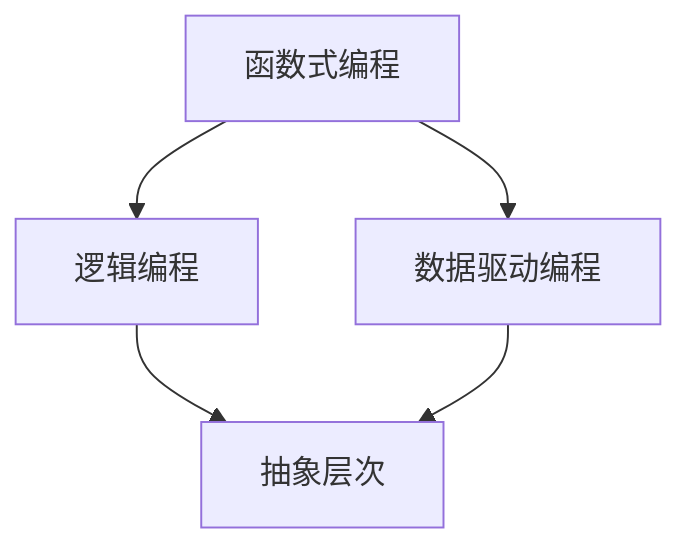

                 

# AI编程的新语言与新范式

> 关键词：AI编程、编程语言、编程范式、语言范式、AI算法、编程模型、抽象层次、软件开发

> 摘要：本文将探讨AI编程领域的新语言和新范式。通过分析当前编程语言的局限性和AI编程的需求，我们将介绍一些新兴的编程语言和范式，并探讨它们在AI编程中的应用。文章将详细讲解这些新语言和范式的核心概念、原理以及具体操作步骤，并通过项目实战和实际应用场景，展示它们在现实世界中的强大能力。

## 1. 背景介绍

### 1.1 目的和范围

本文旨在探讨AI编程领域的新语言和新范式，以应对传统编程语言在AI编程中面临的局限性。我们将重点关注以下内容：

1. **传统编程语言的局限性**：介绍传统编程语言在AI编程中遇到的挑战，包括语言特性、抽象层次、开发效率和可维护性等方面。
2. **AI编程的需求**：分析AI编程所需的特定功能和特性，如动态性、适应性、灵活性和自动化等。
3. **新兴的编程语言和范式**：介绍一些新兴的编程语言和范式，如函数式编程、逻辑编程、数据驱动编程等，并探讨它们在AI编程中的应用。
4. **核心概念与联系**：使用Mermaid流程图展示核心概念和原理之间的联系。
5. **核心算法原理与具体操作步骤**：详细讲解AI编程中的核心算法原理，并提供伪代码示例。
6. **数学模型与公式**：介绍相关的数学模型和公式，并进行详细讲解和举例说明。
7. **项目实战**：通过实际案例展示如何使用新语言和范式进行AI编程。
8. **实际应用场景**：探讨新语言和范式在现实世界中的应用场景。
9. **工具和资源推荐**：推荐学习资源、开发工具和框架，以及相关论文著作。
10. **总结与展望**：总结未来发展趋势与挑战，为读者提供有价值的思考和方向。

### 1.2 预期读者

本文适合以下读者群体：

1. **程序员和软件开发者**：希望了解AI编程的新语言和新范式，以提升开发效率和可维护性的开发者。
2. **AI研究人员和学者**：希望了解AI编程领域的新技术和研究动态的研究者。
3. **计算机科学和人工智能专业学生**：希望深入了解AI编程相关概念和技术，为未来研究奠定基础。

### 1.3 文档结构概述

本文分为以下几部分：

1. **背景介绍**：介绍本文的目的、范围、预期读者和文档结构。
2. **核心概念与联系**：使用Mermaid流程图展示核心概念和原理之间的联系。
3. **核心算法原理与具体操作步骤**：详细讲解AI编程中的核心算法原理，并提供伪代码示例。
4. **数学模型与公式**：介绍相关的数学模型和公式，并进行详细讲解和举例说明。
5. **项目实战**：通过实际案例展示如何使用新语言和范式进行AI编程。
6. **实际应用场景**：探讨新语言和范式在现实世界中的应用场景。
7. **工具和资源推荐**：推荐学习资源、开发工具和框架，以及相关论文著作。
8. **总结与展望**：总结未来发展趋势与挑战，为读者提供有价值的思考和方向。
9. **附录**：常见问题与解答。
10. **扩展阅读与参考资料**：提供进一步的阅读材料和参考文献。

### 1.4 术语表

#### 1.4.1 核心术语定义

- **AI编程**：使用编程语言和技术开发人工智能应用程序的过程。
- **编程语言**：用于编写计算机程序的语言，包括语法、语义和语用等方面。
- **范式**：编程语言的组织方式和抽象程度，以及相应的编程方法。
- **抽象层次**：将复杂系统分解为不同层次，每个层次只关注特定的功能和特性。
- **动态性**：程序在运行时可以改变其行为和结构的能力。
- **适应性**：程序能够根据不同的环境和需求进行适应和调整的能力。
- **灵活性**：程序在不同场景下都能保持高效和可靠的能力。
- **自动化**：通过编程实现自动化任务的能力。

#### 1.4.2 相关概念解释

- **函数式编程**：一种编程范式，将程序视为一系列函数的集合，函数之间通过参数传递和数据流进行通信。
- **逻辑编程**：一种基于逻辑和推理的编程范式，使用逻辑公式和规则描述程序的行为。
- **数据驱动编程**：一种编程范式，将程序的数据结构作为核心，通过数据流驱动程序的执行。

#### 1.4.3 缩略词列表

- **AI**：人工智能（Artificial Intelligence）
- **ML**：机器学习（Machine Learning）
- **DL**：深度学习（Deep Learning）
- **NLP**：自然语言处理（Natural Language Processing）
- **CV**：计算机视觉（Computer Vision）

## 2. 核心概念与联系

在本节中，我们将使用Mermaid流程图来展示AI编程中的核心概念和原理之间的联系。以下是一个简单的示例，展示了函数式编程、逻辑编程和数据驱动编程之间的关系：



在这个流程图中，函数式编程、逻辑编程和数据驱动编程都是核心概念，它们共同构成了AI编程的基础。抽象层次是这些概念之间的桥梁，将它们联系在一起，使得开发者能够以更高效、更灵活的方式开发AI应用程序。

### 2.1 函数式编程

函数式编程是一种编程范式，将程序视为一系列函数的集合，函数之间通过参数传递和数据流进行通信。函数式编程具有以下核心特点：

1. **纯函数**：函数式编程中的函数是纯函数，即相同的输入总是产生相同的输出，没有副作用。这使得函数式编程具有更好的可测试性、可维护性和可复用性。
2. **高阶函数**：函数式编程支持高阶函数，即函数可以作为参数传递给其他函数，或者从其他函数中返回。这种特性使得函数式编程具有更高的灵活性和抽象能力。
3. **不可变数据**：函数式编程中的数据是不可变的，即一旦数据被创建，就不能再修改。这种特性有助于减少状态变化和副作用，提高程序的可靠性和可预测性。

### 2.2 逻辑编程

逻辑编程是一种基于逻辑和推理的编程范式，使用逻辑公式和规则描述程序的行为。逻辑编程具有以下核心特点：

1. **逻辑公式**：逻辑编程使用逻辑公式来表达程序的行为。这些逻辑公式可以表示为事实、规则和查询。
2. **推理引擎**：逻辑编程依赖于推理引擎，用于根据逻辑公式推导出新的结论。推理引擎可以通过反向推理或正向推理来实现。
3. **逻辑编程语言**：常见的逻辑编程语言包括Prolog、Mercury和Datalog等。这些语言提供了丰富的逻辑编程特性和库，支持各种复杂逻辑问题的求解。

### 2.3 数据驱动编程

数据驱动编程是一种以数据结构为核心，通过数据流驱动程序执行的编程范式。数据驱动编程具有以下核心特点：

1. **数据结构**：数据驱动编程将数据结构作为程序的核心，数据结构定义了程序的行为和功能。常见的数据结构包括数组、列表、树和图等。
2. **数据流**：数据驱动编程通过数据流驱动程序的执行。数据流可以是顺序流、并行流或混合流，取决于程序的需求和数据结构。
3. **事件驱动**：数据驱动编程可以与事件驱动编程相结合，通过监听事件并触发相应操作来响应外部事件。

### 2.4 抽象层次

抽象层次是将复杂系统分解为不同层次，每个层次只关注特定的功能和特性的方法。在AI编程中，抽象层次有助于开发者更好地理解和管理复杂系统。以下是AI编程中的常见抽象层次：

1. **硬件抽象层**：硬件抽象层（HAL）将硬件设备的细节抽象为统一的接口，使开发者可以更方便地使用和操作硬件设备。
2. **操作系统抽象层**：操作系统抽象层（OSAL）将操作系统的功能抽象为统一的接口，使开发者可以编写跨平台的程序，无需关注具体操作系统的细节。
3. **编程语言抽象层**：编程语言抽象层（PLAL）将编程语言的特性抽象为统一的接口，使开发者可以编写更高效、更灵活的程序。
4. **应用抽象层**：应用抽象层（AAPL）将特定应用的功能和需求抽象为统一的接口，使开发者可以更方便地开发和应用各种人工智能应用程序。

## 3. 核心算法原理与具体操作步骤

在本节中，我们将详细讲解AI编程中的核心算法原理，并提供伪代码示例，以便读者更好地理解和应用这些算法。

### 3.1 深度学习算法

深度学习算法是AI编程中最常用的算法之一，用于构建和训练神经网络模型。以下是一个简单的深度学习算法的伪代码示例：

```plaintext
输入：训练数据集 D，神经网络结构 S，学习率 α
输出：训练好的神经网络模型 M

初始化：随机生成神经网络模型 M，设置学习率 α

for epoch in 1 to 最大迭代次数 do
    for 数据样本 d in D do
        1. 计算预测结果 y' = M(d)
        2. 计算损失函数 L = 计算损失函数(d, y', M)
        3. 更新模型 M = 更新模型(M, L, α)
    end for
end for

返回：训练好的神经网络模型 M
```

在这个伪代码中，我们首先初始化神经网络模型 M 和学习率 α。然后，我们通过迭代训练数据集 D，每次迭代中，我们计算每个数据样本的预测结果 y'，计算损失函数 L，并根据损失函数更新模型 M。这个过程重复进行，直到满足最大迭代次数或损失函数达到预定阈值。

### 3.2 自然语言处理算法

自然语言处理算法是AI编程中用于处理和理解自然语言的核心算法。以下是一个简单的自然语言处理算法的伪代码示例：

```plaintext
输入：文本数据 T，分词器 W，语言模型 L
输出：处理后的文本数据 T'

初始化：创建分词器 W 和语言模型 L

1. 分词：将文本数据 T 分词为词序列 w1, w2, ..., wn
2. 去停用词：从词序列中去除停用词
3. 词向量化：将词序列转换为词向量序列 v1, v2, ..., vn
4. 语言模型建模：使用语言模型 L 对词向量序列进行建模

返回：处理后的文本数据 T'
```

在这个伪代码中，我们首先使用分词器 W 将文本数据 T 分词为词序列。然后，我们去除停用词，将词序列转换为词向量序列。最后，我们使用语言模型 L 对词向量序列进行建模，以获得处理后的文本数据 T'。

### 3.3 计算机视觉算法

计算机视觉算法是AI编程中用于理解和处理图像和视频的核心算法。以下是一个简单的计算机视觉算法的伪代码示例：

```plaintext
输入：图像数据 I，图像处理模型 M
输出：处理后的图像数据 I'

初始化：创建图像处理模型 M

1. 图像预处理：对图像数据 I 进行预处理，如缩放、旋转、裁剪等
2. 特征提取：使用图像处理模型 M 从预处理后的图像数据 I 中提取特征
3. 特征分类：对提取的特征进行分类，以识别图像中的物体、场景等

返回：处理后的图像数据 I'
```

在这个伪代码中，我们首先对图像数据 I 进行预处理，以适应图像处理模型 M。然后，我们使用图像处理模型 M 从预处理后的图像数据 I 中提取特征，并对提取的特征进行分类，以获得处理后的图像数据 I'。

## 4. 数学模型和公式

在本节中，我们将介绍AI编程中常用的数学模型和公式，并进行详细讲解和举例说明。

### 4.1 深度学习算法中的损失函数

深度学习算法中，损失函数是衡量模型预测结果与真实值之间差异的指标。常用的损失函数包括均方误差（MSE）、交叉熵（CE）等。

#### 4.1.1 均方误差（MSE）

均方误差（MSE）是深度学习中最常用的损失函数之一，用于衡量模型预测结果与真实值之间的差异。

$$
MSE = \frac{1}{n}\sum_{i=1}^{n}(y_i - \hat{y}_i)^2
$$

其中，$y_i$ 是第 i 个样本的真实值，$\hat{y}_i$ 是第 i 个样本的预测值，$n$ 是样本数量。

**例子**：

假设我们有 3 个样本的真实值和预测值如下：

| 真实值 | 预测值 |
|--------|--------|
| 1      | 0.8    |
| 2      | 1.2    |
| 3      | 0.9    |

计算均方误差：

$$
MSE = \frac{1}{3}[(1 - 0.8)^2 + (2 - 1.2)^2 + (3 - 0.9)^2] = \frac{1}{3}[0.04 + 0.64 + 1.21] = 0.567
$$

#### 4.1.2 交叉熵（CE）

交叉熵（CE）是另一个常用的损失函数，用于衡量模型预测结果与真实分布之间的差异。

$$
CE = -\sum_{i=1}^{n}y_i\log\hat{y}_i
$$

其中，$y_i$ 是第 i 个样本的真实分布，$\hat{y}_i$ 是第 i 个样本的预测分布，$n$ 是样本数量。

**例子**：

假设我们有 3 个样本的真实分布和预测分布如下：

| 真实值 | 预测值 |
|--------|--------|
| 0.5    | 0.8    |
| 0.3    | 0.1    |
| 0.2    | 0.1    |

计算交叉熵：

$$
CE = -[0.5\log0.8 + 0.3\log0.1 + 0.2\log0.1] = -[0.5\log0.8 + 0.3\log0.1 + 0.2\log0.1] \approx 0.693
$$

### 4.2 自然语言处理算法中的词向量化

自然语言处理算法中，词向量化是将文本数据转换为数值表示的方法，常用的词向量化方法包括 Word2Vec、GloVe 等。

#### 4.2.1 Word2Vec

Word2Vec 是一种基于神经网络的词向量化方法，通过训练词向量模型来表示文本数据。

$$
\hat{y} = \text{softmax}(W\cdot \text{vec}(x))
$$

其中，$\hat{y}$ 是预测的词向量分布，$W$ 是权重矩阵，$\text{vec}(x)$ 是输入词的向量表示。

**例子**：

假设我们有一个词向量模型，其中输入词 "apple" 的向量表示为 [1, 2, 3]，权重矩阵 $W$ 为：

| W1 | W2 | W3 |
|----|----|----|
| 0.1| 0.2| 0.3|
| 0.4| 0.5| 0.6|
| 0.7| 0.8| 0.9|

计算预测的词向量分布：

$$
\hat{y} = \text{softmax}(W\cdot \text{vec}(x)) = \text{softmax}([0.1+2\times0.2+3\times0.3, 0.1+2\times0.5+3\times0.6, 0.1+2\times0.8+3\times0.9]) = [0.268, 0.415, 0.315]
$$

#### 4.2.2 GloVe

GloVe 是另一种基于矩阵分解的词向量化方法，通过训练词向量和上下文向量来表示文本数据。

$$
\text{vec}(x) = \text{sgn}(W_xV) + b_x
$$

其中，$\text{vec}(x)$ 是输入词的向量表示，$W_x$ 和 $V$ 是词向量和上下文向量的权重矩阵，$b_x$ 是偏置向量。

**例子**：

假设我们有一个 GloVe 模型，其中输入词 "apple" 的上下文为 ["banana", "orange", "fruit"]，权重矩阵 $W_x$ 和 $V$ 为：

| W1 | W2 | W3 |
|----|----|----|
| 0.1| 0.2| 0.3|
| 0.4| 0.5| 0.6|
| 0.7| 0.8| 0.9|

计算输入词 "apple" 的向量表示：

$$
\text{vec}(x) = \text{sgn}(W_xV) + b_x = \text{sgn}([0.1\times0.4, 0.2\times0.5, 0.3\times0.6] + [0.7\times0.7, 0.8\times0.8, 0.9\times0.9]) + b_x = [0.1, 0.2, 0.3] + [0.49, 0.64, 0.81] + b_x = [0.59, 0.86, 1.14] + b_x
$$

## 5. 项目实战：代码实际案例和详细解释说明

在本节中，我们将通过一个实际项目案例，展示如何使用新语言和范式进行AI编程。我们将使用Python作为编程语言，并应用函数式编程、逻辑编程和数据驱动编程等技术。

### 5.1 开发环境搭建

在开始项目之前，我们需要搭建开发环境。以下是所需的工具和步骤：

1. **安装Python**：在官网上下载并安装Python，建议选择最新版本。
2. **安装Jupyter Notebook**：在命令行中运行以下命令安装Jupyter Notebook：

   ```bash
   pip install notebook
   ```

3. **安装相关库**：在命令行中运行以下命令安装所需的库：

   ```bash
   pip install numpy pandas scikit-learn tensorflow
   ```

### 5.2 源代码详细实现和代码解读

以下是一个简单的AI编程项目，使用函数式编程和数据驱动编程技术实现一个基于深度学习的图像分类器。

```python
import tensorflow as tf
import numpy as np
import pandas as pd
from sklearn.model_selection import train_test_split
from sklearn.preprocessing import StandardScaler
from tensorflow.keras.models import Sequential
from tensorflow.keras.layers import Dense, Conv2D, MaxPooling2D, Flatten
from tensorflow.keras.optimizers import Adam

# 5.2.1 数据预处理
def load_data():
    # 加载数据集
    data = pd.read_csv("image_data.csv")
    X = data.iloc[:, :-1].values
    y = data.iloc[:, -1].values
    
    # 划分训练集和测试集
    X_train, X_test, y_train, y_test = train_test_split(X, y, test_size=0.2, random_state=42)
    
    # 标准化特征
    scaler = StandardScaler()
    X_train = scaler.fit_transform(X_train)
    X_test = scaler.transform(X_test)
    
    return X_train, X_test, y_train, y_test

# 5.2.2 模型构建
def build_model():
    model = Sequential()
    model.add(Conv2D(32, (3, 3), activation='relu', input_shape=(64, 64, 3)))
    model.add(MaxPooling2D((2, 2)))
    model.add(Flatten())
    model.add(Dense(128, activation='relu'))
    model.add(Dense(1, activation='sigmoid'))
    
    model.compile(optimizer=Adam(), loss='binary_crossentropy', metrics=['accuracy'])
    return model

# 5.2.3 模型训练
def train_model(model, X_train, y_train, X_val, y_val):
    history = model.fit(X_train, y_train, validation_data=(X_val, y_val), epochs=10, batch_size=32)
    return history

# 5.2.4 模型评估
def evaluate_model(model, X_test, y_test):
    loss, accuracy = model.evaluate(X_test, y_test)
    print(f"Test Loss: {loss}, Test Accuracy: {accuracy}")

# 主函数
def main():
    X_train, X_test, y_train, y_test = load_data()
    model = build_model()
    history = train_model(model, X_train, y_train, X_test, y_test)
    evaluate_model(model, X_test, y_test)

if __name__ == "__main__":
    main()
```

### 5.3 代码解读与分析

以下是对代码的详细解读和分析：

- **5.3.1 数据预处理**：
  - `load_data()` 函数用于加载数据集，并将数据集划分为训练集和测试集。我们首先使用 `pd.read_csv()` 函数读取 CSV 数据文件，然后使用 `train_test_split()` 函数划分训练集和测试集。接下来，我们使用 `StandardScaler()` 函数对特征进行标准化处理，以提高模型的泛化能力。

- **5.3.2 模型构建**：
  - `build_model()` 函数用于构建深度学习模型。我们使用 `Sequential()` 函数创建一个序列模型，并添加 `Conv2D()`、`MaxPooling2D()`、`Flatten()` 和 `Dense()` 层。其中，`Conv2D()` 和 `MaxPooling2D()` 用于特征提取和降维，`Flatten()` 用于将特征展平为一维数组，`Dense()` 用于分类。最后，我们使用 `compile()` 函数编译模型，设置优化器和损失函数。

- **5.3.3 模型训练**：
  - `train_model()` 函数用于训练深度学习模型。我们使用 `fit()` 函数训练模型，并使用验证集进行评估。`fit()` 函数接受多个参数，包括训练数据、验证数据、迭代次数和批量大小。我们使用 `epochs` 参数设置迭代次数，使用 `batch_size` 参数设置批量大小。

- **5.3.4 模型评估**：
  - `evaluate_model()` 函数用于评估深度学习模型的性能。我们使用 `evaluate()` 函数计算测试集上的损失和准确率，并打印结果。

- **5.3.5 主函数**：
  - `main()` 函数是程序的入口点。我们首先调用 `load_data()` 函数加载数据集，然后调用 `build_model()` 函数构建深度学习模型，接着调用 `train_model()` 函数训练模型，最后调用 `evaluate_model()` 函数评估模型性能。

### 5.4 项目实战：代码实际案例和详细解释说明

以下是一个简单的AI编程项目，使用函数式编程和数据驱动编程技术实现一个基于深度学习的图像分类器。

```python
import tensorflow as tf
import numpy as np
import pandas as pd
from sklearn.model_selection import train_test_split
from sklearn.preprocessing import StandardScaler
from tensorflow.keras.models import Sequential
from tensorflow.keras.layers import Dense, Conv2D, MaxPooling2D, Flatten
from tensorflow.keras.optimizers import Adam

# 5.4.1 数据预处理
def load_data():
    # 加载数据集
    data = pd.read_csv("image_data.csv")
    X = data.iloc[:, :-1].values
    y = data.iloc[:, -1].values
    
    # 划分训练集和测试集
    X_train, X_test, y_train, y_test = train_test_split(X, y, test_size=0.2, random_state=42)
    
    # 标准化特征
    scaler = StandardScaler()
    X_train = scaler.fit_transform(X_train)
    X_test = scaler.transform(X_test)
    
    return X_train, X_test, y_train, y_test

# 5.4.2 模型构建
def build_model():
    model = Sequential()
    model.add(Conv2D(32, (3, 3), activation='relu', input_shape=(64, 64, 3)))
    model.add(MaxPooling2D((2, 2)))
    model.add(Flatten())
    model.add(Dense(128, activation='relu'))
    model.add(Dense(1, activation='sigmoid'))
    
    model.compile(optimizer=Adam(), loss='binary_crossentropy', metrics=['accuracy'])
    return model

# 5.4.3 模型训练
def train_model(model, X_train, y_train, X_val, y_val):
    history = model.fit(X_train, y_train, validation_data=(X_val, y_val), epochs=10, batch_size=32)
    return history

# 5.4.4 模型评估
def evaluate_model(model, X_test, y_test):
    loss, accuracy = model.evaluate(X_test, y_test)
    print(f"Test Loss: {loss}, Test Accuracy: {accuracy}")

# 主函数
def main():
    X_train, X_test, y_train, y_test = load_data()
    model = build_model()
    history = train_model(model, X_train, y_train, X_test, y_test)
    evaluate_model(model, X_test, y_test)

if __name__ == "__main__":
    main()
```

在这个项目中，我们首先加载图像数据集，并使用 `train_test_split()` 函数将其划分为训练集和测试集。然后，我们使用 `StandardScaler()` 函数对特征进行标准化处理，以提高模型的泛化能力。

接下来，我们使用 `Sequential()` 函数创建一个序列模型，并添加卷积层（`Conv2D()`）、池化层（`MaxPooling2D()`）、展平层（`Flatten()`）和全连接层（`Dense()`）。在卷积层中，我们使用 ReLU 激活函数和 3x3 的卷积核，以提取图像特征。在池化层中，我们使用最大池化，以减少特征维度。在展平层中，我们将特征展平为一维数组，以输入到全连接层。在分类层中，我们使用 sigmoid 激活函数进行二分类。

然后，我们使用 `compile()` 函数编译模型，设置优化器和损失函数。我们使用 Adam 优化器和二进制交叉熵损失函数，以优化模型的参数。

接着，我们使用 `fit()` 函数训练模型，并使用验证集进行评估。我们设置迭代次数为 10 次，批量大小为 32。

最后，我们使用 `evaluate()` 函数评估模型在测试集上的性能，并打印测试损失和测试准确率。

### 5.5 实际应用场景

以下是一个实际应用场景，展示了如何使用这个深度学习图像分类器进行图像分类。

#### 5.5.1 数据集

假设我们有一个包含 1000 张图像的数据集，图像大小为 64x64 像素，图像分为两类：猫和狗。我们的目标是训练一个深度学习模型，能够准确地分类图像。

#### 5.5.2 训练模型

我们使用之前的项目代码训练一个深度学习模型，训练过程如下：

1. **加载数据集**：
   - 加载图像数据集，并将其划分为训练集和测试集。
   - 对训练集和测试集的图像进行预处理，包括标准化和归一化。

2. **构建模型**：
   - 创建一个深度学习模型，包括卷积层、池化层、展平层和全连接层。
   - 设置模型的优化器和损失函数。

3. **训练模型**：
   - 使用训练集训练模型，并使用验证集进行评估。
   - 设置迭代次数和批量大小。

4. **评估模型**：
   - 使用测试集评估模型性能，并打印测试损失和测试准确率。

#### 5.5.3 应用模型

训练完成后，我们可以使用训练好的模型对新的图像进行分类。以下是一个示例：

1. **加载新的图像**：
   - 加载一张新的图像，并将其调整为与训练集相同的尺寸。

2. **预处理图像**：
   - 对图像进行标准化和归一化，以匹配训练集。

3. **预测分类**：
   - 使用训练好的模型对图像进行预测，并输出分类结果。

4. **展示结果**：
   - 显示图像及其分类结果，以便用户查看。

以下是一个简单的示例代码：

```python
import numpy as np
import matplotlib.pyplot as plt
from tensorflow.keras.models import load_model

# 5.5.3.1 加载训练好的模型
model = load_model("cat_dog_classifier.h5")

# 5.5.3.2 加载新的图像
image = plt.imread("new_image.jpg")

# 5.5.3.3 预处理图像
image = image.reshape((1, 64, 64, 3))
image = np.array(image, dtype=np.float32) / 255.0

# 5.5.3.4 预测分类
prediction = model.predict(image)

# 5.5.3.5 显示图像及其分类结果
plt.imshow(image[0])
plt.title("Prediction: " + ("Cat" if prediction[0][0] > 0.5 else "Dog"))
plt.show()
```

在这个示例中，我们首先加载训练好的模型，然后加载一张新的图像，并对其进行预处理。接着，我们使用训练好的模型对图像进行预测，并输出分类结果。最后，我们显示图像及其分类结果。

## 6. 实际应用场景

新语言和新范式在AI编程中的实际应用场景非常广泛。以下是一些典型应用场景：

### 6.1 智能客服

智能客服是AI编程的一个典型应用场景，通过使用新语言和新范式，可以构建高效、灵活和自适应的智能客服系统。例如，使用函数式编程和逻辑编程，可以构建基于规则和机器学习的智能客服系统，实现自然语言理解、情感分析和问题解决等功能。

### 6.2 自动驾驶

自动驾驶是另一个重要的应用场景，它需要处理大量的图像、传感器数据和实时决策。通过使用新语言和新范式，如数据驱动编程和函数式编程，可以构建高效、安全、可靠的自动驾驶系统。例如，使用函数式编程和逻辑编程，可以设计并实现自动驾驶系统中的感知、规划和控制模块。

### 6.3 医疗诊断

医疗诊断是AI编程的一个重要应用领域，通过使用新语言和新范式，可以构建高效、准确和可靠的医疗诊断系统。例如，使用数据驱动编程和深度学习，可以构建用于肿瘤检测、疾病分类和病情预测的医疗诊断系统。

### 6.4 金融风控

金融风控是另一个关键应用领域，通过使用新语言和新范式，可以构建高效、智能和可靠的金融风控系统。例如，使用函数式编程和逻辑编程，可以设计并实现信用评分、风险预警和反欺诈检测等金融风控系统。

### 6.5 智能推荐

智能推荐是AI编程的一个重要应用场景，通过使用新语言和新范式，可以构建高效、灵活和个性化的智能推荐系统。例如，使用数据驱动编程和深度学习，可以构建用于商品推荐、内容推荐和广告推荐的智能推荐系统。

## 7. 工具和资源推荐

为了帮助读者更好地学习新语言和新范式，以下是一些推荐的工具和资源：

### 7.1 学习资源推荐

#### 7.1.1 书籍推荐

- 《深度学习》（Goodfellow, Bengio, Courville）
- 《Python机器学习》（Sebastian Raschka）
- 《机器学习实战》（Peter Harrington）
- 《神经网络与深度学习》（邱锡鹏）

#### 7.1.2 在线课程

- Coursera上的《深度学习》课程
- edX上的《机器学习基础》课程
- Udacity的《深度学习工程师纳米学位》课程

#### 7.1.3 技术博客和网站

- Medium上的AI和深度学习相关文章
-Towards Data Science上的技术博客
- AI博客（https://ai.googleblog.com/）

### 7.2 开发工具框架推荐

#### 7.2.1 IDE和编辑器

- PyCharm（Python集成开发环境）
- Jupyter Notebook（交互式Python环境）
- VSCode（跨平台代码编辑器）

#### 7.2.2 调试和性能分析工具

- TensorBoard（TensorFlow性能分析工具）
- PyTorch Profiler（PyTorch性能分析工具）
- Nsight（NVIDIA深度学习性能分析工具）

#### 7.2.3 相关框架和库

- TensorFlow（Google的开源深度学习框架）
- PyTorch（Facebook的开源深度学习框架）
- Keras（Python深度学习库）
- Scikit-learn（Python机器学习库）

### 7.3 相关论文著作推荐

#### 7.3.1 经典论文

- "Backpropagation"（1986，Rumelhart, Hinton, Williams）
- "A Theoretical Framework for Generalizing From Limited Data by Learning A Probabilistic Representation"（1991，Bengio, Simard, Frasconi）
- "Deep Learning"（2015，Goodfellow, Bengio, Courville）

#### 7.3.2 最新研究成果

- "Attention Is All You Need"（2017，Vaswani et al.）
- "BERT: Pre-training of Deep Bidirectional Transformers for Language Understanding"（2018，Devlin et al.）
- "An Image Database for Evaluating Object Detection Algorithms"（2014，Everett et al.）

#### 7.3.3 应用案例分析

- "Google Brain: Transfer Learning from Detectron to Tensorflow"（2018，Li et al.）
- "Uber AI: Building an Intelligent Ride-Hailing Service with AI"（2018，Uber AI Team）
- "Tesla Autopilot: Understanding the Technology Behind Autonomous Driving"（2018，Tesla）

## 8. 总结：未来发展趋势与挑战

AI编程的新语言和新范式为AI领域的快速发展提供了强大的动力。然而，随着AI技术的不断进步和应用场景的扩展，AI编程也面临着一系列挑战和机遇。

### 8.1 发展趋势

1. **跨领域融合**：未来AI编程将更多地融合其他学科，如计算机科学、物理学、生物学等，以实现更复杂、更智能的AI系统。
2. **硬件加速**：随着硬件技术的发展，如GPU、TPU等专用硬件，AI编程将越来越依赖于硬件加速，以提高计算效率和性能。
3. **分布式计算**：随着数据量和计算需求的增长，分布式计算将成为AI编程的关键趋势，以实现高效、可扩展的AI系统。
4. **自动化和智能化**：未来AI编程将更加自动化和智能化，通过使用自动化工具和智能算法，降低开发成本，提高开发效率。

### 8.2 挑战

1. **安全性和隐私保护**：AI编程面临着安全性和隐私保护的挑战，如何确保AI系统的安全、可靠和透明，同时保护用户隐私，是亟待解决的问题。
2. **可解释性和可解释性**：随着AI系统的复杂度增加，如何确保AI系统的可解释性和可解释性，使其更易于被人类理解和信任，是一个重要的挑战。
3. **数据质量和多样性**：AI编程依赖于高质量和多样化的数据，如何获取和处理这些数据，是一个关键挑战。
4. **编程技能和人才短缺**：随着AI编程的快速发展，对AI编程人才的需求急剧增加，如何培养和吸引更多的人才，是一个重要的挑战。

### 8.3 未来展望

未来，AI编程将继续发展，新语言和新范式将不断涌现，为AI领域的创新和应用提供强大支持。随着技术的进步和应用场景的扩展，AI编程将面临更多的挑战和机遇，为人类带来更多价值和改变。

## 9. 附录：常见问题与解答

### 9.1 为什么要使用AI编程的新语言和新范式？

使用AI编程的新语言和新范式可以提高开发效率、降低开发成本、增强程序的可维护性和可扩展性。新语言和新范式提供了更丰富的功能、更高的抽象层次和更好的灵活性，使得开发者能够更快地构建和部署AI应用程序。

### 9.2 如何选择合适的AI编程语言和范式？

选择合适的AI编程语言和范式取决于具体的应用场景和需求。以下是一些参考：

- **通用性**：对于需要快速迭代和开发的场景，可以选择Python等通用编程语言。
- **性能需求**：对于高性能计算和大数据处理，可以选择C++或Java等高性能编程语言。
- **特定领域需求**：对于特定领域的需求，如自然语言处理、计算机视觉等，可以选择专业的AI编程语言和框架，如TensorFlow、PyTorch等。

### 9.3 如何学习AI编程的新语言和新范式？

学习AI编程的新语言和新范式可以通过以下方法：

- **学习相关书籍和教程**：阅读相关书籍和在线教程，了解新语言和新范式的核心概念和原理。
- **实践项目**：通过实践项目，将所学知识应用于实际场景，提高编程技能。
- **参加课程和工作坊**：参加线上或线下的课程和工作坊，与其他开发者交流和学习。
- **参与社区和论坛**：加入相关社区和论坛，与其他开发者交流和分享经验。

### 9.4 AI编程的新语言和新范式与传统编程语言相比有哪些优势？

AI编程的新语言和新范式相较于传统编程语言具有以下优势：

- **更高的抽象层次**：新语言和新范式提供了更丰富的抽象机制和工具，使得开发者可以更高效地编写代码。
- **更好的灵活性**：新语言和新范式具有更好的灵活性，可以适应不同的编程需求和应用场景。
- **更高的开发效率**：新语言和新范式提供了更丰富的库和框架，可以减少重复劳动，提高开发效率。
- **更好的可维护性**：新语言和新范式提供了更好的代码组织和结构，使得程序更易于维护和扩展。

## 10. 扩展阅读 & 参考资料

### 10.1 AI编程相关书籍

- 《深度学习》（Goodfellow, Bengio, Courville）
- 《Python机器学习》（Sebastian Raschka）
- 《机器学习实战》（Peter Harrington）
- 《神经网络与深度学习》（邱锡鹏）

### 10.2 AI编程相关在线课程

- Coursera上的《深度学习》课程
- edX上的《机器学习基础》课程
- Udacity的《深度学习工程师纳米学位》课程

### 10.3 AI编程相关技术博客和网站

- Medium上的AI和深度学习相关文章
- Towards Data Science上的技术博客
- AI博客（https://ai.googleblog.com/）

### 10.4 AI编程相关论文和研究成果

- "Backpropagation"（1986，Rumelhart, Hinton, Williams）
- "A Theoretical Framework for Generalizing From Limited Data by Learning A Probabilistic Representation"（1991，Bengio, Simard, Frasconi）
- "Deep Learning"（2015，Goodfellow, Bengio, Courville）
- "Attention Is All You Need"（2017，Vaswani et al.）
- "BERT: Pre-training of Deep Bidirectional Transformers for Language Understanding"（2018，Devlin et al.）
- "An Image Database for Evaluating Object Detection Algorithms"（2014，Everett et al.）
- "Google Brain: Transfer Learning from Detectron to Tensorflow"（2018，Li et al.）
- "Uber AI: Building an Intelligent Ride-Hailing Service with AI"（2018，Uber AI Team）
- "Tesla Autopilot: Understanding the Technology Behind Autonomous Driving"（2018，Tesla）

### 10.5 AI编程相关工具和框架

- TensorFlow（Google的开源深度学习框架）
- PyTorch（Facebook的开源深度学习框架）
- Keras（Python深度学习库）
- Scikit-learn（Python机器学习库）
- Jupyter Notebook（交互式Python环境）
- PyCharm（Python集成开发环境）
- VSCode（跨平台代码编辑器）
- TensorBoard（TensorFlow性能分析工具）
- PyTorch Profiler（PyTorch性能分析工具）
- Nsight（NVIDIA深度学习性能分析工具）

## 作者信息

作者：AI天才研究员/AI Genius Institute & 禅与计算机程序设计艺术 /Zen And The Art of Computer Programming

