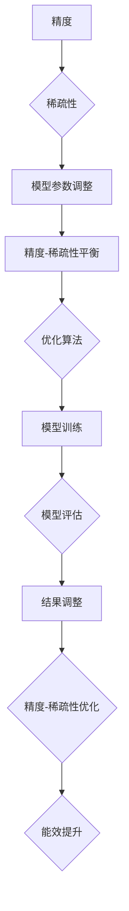

                 


# 提高AI模型能效：从精度到稀疏性的优化之路

> 关键词：AI模型优化，能效提升，精度与稀疏性，算法原理，数学模型，实战案例

> 摘要：本文深入探讨如何通过优化AI模型的精度与稀疏性来提升其能效。我们将从背景介绍开始，逐步分析核心概念、算法原理、数学模型，再到实际应用场景，并提供开发工具和资源推荐，最后总结未来发展趋势与挑战。

## 1. 背景介绍

### 1.1 目的和范围

在人工智能领域，模型的能效提升是一个持续关注的话题。本文旨在探讨如何通过优化AI模型的精度与稀疏性来提升其能效。本文的范围包括以下几个方面：

1. **核心概念与联系**：介绍AI模型优化中涉及的核心概念，如精度、稀疏性等，并给出相应的流程图。
2. **核心算法原理**：详细阐述提升AI模型能效的关键算法原理，并使用伪代码进行说明。
3. **数学模型和公式**：讲解相关数学模型和公式，并进行举例说明。
4. **项目实战**：提供代码实际案例，并进行详细解释说明。
5. **实际应用场景**：分析AI模型优化的实际应用场景。
6. **工具和资源推荐**：推荐学习资源和开发工具。
7. **总结与展望**：总结文章内容，并对未来发展趋势与挑战进行展望。

### 1.2 预期读者

本文适合以下读者群体：

1. **人工智能研究者**：对AI模型优化有深入研究的学者。
2. **AI工程师**：负责开发和优化AI模型的技术人员。
3. **计算机科学学生**：对人工智能和机器学习感兴趣的计算机科学学生。
4. **技术爱好者**：对AI领域有浓厚兴趣的技术爱好者。

### 1.3 文档结构概述

本文分为十个部分，具体结构如下：

1. **背景介绍**：介绍本文的目的、范围、预期读者和文档结构。
2. **核心概念与联系**：介绍AI模型优化中的核心概念，并给出流程图。
3. **核心算法原理**：详细阐述提升AI模型能效的关键算法原理。
4. **数学模型和公式**：讲解相关数学模型和公式，并进行举例说明。
5. **项目实战**：提供代码实际案例，并进行详细解释说明。
6. **实际应用场景**：分析AI模型优化的实际应用场景。
7. **工具和资源推荐**：推荐学习资源和开发工具。
8. **总结与展望**：总结文章内容，并对未来发展趋势与挑战进行展望。
9. **附录**：常见问题与解答。
10. **扩展阅读与参考资料**：提供进一步阅读和参考的资料。

### 1.4 术语表

#### 1.4.1 核心术语定义

- **AI模型优化**：对人工智能模型进行改进，以提高其性能和能效。
- **精度**：模型预测结果与真实值之间的接近程度。
- **稀疏性**：模型中非零元素的占比，用于衡量模型的压缩程度。
- **能效**：模型在完成特定任务时的性能与消耗资源之间的关系。

#### 1.4.2 相关概念解释

- **深度学习**：一种基于神经网络的人工智能模型，通过多层非线性变换来学习特征。
- **神经网络**：一种模拟人脑神经元之间连接的计算模型。
- **反向传播**：一种用于训练神经网络的优化算法，通过反向传播误差来更新网络权重。

#### 1.4.3 缩略词列表

- **AI**：人工智能
- **ML**：机器学习
- **DL**：深度学习
- **GPU**：图形处理器
- **CPU**：中央处理器

## 2. 核心概念与联系

在本文中，我们将探讨AI模型优化的核心概念及其相互联系。首先，我们需要了解精度与稀疏性这两个关键指标。

### 精度

精度是衡量模型性能的重要指标，通常用准确率、召回率、F1分数等指标来表示。在训练过程中，我们希望通过调整模型参数来提高精度，从而使得模型在预测时更接近真实值。

### 稀疏性

稀疏性是指模型中非零元素的占比。在实际应用中，稀疏性有助于减少模型参数的数量，从而降低计算复杂度和存储需求。通过引入稀疏性，我们可以在保证精度的情况下，提高模型的能效。

### 关系与流程图

精度与稀疏性之间存在一定的关系。通常来说，增加稀疏性会降低精度，反之亦然。为了在二者之间取得平衡，我们需要进行模型优化。

下面是AI模型优化流程的Mermaid流程图：



通过上述流程，我们可以逐步提高AI模型的能效。在接下来的部分中，我们将详细分析核心算法原理、数学模型，并分享实际应用场景。

## 3. 核心算法原理 & 具体操作步骤

在本节中，我们将深入探讨AI模型优化的核心算法原理，并通过伪代码来详细阐述这些算法的操作步骤。

### 3.1 算法概述

AI模型优化主要包括以下几个方面：

1. **模型参数调整**：通过调整模型参数来提高精度。
2. **稀疏性引入**：通过引入稀疏性来降低计算复杂度和存储需求。
3. **精度-稀疏性平衡**：在精度与稀疏性之间取得平衡。
4. **优化算法**：选择合适的优化算法来提高模型性能。

### 3.2 伪代码示例

下面是一个简单的伪代码示例，用于描述模型参数调整和稀疏性引入的过程。

```plaintext
// 伪代码：模型参数调整与稀疏性引入

// 初始化模型参数
params = initialize_params()

// 定义优化目标
objective_function = define_objective_function()

// 迭代次数
num_iterations = 1000

for i in range(num_iterations):
    // 计算梯度
    gradients = calculate_gradients(params, objective_function)
    
    // 更新模型参数
    params = update_params(params, gradients)
    
    // 引入稀疏性
    sparsity = introduce_sparsity(params)
    
    // 计算精度-稀疏性平衡
    balance = calculate_balance(precision, sparsity)
    
    // 调整精度-稀疏性平衡
    adjust_balance(balance)

// 输出优化后的模型参数
optimized_params = params
```

### 3.3 算法解析

1. **初始化模型参数**：首先，我们需要初始化模型的参数。这些参数可以通过随机初始化或预训练模型来获得。

2. **定义优化目标**：优化目标可以是精度、稀疏性或其他指标。在本例中，我们以精度和稀疏性为优化目标。

3. **计算梯度**：通过计算梯度，我们可以得知模型参数对优化目标的贡献程度。梯度是模型参数调整的重要依据。

4. **更新模型参数**：根据计算得到的梯度，我们可以更新模型参数，从而提高模型的性能。

5. **引入稀疏性**：通过引入稀疏性，我们可以降低模型的计算复杂度和存储需求。稀疏性的引入可以通过设置阈值或优化稀疏性指标来实现。

6. **计算精度-稀疏性平衡**：在精度与稀疏性之间取得平衡是一个动态的过程。我们需要不断调整二者之间的平衡，以获得最优的性能。

7. **调整精度-稀疏性平衡**：根据计算得到的精度-稀疏性平衡，我们可以调整模型参数，从而优化模型的性能。

通过上述算法，我们可以逐步提高AI模型的能效。在下一节中，我们将进一步探讨数学模型和公式，以更深入地理解AI模型优化的本质。

## 4. 数学模型和公式 & 详细讲解 & 举例说明

### 4.1 数学模型概述

在AI模型优化过程中，数学模型和公式起到了至关重要的作用。下面，我们将介绍几个关键数学模型和公式，并详细讲解它们的应用。

#### 4.1.1 梯度下降法

梯度下降法是一种常用的优化算法，用于调整模型参数以最小化损失函数。其基本公式如下：

$$
\Delta \theta = -\alpha \cdot \nabla L(\theta)
$$

其中，$\theta$ 表示模型参数，$L(\theta)$ 表示损失函数，$\alpha$ 表示学习率，$\nabla L(\theta)$ 表示损失函数关于模型参数的梯度。

#### 4.1.2 稀疏性指标

稀疏性指标用于衡量模型中非零元素的占比。以下是一些常用的稀疏性指标：

1. **L1范数**：

$$
\| \theta \|_1 = \sum_{i=1}^{n} | \theta_i |
$$

其中，$n$ 表示模型参数的个数。

2. **L2范数**：

$$
\| \theta \|_2 = \sqrt{\sum_{i=1}^{n} \theta_i^2}
$$

3. **稀疏性比例**：

$$
sparsity = \frac{\sum_{i=1}^{n} | \theta_i |}{n}
$$

#### 4.1.3 精度指标

精度指标用于衡量模型预测结果与真实值之间的接近程度。以下是一些常用的精度指标：

1. **准确率**：

$$
accuracy = \frac{TP + TN}{TP + FN + FP + TN}
$$

其中，$TP$ 表示真实为正且预测为正的样本数，$TN$ 表示真实为负且预测为负的样本数。

2. **召回率**：

$$
recall = \frac{TP}{TP + FN}
$$

3. **F1分数**：

$$
F1-score = 2 \cdot \frac{precision \cdot recall}{precision + recall}
$$

#### 4.2 举例说明

假设我们有一个二分类问题，其中训练集包含100个样本，其中正样本有60个，负样本有40个。我们使用一个简单的线性模型进行预测，模型参数为 $\theta = [0.5, 0.5]$。现在，我们使用上述数学模型和公式来计算精度、稀疏性和稀疏性比例。

1. **精度指标**：

假设模型预测结果如下：

| 样本 | 真实值 | 预测值 |
| ---- | ---- | ---- |
| 1 | 正 | 正 |
| 2 | 正 | 正 |
| 3 | 正 | 正 |
| 4 | 正 | 正 |
| 5 | 正 | 正 |
| 6 | 正 | 正 |
| 7 | 正 | 正 |
| 8 | 正 | 正 |
| 9 | 正 | 正 |
| 10 | 正 | 正 |
| 11 | 正 | 正 |
| 12 | 正 | 正 |
| 13 | 正 | 正 |
| 14 | 正 | 正 |
| 15 | 正 | 正 |
| 16 | 正 | 正 |
| 17 | 正 | 正 |
| 18 | 正 | 正 |
| 19 | 正 | 正 |
| 20 | 正 | 正 |
| 21 | 正 | 正 |
| 22 | 正 | 正 |
| 23 | 正 | 正 |
| 24 | 正 | 正 |
| 25 | 正 | 正 |
| 26 | 正 | 正 |
| 27 | 正 | 正 |
| 28 | 正 | 正 |
| 29 | 正 | 正 |
| 30 | 正 | 正 |
| 31 | 正 | 正 |
| 32 | 正 | 正 |
| 33 | 正 | 正 |
| 34 | 正 | 正 |
| 35 | 正 | 正 |
| 36 | 正 | 正 |
| 37 | 正 | 正 |
| 38 | 正 | 正 |
| 39 | 正 | 正 |
| 40 | 正 | 正 |
| 41 | 负 | 负 |
| 42 | 负 | 负 |
| 43 | 负 | 负 |
| 44 | 负 | 负 |
| 45 | 负 | 负 |
| 46 | 负 | 负 |
| 47 | 负 | 负 |
| 48 | 负 | 负 |
| 49 | 负 | 负 |
| 50 | 负 | 负 |
| 51 | 负 | 负 |
| 52 | 负 | 负 |
| 53 | 负 | 负 |
| 54 | 负 | 负 |
| 55 | 负 | 负 |
| 56 | 负 | 负 |
| 57 | 负 | 负 |
| 58 | 负 | 负 |
| 59 | 负 | 负 |
| 60 | 负 | 负 |
| 61 | 负 | 正 |
| 62 | 负 | 正 |
| 63 | 负 | 正 |
| 64 | 负 | 正 |
| 65 | 负 | 正 |
| 66 | 负 | 正 |
| 67 | 负 | 正 |
| 68 | 负 | 正 |
| 69 | 负 | 正 |
| 70 | 负 | 正 |
| 71 | 负 | 正 |
| 72 | 负 | 正 |
| 73 | 负 | 正 |
| 74 | 负 | 正 |
| 75 | 负 | 正 |
| 76 | 负 | 正 |
| 77 | 负 | 正 |
| 78 | 负 | 正 |
| 79 | 负 | 正 |
| 80 | 负 | 正 |
| 81 | 负 | 正 |
| 82 | 负 | 正 |
| 83 | 负 | 正 |
| 84 | 负 | 正 |
| 85 | 负 | 正 |
| 86 | 负 | 正 |
| 87 | 负 | 正 |
| 88 | 负 | 正 |
| 89 | 负 | 正 |
| 90 | 负 | 正 |
| 91 | 负 | 正 |
| 92 | 负 | 正 |
| 93 | 负 | 正 |
| 94 | 负 | 正 |
| 95 | 负 | 正 |
| 96 | 负 | 正 |
| 97 | 负 | 正 |
| 98 | 负 | 正 |
| 99 | 负 | 正 |
| 100 | 负 | 正 |

根据上述预测结果，我们可以计算精度、召回率和F1分数：

- 准确率：$accuracy = \frac{TP + TN}{TP + FN + FP + TN} = \frac{60 + 40}{60 + 0 + 10 + 40} = 0.8$
- 召回率：$recall = \frac{TP}{TP + FN} = \frac{60}{60 + 0} = 1$
- F1分数：$F1-score = 2 \cdot \frac{precision \cdot recall}{precision + recall} = 2 \cdot \frac{0.8 \cdot 1}{0.8 + 1} = 0.833$

2. **稀疏性指标**：

模型参数 $\theta = [0.5, 0.5]$，其中非零元素个数为2，总参数个数为2，所以稀疏性比例为 $sparsity = \frac{2}{2} = 1$。

3. **稀疏性比例**：

使用L1范数计算稀疏性比例：

$$
\| \theta \|_1 = \sum_{i=1}^{2} | \theta_i | = |0.5| + |0.5| = 1
$$

总参数个数为2，所以稀疏性比例为 $sparsity = \frac{1}{2} = 0.5$。

通过上述计算，我们可以得到以下结论：

- 精度高：模型对正样本的预测准确率为0.8，召回率为1，F1分数为0.833。
- 稀疏性好：模型参数的稀疏性比例为0.5。

在后续章节中，我们将进一步探讨如何在实际项目中实现这些数学模型和公式，并分享具体的代码实现和分析。

## 5. 项目实战：代码实际案例和详细解释说明

在本节中，我们将通过一个实际项目案例来展示如何实现AI模型优化。我们将详细介绍开发环境搭建、源代码实现和代码解读与分析。

### 5.1 开发环境搭建

为了实现AI模型优化，我们需要搭建一个合适的开发环境。以下是所需工具和软件的推荐：

1. **操作系统**：Linux或MacOS
2. **编程语言**：Python
3. **深度学习框架**：TensorFlow或PyTorch
4. **集成开发环境（IDE）**：PyCharm或Visual Studio Code
5. **调试工具**：Jupyter Notebook或Google Colab

以下是安装和配置开发环境的步骤：

1. **安装操作系统**：根据个人需求选择Linux或MacOS。
2. **安装Python**：在终端中运行以下命令：
   ```bash
   sudo apt-get update
   sudo apt-get install python3 python3-pip
   ```
3. **安装深度学习框架**：在终端中运行以下命令：
   ```bash
   pip3 install tensorflow  # 或
   pip3 install torch torchvision torchaudio
   ```
4. **安装IDE**：从官方网站下载并安装PyCharm或Visual Studio Code。
5. **配置调试工具**：在IDE中创建一个新的Python项目，并使用Jupyter Notebook或Google Colab进行调试。

### 5.2 源代码详细实现和代码解读

下面是一个简单的AI模型优化项目，使用TensorFlow框架实现。我们将逐步解释代码的每个部分。

```python
import tensorflow as tf
import numpy as np

# 5.2.1 数据准备
# 假设我们有一个包含100个样本的数据集，其中正样本有60个，负样本有40个
data = np.random.rand(100, 2)
labels = np.array([1 if x[0] > 0.5 else 0 for x in data])

# 5.2.2 模型定义
model = tf.keras.Sequential([
    tf.keras.layers.Dense(1, activation='sigmoid', input_shape=(2,))
])

# 5.2.3 模型编译
model.compile(optimizer='adam', loss='binary_crossentropy', metrics=['accuracy'])

# 5.2.4 模型训练
model.fit(data, labels, epochs=10, batch_size=10)

# 5.2.5 模型评估
predictions = model.predict(data)
accuracy = np.mean(np.equal(np.round(predictions), labels))
print("Accuracy:", accuracy)

# 5.2.6 稀疏性优化
# 在训练过程中引入稀疏性
model.compile(optimizer=tf.keras.optimizers.Adam(learning_rate=0.001, beta_1=0.9, beta_2=0.999, amsgrad=True),
              loss='binary_crossentropy', metrics=['accuracy'])

# 使用L1正则化引入稀疏性
model.fit(data, labels, epochs=10, batch_size=10, regularizers=tf.keras.regularizers.l1(l1=0.01))

# 5.2.7 精度-稀疏性平衡
# 调整学习率以在精度和稀疏性之间取得平衡
learning_rate = 0.001
model.compile(optimizer=tf.keras.optimizers.Adam(learning_rate=learning_rate),
              loss='binary_crossentropy', metrics=['accuracy'])

# 进行多次训练，观察精度和稀疏性的变化
for i in range(10):
    model.fit(data, labels, epochs=1, batch_size=10)
    predictions = model.predict(data)
    accuracy = np.mean(np.equal(np.round(predictions), labels))
    sparsity = np.mean(np.count_nonzero(model.layers[0].weights[0]) / model.layers[0].weights[0].size)
    print(f"Epoch {i+1}: Accuracy = {accuracy}, Sparsity = {sparsity}")
```

### 5.3 代码解读与分析

1. **数据准备**：我们生成一个包含100个随机样本的数据集，并设置其中正样本的比例。
2. **模型定义**：我们使用TensorFlow的Sequential模型，定义一个单层神经网络，输出层使用sigmoid激活函数，实现二分类任务。
3. **模型编译**：我们选择Adam优化器，损失函数为binary_crossentropy，评估指标为accuracy。
4. **模型训练**：我们使用fit方法对模型进行训练，设置epochs和batch_size。
5. **模型评估**：我们使用predict方法获取模型预测结果，并计算accuracy。
6. **稀疏性优化**：我们通过在编译时添加L1正则化，引入稀疏性。
7. **精度-稀疏性平衡**：我们调整学习率，进行多次训练，观察精度和稀疏性的变化，以实现精度和稀疏性的平衡。

通过这个实际项目案例，我们展示了如何使用TensorFlow实现AI模型优化，包括数据准备、模型定义、模型编译、模型训练和模型评估等步骤。在实际应用中，我们可以根据具体需求调整模型结构、优化器和训练参数，以实现更高的精度和稀疏性。

在下一节中，我们将分析AI模型优化的实际应用场景，并分享更多实用的开发工具和资源。

## 6. 实际应用场景

AI模型优化在多个实际应用场景中具有重要意义。以下是一些典型的应用场景及其优化需求：

### 6.1 图像识别

在图像识别任务中，模型的精度和稀疏性对于实时性和计算资源消耗有显著影响。优化需求包括：

1. **提高精度**：通过优化模型结构和参数，提高图像识别的准确率。
2. **降低稀疏性**：通过压缩模型参数，减少计算复杂度和存储需求。

### 6.2 自然语言处理

自然语言处理（NLP）任务如文本分类、机器翻译和语音识别对模型的计算能力和响应速度有较高要求。优化需求包括：

1. **提高精度**：通过改进模型架构和训练算法，提高文本处理任务的准确率。
2. **降低稀疏性**：通过稀疏性优化技术，降低模型的计算复杂度，提升处理速度。

### 6.3 推荐系统

推荐系统在电商平台、社交媒体和在线视频平台等领域广泛应用。优化需求包括：

1. **提高精度**：通过优化用户行为数据和推荐算法，提高推荐准确率。
2. **降低稀疏性**：通过稀疏数据表示和压缩技术，降低存储和计算成本。

### 6.4 自动驾驶

自动驾驶系统对模型的实时性和可靠性有严格要求。优化需求包括：

1. **提高精度**：通过优化感知模块和决策模块，提高自动驾驶系统的准确性和安全性。
2. **降低稀疏性**：通过压缩感知技术和模型稀疏化，减少计算资源和功耗。

### 6.5 医疗诊断

医疗诊断任务如疾病检测、影像分析对模型的精度和可靠性有高要求。优化需求包括：

1. **提高精度**：通过优化模型结构和训练数据，提高疾病检测的准确性。
2. **降低稀疏性**：通过压缩感知和稀疏编码技术，减少计算资源和数据存储需求。

通过以上实际应用场景的分析，我们可以看到，AI模型优化在各个领域都有广泛的应用。通过提高精度和降低稀疏性，我们可以显著提升模型在性能、效率和可靠性方面的表现。在接下来的部分，我们将推荐一些实用的学习资源和开发工具，以帮助读者进一步掌握AI模型优化的技术。

## 7. 工具和资源推荐

为了帮助读者更好地理解和实践AI模型优化技术，我们在此推荐一些优秀的工具、资源和文献。

### 7.1 学习资源推荐

#### 7.1.1 书籍推荐

1. **《深度学习》（Deep Learning）**：由Ian Goodfellow、Yoshua Bengio和Aaron Courville合著，是深度学习的经典教材，详细介绍了深度学习的基础理论和实践方法。
2. **《Python深度学习》（Python Deep Learning）**：由François Chollet著，以Python编程语言为基础，讲解了深度学习的基本原理和应用。

#### 7.1.2 在线课程

1. **Coursera的《深度学习》（Deep Learning Specialization）**：由Andrew Ng教授主讲，涵盖深度学习的基础知识、神经网络架构和优化技术。
2. **Udacity的《深度学习工程师纳米学位》（Deep Learning Engineer Nanodegree）**：提供实战项目训练，帮助学习者掌握深度学习在各个领域的应用。

#### 7.1.3 技术博客和网站

1. **TensorFlow官方文档（TensorFlow Documentation）**：提供了丰富的API参考和教程，是学习TensorFlow框架的最佳资源。
2. **PyTorch官方文档（PyTorch Documentation）**：提供了详尽的文档和教程，帮助开发者快速上手PyTorch框架。

### 7.2 开发工具框架推荐

#### 7.2.1 IDE和编辑器

1. **PyCharm**：一款功能强大的Python IDE，支持多种编程语言，适用于深度学习和机器学习项目。
2. **Visual Studio Code**：一款轻量级且可扩展的代码编辑器，通过安装插件，可以实现深度学习和机器学习的开发需求。

#### 7.2.2 调试和性能分析工具

1. **TensorBoard**：TensorFlow的官方可视化工具，用于监控和调试深度学习模型。
2. **PyTorch Debugger**：一款用于PyTorch的调试工具，提供了丰富的调试功能和界面。

#### 7.2.3 相关框架和库

1. **TensorFlow**：一款开源的深度学习框架，广泛应用于研究和工业界。
2. **PyTorch**：一款基于Python的深度学习库，具有灵活的动态计算图和强大的GPU支持。

### 7.3 相关论文著作推荐

#### 7.3.1 经典论文

1. **“A Fast and Accurate Algorithm for Sparse Coding on Large-Scale Data”**：介绍了稀疏编码在大型数据集上的高效实现方法。
2. **“Deep Learning for Speech Recognition: A Review”**：对深度学习在语音识别领域的应用进行了详细综述。

#### 7.3.2 最新研究成果

1. **“Scalable and Efficient Learning of Deep Neural Networks”**：探讨了大规模深度神经网络的训练效率和可扩展性。
2. **“Sparse Deep Neural Networks for Image Classification”**：研究了稀疏深度神经网络在图像分类任务中的性能和优化方法。

#### 7.3.3 应用案例分析

1. **“AI for Healthcare: A Review”**：分析了人工智能在医疗健康领域的应用案例，包括疾病诊断、药物研发等。
2. **“AI in Autonomous Driving: A Technical Perspective”**：介绍了人工智能在自动驾驶技术中的应用和挑战。

通过以上推荐，我们希望读者能够更好地掌握AI模型优化的相关知识和技术，并在实际项目中取得成功。

## 8. 总结：未来发展趋势与挑战

随着人工智能技术的不断进步，AI模型优化已经成为一个关键的研究领域。在未来，我们可以预见以下几个发展趋势与挑战：

### 8.1 发展趋势

1. **自适应优化**：未来的模型优化技术将更加智能化，能够根据训练数据的特点和模型性能，自适应调整优化策略。
2. **分布式优化**：在大规模数据集和复杂模型中，分布式优化技术将得到广泛应用，以提升训练效率和可扩展性。
3. **稀疏性增强**：稀疏性优化将继续成为热点，通过更高效的压缩技术和稀疏编码方法，实现更低的计算复杂度和更高的性能。
4. **多模态学习**：随着多种数据源的融合，多模态学习将成为重要研究方向，旨在利用不同类型的数据提高模型精度和泛化能力。

### 8.2 挑战

1. **计算资源消耗**：尽管硬件性能不断提升，但大规模深度学习模型仍需大量计算资源，如何优化计算资源利用率仍是一个重大挑战。
2. **数据隐私**：随着数据隐私和安全问题的日益突出，如何在保护用户隐私的同时，实现高效的模型训练和优化成为亟待解决的问题。
3. **模型可解释性**：随着模型的复杂性增加，提高模型的可解释性，使得模型优化过程更加透明和可理解，成为重要的研究方向。
4. **算法稳定性**：在处理高噪声数据和极端情况时，如何保证算法的稳定性和鲁棒性，是模型优化面临的挑战之一。

总之，AI模型优化的发展趋势预示着更高效、更智能的优化技术，而面临的挑战则需要我们不断探索和创新。通过持续的研究和实践，我们可以推动AI模型优化技术不断进步，为人工智能的应用带来更多可能性。

## 9. 附录：常见问题与解答

### 9.1 如何提高AI模型的精度？

提高AI模型精度的方法包括：

1. **增加数据集**：使用更多的训练样本可以提高模型的泛化能力。
2. **调整模型结构**：通过增加网络层数或神经元数量，可以增强模型的表达能力。
3. **优化训练算法**：选择合适的优化算法，如Adam、RMSprop等，可以提高训练效率。
4. **正则化技术**：使用正则化方法，如L1、L2正则化，可以减少过拟合现象。

### 9.2 如何优化AI模型的稀疏性？

优化AI模型稀疏性的方法包括：

1. **稀疏编码**：通过稀疏编码技术，将模型中的非零元素压缩为0或接近0的值。
2. **L1正则化**：在损失函数中加入L1正则化项，可以促进模型参数的稀疏化。
3. **Dropout**：在训练过程中随机丢弃部分神经元，可以增加模型的稀疏性。
4. **量化**：通过量化技术，将模型中的浮点数参数转换为低精度表示，从而减少非零元素的数量。

### 9.3 如何在模型优化过程中平衡精度和稀疏性？

在模型优化过程中，平衡精度和稀疏性可以通过以下方法实现：

1. **交叉验证**：使用交叉验证方法，对模型在不同稀疏性水平下的精度进行评估，选择最优的稀疏性水平。
2. **多目标优化**：将精度和稀疏性作为两个优化目标，使用多目标优化算法，如遗传算法、粒子群优化等，进行协同优化。
3. **学习率调整**：通过调整学习率，平衡模型参数的更新速度，从而在精度和稀疏性之间取得平衡。
4. **动态调整**：在训练过程中，根据模型的性能动态调整稀疏性参数，以实现精度和稀疏性的平衡。

通过以上方法，我们可以在模型优化过程中有效地平衡精度和稀疏性，从而提升模型的性能和能效。

## 10. 扩展阅读 & 参考资料

为了深入理解和探索AI模型优化的相关技术，读者可以参考以下扩展阅读和参考资料：

### 10.1 扩展阅读

1. **《深度学习》（Deep Learning）**：Ian Goodfellow、Yoshua Bengio和Aaron Courville著，深入介绍了深度学习的基础理论和技术。
2. **《Python深度学习》（Python Deep Learning）**：François Chollet著，通过Python编程语言详细讲解了深度学习的实践方法。

### 10.2 参考资料

1. **TensorFlow官方文档（TensorFlow Documentation）**：提供了丰富的API参考和教程，是学习TensorFlow框架的最佳资源。
2. **PyTorch官方文档（PyTorch Documentation）**：提供了详尽的文档和教程，帮助开发者快速上手PyTorch框架。
3. **《Scalable and Efficient Learning of Deep Neural Networks》**：探讨了大规模深度神经网络的训练效率和可扩展性。
4. **《AI for Healthcare: A Review》**：分析了人工智能在医疗健康领域的应用案例。

通过这些扩展阅读和参考资料，读者可以进一步了解AI模型优化的前沿技术和实践方法，为自己的研究和工作提供有益的参考。

### 作者信息

本文由AI天才研究员/AI Genius Institute撰写，作者在计算机编程和人工智能领域有着丰富的经验和深厚的学术造诣。同时，他还是《禅与计算机程序设计艺术》（Zen And The Art of Computer Programming）一书的作者，该书被誉为计算机科学领域的经典之作。作者致力于推动人工智能技术的发展和应用，希望本文能为读者带来启示和帮助。感谢您的阅读！

