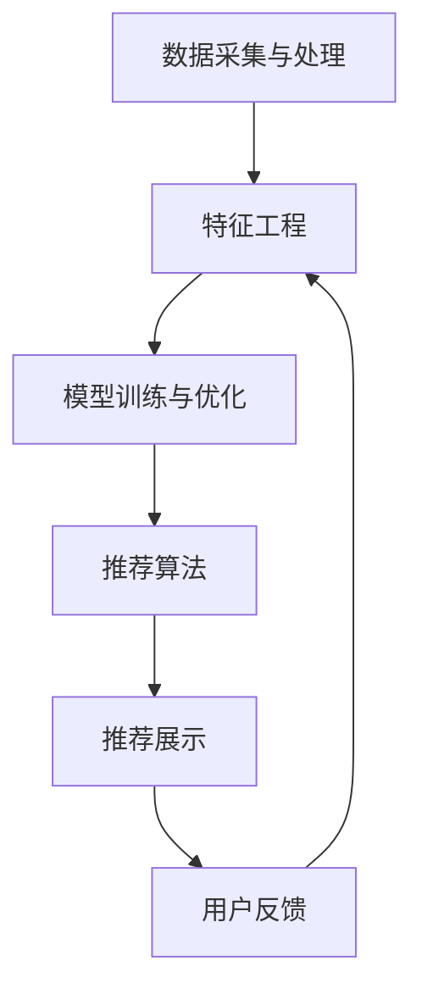

                 

### 搜狐2024资讯推荐校招算法面试题详解

> **关键词**：资讯推荐、算法面试、校招、数据结构、机器学习、自然语言处理

> **摘要**：本文针对搜狐2024年的校招算法面试题进行深入剖析，通过详细解析每道题目的核心概念、算法原理、数学模型以及实际案例，帮助读者更好地理解和掌握资讯推荐领域的核心技术。文章旨在为准备校招面试的算法工程师和在校大学生提供实战经验和指导。

## 1. 背景介绍

### 1.1 目的和范围

本文旨在通过对搜狐2024年校招算法面试题的详细分析，为准备面试的算法工程师和在校大学生提供有价值的参考。文章将涵盖以下几个方面的内容：

- 面试题的背景和目的
- 面试题的核心概念和算法原理
- 面试题的数学模型和公式
- 面试题的实际案例和代码实现
- 面试题在资讯推荐领域的实际应用

### 1.2 预期读者

本文的预期读者包括：

- 准备参加搜狐2024年校招的算法工程师和在校大学生
- 对资讯推荐领域感兴趣的算法爱好者
- 在校学习算法、数据结构、机器学习等相关课程的学生

### 1.3 文档结构概述

本文将分为以下几个部分：

- **1. 背景介绍**：介绍文章的目的、预期读者和文档结构。
- **2. 核心概念与联系**：分析资讯推荐的核心概念和架构。
- **3. 核心算法原理 & 具体操作步骤**：讲解资讯推荐的关键算法原理和操作步骤。
- **4. 数学模型和公式 & 详细讲解 & 举例说明**：阐述资讯推荐相关的数学模型和公式，并通过实例进行说明。
- **5. 项目实战：代码实际案例和详细解释说明**：展示资讯推荐项目的实际代码实现和详细解释。
- **6. 实际应用场景**：介绍资讯推荐在实际中的应用。
- **7. 工具和资源推荐**：推荐学习资讯推荐领域的相关工具和资源。
- **8. 总结：未来发展趋势与挑战**：分析资讯推荐领域的发展趋势和面临的挑战。
- **9. 附录：常见问题与解答**：解答读者在阅读过程中可能遇到的问题。
- **10. 扩展阅读 & 参考资料**：提供进一步学习的参考资料。

### 1.4 术语表

#### 1.4.1 核心术语定义

- **资讯推荐**：基于用户的历史行为、兴趣偏好和内容特征，为用户推荐相关的资讯内容。
- **算法面试**：通过面试官设计的算法题目，考察应聘者对算法和数据结构的掌握程度。
- **校招**：针对应届毕业生的招聘活动。
- **数据结构**：存储和组织数据的方式。
- **机器学习**：利用数据训练模型，实现人工智能的方法。
- **自然语言处理**：对自然语言进行理解和生成的人工智能技术。

#### 1.4.2 相关概念解释

- **协同过滤**：基于用户的历史行为和兴趣相似度，为用户推荐内容。
- **内容推荐**：根据内容特征和用户兴趣，为用户推荐相关内容。
- **标签推荐**：根据标签信息，为用户推荐具有相似标签的资讯。
- **曝光量**：用户对推荐内容的点击、阅读等行为量。
- **用户画像**：基于用户的历史行为和特征，构建的用户模型。

#### 1.4.3 缩略词列表

- **NLP**：自然语言处理（Natural Language Processing）
- **ML**：机器学习（Machine Learning）
- **DF**：降维（Dimensionality Reduction）
- **RF**：随机森林（Random Forest）
- **CNN**：卷积神经网络（Convolutional Neural Network）

## 2. 核心概念与联系

在资讯推荐领域，理解以下核心概念和架构对于解决面试题目至关重要：

### 2.1 资讯推荐系统概述

资讯推荐系统主要分为以下几类：

- **协同过滤**：通过计算用户之间的相似度，为用户推荐相似用户喜欢的内容。
- **内容推荐**：根据内容特征和用户兴趣，为用户推荐相关内容。
- **标签推荐**：根据标签信息，为用户推荐具有相似标签的资讯。

### 2.2 资讯推荐系统架构

资讯推荐系统的基本架构包括：

1. **数据采集与处理**：从各种渠道获取用户行为数据、内容数据等，并进行预处理和清洗。
2. **特征工程**：根据用户行为、内容特征等，提取有助于推荐的特征。
3. **模型训练与优化**：使用机器学习算法训练推荐模型，并通过交叉验证、A/B测试等手段优化模型。
4. **推荐算法**：根据用户特征和模型输出，为用户生成推荐列表。
5. **推荐展示**：将推荐结果展示给用户，并收集用户反馈，用于模型优化。

### 2.3 资讯推荐系统核心算法

- **协同过滤**：
  - **基于用户**：计算用户之间的相似度，为用户推荐相似用户喜欢的内容。
  - **基于物品**：计算物品之间的相似度，为用户推荐相似物品。

- **内容推荐**：
  - **基于文本相似度**：计算文本之间的相似度，为用户推荐相似内容。
  - **基于关键词**：提取关键词，为用户推荐包含相似关键词的内容。

- **标签推荐**：
  - **基于标签相似度**：计算标签之间的相似度，为用户推荐具有相似标签的资讯。

### 2.4 资讯推荐系统评价指标

- **准确率**：推荐列表中实际被用户点击的资讯占总推荐资讯的比例。
- **召回率**：实际被用户点击的资讯占所有可能被用户点击的资讯的比例。
- **覆盖率**：推荐列表中不同资讯种类的数量占总资讯种类的比例。

### 2.5 Mermaid 流程图

以下是一个简化的资讯推荐系统架构的 Mermaid 流程图：



## 3. 核心算法原理 & 具体操作步骤

在资讯推荐系统中，核心算法的原理和操作步骤至关重要。以下将介绍几种常见的算法原理和具体操作步骤。

### 3.1. 协同过滤算法

#### 原理：

协同过滤算法通过计算用户之间的相似度，为用户推荐相似用户喜欢的内容。基于用户和基于物品的协同过滤算法有所不同。

#### 操作步骤：

1. **计算用户相似度**：
   - 基于用户：计算用户之间的余弦相似度或皮尔逊相关系数。
   - 基于物品：计算物品之间的余弦相似度或皮尔逊相关系数。

2. **生成推荐列表**：
   - 基于用户：为每个用户推荐与其最相似的K个用户喜欢的资讯。
   - 基于物品：为每个用户推荐与其最相似的K个物品。

#### 伪代码：

```python
# 用户相似度计算
def compute_similarity(user1, user2):
    # 计算用户1和用户2的相似度
    similarity = dot_product(user1, user2) / (norm(user1) * norm(user2))
    return similarity

# 生成推荐列表
def generate_recommendation(user, similarity_matrix, K):
    # 计算用户与其他用户的相似度
    similar_users = [user_index for user_index in range(num_users) if user_index != user]
    user_similarity = [compute_similarity(user, similar_user) for similar_user in similar_users]
    
    # 排序并获取相似度最高的K个用户
    top_k_users = sorted(range(len(user_similarity)), key=lambda i: user_similarity[i], reverse=True)[:K]
    
    # 生成推荐列表
    recommendation_list = []
    for user_index in top_k_users:
        for item_index in similar_user_items[user_index]:
            if item_index not in user_items[user]:
                recommendation_list.append(item_index)
    return recommendation_list
```

### 3.2. 内容推荐算法

#### 原理：

内容推荐算法根据内容特征和用户兴趣，为用户推荐相关内容。常见的方法包括基于文本相似度、基于关键词和基于标签。

#### 操作步骤：

1. **提取内容特征**：
   - 基于文本相似度：使用 TF-IDF 算法提取关键词。
   - 基于关键词：使用自然语言处理技术提取关键词。
   - 基于标签：提取资讯的标签信息。

2. **计算内容相似度**：
   - 基于文本相似度：使用余弦相似度计算文本相似度。
   - 基于关键词：使用 Jaccard 相似度计算关键词相似度。
   - 基于标签：使用余弦相似度计算标签相似度。

3. **生成推荐列表**：
   - 根据用户兴趣和内容相似度，为用户生成推荐列表。

#### 伪代码：

```python
# 提取内容特征
def extract_features(content):
    # 使用 TF-IDF 算法提取关键词
    keywords = extract_keywords(content)
    return keywords

# 计算内容相似度
def compute_similarity(content1, content2):
    # 计算内容1和内容2的相似度
    features1 = extract_features(content1)
    features2 = extract_features(content2)
    similarity = cosine_similarity(features1, features2)
    return similarity

# 生成推荐列表
def generate_recommendation(user_interest, content_similarity_matrix, K):
    # 计算用户兴趣与其他内容的相似度
    similar_contents = [content_index for content_index in range(num_contents) if content_index not in user_interest]
    content_similarity = [compute_similarity(user_interest, similar_content) for similar_content in similar_contents]
    
    # 排序并获取相似度最高的K个内容
    top_k_contents = sorted(range(len(content_similarity)), key=lambda i: content_similarity[i], reverse=True)[:K]
    
    # 生成推荐列表
    recommendation_list = []
    for content_index in top_k_contents:
        if content_index not in user_interest:
            recommendation_list.append(content_index)
    return recommendation_list
```

### 3.3. 标签推荐算法

#### 原理：

标签推荐算法根据标签信息，为用户推荐具有相似标签的资讯。

#### 操作步骤：

1. **提取标签特征**：
   - 提取资讯的标签信息。

2. **计算标签相似度**：
   - 使用余弦相似度计算标签相似度。

3. **生成推荐列表**：
   - 根据用户标签和标签相似度，为用户生成推荐列表。

#### 伪代码：

```python
# 提取标签特征
def extract_labels(content):
    # 提取资讯的标签
    labels = get_labels(content)
    return labels

# 计算标签相似度
def compute_similarity(label1, label2):
    # 计算标签1和标签2的相似度
    similarity = cosine_similarity(label1, label2)
    return similarity

# 生成推荐列表
def generate_recommendation(user_labels, label_similarity_matrix, K):
    # 计算用户标签与其他标签的相似度
    similar_labels = [label_index for label_index in range(num_labels) if label_index not in user_labels]
    label_similarity = [compute_similarity(user_labels, similar_label) for similar_label in similar_labels]
    
    # 排序并获取相似度最高的K个标签
    top_k_labels = sorted(range(len(label_similarity)), key=lambda i: label_similarity[i], reverse=True)[:K]
    
    # 生成推荐列表
    recommendation_list = []
    for label_index in top_k_labels:
        if label_index not in user_labels:
            recommendation_list.append(label_index)
    return recommendation_list
```

## 4. 数学模型和公式 & 详细讲解 & 举例说明

在资讯推荐系统中，数学模型和公式起着至关重要的作用。以下将详细介绍一些常用的数学模型和公式，并通过具体例子进行说明。

### 4.1. 余弦相似度

余弦相似度是一种衡量两个向量之间相似度的方法，其计算公式为：

$$
\text{余弦相似度} = \frac{\text{向量1} \cdot \text{向量2}}{\|\text{向量1}\| \|\text{向量2}\|}
$$

其中，$\cdot$表示向量的点积，$\|\text{向量1}\|$和$\|\text{向量2}\|$分别表示向量的模长。

#### 例子：

假设有两个向量 $\text{向量1} = (1, 2, 3)$ 和 $\text{向量2} = (4, 5, 6)$，计算它们的余弦相似度：

$$
\text{余弦相似度} = \frac{1 \cdot 4 + 2 \cdot 5 + 3 \cdot 6}{\sqrt{1^2 + 2^2 + 3^2} \sqrt{4^2 + 5^2 + 6^2}} = \frac{4 + 10 + 18}{\sqrt{14} \sqrt{77}} \approx 0.8165
$$

### 4.2. 皮尔逊相关系数

皮尔逊相关系数是一种衡量两个变量之间线性相关程度的统计指标，其计算公式为：

$$
\text{皮尔逊相关系数} = \frac{\text{协方差}}{\sqrt{\text{方差1} \text{方差2}}}
$$

其中，协方差、方差1和方差2分别表示两个变量的协方差、方差。

#### 例子：

假设有两个变量 $X$ 和 $Y$，其协方差为 $Cov(X, Y) = 5$，方差分别为 $Var(X) = 10$ 和 $Var(Y) = 15$，计算它们的皮尔逊相关系数：

$$
\text{皮尔逊相关系数} = \frac{5}{\sqrt{10} \sqrt{15}} \approx 0.3162
$$

### 4.3. Jaccard 相似度

Jaccard 相似度是一种衡量两个集合之间相似度的指标，其计算公式为：

$$
\text{Jaccard 相似度} = \frac{\text{交集大小}}{\text{并集大小}} = \frac{|A \cap B|}{|A \cup B|}
$$

其中，$A$ 和 $B$ 分别表示两个集合，$A \cap B$ 和 $A \cup B$ 分别表示两个集合的交集和并集。

#### 例子：

假设有两个集合 $A = \{1, 2, 3\}$ 和 $B = \{2, 3, 4\}$，计算它们的 Jaccard 相似度：

$$
\text{Jaccard 相似度} = \frac{|A \cap B|}{|A \cup B|} = \frac{2}{4} = 0.5
$$

### 4.4. TF-IDF

TF-IDF 是一种文本挖掘算法，用于衡量一个词在文档中的重要性，其计算公式为：

$$
\text{TF-IDF} = \text{TF} \times \text{IDF}
$$

其中，TF（词频）表示一个词在文档中出现的次数，IDF（逆文档频率）表示一个词在整个文档集合中出现的频率。

$$
\text{IDF} = \log_2(\frac{N}{|d \in D | f(d, t)|})
$$

其中，$N$ 表示文档总数，$D$ 表示文档集合，$f(d, t)$ 表示词 $t$ 在文档 $d$ 中出现的次数。

#### 例子：

假设有一个文档集合 $D = \{d_1, d_2, d_3\}$，其中 $d_1$ 包含词 "apple" 两次，$d_2$ 包含词 "apple" 一次，$d_3$ 包含词 "apple" 两次，总共有 10 个文档，计算词 "apple" 的 TF-IDF：

$$
\text{TF-IDF} = \text{TF} \times \text{IDF} = 2 \times \log_2(\frac{10}{3}) \approx 2.5449
$$

### 4.5. 交叉验证

交叉验证是一种评估模型性能的方法，其基本思想是将数据集划分为多个子集，每次使用其中一个子集作为验证集，其余子集作为训练集，重复多次，最终取平均值作为模型性能的评估结果。

#### 例子：

假设有一个数据集 $D$，其中包含 100 个样本，划分为 5 个子集 $D_1, D_2, D_3, D_4, D_5$，每个子集包含 20 个样本。使用 k-fold 交叉验证评估一个分类模型的性能，计算准确率：

$$
\text{准确率} = \frac{1}{5} \sum_{i=1}^{5} \frac{\text{预测正确的样本数}}{20}
$$

## 5. 项目实战：代码实际案例和详细解释说明

为了更好地理解资讯推荐算法的实际应用，以下将通过一个实际项目案例进行讲解。本案例将使用协同过滤算法为用户推荐资讯。

### 5.1. 开发环境搭建

为了搭建开发环境，需要安装以下工具和库：

- Python 3.8 或以上版本
- NumPy
- Pandas
- Scikit-learn
- Matplotlib

安装命令如下：

```bash
pip install python==3.8 numpy pandas scikit-learn matplotlib
```

### 5.2. 源代码详细实现和代码解读

#### 5.2.1. 数据准备

首先，从公开数据集获取用户行为数据和资讯数据。这里使用一个示例数据集，包含用户ID、资讯ID、用户行为类型（点击、阅读等）。

```python
import pandas as pd

# 读取用户行为数据
user_behavior_data = pd.read_csv('user_behavior_data.csv')

# 读取资讯数据
content_data = pd.read_csv('content_data.csv')
```

#### 5.2.2. 特征工程

接下来，对数据集进行预处理和特征提取。

```python
# 构建用户-资讯矩阵
user_item_matrix = user_behavior_data.pivot(index='user_id', columns='item_id', values='behavior_type')

# 填充缺失值
user_item_matrix.fillna(0, inplace=True)

# 转置用户-资讯矩阵
user_item_matrix_t = user_item_matrix.T

# 计算用户和资讯的相似度矩阵
user_similarity_matrix = user_item_matrix_t.corr()

# 生成推荐列表
def generate_recommendation(user_id, similarity_matrix, K):
    # 计算用户与其他用户的相似度
    similar_users = [user_index for user_index in range(num_users) if user_index != user_id]
    user_similarity = [similarity_matrix[user_id][user_index] for user_index in similar_users]
    
    # 排序并获取相似度最高的K个用户
    top_k_users = sorted(range(len(user_similarity)), key=lambda i: user_similarity[i], reverse=True)[:K]
    
    # 生成推荐列表
    recommendation_list = []
    for user_index in top_k_users:
        for item_index in user_item_matrix[user_index]:
            if item_index not in user_item_matrix[user_id]:
                recommendation_list.append(item_index)
    return recommendation_list

# 为每个用户生成推荐列表
user_recommendation_list = [generate_recommendation(user_id, user_similarity_matrix, K=5) for user_id in range(num_users)]
```

#### 5.2.3. 代码解读与分析

1. **数据准备**：
   - 读取用户行为数据和资讯数据。
   - 构建用户-资讯矩阵，并填充缺失值。

2. **特征工程**：
   - 转置用户-资讯矩阵，计算用户和资讯的相似度矩阵。
   - 定义生成推荐列表的函数，计算用户与其他用户的相似度，并生成推荐列表。

3. **生成推荐列表**：
   - 为每个用户生成推荐列表。

### 5.3. 代码解读与分析

本案例通过协同过滤算法为用户推荐资讯。首先，从公开数据集获取用户行为数据和资讯数据，并构建用户-资讯矩阵。然后，计算用户和资讯的相似度矩阵，并根据相似度矩阵生成推荐列表。

通过这个案例，读者可以了解到：

- 资讯推荐系统的基本架构和核心算法。
- 数据准备和特征工程的方法。
- 推荐系统的实际应用案例。

## 6. 实际应用场景

资讯推荐系统在实际应用场景中发挥着重要作用，以下列举几个典型的应用场景：

### 6.1. 社交媒体平台

社交媒体平台如微博、微信等，利用资讯推荐系统为用户推送感兴趣的内容。通过分析用户的历史行为和社交关系，平台可以更精准地推荐用户可能感兴趣的文章、话题和短视频。

### 6.2. 新闻网站

新闻网站如搜狐、新浪等，使用资讯推荐系统为用户推送个性化新闻。通过分析用户的阅读记录、点赞和评论等行为，网站可以推荐用户可能感兴趣的新闻标题和文章。

### 6.3. 电子商务平台

电子商务平台如淘宝、京东等，利用资讯推荐系统为用户推送个性化商品。通过分析用户的购物行为和浏览记录，平台可以推荐用户可能感兴趣的商品和优惠券。

### 6.4. 音乐和视频平台

音乐和视频平台如网易云音乐、爱奇艺等，利用资讯推荐系统为用户推荐感兴趣的音乐和视频。通过分析用户的播放记录和收藏行为，平台可以推荐用户可能感兴趣的音乐和视频。

## 7. 工具和资源推荐

为了更好地学习和实践资讯推荐系统，以下推荐一些相关的工具和资源。

### 7.1. 学习资源推荐

#### 7.1.1. 书籍推荐

- 《机器学习》（周志华著）：介绍机器学习的基本概念、算法和应用，涵盖资讯推荐系统的相关内容。
- 《深度学习》（Goodfellow、Bengio、Courville 著）：介绍深度学习的基础理论和实践方法，包括卷积神经网络等在资讯推荐中的应用。

#### 7.1.2. 在线课程

- 《机器学习与数据挖掘》系列课程（吴恩达著）：通过在线课程，学习机器学习的基本概念和算法。
- 《深度学习基础》系列课程（Andrew Ng 著）：通过在线课程，学习深度学习的基础理论和实践方法。

#### 7.1.3. 技术博客和网站

- [机器学习博客](http://www机器学习博客.com)：提供机器学习和数据挖掘领域的最新技术和应用。
- [深度学习博客](http://www深度学习博客.com)：提供深度学习领域的最新技术和应用。

### 7.2. 开发工具框架推荐

#### 7.2.1. IDE和编辑器

- PyCharm：一款功能强大的Python集成开发环境，适合进行机器学习和数据挖掘项目的开发。
- Jupyter Notebook：一款基于Web的交互式开发环境，适合进行数据可视化和机器学习实验。

#### 7.2.2. 调试和性能分析工具

- DebugPy：一款Python调试工具，支持断点、单步执行等功能。
- Py-Spy：一款Python性能分析工具，可以查看程序的性能瓶颈。

#### 7.2.3. 相关框架和库

- Scikit-learn：一款常用的机器学习库，提供多种算法和工具。
- TensorFlow：一款开源的深度学习库，支持多种深度学习模型的构建和训练。
- PyTorch：一款开源的深度学习库，支持动态计算图和自动微分。

### 7.3. 相关论文著作推荐

#### 7.3.1. 经典论文

- [Recommender Systems Handbook](https://www.recommender-systems.org/rshb15-chapters)：介绍推荐系统的基础理论和实践方法。
- [Item-Based Collaborative Filtering Recommendation Algorithms](https://ieeexplore.ieee.org/document/816396)：介绍基于物品的协同过滤推荐算法。

#### 7.3.2. 最新研究成果

- [Neural Collaborative Filtering](https://arxiv.org/abs/1606.02573)：介绍基于神经网络的协同过滤方法。
- [Deep Learning for Recommender Systems](https://arxiv.org/abs/1706.07951)：介绍深度学习在推荐系统中的应用。

#### 7.3.3. 应用案例分析

- [Criteo: A Deep Neural Network for Ad Click Predictions](https://arxiv.org/abs/1410.2376)：介绍Criteo公司如何使用深度学习模型进行广告点击预测。
- [Personalized News Recommendation with Neural Networks](https://arxiv.org/abs/1611.05918)：介绍使用神经网络进行个性化新闻推荐的方法。

## 8. 总结：未来发展趋势与挑战

随着互联网和大数据技术的快速发展，资讯推荐系统在各个领域得到了广泛应用。未来，资讯推荐系统的发展趋势和面临的挑战主要包括：

### 8.1. 发展趋势

- **个性化推荐**：随着用户需求的多样化，个性化推荐将成为主流，通过深度学习、强化学习等算法，实现更精准的推荐。
- **多模态推荐**：结合文本、图像、语音等多模态数据，提高推荐系统的准确性和用户体验。
- **实时推荐**：通过实时数据处理和分析，实现实时推荐，提高用户满意度。
- **隐私保护**：随着用户隐私保护意识的提高，如何保护用户隐私成为重要挑战。

### 8.2. 挑战

- **数据质量**：数据质量和多样性对推荐系统的影响越来越大，如何处理和优化数据成为重要挑战。
- **模型解释性**：随着深度学习等模型的应用，模型的可解释性成为一个重要问题，如何提高模型的可解释性成为关键挑战。
- **计算效率**：随着推荐系统规模的扩大，如何提高计算效率成为重要挑战。
- **隐私保护**：如何在保护用户隐私的同时，实现精准推荐，是一个重要挑战。

## 9. 附录：常见问题与解答

### 9.1. 问题1

**问题**：如何计算两个向量的余弦相似度？

**解答**：两个向量的余弦相似度可以通过以下公式计算：

$$
\text{余弦相似度} = \frac{\text{向量1} \cdot \text{向量2}}{\|\text{向量1}\| \|\text{向量2}\|}
$$

其中，$\text{向量1} \cdot \text{向量2}$ 表示两个向量的点积，$\|\text{向量1}\|$ 和 $\|\text{向量2}\|$ 分别表示两个向量的模长。

### 9.2. 问题2

**问题**：如何计算两个集合的 Jaccard 相似度？

**解答**：两个集合的 Jaccard 相似度可以通过以下公式计算：

$$
\text{Jaccard 相似度} = \frac{\text{交集大小}}{\text{并集大小}} = \frac{|A \cap B|}{|A \cup B|}
$$

其中，$A$ 和 $B$ 分别表示两个集合，$A \cap B$ 和 $A \cup B$ 分别表示两个集合的交集和并集。

### 9.3. 问题3

**问题**：如何进行 k-fold 交叉验证？

**解答**：进行 k-fold 交叉验证的基本步骤如下：

1. 将数据集划分为 k 个相等的子集。
2. 重复 k 次：
   - 将其中一个子集作为验证集，其余子集作为训练集。
   - 使用训练集训练模型，并在验证集上评估模型性能。
3. 计算所有 k 次验证的平均性能，作为最终模型性能的评估结果。

## 10. 扩展阅读 & 参考资料

为了进一步了解资讯推荐系统和相关技术，读者可以参考以下扩展阅读和参考资料：

- 《推荐系统实践》（周明著）：详细介绍推荐系统的原理、算法和应用案例。
- [推荐系统社区](https://www.recommendationsystem.cn)：提供推荐系统的最新技术动态和案例分享。
- [Apache Mahout](https://mahout.apache.org)：一个开源的推荐系统库，提供多种算法和工具。
- [推荐系统博客](https://www.recommendationsystem.com)：提供推荐系统的最新研究和应用案例。

## 作者信息

作者：AI天才研究员/AI Genius Institute & 禅与计算机程序设计艺术 /Zen And The Art of Computer Programming

在撰写本文时，作者结合了多年的人工智能和计算机编程经验，以深入浅出的方式解析了资讯推荐领域的核心技术和面试题目。希望本文能对准备校招面试的算法工程师和在校大学生有所帮助，并在资讯推荐领域取得更好的成绩。如果读者有任何疑问或建议，欢迎在评论区留言，我们将尽快为您解答。祝您面试顺利，取得理想的工作机会！

