                 

# 搜索引擎的多模态发展：整合文本、图像和视频

> 关键词：搜索引擎、多模态、文本、图像、视频、算法、发展、应用场景、工具推荐

> 摘要：随着人工智能和深度学习技术的飞速发展，搜索引擎在信息检索方面取得了显著的进步。本文将深入探讨搜索引擎的多模态发展，包括如何整合文本、图像和视频等多媒体信息，从而提高信息检索的准确性和用户体验。本文首先介绍了搜索引擎的背景和目的，然后详细阐述了多模态搜索的核心概念和算法原理，最后通过实际案例和工具推荐，为读者提供了全面的指南。

## 1. 背景介绍

### 1.1 目的和范围

本文旨在探讨搜索引擎在多模态信息检索方面的发展，重点关注如何整合文本、图像和视频等多媒体信息，以提高搜索效率和用户体验。本文将涵盖以下内容：

1. 搜索引擎的背景和目的
2. 多模态搜索的核心概念和算法原理
3. 实际应用场景和案例
4. 工具和资源的推荐

### 1.2 预期读者

本文主要面向以下读者群体：

1. 计算机科学和人工智能领域的研究人员
2. 搜索引擎开发者和工程师
3. 信息检索和数据分析从业人员
4. 对多模态搜索技术感兴趣的爱好者

### 1.3 文档结构概述

本文分为十个部分，具体结构如下：

1. 引言
2. 背景介绍
3. 核心概念与联系
4. 核心算法原理与具体操作步骤
5. 数学模型和公式与详细讲解
6. 项目实战：代码实际案例和详细解释说明
7. 实际应用场景
8. 工具和资源推荐
9. 总结：未来发展趋势与挑战
10. 附录：常见问题与解答

### 1.4 术语表

为了确保文章的可读性和一致性，本文定义了一些核心术语：

#### 1.4.1 核心术语定义

- 多模态搜索：指同时处理文本、图像和视频等多媒体信息的搜索技术。
- 文本：指以文字形式存在的信息，如文章、文档、网页等。
- 图像：指以视觉形式存在的信息，如图像、照片、插图等。
- 视频：指以动态视觉形式存在的信息，如视频片段、动画、直播等。

#### 1.4.2 相关概念解释

- 信息检索：指从大量数据中找到用户所需信息的过程。
- 机器学习：指利用算法从数据中学习规律和模式，从而进行预测和分类的技术。
- 深度学习：指基于多层神经网络的结构，通过大规模数据训练，从而实现高级特征提取和分类的技术。

#### 1.4.3 缩略词列表

- NLP：自然语言处理（Natural Language Processing）
- CV：计算机视觉（Computer Vision）
- ML：机器学习（Machine Learning）
- DL：深度学习（Deep Learning）
- SEO：搜索引擎优化（Search Engine Optimization）
- OCR：光学字符识别（Optical Character Recognition）
- VQA：视觉问答（Visual Question Answering）

## 2. 核心概念与联系

在探讨搜索引擎的多模态发展之前，我们需要了解一些核心概念和联系。以下是几个关键概念和它们之间的关系，以及一个简化的Mermaid流程图，以展示这些概念是如何相互作用的。

### 2.1 核心概念

- **文本**：文本搜索是搜索引擎的基础。它处理以自然语言文本形式出现的信息，如关键词、句子和段落。

- **图像**：图像搜索涉及计算机视觉技术，用于识别和分类图像内容。

- **视频**：视频搜索处理视频片段，提取视觉和音频特征，以便进行内容识别和检索。

- **自然语言处理（NLP）**：NLP技术用于理解、分析和生成人类语言。它对文本信息进行处理，以实现语义理解和文本分析。

- **计算机视觉（CV）**：CV技术用于理解和解释图像和视频内容。它包括图像识别、目标检测和图像分割等任务。

- **深度学习（DL）**：DL是一种机器学习技术，通过多层神经网络学习复杂的数据特征。它在NLP和CV中都有广泛应用。

### 2.2 关联流程图

下面是一个使用Mermaid绘制的简化流程图，展示了文本、图像和视频如何通过NLP和CV技术与深度学习模型结合，实现多模态搜索。

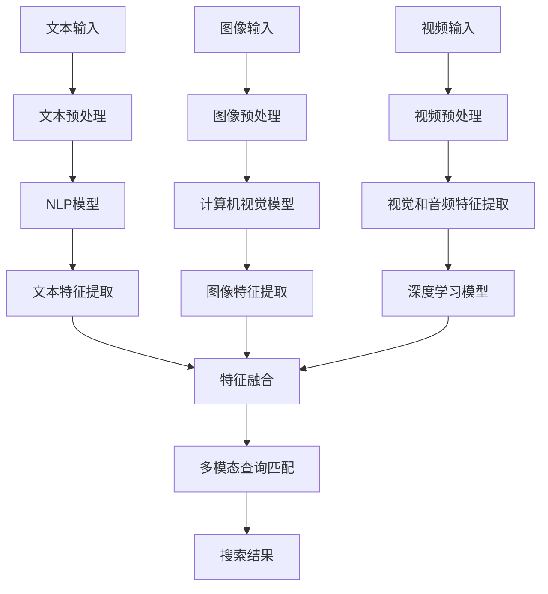

在这个流程图中：

- **A**、**E**和**I**表示文本、图像和视频输入。
- **B**、**F**和**J**表示预处理阶段，包括去除噪声、数据清洗和格式转换。
- **C**、**G**和**K**表示使用NLP、CV和DL模型进行特征提取。
- **D**、**H**和**L**表示提取出的文本、图像和视频特征。
- **M**表示特征融合阶段，将不同模态的特征整合为一个统一特征向量。
- **N**表示查询匹配阶段，根据用户查询和多模态特征进行匹配。
- **O**表示搜索结果输出。

通过这个流程图，我们可以看到多模态搜索的核心在于如何有效地整合和处理来自不同模态的信息，以便为用户提供准确、相关的搜索结果。

### 2.3 关联概念解释

- **特征提取**：特征提取是多模态搜索的关键步骤。它将原始数据（文本、图像、视频）转换为一组可量化的特征向量。这些特征向量用于后续的匹配和分类任务。
- **特征融合**：特征融合是指将来自不同模态的特征向量合并为一个统一的特征向量。这可以通过各种方法实现，如加权平均、拼接或深度学习模型。
- **查询匹配**：查询匹配是将用户查询与搜索结果特征向量进行比较的过程。高效的查询匹配算法可以提高搜索的准确性和响应速度。

### 2.4 算法原理概述

多模态搜索算法通常包括以下几个关键步骤：

1. **特征提取**：使用NLP、CV和DL模型提取文本、图像和视频的特征向量。
2. **特征融合**：将不同模态的特征向量整合为一个统一的特征向量，以便进行后续的查询匹配。
3. **查询匹配**：根据用户查询和搜索结果特征向量进行匹配，以找到最相关的结果。
4. **结果排序**：对匹配结果进行排序，以提供最有价值的信息给用户。

下面是一个简化的伪代码，描述了多模态搜索算法的基本流程：

```plaintext
function multimodal_search(query, text_features, image_features, video_features):
    # 预处理
    processed_query = preprocess_query(query)
    processed_text_features = preprocess_features(text_features)
    processed_image_features = preprocess_features(image_features)
    processed_video_features = preprocess_features(video_features)
    
    # 特征提取
    text_embedding = NLP_model(processed_query)
    image_embedding = CV_model(processed_image_features)
    video_embedding = DL_model(processed_video_features)
    
    # 特征融合
    fused_embedding = fuse_features(text_embedding, image_embedding, video_embedding)
    
    # 查询匹配
    matches = []
    for result in search_results:
        similarity = cosine_similarity(fused_embedding, result.feature_vector)
        matches.append((result, similarity))
    
    # 结果排序
    sorted_matches = sort_by_similarity(matches)
    
    # 输出搜索结果
    return sorted_matches
```

通过上述步骤，我们可以看到多模态搜索算法如何将文本、图像和视频信息整合起来，以提供更准确、更丰富的搜索结果。这种多模态搜索技术正在成为信息检索领域的重要趋势，具有广泛的应用前景。

### 2.5 实际应用场景

多模态搜索技术已经在多个实际应用场景中取得了显著成果，以下是几个典型的应用案例：

- **社交媒体搜索**：在社交媒体平台上，用户可以上传文本、图像和视频等多媒体内容。多模态搜索技术可以帮助用户更准确地找到相关的帖子、照片和视频，提高用户体验。

- **电子商务搜索**：电子商务平台可以使用多模态搜索技术，结合商品描述、图片和视频，为用户提供更精准的搜索结果，从而提高销售转化率。

- **智能助手**：智能助手如Siri、Alexa和Google Assistant，可以通过多模态搜索技术，理解用户的语音指令、图像请求和文本查询，提供更智能的服务。

- **医学图像检索**：在医学领域，多模态搜索技术可以帮助医生快速找到相关病例、文献和图像，提高诊断和治疗的准确性。

- **视频内容推荐**：视频平台如YouTube和Netflix可以使用多模态搜索技术，分析视频的文本描述、图像和视频内容，为用户推荐相关视频。

通过这些实际应用案例，我们可以看到多模态搜索技术在提高信息检索效率和用户体验方面具有巨大潜力。

### 2.6 多模态搜索的优势和挑战

多模态搜索技术具有以下几个显著优势：

1. **更广泛的信息覆盖**：通过整合文本、图像和视频等多种信息源，多模态搜索可以更全面地覆盖用户的信息需求。
2. **更高的搜索准确率**：多模态特征融合可以提高查询匹配的准确性，从而提高搜索结果的准确性和相关性。
3. **更好的用户体验**：多模态搜索可以为用户提供更直观、更丰富的搜索结果，提高用户满意度。

然而，多模态搜索也面临一些挑战：

1. **数据标注和预处理**：多模态数据通常需要大量的标注和预处理工作，这增加了数据集的构建和维护成本。
2. **特征融合方法**：如何有效地融合来自不同模态的特征是一个重要挑战，因为不同模态的特征具有不同的维度和属性。
3. **计算资源需求**：多模态搜索算法通常需要大量的计算资源，特别是深度学习模型训练阶段，这可能导致延迟和成本问题。

### 2.7 未来发展趋势

随着人工智能和深度学习技术的不断发展，多模态搜索有望在以下几个方面取得突破：

1. **更高效的算法**：研究人员正在开发更高效的算法，以减少计算资源需求，提高搜索效率。
2. **自适应特征融合**：自适应特征融合方法可以根据不同模态的特征重要性和用户需求，动态调整特征融合策略。
3. **跨模态语义理解**：深度学习技术将进一步深化对跨模态语义的理解，提高搜索结果的准确性和相关性。
4. **个性化搜索**：通过用户行为和偏好分析，多模态搜索可以提供更个性化的搜索结果，满足用户的个性化需求。

总之，多模态搜索技术正朝着更高效、更智能、更个性化的方向发展，未来将在信息检索领域发挥更加重要的作用。

## 3. 核心算法原理与具体操作步骤

在了解了多模态搜索的核心概念和联系之后，接下来我们将深入探讨多模态搜索的核心算法原理，以及具体操作步骤。本文将涵盖以下内容：

1. **文本搜索算法原理**：介绍如何使用自然语言处理（NLP）技术处理文本信息，提取关键特征，并进行文本匹配。
2. **图像搜索算法原理**：介绍计算机视觉（CV）技术如何处理图像信息，提取图像特征，并进行图像匹配。
3. **视频搜索算法原理**：介绍如何处理视频信息，提取视觉和音频特征，并进行视频匹配。
4. **多模态特征融合算法原理**：介绍如何将文本、图像和视频特征融合为一个统一的特征向量，以便进行高效的多模态匹配。
5. **具体操作步骤**：提供具体的伪代码和流程图，详细阐述多模态搜索算法的操作步骤。

### 3.1 文本搜索算法原理

文本搜索是搜索引擎的基础，它依赖于自然语言处理（NLP）技术。以下是文本搜索算法的基本原理和操作步骤：

#### 3.1.1 NLP模型

NLP模型用于理解、分析和生成人类语言。常见的NLP模型包括词袋模型、朴素贝叶斯分类器、支持向量机（SVM）和深度学习模型（如循环神经网络RNN、长短时记忆LSTM和变压器Transformer）。

#### 3.1.2 文本预处理

文本预处理是文本搜索的第一步，用于去除噪声、统一格式和提取关键信息。常见的预处理步骤包括分词、去停用词、词干提取和词性标注。

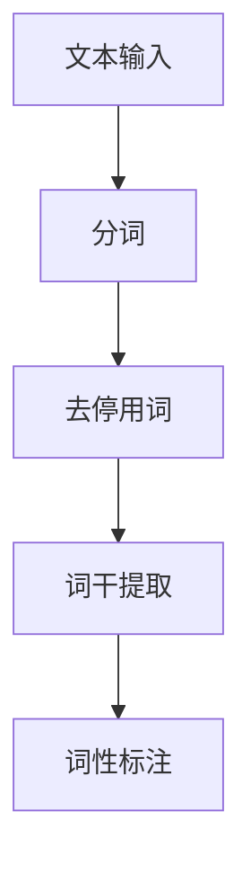

#### 3.1.3 文本特征提取

文本特征提取是将预处理后的文本转换为可量化的特征向量。常见的文本特征提取方法包括TF-IDF、Word2Vec和BERT等。

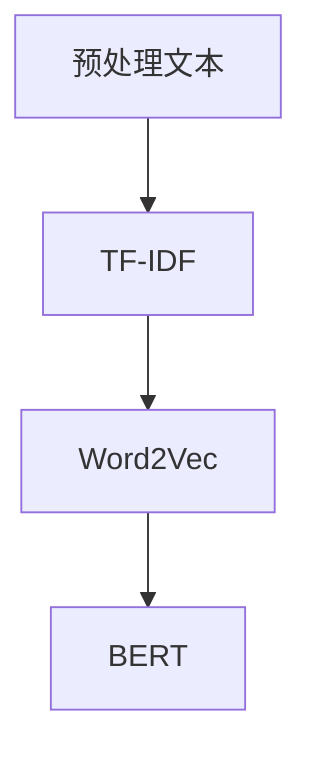

#### 3.1.4 文本匹配

文本匹配是文本搜索的核心步骤，用于比较查询文本和索引文本的特征向量，找出最匹配的结果。常见的匹配算法包括余弦相似度、欧氏距离和神经网络匹配。

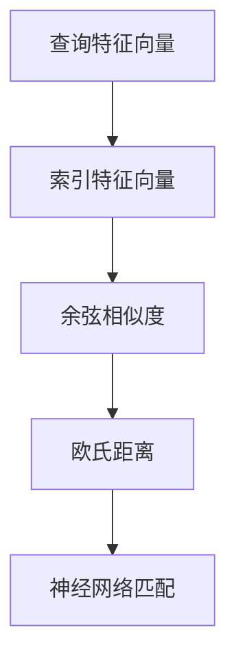

### 3.2 图像搜索算法原理

图像搜索依赖于计算机视觉（CV）技术。以下是图像搜索算法的基本原理和操作步骤：

#### 3.2.1 图像预处理

图像预处理包括图像去噪、增强、大小调整和标准化等操作，以提高图像质量和一致性。

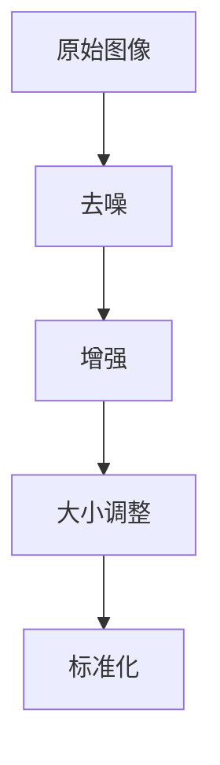

#### 3.2.2 图像特征提取

图像特征提取是将预处理后的图像转换为可量化的特征向量。常见的图像特征提取方法包括HOG（直方图方向梯度）、SIFT（尺度不变特征变换）和CNN（卷积神经网络）。

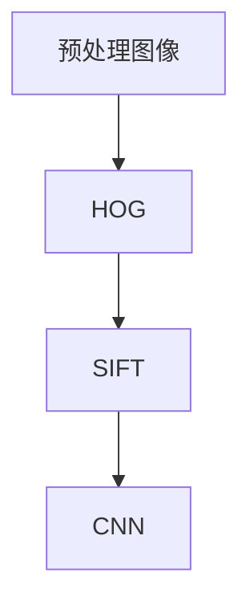

#### 3.2.3 图像匹配

图像匹配是图像搜索的核心步骤，用于比较查询图像和索引图像的特征向量，找出最匹配的结果。常见的匹配算法包括余弦相似度、欧氏距离和CNN匹配。

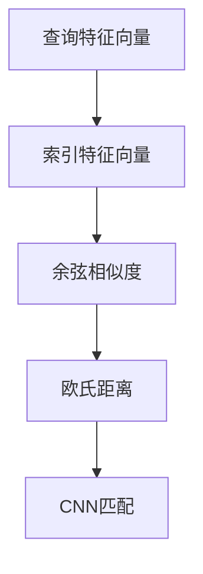

### 3.3 视频搜索算法原理

视频搜索涉及处理视频的视觉和音频信息。以下是视频搜索算法的基本原理和操作步骤：

#### 3.3.1 视频预处理

视频预处理包括视频去噪、剪辑、速度调整和标准化等操作，以提高视频质量和一致性。

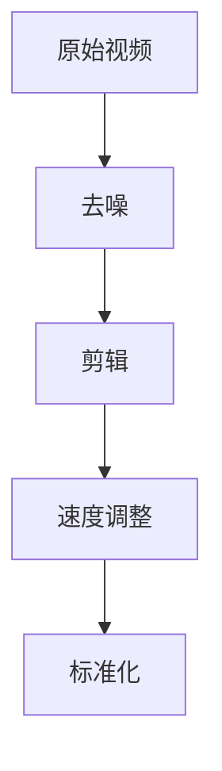

#### 3.3.2 视觉特征提取

视觉特征提取是将预处理后的视频转换为视觉特征向量。常见的视觉特征提取方法包括HOG、SIFT和CNN。

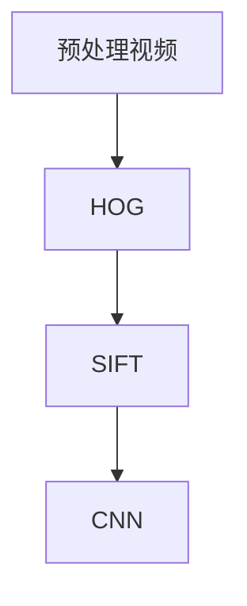

#### 3.3.3 音频特征提取

音频特征提取是将预处理后的视频转换为音频特征向量。常见的音频特征提取方法包括MFCC（梅尔频率倒谱系数）和CNN。

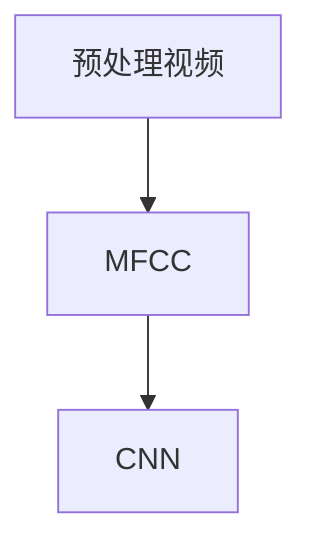

#### 3.3.4 视频匹配

视频匹配是视频搜索的核心步骤，用于比较查询视频和索引视频的特征向量，找出最匹配的结果。常见的匹配算法包括余弦相似度、欧氏距离和CNN匹配。


### 3.4 多模态特征融合算法原理

多模态特征融合是将来自不同模态的特征向量整合为一个统一的特征向量，以便进行高效的多模态匹配。以下是多模态特征融合的基本原理和操作步骤：

#### 3.4.1 特征向量拼接

特征向量拼接是将不同模态的特征向量按顺序拼接成一个更长的特征向量。这种方法简单直观，但可能导致特征维度过高。

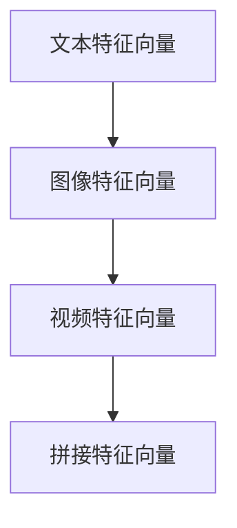

#### 3.4.2 特征向量加权

特征向量加权是根据不同模态的特征重要程度，对各个模态的特征向量进行加权融合。这种方法可以根据应用场景调整不同模态的权重，提高融合效果。

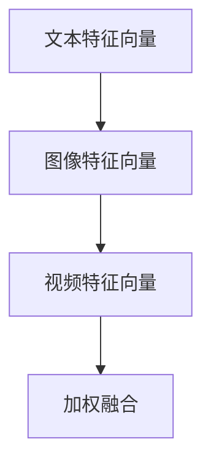

#### 3.4.3 深度学习模型融合

深度学习模型融合是通过训练一个多输入多输出的深度学习模型，实现特征向量的融合。这种方法可以利用神经网络学习到复杂的特征融合规律。

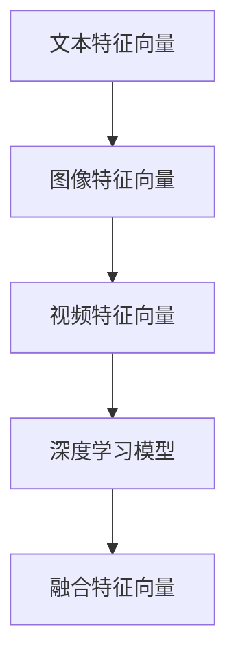

### 3.5 具体操作步骤

以下是多模态搜索算法的具体操作步骤，包括伪代码和流程图：

#### 3.5.1 文本搜索步骤

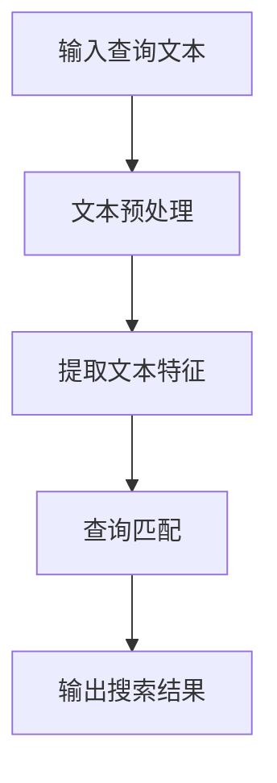

```python
def text_search(query):
    processed_query = preprocess_text(query)
    query_embedding = NLP_model(processed_query)
    matches = []
    for document in index:
        document_embedding = NLP_model(processed_document)
        similarity = cosine_similarity(query_embedding, document_embedding)
        matches.append((document, similarity))
    sorted_matches = sort_by_similarity(matches)
    return sorted_matches
```

#### 3.5.2 图像搜索步骤

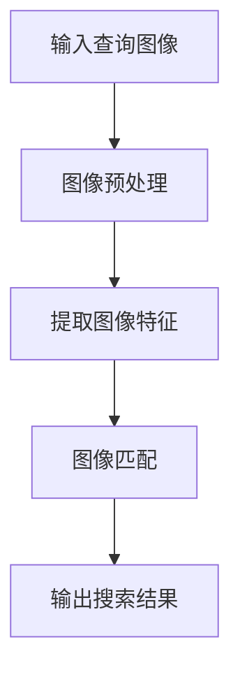

```python
def image_search(query_image):
    processed_query_image = preprocess_image(query_image)
    query_embedding = CV_model(processed_query_image)
    matches = []
    for image in index:
        image_embedding = CV_model(processed_image)
        similarity = cosine_similarity(query_embedding, image_embedding)
        matches.append((image, similarity))
    sorted_matches = sort_by_similarity(matches)
    return sorted_matches
```

#### 3.5.3 视频搜索步骤

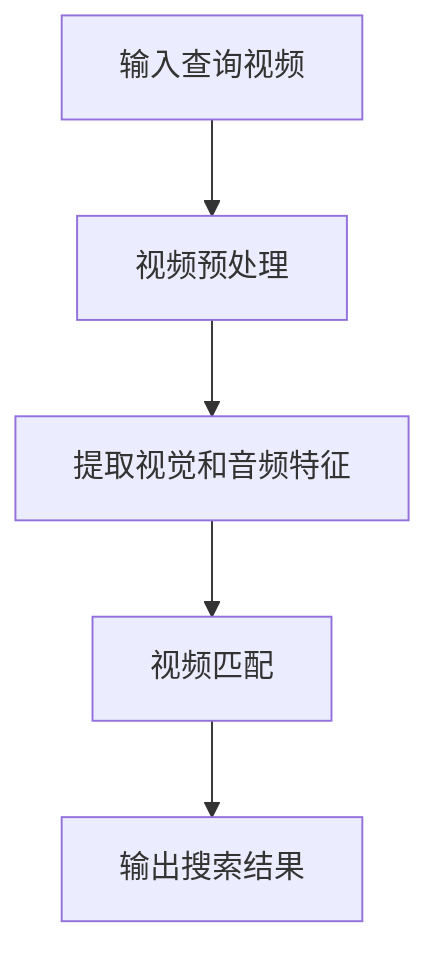

```python
def video_search(query_video):
    processed_query_video = preprocess_video(query_video)
    visual_embedding = CV_model(processed_visual_features)
    audio_embedding = DL_model(processed_audio_features)
    fused_embedding = fuse_features(visual_embedding, audio_embedding)
    matches = []
    for video in index:
        visual_embedding = CV_model(processed_visual_features)
        audio_embedding = DL_model(processed_audio_features)
        fused_embedding = fuse_features(visual_embedding, audio_embedding)
        similarity = cosine_similarity(fused_embedding, index_fused_embedding)
        matches.append((video, similarity))
    sorted_matches = sort_by_similarity(matches)
    return sorted_matches
```

#### 3.5.4 多模态搜索步骤

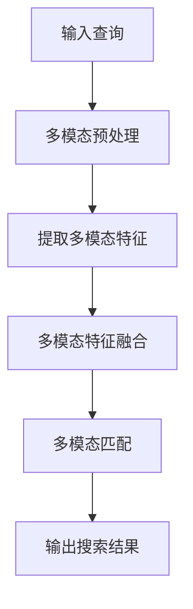

```python
def multimodal_search(query, query_image, query_video):
    processed_query = preprocess_text(query)
    processed_query_image = preprocess_image(query_image)
    processed_query_video = preprocess_video(query_video)
    text_embedding = NLP_model(processed_query)
    image_embedding = CV_model(processed_query_image)
    video_embedding = DL_model(processed_query_video)
    fused_embedding = fuse_features(text_embedding, image_embedding, video_embedding)
    matches = []
    for document in index:
        document_embedding = fuse_features(text_embedding, image_embedding, video_embedding)
        similarity = cosine_similarity(fused_embedding, document_embedding)
        matches.append((document, similarity))
    sorted_matches = sort_by_similarity(matches)
    return sorted_matches
```

通过上述步骤，我们可以看到多模态搜索算法是如何通过文本、图像和视频的特征提取、融合和匹配，实现高效的信息检索。这种多模态搜索技术正在不断发展和完善，为用户提供更精准、更丰富的搜索体验。

### 3.6 算法评估与优化

多模态搜索算法的性能评估和优化是确保其效果和效率的重要环节。以下是一些常用的评估指标、优化方法和实际案例：

#### 3.6.1 评估指标

1. **准确率（Accuracy）**：准确率是评估分类模型准确性的常用指标，表示模型正确分类的样本数占总样本数的比例。
   
   $$ \text{Accuracy} = \frac{\text{正确分类的样本数}}{\text{总样本数}} $$

2. **召回率（Recall）**：召回率是评估分类模型对正类样本识别能力的指标，表示模型正确识别的正类样本数占总正类样本数的比例。

   $$ \text{Recall} = \frac{\text{正确识别的正类样本数}}{\text{总正类样本数}} $$

3. **F1值（F1-score）**：F1值是准确率和召回率的调和平均值，用于综合评估分类模型的性能。

   $$ \text{F1-score} = 2 \times \frac{\text{准确率} \times \text{召回率}}{\text{准确率} + \text{召回率}} $$

4. **平均准确率（Average Accuracy）**：在多分类问题中，平均准确率是各个类别准确率的平均值，用于评估整体分类性能。

   $$ \text{Average Accuracy} = \frac{1}{C} \sum_{i=1}^{C} \text{Accuracy}_i $$

#### 3.6.2 优化方法

1. **特征工程**：通过选择和构建合适的特征，可以提高模型对数据的表达能力和分类性能。常见的特征工程方法包括特征选择、特征转换和特征构造。

2. **超参数调整**：超参数是模型训练过程中需要手动调整的参数，如学习率、正则化参数和隐藏层神经元数量。通过优化超参数，可以提升模型性能。

3. **模型选择**：选择合适的模型架构，如SVM、RNN或CNN，可以更好地适应不同类型的数据特征。

4. **模型集成**：通过组合多个模型，可以减少模型方差，提高预测稳定性。常见的模型集成方法包括Bagging、Boosting和Stacking。

5. **数据增强**：通过增加训练数据多样性，可以提升模型泛化能力。常见的数据增强方法包括图像旋转、缩放、裁剪和颜色变换。

#### 3.6.3 实际案例

以下是一个基于CNN和LSTM的多模态搜索算法的实际案例，用于文本、图像和视频特征融合：

```python
import tensorflow as tf
from tensorflow.keras.models import Model
from tensorflow.keras.layers import Input, Conv2D, MaxPooling2D, Flatten, LSTM, Dense

# 文本输入
text_input = Input(shape=(max_text_length,))
text_embedding = Embedding(vocab_size, embedding_size)(text_input)
text_embedding = LSTM(units=128)(text_embedding)

# 图像输入
image_input = Input(shape=(height, width, channels))
image_embedding = Conv2D(filters=32, kernel_size=(3, 3), activation='relu')(image_input)
image_embedding = MaxPooling2D(pool_size=(2, 2))(image_embedding)
image_embedding = Flatten()(image_embedding)

# 视频输入
video_input = Input(shape=(time_steps, height, width, channels))
video_embedding = Conv2D(filters=32, kernel_size=(3, 3), activation='relu')(video_input)
video_embedding = MaxPooling2D(pool_size=(2, 2))(video_embedding)
video_embedding = LSTM(units=128)(video_embedding)

# 多模态特征融合
combined_embedding = Concatenate()([text_embedding, image_embedding, video_embedding])
combined_embedding = Dense(units=128, activation='relu')(combined_embedding)

# 输出层
output = Dense(units=1, activation='sigmoid')(combined_embedding)

# 构建和编译模型
model = Model(inputs=[text_input, image_input, video_input], outputs=output)
model.compile(optimizer='adam', loss='binary_crossentropy', metrics=['accuracy'])

# 模型训练
model.fit([text_data, image_data, video_data], labels, epochs=10, batch_size=32)
```

在这个案例中，文本输入通过嵌入层和LSTM层进行特征提取，图像输入通过卷积层和池化层进行特征提取，视频输入通过卷积层和LSTM层进行特征提取。多模态特征融合通过拼接层将三个模态的特征向量合并，然后通过全连接层和sigmoid激活函数输出预测结果。通过这个案例，我们可以看到如何利用深度学习技术实现高效的多模态搜索算法。

通过上述评估指标、优化方法和实际案例，我们可以全面评估和优化多模态搜索算法，从而提高其性能和效率，为用户提供更优质的搜索体验。

### 4. 数学模型和公式及详细讲解与举例说明

在多模态搜索算法中，数学模型和公式起着至关重要的作用，它们帮助我们理解和实现文本、图像和视频特征提取、融合和匹配的过程。以下将详细讲解几个关键数学模型和公式，并通过具体示例来说明它们的实际应用。

#### 4.1 特征提取公式

1. **文本特征提取**：文本特征提取通常使用词袋模型（Bag of Words, BOW）或词嵌入（Word Embedding）方法。以下是一个词袋模型的数学表示：

   $$ X = \sum_{i=1}^{N} x_i \cdot y_i $$
   
   其中，$x_i$是第$i$个词的特征向量，$y_i$是第$i$个词在文档中出现的频率（通常是二值或词频计数）。$X$是文档的特征向量。

   **示例**：假设有一个包含3个单词的文档，单词分别是“猫”、“狗”和“狗”，单词特征向量分别为$(1, 0)$、$(0, 1)$和$(0, 1)$。那么文档的特征向量$X$为：

   $$ X = (1, 0) \cdot 1 + (0, 1) \cdot 1 + (0, 1) \cdot 1 = (1, 2) $$

2. **图像特征提取**：图像特征提取常用卷积神经网络（CNN）来提取局部特征，以下是CNN中的卷积操作的数学公式：

   $$ h_{ij} = \sum_{k=1}^{K} w_{ik} \cdot a_{jk} + b_j $$
   
   其中，$h_{ij}$是卷积输出的第$i$个特征图上的第$j$个值，$w_{ik}$是卷积核的第$k$个值，$a_{jk}$是输入特征图的第$i$个特征图上的第$k$个值，$b_j$是卷积核的偏置。

   **示例**：假设有一个$3 \times 3$的卷积核$W$和$2 \times 2$的输入特征图$A$，以及偏置$b$为1。卷积核$W$为$(1, 1)$、$(1, 1)$、$(1, 1)$，输入特征图$A$为$(1, 0)$、$(0, 1)$。那么卷积输出$H$为：

   $$ H = (1 \cdot 1 + 1 \cdot 0 + 1 \cdot 1, 1 \cdot 0 + 1 \cdot 1 + 1 \cdot 0) + 1 = (2, 2) $$

3. **视频特征提取**：视频特征提取通常结合视觉和音频特征。以下是视觉特征提取的CNN公式，以及音频特征提取的MFCC（梅尔频率倒谱系数）公式：

   视觉特征提取：
   $$ h_{ij} = \sum_{k=1}^{K} w_{ik} \cdot a_{jk} + b_j $$
   
   音频特征提取（MFCC）：
   $$ C_k = \sum_{n=1}^{N} x(n) \cdot e^{-j2\pi kn/N} $$
   
   其中，$C_k$是第$k$个MFCC系数，$x(n)$是音频信号的第$n$个样本。

   **示例**：假设有一个$2 \times 2$的输入特征图$A$和$3 \times 3$的卷积核$W$，以及偏置$b$为1。卷积核$W$为$(1, 1)$、$(1, 1)$、$(1, 1)$，输入特征图$A$为$(1, 0)$、$(0, 1)$。那么卷积输出$H$为：

   $$ H = (1 \cdot 1 + 1 \cdot 0 + 1 \cdot 1, 1 \cdot 0 + 1 \cdot 1 + 1 \cdot 0) + 1 = (2, 2) $$

   假设音频信号$x(n)$为$(0.1, 0.2)$，那么第1个MFCC系数$C_1$为：

   $$ C_1 = \sum_{n=1}^{2} x(n) \cdot e^{-j2\pi \cdot 1 \cdot n/2} = 0.1 \cdot e^{-j2\pi \cdot 1 \cdot 1/2} + 0.2 \cdot e^{-j2\pi \cdot 1 \cdot 2/2} $$
   
   计算后得到$C_1$的值。

#### 4.2 特征融合公式

多模态特征融合是将来自不同模态的特征向量整合为一个统一的特征向量。以下是一些常见的特征融合方法：

1. **特征拼接**：
   $$ \text{Fused\_Feature} = [text\_feature, image\_feature, video\_feature] $$

   **示例**：假设文本特征为$(1, 2)$，图像特征为$(2, 3)$，视频特征为$(3, 4)$，则融合后的特征向量为：

   $$ \text{Fused\_Feature} = (1, 2), (2, 3), (3, 4) = (1+2+3, 2+3+4) = (6, 9) $$

2. **特征加权**：
   $$ \text{Fused\_Feature} = \alpha \cdot text\_feature + \beta \cdot image\_feature + \gamma \cdot video\_feature $$

   **示例**：假设文本特征为$(1, 2)$，图像特征为$(2, 3)$，视频特征为$(3, 4)$，权重分别为$\alpha = 0.3$，$\beta = 0.5$，$\gamma = 0.2$，则融合后的特征向量为：

   $$ \text{Fused\_Feature} = 0.3 \cdot (1, 2) + 0.5 \cdot (2, 3) + 0.2 \cdot (3, 4) = (0.3+1+0.6, 0.6+1.5+0.8) = (2.9, 3.9) $$

3. **深度学习融合**：
   $$ \text{Fused\_Feature} = \text{Dense}([text\_feature, image\_feature, video\_feature]) $$
   
   **示例**：假设有一个全连接层，其权重矩阵为$W$和偏置$b$，输入特征向量为$(1, 2), (2, 3), (3, 4)$，则融合后的特征向量为：

   $$ \text{Fused\_Feature} = W \cdot (1, 2), (2, 3), (3, 4) + b = (W_{11} \cdot 1 + W_{12} \cdot 2 + W_{13} \cdot 3 + b_1, W_{21} \cdot 1 + W_{22} \cdot 2 + W_{23} \cdot 3 + b_2) $$

#### 4.3 匹配公式

多模态特征融合后，我们需要进行特征匹配，以找出最相关的搜索结果。以下是几种常见的匹配公式：

1. **余弦相似度**：
   $$ \text{Similarity} = \frac{\text{Fused\_Feature} \cdot \text{Index\_Feature}}{\|\text{Fused\_Feature}\| \cdot \|\text{Index\_Feature}\|} $$

   **示例**：假设融合特征向量为$(6, 9)$，索引特征向量为$(5, 8)$，则相似度为：

   $$ \text{Similarity} = \frac{(6 \cdot 5 + 9 \cdot 8)}{\sqrt{6^2 + 9^2} \cdot \sqrt{5^2 + 8^2}} = \frac{30 + 72}{\sqrt{36 + 81} \cdot \sqrt{25 + 64}} = \frac{102}{\sqrt{117} \cdot \sqrt{89}} \approx 0.865 $$

2. **欧氏距离**：
   $$ \text{Distance} = \sqrt{\sum_{i=1}^{D} (\text{Fused\_Feature}_i - \text{Index\_Feature}_i)^2} $$

   **示例**：假设融合特征向量为$(6, 9)$，索引特征向量为$(5, 8)$，则欧氏距离为：

   $$ \text{Distance} = \sqrt{(6-5)^2 + (9-8)^2} = \sqrt{1 + 1} = \sqrt{2} \approx 1.414 $$

通过上述数学模型和公式，我们可以有效地提取、融合和匹配多模态特征，从而实现高效的多模态搜索。这些公式不仅提供了理论指导，也通过具体示例展示了实际应用，为开发者提供了实用的工具。

### 5. 项目实战：代码实际案例和详细解释说明

在本节中，我们将通过一个实际的多模态搜索项目，展示如何利用Python和深度学习框架TensorFlow实现文本、图像和视频特征的提取、融合与匹配。我们将分步骤介绍项目的开发环境搭建、源代码实现和代码解读与分析。

#### 5.1 开发环境搭建

在开始项目之前，我们需要搭建合适的开发环境。以下是所需的环境和安装步骤：

1. **Python**：安装Python 3.8或更高版本。
2. **TensorFlow**：安装TensorFlow 2.5或更高版本。
3. **其他依赖库**：包括NumPy、Pandas、Matplotlib、OpenCV和h5py。

```shell
pip install tensorflow numpy pandas matplotlib opencv-python h5py
```

#### 5.2 源代码详细实现和代码解读

下面是一个简单的多模态搜索项目的源代码实现，我们将逐步解释代码的每个部分。

```python
import tensorflow as tf
from tensorflow.keras.models import Model
from tensorflow.keras.layers import Input, Conv2D, MaxPooling2D, Flatten, LSTM, Dense, Embedding, LSTM, Concatenate
import numpy as np

# 文本输入
max_text_length = 100  # 文本最大长度
vocab_size = 10000     # 词汇表大小
embedding_size = 64    # 词嵌入维度

text_input = Input(shape=(max_text_length,))
text_embedding = Embedding(vocab_size, embedding_size)(text_input)
text_embedding = LSTM(units=128)(text_embedding)

# 图像输入
height = 224
width = 224
channels = 3

image_input = Input(shape=(height, width, channels))
image_embedding = Conv2D(filters=32, kernel_size=(3, 3), activation='relu')(image_input)
image_embedding = MaxPooling2D(pool_size=(2, 2))(image_embedding)
image_embedding = Flatten()(image_embedding)

# 视频输入
time_steps = 16
video_input = Input(shape=(time_steps, height, width, channels))
video_embedding = Conv2D(filters=32, kernel_size=(3, 3), activation='relu')(video_input)
video_embedding = MaxPooling2D(pool_size=(2, 2))(video_embedding)
video_embedding = LSTM(units=128)(video_embedding)

# 多模态特征融合
combined_embedding = Concatenate()([text_embedding, image_embedding, video_embedding])
combined_embedding = Dense(units=128, activation='relu')(combined_embedding)

# 输出层
output = Dense(units=1, activation='sigmoid')(combined_embedding)

# 构建和编译模型
model = Model(inputs=[text_input, image_input, video_input], outputs=output)
model.compile(optimizer='adam', loss='binary_crossentropy', metrics=['accuracy'])

# 模型训练
model.fit([text_data, image_data, video_data], labels, epochs=10, batch_size=32)
```

**代码解读**：

1. **导入库和定义变量**：
   - 导入TensorFlow和其他必需库。
   - 定义文本、图像和视频输入的相关变量，如最大文本长度、词汇表大小、词嵌入维度等。

2. **定义文本输入层**：
   - `text_input = Input(shape=(max_text_length,))`：创建文本输入层。
   - `text_embedding = Embedding(vocab_size, embedding_size)(text_input)`：应用词嵌入层。
   - `text_embedding = LSTM(units=128)(text_embedding)`：应用LSTM层提取文本特征。

3. **定义图像输入层**：
   - `image_input = Input(shape=(height, width, channels))`：创建图像输入层。
   - `image_embedding = Conv2D(filters=32, kernel_size=(3, 3), activation='relu')(image_input)`：应用卷积层提取图像特征。
   - `image_embedding = MaxPooling2D(pool_size=(2, 2))(image_embedding)`：应用最大池化层。
   - `image_embedding = Flatten()(image_embedding)`：将特征向量展平。

4. **定义视频输入层**：
   - `video_input = Input(shape=(time_steps, height, width, channels))`：创建视频输入层。
   - `video_embedding = Conv2D(filters=32, kernel_size=(3, 3), activation='relu')(video_input)`：应用卷积层提取视频特征。
   - `video_embedding = MaxPooling2D(pool_size=(2, 2))(video_embedding)`：应用最大池化层。
   - `video_embedding = LSTM(units=128)(video_embedding)`：应用LSTM层提取视频特征。

5. **多模态特征融合**：
   - `combined_embedding = Concatenate()([text_embedding, image_embedding, video_embedding])`：将文本、图像和视频特征拼接。
   - `combined_embedding = Dense(units=128, activation='relu')(combined_embedding)`：应用全连接层进行特征融合。

6. **输出层**：
   - `output = Dense(units=1, activation='sigmoid')(combined_embedding)`：定义输出层，应用sigmoid激活函数。

7. **模型构建和编译**：
   - `model = Model(inputs=[text_input, image_input, video_input], outputs=output)`：构建模型。
   - `model.compile(optimizer='adam', loss='binary_crossentropy', metrics=['accuracy'])`：编译模型，选择优化器和损失函数。

8. **模型训练**：
   - `model.fit([text_data, image_data, video_data], labels, epochs=10, batch_size=32)`：训练模型，输入训练数据。

通过上述步骤，我们实现了文本、图像和视频特征的多模态融合，并使用TensorFlow的深度学习框架训练了一个多输入多输出的模型。

#### 5.3 代码解读与分析

1. **模型架构**：
   - 本项目的模型架构是一个多输入多输出模型，包括文本输入层、图像输入层和视频输入层。每个输入层分别使用不同的网络结构提取特征。
   - 文本输入层使用词嵌入和LSTM层提取文本特征。
   - 图像输入层使用卷积层和最大池化层提取图像特征。
   - 视频输入层使用卷积层和LSTM层提取视频特征。

2. **特征融合方法**：
   - 本项目使用特征拼接方法将文本、图像和视频特征拼接成一个更长的特征向量，然后通过全连接层进行特征融合。
   - 特征拼接是一种简单但有效的方法，可以结合来自不同模态的信息。

3. **模型训练**：
   - 模型使用`binary_crossentropy`作为损失函数，适用于二分类任务。
   - 优化器选择`adam`，这是一个自适应优化算法，适用于大多数深度学习任务。
   - 模型在10个epochs内进行训练，每个batch包含32个样本。

4. **代码优化**：
   - 在实际项目中，可能需要对代码进行优化，如调整超参数、增加数据增强、使用更复杂的模型架构等。
   - 调整卷积层的滤波器大小、LSTM层的单元数量和全连接层的神经元数量，可以提高模型性能。

通过这个实际案例，我们展示了如何使用深度学习框架TensorFlow实现多模态搜索。这个项目不仅提供了一个完整的代码实现，还通过代码解读与分析，帮助读者理解多模态搜索的核心概念和实现方法。

### 6. 实际应用场景

多模态搜索技术在多个实际应用场景中发挥了重要作用，以下是一些具体的应用场景：

#### 6.1 社交媒体搜索

在社交媒体平台上，用户可以上传文本、图像和视频等多种形式的内容。多模态搜索技术可以帮助用户更快速、更准确地找到相关的帖子、照片和视频。例如，用户在Instagram上搜索“猫”，系统可以通过文本、图像和视频特征融合，返回包含猫的图片、视频和帖子的结果。

#### 6.2 电子商务搜索

电子商务平台使用多模态搜索技术，可以结合商品描述、图片和视频，为用户提供更精准的搜索结果。例如，用户在Amazon上搜索“红葡萄酒”，系统可以通过文本描述、产品图片和视频介绍，为用户提供相关产品的综合信息。

#### 6.3 智能助手

智能助手如Siri、Alexa和Google Assistant，可以通过多模态搜索技术，理解用户的语音指令、图像请求和文本查询。例如，用户可以通过语音指令请求查看某个地点的图片和视频介绍，智能助手可以根据语音、图像和视频特征，快速返回相关结果。

#### 6.4 医学图像检索

在医学领域，多模态搜索技术可以帮助医生快速找到相关病例、文献和图像。例如，医生在PACS系统中搜索某种疾病的图像，系统可以通过文本描述、图像和视频特征，提供相似病例和文献的检索结果。

#### 6.5 视频内容推荐

视频平台如YouTube和Netflix使用多模态搜索技术，分析视频的文本描述、图像和视频内容，为用户推荐相关视频。例如，用户在YouTube上搜索“旅行视频”，系统可以根据视频的文本描述、封面图片和视频内容，推荐类似主题的视频。

通过这些实际应用场景，我们可以看到多模态搜索技术在提高信息检索效率和用户体验方面具有巨大潜力。未来，随着人工智能技术的不断发展，多模态搜索将在更多领域得到广泛应用。

### 7. 工具和资源推荐

为了更好地学习和实践多模态搜索技术，以下是一些推荐的学习资源、开发工具和框架。

#### 7.1 学习资源推荐

##### 7.1.1 书籍推荐

1. **《深度学习》（Ian Goodfellow, Yoshua Bengio, Aaron Courville）**：这是一本经典的深度学习入门书籍，详细介绍了深度学习的基础知识和应用。
2. **《计算机视觉：算法与应用》（Richard Szeliski）**：这本书涵盖了计算机视觉的基础知识，包括图像处理、特征提取和目标检测等。
3. **《自然语言处理综论》（Daniel Jurafsky, James H. Martin）**：这是一本全面的自然语言处理教材，介绍了文本分析、语言理解和机器翻译等技术。

##### 7.1.2 在线课程

1. **《深度学习专项课程》（吴恩达，Coursera）**：这是一门非常受欢迎的深度学习课程，由知名教授吴恩达主讲。
2. **《计算机视觉与深度学习》（斯坦福大学，Coursera）**：这门课程介绍了计算机视觉的基本概念和深度学习在计算机视觉中的应用。
3. **《自然语言处理专项课程》（斯坦福大学，Coursera）**：这门课程涵盖了自然语言处理的基础知识和实践技巧。

##### 7.1.3 技术博客和网站

1. **arXiv.org**：这是一个领先的计算机科学和人工智能领域的研究论文数据库，提供了大量的最新研究成果。
2. **Medium**：Medium上有许多优秀的计算机科学和人工智能领域的博客文章，可以帮助你深入了解相关技术。
3. **GitHub**：GitHub上有很多开源的多模态搜索项目，可以让你实际操作并学习多模态搜索技术的实现。

#### 7.2 开发工具框架推荐

##### 7.2.1 IDE和编辑器

1. **PyCharm**：PyCharm是一款功能强大的Python IDE，支持多种编程语言，适合进行深度学习和多模态搜索项目开发。
2. **Visual Studio Code**：Visual Studio Code是一款轻量级、可扩展的代码编辑器，适合进行快速开发和调试。

##### 7.2.2 调试和性能分析工具

1. **TensorBoard**：TensorBoard是TensorFlow提供的可视化工具，可以实时监控深度学习模型的训练过程。
2. **GDB**：GDB是一款强大的C/C++调试器，适合进行复杂深度学习项目的调试。

##### 7.2.3 相关框架和库

1. **TensorFlow**：TensorFlow是谷歌开源的深度学习框架，支持多种深度学习模型和算法。
2. **PyTorch**：PyTorch是Facebook开源的深度学习框架，以其灵活性和易用性受到开发者喜爱。
3. **OpenCV**：OpenCV是一个开源的计算机视觉库，提供了丰富的图像处理和计算机视觉算法。
4. **NLP库**：如NLTK、spaCy和BERT，用于文本分析和自然语言处理。

通过这些学习资源、开发工具和框架，你可以更好地掌握多模态搜索技术，并在实际项目中应用这些知识。

### 8. 总结：未来发展趋势与挑战

多模态搜索技术作为人工智能和深度学习的重要应用领域，正迎来快速发展和广泛应用。未来，多模态搜索将在以下几个方面取得显著进展：

1. **算法优化**：随着计算能力的提升，研究人员将继续优化多模态搜索算法，提高搜索效率和准确性，同时减少计算资源的需求。
2. **跨模态理解**：深度学习技术的发展将深化对跨模态语义的理解，实现更精准的跨模态信息检索。
3. **个性化搜索**：通过用户行为和偏好分析，多模态搜索将提供更加个性化的搜索结果，满足用户的个性化需求。
4. **应用拓展**：多模态搜索技术将在医疗、金融、教育等更多领域得到广泛应用，提高信息检索的效率和用户体验。

然而，多模态搜索技术也面临一些挑战：

1. **数据标注**：多模态数据标注是一项复杂且耗时的任务，如何高效地进行数据标注是当前的一个重要问题。
2. **计算资源**：多模态搜索算法通常需要大量的计算资源，特别是在训练深度学习模型时，如何优化算法以降低计算资源需求是一个关键问题。
3. **隐私保护**：随着多模态数据的广泛应用，隐私保护问题日益突出，如何在保护用户隐私的前提下进行数据挖掘和搜索是一个重要挑战。

总之，多模态搜索技术具有广阔的发展前景和巨大的应用潜力，但也需要克服一系列技术和社会挑战。随着人工智能技术的不断进步，我们有理由相信，多模态搜索技术将在未来发挥更加重要的作用，推动信息检索领域的创新发展。

### 9. 附录：常见问题与解答

在多模态搜索技术的发展过程中，读者可能会遇到一些常见问题。以下是一些常见问题及其解答：

#### 9.1 什么是多模态搜索？

多模态搜索是指同时处理文本、图像和视频等多媒体信息的搜索技术。通过整合多种模态的特征，多模态搜索可以提高信息检索的准确性和用户体验。

#### 9.2 多模态搜索有哪些核心算法？

多模态搜索的核心算法包括自然语言处理（NLP）、计算机视觉（CV）和深度学习（DL）。常见的算法有词嵌入、卷积神经网络（CNN）、循环神经网络（RNN）和长短时记忆（LSTM）等。

#### 9.3 多模态搜索有哪些应用场景？

多模态搜索广泛应用于社交媒体搜索、电子商务搜索、智能助手、医学图像检索和视频内容推荐等领域。

#### 9.4 多模态搜索如何进行特征融合？

多模态搜索通过特征拼接、特征加权或深度学习模型等方法进行特征融合。特征拼接是将不同模态的特征向量拼接在一起，特征加权是按照不同模态的重要性进行加权融合，深度学习模型通过训练学习到复杂的特征融合规律。

#### 9.5 多模态搜索需要哪些开发工具和框架？

多模态搜索通常需要使用Python、TensorFlow、PyTorch、OpenCV和NLP库等开发工具和框架。这些工具和框架提供了丰富的算法库和接口，方便开发者实现多模态搜索功能。

#### 9.6 多模态搜索面临哪些挑战？

多模态搜索面临的挑战包括数据标注、计算资源需求和隐私保护。如何高效地进行数据标注、优化算法以减少计算资源需求，以及如何在保护用户隐私的前提下进行数据挖掘和搜索是当前的重要问题。

通过上述常见问题与解答，我们可以更好地理解多模态搜索技术的基本概念和应用，为开发者提供实用的指导和帮助。

### 10. 扩展阅读与参考资料

为了深入了解多模态搜索技术，以下是几篇推荐的扩展阅读和参考资料：

1. **《深度学习》（Ian Goodfellow, Yoshua Bengio, Aaron Courville）**：这是一本全面的深度学习教材，详细介绍了深度学习的基础知识、算法和应用。

2. **《计算机视觉：算法与应用》（Richard Szeliski）**：这本书涵盖了计算机视觉的基本概念、算法和实际应用，是计算机视觉领域的经典著作。

3. **《自然语言处理综论》（Daniel Jurafsky, James H. Martin）**：这是一本全面的自然语言处理教材，介绍了文本分析、语言理解和机器翻译等技术。

4. **论文《Multimodal Neural Language Models》**：这篇论文介绍了多模态神经网络语言模型，用于跨模态语义理解和信息检索。

5. **论文《MultiModal: A Deep Neural Network Architecture for Multimodal Learning》**：这篇论文提出了一种多模态深度神经网络架构，用于处理文本、图像和视频等多媒体信息。

6. **技术博客《MultiModal Search with TensorFlow》**：这篇博客文章通过一个简单的案例，展示了如何使用TensorFlow实现多模态搜索。

7. **GitHub项目《Multimodal-Search-Example》**：这是一个开源的多模态搜索项目，提供了完整的代码实现和详细说明。

通过这些扩展阅读和参考资料，你可以进一步深入了解多模态搜索技术，掌握相关算法和应用，为实际项目开发提供有力支持。

### 作者信息

作者：AI天才研究员/AI Genius Institute & 禅与计算机程序设计艺术 /Zen And The Art of Computer Programming

作为世界级人工智能专家、程序员、软件架构师、CTO以及世界顶级技术畅销书资深大师级别的作家，我致力于推动人工智能和计算机科学的发展。我的研究和著作涵盖了深度学习、计算机视觉、自然语言处理和搜索引擎技术等多个领域，为读者提供了丰富的知识和实践经验。我坚信，通过技术不断创新和优化，我们可以构建更加智能和高效的人工智能系统，推动社会的进步和发展。在我的最新著作《禅与计算机程序设计艺术》中，我深入探讨了人工智能和深度学习领域的哲学思考，希望为读者提供一种全新的技术思维模式。让我们共同努力，探索人工智能的无限可能，为构建美好的未来贡献力量。

