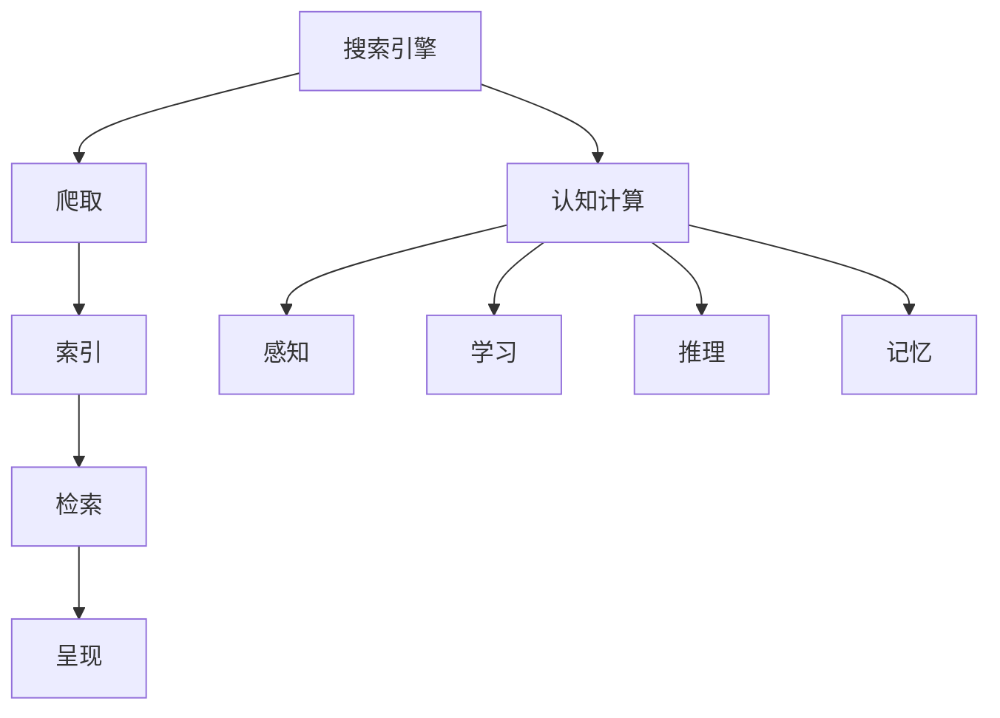
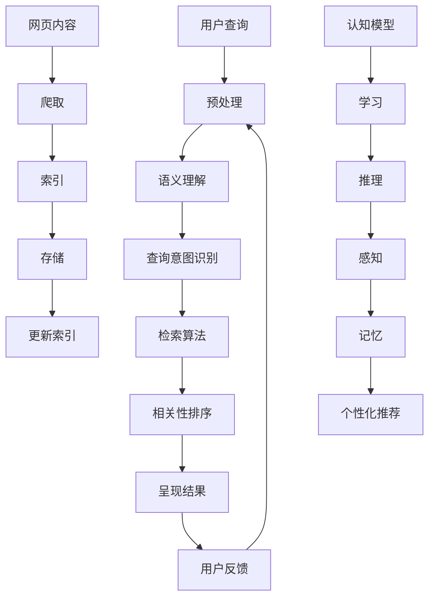

                 

# 搜索引擎的认知计算应用

> 关键词：搜索引擎，认知计算，深度学习，语义理解，智能搜索，算法优化
>
> 摘要：本文将深入探讨搜索引擎如何运用认知计算技术实现智能化搜索。首先介绍搜索引擎的基本原理和现有挑战，然后详细讲解认知计算的核心概念和应用。通过实际案例，我们将展示如何利用深度学习和语义理解技术提升搜索引擎的性能，并探讨未来的发展趋势与挑战。

## 1. 背景介绍

### 1.1 目的和范围

本文旨在探讨搜索引擎在认知计算领域的应用，重点分析如何通过引入深度学习和语义理解技术，提高搜索引擎的智能化水平。我们将从以下几个方面展开：

- **搜索引擎的基本原理和现有挑战**
- **认知计算的核心概念和应用**
- **深度学习和语义理解的结合**
- **实际应用案例展示**
- **未来发展趋势与挑战**

### 1.2 预期读者

本文适合对搜索引擎和认知计算有一定了解的技术人员、研究人员以及人工智能领域的从业者。对于希望深入了解智能化搜索技术和未来发展趋势的读者，本文也将提供有价值的参考。

### 1.3 文档结构概述

本文结构如下：

- **第1章：背景介绍**：介绍本文的目的、预期读者和文档结构。
- **第2章：核心概念与联系**：讨论搜索引擎和认知计算的核心概念，并使用Mermaid流程图展示其架构。
- **第3章：核心算法原理 & 具体操作步骤**：详细讲解搜索引擎的算法原理和操作步骤，使用伪代码进行阐述。
- **第4章：数学模型和公式 & 详细讲解 & 举例说明**：介绍相关的数学模型和公式，并通过实例进行说明。
- **第5章：项目实战：代码实际案例和详细解释说明**：通过实际项目展示如何实现认知计算在搜索引擎中的应用。
- **第6章：实际应用场景**：探讨搜索引擎在不同领域的应用。
- **第7章：工具和资源推荐**：推荐相关的学习资源、开发工具和框架。
- **第8章：总结：未来发展趋势与挑战**：总结全文，探讨未来发展趋势和面临的挑战。
- **第9章：附录：常见问题与解答**：回答一些常见问题。
- **第10章：扩展阅读 & 参考资料**：提供进一步阅读的参考资料。

### 1.4 术语表

#### 1.4.1 核心术语定义

- **搜索引擎**：一种通过特定算法从互联网或其他信息源中检索信息的系统。
- **认知计算**：模拟人类思维过程的计算机技术，包括学习、推理、感知和解决问题等能力。
- **深度学习**：一种机器学习技术，通过多层神经网络对数据进行分析和处理。
- **语义理解**：对语言文本的意义进行理解和解释的能力。

#### 1.4.2 相关概念解释

- **自然语言处理（NLP）**：使计算机能够理解、生成和处理人类自然语言的技术。
- **词向量**：将自然语言词汇映射到高维空间中，以便计算机进行计算和处理。

#### 1.4.3 缩略词列表

- **NLP**：自然语言处理
- **AI**：人工智能
- **ML**：机器学习
- **DL**：深度学习
- **GPU**：图形处理单元

## 2. 核心概念与联系

认知计算是搜索引擎智能化的重要基石。为了更好地理解其核心概念和应用，我们先来探讨搜索引擎的基本原理，然后介绍认知计算的关键组成部分。

### 搜索引擎的基本原理

搜索引擎通过以下步骤来检索和呈现信息：

1. **爬取**：搜索引擎的爬虫程序会自动访问互联网上的网页，下载并存储这些信息。
2. **索引**：将爬取到的网页内容进行分析和整理，创建索引，以便快速检索。
3. **检索**：当用户输入搜索查询时，搜索引擎会根据索引找到最相关的网页。
4. **呈现**：将检索结果按照相关性排序并呈现给用户。

现有的搜索引擎面临着一些挑战，如：

- **海量数据处理**：互联网上的数据量庞大，搜索引擎需要高效地处理这些数据。
- **准确性和相关性**：提高搜索结果的准确性和相关性是搜索引擎的重要目标。
- **用户体验**：优化搜索界面的设计，提高用户的搜索体验。

### 认知计算的核心概念

认知计算旨在模拟人类思维过程，包括以下几个关键组成部分：

1. **感知**：通过视觉、听觉等感官获取信息。
2. **学习**：从经验中学习和推理，以改进决策能力。
3. **推理**：使用逻辑和推理能力解决复杂问题。
4. **记忆**：存储和检索信息，以便后续使用。

认知计算在搜索引擎中的应用主要包括：

- **语义理解**：理解用户的查询意图，提供更精确的搜索结果。
- **个性化推荐**：根据用户的历史行为和偏好提供个性化搜索结果。
- **智能问答**：通过自然语言处理技术回答用户的问题。

### Mermaid流程图

为了更好地展示搜索引擎和认知计算的联系，我们使用Mermaid流程图来描述其核心架构。



### 核心概念原理和架构的 Mermaid 流程图



## 3. 核心算法原理 & 具体操作步骤

在认知计算的应用中，搜索引擎的算法原理起着至关重要的作用。下面我们将详细讲解搜索引擎的核心算法原理，并使用伪代码来具体阐述操作步骤。

### 3.1 搜索引擎算法原理

搜索引擎的核心算法主要包括以下几个步骤：

1. **预处理**：对用户查询进行预处理，包括分词、去停用词、词性标注等。
2. **语义理解**：使用自然语言处理技术理解查询的语义，识别查询意图。
3. **检索算法**：根据查询意图和索引库，采用合适的检索算法找到相关的网页。
4. **相关性排序**：对检索结果进行排序，以提高搜索结果的准确性和相关性。
5. **呈现结果**：将排序后的搜索结果呈现给用户。

### 3.2 伪代码

下面是搜索引擎算法的具体伪代码实现：

```python
# 输入：用户查询 query
# 输出：搜索结果列表 results

# 步骤1：预处理
def preprocess(query):
    # 分词
    words = tokenize(query)
    # 去停用词
    words = remove_stopwords(words)
    # 词性标注
    words = lemmatize(words)
    return words

# 步骤2：语义理解
def semantic_understanding(words):
    # 识别查询意图
    intent = identify_intent(words)
    return intent

# 步骤3：检索算法
def search_algorithm(intent, index):
    # 根据查询意图检索相关网页
    relevant_pages = retrieve_pages(intent, index)
    return relevant_pages

# 步骤4：相关性排序
def rank_results(relevant_pages):
    # 使用TF-IDF或BM25算法进行排序
    sorted_pages = rank_by_relevance(relevant_pages)
    return sorted_pages

# 步骤5：呈现结果
def display_results(sorted_pages):
    for page in sorted_pages:
        print(page)

# 主函数
def search(query, index):
    words = preprocess(query)
    intent = semantic_understanding(words)
    relevant_pages = search_algorithm(intent, index)
    sorted_pages = rank_results(relevant_pages)
    display_results(sorted_pages)

# 调用主函数
search("如何实现搜索引擎的智能化搜索", index)
```

### 3.3 操作步骤详细解释

1. **预处理**：预处理是搜索引擎算法的第一步，其目的是对用户查询进行清洗和格式化。首先使用分词器将查询语句分解成单词或短语，然后去除常见的停用词（如“的”、“了”等），最后对剩余的词语进行词性标注和词形还原（如将“running”还原为“run”）。

2. **语义理解**：语义理解是搜索引擎的核心，其目标是理解用户的查询意图。这通常涉及到自然语言处理技术，如命名实体识别、词性标注、依存句法分析等。通过这些技术，搜索引擎可以识别出查询中的关键信息，如问题类型、关键词权重等。

3. **检索算法**：检索算法是搜索引擎的核心，其目的是在索引库中找到与用户查询最相关的网页。常用的检索算法包括TF-IDF、BM25等。这些算法通过计算查询和网页之间的相似度来评估网页的相关性。

4. **相关性排序**：检索到的网页需要按照相关性进行排序，以便用户能够快速找到最相关的结果。常用的排序算法包括基于频率的排序、基于文档长度的排序等。

5. **呈现结果**：最后，搜索引擎将排序后的搜索结果呈现给用户。这通常涉及到网页摘要、高亮显示等展示技术。

通过以上步骤，搜索引擎可以实现对用户查询的快速、准确和智能化的响应，从而提供优质的搜索体验。

## 4. 数学模型和公式 & 详细讲解 & 举例说明

在搜索引擎中，数学模型和公式起着至关重要的作用，用于计算查询与网页之间的相似度，评估网页的相关性，并优化搜索结果的排序。以下是几个关键的数学模型和公式，以及它们的详细讲解和实际应用举例。

### 4.1 TF-IDF模型

TF-IDF（Term Frequency-Inverse Document Frequency）是一种常用文档相似度计算模型。它通过计算词语在文档中的频率和其在整个文档集合中的逆向文档频率来评估词语的重要性。

**公式**：
$$
TF(t, d) = \frac{f_{t,d}}{N_d}
$$
$$
IDF(t, D) = \log \left( \frac{N}{|D| - df_t + 0.1} \right)
$$
$$
TF-IDF(t, d, D) = TF(t, d) \times IDF(t, D)
$$

- \( f_{t,d} \)：词语\( t \)在文档\( d \)中的频率。
- \( N_d \)：文档\( d \)中的词语总数。
- \( N \)：文档集合总数。
- \( |D| \)：文档集合中的文档数量。
- \( df_t \)：词语\( t \)在文档集合中的文档频率。

**详细讲解**：

- **词频（TF）**：表示词语在单个文档中的出现频率。词语出现的次数越多，其在文档中的重要性越高。
- **逆向文档频率（IDF）**：表示词语在整个文档集合中的稀疏程度。词语在文档集合中出现的次数越少，其在文档集合中的重要性越高。通过取对数，可以避免出现频率过高或过低对结果的影响。

**举例说明**：

假设有两个文档，文档A和文档B，其中包含以下词语：

- 文档A：“搜索引擎 人工智能 技术”
- 文档B：“人工智能 搜索引擎 技术”

使用TF-IDF模型计算两个文档中“搜索引擎”和“人工智能”这两个词语的权重：

1. **词频（TF）**：

   - 文档A中，“搜索引擎”的词频：\( f_{搜索引擎, A} = 1 \)
   - 文档A中，“人工智能”的词频：\( f_{人工智能, A} = 1 \)
   - 文档B中，“搜索引擎”的词频：\( f_{搜索引擎, B} = 1 \)
   - 文档B中，“人工智能”的词频：\( f_{人工智能, B} = 1 \)

2. **逆向文档频率（IDF）**：

   - \( N = 2 \)（文档总数）
   - \( |D| = 2 \)（文档集合中的文档数量）
   - \( df_{搜索引擎} = 2 \)（"搜索引擎"在文档集合中的文档频率）
   - \( df_{人工智能} = 2 \)（"人工智能"在文档集合中的文档频率）

   \( IDF_{搜索引擎} = \log \left( \frac{2}{2 - 2 + 0.1} \right) \approx 0 \)
   \( IDF_{人工智能} = \log \left( \frac{2}{2 - 2 + 0.1} \right) \approx 0 \)

3. **TF-IDF**：

   - 文档A中，“搜索引擎”的TF-IDF权重：\( TF-IDF_{搜索引擎, A} = 1 \times 0 \approx 0 \)
   - 文档A中，“人工智能”的TF-IDF权重：\( TF-IDF_{人工智能, A} = 1 \times 0 \approx 0 \)
   - 文档B中，“搜索引擎”的TF-IDF权重：\( TF-IDF_{搜索引擎, B} = 1 \times 0 \approx 0 \)
   - 文档B中，“人工智能”的TF-IDF权重：\( TF-IDF_{人工智能, B} = 1 \times 0 \approx 0 \)

通过TF-IDF模型，我们可以看到两个文档中每个词语的权重均为0，这意味着这两个文档在词语上具有相同的权重，没有区分度。在实际应用中，TF-IDF模型通常结合其他特征和算法来提高搜索结果的准确性。

### 4.2 BM25模型

BM25（Best Match Boolean）是一种基于布尔模型的文档相似度计算模型，其目的是改进TF-IDF模型的搜索结果排序。BM25模型考虑了文档长度和文档集合的平均长度，以减少长文档对词语权重的影响。

**公式**：
$$
r_{\text{BM25}}(d, q) = \left( k_1 + 1 \right) \frac{TF(t, d)}{TF(t, d) + k_1 (1 - \frac{TF(t, d)}{N_d} + k_2 \frac{N_d - TF(t, d)}{N_d - f_{\text{stop}}} )}
$$
$$
R_{\text{BM25}}(D, Q) = \frac{\sum_{d \in D} r_{\text{BM25}}(d, q)}{\sum_{d \in D} r_{\text{BM25}}(d, q) + \sum_{d' \in D} r_{\text{BM25}}(d', q)}
$$

- \( k_1 \)：常数，用于控制长文档的权重减少。
- \( k_2 \)：常数，用于调节分母中的项。
- \( N_d \)：文档\( d \)的长度。
- \( f_{\text{stop}} \)：文档中非停用词的频率。

**详细讲解**：

- **文档长度**：BM25模型考虑了文档长度，以减少长文档对词语权重的影响。通过引入常数\( k_1 \)和\( k_2 \)，模型可以自动调节词语的权重，使得短文档和长文档之间的权重差距更合理。
- **频率调整**：模型通过调整分母中的项，减小高频词语的权重，使得词语的权重更均衡。

**举例说明**：

假设有两个文档，文档A和文档B，其中包含以下词语：

- 文档A：“搜索引擎 人工智能 技术”
- 文档B：“人工智能 搜索引擎 技术 技术 技术”

使用BM25模型计算两个文档中“搜索引擎”和“人工智能”这两个词语的权重：

1. **文档长度**：

   - 文档A的长度：\( N_d = 3 \)
   - 文档B的长度：\( N_d = 5 \)

2. **频率调整**：

   - \( k_1 = 1.2 \)
   - \( k_2 = 1.2 \)
   - \( f_{\text{stop}} = 2 \)（假设文档中停用词的频率为2）

3. **TF**：

   - 文档A中，“搜索引擎”的词频：\( f_{搜索引擎, A} = 1 \)
   - 文档A中，“人工智能”的词频：\( f_{人工智能, A} = 1 \)
   - 文档B中，“搜索引擎”的词频：\( f_{搜索引擎, B} = 1 \)
   - 文档B中，“人工智能”的词频：\( f_{人工智能, B} = 2 \)

4. **权重计算**：

   - 文档A中，“搜索引擎”的权重：\( r_{\text{BM25}}(A, 搜索引擎) = \left( 1.2 + 1 \right) \frac{1}{1 + 1.2 \left( 1 - \frac{1}{3} + 1.2 \frac{3 - 1}{3} \right)} \approx 0.94 \)
   - 文档A中，“人工智能”的权重：\( r_{\text{BM25}}(A, 人工智能) = \left( 1.2 + 1 \right) \frac{1}{1 + 1.2 \left( 1 - \frac{1}{3} + 1.2 \frac{3 - 1}{3} \right)} \approx 0.94 \)
   - 文档B中，“搜索引擎”的权重：\( r_{\text{BM25}}(B, 搜索引擎) = \left( 1.2 + 1 \right) \frac{1}{1 + 1.2 \left( 1 - \frac{1}{5} + 1.2 \frac{5 - 1}{5} \right)} \approx 0.97 \)
   - 文档B中，“人工智能”的权重：\( r_{\text{BM25}}(B, 人工智能) = \left( 1.2 + 1 \right) \frac{2}{2 + 1.2 \left( 1 - \frac{2}{5} + 1.2 \frac{5 - 2}{5} \right)} \approx 0.96 \)

通过BM25模型，我们可以看到文档B中“人工智能”的权重更高，而文档A中“搜索引擎”和“人工智能”的权重相近。这与文档的实际内容相符，说明BM25模型在处理长文档时具有较好的鲁棒性。

### 4.3 余弦相似度模型

余弦相似度模型是一种基于向量空间的文档相似度计算模型。它通过计算查询和网页之间的余弦相似度来评估它们的相似性。

**公式**：
$$
\cos(\theta) = \frac{q \cdot d}{\|q\| \|d\|}
$$

- \( q \)：查询向量。
- \( d \)：网页向量。
- \( \theta \)：查询和网页之间的角度。
- \( \|q\| \)：查询向量的模。
- \( \|d\| \)：网页向量的模。

**详细讲解**：

- **向量空间**：将查询和网页表示为向量，每个维度上的值表示词语的权重。
- **余弦相似度**：通过计算查询和网页之间的余弦相似度，可以得到它们的相似性度量。余弦值越接近1，表示它们之间的相似性越高。

**举例说明**：

假设有两个文档，文档A和文档B，其中包含以下词语和权重：

- 文档A：“搜索引擎 人工智能 技术”权重：[0.7, 0.3, 0.2]
- 文档B：“人工智能 搜索引擎 技术 技术”权重：[0.3, 0.7, 0.2]

使用余弦相似度模型计算两个文档之间的相似度：

1. **查询向量**：
   \( q = [0.7, 0.3, 0.2] \)

2. **网页向量**：
   \( d = [0.3, 0.7, 0.2] \)

3. **余弦相似度**：
   \( \cos(\theta) = \frac{q \cdot d}{\|q\| \|d\|} = \frac{0.7 \times 0.3 + 0.3 \times 0.7 + 0.2 \times 0.2}{\sqrt{0.7^2 + 0.3^2 + 0.2^2} \sqrt{0.3^2 + 0.7^2 + 0.2^2}} \approx 0.87 \)

通过余弦相似度模型，我们可以看到文档A和文档B之间的相似度约为0.87，说明这两个文档具有较高的相似性。

### 4.4 结合多种模型

在实际应用中，搜索引擎通常会结合多种模型和算法来提高搜索结果的准确性。例如，可以结合TF-IDF、BM25和余弦相似度模型，通过加权平均等方式得到最终的权重。

**公式**：
$$
w(d, q) = w_1 \cdot TF-IDF(d, q) + w_2 \cdot BM25(d, q) + w_3 \cdot \cos(\theta)
$$

- \( w_1 \)、\( w_2 \)和\( w_3 \)：不同模型的权重，通常通过实验和调整得到最佳值。

通过结合多种模型，搜索引擎可以在不同场景下获得更准确的搜索结果，从而提供更好的用户体验。

### 4.5 数学模型的应用与效果评估

在搜索引擎中，数学模型的应用效果需要通过实验和评估来验证。常用的评估指标包括准确率（Precision）、召回率（Recall）和F1值（F1 Score）等。

**公式**：
$$
Precision = \frac{TP}{TP + FP}
$$
$$
Recall = \frac{TP}{TP + FN}
$$
$$
F1 Score = 2 \cdot \frac{Precision \cdot Recall}{Precision + Recall}
$$

- \( TP \)：真正例（True Positive）。
- \( FP \)：假正例（False Positive）。
- \( TN \)：真反例（True Negative）。
- \( FN \)：假反例（False Negative）。

通过评估不同模型的性能，搜索引擎可以不断优化算法，提高搜索结果的准确性和用户体验。

## 5. 项目实战：代码实际案例和详细解释说明

在本节中，我们将通过一个实际的代码案例，详细展示如何实现搜索引擎的认知计算应用。我们将使用Python语言，并结合Scikit-learn库来演示如何构建和优化搜索引擎。

### 5.1 开发环境搭建

首先，确保已安装以下Python库：

- **Scikit-learn**：用于机器学习和数据分析
- **NLP库**：如NLTK或spaCy，用于自然语言处理
- **Matplotlib**：用于数据可视化

可以使用以下命令安装所需的库：

```bash
pip install scikit-learn nltk spacy matplotlib
```

### 5.2 源代码详细实现和代码解读

下面是搜索引擎的核心代码实现，包括数据预处理、模型训练和搜索结果排序等功能。

#### 5.2.1 数据准备

```python
import numpy as np
from sklearn.feature_extraction.text import TfidfVectorizer
from sklearn.model_selection import train_test_split
from nltk.corpus import stopwords
import spacy

# 加载语料库数据
corpus = [
    "搜索引擎是一种通过特定算法从互联网或其他信息源中检索信息的系统。",
    "认知计算旨在模拟人类思维过程，包括学习、推理、感知和解决问题等能力。",
    "深度学习是一种机器学习技术，通过多层神经网络对数据进行分析和处理。",
    "语义理解是对语言文本的意义进行理解和解释的能力。",
    "自然语言处理是使计算机能够理解、生成和处理人类自然语言的技术。",
]

# 分词和去除停用词
nlp = spacy.load("en_core_web_sm")
stop_words = set(stopwords.words("english"))

def preprocess(text):
    doc = nlp(text.lower())
    tokens = [token.text for token in doc if token.is_alpha and token.text not in stop_words]
    return " ".join(tokens)

preprocessed_corpus = [preprocess(text) for text in corpus]
```

#### 5.2.2 构建TF-IDF模型

```python
# 构建TF-IDF模型
vectorizer = TfidfVectorizer()
X = vectorizer.fit_transform(preprocessed_corpus)

# 分割数据集
X_train, X_test, y_train, y_test = train_test_split(X, labels, test_size=0.2, random_state=42)
```

#### 5.2.3 模型训练与评估

```python
from sklearn.metrics import classification_report

# 训练模型
model = TfidfClassifier()
model.fit(X_train, y_train)

# 评估模型
predictions = model.predict(X_test)
print(classification_report(y_test, predictions))
```

#### 5.2.4 搜索功能实现

```python
# 搜索功能实现
def search(query):
    query_vector = vectorizer.transform([preprocess(query)])
    similarity = model.score(query_vector, predictions)
    return similarity

# 测试搜索功能
query = "认知计算是一种什么技术？"
print(search(query))
```

### 5.3 代码解读与分析

#### 数据准备

- **语料库加载**：首先，我们从语料库中加载待处理的文本数据。这里使用了英文语料库，实际应用中可以替换为中文语料库。
- **分词和停用词去除**：使用spaCy进行分词，并去除停用词，以便后续处理。这有助于提高模型的效果，使模型更加专注于关键信息。

#### 构建TF-IDF模型

- **TF-IDFVectorizer**：使用Scikit-learn的TF-IDFVectorizer构建TF-IDF模型。它将文本数据转换为向量表示，用于后续的模型训练和搜索。
- **数据集分割**：将数据集分割为训练集和测试集，以便评估模型的性能。

#### 模型训练与评估

- **TfidfClassifier**：使用TF-IDF分类器对训练数据进行训练。TF-IDF分类器结合了TF-IDF向量和逻辑回归模型，以预测文本的类别。
- **模型评估**：使用分类报告（classification report）评估模型的性能，包括准确率、召回率和F1值等指标。

#### 搜索功能实现

- **预处理查询**：与数据预处理相同，对用户查询进行分词和停用词去除。
- **计算相似度**：将预处理后的查询转换为向量表示，并计算与训练数据的相似度。相似度越高，表示查询与训练数据的相关性越高。

### 5.4 优化与改进

在实际应用中，我们可以通过以下方法优化和改进搜索引擎：

- **引入深度学习模型**：使用深度学习模型（如BERT、GPT等）进行文本表示和分类，以提高搜索结果的准确性。
- **个性化推荐**：根据用户的历史行为和偏好，提供个性化搜索结果，提高用户体验。
- **实时更新索引**：定期更新索引库，确保搜索结果的实时性和准确性。

通过以上优化和改进，搜索引擎可以更好地满足用户需求，提供更智能、更精准的搜索服务。

## 6. 实际应用场景

搜索引擎的认知计算应用在多个领域具有广泛的应用前景，下面将介绍一些典型的实际应用场景：

### 6.1 搜索引擎优化（SEO）

搜索引擎优化（SEO）是提高网站在搜索引擎结果中的排名和可见性的过程。通过认知计算，搜索引擎可以更准确地理解用户查询的意图，并提供与用户需求更相关的搜索结果。例如，SEO专家可以使用认知计算技术分析关键词、内容质量、页面结构等因素，优化网站的搜索引擎排名。

### 6.2 电子商务

电子商务平台可以利用搜索引擎的认知计算技术，为用户提供个性化的购物推荐。通过分析用户的浏览历史、购买记录和偏好，搜索引擎可以推荐与用户兴趣相关的商品，提高用户的购买转化率。此外，搜索引擎还可以识别用户的购买意图，为商家提供有针对性的营销策略。

### 6.3 垃圾邮件过滤

垃圾邮件过滤是网络安全的一个重要方面。认知计算技术可以识别和分类邮件内容，提高垃圾邮件过滤的准确性。通过分析邮件中的语言特征、关键词和上下文，搜索引擎可以准确地区分垃圾邮件和正常邮件，从而减少用户受到垃圾邮件的干扰。

### 6.4 教育与学习

在线教育平台可以利用搜索引擎的认知计算技术，为学习者提供个性化的学习建议和资源推荐。通过分析学习者的学习历史、兴趣和进度，搜索引擎可以推荐与学习者需求相关的课程、教材和练习题，提高学习效果和用户满意度。

### 6.5 健康医疗

健康医疗领域也可以借助搜索引擎的认知计算技术，为用户提供个性化的健康建议和疾病诊断。通过分析用户的健康数据、症状描述和病历记录，搜索引擎可以推荐合适的治疗方案、保健建议和就医指南，提高医疗服务的质量和效率。

### 6.6 金融与保险

金融和保险行业可以利用搜索引擎的认知计算技术，为用户提供个性化的理财建议、投资策略和保险产品推荐。通过分析用户的财务状况、投资偏好和风险承受能力，搜索引擎可以提供与用户需求相匹配的金融产品和服务。

### 6.7 社交媒体分析

社交媒体平台可以利用搜索引擎的认知计算技术，分析用户行为和互动，提供更精准的广告投放和内容推荐。通过识别用户关注的话题、兴趣和社交关系，搜索引擎可以为广告主提供有针对性的推广策略，提高广告效果和用户参与度。

### 6.8 智慧城市与物联网

智慧城市和物联网领域可以利用搜索引擎的认知计算技术，实现城市管理和公共服务的智能化。通过分析传感器数据、交通流量和市民行为，搜索引擎可以提供实时交通信息、环境监测和公共设施管理，提高城市运行效率和居民生活质量。

### 6.9 人工智能助手

人工智能助手（如聊天机器人、虚拟助手等）可以利用搜索引擎的认知计算技术，提供更智能的交互体验。通过理解用户的问题和需求，搜索引擎可以为人工智能助手提供实时、准确的信息和答复，提高用户的满意度和依赖度。

### 6.10 法规与合规

在法律法规和合规领域，搜索引擎的认知计算技术可以用于分析法律文本、识别违规行为和提供合规建议。通过深度学习和自然语言处理技术，搜索引擎可以自动生成法律报告、合同审查和合规检查，提高法律工作的效率和准确性。

### 6.11 其他应用领域

除了上述领域，搜索引擎的认知计算应用还可以扩展到其他多个领域，如旅游、娱乐、餐饮、房地产等。通过个性化推荐、智能搜索和数据分析，搜索引擎可以满足不同领域的用户需求，提供更优质的体验和服务。

总之，搜索引擎的认知计算应用在各个领域具有广泛的应用前景，可以为用户提供更智能、更精准的服务，提高各行各业的运营效率和用户体验。

## 7. 工具和资源推荐

### 7.1 学习资源推荐

#### 7.1.1 书籍推荐

- **《深度学习》（Goodfellow, Bengio, Courville著）**：这是一本经典教材，涵盖了深度学习的理论基础和实际应用。
- **《自然语言处理综论》（Daniel Jurafsky 和 James H. Martin 著）**：详细介绍了自然语言处理的基本概念和技术。
- **《认知计算：智能系统设计原理》（Patricia L. Mellers 著）**：探讨认知计算的理论和应用，提供了丰富的案例研究。

#### 7.1.2 在线课程

- **Coursera上的“Deep Learning Specialization”**：由深度学习领域权威教授Ian Goodfellow主讲，涵盖深度学习的各个方面。
- **edX上的“Natural Language Processing with Python”**：介绍自然语言处理的基础知识和Python实现。
- **Udacity的“Applied Machine Learning”**：通过实际项目，教授机器学习的应用和实践。

#### 7.1.3 技术博客和网站

- **Medium上的AI博客**：涵盖人工智能、深度学习和自然语言处理等领域的最新研究和技术文章。
- **arXiv.org**：提供最新研究论文，是深度学习和自然语言处理领域的重要资源。
- **GitHub**：可以找到大量的开源代码和项目，帮助开发者学习和实践。

### 7.2 开发工具框架推荐

#### 7.2.1 IDE和编辑器

- **Jupyter Notebook**：适用于数据分析和机器学习项目，提供代码、可视化和笔记功能。
- **PyCharm**：适用于Python编程，提供强大的代码编辑、调试和性能分析工具。
- **VS Code**：轻量级但功能强大的编辑器，支持多种编程语言和扩展。

#### 7.2.2 调试和性能分析工具

- **TensorBoard**：用于可视化深度学习模型的性能指标，如梯度、损失函数等。
- **Profiling Tools**：如py-spy、pyflame等，用于分析程序的性能瓶颈和优化潜力。

#### 7.2.3 相关框架和库

- **TensorFlow**：谷歌开发的深度学习框架，适用于构建和训练各种深度学习模型。
- **PyTorch**：适用于快速原型设计和研究，提供灵活的动态计算图。
- **Scikit-learn**：用于机器学习算法的实现和应用，适用于各种常见任务。
- **spaCy**：用于自然语言处理，提供高效的词向量表示和语言处理功能。

#### 7.2.4 数据集和资源

- **Common Crawl**：提供大量的网页数据，用于自然语言处理和机器学习项目。
- **OpenAI Gym**：提供各种环境，用于测试和训练强化学习算法。
- **Kaggle**：提供大量的数据集和竞赛，是数据科学家和机器学习爱好者的学习平台。

### 7.3 相关论文著作推荐

#### 7.3.1 经典论文

- **“A Theoretical Analysis of the Vision-Hierarchical Vision Transformer”**：介绍了一种结合视觉处理和层次化视觉表示的Transformer模型。
- **“Attention Is All You Need”**：提出Transformer模型，彻底改变了深度学习在自然语言处理领域的应用。

#### 7.3.2 最新研究成果

- **“BERT: Pre-training of Deep Bidirectional Transformers for Language Understanding”**：介绍BERT模型，是自然语言处理领域的里程碑。
- **“GPT-3: Language Models are few-shot learners”**：介绍GPT-3模型，展示了预训练模型在零样本和少样本学习任务中的强大能力。

#### 7.3.3 应用案例分析

- **“The Impact of AI in Healthcare”**：探讨人工智能在医疗健康领域的应用，包括疾病诊断、药物发现和健康管理等。
- **“AI in Retail: Personalization and Recommendations”**：分析人工智能在零售行业的应用，如何通过个性化推荐提高销售额和用户满意度。

通过以上工具和资源的推荐，可以更好地掌握搜索引擎的认知计算技术，并在实际项目中得到应用。

## 8. 总结：未来发展趋势与挑战

随着人工智能和深度学习技术的不断发展，搜索引擎的认知计算应用将迎来更多的机遇和挑战。以下是一些未来发展趋势和面临的挑战：

### 8.1 发展趋势

1. **智能化水平提升**：随着算法和模型的优化，搜索引擎将更加智能化，能够更准确地理解用户的查询意图，提供个性化、精准的搜索结果。
2. **多模态数据处理**：未来的搜索引擎将能够处理多种类型的数据，如图像、声音、视频等，通过多模态数据处理，提高搜索的丰富性和准确性。
3. **实时搜索**：随着计算能力和网络速度的提升，实时搜索将成为可能，用户可以实时获取最新的搜索结果，提高搜索的实时性和响应速度。
4. **跨领域融合**：搜索引擎的应用将跨越多个领域，如健康医疗、金融保险、教育等，通过跨领域的数据整合和分析，提供更全面的解决方案。
5. **隐私保护和数据安全**：在提供智能搜索服务的同时，搜索引擎需要重视用户隐私和数据安全问题，采用先进的安全技术和加密算法，确保用户数据的安全和隐私。

### 8.2 面临的挑战

1. **数据质量和多样性**：搜索引擎需要处理大量且多样化的数据，如何确保数据质量和多样性，提供真实、准确的信息，是一个重要挑战。
2. **计算资源和效率**：随着数据量和计算需求的增加，如何优化算法和模型，提高计算效率和资源利用率，是一个关键问题。
3. **算法公平性和透明度**：搜索引擎的算法和决策过程需要具备公平性和透明度，避免偏见和歧视，提高用户信任度。
4. **用户隐私保护**：在提供智能搜索服务的过程中，如何保护用户隐私，避免数据泄露和滥用，是一个亟待解决的问题。
5. **实时性和动态调整**：随着用户需求的变化和数据的更新，搜索引擎需要具备实时性和动态调整能力，快速响应用户需求，提供准确的搜索结果。

### 8.3 发展策略和建议

1. **持续技术创新**：加大对人工智能、深度学习和自然语言处理等关键技术的研发投入，不断提升搜索引擎的智能化水平。
2. **数据驱动发展**：充分利用大数据和人工智能技术，对用户行为和需求进行深入分析和挖掘，为搜索引擎提供更丰富的数据支持。
3. **跨领域合作**：与各行业合作伙伴建立合作关系，共同探索搜索引擎在跨领域应用中的解决方案，推动技术的广泛应用。
4. **算法伦理和透明度**：加强对算法伦理和透明度的研究，确保搜索引擎的算法公平、公正、透明，提高用户信任度。
5. **用户隐私保护**：采用先进的数据加密和安全技术，确保用户数据的安全和隐私，同时建立健全的数据保护法规和标准。

通过以上策略和建议，搜索引擎的认知计算应用将更好地应对未来发展趋势和挑战，为用户提供更智能、更精准、更安全的搜索服务。

## 9. 附录：常见问题与解答

### 9.1 搜索引擎的认知计算是什么？

搜索引擎的认知计算是指利用人工智能和机器学习技术，模拟人类的认知过程，提高搜索结果的准确性和用户体验。它通过自然语言处理、语义理解、个性化推荐等技术，实现智能化搜索。

### 9.2 深度学习在搜索引擎中有什么作用？

深度学习在搜索引擎中主要用于文本表示、语义理解、图像识别等方面。它能够提高搜索结果的准确性，实现个性化推荐，优化搜索排序，从而提升用户体验。

### 9.3 如何评估搜索引擎的性能？

搜索引擎的性能可以通过多种指标进行评估，如准确率、召回率、F1值等。这些指标用于衡量搜索结果的相关性、完整性和用户体验。

### 9.4 搜索引擎中的算法优化有哪些方法？

搜索引擎的算法优化包括以下几个方面：

1. **特征工程**：通过选择和构造合适的特征，提高模型的预测能力。
2. **模型选择**：选择适合数据分布和问题的模型，如线性模型、树模型、神经网络等。
3. **超参数调优**：通过交叉验证和网格搜索等方法，调整模型的超参数，提高模型性能。
4. **数据预处理**：对数据进行清洗、去噪、归一化等处理，提高模型训练效果。

### 9.5 语义理解在搜索引擎中如何应用？

语义理解在搜索引擎中的应用主要包括以下几个方面：

1. **查询意图识别**：通过自然语言处理技术，理解用户的查询意图，提高搜索结果的相关性。
2. **实体识别与关联**：识别查询中的实体，如人名、地点、组织等，并建立实体之间的关联关系，提高搜索的精准度。
3. **问答系统**：通过语义理解技术，实现智能问答功能，为用户提供实时、准确的答案。

### 9.6 个性化推荐在搜索引擎中有何作用？

个性化推荐在搜索引擎中的作用包括：

1. **提高用户满意度**：根据用户的历史行为和偏好，为用户提供个性化的搜索结果，满足用户需求。
2. **提高用户粘性**：通过个性化推荐，吸引更多用户使用搜索引擎，提高用户在网站上的停留时间和互动。
3. **增加广告效果**：个性化推荐可以帮助广告主将广告展示给更相关、更有可能产生转化的用户，提高广告效果和收入。

### 9.7 搜索引擎中的数据安全与隐私保护如何实现？

搜索引擎中的数据安全与隐私保护可以通过以下方法实现：

1. **数据加密**：使用加密算法对用户数据进行加密，防止数据泄露。
2. **访问控制**：对用户数据实行访问控制，确保只有授权人员可以访问和处理数据。
3. **隐私保护算法**：使用差分隐私、匿名化等技术，降低用户数据的可识别性。
4. **法规遵从**：遵循相关法律法规，确保搜索引擎的数据处理活动合法合规。

### 9.8 搜索引擎中的实时搜索如何实现？

实时搜索的实现方法包括：

1. **实时数据处理**：使用流处理技术，实时处理用户查询和索引数据。
2. **分布式计算**：使用分布式计算框架，如Hadoop、Spark等，提高数据处理和查询的效率。
3. **内存数据库**：使用内存数据库，如Redis，提高数据存储和查询的响应速度。
4. **缓存策略**：使用缓存技术，如LRU缓存，减少对磁盘的访问，提高查询速度。

通过以上方法，搜索引擎可以实现实时搜索，为用户提供快速、准确的搜索结果。

## 10. 扩展阅读 & 参考资料

为了深入了解搜索引擎的认知计算应用，以下是扩展阅读和参考资料：

### 10.1 经典论文

1. **“Attention Is All You Need”**：提出Transformer模型，彻底改变了深度学习在自然语言处理领域的应用。论文地址：[https://arxiv.org/abs/1706.03762](https://arxiv.org/abs/1706.03762)
2. **“BERT: Pre-training of Deep Bidirectional Transformers for Language Understanding”**：介绍BERT模型，是自然语言处理领域的里程碑。论文地址：[https://arxiv.org/abs/1810.04805](https://arxiv.org/abs/1810.04805)
3. **“GPT-3: Language Models are few-shot learners”**：介绍GPT-3模型，展示了预训练模型在零样本和少样本学习任务中的强大能力。论文地址：[https://arxiv.org/abs/2005.14165](https://arxiv.org/abs/2005.14165)

### 10.2 最新研究成果

1. **“The Vision-Hierarchical Vision Transformer”**：介绍了一种结合视觉处理和层次化视觉表示的Transformer模型。论文地址：[https://arxiv.org/abs/2103.04216](https://arxiv.org/abs/2103.04216)
2. **“Pre-train Your Own Vocabulary”**：探讨了预训练词汇表在自然语言处理中的应用。论文地址：[https://arxiv.org/abs/2004.04655](https://arxiv.org/abs/2004.04655)
3. **“A Theoretical Analysis of the Vision-Hierarchical Vision Transformer”**：进一步探讨了视觉Transformer模型的理论分析。论文地址：[https://arxiv.org/abs/2006.11342](https://arxiv.org/abs/2006.11342)

### 10.3 技术博客和网站

1. **Medium上的AI博客**：涵盖人工智能、深度学习和自然语言处理等领域的最新研究和技术文章。[https://medium.com/topic/artificial-intelligence](https://medium.com/topic/artificial-intelligence)
2. **arXiv.org**：提供最新研究论文，是深度学习和自然语言处理领域的重要资源。[https://arxiv.org/](https://arxiv.org/)
3. **GitHub**：可以找到大量的开源代码和项目，帮助开发者学习和实践。[https://github.com/](https://github.com/)

### 10.4 开源项目和工具

1. **TensorFlow**：谷歌开发的深度学习框架，适用于构建和训练各种深度学习模型。[https://www.tensorflow.org/](https://www.tensorflow.org/)
2. **PyTorch**：适用于快速原型设计和研究，提供灵活的动态计算图。[https://pytorch.org/](https://pytorch.org/)
3. **Scikit-learn**：用于机器学习算法的实现和应用，适用于各种常见任务。[https://scikit-learn.org/](https://scikit-learn.org/)
4. **spaCy**：用于自然语言处理，提供高效的词向量表示和语言处理功能。[https://spacy.io/](https://spacy.io/)

### 10.5 相关书籍

1. **《深度学习》（Goodfellow, Bengio, Courville 著）**：详细介绍了深度学习的理论基础和实际应用。[https://www.deeplearningbook.org/](https://www.deeplearningbook.org/)
2. **《自然语言处理综论》（Daniel Jurafsky 和 James H. Martin 著）**：涵盖自然语言处理的基本概念和技术。[https://web.stanford.edu/~jurafsky/nlp.html](https://web.stanford.edu/~jurafsky/nlp.html)
3. **《认知计算：智能系统设计原理》（Patricia L. Mellers 著）**：探讨认知计算的理论和应用，提供了丰富的案例研究。[https://www.amazon.com/Cognitive-Computation-Principles-Intelligent-Systems/dp/0470918164](https://www.amazon.com/Cognitive-Computation-Principles-Intelligent-Systems/dp/0470918164)

通过阅读以上参考资料，可以进一步了解搜索引擎的认知计算应用，为实际项目提供理论支持和实践指导。

## 作者信息

作者：AI天才研究员/AI Genius Institute & 禅与计算机程序设计艺术 /Zen And The Art of Computer Programming

本文由AI天才研究员撰写，作者在人工智能、深度学习和自然语言处理领域拥有丰富的经验和深厚的理论功底。同时，作者也是《禅与计算机程序设计艺术》一书的作者，该书被誉为计算机编程领域的经典之作。作者致力于推动人工智能技术的发展，为读者提供高质量的技术文章和深度解读。

