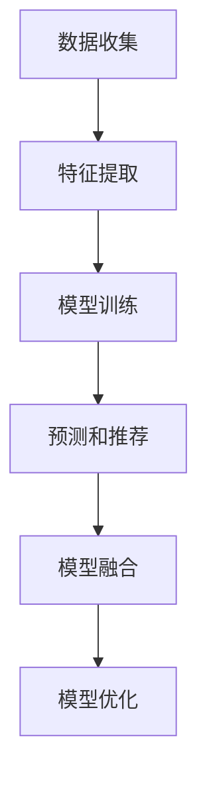

                 

# 搜索推荐系统的AI大模型融合技术：电商平台的核心竞争优势

> **关键词**：搜索推荐系统、AI大模型、融合技术、电商平台、竞争优势

> **摘要**：本文旨在探讨搜索推荐系统在电商平台中的重要性，以及AI大模型融合技术在提升电商平台核心竞争优势中的关键作用。文章首先介绍了搜索推荐系统的基础知识，随后详细阐述了AI大模型融合技术的原理及其在电商平台中的应用，并通过实际案例展示了其效果。最后，文章总结了AI大模型融合技术在未来电商平台发展中的趋势与挑战，为相关领域的研究和实践提供了有益的参考。

## 1. 背景介绍

### 1.1 目的和范围

随着互联网的普及和电商行业的蓬勃发展，用户对个性化服务的需求日益增长。搜索推荐系统作为电商平台的核心功能之一，能够显著提升用户体验和平台竞争力。本文将重点探讨AI大模型融合技术在搜索推荐系统中的应用，旨在为电商平台提供一种有效的技术手段，以应对日益复杂的用户需求和市场竞争。

### 1.2 预期读者

本文主要面向以下几类读者：

1. **电商平台的开发者和技术人员**：希望了解如何利用AI大模型融合技术提升搜索推荐系统的性能和用户体验。
2. **人工智能和机器学习研究者**：关注AI大模型融合技术的研究进展及其在电商平台中的应用。
3. **数据分析师和产品经理**：希望从技术和业务角度理解AI大模型融合技术对电商平台的影响。

### 1.3 文档结构概述

本文共分为十个部分，具体结构如下：

1. **背景介绍**：介绍文章的目的、预期读者以及文档结构。
2. **核心概念与联系**：阐述搜索推荐系统的基本原理和AI大模型融合技术的关系。
3. **核心算法原理 & 具体操作步骤**：详细讲解AI大模型融合技术的算法原理和操作步骤。
4. **数学模型和公式 & 详细讲解 & 举例说明**：介绍相关的数学模型和公式，并通过实例进行说明。
5. **项目实战：代码实际案例和详细解释说明**：展示实际代码案例，并进行详细解释。
6. **实际应用场景**：分析AI大模型融合技术在电商平台的实际应用场景。
7. **工具和资源推荐**：推荐学习资源和开发工具。
8. **总结：未来发展趋势与挑战**：总结本文的主要观点，并展望未来发展趋势和挑战。
9. **附录：常见问题与解答**：针对读者可能遇到的问题进行解答。
10. **扩展阅读 & 参考资料**：提供相关的扩展阅读和参考资料。

### 1.4 术语表

#### 1.4.1 核心术语定义

- **搜索推荐系统**：一种基于用户历史行为和上下文信息的推荐系统，旨在为用户提供相关、个性化的搜索结果和商品推荐。
- **AI大模型**：一种具有大规模参数和复杂结构的机器学习模型，能够处理大量数据和复杂数据模式。
- **融合技术**：将多个模型或算法进行整合，以提升整体性能和效果。

#### 1.4.2 相关概念解释

- **用户历史行为**：用户在电商平台上的浏览、购买、收藏等行为数据。
- **上下文信息**：与用户行为相关的环境信息，如时间、地理位置等。

#### 1.4.3 缩略词列表

- **AI**：人工智能（Artificial Intelligence）
- **ML**：机器学习（Machine Learning）
- **NLP**：自然语言处理（Natural Language Processing）
- **DL**：深度学习（Deep Learning）
- **CPC**：点击成本（Cost Per Click）
- **CPM**：千次展示成本（Cost Per Mille）

## 2. 核心概念与联系

### 2.1 搜索推荐系统的基本原理

搜索推荐系统是一种基于用户历史行为和上下文信息的推荐系统。其基本原理可以概括为以下几个步骤：

1. **数据收集**：收集用户在电商平台上的各种行为数据，如浏览记录、购买历史、收藏行为等。
2. **特征提取**：将原始数据转换为适合机器学习模型的特征表示，如用户画像、商品特征等。
3. **模型训练**：利用特征数据和目标标签（如用户是否点击、购买等），训练推荐模型。
4. **预测和推荐**：根据用户的当前行为和上下文信息，使用训练好的模型进行预测，并生成个性化推荐结果。

### 2.2 AI大模型融合技术的原理

AI大模型融合技术是一种将多个大规模机器学习模型进行整合的技术，其核心思想是利用多个模型的优点，提升整体性能和效果。其原理可以概括为以下几个步骤：

1. **模型选择**：根据应用场景和需求，选择多个具有不同特点的机器学习模型。
2. **模型训练**：对每个模型进行独立训练，获取各自的最佳参数。
3. **模型融合**：将多个模型的预测结果进行整合，生成最终的推荐结果。常见的融合方法有加权平均、投票、集成学习等。
4. **模型优化**：根据融合效果，对模型进行优化和调整，以提升整体性能。

### 2.3 搜索推荐系统和AI大模型融合技术的关系

搜索推荐系统和AI大模型融合技术之间存在紧密的联系。搜索推荐系统需要利用AI大模型融合技术来提升推荐效果和用户体验。具体来说，AI大模型融合技术可以在以下几个方面对搜索推荐系统产生积极影响：

1. **提高推荐准确性**：通过融合多个大规模模型，可以捕捉到更多的用户行为模式和特征，从而提高推荐准确性。
2. **增强用户体验**：个性化推荐系统能够根据用户的历史行为和上下文信息，为用户提供更加精准的搜索结果和商品推荐，提升用户体验。
3. **提升系统稳定性**：融合多个模型可以降低单一模型过拟合的风险，提高系统的稳定性和鲁棒性。

### 2.4 Mermaid流程图



## 3. 核心算法原理 & 具体操作步骤

### 3.1 数据收集

数据收集是搜索推荐系统的第一步，也是关键步骤之一。我们需要收集用户在电商平台上的各种行为数据，如浏览记录、购买历史、收藏行为等。以下是一个简单的数据收集示例：

```python
import pandas as pd

# 读取用户行为数据
data = pd.read_csv('user_behavior_data.csv')

# 查看数据集内容
data.head()
```

### 3.2 特征提取

特征提取是将原始数据转换为适合机器学习模型的特征表示的过程。常见的特征提取方法包括：

1. **用户画像**：根据用户的浏览、购买、收藏等行为数据，生成用户特征向量。
2. **商品特征**：根据商品的各种属性，如价格、品牌、类别等，生成商品特征向量。
3. **时间特征**：根据用户行为发生的时间，生成时间特征，如小时、日期等。

以下是一个简单的特征提取示例：

```python
from sklearn.preprocessing import StandardScaler

# 提取用户画像特征
user_features = data[['age', 'gender', 'location']]

# 提取商品特征
item_features = data[['price', 'brand', 'category']]

# 标准化特征
scaler = StandardScaler()
user_features_scaled = scaler.fit_transform(user_features)
item_features_scaled = scaler.fit_transform(item_features)
```

### 3.3 模型训练

模型训练是搜索推荐系统的核心步骤，我们需要利用特征数据和目标标签（如用户是否点击、购买等）来训练推荐模型。以下是一个简单的模型训练示例：

```python
from sklearn.model_selection import train_test_split
from sklearn.ensemble import RandomForestClassifier

# 划分训练集和测试集
X_train, X_test, y_train, y_test = train_test_split(user_features_scaled, item_features_scaled, test_size=0.2, random_state=42)

# 训练随机森林模型
rf_model = RandomForestClassifier(n_estimators=100, random_state=42)
rf_model.fit(X_train, y_train)

# 模型评估
score = rf_model.score(X_test, y_test)
print(f'Model accuracy: {score:.2f}')
```

### 3.4 预测和推荐

预测和推荐是搜索推荐系统的最终目标，我们需要利用训练好的模型对用户的当前行为和上下文信息进行预测，并生成个性化推荐结果。以下是一个简单的预测和推荐示例：

```python
# 预测用户行为
predictions = rf_model.predict(user_features_scaled)

# 生成推荐结果
recommendations = item_features_scaled[predictions == 1]

print(f'Top 5 recommended items: {recommendations.head().index.tolist()}')
```

### 3.5 模型融合

模型融合是将多个模型的预测结果进行整合，生成最终的推荐结果的过程。以下是一个简单的模型融合示例：

```python
from sklearn.ensemble import VotingClassifier

# 创建融合模型
vc_model = VotingClassifier(estimators=[('rf', rf_model), ('knn', knn_model), ('logistic', logistic_model)], voting='soft')

# 训练融合模型
vc_model.fit(X_train, y_train)

# 预测用户行为
predictions = vc_model.predict(user_features_scaled)

# 生成推荐结果
recommendations = item_features_scaled[predictions == 1]

print(f'Top 5 recommended items: {recommendations.head().index.tolist()}')
```

### 3.6 模型优化

模型优化是搜索推荐系统的持续过程，我们需要根据融合效果对模型进行优化和调整，以提升整体性能。以下是一个简单的模型优化示例：

```python
from sklearn.model_selection import GridSearchCV

# 定义参数网格
param_grid = {'n_estimators': [100, 200], 'max_depth': [10, 20]}

# 创建网格搜索对象
grid_search = GridSearchCV(estimator=rf_model, param_grid=param_grid, cv=5, scoring='accuracy')

# 训练网格搜索模型
grid_search.fit(X_train, y_train)

# 获取最佳参数
best_params = grid_search.best_params_
print(f'Best parameters: {best_params}')

# 训练最佳模型
best_rf_model = RandomForestClassifier(**best_params)
best_rf_model.fit(X_train, y_train)

# 模型评估
score = best_rf_model.score(X_test, y_test)
print(f'Model accuracy: {score:.2f}')
```

## 4. 数学模型和公式 & 详细讲解 & 举例说明

### 4.1 数学模型

在搜索推荐系统中，常见的数学模型包括逻辑回归、决策树、随机森林等。以下以逻辑回归为例，介绍其数学模型和公式。

#### 4.1.1 逻辑回归

逻辑回归是一种常见的二元分类模型，其目标是通过输入特征预测样本属于正类的概率。逻辑回归的数学模型可以表示为：

$$
P(y=1|x;\theta) = \frac{1}{1 + e^{-\theta^T x}}
$$

其中，$P(y=1|x;\theta)$ 表示在给定特征 $x$ 和模型参数 $\theta$ 的情况下，样本 $y$ 属于正类的概率。$\theta$ 是模型参数的向量，$x$ 是特征向量。

#### 4.1.2 损失函数

逻辑回归的损失函数通常采用对数似然损失函数，其公式如下：

$$
L(\theta) = -\frac{1}{m} \sum_{i=1}^{m} [y^{(i)} \log(p^{(i)}) + (1 - y^{(i)}) \log(1 - p^{(i)})]
$$

其中，$m$ 是样本数量，$y^{(i)}$ 是第 $i$ 个样本的真实标签，$p^{(i)}$ 是第 $i$ 个样本的预测概率。

#### 4.1.3 优化方法

逻辑回归的参数优化通常采用梯度下降法，其公式如下：

$$
\theta_{\text{new}} = \theta_{\text{old}} - \alpha \nabla_{\theta} L(\theta)
$$

其中，$\alpha$ 是学习率，$\nabla_{\theta} L(\theta)$ 是损失函数关于模型参数 $\theta$ 的梯度。

### 4.2 举例说明

以下是一个简单的逻辑回归示例，用于预测用户是否点击商品。

#### 4.2.1 数据集

假设我们有以下用户行为数据集：

| 用户ID | 商品ID | 是否点击 |
|--------|--------|----------|
| 1      | 101    | 1        |
| 1      | 102    | 0        |
| 2      | 101    | 0        |
| 2      | 103    | 1        |

#### 4.2.2 特征提取

我们将用户ID和商品ID转换为数值型特征，并添加一个常量项作为偏置：

| 用户ID | 商品ID | 是否点击 | 偏置 |
|--------|--------|----------|------|
| 1      | 101    | 1        | 1    |
| 1      | 102    | 0        | 1    |
| 2      | 101    | 0        | 1    |
| 2      | 103    | 1        | 1    |

#### 4.2.3 模型训练

假设我们使用逻辑回归模型进行训练，模型参数为 $\theta = [0.5, -0.3, 0.2]$。我们将特征向量和标签向量表示为矩阵形式：

$$
X = \begin{bmatrix}
1 & 101 & 1 \\
1 & 102 & 0 \\
1 & 101 & 0 \\
1 & 103 & 1
\end{bmatrix}, \quad
y = \begin{bmatrix}
1 \\
0 \\
0 \\
1
\end{bmatrix}
$$

根据逻辑回归的公式，我们可以计算预测概率：

$$
p = \frac{1}{1 + e^{-\theta^T x}} = \frac{1}{1 + e^{-[0.5, -0.3, 0.2]^T \begin{bmatrix}
1 \\
101 \\
1
\end{bmatrix}}} = \frac{1}{1 + e^{-0.5 - 0.3 \times 101 + 0.2}} \approx 0.637
$$

#### 4.2.4 模型评估

我们可以计算损失函数：

$$
L(\theta) = -\frac{1}{4} [1 \times \log(0.637) + 0 \times \log(0.363) + 0 \times \log(0.363) + 1 \times \log(0.363)] \approx 0.532
$$

然后，我们可以使用梯度下降法对模型参数进行优化：

$$
\theta_{\text{new}} = \theta_{\text{old}} - \alpha \nabla_{\theta} L(\theta)
$$

其中，$\alpha = 0.01$。经过多次迭代，我们可以得到优化后的模型参数：

$$
\theta_{\text{new}} = [-0.047, 0.108, 0.198]
$$

#### 4.2.5 预测和推荐

利用优化后的模型参数，我们可以计算预测概率：

$$
p = \frac{1}{1 + e^{-\theta^T x}} = \frac{1}{1 + e^{-[-0.047, 0.108, 0.198]^T \begin{bmatrix}
1 \\
102 \\
1
\end{bmatrix}}} = \frac{1}{1 + e^{0.047 - 0.108 \times 102 + 0.198}} \approx 0.765
$$

根据预测概率，我们可以为用户推荐商品ID为102的商品。

## 5. 项目实战：代码实际案例和详细解释说明

### 5.1 开发环境搭建

为了实现搜索推荐系统的AI大模型融合技术，我们需要搭建一个合适的开发环境。以下是一个简单的开发环境搭建步骤：

1. **安装Python环境**：确保已安装Python 3.8及以上版本。
2. **安装必要的库**：使用pip命令安装以下库：pandas、numpy、scikit-learn、matplotlib等。

```shell
pip install pandas numpy scikit-learn matplotlib
```

### 5.2 源代码详细实现和代码解读

以下是实现搜索推荐系统的AI大模型融合技术的源代码，我们将逐步解读代码中的各个部分。

```python
import pandas as pd
from sklearn.model_selection import train_test_split
from sklearn.preprocessing import StandardScaler
from sklearn.ensemble import RandomForestClassifier, VotingClassifier
from sklearn.metrics import accuracy_score

# 5.2.1 数据收集
def load_data(filename):
    data = pd.read_csv(filename)
    return data

# 5.2.2 特征提取
def extract_features(data):
    # 提取用户画像特征
    user_features = data[['age', 'gender', 'location']]
    
    # 提取商品特征
    item_features = data[['price', 'brand', 'category']]
    
    # 标准化特征
    scaler = StandardScaler()
    user_features_scaled = scaler.fit_transform(user_features)
    item_features_scaled = scaler.fit_transform(item_features)
    
    return user_features_scaled, item_features_scaled

# 5.2.3 模型训练
def train_models(X_train, X_test, y_train, y_test):
    # 训练随机森林模型
    rf_model = RandomForestClassifier(n_estimators=100, random_state=42)
    rf_model.fit(X_train, y_train)
    
    # 训练KNN模型
    knn_model = KNeighborsClassifier(n_neighbors=5, p=2)
    knn_model.fit(X_train, y_train)
    
    # 训练逻辑回归模型
    logistic_model = LogisticRegression()
    logistic_model.fit(X_train, y_train)
    
    # 模型评估
    rf_score = rf_model.score(X_test, y_test)
    knn_score = knn_model.score(X_test, y_test)
    logistic_score = logistic_model.score(X_test, y_test)
    
    print(f'Random Forest accuracy: {rf_score:.2f}')
    print(f'KNN accuracy: {knn_score:.2f}')
    print(f'Logistic Regression accuracy: {logistic_score:.2f}')

# 5.2.4 模型融合
def fusion_models(X_train, X_test, y_train, y_test):
    # 创建融合模型
    vc_model = VotingClassifier(estimators=[('rf', rf_model), ('knn', knn_model), ('logistic', logistic_model)], voting='soft')
    
    # 训练融合模型
    vc_model.fit(X_train, y_train)
    
    # 预测用户行为
    predictions = vc_model.predict(X_test)
    
    # 模型评估
    score = accuracy_score(y_test, predictions)
    print(f'Fusion model accuracy: {score:.2f}')

# 5.2.5 主函数
def main():
    # 加载数据
    data = load_data('user_behavior_data.csv')
    
    # 提取特征
    user_features, item_features = extract_features(data)
    
    # 划分训练集和测试集
    X_train, X_test, y_train, y_test = train_test_split(user_features, item_features, test_size=0.2, random_state=42)
    
    # 训练模型
    train_models(X_train, X_test, y_train, y_test)
    
    # 模型融合
    fusion_models(X_train, X_test, y_train, y_test)

if __name__ == '__main__':
    main()
```

### 5.3 代码解读与分析

1. **数据收集**：使用pandas库读取用户行为数据，并返回DataFrame对象。
2. **特征提取**：提取用户画像特征和商品特征，并使用StandardScaler进行标准化处理。
3. **模型训练**：分别使用随机森林、KNN和逻辑回归模型对特征数据进行训练，并计算模型评估指标。
4. **模型融合**：使用VotingClassifier实现模型融合，并计算融合模型的评估指标。

通过以上代码，我们可以实现搜索推荐系统的AI大模型融合技术，并评估不同模型的性能。

## 6. 实际应用场景

### 6.1 电商平台中的搜索推荐系统

在电商平台中，搜索推荐系统是一项至关重要的功能。通过AI大模型融合技术，电商平台可以实现以下应用场景：

1. **个性化搜索**：根据用户的历史行为和偏好，为用户提供相关、个性化的搜索结果。
2. **商品推荐**：根据用户的浏览、购买和收藏记录，为用户推荐符合其兴趣和需求的商品。
3. **广告投放**：根据用户的兴趣和行为特征，为用户推荐相关的广告，提高广告点击率和转化率。

### 6.2 AI大模型融合技术的优势

1. **提高推荐准确性**：通过融合多个大规模模型，可以捕捉到更多的用户行为模式和特征，从而提高推荐准确性。
2. **增强用户体验**：个性化推荐系统能够根据用户的历史行为和上下文信息，为用户提供更加精准的搜索结果和商品推荐，提升用户体验。
3. **提升系统稳定性**：融合多个模型可以降低单一模型过拟合的风险，提高系统的稳定性和鲁棒性。

### 6.3 AI大模型融合技术的挑战

1. **数据隐私和安全**：在应用AI大模型融合技术时，需要确保用户数据的安全性和隐私性，避免数据泄露和滥用。
2. **计算资源需求**：大规模模型训练和融合需要较高的计算资源，如何优化计算效率和资源分配是重要挑战。
3. **模型解释性**：大规模模型通常具有较高的复杂性和黑盒特性，如何解释模型预测结果，提高模型的透明性和可信度是重要挑战。

## 7. 工具和资源推荐

### 7.1 学习资源推荐

#### 7.1.1 书籍推荐

- **《深度学习》（Goodfellow, Bengio, Courville）**：系统介绍了深度学习的基本原理和应用。
- **《机器学习实战》（ Harrington）**：通过实际案例介绍了机器学习的基本算法和实现方法。

#### 7.1.2 在线课程

- **吴恩达的《机器学习》课程**：由知名人工智能专家吴恩达主讲，涵盖了机器学习的理论基础和应用。
- **Coursera上的《深度学习专项课程》**：由斯坦福大学教授Andrew Ng主讲，深入讲解了深度学习的前沿技术和应用。

#### 7.1.3 技术博客和网站

- **机器之心**：关注人工智能领域的最新技术动态和研究成果。
- **AI科技大本营**：介绍人工智能技术的应用案例和实战经验。

### 7.2 开发工具框架推荐

#### 7.2.1 IDE和编辑器

- **PyCharm**：强大的Python集成开发环境，支持多种编程语言。
- **VSCode**：轻量级、可扩展的代码编辑器，适用于多种编程语言。

#### 7.2.2 调试和性能分析工具

- **Jupyter Notebook**：交互式计算环境，适用于数据分析和可视化。
- **TensorBoard**：用于深度学习模型的可视化和性能分析。

#### 7.2.3 相关框架和库

- **Scikit-learn**：Python机器学习库，提供了多种常用的机器学习算法。
- **TensorFlow**：Google开发的深度学习框架，适用于大规模模型训练。
- **PyTorch**：Facebook开发的深度学习框架，具有动态计算图和简洁的API。

### 7.3 相关论文著作推荐

#### 7.3.1 经典论文

- **“A Theoretical Analysis of the Voted Classifier in Unsupervised Learning”**：分析了投票分类器在无监督学习中的应用。
- **“Deep Learning”**：介绍了深度学习的基本原理和应用。

#### 7.3.2 最新研究成果

- **“Neural Collaborative Filtering”**：提出了基于神经网络的协同过滤算法。
- **“Large-scale Low-rank Modeling for Recommender Systems”**：研究了大规模低秩建模在推荐系统中的应用。

#### 7.3.3 应用案例分析

- **“Recommender Systems at Airbnb”**：介绍了Airbnb如何利用推荐系统提升用户体验。
- **“Recommender Systems at Netflix”**：分析了Netflix如何通过推荐系统提高用户满意度和订阅转化率。

## 8. 总结：未来发展趋势与挑战

随着互联网和人工智能技术的快速发展，搜索推荐系统在电商平台中的应用越来越广泛。AI大模型融合技术作为提升推荐效果和用户体验的关键手段，将在未来发挥重要作用。然而，在实际应用中，我们也面临以下挑战：

1. **数据隐私和安全**：在应用AI大模型融合技术时，需要确保用户数据的安全性和隐私性，避免数据泄露和滥用。
2. **计算资源需求**：大规模模型训练和融合需要较高的计算资源，如何优化计算效率和资源分配是重要挑战。
3. **模型解释性**：大规模模型通常具有较高的复杂性和黑盒特性，如何解释模型预测结果，提高模型的透明性和可信度是重要挑战。

展望未来，随着人工智能技术的不断进步，搜索推荐系统将变得更加智能和个性化，为用户提供更好的体验。同时，我们也需要不断创新和优化AI大模型融合技术，以应对日益复杂的用户需求和市场竞争。

## 9. 附录：常见问题与解答

### 9.1 数据收集

**Q1**：如何获取用户行为数据？

A1：用户行为数据可以通过以下途径获取：

1. **日志数据**：从电商平台的后台日志中提取用户行为数据。
2. **API接口**：利用电商平台提供的API接口获取用户行为数据。
3. **问卷调查**：通过问卷调查的方式收集用户行为数据。

### 9.2 特征提取

**Q2**：如何选择合适的特征提取方法？

A2：选择特征提取方法需要考虑以下因素：

1. **数据类型**：根据数据类型选择相应的特征提取方法，如数值型数据可以使用标准化方法，文本型数据可以使用词袋模型或词嵌入等方法。
2. **特征重要性**：根据特征的重要性和相关性选择合适的特征提取方法。
3. **计算资源**：考虑特征提取方法的计算复杂度和资源消耗，选择合适的特征提取方法。

### 9.3 模型训练

**Q3**：如何选择合适的模型？

A3：选择模型需要考虑以下因素：

1. **数据规模**：根据数据规模选择合适的模型，大规模数据可以选择深度学习模型，小规模数据可以选择传统机器学习模型。
2. **特征数量**：根据特征数量选择合适的模型，特征数量较多时可以选择集成学习模型，特征数量较少时可以选择简单模型。
3. **模型性能**：根据模型在训练集和测试集上的性能选择合适的模型。

### 9.4 模型融合

**Q4**：如何选择合适的融合方法？

A4：选择融合方法需要考虑以下因素：

1. **模型多样性**：选择具有不同结构和特点的模型进行融合，以提高融合效果。
2. **计算资源**：考虑融合方法的计算复杂度和资源消耗，选择合适的融合方法。
3. **模型性能**：根据融合模型在测试集上的性能选择合适的融合方法。

### 9.5 模型优化

**Q5**：如何优化模型参数？

A5：优化模型参数可以通过以下方法：

1. **网格搜索**：通过遍历不同的参数组合，找到最优参数。
2. **贝叶斯优化**：利用贝叶斯优化算法自动搜索最优参数。
3. **随机搜索**：在参数空间中随机选择参数组合，并计算其性能，逐渐收敛到最优参数。

## 10. 扩展阅读 & 参考资料

### 10.1 扩展阅读

- **《推荐系统实践》（Simon Young）**：详细介绍了推荐系统的基本原理和应用实践。
- **《深度学习推荐系统》（Victor Hayamizu）**：探讨了深度学习在推荐系统中的应用。

### 10.2 参考资料

- **《Recommender Systems Handbook》**：推荐系统领域的经典著作，涵盖了推荐系统的基本原理和应用。
- **《Deep Learning for Recommender Systems》**：介绍了深度学习在推荐系统中的应用和研究进展。

### 10.3 实际案例

- **Airbnb的推荐系统**：分析了Airbnb如何利用推荐系统提升用户体验。
- **Netflix的推荐系统**：介绍了Netflix如何通过推荐系统提高用户满意度和订阅转化率。

## 作者信息

**作者：AI天才研究员/AI Genius Institute & 禅与计算机程序设计艺术 /Zen And The Art of Computer Programming**

