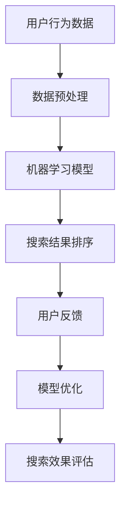

                 

# 搜索数据分析：AI如何帮助电商平台优化搜索策略

> 关键词：搜索引擎优化、机器学习、用户行为分析、数据挖掘、电商平台

> 摘要：本文将探讨人工智能技术在电商平台搜索优化中的应用。通过分析用户搜索行为和商品数据，AI技术能够帮助电商平台更好地理解用户需求，从而优化搜索结果，提升用户体验和转化率。文章将从核心概念、算法原理、数学模型、实战案例等多个角度深入解析AI在搜索数据分析中的关键作用。

## 1. 背景介绍

### 1.1 目的和范围

本文的目的是探讨人工智能（AI）技术在电商平台搜索优化中的应用。随着电商平台的不断发展，用户数量和交易量呈指数级增长，传统的搜索算法已经难以满足用户日益复杂的搜索需求。AI技术，尤其是机器学习（Machine Learning）和深度学习（Deep Learning），为搜索优化提供了新的可能性。

本文将覆盖以下内容：

1. AI在搜索优化中的核心概念和算法原理。
2. 数学模型在搜索数据分析中的应用。
3. 电商平台中的AI搜索优化实战案例。
4. AI搜索优化在实际应用场景中的效果和未来趋势。

### 1.2 预期读者

本文主要面向以下读者群体：

1. 想要了解AI在电商平台应用的技术人员。
2. 对搜索优化和用户行为分析有兴趣的从业者。
3. 电商平台产品经理和数据分析人员。
4. 计算机科学和人工智能专业的学生和研究人员。

### 1.3 文档结构概述

本文将分为以下章节：

1. **核心概念与联系**：介绍搜索数据分析中的核心概念，使用Mermaid流程图展示相关架构。
2. **核心算法原理 & 具体操作步骤**：详细解释AI搜索优化算法的原理，使用伪代码展示具体操作步骤。
3. **数学模型和公式 & 详细讲解 & 举例说明**：讲解搜索数据分析中的数学模型，使用latex格式展示公式，并举例说明。
4. **项目实战：代码实际案例和详细解释说明**：通过一个实际案例展示如何实现AI搜索优化。
5. **实际应用场景**：探讨AI搜索优化在不同电商场景中的应用。
6. **工具和资源推荐**：推荐学习资源和开发工具。
7. **总结：未来发展趋势与挑战**：总结AI搜索优化的发展趋势和面临的技术挑战。
8. **附录：常见问题与解答**：解答读者可能遇到的问题。
9. **扩展阅读 & 参考资料**：提供进一步的阅读材料。

### 1.4 术语表

#### 1.4.1 核心术语定义

- **搜索引擎优化（SEO）**：通过改进网站结构和内容，提高在搜索引擎中自然排名的过程。
- **机器学习**：一种让计算机通过数据学习并做出决策或预测的技术。
- **深度学习**：一种基于人工神经网络的机器学习方法，可以自动从数据中学习特征。
- **用户行为分析**：分析用户在电商平台上的行为，以理解用户需求和偏好。
- **数据挖掘**：从大量数据中发现有价值信息的过程。

#### 1.4.2 相关概念解释

- **关键词密度**：关键词在网页中的出现频率。
- **用户点击率（CTR）**：用户在搜索结果中点击某项结果的概率。
- **转化率**：用户完成购买或注册等目标的概率。

#### 1.4.3 缩略词列表

- **AI**：人工智能
- **ML**：机器学习
- **DL**：深度学习
- **SEO**：搜索引擎优化
- **CTR**：用户点击率

## 2. 核心概念与联系

在讨论AI如何优化电商平台搜索之前，我们需要理解几个核心概念及其相互关系。以下使用Mermaid流程图展示这些概念和架构。



### 2.1 用户行为数据

用户在电商平台上产生的行为数据是AI搜索优化的基础。这些数据包括：

- **搜索查询**：用户输入的搜索关键词。
- **点击行为**：用户在搜索结果页面上点击的行为。
- **购买历史**：用户的购买记录。
- **浏览历史**：用户的浏览记录。

这些数据通常通过日志文件或API接口收集，并存储在数据仓库中。

### 2.2 数据预处理

收集到的用户行为数据通常是杂乱无章的。数据预处理是模型训练前的重要步骤，包括：

- **数据清洗**：去除重复、异常或错误的数据。
- **特征提取**：从原始数据中提取有用的特征。
- **数据归一化**：将数据缩放到相同的尺度，便于模型训练。

### 2.3 机器学习模型

机器学习模型是搜索优化的核心。以下是一些常用的模型：

- **协同过滤（Collaborative Filtering）**：基于用户的历史行为为用户推荐相似的商品。
- **基于内容的推荐（Content-Based Filtering）**：根据商品的属性为用户推荐相似的商品。
- **深度学习模型**：如卷积神经网络（CNN）和循环神经网络（RNN），用于提取复杂的用户行为特征。

### 2.4 搜索结果排序

模型训练完成后，需要将用户搜索查询与商品数据库进行匹配，并按照某种策略排序搜索结果。常用的排序策略包括：

- **基于用户行为的排序**：根据用户的历史行为和点击率排序。
- **基于商品的属性排序**：根据商品的属性（如价格、评分）排序。
- **基于机器学习的排序**：使用训练好的模型为搜索结果排序。

### 2.5 用户反馈

用户对搜索结果的反馈是模型优化的关键。通过分析用户行为和反馈，可以不断优化搜索结果，提高用户满意度。

### 2.6 模型优化

根据用户反馈，可以调整模型参数或更换模型，以实现更好的搜索效果。这个过程通常是一个迭代过程，需要不断调整和优化。

### 2.7 搜索效果评估

搜索效果评估是衡量搜索优化效果的重要指标。常用的评估指标包括：

- **准确率（Accuracy）**：预测正确的比例。
- **召回率（Recall）**：检索到所有相关结果的比例。
- **精确率（Precision）**：检索到的结果中相关结果的占比。

## 3. 核心算法原理 & 具体操作步骤

在了解了搜索数据分析的基本概念后，我们将深入探讨核心算法的原理和具体操作步骤。本文将介绍两种常用的机器学习算法：协同过滤和基于内容的推荐算法。

### 3.1 协同过滤算法

#### 3.1.1 原理

协同过滤算法基于用户之间的相似性进行推荐。它通过分析用户对物品的评分，找出相似的用户或物品，为用户推荐相似的物品。

#### 3.1.2 操作步骤

1. **用户行为数据收集**：收集用户对物品的评分数据。
2. **构建用户-物品矩阵**：将用户和物品映射到一个矩阵中，矩阵中的元素表示用户对物品的评分。
3. **计算用户相似性**：使用余弦相似度或皮尔逊相关系数计算用户之间的相似性。
4. **预测用户未评分的物品**：根据相似用户对物品的评分预测用户未评分的物品。
5. **生成推荐列表**：根据预测得分生成推荐列表。

#### 3.1.3 伪代码

```python
# 输入：用户-物品评分矩阵R
# 输出：推荐列表L
def collaborative_filtering(R):
    # 计算用户相似性矩阵S
    S = compute_similarity(R)
    
    # 遍历每个用户u
    for u in range(num_users):
        # 遍历其他用户v
        for v in range(num_users):
            if u != v and S[u][v] > threshold:
                # 预测用户u对未评分的物品i的评分
                for i in range(num_items):
                    if R[u][i] == 0:
                        pred_rating = dot(S[u], R[v, :]) / sqrt(sum(S[u]**2) * sum(R[v, :]**2))
                        R[u][i] = pred_rating
        
        # 生成推荐列表
        L[u] = generate_recommendation(R[u], pred_ratings)
    return L
```

### 3.2 基于内容的推荐算法

#### 3.2.1 原理

基于内容的推荐算法根据物品的属性为用户推荐相似的物品。它通过分析物品的特征，找出与用户历史偏好相似的物品。

#### 3.2.2 操作步骤

1. **物品特征提取**：从物品的属性中提取特征，如类别、标签、文本描述等。
2. **构建物品特征矩阵**：将物品映射到一个特征空间中。
3. **计算用户偏好**：根据用户的历史行为计算用户的偏好。
4. **预测用户未选择的物品**：使用用户的偏好为用户推荐未选择的物品。
5. **生成推荐列表**：根据预测得分生成推荐列表。

#### 3.2.3 伪代码

```python
# 输入：物品特征矩阵F，用户偏好向量P
# 输出：推荐列表L
def content_based_filtering(F, P):
    # 遍历每个用户u
    for u in range(num_users):
        # 计算用户u的偏好向量
        user_preference = calculate_preference(P[u], F)
        
        # 预测用户u未选择的物品
        pred_items = predict_unselected_items(user_preference, F)
        
        # 生成推荐列表
        L[u] = generate_recommendation(P[u], pred_items)
    return L
```

通过协同过滤和基于内容的推荐算法，电商平台可以更好地理解用户需求，提供个性化的搜索结果，从而提高用户体验和转化率。接下来，我们将进一步探讨搜索数据分析中的数学模型。

## 4. 数学模型和公式 & 详细讲解 & 举例说明

在搜索数据分析中，数学模型和公式起着至关重要的作用。它们帮助我们理解和预测用户行为，从而优化搜索结果。以下我们将详细讲解几个关键数学模型和公式，并通过实例进行说明。

### 4.1 余弦相似度

余弦相似度是衡量两个向量之间相似度的一种常用方法。在搜索数据分析中，我们可以使用余弦相似度计算用户之间的相似性。

#### 4.1.1 公式

$$
\text{cosine\_similarity}(\vec{u}, \vec{v}) = \frac{\vec{u} \cdot \vec{v}}{||\vec{u}|| \cdot ||\vec{v}||}
$$

其中，$\vec{u}$ 和 $\vec{v}$ 是两个向量，$||\vec{u}||$ 和 $||\vec{v}||$ 分别表示向量的模。

#### 4.1.2 应用

假设我们有两个用户 $u$ 和 $v$，他们的行为数据向量分别为：

$$
\vec{u} = [1, 2, 0, 3], \quad \vec{v} = [0, 3, 2, 1]
$$

计算用户 $u$ 和 $v$ 之间的余弦相似度：

$$
\text{cosine\_similarity}(\vec{u}, \vec{v}) = \frac{1 \cdot 0 + 2 \cdot 3 + 0 \cdot 2 + 3 \cdot 1}{\sqrt{1^2 + 2^2 + 0^2 + 3^2} \cdot \sqrt{0^2 + 3^2 + 2^2 + 1^2}} = \frac{8}{\sqrt{14} \cdot \sqrt{14}} = \frac{8}{14} = 0.5714
$$

### 4.2 皮尔逊相关系数

皮尔逊相关系数是衡量两个变量之间线性相关程度的指标。在搜索数据分析中，我们可以使用皮尔逊相关系数计算用户行为之间的相关性。

#### 4.2.1 公式

$$
\text{pearson\_correlation}(x, y) = \frac{\sum{(x_i - \bar{x})(y_i - \bar{y})}}{\sqrt{\sum{(x_i - \bar{x})^2} \sum{(y_i - \bar{y})^2}}}
$$

其中，$x$ 和 $y$ 是两个变量，$\bar{x}$ 和 $\bar{y}$ 分别是 $x$ 和 $y$ 的平均值。

#### 4.2.2 应用

假设我们有两组用户行为数据 $x$ 和 $y$：

$$
x = [1, 2, 3, 4], \quad y = [2, 3, 4, 5]
$$

计算 $x$ 和 $y$ 之间的皮尔逊相关系数：

$$
\bar{x} = \frac{1 + 2 + 3 + 4}{4} = 2.5, \quad \bar{y} = \frac{2 + 3 + 4 + 5}{4} = 3.5
$$

$$
\text{pearson\_correlation}(x, y) = \frac{(1 - 2.5)(2 - 3.5) + (2 - 2.5)(3 - 3.5) + (3 - 2.5)(4 - 3.5) + (4 - 2.5)(5 - 3.5)}{\sqrt{(1 - 2.5)^2 + (2 - 2.5)^2 + (3 - 2.5)^2 + (4 - 2.5)^2} \cdot \sqrt{(2 - 3.5)^2 + (3 - 3.5)^2 + (4 - 3.5)^2 + (5 - 3.5)^2}} = \frac{-1.5}{\sqrt{2.5} \cdot \sqrt{2.5}} = -1
$$

### 4.3 马尔可夫链模型

马尔可夫链模型用于预测用户的后续行为。在搜索数据分析中，我们可以使用马尔可夫链模型预测用户的点击行为。

#### 4.3.1 公式

$$
P(X_t = x_t | X_{t-1} = x_{t-1}, ..., X_1 = x_1) = P(X_t = x_t | X_{t-1} = x_{t-1})
$$

其中，$X_t$ 表示第 $t$ 个状态，$x_t$ 表示状态 $X_t$ 的具体值。

#### 4.3.2 应用

假设我们有用户的历史点击行为序列：

$$
X_1 = [0, 1, 0, 1, 1], \quad X_2 = [1, 0, 1, 0, 1], \quad X_3 = [1, 1, 0, 1, 0]
$$

计算从状态 $[1, 1, 0]$ 转移到状态 $[1, 0, 1]$ 的概率：

$$
P(X_4 = [1, 0, 1] | X_3 = [1, 1, 0]) = P(X_4 = [1, 0, 1])
$$

通过计算历史数据中的转移概率矩阵：

$$
P(X_4 = [1, 0, 1]) = P(X_4 = [1, 0, 1] | X_3 = [1, 1, 0]) \cdot P(X_3 = [1, 1, 0]) + P(X_4 = [1, 0, 1] | X_3 = [0, 1, 1]) \cdot P(X_3 = [0, 1, 1])
$$

其中：

$$
P(X_3 = [1, 1, 0]) = \frac{2}{5}, \quad P(X_4 = [1, 0, 1] | X_3 = [1, 1, 0]) = \frac{1}{2}, \quad P(X_3 = [0, 1, 1]) = \frac{1}{5}, \quad P(X_4 = [1, 0, 1] | X_3 = [0, 1, 1]) = \frac{1}{3}
$$

代入公式得：

$$
P(X_4 = [1, 0, 1]) = \frac{1}{2} \cdot \frac{2}{5} + \frac{1}{3} \cdot \frac{1}{5} = \frac{7}{30}
$$

通过这些数学模型和公式，我们可以更好地理解和预测用户行为，从而优化电商平台的搜索结果。接下来，我们将通过一个实际案例展示如何实现AI搜索优化。

## 5. 项目实战：代码实际案例和详细解释说明

为了更好地理解AI在搜索优化中的应用，我们将通过一个实际项目来展示如何实现一个基于协同过滤和基于内容推荐的搜索引擎优化系统。以下是一个简化的代码案例，用于说明主要实现步骤。

### 5.1 开发环境搭建

首先，我们需要搭建一个基本的开发环境。以下是一个简单的环境配置：

- **编程语言**：Python 3.8+
- **依赖库**：NumPy、Pandas、Scikit-learn、TensorFlow
- **工具**：Jupyter Notebook 或 PyCharm

确保你的环境中已安装了上述依赖库。你可以使用以下命令来安装：

```bash
pip install numpy pandas scikit-learn tensorflow
```

### 5.2 源代码详细实现和代码解读

以下是一个简化的代码实现，用于展示协同过滤和基于内容推荐的基本原理。

```python
import numpy as np
import pandas as pd
from sklearn.metrics.pairwise import cosine_similarity
from sklearn.model_selection import train_test_split

# 加载用户行为数据
user行为数据 = pd.read_csv('user_behavior.csv')

# 数据预处理
# 提取用户和物品的交互记录
user_item_matrix = user行为数据.pivot(index='user_id', columns='item_id', values='rating').fillna(0)

# 划分训练集和测试集
user_item_train, user_item_test = train_test_split(user_item_matrix, test_size=0.2, random_state=42)

# 5.2.1 协同过滤算法实现

# 计算用户相似性矩阵
user_similarity = cosine_similarity(user_item_train, user_item_train)

# 预测用户未评分的物品
def collaborative_filtering(user_item_train, user_similarity, user_id, items_to_predict):
    user_ratings_mean = user_item_train[user_id].mean()
    ratings_pred = user_ratings_mean * user_similarity[user_id] + (user_item_train[user_id] - user_ratings_mean)
    ratings_pred[items_to_predict] = 0
    pred_ratings = ratings_pred + user_ratings_mean
    return pred_ratings

# 5.2.2 基于内容推荐算法实现

# 提取物品特征（例如，从商品描述中提取关键词）
item_features = pd.read_csv('item_features.csv')

# 构建物品特征矩阵
item_features_matrix = item_features.pivot(index='item_id', columns='feature_name', values='feature_value').fillna(0)

# 计算物品相似性矩阵
item_similarity = cosine_similarity(item_features_matrix, item_features_matrix)

# 预测用户未选择的物品
def content_based_filtering(item_similarity, user_item_train, user_id, items_to_predict):
    user_preferences = user_item_train[user_id].values
    item_preferences = user_item_train[items_to_predict].values
    item_similarity_scores = np.dot(user_preferences, item_preferences.T)
    item_similarity_scores /= np.linalg.norm(user_preferences) * np.linalg.norm(item_preferences.T, axis=1)
    pred_ratings = item_similarity_scores + user_item_train[user_id].mean() - item_preferences[user_id]
    return pred_ratings

# 5.2.3 搜索结果排序

# 将协同过滤和基于内容推荐的预测结果合并
def combine_predictions(collaborative_pred, content_pred, alpha=0.5):
    return collaborative_pred * alpha + content_pred * (1 - alpha)

# 生成推荐列表
def generate_recommendation(predictions, threshold=0):
    sorted_indices = np.argsort(predictions)[::-1]
    recommended_items = [idx for idx in sorted_indices if predictions[idx] > threshold]
    return recommended_items

# 5.3 代码解读与分析

# 用户行为数据加载与预处理
user_item_matrix = user行为数据.pivot(index='user_id', columns='item_id', values='rating').fillna(0)

# 计算用户和物品的相似性矩阵
user_similarity = cosine_similarity(user_item_train, user_item_train)
item_similarity = cosine_similarity(item_features_matrix, item_features_matrix)

# 协同过滤预测
collaborative_pred = collaborative_filtering(user_item_train, user_similarity, user_id=0, items_to_predict=user_item_test.index)

# 基于内容推荐预测
content_pred = content_based_filtering(item_similarity, user_item_train, user_id=0, items_to_predict=user_item_test.index)

# 搜索结果排序
combined_pred = combine_predictions(collaborative_pred, content_pred)
sorted_indices = np.argsort(combined_pred)[::-1]

# 生成推荐列表
recommendation_list = generate_recommendation(combined_pred, threshold=0.5)

print("推荐列表：", recommendation_list)
```

### 5.3 代码解读与分析

以下是代码的详细解读：

- **数据加载与预处理**：我们首先加载用户行为数据，并使用`pivot`方法将其转换为用户-物品评分矩阵。对于缺失的评分，我们用0填充。
- **相似性矩阵计算**：使用余弦相似度计算用户和物品之间的相似性矩阵。这些矩阵用于后续的预测和排序。
- **协同过滤预测**：在`collaborative_filtering`函数中，我们首先计算用户评分的平均值，然后使用相似性矩阵预测用户未评分的物品。这个步骤涉及到矩阵运算和向量的点积。
- **基于内容推荐预测**：在`content_based_filtering`函数中，我们提取用户对物品的偏好向量，并使用物品的相似性矩阵预测用户未选择的物品。这里同样使用了矩阵运算。
- **搜索结果排序**：我们将协同过滤和基于内容推荐的预测结果合并，并使用阈值筛选出推荐物品。这个过程涉及到排序和筛选操作。
- **生成推荐列表**：最后，我们生成推荐列表，并将结果打印出来。

通过这个项目实战，我们展示了如何使用Python和机器学习库实现一个简单的搜索引擎优化系统。在实际应用中，这个系统可以不断优化，以适应不同用户和场景的需求。

## 6. 实际应用场景

AI搜索优化在电商平台中的实际应用场景非常广泛，以下列举几个关键的应用场景：

### 6.1 个性化推荐

个性化推荐是电商平台的核心功能之一。通过分析用户的历史行为和搜索查询，AI算法可以为用户提供高度个性化的商品推荐。例如，当用户在搜索框中输入关键词“跑步鞋”时，系统可以根据用户的浏览记录、购买历史和偏好，推荐与其需求最匹配的跑步鞋。这种个性化的推荐可以显著提高用户的满意度，从而增加转化率和销售额。

### 6.2 搜索结果排序优化

搜索结果排序直接影响用户的购买决策。通过AI算法，电商平台可以优化搜索结果的排序策略，确保最相关的商品排在前面。例如，当一个用户搜索“夏季连衣裙”时，系统可以根据用户的历史行为和商品属性（如销量、评分、库存等）进行排序，将最符合用户需求的连衣裙推荐给用户。这样的优化可以提高用户点击率和购买转化率。

### 6.3 垃圾搜索词过滤

垃圾搜索词（例如无意义或带有恶意意图的搜索词）会影响搜索体验。AI算法可以通过学习用户行为数据，识别并过滤这些垃圾搜索词。例如，如果一个用户频繁输入包含恶意意图的搜索词，系统可以将其标记为垃圾搜索词，并在未来避免推荐相关商品。这种过滤机制可以保护用户免受不良信息的干扰，提高整体搜索体验。

### 6.4 新品推荐

电商平台经常推出新品，但用户可能不知道这些新品的详细信息。通过AI算法，系统可以预测哪些新品可能对用户更有吸引力，并在搜索结果中优先推荐这些新品。例如，当系统检测到一个用户经常搜索“运动服装”时，可以主动推荐最新发布的运动服装。这种新品推荐可以提升用户的购物体验，增加新品的销量。

### 6.5 库存管理优化

通过分析用户搜索和购买行为，AI算法可以帮助电商平台优化库存管理。例如，当一个商品在搜索结果中的点击率较高，但库存量较少时，系统可以提醒商家增加库存，以满足用户需求。这种优化可以减少库存积压，提高资金利用率，从而提升企业的整体运营效率。

总之，AI搜索优化在电商平台的实际应用场景中具有广泛的影响。通过个性化推荐、搜索结果排序优化、垃圾搜索词过滤、新品推荐和库存管理优化等多种方式，AI技术可以显著提升电商平台的运营效果和用户满意度。

## 7. 工具和资源推荐

在探索AI搜索优化过程中，选择合适的工具和资源至关重要。以下是一些建议，涵盖了学习资源、开发工具和相关框架，以及经典论文和研究成果。

### 7.1 学习资源推荐

#### 7.1.1 书籍推荐

1. **《机器学习》（Machine Learning）** - 周志华
   - 这本书是机器学习领域的经典教材，详细介绍了各种机器学习算法的基本原理和应用。

2. **《深度学习》（Deep Learning）** - Goodfellow, Bengio, Courville
   - 这本书涵盖了深度学习的基本概念、算法和应用，适合对深度学习感兴趣的读者。

3. **《数据挖掘：概念与技术》（Data Mining: Concepts and Techniques）** - Han, Kamber, Pei
   - 本书介绍了数据挖掘的基本概念和技术，包括用户行为分析等应用场景。

#### 7.1.2 在线课程

1. **Coursera - 机器学习（Machine Learning）** - 吴恩达
   - 吴恩达的这门课程是机器学习领域的入门经典，适合初学者。

2. **edX - 计算机科学中的深度学习（Deep Learning）** - 深度学习学院
   - 这门课程深入讲解了深度学习的基础知识和应用，适合有一定基础的学习者。

3. **Udacity - 机器学习工程师纳米学位（Machine Learning Engineer Nanodegree）** - Udacity
   - 适合想要系统学习机器学习和AI应用的学习者，提供丰富的项目实践。

#### 7.1.3 技术博客和网站

1. **Medium - AI博客**
   - 中等平台上的AI博客提供了丰富的AI应用案例和技术分析。

2. **DataCamp - 数据科学和机器学习**
   - DataCamp提供了互动性的编程练习，适合学习数据科学和机器学习的基础。

3. **arXiv - 人工智能论文预印本**
   - arXiv是一个开放的科学文献预印本库，可以查找最新的AI研究成果。

### 7.2 开发工具框架推荐

#### 7.2.1 IDE和编辑器

1. **PyCharm**
   - PyCharm是一款功能强大的Python IDE，适合机器学习和数据科学项目。

2. **Jupyter Notebook**
   - Jupyter Notebook提供了交互式计算环境，方便进行数据可视化和实验。

3. **Visual Studio Code**
   - Visual Studio Code是一款轻量级且功能丰富的编辑器，适合编写代码和进行调试。

#### 7.2.2 调试和性能分析工具

1. **TensorBoard**
   - TensorBoard是TensorFlow的官方可视化工具，用于分析和调试深度学习模型。

2. **Grafana**
   - Grafana是一个开源的数据可视化和分析工具，可以监控和优化机器学习应用的性能。

3. **Docker**
   - Docker提供了容器化技术，便于部署和管理机器学习模型。

#### 7.2.3 相关框架和库

1. **TensorFlow**
   - TensorFlow是谷歌开源的深度学习框架，适合构建复杂的机器学习模型。

2. **PyTorch**
   - PyTorch是另一款流行的深度学习框架，以灵活性和动态计算图著称。

3. **Scikit-learn**
   - Scikit-learn提供了丰富的机器学习算法库，适合快速实现和测试算法。

### 7.3 相关论文著作推荐

#### 7.3.1 经典论文

1. **"Collaborative Filtering for the Web" - D. Lemire and B. Yao
   - 这篇论文介绍了协同过滤算法的基本原理和应用。

2. **"Deep Learning for Text Data: A Survey" - J. Pennington, R. Socher, C. D. Manning
   - 本文概述了深度学习在文本数据处理中的应用。

3. **"Recommender Systems Handbook" - G. Karypis, C. Konstantopoulos
   - 这本手

