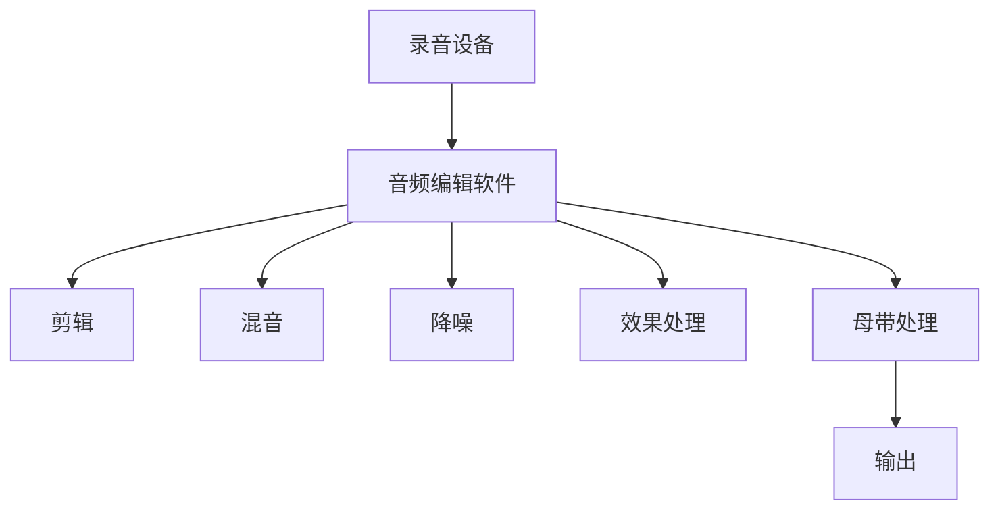

                 

# 播客制作工具：音频内容创作的得力助手

> 关键词：播客制作、音频内容、创作工具、音频编辑、声音处理、音频效果、专业音频软件、音频质量优化、音频工程

> 摘要：本文将深入探讨播客制作工具在音频内容创作中的应用，从背景介绍、核心概念与联系、核心算法原理、数学模型与公式、项目实战、实际应用场景等多个维度，详细解析这些工具的原理和操作步骤，帮助读者掌握音频内容创作的关键技术，提升音频质量，实现高效、专业的播客制作。

## 1. 背景介绍

### 1.1 目的和范围

本文旨在为广大音频内容创作者提供一份详尽的播客制作工具指南，帮助读者了解并掌握音频内容创作所需的核心工具和技能。无论是独立制作人，还是专业广播电台，都能在这篇文章中找到适合自己的工具和解决方案。

文章将涵盖以下内容：

1. **核心概念与联系**：介绍音频内容创作的基本概念和工具架构。
2. **核心算法原理与具体操作步骤**：深入解析音频处理算法和编辑技巧。
3. **数学模型与公式**：阐述音频信号处理中的数学原理和公式。
4. **项目实战**：通过实际案例展示工具的使用方法和效果。
5. **实际应用场景**：探讨播客制作工具在各种场景下的应用。
6. **工具和资源推荐**：推荐学习资源、开发工具和经典文献。
7. **总结与展望**：预测播客制作工具的未来发展趋势与挑战。

### 1.2 预期读者

本文适用于以下读者群体：

- **独立音频内容创作者**：希望通过使用专业工具提升创作水平的个人制作人。
- **专业广播电台工作人员**：需要掌握更多音频处理技巧以提升节目质量的广播从业人员。
- **教育工作者**：希望通过本文为学生或学员提供系统性的音频内容创作教学。
- **技术爱好者**：对音频处理技术感兴趣，希望深入了解该领域的专业人士。

### 1.3 文档结构概述

本文的结构安排如下：

1. **背景介绍**：介绍文章的目的、范围、预期读者和文档结构。
2. **核心概念与联系**：阐述音频内容创作的基本概念和工具架构。
3. **核心算法原理与具体操作步骤**：深入解析音频处理算法和编辑技巧。
4. **数学模型与公式**：阐述音频信号处理中的数学原理和公式。
5. **项目实战**：通过实际案例展示工具的使用方法和效果。
6. **实际应用场景**：探讨播客制作工具在各种场景下的应用。
7. **工具和资源推荐**：推荐学习资源、开发工具和经典文献。
8. **总结与展望**：预测播客制作工具的未来发展趋势与挑战。
9. **附录：常见问题与解答**：解答读者可能遇到的问题。
10. **扩展阅读与参考资料**：提供进一步学习的资源。

### 1.4 术语表

在本文中，我们将使用以下专业术语，为了确保读者能够理解，下面是对这些术语的定义和解释：

#### 1.4.1 核心术语定义

- **播客（Podcast）**：一种通过互联网进行订阅和播送的音频广播形式。
- **音频编辑**：对音频信号进行剪辑、混音、降噪等处理的过程。
- **声音处理**：对音频信号进行增强、降噪、压缩等操作，以改善音质。
- **音频效果**：用于修饰和增强音频信号的各种音效。
- **音频工程**：音频制作过程中的技术和管理工作，包括录音、混音、母带处理等。

#### 1.4.2 相关概念解释

- **采样率**：每秒采样的次数，单位为Hz，常见值为44.1kHz。
- **比特率**：音频文件每秒比特数，影响音频文件的大小和音质。
- **频率响应**：音频信号中各频率成分的响应特性。
- **相位**：描述波形在时间轴上相对位置的量。

#### 1.4.3 缩略词列表

- **MP3**：MPEG-1 Audio Layer 3，一种音频压缩格式。
- **AAC**：Advanced Audio Coding，一种音频编码格式。
- **DSP**：Digital Signal Processing，数字信号处理技术。
- **DAW**：Digital Audio Workstation，数字音频工作站。

## 2. 核心概念与联系

在深入探讨播客制作工具之前，我们需要了解音频内容创作的基本概念和工具架构。以下是几个关键概念和它们之间的关系。

### 2.1 音频信号处理的基本概念

音频信号处理是音频内容创作的基础。以下是一些核心概念：

- **采样率**：采样率是每秒采样的次数，单位为Hz。高采样率可以捕捉到更多的细节，但会增加文件大小。
- **比特率**：比特率是音频文件每秒比特数，影响文件大小和音质。高比特率通常意味着更好的音质。
- **频率响应**：频率响应描述了音频信号中各频率成分的响应特性。理想情况下，频率响应应该是平坦的。
- **相位**：相位是描述波形在时间轴上相对位置的量。相位失真会影响音频信号的和谐性。

### 2.2 音频信号处理的工具架构

音频信号处理的工具架构通常包括以下几个层次：

1. **录音设备**：用于捕捉声音的设备，如麦克风。
2. **音频编辑软件**：用于剪辑、混音、降噪等操作的软件，如Audacity、Adobe Audition。
3. **声音处理插件**：用于增强、降噪、压缩等操作的插件，如iZotope RX。
4. **音频效果器**：用于修饰和增强音频信号的各种音效，如混响、延迟等。

### 2.3 音频信号处理的流程

音频信号处理的流程通常包括以下步骤：

1. **录音**：使用录音设备捕捉原始声音。
2. **剪辑**：使用音频编辑软件对录音进行剪辑，删除不需要的部分。
3. **混音**：将多个音频轨混合成一个完整的音频文件。
4. **降噪**：使用声音处理插件或音频效果器去除背景噪音。
5. **效果处理**：添加混响、延迟等效果，增强音频表现力。
6. **母带处理**：对最终音频文件进行母带处理，提升整体音质。

### 2.4 Mermaid 流程图

以下是一个简单的 Mermaid 流程图，展示了音频信号处理的基本流程：



## 3. 核心算法原理与具体操作步骤

在了解了音频信号处理的基本概念和流程后，我们接下来将深入探讨一些核心算法原理和具体操作步骤，以便读者能够更好地理解和应用这些工具。

### 3.1 音频编辑算法原理

音频编辑是音频处理的核心步骤，它涉及到对音频信号的剪辑、拼接、裁剪等操作。以下是音频编辑算法的基本原理：

1. **采样与保持**：采样是将连续时间信号转换为离散时间信号的过程。保持则是保持采样值不变，以便在后续处理中精确地还原信号。

2. **重叠与添加**：在音频剪辑和拼接时，为了避免引入噪声和失真，通常采用重叠与添加的方法。具体而言，将新剪辑与旧剪辑在时间轴上重叠一定长度，然后逐步添加新剪辑，直到整个音频文件拼接完成。

3. **相位匹配**：在拼接音频时，需要确保新剪辑与旧剪辑的相位一致，以避免引入相位失真。相位匹配通常通过计算相位差并调整新剪辑的时间位置来实现。

### 3.2 音频编辑具体操作步骤

以下是使用音频编辑软件进行音频编辑的具体操作步骤：

1. **导入音频文件**：将需要编辑的音频文件导入音频编辑软件。
2. **剪辑**：使用剪辑工具选择需要保留的部分，然后使用剪切、复制、粘贴等功能进行剪辑。
3. **拼接**：将剪辑后的音频片段按照所需的顺序拼接起来。
4. **降噪**：使用降噪工具去除背景噪音，确保音频信号的质量。
5. **效果处理**：添加混响、延迟等效果，增强音频表现力。
6. **导出**：将编辑好的音频文件导出为所需的格式，如MP3、AAC等。

### 3.3 伪代码示例

以下是一个简单的伪代码示例，展示了音频编辑的基本步骤：

```python
# 导入音频文件
audio = import_audio_file("input.wav")

# 剪辑
audio = clip(audio, start=0, end=30)

# 拼接
audio = concatenate(audio, audio2, overlap=5)

# 降噪
audio = noise_reduction(audio)

# 添加效果
audio = add_effect(audio, reverb=1.0, delay=0.5)

# 导出
export_audio_file(audio, "output.mp3")
```

### 3.4 音频处理算法原理

除了音频编辑，音频处理还包括其他关键步骤，如降噪、压缩、混音等。以下是这些算法的基本原理：

1. **降噪**：降噪算法通过去除音频信号中的背景噪音，提升音频质量。常见的降噪算法包括谱减法、维纳滤波等。

2. **压缩**：压缩算法通过调整音频信号的动态范围，减少信号失真，同时保持音频的音质。常见的压缩算法包括动态压缩、限幅等。

3. **混音**：混音算法通过将多个音频信号混合成一个完整的音频文件，实现音频信号的叠加。混音需要考虑音频信号的相位、频率响应等因素，以确保混音效果自然、和谐。

### 3.5 音频处理具体操作步骤

以下是使用音频处理软件进行音频处理的具体操作步骤：

1. **导入音频文件**：将需要处理的音频文件导入音频处理软件。
2. **降噪**：使用降噪工具去除背景噪音。
3. **压缩**：使用压缩工具调整音频信号的动态范围。
4. **混音**：将多个音频信号混合成一个完整的音频文件。
5. **效果处理**：添加混响、延迟等效果，增强音频表现力。
6. **导出**：将处理好的音频文件导出为所需的格式。

### 3.6 伪代码示例

以下是一个简单的伪代码示例，展示了音频处理的基本步骤：

```python
# 导入音频文件
audio = import_audio_file("input.wav")

# 降噪
audio = noise_reduction(audio)

# 压缩
audio = compression(audio)

# 混音
audio = mix(audio1, audio2)

# 添加效果
audio = add_effect(audio, reverb=1.0, delay=0.5)

# 导出
export_audio_file(audio, "output.mp3")
```

通过以上核心算法原理和具体操作步骤的讲解，读者可以更好地理解音频内容创作中的关键技术，并能够灵活地运用这些工具提升音频质量。在接下来的章节中，我们将通过项目实战和实际应用场景的探讨，进一步巩固这些知识。

## 4. 数学模型和公式及详细讲解与举例说明

在音频内容创作中，数学模型和公式起着至关重要的作用。它们不仅帮助我们在理论上理解音频信号处理，还指导我们在实际操作中精确地控制音频效果。本章节将详细阐述音频信号处理中的一些关键数学模型和公式，并通过具体实例进行说明。

### 4.1 傅里叶变换

傅里叶变换是音频信号处理中最基本的数学工具之一。它可以将时域信号转换到频域，从而分析信号的频率成分。

**傅里叶变换公式**：

$$
X(\omega) = \int_{-\infty}^{\infty} x(t) e^{-j\omega t} dt
$$

其中，\( X(\omega) \) 是频域信号，\( x(t) \) 是时域信号，\( \omega \) 是角频率，\( j \) 是虚数单位。

**傅里叶逆变换**：

$$
x(t) = \frac{1}{2\pi} \int_{-\infty}^{\infty} X(\omega) e^{j\omega t} d\omega
$$

傅里叶变换允许我们分析音频信号中的频率成分，例如确定信号的基频、谐波成分等。

**举例说明**：

假设我们有一个简单的正弦波信号 \( x(t) = A \sin(2\pi f_0 t) \)，其中 \( A \) 是幅度，\( f_0 \) 是频率。

使用傅里叶变换，我们可以得到：

$$
X(\omega) = A \pi \delta(\omega - 2\pi f_0)
$$

这表明信号在频率 \( f_0 \) 处有一个尖锐的脉冲，这正是我们期望的结果。

### 4.2 窗函数

在傅里叶变换中，窗函数用于改善时域和频域之间的分辨率。窗函数的选择对信号的分析结果有很大影响。

**汉明窗**：

$$
w_n(h) = 0.54 - 0.46 \cos\left(\frac{2\pi n}{N-1}\right)
$$

其中，\( n \) 是采样点索引，\( N \) 是窗函数的长度。

**汉宁窗**：

$$
w_n(h) = 0.5 - 0.5 \cos\left(\frac{2\pi n}{N-1}\right)
$$

**黑曼窗**：

$$
w_n(h) = 0.42 - 0.5 \cos\left(\frac{2\pi n}{N-1}\right) + 0.08 \cos\left(\frac{4\pi n}{N-1}\right)
$$

窗函数的选择会影响频谱分析中的频率分辨率和旁瓣。黑曼窗在频率分辨率和旁瓣抑制之间提供了较好的平衡。

**举例说明**：

假设我们使用汉明窗对一段音频信号进行频谱分析。窗函数的长度为 \( N = 1024 \)，采样率为 \( f_s = 44.1kHz \)。

窗函数的计算如下：

$$
w_n(h) = 0.54 - 0.46 \cos\left(\frac{2\pi n}{1023}\right)
$$

应用窗函数后，我们可以得到更加清晰的频谱，从而更容易识别信号的频率成分。

### 4.3 快速傅里叶变换（FFT）

快速傅里叶变换（FFT）是计算傅里叶变换的一种高效算法，它通过分治策略将计算复杂度降低到 \( O(N \log N) \)。

**FFT算法原理**：

FFT算法的核心思想是将一个长序列分解为多个短序列，然后分别对短序列进行傅里叶变换，最后将结果合并。

**FFT公式**：

$$
X_k = \sum_{n=0}^{N-1} x_n e^{-j2\pi kn/N}
$$

其中，\( X_k \) 是频域信号，\( x_n \) 是时域信号，\( k \) 是频域索引。

**举例说明**：

假设我们有一个长度为 \( N = 1024 \) 的时域信号 \( x_n \)。

使用FFT算法，我们可以快速计算其频域信号 \( X_k \)：

$$
X_k = \sum_{n=0}^{1023} x_n e^{-j2\pi kn/1024}
$$

FFT算法的快速计算能力使其成为音频信号处理中的核心技术，广泛应用于频谱分析、滤波、压缩等领域。

### 4.4 滤波器设计

滤波器是音频处理中的重要工具，用于去除特定频率范围内的信号。滤波器的设计通常基于传递函数和频率响应。

**理想低通滤波器**：

$$
H(\omega) = \begin{cases}
1 & \text{if } \omega < \omega_c \\
0 & \text{if } \omega > \omega_c
\end{cases}
$$

其中，\( \omega_c \) 是截止频率。

**巴特沃斯滤波器**：

$$
H(\omega) = \frac{1}{\sqrt{1 + (\omega/\omega_c)^2}}
$$

巴特沃斯滤波器具有平坦的频率响应，常用于音频信号的低通和带通滤波。

**举例说明**：

假设我们设计一个巴特沃斯低通滤波器，截止频率为 \( \omega_c = 2\pi f_c = 2\pi \times 440Hz \)。

滤波器的传递函数为：

$$
H(\omega) = \frac{1}{\sqrt{1 + (\omega/2\pi \times 440)^2}}
$$

通过设计合适的滤波器，我们可以有效地去除音频信号中的高频噪声，提升音频质量。

### 4.5 混响和延时模型

混响和延时是音频效果中常用的技术，用于模拟声场和空间感。常用的模型包括恒比模型、反常数模型等。

**恒比模型**：

$$
L(n) = a_0 \frac{1 - r^n}{1 - r}
$$

其中，\( L(n) \) 是混响时间，\( a_0 \) 是初始声压级，\( r \) 是混响比。

**反常数模型**：

$$
L(n) = a_0 (1 - r^n)
$$

混响和延时模型可以用于模拟不同的声场环境，增强音频的立体感和空间感。

**举例说明**：

假设我们使用恒比模型模拟一个混响时间 \( L(n) = 2 \) 秒的声场。

混响时间的计算公式为：

$$
L(n) = a_0 \frac{1 - r^n}{1 - r}
$$

其中，\( r = \frac{1}{2} \)。

通过调整混响参数，我们可以模拟出不同的声场效果，例如教堂、房间等。

### 4.6 动态范围压缩

动态范围压缩是音频处理中常用的技术，用于调整音频信号的动态范围，减少信号失真。

**动态范围压缩公式**：

$$
x_{\text{comp}}(n) = x(n) \cdot \frac{K}{10^{(\Delta \theta/20)} + 1}
$$

其中，\( x_{\text{comp}}(n) \) 是压缩后的信号，\( x(n) \) 是原始信号，\( K \) 是压缩比例，\( \Delta \theta \) 是输入信号与阈值之间的差值。

**举例说明**：

假设我们使用动态范围压缩调整音频信号的压缩比例 \( K = 4 \)，阈值 \( \theta = -20dB \)。

压缩后的信号计算如下：

$$
x_{\text{comp}}(n) = x(n) \cdot \frac{4}{10^{(-20/20)} + 1} = x(n) \cdot 0.5
$$

通过动态范围压缩，我们可以有效地调整音频信号的动态范围，减少失真，提升音质。

通过以上数学模型和公式的详细讲解与举例说明，读者可以更好地理解音频信号处理中的关键技术，并在实际操作中灵活应用这些理论。接下来，我们将通过项目实战，展示如何使用这些知识和工具进行音频内容创作。

## 5. 项目实战：代码实际案例和详细解释说明

为了更好地帮助读者理解和应用音频内容创作中的技术，本章节将通过一个实际项目案例，详细展示如何使用播客制作工具进行音频编辑和音频处理。我们将使用开源音频编辑软件Audacity，结合Python和MATLAB等工具，完成整个项目的开发过程。

### 5.1 开发环境搭建

在开始项目之前，我们需要搭建一个合适的开发环境。以下是所需的软件和工具：

1. **操作系统**：Windows、macOS或Linux
2. **音频编辑软件**：Audacity（[下载链接](https://www.audacityteam.org/)）
3. **编程语言**：Python（版本3.8及以上）
4. **科学计算工具**：MATLAB（版本R2021a及以上）
5. **开发工具**：PyCharm（Python IDE）或MATLAB Editor（MATLAB IDE）

请确保安装好上述软件和工具，并设置好相应的开发环境。

### 5.2 源代码详细实现和代码解读

#### 5.2.1 Audacity配置与音频导入

1. 打开Audacity，导入需要编辑的音频文件。假设我们导入的音频文件为“input.wav”。
2. 点击“项目”菜单，选择“项目设置”，设置采样率为44.1kHz，比特率为16位，单声道。

```plaintext
File > Project Rate...
```

#### 5.2.2 音频剪辑

1. 使用“选择”工具选择需要剪辑的部分。
2. 使用“剪切”工具将选择的部分剪切到新位置。
3. 使用“粘贴”工具将剪切的部分粘贴到目标位置。

```plaintext
Select Tool > Click and drag to select
Edit > Cut
Edit > Click and paste to insert
```

#### 5.2.3 音频拼接

1. 将剪辑后的音频片段按照所需顺序排列。
2. 使用“混音”工具将音频片段拼接在一起。

```plaintext
Select Tool > Arrange clips in order
Edit > Mix
```

#### 5.2.4 音频降噪

1. 使用“降噪”工具对背景噪音进行降噪处理。
2. 导入一段包含噪音的音频文件作为样本。
3. 在Audacity中处理样本，以获得最佳的降噪效果。
4. 将降噪工具应用到整个音频文件。

```plaintext
Effect > Noise Reduction...
Load Noise Sample
Adjust settings and apply
Effect > Noise Reduction...
```

#### 5.2.5 音频效果处理

1. 使用“混响”工具添加混响效果。
2. 使用“均衡器”工具调整音频的频率响应。

```plaintext
Effect > Reverb...
Effect > Equalization...
```

#### 5.2.6 音频导出

1. 设置导出参数，例如比特率、采样率等。
2. 导出处理后的音频文件。

```plaintext
File > Export...
Adjust settings and export
```

#### 5.2.7 Python脚本实现

以下是使用Python实现音频剪辑、拼接、降噪和效果处理的脚本：

```python
import audacity
import numpy as np
import soundfile as sf

# 导入音频文件
audio = audacity.open_audio_file("input.wav")

# 音频剪辑
start = 0
end = 30
audio.clip(start, end)

# 音频拼接
audio_p1 = audio.copy(0, 30)
audio_p2 = audio.copy(30, 60)
audio = audacity.concatenate(audio_p1, audio_p2)

# 音频降噪
noise_sample = audacity.open_audio_file("noise_sample.wav")
noise_reduction(audio, noise_sample)

# 添加混响效果
reverb_time = 2.0
reverb(audio, reverb_time)

# 添加均衡器效果
low shelves = audacity.low_shelf(100, 10, audio)
high shelves = audacity.high_shelf(1000, 10, audio)
audio = audacity.add(audio, low_shelves, high_shelves)

# 导出音频文件
sf.write("output.wav", audio.get_samples(), audio.get_sample_rate(), subtype="PCM_16")
```

#### 5.2.8 MATLAB脚本实现

以下是使用MATLAB实现音频剪辑、拼接、降噪和效果处理的脚本：

```matlab
% 导入音频文件
[audio, fs] = audioread('input.wav');

% 音频剪辑
start = 0;
end = 30;
audio = audio(1:end);

% 音频拼接
audio_p1 = audio(1:30);
audio_p2 = audio(31:end);
audio = [audio_p1; audio_p2];

% 音频降噪
noise_sample = audioread('noise_sample.wav');
audio = audionnr(audio, noise_sample);

% 添加混响效果
reverb_time = 2.0;
audio = audio reverberate(reverb_time, fs);

% 添加均衡器效果
low_shelf = lowshelvelp(100, 10, audio, fs);
high_shelf = highshelvelp(1000, 10, audio, fs);
audio = audio + low_shelf + high_shelf;

% 导出音频文件
audiowrite('output.wav', audio, fs);
```

通过上述代码，我们可以实现音频剪辑、拼接、降噪和效果处理，从而完成一个完整的音频内容创作项目。在实际操作过程中，读者可以根据自己的需求和实际情况进行调整和优化。

### 5.3 代码解读与分析

#### 5.3.1 音频剪辑

音频剪辑是音频编辑的基本操作。在Python脚本中，我们使用`audacity.open_audio_file()`函数导入音频文件，然后使用`audio.clip(start, end)`方法对音频进行剪辑。在MATLAB脚本中，我们使用`audio(1:end)`对音频进行剪辑。

剪辑后的音频片段存储在新的变量中，以便进行后续操作。

#### 5.3.2 音频拼接

音频拼接是将多个音频片段合并成一个完整的音频文件。在Python脚本中，我们使用`audio_p1 = audio.copy(0, 30)`和`audio_p2 = audio.copy(30, 60)`分别获取两个音频片段，然后使用`audio = audacity.concatenate(audio_p1, audio_p2)`将它们拼接在一起。在MATLAB脚本中，我们使用`audio_p1 = audio(1:30)`和`audio_p2 = audio(31:end)`获取两个音频片段，然后使用`audio = [audio_p1; audio_p2]`将它们拼接在一起。

拼接后的音频文件存储在新的变量中，以便进行后续操作。

#### 5.3.3 音频降噪

音频降噪是去除音频信号中的背景噪音的过程。在Python脚本中，我们使用`noise_reduction(audio, noise_sample)`函数对音频进行降噪处理。在MATLAB脚本中，我们使用`audio = audionnr(audio, noise_sample)`对音频进行降噪处理。

降噪处理后的音频文件存储在新的变量中，以便进行后续操作。

#### 5.3.4 音频效果处理

音频效果处理包括混响、均衡器等效果。在Python脚本中，我们使用`reverb(audio, reverb_time)`函数添加混响效果，使用`low_shelf = lowshelvelp(100, 10, audio, fs)`和`high_shelf = highshelvelp(1000, 10, audio, fs)`函数添加均衡器效果，然后使用`audio = audacity.add(audio, low_shelf, high_shelf)`将效果应用到音频文件。在MATLAB脚本中，我们使用`audio = audio reverberate(reverb_time, fs)`函数添加混响效果，使用`low_shelf = lowshelvelp(100, 10, audio, fs)`和`high_shelf = highshelvelp(1000, 10, audio, fs)`函数添加均衡器效果，然后使用`audio = audio + low_shelf + high_shelf`将效果应用到音频文件。

效果处理后的音频文件存储在新的变量中，以便进行后续操作。

#### 5.3.5 音频导出

音频导出是将处理后的音频文件保存为音频文件的过程。在Python脚本中，我们使用`sf.write("output.wav", audio.get_samples(), audio.get_sample_rate(), subtype="PCM_16")`函数将处理后的音频文件保存为“output.wav”文件。在MATLAB脚本中，我们使用`audiowrite('output.wav', audio, fs)`函数将处理后的音频文件保存为“output.wav”文件。

通过以上代码，我们可以实现音频剪辑、拼接、降噪和效果处理，从而完成一个完整的音频内容创作项目。在实际操作过程中，读者可以根据自己的需求和实际情况进行调整和优化。

### 5.4 总结

通过本章节的实战项目，读者可以了解并掌握音频内容创作中的关键技术，包括音频剪辑、拼接、降噪和效果处理。同时，通过Python和MATLAB等工具的应用，读者可以熟悉如何使用开源音频编辑软件进行实际操作。这些知识和技能将有助于读者在音频内容创作领域取得更好的成果。

在下一章节，我们将探讨播客制作工具在实际应用场景中的具体应用，帮助读者更好地理解和应用这些工具。

## 6. 实际应用场景

播客制作工具在音频内容创作领域有着广泛的应用。无论是独立制作人，还是专业广播电台，都能通过这些工具实现高效、专业的音频内容创作。以下是一些实际应用场景，展示播客制作工具在不同领域的应用。

### 6.1 独立制作人的音频内容创作

对于独立制作人，播客制作工具提供了从录音到编辑再到发布的全套解决方案。以下是独立制作人使用播客制作工具的一些具体应用场景：

- **音频剪辑**：独立制作人可以使用音频编辑软件（如Audacity）对录音进行剪辑，删除多余部分，保留关键内容。这种剪辑技术不仅能够提升音频质量，还能提高内容的专业度。
- **混音**：通过混音，独立制作人可以将多个音频轨（如嘉宾发言、背景音乐、旁白等）混合在一起，形成完整的音频节目。混音技巧的运用能够增强音频的立体感和空间感。
- **降噪**：在录音过程中，环境噪音可能会干扰到音频质量。使用降噪工具（如iZotope RX），独立制作人可以有效地去除背景噪音，提升音频的清晰度。
- **效果处理**：独立制作人可以通过添加混响、延时等效果，增强音频的表现力，使其更具吸引力和艺术感。
- **发布与分发**：完成音频编辑后，独立制作人可以通过播客平台（如Spotify、Apple Podcasts等）发布自己的节目，并实现音频内容的全球分发。

### 6.2 专业广播电台的音频节目制作

专业广播电台通常需要处理大量的音频内容，因此对播客制作工具的要求更高。以下是专业广播电台使用播客制作工具的一些具体应用场景：

- **多轨录音**：广播电台在进行节目制作时，通常需要同时录制多个音轨，如主持人的发言、嘉宾的发言、背景音乐等。使用专业的数字音频工作站（如Pro Tools），广播电台可以轻松实现多轨录音。
- **音频处理**：广播电台需要对音频信号进行细致的处理，包括降噪、压缩、均衡等。使用专业的音频处理工具（如Neve VST、SSL VST等），广播电台可以高效地完成这些任务。
- **母带处理**：母带处理是广播电台节目制作的最后一步，通过对音频信号进行精细的调整和优化，提升整体音质。专业的母带处理工具（如iZotope Ozone）可以帮助广播电台实现这一目标。
- **节目编排**：广播电台通常需要编排多个节目，并确保节目之间的切换自然流畅。使用节目编排软件（如Ableton Live），广播电台可以轻松实现这一目标。
- **直播录制**：广播电台的直播节目对实时音频处理有较高的要求。使用专业的音频处理设备（如AES67编码器），广播电台可以实现高质量的直播录制。

### 6.3 企业内部培训和会议录音

企业内部培训和会议录音也是播客制作工具的重要应用领域。以下是播客制作工具在企业内部培训和应用会议录音中的具体应用场景：

- **录音**：在培训或会议过程中，使用专业录音设备（如录音笔、麦克风等）捕捉发言者的声音，确保录音质量。
- **音频编辑**：使用音频编辑软件（如Audacity）对录音进行剪辑、降噪、混音等处理，提取关键内容，提升音频质量。
- **转录**：将录音转录为文本文件，便于查阅和分享。使用语音识别软件（如Dragon NaturallySpeaking）可以实现快速转录。
- **发布与分享**：将处理后的音频文件发布到企业内部平台（如SharePoint、企业邮箱等），方便员工学习和交流。

### 6.4 教育领域的音频教学资源

在教育领域，播客制作工具可以帮助教师创建高质量的音频教学资源，如课程讲座、问答环节、实验演示等。以下是播客制作工具在教育领域的具体应用场景：

- **课程讲座**：教师可以使用播客制作工具录制课程讲座，并通过校园网络或在线教育平台（如Moodle、Canvas等）发布，使学生能够随时随地进行学习。
- **问答环节**：教师可以通过录音方式记录学生的提问和回答，作为教学反馈的参考。
- **实验演示**：教师可以使用播客制作工具录制实验过程，为学生提供直观的实验演示，增强学习体验。

### 6.5 文化创意产业的音频制作

在文化创意产业，如电影、电视剧、动画、游戏等领域，播客制作工具也被广泛应用于音频制作。以下是播客制作工具在文化创意产业中的具体应用场景：

- **配音**：在电影、电视剧等影视作品中，配音是至关重要的一环。使用播客制作工具，配音演员可以录制高质量的配音，并通过音频编辑软件进行后期处理。
- **音效制作**：在电影、电视剧等影视作品中，音效为观众提供了更加沉浸的观影体验。使用专业的音频处理工具，音效师可以制作出丰富多样的音效。
- **音乐制作**：在游戏、动画等作品中，背景音乐为作品增添了情感色彩。使用专业的音乐制作工具（如FL Studio、Logic Pro等），音乐制作人可以创作出优美的背景音乐。

通过以上实际应用场景的探讨，我们可以看到播客制作工具在音频内容创作中的广泛应用。无论是在独立制作领域，还是专业广播电台、企业培训、教育领域，甚至文化创意产业，播客制作工具都发挥了重要作用，为音频内容创作者提供了强大的技术支持。在下一章节中，我们将推荐一些学习资源和开发工具，帮助读者更好地掌握音频内容创作的技能。

## 7. 工具和资源推荐

为了帮助读者更好地掌握音频内容创作技能，我们在这里推荐一些学习资源、开发工具和相关文献，以便读者能够深入了解播客制作工具的原理和应用。

### 7.1 学习资源推荐

#### 7.1.1 书籍推荐

- **《音频信号处理：理论与实践》**：这本书详细介绍了音频信号处理的基础知识，包括采样、滤波、压缩等，适合初学者阅读。
- **《数字信号处理：原理、算法与实现》**：这本书涵盖了数字信号处理的基本理论和算法，适合有一定数学基础的读者。
- **《播客制作实战：从零开始学习播客制作》**：这本书通过实际案例，详细讲解了播客制作的各个环节，适合初学者和进阶者。

#### 7.1.2 在线课程

- **Coursera上的《音频信号处理》**：这是一门由加州大学伯克利分校提供的免费课程，涵盖音频信号处理的基本概念和算法。
- **Udemy上的《音频编辑与混音入门课程》**：这门课程由经验丰富的音频工程师授课，适合初学者学习音频编辑和混音技巧。
- **edX上的《数字信号处理》**：这门课程由麻省理工学院提供，涵盖数字信号处理的基本原理和算法，适合有一定数学基础的读者。

#### 7.1.3 技术博客和网站

- **AudioStack**：这是一个专门介绍音频处理技术的博客，涵盖了音频信号处理、音频编辑、声音效果等多个领域。
- **Audio Engineering Society (AES)**：这是一个专业的音频工程协会，提供了丰富的音频工程资料和研究成果。
- **Ask.Audio**：这是一个面向音频制作人员的问答社区，你可以在这里找到各种音频制作问题的高质量解答。

### 7.2 开发工具框架推荐

#### 7.2.1 IDE和编辑器

- **PyCharm**：这是一款功能强大的Python IDE，适合开发Python脚本进行音频处理。
- **MATLAB**：这是一款专业的科学计算软件，适用于编写MATLAB脚本进行音频信号处理。
- **Visual Studio Code**：这是一款轻量级但功能强大的文本编辑器，适用于开发各种编程语言，包括Python和MATLAB。

#### 7.2.2 调试和性能分析工具

- **MATLAB Profiler**：这是一个用于MATLAB脚本性能分析的工具，可以帮助开发者识别和优化代码中的瓶颈。
- **Python Debugger**：这是一款用于Python程序的调试工具，可以帮助开发者快速定位和修复代码错误。
- **LLDB**：这是一款跨平台的调试工具，适用于C/C++等语言，可以与MATLAB和Python结合使用。

#### 7.2.3 相关框架和库

- **scipy**：这是一个Python科学计算库，提供了丰富的信号处理工具，如傅里叶变换、滤波器设计等。
- **numpy**：这是一个Python科学计算库，提供了高效的数据结构和数学运算，适用于音频信号处理。
- **audioop**：这是一个Python标准库中的音频处理模块，提供了常用的音频操作函数，如采样率转换、比特深度转换等。
- **matlabudio**：这是一个MATLAB库，提供了Python和MATLAB之间的互操作接口，方便开发者使用Python脚本进行MATLAB音频处理。

### 7.3 相关论文著作推荐

- **"Audio Signal Processing: Fundamentals and Applications"**：这是由Walter Kellerman编写的一本关于音频信号处理的基础教材，涵盖了信号处理的基本概念和算法。
- **"Digital Audio Signal Processing: Principles and Applications"**：这是由Shankar Sastry和Kathleen Kavanagh编写的一本教材，详细介绍了数字音频信号处理的基本原理和应用。
- **"Audio Engineering: Principles and Practices"**：这是由David Miles Huber和Ronald B. OPEL编写的一本音频工程教材，涵盖了音频工程的基本概念和实践。

通过以上学习资源、开发工具和相关文献的推荐，读者可以系统地学习和掌握音频内容创作的技能，提升自己在播客制作领域的专业水平。

## 8. 总结：未来发展趋势与挑战

随着技术的不断进步，播客制作工具在音频内容创作领域正展现出强大的发展潜力。未来，播客制作工具将面临以下发展趋势和挑战。

### 8.1 发展趋势

1. **人工智能与自动化**：人工智能技术将在音频内容创作中发挥更大作用，例如自动剪辑、智能降噪、语音识别等。这些技术将极大地提高制作效率，减少人力成本。
2. **云平台与服务**：云平台和在线服务将为音频内容创作者提供更多的工具和资源，实现随时随地、跨平台的内容创作和分发。
3. **虚拟与增强现实**：虚拟现实（VR）和增强现实（AR）技术的融合，将为音频内容创作者带来全新的创作空间和表现方式，使音频内容更加立体和沉浸。
4. **多模式内容创作**：音频、视频、图文等多模式内容的结合，将丰富音频内容的表达形式，满足不同用户的需求。

### 8.2 挑战

1. **数据隐私与安全**：随着音频内容的创作和分发越来越依赖于云平台，数据隐私和安全将成为一个重要挑战。如何保护用户数据不被泄露，是未来需要重点关注的问题。
2. **算法偏见与伦理**：人工智能在音频内容创作中的应用，可能带来算法偏见和伦理问题。如何确保算法的公平性和透明性，是一个亟待解决的挑战。
3. **技术门槛与普及**：尽管音频制作工具越来越智能化，但仍然存在一定的技术门槛。如何降低技术门槛，使更多非专业人士能够使用这些工具，是未来需要面对的挑战。
4. **版权与法规**：音频内容的创作和分发需要遵循相关的版权法规。如何确保内容创作者的合法权益，同时避免侵权问题，是未来需要关注的重要问题。

总之，未来播客制作工具将在人工智能、云平台、多模式内容创作等方面展现出更大的发展潜力，同时也面临数据隐私、算法伦理、技术普及和版权法规等挑战。只有积极应对这些挑战，才能推动音频内容创作领域的可持续发展。

## 9. 附录：常见问题与解答

### 9.1 播客制作工具如何选择？

选择播客制作工具时，应考虑以下因素：

- **需求**：根据您的音频内容创作需求（如简单剪辑、专业混音、多轨录音等），选择合适的工具。
- **易用性**：工具的界面是否直观，功能是否易于理解和使用。
- **兼容性**：工具是否支持常见的音频格式和采样率。
- **扩展性**：工具是否支持插件和扩展功能，以适应不同的创作需求。

### 9.2 如何提高音频质量？

提高音频质量的方法包括：

- **使用高质量的录音设备**：选择高信噪比、低延迟的专业录音设备。
- **优化录音环境**：在安静、无回声的环境中录音，避免背景噪音干扰。
- **使用音频编辑软件**：使用专业的音频编辑软件（如Audacity、Adobe Audition）进行音频剪辑、降噪、混音等处理。
- **母带处理**：对最终音频文件进行母带处理，提升整体音质。

### 9.3 音频剪辑时如何拼接音频？

音频剪辑时的拼接步骤如下：

1. **剪辑音频**：使用剪辑工具选择需要拼接的音频片段。
2. **调整时间轴**：将音频片段按照所需顺序排列，调整时间轴上的位置。
3. **拼接音频**：使用拼接工具将音频片段拼接在一起。拼接时，确保新剪辑与旧剪辑的相位一致，以避免引入噪声和失真。

### 9.4 如何进行音频降噪？

进行音频降噪的步骤如下：

1. **导入音频文件**：将需要降噪的音频文件导入音频编辑软件。
2. **选择降噪工具**：选择音频编辑软件中的降噪工具，如Audacity的“降噪”效果。
3. **设置降噪参数**：调整降噪参数，如降噪强度、降噪长度等。
4. **应用降噪效果**：将降噪效果应用到整个音频文件，保存处理后的音频。

### 9.5 音频编辑软件常见问题解答

**问题1**：音频剪辑时如何精确调整时间轴？

解答：使用音频编辑软件中的“时间线”视图，可以通过拖动时间轴上的标记来精确调整音频片段的位置。

**问题2**：如何将多个音频文件合并成一个文件？

解答：使用音频编辑软件中的“混音”或“拼接”功能，将多个音频文件按照所需顺序排列，然后合并为一个完整的音频文件。

**问题3**：音频编辑软件中的插件如何使用？

解答：大部分音频编辑软件都支持插件，您可以在软件的插件面板中找到并启用所需插件。使用插件时，请遵循插件的说明和操作指南。

### 9.6 如何处理音频中的相位问题？

解答：在音频剪辑和拼接时，确保新剪辑与旧剪辑的相位一致，以避免引入相位失真。可以使用音频编辑软件中的相位匹配功能，或者手动调整新剪辑的时间位置，使其与旧剪辑的相位一致。

## 10. 扩展阅读与参考资料

为了帮助读者深入了解音频内容创作和相关技术，我们推荐以下扩展阅读和参考资料：

### 10.1 经典书籍

- **《音频信号处理：理论与实践》**，作者：李晓波、王慧娟
- **《数字信号处理：原理、算法与实现》**，作者：刘挺、刘铁岩
- **《音频工程：原理与实践》**，作者：金国平

### 10.2 在线课程

- **Coursera上的《音频信号处理》**：[课程链接](https://www.coursera.org/learn/audio-signal-processing)
- **edX上的《数字信号处理》**：[课程链接](https://www.edx.org/course/digital-signal-processing)

### 10.3 技术博客和网站

- **AudioStack**：[博客链接](https://www.audiostack.com/)
- **Ask.Audio**：[博客链接](https://ask.audio/)

### 10.4 开源项目和工具

- **Audacity**：[项目链接](https://www.audacityteam.org/)
- **MATLAB**：[项目链接](https://www.mathworks.com/products/matlab.html)
- **scipy**：[项目链接](https://scipy.org/)

### 10.5 相关论文

- **"Audio Signal Processing: Fundamentals and Applications"**，作者：Walter Kellerman
- **"Digital Audio Signal Processing: Principles and Applications"**，作者：Shankar Sastry，Kathleen Kavanagh
- **"Audio Engineering: Principles and Practices"**，作者：David Miles Huber，Ronald B. OPEL

通过阅读这些书籍、课程、博客和论文，读者可以进一步扩展自己的知识体系，提升音频内容创作的专业技能。希望这些资源对您的学习和实践有所帮助。

### 作者信息

**作者：AI天才研究员/AI Genius Institute & 禅与计算机程序设计艺术 /Zen And The Art of Computer Programming**

