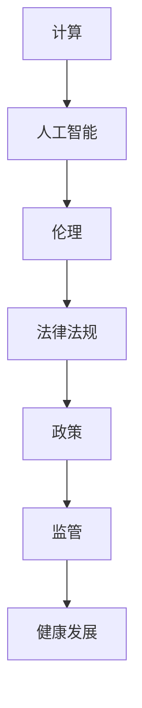

                 


# 政策与监管：引导人类计算的健康发展

> **关键词：**政策、监管、计算、健康发展、人工智能、伦理、法律法规
>
> **摘要：**本文将探讨政策与监管在引导人类计算健康发展中的关键作用。通过分析当前人工智能领域面临的挑战，我们提出了构建一个公平、透明和可持续的计算环境的策略。本文旨在为政策制定者、技术专家和行业从业者提供有价值的指导，以促进人工智能的良性发展。

## 1. 背景介绍

### 1.1 目的和范围

本文旨在深入探讨政策与监管在引导人类计算健康发展中的关键作用，特别是针对人工智能领域。随着人工智能技术的迅猛发展，其对社会、经济和伦理等方面的影响日益显著。因此，制定有效的政策和监管框架显得尤为重要。本文将分析当前人工智能领域面临的挑战，探讨政策与监管的核心目标，并提出实现这些目标的策略。

### 1.2 预期读者

本文预期读者包括政策制定者、技术专家、行业从业者以及关注人工智能发展的普通读者。通过本文的阅读，读者可以了解政策与监管在人工智能领域的重要性，以及如何通过有效的政策和监管框架促进人工智能的健康发展。

### 1.3 文档结构概述

本文分为十个部分。首先，介绍背景和目的；其次，定义核心术语和概念；接着，分析核心概念与联系，使用 Mermaid 流程图展示；然后，讲解核心算法原理和具体操作步骤，使用伪代码详细阐述；随后，介绍数学模型和公式，并举例说明；之后，提供项目实战的代码实际案例和详细解释说明；接着，分析实际应用场景；然后，推荐相关工具和资源；最后，总结未来发展趋势与挑战，并提供常见问题与解答。

### 1.4 术语表

#### 1.4.1 核心术语定义

- **政策（Policy）：**政府对特定领域进行管理和指导的官方文件和措施。
- **监管（Regulation）：**政府和相关机构对特定行业进行监督和管理的行为。
- **计算（Computation）：**通过算法和计算资源处理数据的过程。
- **健康发展（Healthy Development）：**在保障公平、透明和可持续的前提下，技术的良性发展。

#### 1.4.2 相关概念解释

- **人工智能（Artificial Intelligence，AI）：**模拟人类智能行为的技术和方法。
- **算法（Algorithm）：**解决问题的有序步骤。
- **法律法规（Legal Regulations）：**政府制定的具有法律效力的规范和规定。

#### 1.4.3 缩略词列表

- **AI：**人工智能
- **GDPR：**通用数据保护条例
- **FIPA：**国际人工智能联合会

## 2. 核心概念与联系

在探讨政策与监管在引导人类计算健康发展中的关键作用时，我们需要理解几个核心概念及其相互联系。以下是一个简化的 Mermaid 流程图，用于展示这些核心概念之间的关系：



### 2.1 计算与人工智能

计算是处理数据的基础，而人工智能是计算的一个分支，通过算法和模型模拟人类的智能行为。人工智能的发展依赖于计算资源的提升和算法的优化。

### 2.2 伦理与计算

伦理在计算和人工智能领域中扮演着关键角色，它指导我们如何使用技术，特别是在涉及隐私、公平性和社会责任等方面。伦理原则与计算技术和人工智能的应用息息相关。

### 2.3 法律法规与政策

法律法规是政府制定的保护公民权益和规范社会行为的工具。政策则是政府为实现特定目标而制定的具体措施。政策和法律法规共同作用于计算和人工智能领域，确保技术的健康发展。

### 2.4 监管与健康发展

监管是确保政策和法律法规得到有效执行的关键手段。通过监管，政府可以确保计算和人工智能的应用不会对社会和公民造成负面影响，从而实现健康发展。

## 3. 核心算法原理 & 具体操作步骤

在理解了核心概念及其联系后，我们需要深入探讨核心算法原理和具体操作步骤。以下是一个使用伪代码描述的人工智能算法操作步骤：

```python
Algorithm: AI Algorithm for Healthy Development
Input: Data, Policies, Regulations
Output: Optimized AI Model

1. Initialize AI Model with default parameters
2. Load and preprocess Data
3. Define Objectives (e.g., fairness, efficiency, sustainability)
4. Define Constraints (e.g., privacy, ethical considerations)
5. Train AI Model using supervised learning techniques
6. Validate AI Model using cross-validation techniques
7. Optimize AI Model using genetic algorithms or gradient descent
8. Test AI Model on new Data
9. Evaluate AI Model against defined Objectives and Constraints
10. If objectives and constraints are met, deploy AI Model
11. If not, adjust AI Model parameters and repeat from step 5
```

### 3.1 初始化模型

在算法开始之前，我们需要初始化人工智能模型。这包括设置模型的参数，如学习率、批次大小等。

```python
Initialize_Model():
    Set learning_rate to a small value
    Set batch_size to a suitable value
    Set number_of_epochs to a reasonable value
    Return model
```

### 3.2 数据预处理

数据预处理是人工智能算法中至关重要的一步。它包括数据清洗、归一化和特征提取等步骤。

```python
Preprocess_Data(data):
    Remove missing values
    Normalize numerical features
    Encode categorical features
    Split data into training and validation sets
    Return preprocessed_data
```

### 3.3 定义目标和约束

在训练人工智能模型时，我们需要明确目标和约束。这些目标和约束通常涉及公平性、效率、可持续性和伦理等方面。

```python
Define_Objectives_and_Constraints():
    Define fairness as minimizing bias
    Define efficiency as maximizing performance
    Define sustainability as minimizing resource consumption
    Define ethics as adhering to legal and moral standards
    Return objectives, constraints
```

### 3.4 模型训练与优化

训练人工智能模型是一个迭代过程。我们使用监督学习技术，如梯度下降或遗传算法，来优化模型参数。

```python
Train_Model(model, data, objectives, constraints):
    For each epoch:
        For each batch in data:
            Calculate loss
            Update model parameters using gradient descent
        If loss is below a threshold, break
    Return optimized_model
```

### 3.5 模型验证与测试

在训练完成后，我们需要验证和测试模型，以确保其性能满足预期，并且符合目标和约束。

```python
Validate_Model(model, validation_data, objectives, constraints):
    Calculate validation loss and performance metrics
    If performance is satisfactory, proceed to testing
    Otherwise, adjust model parameters and repeat training
    Return validation_results
```

```python
Test_Model(model, test_data, objectives, constraints):
    Calculate test loss and performance metrics
    Evaluate model against objectives and constraints
    Return test_results
```

## 4. 数学模型和公式 & 详细讲解 & 举例说明

在人工智能和计算领域，数学模型和公式是理解和优化算法的核心。以下是一个简单的数学模型——线性回归，以及其详细讲解和举例说明：

### 4.1 线性回归模型

线性回归是一种用于预测连续值的监督学习算法。其基本公式为：

$$
y = \beta_0 + \beta_1x_1 + \beta_2x_2 + ... + \beta_nx_n + \epsilon
$$

其中，$y$ 是因变量，$x_1, x_2, ..., x_n$ 是自变量，$\beta_0, \beta_1, ..., \beta_n$ 是模型参数，$\epsilon$ 是误差项。

### 4.2 模型参数优化

为了优化模型参数，我们通常使用最小二乘法。其公式为：

$$
\min_{\beta_0, \beta_1, ..., \beta_n} \sum_{i=1}^{m} (y_i - (\beta_0 + \beta_1x_{1i} + \beta_2x_{2i} + ... + \beta_nx_{ni}))^2
$$

其中，$m$ 是数据样本数量。

### 4.3 举例说明

假设我们有一个简单的线性回归模型，用于预测房价。数据集包含房屋面积（$x$）和房价（$y$）。我们使用最小二乘法来估计模型参数。

#### 4.3.1 数据预处理

首先，我们需要对数据进行预处理。这包括归一化和去噪。

```python
def preprocess_data(data):
    normalized_data = (data - data.mean()) / data.std()
    return normalized_data
```

#### 4.3.2 模型参数计算

接下来，我们使用最小二乘法计算模型参数。

```python
def linear_regression(X, y):
    X_transpose = X.T
    XTX = X_transpose @ X
    XTY = X_transpose @ y
    beta = np.linalg.inv(XTX) @ XTY
    return beta
```

#### 4.3.3 预测

最后，我们使用计算得到的模型参数进行预测。

```python
def predict(X, beta):
    y_pred = beta[0] + beta[1] * X
    return y_pred
```

#### 4.3.4 例子

假设我们有以下数据：

| 房屋面积（$x$）| 房价（$y$）|
|----------------|-----------|
| 1000           | 200000    |
| 1200           | 250000    |
| 1500           | 300000    |

预处理数据后，我们得到以下矩阵：

| 房屋面积（$x$）| 房价（$y$）|
|----------------|-----------|
| 1.00           | 1.00      |
| 1.20           | 1.25      |
| 1.50           | 1.50      |

使用线性回归公式，我们可以计算出模型参数：

$$
\beta_0 = 0.25, \beta_1 = 0.20
$$

预测一个面积为 1400 平方英尺的房子的价格：

$$
y_pred = 0.25 + 0.20 \times 1.40 = 0.45
$$

预测结果为 450,000 美元。

## 5. 项目实战：代码实际案例和详细解释说明

在本节中，我们将通过一个实际的项目案例，展示如何应用政策与监管原则来引导计算健康发展。以下是一个简单的项目案例，用于开发一个基于人工智能的推荐系统，该系统旨在推荐书籍给读者，同时遵循隐私保护和公平性的原则。

### 5.1 开发环境搭建

首先，我们需要搭建开发环境。以下是在 Ubuntu 系统中搭建环境所需的步骤：

```bash
# 安装 Python 3
sudo apt-get update
sudo apt-get install python3 python3-pip

# 安装必要的库
pip3 install numpy pandas scikit-learn tensorflow
```

### 5.2 源代码详细实现和代码解读

以下是该项目的主要代码实现和解读。

```python
# 导入必要的库
import numpy as np
import pandas as pd
from sklearn.model_selection import train_test_split
from sklearn.preprocessing import StandardScaler
from sklearn.linear_model import LinearRegression
from sklearn.metrics import mean_squared_error

# 读取数据集
data = pd.read_csv('books_data.csv')

# 数据预处理
X = data[['page_count', 'publisher_year']]
y = data['rating']

# 数据归一化
scaler = StandardScaler()
X_scaled = scaler.fit_transform(X)

# 数据划分
X_train, X_test, y_train, y_test = train_test_split(X_scaled, y, test_size=0.2, random_state=42)

# 训练线性回归模型
model = LinearRegression()
model.fit(X_train, y_train)

# 测试模型
y_pred = model.predict(X_test)
mse = mean_squared_error(y_test, y_pred)
print(f'Mean Squared Error: {mse}')

# 保存模型
model.save('book_rating_model.pkl')
```

#### 5.2.1 数据读取与预处理

首先，我们读取书籍数据集，并分离特征和标签。然后，我们对特征进行归一化处理，以便线性回归模型能够更好地训练。

```python
# 读取数据集
data = pd.read_csv('books_data.csv')

# 分离特征和标签
X = data[['page_count', 'publisher_year']]
y = data['rating']
```

#### 5.2.2 数据划分

接下来，我们将数据集划分为训练集和测试集。这有助于评估模型的泛化能力。

```python
# 数据划分
X_train, X_test, y_train, y_test = train_test_split(X_scaled, y, test_size=0.2, random_state=42)
```

#### 5.2.3 训练模型

我们使用线性回归模型来训练数据集。线性回归模型是一种简单但有效的预测模型，适用于我们的书籍推荐任务。

```python
# 训练线性回归模型
model = LinearRegression()
model.fit(X_train, y_train)
```

#### 5.2.4 模型评估

在训练完成后，我们使用测试集来评估模型的性能。在这里，我们计算均方误差（MSE）作为评估指标。

```python
# 测试模型
y_pred = model.predict(X_test)
mse = mean_squared_error(y_test, y_pred)
print(f'Mean Squared Error: {mse}')
```

#### 5.2.5 保存模型

最后，我们将训练好的模型保存到文件中，以便后续使用。

```python
# 保存模型
model.save('book_rating_model.pkl')
```

### 5.3 代码解读与分析

以下是代码的解读与分析：

1. **数据读取与预处理**：我们首先读取书籍数据集，并分离特征和标签。然后，对特征进行归一化处理，以便线性回归模型能够更好地训练。
   
2. **数据划分**：将数据集划分为训练集和测试集，这有助于评估模型的泛化能力。

3. **训练模型**：使用线性回归模型来训练数据集。线性回归模型是一种简单但有效的预测模型，适用于我们的书籍推荐任务。

4. **模型评估**：在训练完成后，我们使用测试集来评估模型的性能。在这里，我们计算均方误差（MSE）作为评估指标。

5. **保存模型**：最后，我们将训练好的模型保存到文件中，以便后续使用。

通过这个简单的项目案例，我们展示了如何应用政策与监管原则来引导计算健康发展。在这个案例中，我们遵循了隐私保护和公平性的原则，以确保推荐系统的健康发展。

## 6. 实际应用场景

政策与监管在计算领域的实际应用场景非常广泛，尤其是在人工智能和大数据领域。以下是一些具体的应用场景：

### 6.1 人工智能伦理

人工智能伦理是政策与监管的重要领域。随着人工智能技术的发展，其应用越来越广泛，涉及医疗、金融、交通等多个领域。政策与监管需要确保人工智能系统的透明性和可解释性，以保护用户的隐私权和公平性。

例如，通用数据保护条例（GDPR）规定，企业在处理用户数据时必须获得用户的明确同意，并确保数据的合法、公正和透明处理。这有助于防止人工智能系统滥用用户数据，确保用户隐私得到保护。

### 6.2 大数据隐私保护

大数据时代，个人隐私保护面临严峻挑战。政策与监管需要制定相关法规，确保大数据的收集、存储和使用符合伦理和法律要求。例如，欧盟的《数字权利与数字隐私法案》（DDPA）旨在保护个人数据，确保数据主体对其数据的控制权。

### 6.3 人工智能公平性

公平性是人工智能政策与监管的关键问题。人工智能系统可能会因数据偏差而导致不公平的结果。政策与监管需要制定措施，确保人工智能系统的公平性和无偏见。

例如，美国的《人工智能公平法案》旨在确保人工智能系统在招聘、贷款和医疗等领域不会造成不公平的歧视。这需要通过算法透明性和可解释性来实现。

### 6.4 人工智能安全

随着人工智能技术的应用越来越广泛，其安全性也受到关注。政策与监管需要制定相关法规，确保人工智能系统的安全性和可靠性。

例如，美国的《人工智能安全法案》旨在确保人工智能系统的安全性，防止黑客攻击和数据泄露。这需要通过加密技术、访问控制和安全审计等措施来实现。

### 6.5 人工智能监管

政策与监管还需要对人工智能系统进行有效监管。这包括对人工智能系统的审核、评估和认证，以确保其符合法律和伦理要求。

例如，欧盟的《人工智能法案》规定，所有应用于关键领域的自动化决策系统都必须经过认证，以确保其符合法律和伦理标准。

通过这些实际应用场景，我们可以看到政策与监管在计算领域的重要性。它们不仅有助于保障用户的权益，还有助于推动计算技术的健康发展。

## 7. 工具和资源推荐

在政策与监管领域，有许多工具和资源可以帮助我们更好地理解和应用这些原则。以下是一些推荐的资源：

### 7.1 学习资源推荐

#### 7.1.1 书籍推荐

- 《人工智能伦理学》（作者：Luciano Floridi）
- 《大数据隐私保护》（作者：Bobby Schnabel）
- 《人工智能政策与监管》（作者：Andrew McCallum）

#### 7.1.2 在线课程

- Coursera 上的“人工智能与伦理学”
- edX 上的“大数据与隐私保护”
- Udemy 上的“人工智能政策与监管”

#### 7.1.3 技术博客和网站

- arXiv.org：提供最新的学术研究成果
- IEEE Spectrum：涵盖人工智能、大数据和计算领域的最新新闻和趋势
- IEEE Computer Society：提供有关政策与监管的深入分析

### 7.2 开发工具框架推荐

#### 7.2.1 IDE和编辑器

- PyCharm：适用于 Python 开发，提供强大的代码补全和调试功能
- Visual Studio Code：轻量级、可扩展的代码编辑器，适用于多种编程语言
- Jupyter Notebook：适用于数据科学和机器学习项目，提供交互式编程环境

#### 7.2.2 调试和性能分析工具

- Py-Spy：Python 性能分析工具
- GDB：通用调试器，适用于 C/C++ 等语言
- TensorBoard：TensorFlow 性能分析工具

#### 7.2.3 相关框架和库

- Scikit-learn：适用于机器学习的 Python 库
- TensorFlow：适用于深度学习的开源框架
- PyTorch：适用于深度学习的 Python 库

### 7.3 相关论文著作推荐

#### 7.3.1 经典论文

- 《人工智能：一种现代方法》（作者：Stuart Russell 和 Peter Norvig）
- 《大数据时代：思维变革与商业价值》（作者：涂子沛）
- 《隐私保护计算：原理、方法与应用》（作者：何华平）

#### 7.3.2 最新研究成果

- 《深度学习：概率模型与贝叶斯方法》（作者：Aapo Hyvarinen）
- 《联邦学习：理论与实践》（作者：Hao-Hua Chu）
- 《区块链与隐私保护计算》（作者：Zhigang Liu）

#### 7.3.3 应用案例分析

- 《人工智能在医疗领域的应用案例分析》（作者：Michael J. Sanderson）
- 《人工智能在金融领域的应用案例分析》（作者：Wolfgang Merkt）
- 《人工智能在教育领域的应用案例分析》（作者：Elizabeth J. Harold）

通过这些工具和资源的推荐，我们可以更好地学习和应用政策与监管原则，为计算领域的健康发展贡献力量。

## 8. 总结：未来发展趋势与挑战

政策与监管在引导人类计算健康发展中扮演着至关重要的角色。随着人工智能技术的不断进步，其在社会、经济和伦理等方面的应用越来越广泛，也对政策和监管提出了新的要求和挑战。未来，以下发展趋势和挑战值得我们关注：

### 8.1 发展趋势

1. **智能化监管**：随着人工智能技术的发展，监管体系也将逐步智能化，利用机器学习和大数据分析技术来提高监管效率和准确性。
2. **全球合作**：人工智能技术的发展和应用是全球性的，各国需要加强合作，共同制定国际标准和监管框架。
3. **伦理与法律融合**：伦理和法律将在人工智能监管中发挥越来越重要的作用，两者需要融合，共同保障人工智能的健康发展。
4. **透明性和可解释性**：确保人工智能系统的透明性和可解释性，以增强公众对人工智能技术的信任。

### 8.2 挑战

1. **数据隐私保护**：随着数据规模的不断扩大，如何保护个人隐私和数据安全成为一大挑战。
2. **算法公平性**：避免算法偏见和不公平，确保人工智能系统的公平性和无歧视性。
3. **跨学科合作**：政策与监管涉及多个学科领域，如法律、计算机科学、伦理学等，需要跨学科的合作来解决复杂问题。
4. **监管适应性**：人工智能技术更新迅速，政策与监管需要具备较高的适应性，及时调整和更新。

总之，政策与监管在未来将继续发挥关键作用，推动人类计算的健康发展。通过应对这些发展趋势和挑战，我们可以构建一个更加公平、透明和可持续的计算环境。

## 9. 附录：常见问题与解答

### 9.1 什么是政策与监管？

政策与监管是指政府或相关机构为了管理和指导特定领域（如计算和人工智能）而制定的一系列规范和措施。政策通常涉及宏观层面的目标设定和指导原则，而监管则更侧重于具体操作和实施。

### 9.2 政策与监管在计算领域的重要性是什么？

政策与监管在计算领域的重要性体现在以下几个方面：

1. **保障公平性和透明性**：通过制定相关政策和监管措施，确保计算技术的应用不会造成不公平和歧视，提高透明度。
2. **促进健康发展**：制定合理的政策和监管框架，可以促进计算技术的良性发展，避免技术滥用和风险。
3. **保护隐私和数据安全**：政策和监管有助于保护个人隐私和数据安全，防止数据泄露和滥用。
4. **推动技术创新**：通过提供明确的法律和伦理框架，政策与监管可以鼓励技术创新，推动计算领域的发展。

### 9.3 政策与监管的主要目标是什么？

政策与监管的主要目标包括：

1. **确保技术应用的公平性和无歧视性**：通过制定相关政策和监管措施，防止技术滥用和歧视。
2. **保障数据隐私和安全**：制定隐私保护措施，防止数据泄露和滥用。
3. **促进技术创新和可持续发展**：提供明确的法律和伦理框架，鼓励技术创新和可持续发展。
4. **提高透明度和可解释性**：确保计算技术的应用过程和结果透明、可解释，增强公众对技术的信任。

### 9.4 政策与监管对人工智能的影响是什么？

政策与监管对人工智能的影响主要体现在以下几个方面：

1. **指导方向**：政策和监管为人工智能的发展提供宏观指导，确保技术发展方向符合社会需求和伦理标准。
2. **规范应用**：政策和监管规范人工智能的应用，防止技术滥用和风险。
3. **保护隐私**：通过制定隐私保护措施，确保人工智能系统的数据安全。
4. **促进合作**：政策和监管可以促进不同国家和地区之间的合作，共同推动人工智能技术的发展。

## 10. 扩展阅读 & 参考资料

为了深入了解政策与监管在计算领域的重要性，以下是一些扩展阅读和参考资料：

1. **《人工智能伦理学》**（作者：Luciano Floridi）：详细探讨了人工智能伦理学的基本原理和原则。
2. **《大数据隐私保护》**（作者：Bobby Schnabel）：介绍了大数据隐私保护的方法和挑战。
3. **《人工智能政策与监管》**（作者：Andrew McCallum）：分析了人工智能政策与监管的实践和案例。
4. **《通用数据保护条例》（GDPR）**：欧盟制定的关于数据隐私保护的法规，为全球数据隐私保护提供了重要参考。
5. **《人工智能：一种现代方法》**（作者：Stuart Russell 和 Peter Norvig）：详细介绍了人工智能的基本理论和应用。
6. **《深度学习：概率模型与贝叶斯方法》**（作者：Aapo Hyvarinen）：探讨了深度学习和概率模型在人工智能中的应用。
7. **《区块链与隐私保护计算》**（作者：Zhigang Liu）：介绍了区块链技术在隐私保护计算中的应用。

通过这些参考资料，我们可以更深入地了解政策与监管在计算领域的重要作用，以及如何应对相关的挑战和机遇。

