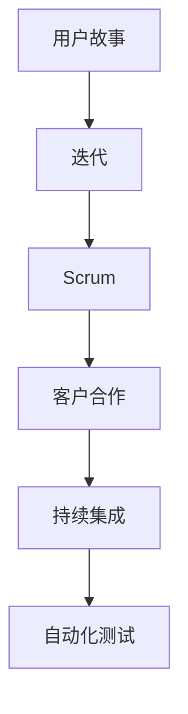

                 

# 敏捷开发的原则与实践分享

## 关键词
敏捷开发，Scrum，迭代，用户故事，团队协作，持续集成，自动化测试

## 摘要
本文将深入探讨敏捷开发的原则和实践，旨在帮助读者理解敏捷开发的核心思想，掌握敏捷开发的方法和技巧。文章分为十个部分，首先介绍了敏捷开发的背景和目的，随后详细解析了敏捷开发的核心概念和算法原理，并通过实例讲解了敏捷开发在实际项目中的应用。此外，文章还推荐了相关的学习资源和开发工具，并总结了敏捷开发的发展趋势和挑战。

## 1. 背景介绍

### 1.1 目的和范围
敏捷开发是一种应对快速变化的需求的软件开发能力。本文旨在探讨敏捷开发的原则和实践，帮助开发人员理解敏捷开发的核心理念，掌握敏捷开发的实践方法，以提高软件开发的效率和质量。

### 1.2 预期读者
本文适合软件开发人员、项目经理、敏捷教练以及对敏捷开发感兴趣的技术人员阅读。

### 1.3 文档结构概述
本文分为十个部分：背景介绍、核心概念与联系、核心算法原理与操作步骤、数学模型与公式、项目实战、实际应用场景、工具和资源推荐、总结、附录和扩展阅读。通过这些部分的详细讲解，读者可以全面了解敏捷开发。

### 1.4 术语表

#### 1.4.1 核心术语定义
- 敏捷开发（Agile Development）：一种以人为核心、迭代、循序渐进的开发方法。
- 用户故事（User Story）：用户故事的表述形式通常为：“作为XX，我需要XX，以便XX。”
- Scrum：一种敏捷开发的方法论。
- 持续集成（Continuous Integration）：持续集成是一种软件开发实践，旨在通过频繁地将代码集成到共享的主分支中，以快速发现并修复集成问题。
- 自动化测试（Automated Testing）：自动化测试是一种通过编写测试脚本自动执行测试的方法，以提高测试效率和准确性。

#### 1.4.2 相关概念解释
- 迭代（Iteration）：迭代是一种软件开发周期，通常包括需求分析、设计、编码、测试和部署等阶段。
- 精益（Lean）：精益是一种管理理念，强调减少浪费、提高效率。
- 客户合作（Customer Collaboration）：客户合作是一种与客户保持紧密沟通，确保软件满足客户需求的实践。

#### 1.4.3 缩略词列表
- Scrum：Sprint，故事（Story），冲刺（Sprint），站会（Daily Stand-up）
- 敏捷（Agile）：敏捷开发（Agile Development），敏捷方法（Agile Methodology）

## 2. 核心概念与联系

敏捷开发的核心概念包括用户故事、迭代、Scrum等。以下是一个简化的Mermaid流程图，展示这些概念之间的关系：



用户故事是敏捷开发的基础，它描述了用户的需求。迭代是敏捷开发的核心周期，通过不断迭代，开发团队能够快速响应变化。Scrum是一种敏捷方法论，它提供了具体的实践指南。客户合作、持续集成和自动化测试是敏捷开发的三大支柱，确保了软件的高质量和高效开发。

## 3. 核心算法原理与具体操作步骤

敏捷开发没有固定的算法，但有一些核心原则和实践可以遵循。以下是敏捷开发的核心步骤和原则的伪代码：

```plaintext
开始

1. 确定用户需求，编写用户故事
2. 将用户故事分解为迭代
3. 每个迭代包括需求分析、设计、编码、测试和部署
4. 持续集成和自动化测试
5. 迭代结束后，评估并调整计划

重复步骤3-5，直到所有用户故事完成

结束
```

### 3.1 用户故事编写

用户故事的表述形式通常为：“作为XX，我需要XX，以便XX。”例如：“作为用户，我需要查看我的购物车中的商品，以便我可以下单购买。”

### 3.2 迭代计划

在迭代开始前，开发团队需要确定本次迭代的目标和任务。以下是一个简化的迭代计划伪代码：

```plaintext
开始

1. 确定迭代时间（通常为2-4周）
2. 根据用户故事优先级，选择本次迭代要完成的用户故事
3. 将用户故事分解为任务
4. 分配任务给团队成员
5. 设定每日站会时间，以确保团队进展顺利

重复步骤3-5，直到迭代结束

结束
```

### 3.3 持续集成和自动化测试

持续集成是一种软件开发实践，通过频繁地将代码集成到共享的主分支中，以快速发现并修复集成问题。自动化测试是一种通过编写测试脚本自动执行测试的方法，以提高测试效率和准确性。

以下是持续集成和自动化测试的简化伪代码：

```plaintext
开始

1. 每次提交代码时，自动运行测试脚本
2. 如果测试失败，暂停集成并修复问题
3. 测试通过后，合并代码到主分支

重复步骤1-3，直到所有代码都经过测试

结束
```

## 4. 数学模型和公式及详细讲解与举例说明

敏捷开发中并没有复杂的数学模型和公式，但有一些简单的数学概念可以帮助理解敏捷开发的效率和质量。以下是几个常用的数学概念和它们的简单解释：

### 4.1 速率（Velocity）

速率是衡量开发团队在每次迭代中能够完成的工作量的指标。速率的计算公式为：

$$
速率 = 完成的用户故事数量
$$

### 4.2 完成百分比

完成百分比是衡量项目进展情况的指标。完成百分比的计算公式为：

$$
完成百分比 = (已完成的用户故事数量 / 总用户故事数量) \times 100\%
$$

### 4.3 交货期（Lead Time）

交货期是从用户提出需求到交付最终产品的总时间。交货期的计算公式为：

$$
交货期 = 开发周期 + 测试周期 + 部署周期
$$

### 4.4 示例

假设一个开发团队在一个迭代中完成了2个用户故事，总共有5个用户故事。那么，速率和完成百分比如下：

$$
速率 = 2
$$

$$
完成百分比 = (2 / 5) \times 100\% = 40\%
$$

如果开发周期为2周，测试周期为1周，部署周期为1周，那么交货期为4周。

## 5. 项目实战：代码实际案例和详细解释说明

### 5.1 开发环境搭建

在本案例中，我们将使用Python进行敏捷开发，并使用Git进行版本控制。以下是开发环境的搭建步骤：

1. 安装Python：从[Python官网](https://www.python.org/)下载并安装Python。
2. 安装Git：从[Git官网](https://git-scm.com/)下载并安装Git。
3. 创建一个新项目文件夹，并初始化Git仓库：
   ```bash
   mkdir agile_project
   cd agile_project
   git init
   ```

### 5.2 源代码详细实现和代码解读

以下是一个简单的用户故事：“作为用户，我需要添加商品到购物车，以便我可以购买商品。”以下是这个用户故事的代码实现：

```python
# agile_project/repository.py

class Repository:
    def __init__(self):
        self.shopping_cart = []

    def add_to_cart(self, item):
        self.shopping_cart.append(item)
        print(f"{item} has been added to the shopping cart.")

    def show_cart(self):
        print("Your shopping cart:")
        for item in self.shopping_cart:
            print(item)
```

代码解读：

- `Repository` 类：代表购物车仓库。
- `__init__` 方法：初始化购物车。
- `add_to_cart` 方法：将商品添加到购物车。
- `show_cart` 方法：显示购物车中的商品。

### 5.3 代码解读与分析

这个简单的代码示例展示了如何实现一个用户故事。在实际项目中，每个用户故事可能涉及更多的功能和复杂性，但基本的开发流程是相似的。以下是对代码的分析：

- **模块化**：将购物车功能封装在 `Repository` 类中，使得代码易于维护和扩展。
- **方法分离**：将添加商品和显示购物车的功能分离，使得代码更清晰，便于理解和测试。
- **用户友好**：通过打印信息与用户交互，使得用户可以直观地了解购物车的状态。

### 5.4 持续集成和自动化测试

为了确保代码的质量，我们可以编写自动化测试来验证 `Repository` 类的功能。以下是使用Python的 `unittest` 库编写的测试用例：

```python
# agile_project/tests/repository_test.py

import unittest
from repository import Repository

class TestRepository(unittest.TestCase):
    def test_add_to_cart(self):
        repo = Repository()
        repo.add_to_cart("Book")
        self.assertIn("Book", repo.shopping_cart)

    def test_show_cart(self):
        repo = Repository()
        repo.add_to_cart("Pen")
        repo.add_to_cart("Notebook")
        repo.show_cart()
        self.assertIn("Pen", repo.shopping_cart)
        self.assertIn("Notebook", repo.shopping_cart)

if __name__ == '__main__':
    unittest.main()
```

测试解读：

- `TestRepository` 类：包含测试方法的测试类。
- `test_add_to_cart` 方法：测试添加商品到购物车的功能。
- `test_show_cart` 方法：测试显示购物车的功能。

通过这些测试，我们可以确保 `Repository` 类的功能按照预期工作。

## 6. 实际应用场景

敏捷开发适用于多种场景，包括：

- **需求变化频繁**：例如互联网应用开发，客户需求变化快，敏捷开发能够快速响应。
- **项目周期短**：例如创业公司，需要快速发布产品，以获取用户反馈。
- **团队协作**：敏捷开发强调团队协作，适用于跨职能团队。

以下是一个实际应用场景：

**场景**：一个电商平台的购物车功能开发。

**步骤**：

1. **需求分析**：确定购物车的基本功能，如添加商品、显示商品、删除商品等。
2. **用户故事编写**：根据需求编写用户故事，如“用户可以添加商品到购物车”、“用户可以查看购物车中的商品”等。
3. **迭代计划**：将用户故事分解为迭代，每个迭代完成一部分功能。
4. **开发与测试**：按照迭代计划进行开发，编写测试用例确保功能正确。
5. **客户反馈**：发布部分功能，收集客户反馈，进行迭代优化。

## 7. 工具和资源推荐

### 7.1 学习资源推荐

#### 7.1.1 书籍推荐

- 《敏捷开发实践指南》（Agile Project Guide）
- 《用户故事地图》（User Story Mapping）

#### 7.1.2 在线课程

- Coursera上的《敏捷软件开发》（Agile Software Development）
- Udemy上的《Scrum Master Certification》

#### 7.1.3 技术博客和网站

- Agile Alliance（https://www.agilealliance.org/）
- Atlassian Agile博客（https://www.atlassian.com/agile）

### 7.2 开发工具框架推荐

#### 7.2.1 IDE和编辑器

- Visual Studio Code
- IntelliJ IDEA

#### 7.2.2 调试和性能分析工具

- PyCharm
- Postman

#### 7.2.3 相关框架和库

- Flask
- Django

### 7.3 相关论文著作推荐

#### 7.3.1 经典论文

- 《敏捷软件开发宣言》（Manifesto for Agile Software Development）

#### 7.3.2 最新研究成果

- 《敏捷开发实践与案例分析》（Agile Development: Principles, Patterns, and Practices）

#### 7.3.3 应用案例分析

- 《敏捷开发在中国企业的实践》（Agile Development in Chinese Enterprises）

## 8. 总结：未来发展趋势与挑战

### 8.1 发展趋势

- **智能化**：敏捷开发将更加智能化，利用人工智能技术优化迭代计划和资源分配。
- **平台化**：敏捷开发将逐渐向平台化方向发展，提供一体化的敏捷开发工具和服务。
- **跨领域融合**：敏捷开发将与其他领域（如物联网、大数据等）相结合，产生新的应用场景。

### 8.2 挑战

- **文化变革**：敏捷开发需要组织文化从传统的命令和控制转向更加协作和自组织。
- **技能提升**：开发人员需要不断提升技能，以适应敏捷开发的快速变化。
- **工具整合**：如何有效地整合各种敏捷开发工具，提高开发效率，是一个重要挑战。

## 9. 附录：常见问题与解答

### 9.1 敏捷开发与传统开发的主要区别是什么？

- **重点不同**：传统开发更注重计划和文档，敏捷开发更注重实践和用户反馈。
- **团队角色**：传统开发通常有明确的角色分工，敏捷开发强调跨职能团队。
- **需求管理**：传统开发需求相对固定，敏捷开发需求可以随时调整。

### 9.2 如何在敏捷开发中管理需求？

- **用户故事**：使用用户故事来明确需求。
- **迭代计划**：根据用户故事优先级，制定迭代计划。
- **客户合作**：保持与客户的紧密沟通，确保需求准确。

## 10. 扩展阅读 & 参考资料

- 《敏捷实践指南》（Agile Practice Guide）
- 《敏捷项目管理》（Agile Project Management）
- 《敏捷转型手册》（Agile Transformation Handbook）

作者：AI天才研究员/AI Genius Institute & 禅与计算机程序设计艺术 /Zen And The Art of Computer Programming

