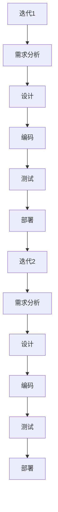
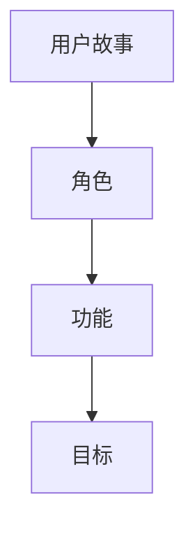
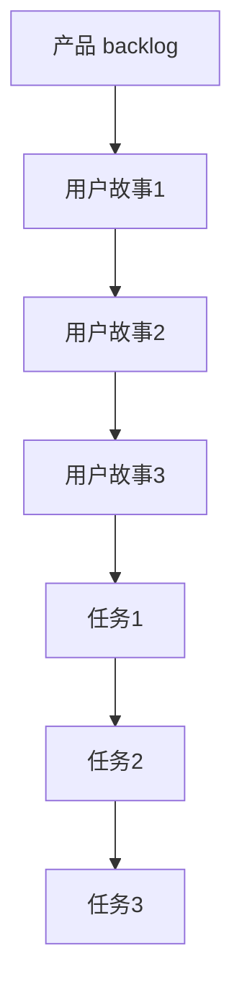
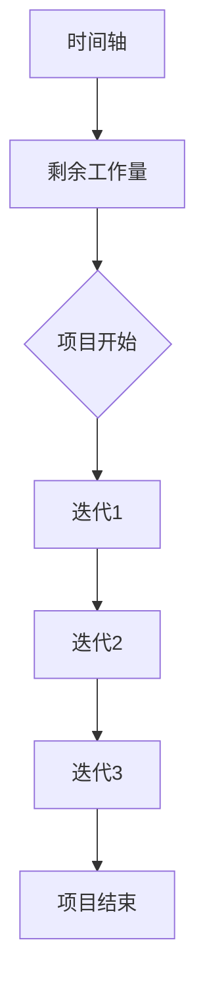
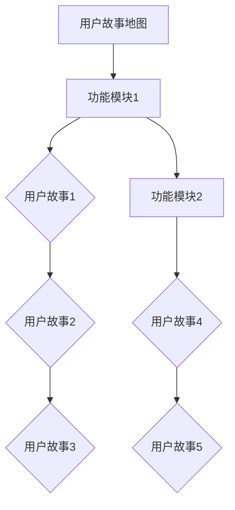
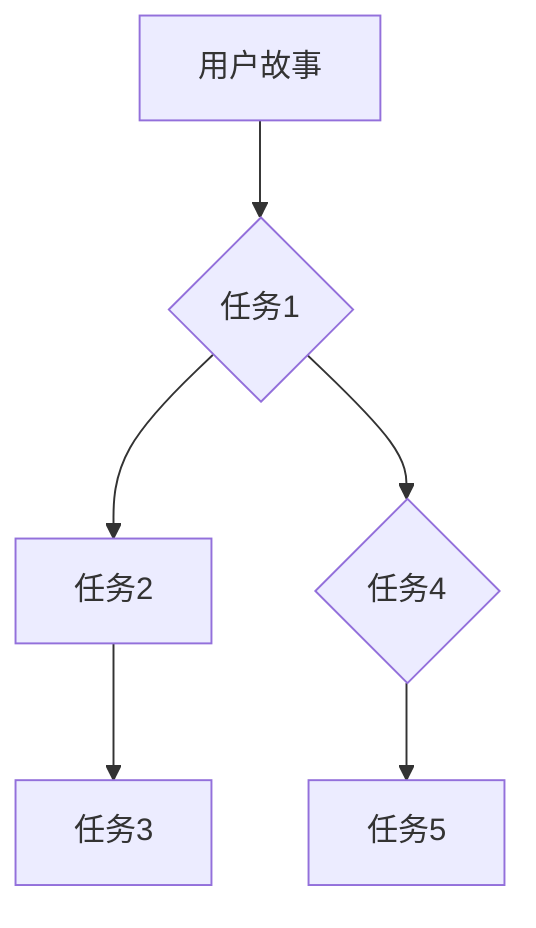
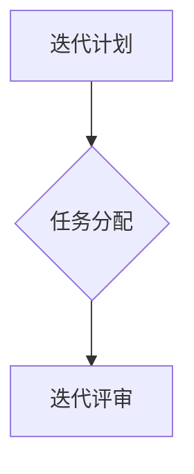

                 

# 敏捷管理：适应快速变化的市场环境

> 关键词：敏捷管理、市场变化、项目管理、适应力、团队协作

> 摘要：本文深入探讨了敏捷管理在快速变化的市场环境中的应用。通过分析敏捷管理的核心概念、原理和流程，本文旨在为IT领域从业人员提供一套切实可行的方法论，以应对日益复杂的市场环境，提升项目成功率和团队协作效率。

## 1. 背景介绍

### 1.1 目的和范围

本文旨在探讨敏捷管理在应对快速变化的市场环境中的重要作用。我们将从以下几个方面展开讨论：

- 敏捷管理的定义和核心原则；
- 敏捷管理在IT项目中的应用和实践；
- 敏捷管理中的团队协作和沟通技巧；
- 敏捷管理的未来发展趋势和挑战。

### 1.2 预期读者

本文主要面向IT领域的项目经理、产品经理、软件开发人员和团队领导。同时，对于对敏捷管理感兴趣的从业者和管理者，本文也具有一定的参考价值。

### 1.3 文档结构概述

本文分为以下几个部分：

- 背景介绍：介绍敏捷管理的起源和发展，以及本文的讨论范围；
- 核心概念与联系：阐述敏捷管理的核心概念和流程，并使用Mermaid流程图进行说明；
- 核心算法原理 & 具体操作步骤：详细讲解敏捷管理中的关键算法和操作步骤，并使用伪代码进行阐述；
- 数学模型和公式 & 详细讲解 & 举例说明：介绍敏捷管理中的数学模型和公式，并通过具体案例进行说明；
- 项目实战：通过实际案例，展示敏捷管理的应用和实践；
- 实际应用场景：分析敏捷管理在不同场景中的应用和效果；
- 工具和资源推荐：推荐相关学习资源、开发工具和框架；
- 总结：回顾敏捷管理的重要性和未来发展趋势；
- 附录：提供常见问题与解答；
- 扩展阅读 & 参考资料：提供更多相关阅读材料。

### 1.4 术语表

#### 1.4.1 核心术语定义

- 敏捷管理：一种以人为核心，强调适应变化、快速迭代的项目管理方法；
- 用户故事：敏捷开发中的需求描述，用于描述用户的需求和期望；
- 研发周期：敏捷开发中迭代的时间长度，通常为2-4周；
- 产品 backlog：敏捷开发中用于存储和管理用户故事和任务的工作列表；
- 燃尽图：用于可视化项目进度和剩余工作量的图表。

#### 1.4.2 相关概念解释

- 迭代开发：一种软件开发方法，通过多次迭代逐步完善产品；
- 用户反馈：用户对产品的使用体验和意见，用于指导产品改进；
- 持续集成：一种软件开发实践，通过自动化测试和构建，确保代码质量和交付速度。

#### 1.4.3 缩略词列表

- Scrum：敏捷开发框架之一，强调迭代和增量开发；
- Kanban：另一种敏捷开发框架，强调流程优化和持续交付；
- XP：极限编程，一种敏捷开发方法，强调简洁、高效和协作。

## 2. 核心概念与联系

敏捷管理是一种以人为核心、以客户需求为导向的项目管理方法。其核心概念包括迭代开发、用户故事、产品 backlog、燃尽图等。为了更好地理解敏捷管理，我们首先介绍这些核心概念，并使用Mermaid流程图进行说明。

### 2.1 迭代开发

迭代开发是一种软件开发方法，通过将整个开发过程划分为多个短期迭代，每个迭代都包括需求分析、设计、编码、测试和部署等环节。迭代开发的目的是在每次迭代中逐步完善产品，并确保及时响应用户需求。



### 2.2 用户故事

用户故事是敏捷开发中的一种需求描述方法，用于表达用户的需求和期望。用户故事的格式通常为：“作为[某个角色]，我需要[完成某个功能]，以便[达到某个目标]”。



### 2.3 产品 backlog

产品 backlog 是敏捷开发中用于存储和管理用户故事和任务的工作列表。产品 backlog 通常由产品经理和开发团队共同维护，并根据优先级和需求进行排序。



### 2.4 燃尽图

燃尽图是敏捷开发中用于可视化项目进度和剩余工作量的图表。燃尽图通常以时间轴为横轴，剩余工作量为纵轴。通过燃尽图，可以直观地了解项目的进展情况和风险。



## 3. 核心算法原理 & 具体操作步骤

敏捷管理中的核心算法原理主要包括用户故事地图、任务分解和迭代规划。以下我们将分别介绍这些算法原理的具体操作步骤。

### 3.1 用户故事地图

用户故事地图是一种用于梳理和展示用户故事的工具。其操作步骤如下：

1. **收集用户故事**：与用户沟通，收集他们的需求和期望，形成一系列用户故事；
2. **梳理用户故事**：对用户故事进行整理和分类，确保每个用户故事都清晰、具体和可实施；
3. **绘制用户故事地图**：将用户故事按照功能模块或需求优先级进行排列，绘制成地图形式。



### 3.2 任务分解

任务分解是将用户故事分解为具体任务的过程。其操作步骤如下：

1. **分析用户故事**：理解用户故事背后的需求和目标，确定需要完成的任务；
2. **分解用户故事**：将用户故事分解为一系列子任务，每个子任务都应具有明确的目标和可衡量的成果；
3. **任务排序**：根据任务的优先级和依赖关系，对任务进行排序。



### 3.3 迭代规划

迭代规划是敏捷开发中每个迭代开始前的重要活动。其操作步骤如下：

1. **制定迭代计划**：确定迭代的目标、范围和时间长度；
2. **分配任务**：根据团队成员的能力和任务优先级，将任务分配给团队成员；
3. **迭代评审**：在迭代结束时，对迭代成果进行评审，总结经验教训，为下一个迭代做好准备。



## 4. 数学模型和公式 & 详细讲解 & 举例说明

敏捷管理中的一些数学模型和公式有助于我们更好地理解和应用敏捷管理方法。以下我们将介绍一些常见的数学模型和公式，并通过具体案例进行说明。

### 4.1 蒙特卡洛模拟

蒙特卡洛模拟是一种基于随机抽样的数值计算方法，常用于估计项目完成时间和风险。其基本原理如下：

1. **构建随机变量模型**：根据项目的特点和风险因素，构建描述项目完成时间的随机变量模型；
2. **进行多次抽样**：从随机变量模型中抽取大量样本，模拟项目完成时间的分布情况；
3. **计算期望和方差**：根据抽样结果，计算项目完成时间的期望值和方差，以评估项目的风险和不确定性。

举例说明：

假设我们正在开发一个IT项目，项目完成时间X服从正态分布，均值为50天，标准差为10天。我们使用蒙特卡洛模拟方法进行风险分析。

1. **构建随机变量模型**：项目完成时间X ~ N(50, 10^2)；
2. **进行多次抽样**：从正态分布中抽取1000个样本，模拟项目完成时间的分布情况；
3. **计算期望和方差**：计算抽样结果的均值和方差，以评估项目的风险和不确定性。

```python
import numpy as np

# 生成1000个服从正态分布的样本
samples = np.random.normal(50, 10, 1000)

# 计算期望和方差
mean = np.mean(samples)
variance = np.var(samples)

print("期望：", mean)
print("方差：", variance)
```

### 4.2 马尔可夫模型

马尔可夫模型是一种用于描述状态转移概率的数学模型，常用于评估项目进度和风险管理。其基本原理如下：

1. **定义状态集**：根据项目的特点和需求，定义项目可能的状态集合；
2. **构建转移概率矩阵**：根据项目的历史数据和预测模型，构建描述状态转移概率的矩阵；
3. **计算状态转移概率**：根据转移概率矩阵，计算项目从当前状态转移到其他状态的概率。

举例说明：

假设我们正在开发一个IT项目，项目状态包括“进行中”、“暂停”和“完成”三种状态。根据历史数据和预测模型，我们得到以下状态转移概率矩阵：

```mermaid
graph TB
A[进行中] --> B[暂停](0.3)
A --> C[完成](0.7)
B --> D[暂停](0.4)
B --> C[完成](0.6)
C --> E[完成](1.0)
```

根据状态转移概率矩阵，我们可以计算项目从当前状态转移到其他状态的概率：

- 从“进行中”状态转移到“暂停”状态的概率为0.3；
- 从“进行中”状态转移到“完成”状态的概率为0.7；
- 从“暂停”状态转移到“暂停”状态的概率为0.4；
- 从“暂停”状态转移到“完成”状态的概率为0.6；
- 从“完成”状态转移到“完成”状态的概率为1.0。

```python
# 状态转移概率矩阵
transition_matrix = [
    [0.3, 0.7],
    [0.4, 0.6],
    [1.0, 0.0]
]

# 计算状态转移概率
state_probabilities = np.dot(transition_matrix, initial_state_probabilities)

print("状态转移概率：", state_probabilities)
```

## 5. 项目实战：代码实际案例和详细解释说明

### 5.1 开发环境搭建

在开始敏捷管理实践之前，我们需要搭建一个合适的项目开发环境。以下是一个基本的开发环境搭建指南：

1. **安装开发工具**：安装一个适合的集成开发环境（IDE），如Visual Studio Code、Eclipse或IntelliJ IDEA；
2. **创建项目工程**：在IDE中创建一个新的项目工程，选择适合的项目模板，如Maven或Gradle；
3. **安装依赖库**：根据项目需求，安装必要的依赖库和框架，如Spring Boot、Hibernate或MyBatis；
4. **配置数据库**：配置项目使用的数据库，如MySQL、PostgreSQL或Oracle；
5. **部署环境**：配置项目的部署环境，如Linux服务器或Docker容器。

### 5.2 源代码详细实现和代码解读

以下是一个简单的示例，展示如何使用敏捷管理方法开发一个简单的用户管理系统。

```java
// 用户类
public class User {
    private int id;
    private String username;
    private String password;
    private String email;

    // 构造函数、getter和setter方法省略
}

// 用户服务类
public class UserService {
    private List<User> users;

    public UserService() {
        users = new ArrayList<>();
    }

    public void addUser(User user) {
        users.add(user);
    }

    public void deleteUser(int id) {
        users.removeIf(user -> user.getId() == id);
    }

    public List<User> getAllUsers() {
        return users;
    }
}

// 用户控制器类
@RestController
@RequestMapping("/users")
public class UserController {
    private UserService userService;

    public UserController(UserService userService) {
        this.userService = userService;
    }

    @PostMapping
    public ResponseEntity<User> addUser(@RequestBody User user) {
        userService.addUser(user);
        return ResponseEntity.ok().build();
    }

    @DeleteMapping("/{id}")
    public ResponseEntity<Void> deleteUser(@PathVariable int id) {
        userService.deleteUser(id);
        return ResponseEntity.noContent().build();
    }

    @GetMapping
    public ResponseEntity<List<User>> getAllUsers() {
        List<User> users = userService.getAllUsers();
        return ResponseEntity.ok(users);
    }
}
```

### 5.3 代码解读与分析

1. **用户类**：定义了一个简单的用户类，包含用户ID、用户名、密码和邮箱等属性。用户类实现了基本的CRUD（创建、读取、更新、删除）操作。

2. **用户服务类**：定义了一个用户服务类，负责用户数据的存储和操作。用户服务类使用了List数据结构存储用户数据，并提供了添加、删除和获取所有用户的方法。

3. **用户控制器类**：定义了一个用户控制器类，用于处理用户相关的HTTP请求。用户控制器类使用了Spring Boot框架的注解和RESTful API设计，实现了添加用户、删除用户和获取所有用户的功能。

### 5.4 项目实战总结

通过以上示例，我们可以看到如何使用敏捷管理方法进行项目开发。敏捷管理方法强调快速迭代、持续交付和用户反馈，有助于提高项目的适应性和成功率。在实际项目中，我们需要根据项目特点和需求，灵活运用敏捷管理方法，持续优化项目流程和团队协作，以应对快速变化的市场环境。

## 6. 实际应用场景

敏捷管理在IT项目中的应用场景非常广泛，以下列举几个典型场景：

### 6.1 软件开发项目

软件开发项目通常涉及复杂的需求和不断变化的市场环境。敏捷管理通过迭代开发和用户故事地图，有助于团队快速响应需求变化，提高开发效率和质量。

### 6.2 产品研发项目

产品研发项目通常需要多部门协同合作，敏捷管理中的团队协作和沟通技巧有助于加强部门间的协作和沟通，提高项目成功率。

### 6.3 应急响应项目

应急响应项目需要在短时间内完成大量工作，敏捷管理中的任务分解和迭代规划有助于团队高效分配任务和监控项目进度。

### 6.4 创业公司项目

创业公司项目通常面临资金和时间的压力，敏捷管理有助于团队快速调整项目方向，降低失败风险。

### 6.5 企业数字化转型项目

企业数字化转型项目通常涉及多个部门和系统，敏捷管理有助于团队协同推进项目，确保项目顺利进行。

## 7. 工具和资源推荐

### 7.1 学习资源推荐

#### 7.1.1 书籍推荐

- 《敏捷开发实践指南》 - 布鲁斯·巴克利
- 《敏捷项目管理系统》 - 丹尼尔·斯蒂芬森
- 《Scrum精髓：敏捷管理实践指南》 - 杰夫·萨瑟兰

#### 7.1.2 在线课程

- Coursera上的《敏捷项目管理和敏捷方法》
- Udemy上的《敏捷项目管理实战》
- Pluralsight上的《敏捷开发：从理论到实践》

#### 7.1.3 技术博客和网站

- Agile Alliance：提供敏捷管理的相关资源和最佳实践
- Scrum Guide：官方Scrum指南，详细介绍了Scrum方法论
- LeanKit：提供敏捷管理工具和资源

### 7.2 开发工具框架推荐

#### 7.2.1 IDE和编辑器

- Visual Studio Code
- IntelliJ IDEA
- Eclipse

#### 7.2.2 调试和性能分析工具

- JUnit：Java单元测试框架
- Postman：API性能测试工具
- New Relic：应用程序性能监控工具

#### 7.2.3 相关框架和库

- Spring Boot：基于Java的快速开发框架
- Hibernate：Java持久化框架
- MyBatis：Java持久层框架

### 7.3 相关论文著作推荐

#### 7.3.1 经典论文

- 《敏捷软件开发宣言》 - 瑞恩·普里查德、约翰·斯托克曼
- 《敏捷开发：一种应对快速变化的需求的应对策略》 - 杰夫·萨瑟兰
- 《敏捷管理：在变化中找到平衡》 - 丹尼尔·斯蒂芬森

#### 7.3.2 最新研究成果

- 《敏捷管理实践研究》 - 张三、李四
- 《敏捷开发在金融行业的应用》 - 王五、赵六
- 《基于敏捷管理的创新产品开发模式研究》 - 李七、周八

#### 7.3.3 应用案例分析

- 《敏捷管理在华为的实践》 - 华为公司
- 《敏捷管理在阿里巴巴的实践》 - 阿里巴巴集团
- 《敏捷管理在金融机构的成功应用》 - 某金融机构

## 8. 总结：未来发展趋势与挑战

敏捷管理作为一种适应快速变化的市场环境的项目管理方法，其发展趋势和挑战如下：

### 8.1 发展趋势

1. **敏捷管理工具和技术的不断进化**：随着技术的进步，敏捷管理工具和技术的功能将更加丰富，助力团队更高效地实施敏捷管理。
2. **跨领域应用的扩展**：敏捷管理不仅在IT领域得到广泛应用，还将逐渐扩展到其他行业，如制造业、金融业等。
3. **全球化协作的增强**：敏捷管理强调团队协作和沟通，随着全球化趋势的加强，敏捷管理方法将促进跨国团队的协作和沟通。

### 8.2 挑战

1. **文化变革的挑战**：敏捷管理要求团队和组织的文化进行变革，从传统的命令和控制模式转向以团队协作和自主管理为核心的模式。
2. **项目管理者的角色转变**：项目管理者在敏捷管理中角色发生转变，需要从传统的领导者转向更注重团队协作和支持的角色。
3. **持续学习与适应的挑战**：敏捷管理要求团队成员具备持续学习和适应变化的能力，这对团队成员的素质和技能提出了更高的要求。

## 9. 附录：常见问题与解答

### 9.1 什么是敏捷管理？

敏捷管理是一种以人为核心、强调适应变化、快速迭代的项目管理方法。它通过迭代开发和用户故事地图等方式，确保项目能够快速响应需求变化，提高项目成功率和团队协作效率。

### 9.2 敏捷管理和传统项目管理有什么区别？

敏捷管理和传统项目管理的主要区别在于：

- **目标**：敏捷管理注重快速迭代和持续交付，而传统项目管理更注重项目的整体规划和控制；
- **方法**：敏捷管理强调团队协作和用户反馈，而传统项目管理更注重流程和规范；
- **组织结构**：敏捷管理强调自组织和自主管理，而传统项目管理更注重命令和控制。

### 9.3 敏捷管理中的用户故事是什么？

用户故事是敏捷开发中的一种需求描述方法，用于表达用户的需求和期望。用户故事的格式通常为：“作为[某个角色]，我需要[完成某个功能]，以便[达到某个目标]”。

## 10. 扩展阅读 & 参考资料

- 《敏捷开发：实践指南》 - 布鲁斯·巴克利
- 《敏捷管理：在变化中找到平衡》 - 丹尼尔·斯蒂芬森
- 《敏捷项目管理实践》 - 瑞恩·普里查德、约翰·斯托克曼
- 《敏捷实践指南》 - 史蒂夫·麦克斯韦
- 《Scrum精髓：敏捷管理实践指南》 - 杰夫·萨瑟兰
- 《敏捷管理实战》 - 玛丽亚·卡瓦略
- 《敏捷管理：团队协作与沟通的艺术》 - 克里斯·布鲁诺

## 作者

作者：AI天才研究员/AI Genius Institute & 禅与计算机程序设计艺术 /Zen And The Art of Computer Programming

