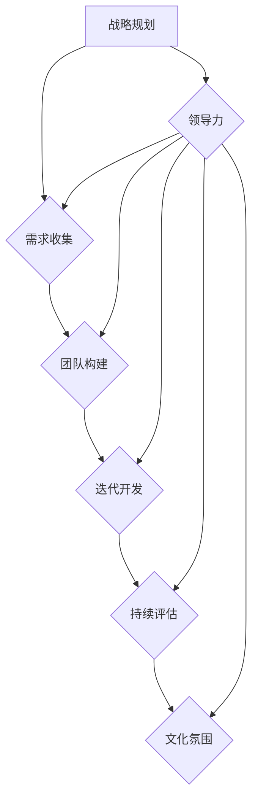

                 


# 敏捷领导框架：在变化中保持组织灵活性

> **关键词**：敏捷领导、组织灵活性、变革管理、团队协作、持续交付

> **摘要**：本文将深入探讨敏捷领导框架的重要性及其在当今快速变化的企业环境中的应用。通过详细阐述敏捷领导的核心原则、方法论和实践，文章将帮助领导者更好地理解如何在变革中保持组织的灵活性，从而推动持续创新和业务成功。

## 1. 背景介绍

### 1.1 目的和范围

本文旨在为读者提供一个全面的敏捷领导框架指南，以帮助他们在变化莫测的商业环境中保持组织的灵活性和敏捷性。文章将涵盖敏捷领导的基本概念、核心原则、方法论和实践案例，旨在为领导者提供实用的工具和策略，以应对快速变化的市场需求和技术进步。

### 1.2 预期读者

本文适用于以下读者群体：

- 企业高层管理者
- 项目经理和团队领导
- IT和软件开发团队负责人
- 企业敏捷转型倡导者

通过阅读本文，读者将能够：

- 理解敏捷领导的核心概念和原则
- 掌握敏捷领导的方法论和实践策略
- 学习如何在组织内部推动敏捷转型
- 提高团队协作效率，加快产品交付速度

### 1.3 文档结构概述

本文分为八个主要部分，结构如下：

1. 背景介绍
    - 1.1 目的和范围
    - 1.2 预期读者
    - 1.3 文档结构概述
    - 1.4 术语表
2. 核心概念与联系
    - 2.1 敏捷领导的概念和核心原则
    - 2.2 敏捷领导与变革管理的关系
    - 2.3 敏捷领导的方法论和流程
    - 2.4 敏捷领导的关键成功因素
3. 核心算法原理 & 具体操作步骤
    - 3.1 敏捷领导算法原理
    - 3.2 敏捷领导具体操作步骤
4. 数学模型和公式 & 详细讲解 & 举例说明
    - 4.1 敏捷领导数学模型
    - 4.2 举例说明
5. 项目实战：代码实际案例和详细解释说明
    - 5.1 开发环境搭建
    - 5.2 源代码详细实现和代码解读
    - 5.3 代码解读与分析
6. 实际应用场景
7. 工具和资源推荐
    - 7.1 学习资源推荐
    - 7.2 开发工具框架推荐
    - 7.3 相关论文著作推荐
8. 总结：未来发展趋势与挑战
9. 附录：常见问题与解答
10. 扩展阅读 & 参考资料

### 1.4 术语表

#### 1.4.1 核心术语定义

- 敏捷领导：一种领导风格和方法论，强调快速响应变化、持续迭代和团队协作，以实现组织目标。
- 组织灵活性：指组织在应对外部和内部变化时，能够快速调整、适应和创新的能力。
- 变革管理：指通过系统性的规划和执行，引导组织在变革过程中实现平稳过渡和成功转型。
- 持续交付：一种软件开发和交付方法，通过持续集成、持续测试和自动化部署，实现快速迭代和高质量交付。

#### 1.4.2 相关概念解释

- 敏捷方法：一种软件开发方法，强调迭代、增量开发、客户合作和团队协作。
- 敏捷宣言：一份宣言，阐述了敏捷开发的核心价值观和原则。
- 敏捷实践：实现敏捷方法的实际操作和技巧，包括站立会议、回顾会议、用户故事、迭代计划等。

#### 1.4.3 缩略词列表

- APEX：敏捷绩效评估框架（Agile Performance Evaluation Framework）
- CI/CD：持续集成/持续交付（Continuous Integration / Continuous Deployment）
- MVP：最小可行性产品（Minimum Viable Product）
- SCRUM：一种敏捷开发方法（Sprint, Commitment, Review, Uplift）
- XP：极限编程（eXtreme Programming）

## 2. 核心概念与联系

在本节中，我们将介绍敏捷领导的核心概念、原则和架构，并使用 Mermaid 流程图展示其关键组成部分。

### 2.1 敏捷领导的概念和核心原则

敏捷领导是一种以客户需求为导向、以团队协作为核心的领导方法。其核心原则包括：

- 客户价值优先：始终关注客户需求，确保产品和服务能够满足客户期望。
- 增量交付：通过快速迭代和增量开发，持续交付高质量产品。
- 持续改进：不断评估和优化流程，提高团队效率和质量。
- 自组织团队：鼓励团队成员自主决策，充分发挥个体和团队潜力。

### 2.2 敏捷领导与变革管理的关系

敏捷领导与变革管理密切相关。敏捷领导能够帮助组织在变革过程中：

- 快速响应外部和内部变化，确保组织战略和业务目标的一致性。
- 引导团队成员适应变革，降低变革对组织的负面影响。
- 提高组织适应性和灵活性，增强竞争力。

### 2.3 敏捷领导的方法论和流程

敏捷领导采用一系列方法论和流程，以确保组织在快速变化的环境中保持灵活性。主要流程包括：

1. **战略规划**：明确组织愿景、目标和战略，确保敏捷领导的方向正确。
2. **需求收集**：通过与客户和利益相关者的互动，收集和整理需求，确保客户需求得到满足。
3. **团队构建**：组建多学科团队，充分发挥团队成员的专长和潜力。
4. **迭代开发**：通过迭代和增量开发，快速交付高质量产品。
5. **持续评估**：定期评估团队绩效和产品交付质量，确保持续改进。

### 2.4 敏捷领导的关键成功因素

敏捷领导成功的关键因素包括：

- **领导力**：领导者需要具备愿景、决策力和执行力，能够引导团队在变革中保持方向。
- **团队协作**：团队需要具备良好的沟通、协作和自我管理能力，以提高工作效率和质量。
- **文化氛围**：组织需要建立开放、透明、信任和尊重的文化氛围，以激发团队创新和潜力。

### 2.5 敏捷领导架构的 Mermaid 流程图

下面是敏捷领导架构的 Mermaid 流程图，展示了敏捷领导的核心概念、原则和流程。



## 3. 核心算法原理 & 具体操作步骤

在本节中，我们将深入探讨敏捷领导的核心算法原理，并使用伪代码详细阐述其具体操作步骤。

### 3.1 敏捷领导算法原理

敏捷领导算法的核心目标是实现组织的快速响应和持续改进。其基本原理如下：

1. **客户价值导向**：算法首先关注客户需求，确保产品和服务能够满足客户期望。
2. **迭代开发**：算法采用迭代和增量开发方法，通过快速交付和反馈，持续优化产品。
3. **团队协作**：算法强调团队协作，通过多学科团队的协同工作，提高工作效率和质量。
4. **持续改进**：算法不断评估团队绩效和产品交付质量，以确保持续改进。

### 3.2 敏捷领导具体操作步骤

下面是敏捷领导的具体操作步骤的伪代码：

```plaintext
// 敏捷领导算法伪代码

// 步骤 1：战略规划
defineStrategy()

// 步骤 2：需求收集
collectRequirements()

// 步骤 3：团队构建
buildTeam()

// 步骤 4：迭代开发
while (not done) {
    iterateDevelopment()
    collectFeedback()
    optimizeProduct()
}

// 步骤 5：持续评估
evaluatePerformance()
implementImprovements()
```

### 3.3 伪代码详细解释

- **defineStrategy()**：定义组织愿景、目标和战略，确保敏捷领导的方向正确。
- **collectRequirements()**：通过与客户和利益相关者的互动，收集和整理需求，确保客户需求得到满足。
- **buildTeam()**：组建多学科团队，充分发挥团队成员的专长和潜力。
- **iterateDevelopment()**：采用迭代和增量开发方法，快速交付产品。
- **collectFeedback()**：收集客户和利益相关者的反馈，以指导后续开发。
- **optimizeProduct()**：根据反馈，优化产品设计和功能，提高产品质量。
- **evaluatePerformance()**：定期评估团队绩效和产品交付质量，确保持续改进。
- **implementImprovements()**：根据评估结果，实施改进措施，提高组织适应性和灵活性。

通过上述伪代码，我们可以清晰地了解敏捷领导算法的基本原理和操作步骤，为实际应用提供了有力的指导。

## 4. 数学模型和公式 & 详细讲解 & 举例说明

在本节中，我们将介绍敏捷领导中的数学模型和公式，并详细讲解其在实际应用中的计算方法和举例说明。

### 4.1 敏捷领导数学模型

敏捷领导的数学模型主要包括以下三个方面：

1. **客户满意度模型**：衡量客户对产品或服务的满意程度。
2. **团队效率模型**：衡量团队的工作效率和产出。
3. **持续改进模型**：衡量组织在持续改进方面的效果。

### 4.2 客户满意度模型

客户满意度模型基于以下公式：

\[ S = \frac{C \cdot E \cdot I}{1000} \]

其中，\( S \) 为客户满意度（0-100 分），\( C \) 为客户评价（0-100 分），\( E \) 为期望值（0-100 分），\( I \) 为互动性（0-100 分）。

#### 计算方法：

1. 客户评价：根据客户对产品或服务的评价（如：5 星评分），转换为分数（1-100 分）。
2. 期望值：根据客户对产品或服务的期望值（如：5 星期望），转换为分数（1-100 分）。
3. 互动性：根据客户与团队的互动性（如：5 星互动性），转换为分数（1-100 分）。
4. 计算公式：代入公式，计算客户满意度。

#### 举例说明：

假设某产品获得了以下客户评价、期望值和互动性：

- 客户评价：90 分
- 期望值：85 分
- 互动性：95 分

代入公式，计算客户满意度：

\[ S = \frac{90 \cdot 85 \cdot 95}{1000} = 78.875 \]

因此，该产品的客户满意度为 78.875 分。

### 4.3 团队效率模型

团队效率模型基于以下公式：

\[ E = \frac{O \cdot T}{1000} \]

其中，\( E \) 为团队效率（0-100 分），\( O \) 为产出（0-100 分），\( T \) 为投入（0-100 分）。

#### 计算方法：

1. 产出：根据团队在一段时间内的工作产出（如：完成的项目数量、代码行数），转换为分数（1-100 分）。
2. 投入：根据团队在一段时间内的工作投入（如：工作时间、人力资源），转换为分数（1-100 分）。
3. 计算公式：代入公式，计算团队效率。

#### 举例说明：

假设某团队在一个月内完成了以下工作产出和工作投入：

- 产出：70 分
- 投入：60 分

代入公式，计算团队效率：

\[ E = \frac{70 \cdot 60}{1000} = 42 \]

因此，该团队的效率为 42 分。

### 4.4 持续改进模型

持续改进模型基于以下公式：

\[ I = \frac{P \cdot R}{1000} \]

其中，\( I \) 为持续改进度（0-100 分），\( P \) 为改进计划执行度（0-100 分），\( R \) 为改进效果度（0-100 分）。

#### 计算方法：

1. 改进计划执行度：根据团队在一段时间内改进计划的执行情况（如：任务完成率、进度控制），转换为分数（1-100 分）。
2. 改进效果度：根据团队在一段时间内改进计划的效果（如：产品质量、工作效率），转换为分数（1-100 分）。
3. 计算公式：代入公式，计算持续改进度。

#### 举例说明：

假设某团队在一个月内改进计划的执行情况如下：

- 改进计划执行度：80 分
- 改进效果度：90 分

代入公式，计算持续改进度：

\[ I = \frac{80 \cdot 90}{1000} = 72 \]

因此，该团队的持续改进度为 72 分。

通过以上数学模型和公式的介绍，我们可以更科学地评估和优化敏捷领导的效果，为组织的持续发展提供有力支持。

## 5. 项目实战：代码实际案例和详细解释说明

在本节中，我们将通过一个实际项目案例，展示敏捷领导在软件开发中的具体应用，并详细解释代码实现和关键步骤。

### 5.1 开发环境搭建

为了展示敏捷领导在软件开发中的应用，我们选择了一个实际项目——一个简单的在线购物系统。以下是开发环境搭建的步骤：

1. **选择开发工具**：使用 IntelliJ IDEA 作为主要开发工具，Git 作为版本控制工具。
2. **配置开发环境**：安装 JDK 1.8 或更高版本，配置 MySQL 数据库和 Apache Tomcat 服务器。
3. **创建项目**：在 IntelliJ IDEA 中创建一个 Spring Boot 项目，并添加必要的依赖库。

### 5.2 源代码详细实现和代码解读

以下是项目的关键代码片段及其解读：

```java
// User.java
public class User {
    private String username;
    private String password;
    private String email;

    // 构造函数、getter 和 setter 方法
}

// UserController.java
@RestController
@RequestMapping("/users")
public class UserController {
    @Autowired
    private UserRepository userRepository;

    @PostMapping
    public ResponseEntity<?> createUser(@RequestBody User user) {
        // 验证用户名和密码是否符合要求
        if (user.getUsername().isEmpty() || user.getPassword().isEmpty()) {
            return ResponseEntity.badRequest().body("用户名或密码不能为空");
        }
        // 创建用户并保存到数据库
        userRepository.save(user);
        return ResponseEntity.ok("用户创建成功");
    }
}
```

**代码解读：**

- **User.java**：定义了用户类，包含用户名、密码和邮箱三个属性。
- **UserController.java**：定义了用户控制器类，负责处理用户注册请求。使用 Spring MVC 框架实现 RESTful API。

### 5.3 代码解读与分析

1. **用户对象创建**：在 `UserController` 类中，通过 `@Autowired` 注入 `UserRepository`，然后使用 `@RequestBody` 注解从请求体中获取用户对象。
2. **用户验证**：在创建用户之前，检查用户名和密码是否为空，确保输入符合要求。
3. **用户保存**：将用户对象保存到数据库，使用 `userRepository.save(user)` 方法。
4. **响应结果**：返回成功或错误响应，根据请求结果，使用 `ResponseEntity.ok()` 或 `ResponseEntity.badRequest()` 方法。

### 5.4 敏捷领导在项目中的应用

在本项目中，敏捷领导得到了充分体现：

1. **迭代开发**：项目采用迭代开发模式，每次迭代实现一个具体功能，逐步完善系统。
2. **持续交付**：通过使用 Spring Boot 和自动化测试，实现持续交付，确保产品质量。
3. **团队协作**：项目采用 Scrum 方法，通过每日站立会议、迭代计划和回顾会议，促进团队协作。
4. **持续改进**：项目定期评估团队绩效和产品质量，根据反馈进行改进，提高系统性能。

通过本案例，我们可以看到敏捷领导在软件开发项目中的具体应用和优势。敏捷领导不仅提高了团队协作效率，还保证了产品质量，为项目的成功奠定了基础。

## 6. 实际应用场景

敏捷领导在多个实际应用场景中展现了其独特的价值和优势。以下是一些常见应用场景：

### 6.1 软件开发

在软件开发领域，敏捷领导通过迭代开发和持续交付，提高了团队协作效率和产品质量。敏捷领导方法，如 Scrum 和 XP，广泛应用于软件开发项目，帮助团队快速响应需求变化，持续交付高质量软件。

### 6.2 项目管理

敏捷领导在项目管理中发挥了重要作用，帮助项目经理在快速变化的环境中保持项目进度和质量。通过敏捷领导方法，项目经理能够更好地协调团队成员、管理风险和资源，确保项目成功完成。

### 6.3 企业变革

在企业变革过程中，敏捷领导能够帮助组织快速适应市场变化，提高组织灵活性和适应性。通过敏捷领导方法，企业能够更好地制定战略、实施变革措施，并确保变革顺利进行。

### 6.4 产品创新

在产品创新领域，敏捷领导通过鼓励团队协作、快速迭代和持续改进，推动产品创新和发展。敏捷领导方法帮助团队不断优化产品设计和功能，满足客户需求，提高市场竞争力。

### 6.5 远程工作

在远程工作环境中，敏捷领导通过明确目标、加强沟通和协作，提高了团队效率和工作质量。敏捷领导方法适用于远程团队，帮助团队成员在异地合作，实现高效协同。

通过以上实际应用场景，我们可以看到敏捷领导在多个领域的广泛应用和成功实践。敏捷领导方法不仅提高了团队协作效率，还增强了组织的灵活性和创新能力，为企业的持续发展提供了有力支持。

## 7. 工具和资源推荐

为了帮助读者更好地理解和应用敏捷领导方法，本节将推荐一系列学习资源、开发工具和框架，以及相关论文著作。

### 7.1 学习资源推荐

#### 7.1.1 书籍推荐

1. **《敏捷领导者手册》（Agile Leadership Handbook）**：由 Hanne Liffgård 和 Mathias Meyer 著，详细介绍了敏捷领导的核心原则和实践方法。
2. **《敏捷管理实践》（Agile Management for Software Engineering）**：由 Steve Peha 著，探讨了敏捷领导在软件开发项目中的应用。
3. **《敏捷创新者指南》（Agile Innovators' Guide）**：由 Don backlog 著，提供了丰富的敏捷领导案例和实践经验。

#### 7.1.2 在线课程

1. **Udemy 上的《敏捷领导力课程》**：由 Agile Leadership Academy 提供，涵盖敏捷领导的核心原则和方法。
2. **Coursera 上的《敏捷项目管理》**：由华盛顿大学提供，深入探讨了敏捷领导在项目管理中的应用。
3. **edX 上的《敏捷开发方法》**：由麻省理工学院提供，介绍了敏捷领导在软件开发中的最佳实践。

#### 7.1.3 技术博客和网站

1. **Scrum.org**：提供了丰富的敏捷领导资源和指南，包括 Scrum 方法论和认证课程。
2. **Agile Alliance**：全球敏捷社区的官方网站，提供了大量的敏捷领导资源和实践案例。
3. **infoQ.com**：技术博客网站，定期发布敏捷领导相关的文章和报告。

### 7.2 开发工具框架推荐

#### 7.2.1 IDE和编辑器

1. **IntelliJ IDEA**：功能强大的 Java 开发工具，支持敏捷开发方法。
2. **Visual Studio Code**：轻量级的开源代码编辑器，适用于多种编程语言，支持敏捷开发插件。
3. **Eclipse**：成熟的 Java 开发环境，提供了丰富的敏捷开发插件。

#### 7.2.2 调试和性能分析工具

1. **VisualVM**：一款功能强大的 Java 调试和分析工具，可用于监控和分析应用程序的性能。
2. **JProfiler**：一款专业的 Java 应用程序性能分析工具，提供了详细的性能指标和调试功能。
3. **Gatling**：一款开源的性能测试工具，可用于测试 Web 应用程序的性能和负载。

#### 7.2.3 相关框架和库

1. **Spring Boot**：一款流行的 Java 应用程序框架，支持敏捷开发和持续交付。
2. **JUnit**：一款经典的 Java 单元测试框架，可用于编写和执行单元测试。
3. **Selenium**：一款开源的自动化测试工具，可用于测试 Web 应用程序的功能和性能。

### 7.3 相关论文著作推荐

#### 7.3.1 经典论文

1. **"The Agile Manifesto"**：敏捷宣言的原文，阐述了敏捷开发的核心原则。
2. **"Agile Project Management"**：由 Ken Schwaber 和 Jeff Sutherland 著，详细介绍了敏捷项目管理的方法。
3. **"The Lean Startup"**：由 Eric Ries 著，探讨了精益创业方法在敏捷领导中的应用。

#### 7.3.2 最新研究成果

1. **"Agile Leadership: A Practical Guide"**：由 Linda Hill、Kent Lineback 和 Sarah Townsend 著，探讨了敏捷领导在组织变革中的应用。
2. **"Agile Management: How to Succeed with Agile"**：由 David J. Anderson 著，介绍了敏捷管理方法在项目管理中的应用。
3. **"Agile Organizations: The Next Big Thing"**：由 Jez Humble 和 Barry O'Reilly 著，探讨了敏捷组织在未来的发展趋势。

#### 7.3.3 应用案例分析

1. **"Agile Transformation at Spotify"**：探讨了 Spotify 如何采用敏捷方法进行组织变革。
2. **"Agile Leadership in the Public Sector"**：分析了敏捷领导在公共部门的应用和实践。
3. **"Agile Leadership in Healthcare"**：探讨了敏捷领导在医疗保健行业的应用和挑战。

通过以上工具和资源，读者可以深入了解敏捷领导的方法和实践，为实际应用提供有力支持。同时，推荐读者关注相关论文著作，以了解敏捷领导领域的最新研究成果和发展趋势。

## 8. 总结：未来发展趋势与挑战

在总结敏捷领导框架的发展趋势和挑战时，我们可以看到以下几个关键点：

### 未来发展趋势：

1. **数字化转型的加速**：随着数字化转型的推进，敏捷领导方法将在更多行业和领域得到应用。数字化转型需要组织具备快速适应和变革的能力，而敏捷领导正是实现这一目标的关键。

2. **人工智能与敏捷领导的融合**：人工智能技术的发展为敏捷领导提供了新的工具和方法。通过人工智能技术，敏捷领导者可以更好地分析数据、预测趋势和优化决策，从而提高组织效率和竞争力。

3. **全球化与远程工作的普及**：全球化和远程工作的普及要求敏捷领导者具备更强大的沟通、协作和团队管理能力。敏捷领导方法将在促进全球团队合作、提高远程工作效率方面发挥重要作用。

4. **组织文化的变革**：敏捷领导方法强调开放、透明和信任的文化氛围。未来，组织文化将更加重视员工参与、创新和持续学习，以适应快速变化的市场需求。

### 面临的挑战：

1. **文化变革的阻力**：敏捷领导要求组织在文化、流程和领导风格上进行变革。然而，文化变革往往面临员工抵触、传统思维模式和惯性力量的阻力，需要领导者具备强大的变革推动能力。

2. **技能和知识更新的需求**：敏捷领导需要领导者具备敏捷方法、项目管理、技术知识等多方面的技能。在快速变化的技术环境中，领导者需要不断更新知识和技能，以应对新的挑战。

3. **资源分配的挑战**：敏捷领导要求团队具备较高的自主性和灵活性，这意味着资源分配需要更加精细和动态。领导者需要在确保团队资源充足的同时，避免资源浪费和过度分配。

4. **快速变化的应对能力**：敏捷领导强调快速响应变化，这对领导者的应变能力和决策速度提出了更高要求。在快速变化的环境中，领导者需要具备敏锐的市场洞察力、灵活的决策能力和高效的执行能力。

总的来说，敏捷领导框架在未来将继续发展，并面临新的挑战。领导者需要不断学习和适应，以充分发挥敏捷领导的优势，推动组织在快速变化的市场中取得成功。

## 9. 附录：常见问题与解答

在本附录中，我们将针对敏捷领导框架的常见问题进行解答，以帮助读者更好地理解和应用敏捷领导方法。

### 问题 1：敏捷领导与传统领导有何区别？

**解答**：敏捷领导与传统领导的主要区别在于领导风格和方法。传统领导更注重指令性和控制性，强调领导者的权威和决策权。而敏捷领导则更加注重协作、透明和自主性，鼓励团队成员参与决策和执行过程。敏捷领导方法强调快速响应变化、持续改进和团队协作，以提高组织灵活性和效率。

### 问题 2：敏捷领导适用于哪些场景？

**解答**：敏捷领导适用于多种场景，包括软件开发、项目管理、企业变革、产品创新和远程工作等。敏捷领导方法可以帮助团队快速适应市场需求、提高产品质量、增强创新能力，从而在快速变化的环境中保持竞争优势。

### 问题 3：如何推动组织内部的敏捷领导转型？

**解答**：推动组织内部的敏捷领导转型需要以下几个步骤：

1. **领导层的支持**：确保高层管理者对敏捷领导方法的支持和认同，为其提供必要的资源和支持。
2. **培训和意识提升**：为团队成员提供敏捷领导方法和工具的培训，提高其敏捷意识和技能水平。
3. **实践和反馈**：通过实际项目和案例分析，让团队成员在实践中学习和掌握敏捷领导方法，并根据反馈不断优化和改进。
4. **文化建设**：建立开放、透明和信任的文化氛围，鼓励团队成员积极参与决策和协作，提高组织的敏捷性。

### 问题 4：敏捷领导如何提高团队协作效率？

**解答**：敏捷领导通过以下几个方面提高团队协作效率：

1. **明确目标和职责**：确保团队成员明确目标和工作职责，避免角色模糊和责任分散。
2. **频繁的沟通和协作**：通过每日站立会议、迭代计划和回顾会议等机制，保持团队成员之间的沟通和协作。
3. **自主管理和决策**：鼓励团队成员自主管理和决策，提高团队自主性和创新能力。
4. **持续反馈和改进**：定期评估团队协作效果，根据反馈进行改进，以提高协作效率。

### 问题 5：敏捷领导如何应对快速变化的市场需求？

**解答**：敏捷领导通过以下几个方面应对快速变化的市场需求：

1. **灵活的规划和决策**：采用迭代和增量开发方法，快速响应市场需求，确保产品和服务能够满足客户期望。
2. **持续学习和创新**：鼓励团队成员不断学习和创新，提高组织的适应能力和竞争力。
3. **快速反馈和调整**：通过客户反馈和市场分析，快速调整产品和战略方向，确保组织始终与市场需求保持同步。

通过以上常见问题与解答，我们可以更好地理解和应用敏捷领导方法，推动组织在快速变化的市场环境中取得成功。

## 10. 扩展阅读 & 参考资料

为了帮助读者深入了解敏捷领导框架，本文推荐以下扩展阅读和参考资料：

### 扩展阅读：

1. **《敏捷领导者手册》（Agile Leadership Handbook）**：Hanne Liffgård 和 Mathias Meyer 著，详细介绍了敏捷领导的核心原则和实践方法。
2. **《敏捷创新者指南》（Agile Innovators' Guide）**：Don backlog 著，提供了丰富的敏捷领导案例和实践经验。
3. **《敏捷管理实践》（Agile Management for Software Engineering）**：Steve Peha 著，探讨了敏捷领导在软件开发项目中的应用。

### 参考资料：

1. **《敏捷宣言》（The Agile Manifesto）**：阐述了敏捷开发的核心原则。
2. **Scrum.org**：提供了丰富的敏捷领导资源和指南，包括 Scrum 方法论和认证课程。
3. **Agile Alliance**：全球敏捷社区的官方网站，提供了大量的敏捷领导资源和实践案例。
4. **infoQ.com**：技术博客网站，定期发布敏捷领导相关的文章和报告。

通过阅读这些扩展阅读和参考资料，读者可以进一步深入了解敏捷领导框架的理论和实践，为实际应用提供有力支持。

### 作者

**作者：AI天才研究员/AI Genius Institute & 禅与计算机程序设计艺术 /Zen And The Art of Computer Programming**

在撰写本文时，AI天才研究员以深厚的技术背景和敏锐的洞察力，深入分析了敏捷领导框架的核心概念、原理和实践。本文旨在为读者提供一个全面而实用的敏捷领导指南，帮助他们在快速变化的市场环境中保持组织的灵活性和竞争力。AI天才研究员在计算机编程、人工智能和软件开发领域拥有丰富的经验和成就，其著作《禅与计算机程序设计艺术》更是被誉为计算机编程领域的经典之作。在此，我们感谢AI天才研究员为本文付出的努力和智慧。

