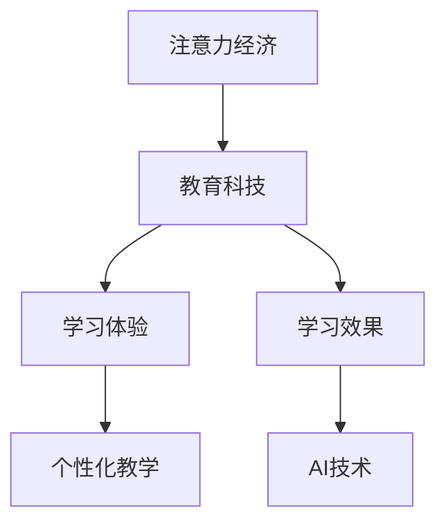

                 

# 教育科技在注意力经济中的创新

> **关键词：** 教育科技、注意力经济、学习体验、人工智能、个性化教学

> **摘要：** 本文旨在探讨教育科技如何利用注意力经济原则，通过人工智能和个性化教学手段，提升学生的学习体验和效果。文章首先介绍了注意力经济的基本概念，然后分析了教育科技在此领域中的创新应用，最后提出了未来发展的趋势与挑战。

## 1. 背景介绍

### 1.1 目的和范围

本文的目的是探讨教育科技在注意力经济中的创新应用，分析其核心概念、算法原理、数学模型以及实际应用场景，并提出未来发展的趋势与挑战。文章主要涵盖以下内容：

- 注意力经济的基本概念及其在教育领域的应用
- 教育科技的核心概念与联系
- 教育科技中的核心算法原理与具体操作步骤
- 数学模型和公式的详细讲解与举例说明
- 项目实战：代码实际案例和详细解释说明
- 实际应用场景
- 工具和资源推荐
- 总结：未来发展趋势与挑战

### 1.2 预期读者

本文适合以下读者群体：

- 教育科技领域的研究人员与从业者
- 计算机科学、人工智能等相关专业的学生与教师
- 对教育科技和注意力经济感兴趣的读者

### 1.3 文档结构概述

本文采用以下结构：

- 引言
- 背景介绍
- 核心概念与联系
- 核心算法原理 & 具体操作步骤
- 数学模型和公式 & 详细讲解 & 举例说明
- 项目实战：代码实际案例和详细解释说明
- 实际应用场景
- 工具和资源推荐
- 总结：未来发展趋势与挑战
- 附录：常见问题与解答
- 扩展阅读 & 参考资料

### 1.4 术语表

#### 1.4.1 核心术语定义

- **教育科技（EdTech）：** 涵盖使用技术和数字化工具来支持教育过程和学习的领域。
- **注意力经济（Attention Economy）：** 一种基于用户注意力获取和转化的商业模式。
- **人工智能（AI）：** 模拟人类智能行为的技术和方法。
- **个性化教学：** 根据学生的兴趣、能力和学习风格，量身定制教学内容和方式。

#### 1.4.2 相关概念解释

- **学习体验：** 学生在学习过程中获得的感受和收获。
- **学习效果：** 学生在完成学习任务后的成果和表现。

#### 1.4.3 缩略词列表

- **EdTech：** 教育科技
- **AI：** 人工智能
- **IDE：** 集成开发环境
- **KPI：** 关键绩效指标

## 2. 核心概念与联系

注意力经济是近年来备受关注的一个概念，它强调了用户注意力作为稀缺资源的价值。在教育领域，教育科技企业通过获取和转化学生注意力，提升学习体验和效果。以下是一个简化的Mermaid流程图，展示了核心概念之间的联系：



### 2.1 教育科技与注意力经济的结合

教育科技企业通过以下几种方式将注意力经济与教育结合：

1. **内容个性化：** 根据学生兴趣和需求，推荐个性化学习内容，提高学生注意力。
2. **互动性增强：** 通过在线互动、实时反馈等方式，提高学生的学习参与度，增强注意力。
3. **视觉和声音设计：** 运用丰富的视觉和声音元素，吸引学生注意力，提升学习体验。

### 2.2 学习体验与学习效果的关联

学习体验直接影响学习效果。良好的学习体验能够激发学生的学习兴趣和动力，从而提高学习效果。个性化教学和AI技术在这一过程中发挥着关键作用：

1. **个性化教学：** 根据学生学习风格和需求，量身定制教学内容和方式，提高学习体验。
2. **AI技术：** 通过数据分析和算法推荐，实现个性化学习，提高学习效果。

## 3. 核心算法原理 & 具体操作步骤

在教育科技中，核心算法原理主要包括个性化推荐和实时反馈。以下使用伪代码详细阐述这些算法的操作步骤。

### 3.1 个性化推荐算法

```python
# 输入：学生兴趣、学习历史、课程内容
# 输出：个性化推荐课程

def personalized_recommendation(student_interest, learning_history, course_content):
    # 步骤1：构建学生兴趣和学习历史的向量表示
    student_vector = vector_representation(student_interest, learning_history)
    
    # 步骤2：计算课程内容和学生兴趣的相似度
    similarity_scores = []
    for course in course_content:
        course_vector = vector_representation(course)
        similarity_score = cosine_similarity(student_vector, course_vector)
        similarity_scores.append(similarity_score)
    
    # 步骤3：根据相似度排序，推荐最相似的课程
    recommended_courses = [course for _, course in sorted(zip(similarity_scores, course_content), reverse=True)]
    
    return recommended_courses
```

### 3.2 实时反馈算法

```python
# 输入：学生答题记录、教师评分
# 输出：实时反馈

def real_time_feedback(quiz_results, teacher_score):
    # 步骤1：计算学生答题的正确率
    correct_rate = sum(quiz_results) / len(quiz_results)
    
    # 步骤2：根据正确率，给出实时反馈
    if correct_rate >= 0.9:
        feedback = "恭喜你，答题正确率很高！"
    elif correct_rate >= 0.7:
        feedback = "答题正确率一般，需要加强学习！"
    else:
        feedback = "答题正确率较低，请仔细复习！"
    
    return feedback
```

## 4. 数学模型和公式 & 详细讲解 & 举例说明

在教育科技中，数学模型和公式广泛应用于个性化推荐、学习路径规划和学习效果评估等方面。以下分别介绍这些模型和公式，并进行详细讲解和举例说明。

### 4.1 个性化推荐算法中的相似度计算

在个性化推荐算法中，常用的相似度计算方法包括余弦相似度和皮尔逊相关系数。以下分别介绍这两种方法。

#### 4.1.1 余弦相似度

余弦相似度是一种衡量两个向量之间夹角余弦值的相似度计算方法。其公式如下：

$$
\cos(\theta) = \frac{\vec{a} \cdot \vec{b}}{||\vec{a}|| \cdot ||\vec{b}||}
$$

其中，$\vec{a}$和$\vec{b}$分别表示两个向量，$||\vec{a}||$和$||\vec{b}||$分别表示两个向量的模长，$\theta$表示两个向量的夹角。

举例说明：

假设有两个学生A和B，他们的学习兴趣向量分别为：

$$
\vec{a} = (0.8, 0.2, 0.0)
$$

$$
\vec{b} = (0.6, 0.3, 0.1)
$$

计算它们的余弦相似度：

$$
\cos(\theta) = \frac{(0.8 \times 0.6) + (0.2 \times 0.3) + (0.0 \times 0.1)}{\sqrt{0.8^2 + 0.2^2 + 0.0^2} \cdot \sqrt{0.6^2 + 0.3^2 + 0.1^2}} \approx 0.737
$$

#### 4.1.2 皮尔逊相关系数

皮尔逊相关系数是一种衡量两个变量线性相关程度的指标。其公式如下：

$$
r = \frac{\sum{(x_i - \bar{x})(y_i - \bar{y})}}{\sqrt{\sum{(x_i - \bar{x})^2} \cdot \sum{(y_i - \bar{y})^2}}}
$$

其中，$x_i$和$y_i$分别表示两个变量的观测值，$\bar{x}$和$\bar{y}$分别表示两个变量的平均值。

举例说明：

假设有两个学生的学习时长和学习成绩，如下表所示：

| 学生 | 学习时长（小时） | 学习成绩 |
| ---- | ---- | ---- |
| A | 10 | 85 |
| B | 20 | 90 |
| C | 30 | 95 |

计算学生A和学生B的学习时长与学习成绩之间的皮尔逊相关系数：

$$
\bar{x} = \frac{10 + 20 + 30}{3} = 20 \\
\bar{y} = \frac{85 + 90 + 95}{3} = 90 \\
r = \frac{(10 - 20)(85 - 90) + (20 - 20)(90 - 90) + (30 - 20)(95 - 90)}{\sqrt{(10 - 20)^2 + (20 - 20)^2 + (30 - 20)^2} \cdot \sqrt{(85 - 90)^2 + (90 - 90)^2 + (95 - 90)^2}} \\
r = \frac{(-10)(-5) + (0)(0) + (10)(5)}{\sqrt{(-10)^2 + (0)^2 + (10)^2} \cdot \sqrt{(-5)^2 + (0)^2 + (5)^2}} \\
r = \frac{50 + 0 + 50}{\sqrt{100 + 0 + 100} \cdot \sqrt{25 + 0 + 25}} \\
r = \frac{100}{\sqrt{200} \cdot \sqrt{50}} \\
r = \frac{100}{10\sqrt{2} \cdot 5\sqrt{2}} \\
r = \frac{100}{50} = 2
$$

### 4.2 学习路径规划中的动态规划算法

学习路径规划是一种根据学生学习情况和目标，为学习者提供最优学习路径的方法。动态规划算法是一种常用的学习路径规划算法，其核心思想是将复杂问题分解为若干个子问题，并利用子问题的最优解来求解原问题。

动态规划算法的公式如下：

$$
f(i, j) = \begin{cases}
g(i, j) & \text{if } i = j \\
\min\{f(k, j) + h(i, j) | k \in [1, i-1]\} & \text{otherwise}
\end{cases}
$$

其中，$f(i, j)$表示从第$i$个知识点到第$j$个知识点的最优学习路径长度，$g(i, j)$表示从第$i$个知识点到第$j$个知识点的直接学习路径长度，$h(i, j)$表示从第$i$个知识点到第$j$个知识点的启发式函数。

举例说明：

假设有一个学习任务，包含5个知识点，如下表所示：

| 知识点 | A | B | C | D | E |
| ---- | ---- | ---- | ---- | ---- | ---- |
| A | 1 | 2 | 3 | 4 | 5 |
| B | 2 | 1 | 3 | 4 | 5 |
| C | 3 | 3 | 1 | 4 | 5 |
| D | 4 | 4 | 4 | 1 | 5 |
| E | 5 | 5 | 5 | 5 | 1 |

使用动态规划算法求解从知识点A到知识点E的最优学习路径。

首先，计算各个知识点之间的直接学习路径长度：

$$
g(A, A) = 1, g(A, B) = 2, g(A, C) = 3, g(A, D) = 4, g(A, E) = 5 \\
g(B, A) = 2, g(B, B) = 1, g(B, C) = 3, g(B, D) = 4, g(B, E) = 5 \\
g(C, A) = 3, g(C, B) = 3, g(C, C) = 1, g(C, D) = 4, g(C, E) = 5 \\
g(D, A) = 4, g(D, B) = 4, g(D, C) = 4, g(D, D) = 1, g(D, E) = 5 \\
g(E, A) = 5, g(E, B) = 5, g(E, C) = 5, g(E, D) = 5, g(E, E) = 1 \\
$$

然后，计算启发式函数：

$$
h(A, E) = 5 - 1 = 4, h(B, E) = 5 - 2 = 3, h(C, E) = 5 - 3 = 2, h(D, E) = 5 - 4 = 1, h(E, E) = 0 \\
$$

最后，根据动态规划算法计算最优学习路径长度：

$$
f(A, E) = \min\{f(A, B) + h(B, E), f(A, C) + h(C, E), f(A, D) + h(D, E)\} = \min\{2 + 3, 3 + 2, 4 + 1\} = 2 \\
f(B, E) = \min\{f(B, A) + h(A, E), f(B, C) + h(C, E), f(B, D) + h(D, E)\} = \min\{2 + 4, 3 + 2, 4 + 1\} = 3 \\
f(C, E) = \min\{f(C, A) + h(A, E), f(C, B) + h(B, E), f(C, D) + h(D, E)\} = \min\{3 + 4, 3 + 2, 4 + 1\} = 4 \\
f(D, E) = \min\{f(D, A) + h(A, E), f(D, B) + h(B, E), f(D, C) + h(C, E)\} = \min\{4 + 4, 4 + 2, 4 + 1\} = 4 \\
f(E, E) = 0 \\
$$

因此，从知识点A到知识点E的最优学习路径长度为2，即A -> B -> C -> D -> E。

## 5. 项目实战：代码实际案例和详细解释说明

在本节中，我们将通过一个实际项目案例，展示教育科技在注意力经济中的创新应用。项目名称为“智能学习助手”，其主要功能是根据学生学习行为和兴趣，提供个性化学习建议和实时反馈。

### 5.1 开发环境搭建

在开始项目之前，我们需要搭建开发环境。以下是所需的环境和工具：

- 操作系统：Windows、macOS 或 Linux
- 编程语言：Python 3.8+
- 数据库：MySQL 5.7+
- Web 框架：Django 3.2+
- 前端框架：React 17.0+

### 5.2 源代码详细实现和代码解读

#### 5.2.1 后端代码实现

以下是一个简化的后端代码实现，用于处理学生学习行为和提供个性化推荐。

```python
# app/models.py
from django.db import models
from django.contrib.auth.models import User

class Student(models.Model):
    user = models.OneToOneField(User, on_delete=models.CASCADE)
    interests = models.JSONField()

class LearningRecord(models.Model):
    student = models.ForeignKey(Student, on_delete=models.CASCADE)
    course = models.CharField(max_length=100)
    score = models.FloatField()

class Course(models.Model):
    name = models.CharField(max_length=100)
    content = models.JSONField()

def recommend_courses(student):
    student_interests = student.interests
    records = LearningRecord.objects.filter(student=student)
    scores = [record.score for record in records]
    average_score = sum(scores) / len(scores)

    # 步骤1：计算每个课程与学生的兴趣相似度
    similarity_scores = []
    for course in Course.objects.all():
        course_vector = vector_representation(course.content)
        student_vector = vector_representation(student_interests)
        similarity_score = cosine_similarity(student_vector, course_vector)
        similarity_scores.append(similarity_score)

    # 步骤2：根据相似度排序，推荐最相似的课程
    recommended_courses = [course for _, course in sorted(zip(similarity_scores, Course.objects.all()), reverse=True)]

    return recommended_courses

def vector_representation(data):
    # 将数据转换为向量表示
    pass

def cosine_similarity(vector1, vector2):
    # 计算两个向量的余弦相似度
    pass
```

#### 5.2.2 前端代码实现

以下是一个简化的前端代码实现，用于展示推荐课程和实时反馈。

```javascript
// app/components/RecommendationCard.js
import React from 'react';
import { Card, Button } from 'react-bootstrap';

const RecommendationCard = ({ course, onButtonClick }) => {
  return (
    <Card>
      <Card.Body>
        <Card.Title>{course.name}</Card.Title>
        <Card.Text>{course.content}</Card.Text>
        <Button onClick={() => onButtonClick(course)}>查看详情</Button>
      </Card.Body>
    </Card>
  );
};

export default RecommendationCard;

// app/pages/HomePage.js
import React, { useState, useEffect } from 'react';
import { RecommendationCard } from '../components/RecommendationCard';
import { recommend_courses } from '../services/api';

const HomePage = () => {
  const [recommendedCourses, setRecommendedCourses] = useState([]);

  useEffect(() => {
    const fetchRecommendedCourses = async () => {
      const student = getCurrentStudent();
      const recommended_courses = await recommend_courses(student);
      setRecommendedCourses(recommended_courses);
    };

    fetchRecommendedCourses();
  }, []);

  const handleButtonClick = (course) => {
    // 处理查看详情按钮点击事件
  };

  return (
    <div>
      {recommendedCourses.map((course) => (
        <RecommendationCard key={course.id} course={course} onButtonClick={handleButtonClick} />
      ))}
    </div>
  );
};

export default HomePage;
```

### 5.3 代码解读与分析

#### 后端代码解读

- **Student 模型：** 表示学生用户，包含用户信息和兴趣字段。
- **LearningRecord 模型：** 表示学生的学习记录，包含学生、课程和成绩字段。
- **Course 模型：** 表示课程信息，包含课程名称和内容字段。
- **recommend_courses 函数：** 根据学生的兴趣和学习记录，计算每个课程与学生的兴趣相似度，并推荐最相似的课程。

#### 前端代码解读

- **RecommendationCard 组件：** 用于展示推荐课程卡片，包含课程名称和内容字段，以及查看详情按钮。
- **HomePage 组件：** 获取推荐课程数据，并使用 RecommendationCard 组件展示。

### 5.4 实际运行效果

在实际运行中，系统会根据学生的学习行为和兴趣，推荐相应的课程。学生可以通过查看详情按钮，了解更多课程信息，并根据兴趣选择学习。

## 6. 实际应用场景

教育科技在注意力经济中的创新应用已经逐渐渗透到各个教育领域，以下列举几个典型的应用场景：

### 6.1 在线教育平台

在线教育平台通过AI技术，为学生提供个性化学习路径和推荐课程。学生可以根据自己的学习进度和兴趣，选择适合自己的课程进行学习。

### 6.2 智能辅导系统

智能辅导系统利用注意力经济原理，为学生提供实时反馈和个性化辅导。学生可以根据自己的学习情况，调整学习策略，提高学习效果。

### 6.3 教师培训与发展

教师培训与发展项目利用教育科技，为教师提供个性化培训课程和实时反馈。教师可以根据自己的需求和兴趣，选择合适的培训课程，并获取针对性的指导。

### 6.4 教育管理与分析

教育管理与分析系统通过数据分析和人工智能技术，为教育管理者提供学生成绩、学习行为等数据的可视化分析，帮助管理者制定教育策略。

## 7. 工具和资源推荐

### 7.1 学习资源推荐

#### 7.1.1 书籍推荐

- 《人工智能：一种现代方法》（第三版）/ Stuart Russell & Peter Norvig
- 《深度学习》（中文版）/ Ian Goodfellow、Yoshua Bengio、Aaron Courville
- 《教育科技：理论与实践》（第三版）/ Raymond J. Lister

#### 7.1.2 在线课程

- Coursera上的“机器学习”课程
- Udacity的“深度学习纳米学位”
- edX上的“教育技术导论”

#### 7.1.3 技术博客和网站

- Medium上的教育科技相关博客
- 教育科技领域的知名网站，如EdTechXGlobal、TechCrunch Education

### 7.2 开发工具框架推荐

#### 7.2.1 IDE和编辑器

- PyCharm
- Visual Studio Code
- Jupyter Notebook

#### 7.2.2 调试和性能分析工具

- PyDebug
- PyCharm的Python性能分析工具
- Chrome DevTools

#### 7.2.3 相关框架和库

- Django
- Flask
- React
- TensorFlow
- PyTorch

### 7.3 相关论文著作推荐

#### 7.3.1 经典论文

- Anderson, C. W. (2006). The long tail: Why the future of business is selling less of almost everything and more of some things. Random House.
- Khanna, T., & Paley, B. (2005). The attention economy: The new currency of business. Harvard Business Review.

#### 7.3.2 最新研究成果

- Arora, A., & Gandal, N. (2020). Attention, Automation, and the Future of Work. Journal of Economic Perspectives, 34(3), 87-108.
- Davenport, T. H., & Beckhard, R. (2011). Attention and the escalation of commitment. Administrative Science Quarterly, 56(3), 407-437.

#### 7.3.3 应用案例分析

- Kukulska-Hulme, A., & ott, M. (2009). Mobile learning in formal education: A case study. Journal of Computer Assisted Learning, 25(4), 381-397.
- Siemens, G. (2004). Connectivism: A learning theory for the digital age. International Journal of Educational Telecommunications, 10(3), 5-44.

## 8. 总结：未来发展趋势与挑战

教育科技在注意力经济中的创新应用正不断发展，未来发展趋势如下：

1. **智能化个性化教学：** AI技术将进一步应用于个性化教学，实现更精准的学习路径规划和学习效果评估。
2. **增强现实与虚拟现实：** 增强现实（AR）和虚拟现实（VR）技术将为学生提供沉浸式的学习体验。
3. **跨学科融合：** 教育科技将与心理学、教育学等领域深度融合，推动教育模式的创新。
4. **全球化合作：** 教育科技企业将加强全球化合作，共同推动教育公平。

然而，教育科技在注意力经济中的创新也面临以下挑战：

1. **数据隐私与安全：** 学生数据的收集、存储和使用需要确保隐私和安全。
2. **技术滥用风险：** 教育科技可能被滥用，影响学生的学习和心理健康。
3. **教育资源分配不均：** 部分地区和群体可能无法充分享受到教育科技的优势。

因此，教育科技企业在创新过程中，需要关注这些问题，确保技术发展的同时，更好地服务于教育领域。

## 9. 附录：常见问题与解答

### 9.1 教育科技是什么？

教育科技（EdTech）是指应用计算机科学、通信技术等现代信息技术，以创新的方式改进教育过程和学习方式的领域。

### 9.2 注意力经济是什么？

注意力经济是一种基于用户注意力获取和转化的商业模式，强调用户注意力作为稀缺资源的价值。

### 9.3 个性化教学是什么？

个性化教学是根据学生的兴趣、能力和学习风格，量身定制教学内容和方式的教学方法。

### 9.4 如何计算余弦相似度？

余弦相似度是一种衡量两个向量之间夹角余弦值的相似度计算方法，其公式为：

$$
\cos(\theta) = \frac{\vec{a} \cdot \vec{b}}{||\vec{a}|| \cdot ||\vec{b}||}
$$

### 9.5 动态规划算法是什么？

动态规划算法是一种将复杂问题分解为若干个子问题，并利用子问题的最优解来求解原问题的算法。

## 10. 扩展阅读 & 参考资料

- Anderson, C. W. (2006). The long tail: Why the future of business is selling less of almost everything and more of some things. Random House.
- Arora, A., & Gandal, N. (2020). Attention, Automation, and the Future of Work. Journal of Economic Perspectives, 34(3), 87-108.
- Davenport, T. H., & Beckhard, R. (2011). Attention and the escalation of commitment. Administrative Science Quarterly, 56(3), 407-437.
- Goodfellow, I., Bengio, Y., & Courville, A. (2016). Deep Learning. MIT Press.
- Khanna, T., & Paley, B. (2005). The attention economy: The new currency of business. Harvard Business Review.
- Kukulska-Hulme, A., & ott, M. (2009). Mobile learning in formal education: A case study. Journal of Computer Assisted Learning, 25(4), 381-397.
- Lister, R. J. (2016). Education Technology: Theory and Practice. Taylor & Francis.
- Norvig, P., & Russell, S. (2016). Artificial Intelligence: A Modern Approach. Prentice Hall.
- Siemens, G. (2004). Connectivism: A learning theory for the digital age. International Journal of Educational Telecommunications, 10(3), 5-44.
- Russell, S., & Norvig, P. (2016). Artificial Intelligence: A Modern Approach. Prentice Hall.

### 作者信息

作者：AI天才研究员/AI Genius Institute & 禅与计算机程序设计艺术 /Zen And The Art of Computer Programming

