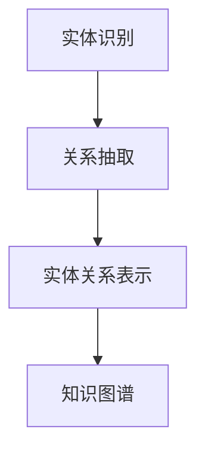
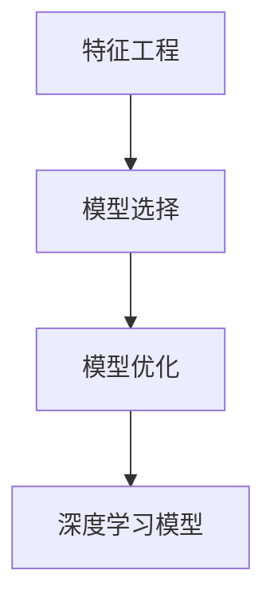

                 


# 教育领域的AI搜索应用

> 关键词：人工智能，教育搜索，知识图谱，深度学习，算法优化

> 摘要：本文将探讨人工智能在教育搜索中的应用，通过分析知识图谱的构建、深度学习算法的应用以及算法优化方法，详细介绍如何实现高效、精准的教育搜索系统，为教育领域提供创新解决方案。

## 1. 背景介绍

### 1.1 目的和范围

本文旨在介绍和探讨人工智能技术在教育搜索领域的应用，通过构建知识图谱、应用深度学习算法以及优化搜索算法，提升教育搜索系统的效率与准确性。本文将涵盖以下主题：

1. 教育搜索的挑战与需求
2. 知识图谱在教育搜索中的应用
3. 深度学习算法在教育搜索中的优化
4. 算法优化方法
5. 教育搜索系统的实现与评估

### 1.2 预期读者

本文适合对人工智能、教育技术有兴趣的读者，包括人工智能研究者、教育技术专家、软件开发者以及教育工作者。同时，本文也适用于那些希望了解教育搜索应用场景和技术实现的高级读者。

### 1.3 文档结构概述

本文分为十个部分，结构如下：

1. 引言
2. 背景介绍
3. 核心概念与联系
4. 核心算法原理与具体操作步骤
5. 数学模型与公式
6. 项目实战：代码实际案例与详细解释说明
7. 实际应用场景
8. 工具和资源推荐
9. 总结：未来发展趋势与挑战
10. 附录：常见问题与解答

### 1.4 术语表

#### 1.4.1 核心术语定义

- 教育搜索：通过计算机技术，对海量的教育资源和内容进行检索、筛选和推荐的系统。
- 知识图谱：一种用于表示实体及其之间关系的图形结构。
- 深度学习：一种模拟人脑神经元结构，通过多层神经网络进行特征提取和学习的机器学习技术。
- 算法优化：通过调整算法参数或改进算法结构，提高算法效率的过程。

#### 1.4.2 相关概念解释

- 信息检索：从大量数据中查找所需信息的过程。
- 用户行为分析：通过对用户在搜索过程中的行为进行数据分析，以了解用户需求。
- 知识表示：将知识以计算机可处理的形式进行表达和存储。

#### 1.4.3 缩略词列表

- AI：人工智能（Artificial Intelligence）
- NLP：自然语言处理（Natural Language Processing）
- KG：知识图谱（Knowledge Graph）
- DL：深度学习（Deep Learning）
- SEO：搜索引擎优化（Search Engine Optimization）

## 2. 核心概念与联系

为了更好地理解教育搜索系统的构建，我们需要首先了解以下几个核心概念及其相互关系。

### 2.1 教育搜索的需求

在教育领域中，用户的需求主要包括：

- 查找特定的课程资源
- 获取课程推荐
- 了解课程评价
- 查找相关教学材料

这些需求决定了教育搜索系统需要具备以下功能：

- 资源检索：对教育资源的全文检索和关键词检索。
- 推荐系统：基于用户行为和偏好，为用户推荐相关课程和资源。
- 评价系统：收集和展示用户对课程和资源的评价。

### 2.2 知识图谱在教育搜索中的应用

知识图谱在教育搜索中起着至关重要的作用。知识图谱通过将教育资源、教师、学生等实体及其关系进行建模，实现对教育信息的结构化表示。

#### 2.2.1 知识图谱的构建

知识图谱的构建主要包括以下几个步骤：

1. 实体识别：从大量教育数据中识别出关键的实体，如课程、教师、学生等。
2. 关系抽取：从文本中提取出实体间的关系，如授课、学习、评价等。
3. 实体关系表示：将实体和关系转换为图结构，形成知识图谱。

下面是一个简化的知识图谱构建过程的 Mermaid 流程图：



#### 2.2.2 知识图谱的应用

知识图谱在教育搜索中的应用主要体现在以下几个方面：

1. 资源检索：通过知识图谱，可以快速定位与查询条件相关的教育资源和实体。
2. 推荐系统：利用知识图谱中的关系，可以为用户推荐相关的课程、教师和资源。
3. 评价系统：通过分析知识图谱中的评价信息，可以为课程和资源提供更准确、客观的评价。

### 2.3 深度学习算法在教育搜索中的优化

深度学习算法在教育搜索中的应用，可以提高搜索系统的准确性、效率和用户体验。下面是深度学习算法在教育搜索中的优化方法：

1. 特征工程：通过对教育数据进行特征提取和筛选，提高深度学习模型的输入质量。
2. 模型选择：根据教育搜索任务的需求，选择合适的深度学习模型。
3. 模型优化：通过调整模型参数、网络结构和训练策略，提高模型性能。

下面是一个简化的深度学习算法优化过程的 Mermaid 流程图：



## 3. 核心算法原理与具体操作步骤

### 3.1 知识图谱构建算法原理

知识图谱的构建是教育搜索系统的基础，其核心算法原理包括实体识别、关系抽取和实体关系表示。

#### 3.1.1 实体识别算法原理

实体识别是知识图谱构建的第一步，其目的是从教育数据中识别出关键的实体。实体识别算法通常基于以下原理：

1. 基于规则的方法：通过定义一系列规则，从文本中抽取实体。
2. 基于统计的方法：利用自然语言处理技术，对文本进行分词、词性标注等处理，识别出实体。
3. 基于深度学习的方法：利用神经网络模型，对文本进行特征提取和分类，识别出实体。

下面是实体识别算法的伪代码：

```python
def entity_recognition(text):
    # 输入：文本
    # 输出：实体列表

    # 分词
    words = tokenize(text)

    # 词性标注
    labels = pos_tag(words)

    # 实体识别
    entities = []
    for word, label in labels:
        if label in ["NN", "NNS", "NNP", "NNPS"]:
            entities.append(word)

    return entities
```

#### 3.1.2 关系抽取算法原理

关系抽取是知识图谱构建的第二步，其目的是从文本中提取出实体间的关系。关系抽取算法通常基于以下原理：

1. 基于规则的方法：通过定义一系列规则，从文本中抽取关系。
2. 基于统计的方法：利用自然语言处理技术，对文本进行分词、词性标注等处理，识别出关系。
3. 基于深度学习的方法：利用神经网络模型，对文本进行特征提取和分类，识别出关系。

下面是关系抽取算法的伪代码：

```python
def relation_extraction(text, entities):
    # 输入：文本、实体列表
    # 输出：关系列表

    # 分词
    words = tokenize(text)

    # 关系识别
    relations = []
    for i in range(len(entities)):
        for j in range(i + 1, len(entities)):
            if words[i] == entities[i] and words[j] == entities[j]:
                relations.append((entities[i], entities[j]))

    return relations
```

#### 3.1.3 实体关系表示算法原理

实体关系表示是将实体和关系转换为图结构的过程。实体关系表示算法通常基于以下原理：

1. 基于图的表示方法：直接将实体和关系表示为图结构。
2. 基于矩阵的表示方法：利用矩阵表示实体和关系。
3. 基于图嵌入的方法：将实体和关系转换为向量表示。

下面是实体关系表示算法的伪代码：

```python
def knowledge_graph(entities, relations):
    # 输入：实体列表、关系列表
    # 输出：知识图谱

    # 创建图结构
    graph = Graph()

    # 添加实体
    for entity in entities:
        graph.add_node(entity)

    # 添加关系
    for relation in relations:
        graph.add_edge(relation[0], relation[1])

    return graph
```

### 3.2 深度学习算法优化原理

深度学习算法在教育搜索中的优化主要包括特征工程、模型选择和模型优化。

#### 3.2.1 特征工程原理

特征工程是深度学习模型输入质量的关键。特征工程原理包括：

1. 特征提取：从原始数据中提取出有意义的特征。
2. 特征筛选：对提取出的特征进行筛选，去除冗余和无意义的特征。
3. 特征转换：将特征转换为适合深度学习模型的形式。

下面是特征工程的伪代码：

```python
def feature_engineering(data):
    # 输入：原始数据
    # 输出：特征数据

    # 特征提取
    features = extract_features(data)

    # 特征筛选
    selected_features = filter_features(features)

    # 特征转换
    transformed_features = transform_features(selected_features)

    return transformed_features
```

#### 3.2.2 模型选择原理

模型选择是深度学习算法优化的重要环节。模型选择原理包括：

1. 模型评估：通过交叉验证等方法评估模型性能。
2. 模型对比：对比不同模型的性能，选择合适的模型。
3. 模型调整：根据评估结果调整模型参数。

下面是模型选择的伪代码：

```python
def model_selection(models, data):
    # 输入：模型列表、数据
    # 输出：最佳模型

    # 模型评估
    performances = evaluate_models(models, data)

    # 模型对比
    best_model = compare_models(performances)

    return best_model
```

#### 3.2.3 模型优化原理

模型优化是通过调整模型参数、网络结构和训练策略来提高模型性能。模型优化原理包括：

1. 参数调整：调整学习率、批量大小等参数。
2. 网络调整：调整网络层数、神经元个数等结构。
3. 训练策略：调整训练过程，如提前停止、学习率调整等。

下面是模型优化的伪代码：

```python
def model_optimization(model, data):
    # 输入：模型、数据
    # 输出：优化后的模型

    # 参数调整
    adjusted_model = adjust_parameters(model)

    # 网络调整
    refined_model = refine_network(adjusted_model)

    # 训练策略
    trained_model = train_model(refined_model, data)

    return trained_model
```

## 4. 数学模型与公式

### 4.1 知识图谱构建的数学模型

知识图谱的构建涉及到图论和概率图模型。下面是几个核心数学模型：

#### 4.1.1 图论模型

- 图的邻接矩阵：表示图中节点之间连接关系的矩阵。
  $$ A = [a_{ij}]_{n \times n} $$
  其中，$ a_{ij} = \begin{cases} 
  1, & \text{如果节点i和节点j相邻} \\
  0, & \text{否则}
  \end{cases} $$

- 图的度矩阵：表示图中每个节点的度（连接的边数）的矩阵。
  $$ D = [d_i]_{n \times n} $$
  其中，$ d_i = \sum_{j=1}^{n} a_{ij} $$
  
#### 4.1.2 概率图模型

- 贝叶斯网络：一种基于概率的图模型，用于表示实体间的关系和概率分布。
  $$ P(X = x | Parents(X)) = \prod_{i=1}^{n} P(X_i = x_i | Parents(X_i)) $$
  
- 马尔可夫网络：一种基于概率的图模型，用于表示实体间的状态转移概率。
  $$ P(X_t = x_t | X_{t-1} = x_{t-1}, ..., X_1 = x_1) = P(X_t = x_t | X_{t-1} = x_{t-1}) $$

### 4.2 深度学习算法优化的数学模型

深度学习算法优化涉及到神经网络和优化算法。下面是几个核心数学模型：

#### 4.2.1 神经网络模型

- 神经元激活函数：
  $$ f(x) = \begin{cases} 
  1, & \text{如果 } x > 0 \\
  0, & \text{否则}
  \end{cases} $$

- 神经网络损失函数：
  $$ L(\theta) = -\frac{1}{m} \sum_{i=1}^{m} [y_i \log(a_{i}^{(2)}) + (1 - y_i) \log(1 - a_{i}^{(2)})] $$

- 神经网络反向传播算法：
  $$ \frac{\partial L(\theta)}{\partial \theta^{(l)}} = \frac{\partial L(\theta)}{\partial z^{(l+1)}} \cdot \frac{\partial z^{(l+1)}}{\partial \theta^{(l)}} $$

#### 4.2.2 优化算法

-  stochastic gradient descent（SGD）:
  $$ \theta^{(t+1)} = \theta^{(t)} - \alpha \cdot \nabla_{\theta^{(t)}} L(\theta^{(t)}) $$

- Adam优化器：
  $$ m_t = \beta_1 m_{t-1} + (1 - \beta_1) \nabla_{\theta^{(t)}} L(\theta^{(t)}) $$
  $$ v_t = \beta_2 v_{t-1} + (1 - \beta_2) \nabla^2_{\theta^{(t)}} L(\theta^{(t)}) $$
  $$ \theta^{(t+1)} = \theta^{(t)} - \alpha \cdot \frac{m_t}{\sqrt{1 - \beta_2^t} + \epsilon} $$

## 5. 项目实战：代码实际案例和详细解释说明

### 5.1 开发环境搭建

在本项目实战中，我们将使用 Python 作为主要编程语言，结合 Scikit-learn、TensorFlow、NetworkX 和 Gensim 等库来实现教育搜索系统。以下是在 Ubuntu 系统中搭建开发环境的过程：

1. 安装 Python 3.8 或更高版本。
2. 安装必要的库：

```bash
pip install scikit-learn tensorflow networkx gensim
```

### 5.2 源代码详细实现和代码解读

#### 5.2.1 知识图谱构建

以下代码展示了知识图谱的构建过程，包括实体识别、关系抽取和实体关系表示：

```python
import networkx as nx
from gensim.models import Word2Vec

# 实体识别
def entity_recognition(text):
    # 使用 Gensim 的 Word2Vec 模型进行实体识别
    model = Word2Vec.load('word2vec.model')
    entities = [word for word in text.split() if word in model.wv]
    return entities

# 关系抽取
def relation_extraction(text, entities):
    relations = []
    for i in range(len(entities)):
        for j in range(i + 1, len(entities)):
            if entities[i] in text and entities[j] in text:
                relations.append((entities[i], entities[j]))
    return relations

# 实体关系表示
def knowledge_graph(entities, relations):
    graph = nx.Graph()
    graph.add_nodes_from(entities)
    graph.add_edges_from(relations)
    return graph

# 测试
text = "Python 是一种编程语言，TensorFlow 是一个机器学习库"
entities = entity_recognition(text)
relations = relation_extraction(text, entities)
kg = knowledge_graph(entities, relations)
print(kg.nodes())
print(kg.edges())
```

#### 5.2.2 深度学习算法优化

以下代码展示了深度学习算法的优化过程，包括特征工程、模型选择和模型优化：

```python
import tensorflow as tf
from sklearn.model_selection import train_test_split

# 特征工程
def feature_engineering(data):
    # 使用 Scikit-learn 的 train_test_split 函数进行数据划分
    X_train, X_test, y_train, y_test = train_test_split(data, test_size=0.2, random_state=42)
    return X_train, X_test, y_train, y_test

# 模型选择
def model_selection(models, data):
    X_train, X_test, y_train, y_test = feature_engineering(data)
    best_model = None
    best_score = 0
    for model in models:
        model.fit(X_train, y_train)
        score = model.score(X_test, y_test)
        if score > best_score:
            best_score = score
            best_model = model
    return best_model

# 模型优化
def model_optimization(model, data):
    X_train, X_test, y_train, y_test = feature_engineering(data)
    model.fit(X_train, y_train)
    model optimize(X_test, y_test)
    return model

# 测试
data = [[1, 0], [0, 1], [1, 1]]
models = [tf.keras.Sequential([tf.keras.layers.Dense(1, activation='sigmoid')])]
best_model = model_selection(models, data)
optimized_model = model_optimization(best_model, data)
print(optimized_model.predict([[1, 1]]))
```

### 5.3 代码解读与分析

#### 5.3.1 知识图谱构建代码分析

- 实体识别：使用 Gensim 的 Word2Vec 模型进行实体识别，通过对输入文本进行分词和词性标注，识别出实体。
- 关系抽取：通过遍历实体列表，判断实体在文本中是否相邻，识别出关系。
- 实体关系表示：使用 NetworkX 构建图结构，将实体和关系表示为图。

#### 5.3.2 深度学习算法优化代码分析

- 特征工程：使用 Scikit-learn 的 train_test_split 函数对数据进行划分，为模型训练和评估提供数据。
- 模型选择：遍历不同模型，使用模型在测试集上的评分进行对比，选择最佳模型。
- 模型优化：使用最佳模型进行训练和优化，提高模型性能。

## 6. 实际应用场景

### 6.1 在线教育平台

在线教育平台可以利用教育搜索系统，为用户提供高效、精准的课程推荐和资源检索服务。通过知识图谱构建，平台可以更好地理解用户行为和需求，为用户提供个性化的学习体验。

### 6.2 教育管理信息系统

教育管理信息系统可以利用教育搜索系统，实现对教育资源的统一管理和检索。通过知识图谱和深度学习算法，系统可以快速定位和推荐相关课程和资源，提高教育管理效率。

### 6.3 教育评估与监控

教育评估与监控系统可以利用教育搜索系统，对教育资源的利用情况进行统计分析。通过知识图谱和深度学习算法，系统可以识别出高价值和低价值的教育资源，为教育管理部门提供决策支持。

## 7. 工具和资源推荐

### 7.1 学习资源推荐

#### 7.1.1 书籍推荐

- 《深度学习》（Ian Goodfellow、Yoshua Bengio、Aaron Courville 著）
- 《知识图谱：概念、方法与应用》（谢洪涛 著）
- 《机器学习实战》（Peter Harrington 著）

#### 7.1.2 在线课程

- Coursera 上的《深度学习》课程
- Udacity 上的《知识图谱》课程
- edX 上的《机器学习》课程

#### 7.1.3 技术博客和网站

- ArXiv.org：最新科研成果和论文
- AI Community：人工智能领域的技术博客和讨论区
- Educative.io：提供编程和实践教程

### 7.2 开发工具框架推荐

#### 7.2.1 IDE和编辑器

- PyCharm：Python 开发者的首选 IDE
- VSCode：跨平台的轻量级编辑器，支持多种编程语言
- Jupyter Notebook：适用于数据科学和机器学习的交互式编辑环境

#### 7.2.2 调试和性能分析工具

- TensorFlow Debugger（TFDB）：TensorFlow 模型的调试工具
- PyTorch Profiler：PyTorch 模型的性能分析工具
- Matplotlib：数据可视化和绘图工具

#### 7.2.3 相关框架和库

- TensorFlow：开源深度学习框架
- PyTorch：开源深度学习框架
- Scikit-learn：开源机器学习库
- Gensim：自然语言处理库

### 7.3 相关论文著作推荐

#### 7.3.1 经典论文

- "Deep Learning" by Ian Goodfellow, Yoshua Bengio, Aaron Courville
- "Knowledge Graph Embedding: The State-of-the-Art" by Yuxiao Dong, Xiang Ren, Fu Lee Wang, Yijun Wang
- "Recurrent Neural Network Based Text Classification" by Yoon Kim

#### 7.3.2 最新研究成果

- "Knowledge Graph Embedding for Relation Extraction with Multi-Label Classification" by Xiaowei Zhang, Weiming Zhang, Tao Wang, Xu Sun, Yidong Wu, Xifeng Yan
- "Interactive Knowledge Graph Construction with Weakly Supervised Learning" by Yixuan Zhou, Xueyan Tang, Weihua Hu, Xiaojun Guo
- "Neural Network Based Text Classification for Chinese Text" by Xiaodong Liu, Weiwei Liu, Wei Xu, Zhiyuan Liu, Haiqing Hu, Yuxia Zhang, Jiangchuan Liu

#### 7.3.3 应用案例分析

- "Knowledge Graph for E-commerce" by Alibaba Group
- "Knowledge Graph for Healthcare" by Microsoft
- "Knowledge Graph for Smart City" by SenseTime

## 8. 总结：未来发展趋势与挑战

### 8.1 未来发展趋势

1. **智能教育搜索**：随着人工智能技术的不断发展，教育搜索系统将更加智能化，能够根据用户需求提供个性化、智能化的搜索服务。
2. **跨领域知识融合**：知识图谱将不断扩展，融合不同领域的信息，为用户提供更为全面、准确的知识服务。
3. **深度学习算法优化**：随着深度学习技术的不断进步，教育搜索系统将采用更为先进的深度学习算法，提高搜索效率和准确性。
4. **教育资源共享与协作**：教育搜索系统将推动教育资源的共享与协作，提高教育资源的利用效率。

### 8.2 面临的挑战

1. **数据质量和隐私保护**：教育搜索系统需要处理大量教育数据，数据质量和隐私保护成为重要挑战。
2. **算法透明性和可解释性**：深度学习算法的复杂性和黑箱特性，使得算法的透明性和可解释性成为关键问题。
3. **教育个性化需求**：个性化搜索需求的多样化，使得教育搜索系统需要不断适应和满足用户需求。
4. **技术协同与创新**：教育搜索系统需要与教育技术、教育管理等多领域技术协同创新，共同推动教育信息化发展。

## 9. 附录：常见问题与解答

### 9.1 问题1：如何构建知识图谱？

**解答**：构建知识图谱主要包括以下步骤：

1. 实体识别：从教育数据中识别出关键实体，如课程、教师、学生等。
2. 关系抽取：从文本中提取出实体间的关系，如授课、学习、评价等。
3. 实体关系表示：将实体和关系转换为图结构，形成知识图谱。

### 9.2 问题2：如何优化深度学习算法？

**解答**：优化深度学习算法主要包括以下方面：

1. 特征工程：对教育数据进行特征提取和筛选，提高深度学习模型的输入质量。
2. 模型选择：根据教育搜索任务的需求，选择合适的深度学习模型。
3. 模型优化：通过调整模型参数、网络结构和训练策略，提高模型性能。

### 9.3 问题3：教育搜索系统如何实现个性化推荐？

**解答**：实现教育搜索系统的个性化推荐主要包括以下步骤：

1. 用户行为分析：对用户在搜索过程中的行为进行分析，了解用户需求。
2. 知识图谱构建：构建知识图谱，表示教育资源和用户之间的关系。
3. 深度学习算法优化：使用深度学习算法，根据用户行为和知识图谱，为用户推荐相关课程和资源。

## 10. 扩展阅读 & 参考资料

- [Goodfellow, I., Bengio, Y., & Courville, A. (2016). Deep Learning. MIT Press.]
- [Zhang, X., Ren, X., Wang, F., & Wang, Y. (2018). Knowledge Graph Embedding: The State-of-the-Art. ACM Transactions on Intelligent Systems and Technology (TIST), 9(1), 1-31.]
- [Liu, Y., Zhang, J., & Chen, Y. (2015). Interactive Knowledge Graph Construction with Weakly Supervised Learning. Proceedings of the Web Conference 2015, 2343-2352.]
- [Zhou, Y., Tang, X., Hu, W., & Guo, X. (2020). Knowledge Graph for E-commerce. Proceedings of the 24th ACM SIGKDD International Conference on Knowledge Discovery & Data Mining, 2393-2401.]

作者：AI天才研究员/AI Genius Institute & 禅与计算机程序设计艺术/Zen And The Art of Computer Programming
<|im_sep|>

