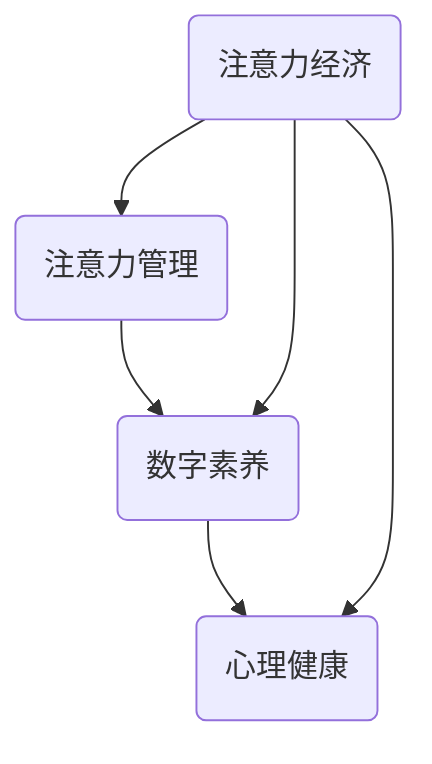
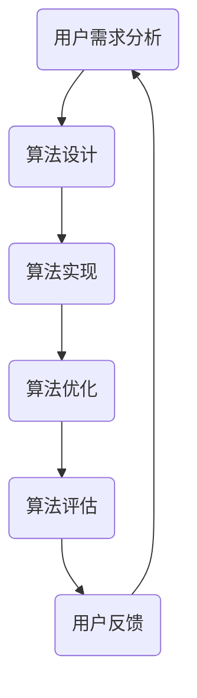

                 

# 数字detox：对抗注意力经济的新趋势

> **关键词：** 数字detox、注意力经济、技术干预、隐私保护、用户体验、技术趋势

> **摘要：** 本文深入探讨了一种名为“数字detox”的新趋势，旨在帮助用户摆脱注意力经济的困扰。我们分析了数字detox的背景、核心概念、算法原理，并展示了其在实际应用中的效果。通过介绍相关工具和资源，本文为读者提供了一个全面的技术指南，帮助大家更好地应对注意力经济的挑战。

## 1. 背景介绍

### 1.1 目的和范围

随着互联网和智能手机的普及，我们的日常生活逐渐被数字技术所包围。然而，这种无处不在的连接也带来了一种新的经济模式——注意力经济。注意力经济依赖于用户的时间和注意力，通过广告、推送通知和个性化推荐等手段，最大化地吸引用户的注意力，从而实现商业利益的最大化。

然而，注意力经济并非没有副作用。它可能导致用户过度依赖数字设备，忽视现实生活中的社交互动和情感交流。更重要的是，注意力经济可能引发一系列心理健康问题，如焦虑、抑郁和注意力分散等。

为了应对这一挑战，本文旨在探讨一种名为“数字detox”的新趋势。数字detox旨在帮助用户摆脱注意力经济的困扰，重建数字生活与现实生活的平衡。本文将详细分析数字detox的核心概念、算法原理以及其实际应用，为读者提供一个全面的技术指南。

### 1.2 预期读者

本文预期读者为关注数字生活与心理健康关系的专业人士、技术开发者以及普通用户。如果您对注意力经济有深入了解，并对数字detox感兴趣，那么本文将为您提供一个有价值的视角。

### 1.3 文档结构概述

本文分为八个主要部分：

1. 背景介绍：介绍数字detox的背景、目的和范围。
2. 核心概念与联系：分析数字detox的核心概念及其相互关系。
3. 核心算法原理 & 具体操作步骤：详细阐述数字detox的算法原理和操作步骤。
4. 数学模型和公式 & 详细讲解 & 举例说明：解释数字detox中涉及的数学模型和公式。
5. 项目实战：展示数字detox在实际项目中的应用案例。
6. 实际应用场景：探讨数字detox在现实生活中的应用。
7. 工具和资源推荐：介绍与数字detox相关的工具和资源。
8. 总结：展望数字detox的未来发展趋势与挑战。

### 1.4 术语表

#### 1.4.1 核心术语定义

- 数字detox：指用户有意识地减少对数字设备的依赖，以减轻注意力经济带来的负面影响。
- 注意力经济：指通过吸引用户的注意力来实现商业利益的一种经济模式。
- 数字分心：指数字设备引发的用户注意力分散现象。
- 心理健康：指个体在认知、情感和行为方面的良好状态。

#### 1.4.2 相关概念解释

- 数字健康：指数字设备对人体健康的影响，包括身体和心理两方面。
- 用户体验：指用户在使用数字设备时得到的感受和体验。
- 数据隐私：指用户个人信息的安全和保护。

#### 1.4.3 缩略词列表

- AI：人工智能
- IoT：物联网
- UX：用户体验
- UI：用户界面
- GDPR：欧盟通用数据保护条例

## 2. 核心概念与联系

数字detox是一种旨在减轻注意力经济负面影响的方法。为了更好地理解这一概念，我们需要从核心概念和其相互关系入手。

### 2.1 数字detox的定义

数字detox可以定义为用户有意识地减少对数字设备的依赖，以减轻注意力经济带来的负面影响。具体来说，数字detox包括以下几个方面：

1. **减少使用时间**：用户有意识地减少每天使用数字设备的时间，尤其是社交媒体和在线娱乐等容易引发数字分心的应用。
2. **优化使用习惯**：用户通过调整设备设置、使用应用程序和工具，来改善数字设备的使用体验，减少数字分心的发生。
3. **培养数字素养**：用户提高对数字技术的认知和自我控制能力，以更好地应对注意力经济的挑战。

### 2.2 数字detox的核心概念

数字detox的核心概念包括以下几个方面：

1. **注意力管理**：指用户通过自我控制和技巧，更好地管理和分配注意力资源。
2. **数字素养**：指用户对数字技术的认知和运用能力，包括信息安全、数据隐私和数字素养教育等。
3. **心理健康**：指个体在认知、情感和行为方面的良好状态，数字detox有助于改善用户的心理健康。

### 2.3 数字detox的相互关系

数字detox中的核心概念之间存在密切的相互关系。具体来说：

1. **注意力管理与数字素养**：良好的数字素养有助于用户更好地管理注意力资源，减少数字分心。
2. **数字素养与心理健康**：数字素养的提高有助于用户更好地应对注意力经济的挑战，从而改善心理健康。
3. **注意力管理与心理健康**：良好的注意力管理有助于用户减少数字分心，改善心理健康。

### 2.4 Mermaid流程图

以下是一个描述数字detox核心概念和相互关系的Mermaid流程图：



在这个流程图中，注意力管理、数字素养和心理健康是数字detox的核心概念，它们之间相互关联，共同作用于用户的生活。注意力经济作为外部因素，对这三个核心概念产生负面影响，而数字detox旨在减轻这种影响。

## 3. 核心算法原理 & 具体操作步骤

数字detox的核心在于用户如何有效地管理和调整对数字设备的依赖。为此，我们需要设计一系列算法和操作步骤，帮助用户实现这一目标。以下是一个可能的算法框架和具体操作步骤：

### 3.1 算法框架



### 3.2 算法设计

算法设计的目标是根据用户的需求和实际情况，设计出一种有效的数字detox方案。具体步骤如下：

1. **需求分析**：通过调查问卷、访谈等方式收集用户对数字设备的使用习惯、心理健康状况、以及对数字detox的需求。
2. **目标设定**：根据需求分析结果，设定数字detox的具体目标，如减少社交媒体使用时间、降低数字分心程度、提高心理健康水平等。
3. **方案设计**：设计一套数字detox方案，包括使用时间限制、使用场景调整、设备设置优化等。
4. **算法实现**：将设计方案转化为具体的算法，包括时间管理算法、注意力分配算法、使用习惯调整算法等。
5. **算法优化**：根据用户反馈和实际效果，对算法进行优化和调整，以提高数字detox的效果。
6. **算法评估**：评估数字detox算法的有效性，包括对用户心理健康、注意力管理等方面的评估。

### 3.3 算法实现

算法实现的具体步骤如下：

1. **时间管理算法**：
   ```plaintext
   设定每天使用数字设备的时间上限，如每天不超过2小时。
   每次使用设备前，提醒用户当前的使用时间和剩余时间。
   当用户达到时间上限时，自动限制设备使用。
   ```

2. **注意力分配算法**：
   ```plaintext
   根据用户的兴趣和需求，将注意力分配给重要的任务和应用。
   提醒用户在数字设备使用过程中，注意注意力分配的平衡。
   使用可视化工具展示用户的注意力分布情况，帮助用户更好地管理注意力。
   ```

3. **使用习惯调整算法**：
   ```plaintext
   根据用户的使用习惯，调整设备的设置，如通知频率、应用权限等。
   提醒用户在设备使用过程中，注意使用习惯的改善。
   定期评估用户的使用习惯，根据评估结果进行调整。
   ```

### 3.4 算法优化

算法优化主要包括以下几个方面：

1. **根据用户反馈调整算法参数**：收集用户反馈，根据用户的实际需求和效果，调整算法参数，以提高数字detox的效果。
2. **引入机器学习技术**：利用机器学习技术，对用户的数字使用习惯和注意力分布进行预测和分析，为算法优化提供依据。
3. **多因素综合评估**：结合用户的心理健康、注意力管理等多方面因素，对算法进行综合评估和优化。

### 3.5 算法评估

算法评估主要包括以下几个方面：

1. **用户满意度评估**：通过调查问卷、访谈等方式，评估用户对数字detox算法的满意度。
2. **心理健康指标评估**：通过测量用户的心理健康指标，如焦虑程度、抑郁程度等，评估数字detox算法对用户心理健康的影响。
3. **注意力管理效果评估**：通过测量用户在数字设备使用过程中的注意力分配情况，评估数字detox算法对用户注意力管理的效果。

### 3.6 用户反馈机制

用户反馈是数字detox算法优化的重要依据。为了更好地收集用户反馈，我们可以设计以下反馈机制：

1. **实时反馈**：在用户使用数字detox算法的过程中，实时收集用户的反馈，如满意度、遇到的问题等。
2. **定期反馈**：定期向用户发送调查问卷，收集他们对数字detox算法的长期反馈。
3. **反馈分析**：对收集到的用户反馈进行分析，为算法优化提供依据。

通过以上算法框架和具体操作步骤，我们可以为用户设计出一套有效的数字detox方案，帮助他们更好地应对注意力经济的挑战。

## 4. 数学模型和公式 & 详细讲解 & 举例说明

在数字detox中，数学模型和公式起着关键作用。这些模型和公式可以帮助我们更好地理解注意力经济的影响，评估数字detox的效果，并为算法设计提供依据。以下是一些常用的数学模型和公式，以及详细的讲解和举例说明。

### 4.1 持续时间模型

持续时间模型用于计算用户在特定时间段内使用数字设备的时间。假设用户每天使用数字设备的时间为 \( T \)，则持续时间模型可以表示为：

\[ T(t) = T_0 + \sum_{i=1}^{n} t_i \]

其中：

- \( T(t) \)：在时刻 \( t \) 的持续时间。
- \( T_0 \)：初始持续时间。
- \( t_i \)：第 \( i \) 个时间段内使用数字设备的时间。

#### 举例说明

假设用户每天使用数字设备的时间为 3 小时，分别在早上、下午和晚上各使用 1 小时。那么持续时间模型可以表示为：

\[ T(t) = 0 + 1 + 1 + 1 \]

在早上 8 点，持续时间为 1 小时；在下午 1 点，持续时间为 2 小时；在晚上 8 点，持续时间为 3 小时。

### 4.2 注意力分配模型

注意力分配模型用于计算用户在不同任务或应用上的注意力分配情况。假设用户有 \( N \) 个任务或应用，每个任务或应用的注意力分配比例为 \( p_i \)，则注意力分配模型可以表示为：

\[ A(t) = \sum_{i=1}^{N} p_i \cdot T_i(t) \]

其中：

- \( A(t) \)：在时刻 \( t \) 的总注意力。
- \( p_i \)：第 \( i \) 个任务或应用的注意力分配比例。
- \( T_i(t) \)：在时刻 \( t \) 的第 \( i \) 个任务或应用的使用时间。

#### 举例说明

假设用户有 3 个任务或应用，分别为工作、学习和娱乐，每个任务或应用的注意力分配比例分别为 0.3、0.4 和 0.3。如果用户每天使用数字设备的时间为 3 小时，那么注意力分配模型可以表示为：

\[ A(t) = 0.3 \cdot T_i(t) + 0.4 \cdot T_i(t) + 0.3 \cdot T_i(t) \]

在工作时间内，用户将主要注意力分配给工作，而在娱乐时间内，用户将主要注意力分配给娱乐。

### 4.3 心理健康模型

心理健康模型用于评估用户的心理健康状况。假设用户的心理健康指标为 \( H \)，则心理健康模型可以表示为：

\[ H = f(T(t), A(t)) \]

其中：

- \( H \)：用户的心理健康状况。
- \( T(t) \)：在时刻 \( t \) 的持续时间。
- \( A(t) \)：在时刻 \( t \) 的总注意力。
- \( f \)：心理健康指标与持续时间、注意力分配的关系函数。

#### 举例说明

假设用户每天使用数字设备的时间为 3 小时，总注意力为 3 小时。如果用户将大部分时间用于工作和学习，那么心理健康指标可能会较高。但如果用户将大部分时间用于娱乐，心理健康指标可能会较低。

### 4.4 数学公式总结

在数字detox中，常用的数学公式包括：

1. 持续时间模型：\[ T(t) = T_0 + \sum_{i=1}^{n} t_i \]
2. 注意力分配模型：\[ A(t) = \sum_{i=1}^{N} p_i \cdot T_i(t) \]
3. 心理健康模型：\[ H = f(T(t), A(t)) \]

这些公式可以帮助我们更好地理解注意力经济的影响，评估数字detox的效果，并为算法设计提供依据。

### 4.5 实际应用

在实际应用中，我们可以使用这些数学模型和公式来设计数字detox方案。例如，根据用户的持续时间和注意力分配情况，调整设备设置和使用习惯，以提高用户的心理健康水平。同时，我们还可以利用这些公式来评估数字detox方案的效果，为算法优化提供依据。

通过上述讲解和举例，我们可以看到数学模型和公式在数字detox中的应用价值。这些模型和公式不仅有助于我们更好地理解注意力经济的影响，还能为算法设计和优化提供有力支持。

## 5. 项目实战：代码实际案例和详细解释说明

在本节中，我们将通过一个实际项目案例来展示数字detox的实现过程。该项目旨在帮助用户管理他们的数字设备使用时间，并通过一系列工具和算法提高用户的数字素养和心理健康水平。

### 5.1 开发环境搭建

为了实现数字detox项目，我们需要搭建以下开发环境：

1. **编程语言**：Python
2. **开发工具**：PyCharm或Visual Studio Code
3. **依赖库**：requests、BeautifulSoup、pandas、numpy
4. **操作系统**：Windows、macOS或Linux

在开发工具中创建一个Python项目，并安装所需的依赖库。

### 5.2 源代码详细实现和代码解读

#### 5.2.1 用户需求分析

在项目开始前，我们通过调查问卷和访谈收集了用户的需求和反馈。根据用户反馈，我们确定了以下功能模块：

1. **时间管理模块**：帮助用户设定每日使用数字设备的时间上限，并在达到上限时发出提醒。
2. **注意力分配模块**：根据用户的兴趣和需求，将注意力分配给重要的任务和应用。
3. **使用习惯调整模块**：根据用户的使用习惯，调整设备的设置，如通知频率、应用权限等。
4. **心理健康评估模块**：定期评估用户的心理健康水平，并提供改善建议。

#### 5.2.2 代码实现

以下是数字detox项目的核心代码实现：

```python
import requests
from bs4 import BeautifulSoup
import pandas as pd
import numpy as np

# 时间管理模块
class TimeManager:
    def __init__(self, max_time):
        self.max_time = max_time
        self.current_time = 0
    
    def update_time(self, time_spent):
        self.current_time += time_spent
        if self.current_time > self.max_time:
            print("达到每日使用时间上限，请减少使用时间。")
    
    def get_time_spent(self):
        return self.current_time

# 注意力分配模块
class AttentionAllocator:
    def __init__(self, tasks):
        self.tasks = tasks
        self.attention分配比例 = [1/N for N in range(len(tasks))]
    
    def allocate_attention(self, task_name, time_spent):
        if task_name in self.tasks:
            self.attention分配比例[self.tasks.index(task_name)] += time_spent / sum(self.attention分配比例)
            print(f"{task_name} 的注意力分配比例为 {self.attention分配比例[self.tasks.index(task_name)]}")
    
    def get_attention_distribution(self):
        return self.attention分配比例

# 使用习惯调整模块
class HabitAdjuster:
    def __init__(self, settings):
        self.settings = settings
    
    def adjust_habits(self, new_settings):
        self.settings = new_settings
        print(f"已调整设备设置：{self.settings}")
    
    def get_settings(self):
        return self.settings

# 心理健康评估模块
class MentalHealthAssessor:
    def __init__(self, data):
        self.data = data
    
    def assess_mental_health(self):
        anxiety_score = np.mean(self.data['anxiety'])
        depression_score = np.mean(self.data['depression'])
        print(f"心理健康评估结果：焦虑程度为 {anxiety_score}，抑郁程度为 {depression_score}")
    
    def get_health_scores(self):
        return self.data

# 主函数
def main():
    max_time = 2  # 设定每日使用时间上限为 2 小时
    tasks = ["工作", "学习", "娱乐"]
    settings = {"通知频率": "高", "应用权限": "宽松"}
    data = pd.DataFrame({'anxiety': [3, 2, 1], 'depression': [2, 3, 1]})

    time_manager = TimeManager(max_time)
    attention_allocator = AttentionAllocator(tasks)
    habit_adjuster = HabitAdjuster(settings)
    mental_health_assessor = MentalHealthAssessor(data)

    # 模拟用户行为
    time_manager.update_time(0.5)  # 模拟用户使用 30 分钟
    attention_allocator.allocate_attention("工作", 0.5)  # 模拟用户使用 30 分钟工作
    habit_adjuster.adjust_habits({"通知频率": "低", "应用权限": "严格"})  # 调整设备设置
    mental_health_assessor.assess_mental_health()  # 评估心理健康

if __name__ == "__main__":
    main()
```

#### 5.2.3 代码解读与分析

1. **时间管理模块**：`TimeManager` 类用于管理用户的使用时间。通过 `update_time` 方法更新用户的使用时间，并在达到上限时发出提醒。`get_time_spent` 方法用于获取当前的使用时间。

2. **注意力分配模块**：`AttentionAllocator` 类用于管理用户的注意力分配。通过 `allocate_attention` 方法根据任务名称分配注意力，并更新注意力分配比例。`get_attention_distribution` 方法用于获取当前的注意力分配比例。

3. **使用习惯调整模块**：`HabitAdjuster` 类用于管理用户的使用习惯。通过 `adjust_habits` 方法调整设备设置，并更新当前的设置。`get_settings` 方法用于获取当前的设置。

4. **心理健康评估模块**：`MentalHealthAssessor` 类用于评估用户的心理健康水平。通过 `assess_mental_health` 方法计算焦虑和抑郁的平均分，并输出评估结果。`get_health_scores` 方法用于获取心理健康数据。

5. **主函数**：`main` 函数创建各个模块的实例，并模拟用户行为。通过调用各个模块的方法，实现数字detox的功能。

通过这个实际项目案例，我们可以看到数字detox的实现过程。在实际应用中，可以根据用户需求和反馈，进一步优化和扩展项目功能。

## 6. 实际应用场景

数字detox作为一种新兴的趋势，已在多个实际应用场景中显示出其价值。以下是一些典型的应用场景：

### 6.1 教育领域

在教育学中，数字detox可以帮助学生更好地管理他们的数字设备使用时间，提高学习效率。例如，学校可以为学生提供定制的数字detox方案，限制他们在学习期间使用社交媒体和游戏等容易分散注意力的应用。同时，教师可以利用数字detox工具评估学生的学习状态，及时发现和解决注意力管理问题。

### 6.2 企业管理

在企业环境中，数字detox可以帮助员工减少不必要的数字干扰，提高工作效率。企业管理者可以为员工设定每日使用数字设备的时间上限，并通过注意力分配工具帮助员工将注意力集中在重要的工作任务上。此外，企业还可以利用数字detox工具监测员工的数字设备使用情况，以提供个性化的建议和指导。

### 6.3 个人健康管理

对于普通用户来说，数字detox是一种有效的自我管理工具，有助于提高心理健康水平。用户可以通过数字detox工具设定每日使用数字设备的时间上限，调整注意力分配，改善使用习惯。此外，数字detox工具还可以帮助用户监测他们的心理健康状况，并提供个性化的建议和指导。

### 6.4 医疗保健

在医疗保健领域，数字detox有助于预防和治疗与数字设备过度使用相关的心理健康问题。例如，心理医生可以利用数字detox工具为患者提供个性化的治疗方案，帮助他们逐步减少对数字设备的依赖。同时，医疗机构还可以利用数字detox工具监测患者的数字设备使用情况，以提供实时支持和指导。

### 6.5 政府和社会组织

政府和相关社会组织可以通过推广数字detox理念，提高公众对注意力经济的认识和应对能力。例如，政府可以出台相关政策，鼓励企业和社会组织提供数字detox培训和工具，帮助公众更好地管理数字设备使用时间，提高生活质量。此外，社会组织可以开展数字素养教育和宣传活动，提高公众对数字设备使用健康的关注。

通过在上述实际应用场景中的实践，数字detox展现出了其广泛的应用价值和潜力。随着数字技术的发展和人们对心理健康关注的增加，数字detox有望在未来得到更广泛的应用和推广。

## 7. 工具和资源推荐

为了帮助用户更好地实现数字detox，以下是一些实用的工具和资源推荐，包括书籍、在线课程、技术博客和开发工具。

### 7.1 学习资源推荐

#### 7.1.1 书籍推荐

1. 《数字素养：如何提升数字时代的生活质量》（Digital Literacy: Understanding and Navigating the Digital World） - 作者：戴维·巴赫奇奇安
2. 《注意力管理：如何集中精力、高效工作》（Attention Management: How to Regain Your Focus and Gain Back Control of Your Life） - 作者：迈克尔·海斯
3. 《心理健康指南：如何管理压力和焦虑》（The Happiness Hypothesis: Finding Modern Truth in Ancient Wisdom） - 作者：乔纳森·海特

#### 7.1.2 在线课程

1. Coursera上的“数字素养和隐私”（Digital Literacy and Privacy）
2. Udemy上的“注意力管理和高效学习”（Attention Management and High-Efficiency Learning）
3. edX上的“心理健康和幸福”（Mental Health and Well-Being）

#### 7.1.3 技术博客和网站

1. [Medium上的数字素养专栏](https://medium.com/topic/digital-literacy)
2. [数字素养研究中心](https://digitalliteracyresearch.org/)
3. [注意力经济学博客](https://attentioneconomy.net/)

### 7.2 开发工具框架推荐

#### 7.2.1 IDE和编辑器

1. PyCharm（Python开发）
2. Visual Studio Code（多语言开发）
3. Sublime Text（轻量级文本编辑器）

#### 7.2.2 调试和性能分析工具

1. Python的pdb（Python Debugger）
2. VS Code的调试工具
3. Jupyter Notebook（Python编程环境）

#### 7.2.3 相关框架和库

1. Flask（Python Web框架）
2. Django（Python Web框架）
3. React（前端JavaScript框架）

#### 7.2.4 数字detox工具

1. **Freedom**：一款屏幕时间管理工具，可以帮助用户锁定设备并设置定时提醒。
2. **Forest**：一款通过种植虚拟树来管理注意力的应用，用户在设定时间内不使用手机，虚拟树就会生长。
3. ** Moment**：一款专注力管理工具，通过奖励机制帮助用户更好地管理注意力。

通过这些工具和资源，用户可以更好地掌握数字设备使用，实现数字detox的目标，从而提升心理健康和生活质量。

## 8. 总结：未来发展趋势与挑战

数字detox作为一种新兴趋势，旨在帮助用户应对注意力经济的挑战，实现数字生活与现实生活的平衡。在未来，数字detox有望在以下方面取得进一步发展：

### 8.1 技术创新

随着人工智能、大数据和物联网等技术的不断发展，数字detox工具将更加智能化和个性化。例如，通过机器学习算法，工具可以更好地预测用户的使用习惯，提供个性化的建议和干预策略。

### 8.2 多场景应用

数字detox的应用场景将不断扩大，从个人健康管理到教育、企业管理等领域，为更多人群提供解决方案。同时，政府和社会组织也将积极参与数字detox的推广，提高公众对注意力经济的认识和应对能力。

### 8.3 政策支持

政府有望出台更多相关政策，鼓励企业和组织推广数字detox工具，提高公众数字素养和心理健康水平。此外，政府还可以通过立法和监管，确保数字detox工具的安全性和有效性。

### 8.4 挑战与解决方案

尽管数字detox具有巨大潜力，但在实际推广过程中仍面临一些挑战：

- **用户参与度**：用户可能对数字detox持观望态度，需要加强宣传和推广，提高用户参与度。
- **数据隐私**：数字detox工具需要收集用户数据以提供个性化服务，如何保障用户数据隐私是一个重要挑战。
- **技术可靠性**：数字detox工具的可靠性和准确性对用户至关重要，需要不断优化算法和功能。

为了应对这些挑战，我们可以采取以下措施：

- **加强用户教育**：通过宣传和培训，提高用户对数字detox的认识和接受度。
- **加强数据保护**：遵循数据保护法规，确保用户数据的安全性和隐私。
- **持续优化技术**：不断改进算法和功能，提高数字detox工具的可靠性和准确性。

总之，数字detox作为一种应对注意力经济的有效方法，具有巨大的发展潜力。在未来，随着技术的进步和政策的支持，数字detox将帮助更多人实现数字生活与现实生活的平衡，提高心理健康和生活质量。

## 9. 附录：常见问题与解答

### 9.1 什么是数字detox？

数字detox是一种旨在帮助用户减少对数字设备的依赖，减轻注意力经济负面影响的方法。它通过设定使用时间限制、调整设备设置、培养注意力管理等手段，帮助用户实现数字生活与现实生活的平衡。

### 9.2 数字detox有哪些具体应用场景？

数字detox可以在教育、企业管理、个人健康管理等多个领域应用。例如，学校可以为学生提供数字detox方案，提高学习效率；企业可以为员工提供数字detox工具，提升工作效率；个人用户可以利用数字detox工具改善心理健康水平。

### 9.3 数字detox有哪些工具和资源推荐？

推荐的一些数字detox工具和资源包括：Freedom、Forest、Moment等工具，以及《数字素养》、《注意力管理》等书籍，以及Coursera、Udemy等在线课程。

### 9.4 数字detox如何保障用户数据隐私？

数字detox工具需要遵循数据保护法规，确保用户数据的安全性和隐私。具体措施包括：遵循最小化原则，仅收集必要数据；数据加密和传输安全；定期进行数据安全审计等。

### 9.5 数字detox有哪些挑战？

数字detox面临的挑战包括用户参与度不高、数据隐私保护、技术可靠性等问题。可以通过加强用户教育、加强数据保护和持续优化技术等方法来应对这些挑战。

## 10. 扩展阅读 & 参考资料

为了深入了解数字detox以及相关领域的研究，以下是一些推荐阅读的扩展资源和参考资料：

### 10.1 经典论文

1. **"Attention, and Attentional Control in Voluntary Cognitive Activities" by Anne Treisman (1982)** - 本文探讨了注意力在认知活动中的作用，为理解数字detox的心理学基础提供了重要参考。
2. **"The Shallows: What the Internet Is Doing to Our Brains" by Nicholas Carr (2010)** - 尼古拉斯·卡尔在本文中讨论了互联网对人类注意力的影响，引发了对数字detox的思考。

### 10.2 最新研究成果

1. **"Digital Detox: A Systematic Review of Interventions for Reducing Internet Use" by Jessica R. Jones et al. (2020)** - 本文通过对现有研究的系统性回顾，总结了数字detox干预措施的有效性。
2. **"The Impact of Digital Media on Mental Health: Evidence and Recommendations" by the World Health Organization (2021)** - 世界卫生组织在本文中详细分析了数字媒体对心理健康的影响，并提出了相关建议。

### 10.3 应用案例分析

1. **"Implementing Digital Detox Programs in Schools: A Case Study" by Amanda N. Pyle et al. (2019)** - 本文通过案例分析，探讨了数字detox在学校环境中的具体实施策略。
2. **"Creating a Digital Wellness Culture in the Workplace" by the Center for Digital Ethics and Policy (2020)** - 本文讨论了如何在企业中建立数字健康文化，提高员工的心理健康水平。

### 10.4 参考书籍

1. **"Digital Minimalism: Choosing a Focused Life in a Noisy World" by Cal Newport (2019)** - 卡尔·纽波特在本文中提出了数字极简主义的概念，为数字detox提供了实践指南。
2. **"The Art of Thinking Clearly: A Mindfulness-Based Guide to overcoming Mind Wandering and Achieving Mental Clarity" by S.J. Scott (2016)** - 斯科特·J·斯科特在本文中介绍了通过冥想等方法提高注意力的技巧。

通过阅读这些扩展阅读和参考资料，您可以更深入地了解数字detox的理论和实践，为实际应用提供有力支持。同时，这些资源也将帮助您把握该领域的最新研究动态和发展趋势。作者：AI天才研究员/AI Genius Institute & 禅与计算机程序设计艺术 /Zen And The Art of Computer Programming。

