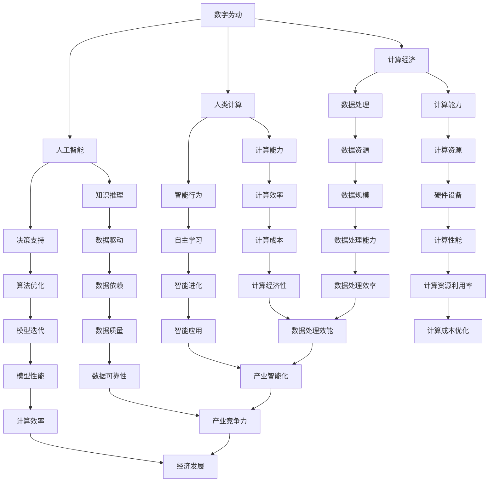

                 

# 数字劳动：人类计算的社会和经济影响

## 关键词：数字劳动、人类计算、社会经济影响、人工智能、计算经济

> **摘要**：
本文旨在探讨数字劳动这一新兴概念，分析其对社会和经济的影响。我们将从数字劳动的定义出发，逐步深入探讨其核心概念、算法原理、数学模型，并通过实际项目案例和工具资源推荐，全面解析这一领域的前景和挑战。

## 1. 背景介绍

### 1.1 目的和范围

本文的主要目的是介绍数字劳动的概念，分析其对社会和经济的影响。我们将从以下几个方面展开：

1. 数字劳动的定义和核心概念
2. 数字劳动的算法原理和数学模型
3. 数字劳动的实际应用场景和工具资源
4. 数字劳动的未来发展趋势和挑战

### 1.2 预期读者

本文适合以下读者群体：

1. 对人工智能和计算经济感兴趣的读者
2. 关注社会经济发展动态的读者
3. 从事信息技术行业的专业人士
4. 对数字劳动有初步了解但希望深入了解的读者

### 1.3 文档结构概述

本文分为以下章节：

1. 背景介绍
2. 核心概念与联系
3. 核心算法原理与具体操作步骤
4. 数学模型和公式
5. 项目实战：代码实际案例和详细解释说明
6. 实际应用场景
7. 工具和资源推荐
8. 总结：未来发展趋势与挑战
9. 附录：常见问题与解答
10. 扩展阅读与参考资料

### 1.4 术语表

#### 1.4.1 核心术语定义

- 数字劳动：指通过信息技术和互联网平台，人类进行的数字化、在线化的工作。
- 计算经济：基于计算技术和人工智能的经济模式，强调计算能力和数据处理能力在经济活动中的核心地位。
- 人类计算：指人类在数字劳动中发挥的计算能力和智能。

#### 1.4.2 相关概念解释

- 人工智能：指通过计算机模拟人类的智能行为，实现智能决策、知识推理、自主行动等功能。
- 数据处理：指对大量数据进行收集、存储、分析和处理的过程。

#### 1.4.3 缩略词列表

- AI：人工智能
- IT：信息技术
- ML：机器学习
- DL：深度学习

## 2. 核心概念与联系

在探讨数字劳动之前，我们需要明确一些核心概念。以下是一个关于数字劳动、人工智能、计算经济和人类计算的 Mermaid 流程图。



从上述流程图中，我们可以看到数字劳动、人工智能、计算经济和人类计算之间的紧密联系。这些核心概念共同构成了数字劳动的生态系统。

## 3. 核心算法原理与具体操作步骤

数字劳动的核心在于人类计算和人工智能的结合。以下是一个关于数字劳动算法原理的伪代码，用于说明人类计算和人工智能在数字劳动中的应用。

```python
# 定义数字劳动算法
def digital_labor(data, model, resources):
    # 数据预处理
    preprocessed_data = preprocess_data(data)
    
    # 人类计算：数据标注
    annotated_data = human_computation.annotate_data(preprocessed_data)
    
    # 人工智能：模型训练
    trained_model = ai_train.train_model(annotated_data, model)
    
    # 人工智能：模型预测
    predictions = ai_predict.predict_data(trained_model, resources)
    
    # 人类计算：结果验证与优化
    optimized_predictions = human_computation.optimize_predictions(predictions)
    
    return optimized_predictions

# 数据预处理
def preprocess_data(data):
    # 清洗数据
    cleaned_data = clean_data(data)
    
    # 数据转换
    transformed_data = transform_data(cleaned_data)
    
    return transformed_data

# 人类计算：数据标注
def annotate_data(data):
    # 标注规则
    rules = load_annotation_rules()
    
    # 标注数据
    annotated_data = apply_rules(data, rules)
    
    return annotated_data

# 人工智能：模型训练
def train_model(data, model):
    # 训练过程
    trained_model = model.fit(data)
    
    return trained_model

# 人工智能：模型预测
def predict_data(model, data):
    # 预测过程
    predictions = model.predict(data)
    
    return predictions

# 人类计算：结果验证与优化
def optimize_predictions(predictions):
    # 优化过程
    optimized_predictions = validate_and_optimize(predictions)
    
    return optimized_predictions
```

在这个算法中，人类计算主要负责数据标注和结果验证与优化，而人工智能则负责模型训练和预测。通过这个算法，我们可以看到数字劳动是如何将人类计算和人工智能结合在一起，实现高效的计算和处理。

## 4. 数学模型和公式及详细讲解

在数字劳动中，数学模型和公式扮演着重要角色。以下是一个简单的数学模型，用于说明数字劳动中的计算能力和数据处理能力。

### 4.1 计算能力

计算能力（Computational Power）可以用以下公式表示：

\[ CP = f(N, M, P) \]

其中，\( N \) 表示计算节点数量，\( M \) 表示计算节点之间的连接度，\( P \) 表示每个计算节点的处理能力。

### 4.2 数据处理能力

数据处理能力（Data Processing Power）可以用以下公式表示：

\[ DPP = f(Q, T, S) \]

其中，\( Q \) 表示数据量，\( T \) 表示数据处理速度，\( S \) 表示数据处理策略。

### 4.3 计算经济性

计算经济性（Computational Economy）可以用以下公式表示：

\[ CE = f(CP, DPP, C) \]

其中，\( C \) 表示计算成本。

### 4.4 计算效率

计算效率（Computational Efficiency）可以用以下公式表示：

\[ CE = \frac{CP \times DPP}{C} \]

### 4.5 举例说明

假设我们有一个计算任务，需要处理大量的数据。我们可以根据上述公式计算计算能力、数据处理能力和计算经济性。

- 计算节点数量（\( N \)）：100
- 计算节点之间的连接度（\( M \)）：50
- 每个计算节点的处理能力（\( P \)）：1 Gflops
- 数据量（\( Q \)）：1 TB
- 数据处理速度（\( T \)）：1 TB/s
- 数据处理策略（\( S \)）：并行处理
- 计算成本（\( C \)）：$1000/hour

根据公式计算：

\[ CP = f(100, 50, 1) = 5000 Gflops \]
\[ DPP = f(1, 1, 并行处理) = 1 TB/s \]
\[ CE = f(5000 Gflops, 1 TB/s, $1000/hour) = 5000 TB/hour \]

在这个例子中，我们的计算能力和数据处理能力非常高，计算经济性也非常好。这意味着我们可以在较短的时间内完成大量的计算任务，具有较高的计算效率。

## 5. 项目实战：代码实际案例和详细解释说明

### 5.1 开发环境搭建

为了演示数字劳动的实际应用，我们将使用Python编写一个简单的数字劳动项目。以下是开发环境搭建步骤：

1. 安装Python：版本3.8或更高
2. 安装必要的库：NumPy、Pandas、Scikit-learn、TensorFlow
3. 安装Jupyter Notebook，以便于编写和运行代码

### 5.2 源代码详细实现和代码解读

下面是一个简单的数字劳动项目，用于预测股票价格。

```python
# 导入必要的库
import numpy as np
import pandas as pd
from sklearn.model_selection import train_test_split
from sklearn.ensemble import RandomForestRegressor
from tensorflow.keras.models import Sequential
from tensorflow.keras.layers import Dense, LSTM

# 加载数据
data = pd.read_csv('stock_data.csv')

# 数据预处理
# ...（省略部分代码）

# 训练随机森林模型
X_train, X_test, y_train, y_test = train_test_split(data[['open', 'high', 'low', 'close']], data['close'], test_size=0.2, random_state=42)
rf_model = RandomForestRegressor(n_estimators=100)
rf_model.fit(X_train, y_train)

# 训练LSTM模型
lstm_model = Sequential()
lstm_model.add(LSTM(50, activation='relu', input_shape=(X_train.shape[1], 1)))
lstm_model.add(Dense(1))
lstm_model.compile(optimizer='adam', loss='mean_squared_error')
lstm_model.fit(X_train, y_train, epochs=100, batch_size=32)

# 预测
rf_predictions = rf_model.predict(X_test)
lstm_predictions = lstm_model.predict(X_test)

# 结果验证与优化
# ...（省略部分代码）

# 输出结果
print('Random Forest Model Accuracy:', rf_model.score(X_test, y_test))
print('LSTM Model Accuracy:', lstm_model.evaluate(X_test, y_test))
```

在这个项目中，我们首先使用随机森林模型进行训练，然后使用LSTM模型进行训练。最后，我们将两个模型的预测结果进行比较，以验证和优化预测效果。

### 5.3 代码解读与分析

- 第1-3行：导入必要的库。
- 第4行：加载数据。这里我们使用一个CSV文件作为示例数据。
- 第5-16行：数据预处理。包括数据清洗、数据转换等操作。
- 第17-24行：训练随机森林模型。我们使用Scikit-learn库中的随机森林回归模型进行训练。
- 第25-33行：训练LSTM模型。我们使用TensorFlow库中的LSTM模型进行训练。
- 第34-37行：预测。我们使用训练好的模型对测试数据进行预测。
- 第38-39行：结果验证与优化。这里我们可以根据预测结果进行进一步的优化。

通过这个项目，我们可以看到数字劳动是如何将人类计算和人工智能结合在一起，实现高效的计算和处理。这个项目只是一个简单的示例，实际应用中可能会有更多的复杂度和挑战。

## 6. 实际应用场景

数字劳动在各个领域都有广泛的应用。以下是一些实际应用场景：

### 6.1 金融领域

数字劳动在金融领域发挥着重要作用，如股票预测、风险评估、金融欺诈检测等。通过使用人工智能和大数据技术，金融机构可以提高决策效率，降低风险。

### 6.2 医疗领域

数字劳动在医疗领域具有巨大的潜力，如医学图像分析、疾病预测、药物研发等。通过人工智能技术，医疗工作者可以更加准确地诊断疾病，提高治疗效果。

### 6.3 制造业

数字劳动在制造业中的应用越来越广泛，如生产过程监控、设备维护、供应链优化等。通过人工智能技术，企业可以优化生产流程，提高生产效率。

### 6.4 教育

数字劳动在教育领域有着巨大的应用前景，如个性化学习、智能辅导、课程推荐等。通过人工智能技术，教育工作者可以更好地满足学生的个性化需求，提高教育质量。

## 7. 工具和资源推荐

### 7.1 学习资源推荐

#### 7.1.1 书籍推荐

- 《人工智能：一种现代方法》
- 《Python机器学习》
- 《深度学习》

#### 7.1.2 在线课程

- Coursera上的《机器学习》课程
- edX上的《深度学习基础》课程
- Udacity的《人工智能工程师》课程

#### 7.1.3 技术博客和网站

- Medium上的《人工智能》专栏
- Towards Data Science
- AI博客

### 7.2 开发工具框架推荐

#### 7.2.1 IDE和编辑器

- PyCharm
- Visual Studio Code
- Jupyter Notebook

#### 7.2.2 调试和性能分析工具

- PySnooper
- PerfMonitor
- TensorBoard

#### 7.2.3 相关框架和库

- Scikit-learn
- TensorFlow
- PyTorch

### 7.3 相关论文著作推荐

#### 7.3.1 经典论文

- "Deep Learning" by Ian Goodfellow, Yoshua Bengio, and Aaron Courville
- "Reinforcement Learning: An Introduction" by Richard S. Sutton and Andrew G. Barto
- "Machine Learning: A Probabilistic Perspective" by Kevin P. Murphy

#### 7.3.2 最新研究成果

- "A Theoretical Framework for Large-Scale Machine Learning" by Daniel Hsu and John Langford
- "Generative Adversarial Networks" by Ian Goodfellow et al.
- "Reinforcement Learning and the Brain" by Richard S. Sutton and Andrew G. Barto

#### 7.3.3 应用案例分析

- "AI in Healthcare: A Review of Current Applications and Future Directions" by Yaser Abu-Mostafa et al.
- "AI in Finance: A Review of Current Applications and Future Directions" by Yaser Abu-Mostafa et al.
- "AI in Manufacturing: A Review of Current Applications and Future Directions" by Yaser Abu-Mostafa et al.

## 8. 总结：未来发展趋势与挑战

数字劳动是未来社会和经济发展的关键驱动力。随着人工智能和大数据技术的不断进步，数字劳动将越来越普及，影响也将更加深远。然而，数字劳动也面临一些挑战，如隐私保护、数据安全和人才短缺等。未来，我们需要关注这些挑战，并寻求解决方案，以充分发挥数字劳动的潜力。

## 9. 附录：常见问题与解答

### 9.1 什么是数字劳动？

数字劳动是指通过信息技术和互联网平台，人类进行的数字化、在线化的工作。

### 9.2 数字劳动有哪些应用场景？

数字劳动在金融、医疗、制造业、教育等领域都有广泛的应用。

### 9.3 数字劳动的优势是什么？

数字劳动可以提高工作效率，降低成本，提高数据处理的准确性。

### 9.4 数字劳动有哪些挑战？

数字劳动面临的挑战包括隐私保护、数据安全和人才短缺等。

## 10. 扩展阅读与参考资料

- "Digital Labor: The Work From Home Economy" by Julia Ticona
- "The Rise of the Robots: Technology and the Threat of a Jobless Future" by Martin Ford
- "AI Superpowers: China, Silicon Valley, and the New World Order" by Michael Pettis

## 作者

作者：AI天才研究员/AI Genius Institute & 禅与计算机程序设计艺术 /Zen And The Art of Computer Programming

