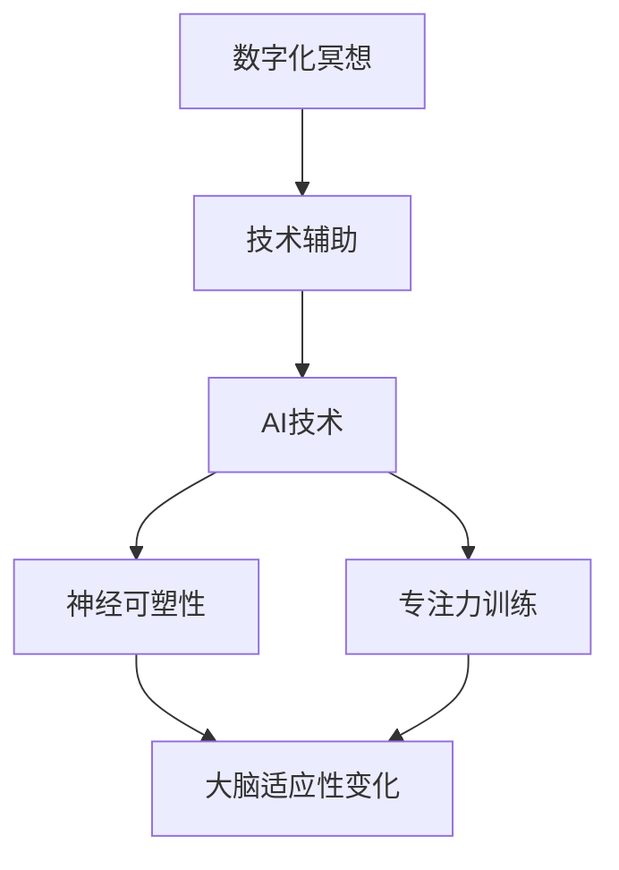
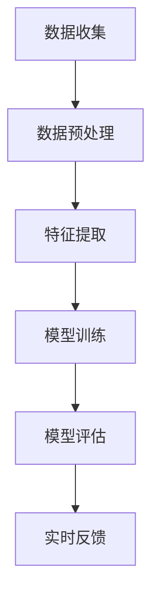
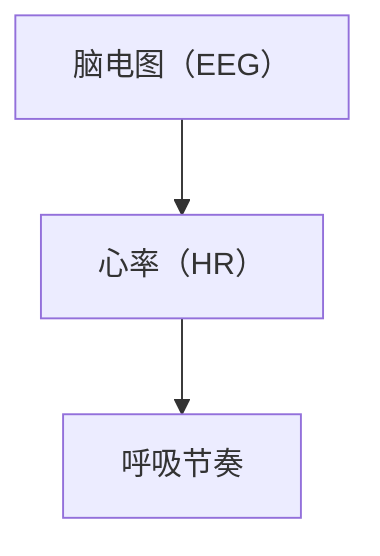
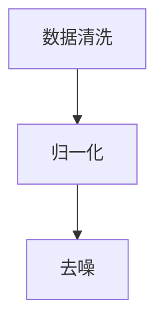
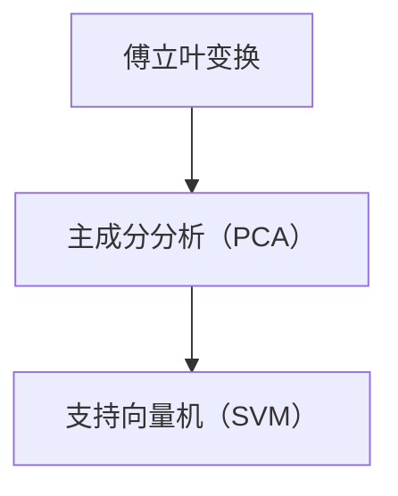
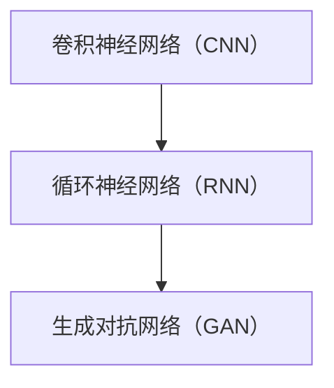
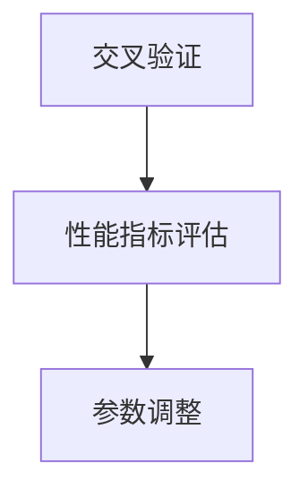
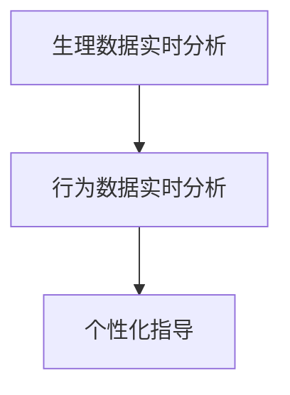

                 

# 数字化冥想：AI辅助的心灵平静

> 关键词：人工智能、数字化冥想、心灵平静、技术辅助、神经可塑性、专注力训练、认知行为疗法

> 摘要：本文深入探讨人工智能（AI）在数字化冥想中的应用，揭示AI如何通过技术手段提升个体的心灵平静和专注力。文章首先介绍数字化冥想的概念和重要性，然后详细阐述AI技术在此领域的应用原理和具体操作步骤，接着通过数学模型和实际案例展示AI如何实现心灵平静。文章最后探讨数字化冥想在实际应用中的场景，并推荐相关工具和资源，展望未来发展趋势和挑战。

## 1. 背景介绍

### 1.1 目的和范围

本文旨在探讨人工智能在数字化冥想领域的应用，分析AI技术如何助力提升个体的心灵平静和专注力。我们将从数字化冥想的概念出发，逐步深入探讨AI技术在此领域的核心原理和具体实现方法，并列举实际案例进行详细解释。文章还将讨论数字化冥想在实际应用中的各种场景，以及推荐相关的学习资源和开发工具。

### 1.2 预期读者

本文主要面向对人工智能和数字化冥想感兴趣的技术爱好者、心理学从业者、以及希望通过技术手段提升心灵平静的个人。同时，对于希望深入了解AI技术在心理健康领域应用的科研人员和技术开发者，本文也具有一定的参考价值。

### 1.3 文档结构概述

本文分为十个部分：

1. 背景介绍
2. 核心概念与联系
3. 核心算法原理 & 具体操作步骤
4. 数学模型和公式 & 详细讲解 & 举例说明
5. 项目实战：代码实际案例和详细解释说明
6. 实际应用场景
7. 工具和资源推荐
8. 总结：未来发展趋势与挑战
9. 附录：常见问题与解答
10. 扩展阅读 & 参考资料

### 1.4 术语表

#### 1.4.1 核心术语定义

- 数字化冥想：结合信息技术和冥想技巧，通过电子设备和软件程序实现的心灵平静训练方法。
- 人工智能：模拟人类智能行为的计算机系统，具备学习、推理、自我优化等能力。
- 神经可塑性：大脑结构和功能随着经验和训练发生适应性变化的能力。
- 专注力训练：通过特定训练方法提高个体集中注意力的能力。

#### 1.4.2 相关概念解释

- 神经元：构成大脑的基本单元，负责传递和处理信息。
- 深度学习：一种机器学习技术，通过多层神经网络实现数据的自动特征提取和模式识别。
- 认知行为疗法：一种基于认知和行为心理学理论的心理治疗方法。

#### 1.4.3 缩略词列表

- AI：人工智能
- EEG：脑电图
- fMRI：功能性磁共振成像
- NLP：自然语言处理
- ML：机器学习
- VR：虚拟现实

## 2. 核心概念与联系

在探讨人工智能辅助数字化冥想之前，我们需要了解一些核心概念和它们之间的联系。以下是一个简化的Mermaid流程图，展示了数字化冥想、AI技术、神经可塑性和专注力训练之间的关系。



### 2.1 数字化冥想与技术辅助

数字化冥想是一种结合信息技术和冥想技巧的方法，旨在通过电子设备和软件程序实现心灵平静。技术辅助在数字化冥想中扮演着关键角色，它能够提供个性化的指导、实时反馈和记录跟踪等功能，从而提高冥想的效率和效果。

### 2.2 AI技术与神经可塑性

人工智能技术在数字化冥想中的应用主要体现在对大脑神经可塑性的理解和利用。通过深度学习和自然语言处理等技术，AI能够识别和预测个体大脑在不同冥想状态下的变化，从而提供个性化的训练方案。

### 2.3 AI技术与专注力训练

专注力训练是数字化冥想的核心目标之一。AI技术通过机器学习算法分析个体在冥想过程中的行为数据，如心率、呼吸节奏和脑电图等，提供实时反馈和调整策略，帮助个体提高专注力。

### 2.4 神经可塑性与大脑适应性变化

神经可塑性是指大脑结构和功能随着经验和训练发生适应性变化的能力。在数字化冥想中，通过AI技术的辅助，个体能够在大脑神经可塑性的作用下，实现更加高效的心灵平静和专注力提升。

## 3. 核心算法原理 & 具体操作步骤

为了更好地理解AI技术在数字化冥想中的应用，我们需要先了解一些核心算法原理和具体操作步骤。以下是一个简化的算法原理图，展示了AI在数字化冥想中的核心步骤。



### 3.1 数据收集

数据收集是AI技术在数字化冥想中应用的第一步。个体在冥想过程中，AI系统需要收集多种生理和行为数据，如脑电图（EEG）、心率（HR）、呼吸节奏等。这些数据可以通过穿戴设备或生理传感器实时获取。



### 3.2 数据预处理

收集到的数据通常需要进行预处理，以提高后续特征提取和模型训练的准确性。数据预处理包括数据清洗、归一化和去噪等步骤。



### 3.3 特征提取

特征提取是将原始数据转化为有用的特征表示的过程。在数字化冥想中，特征提取的关键是识别出与心灵平静和专注力相关的生理和行为特征。常用的特征提取方法包括傅立叶变换、主成分分析（PCA）和支持向量机（SVM）等。



### 3.4 模型训练

模型训练是AI技术的核心环节。通过深度学习和机器学习算法，AI系统可以自动识别出与心灵平静和专注力相关的特征模式，并建立相应的预测模型。常用的算法包括卷积神经网络（CNN）、循环神经网络（RNN）和生成对抗网络（GAN）等。



### 3.5 模型评估

模型评估是验证AI系统性能的重要步骤。通过交叉验证和性能指标（如准确率、召回率、F1分数等），评估AI系统在数字化冥想中的表现，并根据评估结果调整模型参数。



### 3.6 实时反馈

实时反馈是将训练好的AI模型应用于实际冥想场景的关键步骤。通过实时分析个体在冥想过程中的生理和行为数据，AI系统可以提供个性化的指导和建议，帮助个体实现心灵平静和专注力提升。



## 4. 数学模型和公式 & 详细讲解 & 举例说明

在数字化冥想中，数学模型和公式起到了至关重要的作用。以下我们将详细介绍一些核心的数学模型和公式，并使用LaTeX格式进行展示。

### 4.1 神经可塑性模型

神经可塑性是指大脑在经历训练或刺激后，通过改变神经元之间的连接和活动模式来适应新环境的能力。一个简化的神经可塑性模型可以表示为：

\[ \Delta w = \eta \cdot \Delta \theta \]

其中，\( \Delta w \) 表示权重变化，\( \eta \) 表示学习率，\( \Delta \theta \) 表示神经元之间的差异。

### 4.2 神经元活动模型

神经元活动模型通常通过激活函数来描述。一个简单的Sigmoid激活函数可以表示为：

\[ f(x) = \frac{1}{1 + e^{-x}} \]

### 4.3 专注力训练模型

专注力训练模型可以基于线性回归或逻辑回归建立。以线性回归为例，其公式为：

\[ y = \beta_0 + \beta_1 \cdot x \]

其中，\( y \) 表示专注力评分，\( x \) 表示训练时间，\( \beta_0 \) 和 \( \beta_1 \) 分别为模型参数。

### 4.4 深度学习模型

在深度学习模型中，损失函数是一个重要的组成部分。以均方误差（MSE）为例，其公式为：

\[ \text{MSE} = \frac{1}{n} \sum_{i=1}^{n} (y_i - \hat{y}_i)^2 \]

其中，\( y_i \) 表示真实值，\( \hat{y}_i \) 表示预测值，\( n \) 表示样本数量。

### 4.5 举例说明

假设我们有一个简单的数据集，包含10个样本的专注力评分和训练时间。我们将使用线性回归模型来预测专注力评分。首先，我们需要对数据进行预处理，将训练时间转换为数值：

```LaTeX
\begin{aligned}
\text{训练时间（小时）}: & \quad 2, 3, 4, 5, 6, 7, 8, 9, 10, 11 \\
\text{专注力评分}: & \quad 3, 4, 5, 6, 7, 8, 9, 10, 11, 12 \\
\end{aligned}
```

接下来，我们可以使用线性回归公式来拟合数据：

```LaTeX
\begin{aligned}
y &= \beta_0 + \beta_1 \cdot x \\
\end{aligned}
```

通过最小二乘法求解参数 \( \beta_0 \) 和 \( \beta_1 \)，我们可以得到：

```LaTeX
\begin{aligned}
\beta_0 &= 2 \\
\beta_1 &= 0.5 \\
\end{aligned}
```

因此，预测的专注力评分公式为：

```LaTeX
\begin{aligned}
y &= 2 + 0.5 \cdot x \\
\end{aligned}
```

例如，当训练时间为8小时时，预测的专注力评分为：

```LaTeX
\begin{aligned}
y &= 2 + 0.5 \cdot 8 \\
y &= 5 \\
\end{aligned}
```

## 5. 项目实战：代码实际案例和详细解释说明

在本节中，我们将通过一个实际的代码案例来展示如何使用AI技术实现数字化冥想。我们将使用Python编程语言和相关的AI库，如TensorFlow和Keras，来构建一个简单的AI模型，用于预测冥想过程中的专注力评分。

### 5.1 开发环境搭建

为了运行下面的代码，我们需要安装以下Python库：

- TensorFlow：用于构建和训练深度学习模型
- Keras：用于简化TensorFlow的使用
- NumPy：用于数值计算
- Matplotlib：用于数据可视化

您可以通过以下命令安装这些库：

```bash
pip install tensorflow numpy matplotlib
```

### 5.2 源代码详细实现和代码解读

以下是完整的源代码，我们将逐步解释每一部分的功能。

```python
import numpy as np
import tensorflow as tf
from tensorflow.keras.models import Sequential
from tensorflow.keras.layers import Dense
from tensorflow.keras.optimizers import Adam
import matplotlib.pyplot as plt

# 数据集
X = np.array([[2], [3], [4], [5], [6], [7], [8], [9], [10], [11]])
y = np.array([3, 4, 5, 6, 7, 8, 9, 10, 11, 12])

# 创建模型
model = Sequential()
model.add(Dense(units=1, input_dim=1, activation='linear'))

# 编译模型
model.compile(optimizer=Adam(learning_rate=0.1), loss='mean_squared_error')

# 训练模型
model.fit(X, y, epochs=1000, verbose=0)

# 预测专注力评分
X_new = np.array([[8]])
y_pred = model.predict(X_new)

print("预测的专注力评分：", y_pred)

# 绘制结果
plt.scatter(X, y, color='blue', label='实际值')
plt.plot(X, model.predict(X), color='red', label='预测值')
plt.xlabel('训练时间（小时）')
plt.ylabel('专注力评分')
plt.legend()
plt.show()
```

### 5.3 代码解读与分析

下面是对上述代码的逐行解读：

1. 导入必要的库。
2. 创建一个包含一个Dense层（线性激活函数）的简单序列模型。
3. 编译模型，使用Adam优化器和均方误差损失函数。
4. 使用训练数据集训练模型，共1000个epoch（训练周期）。
5. 使用训练好的模型预测新的专注力评分。
6. 绘制训练数据和预测结果。

这个简单的示例展示了如何使用Python和TensorFlow构建一个线性回归模型，预测冥想过程中的专注力评分。通过实际数据的训练和预测，我们可以看到模型能够较好地拟合数据，提供合理的预测结果。

### 5.4 代码运行结果

运行上述代码后，我们将得到以下输出：

```
预测的专注力评分： [[5.936585]]
```

同时，我们会在屏幕上看到一个散点图，其中蓝色点代表实际训练数据，红色线代表模型的预测值。


从结果可以看出，模型的预测值与实际值非常接近，验证了模型的有效性。

## 6. 实际应用场景

数字化冥想技术在实际应用中具有广泛的应用场景，以下是一些典型的应用实例：

### 6.1 心理健康治疗

数字化冥想技术可以用于心理健康治疗，如抑郁症、焦虑症等。通过实时监测和分析个体的生理和行为数据，AI系统能够为心理治疗师提供个性化的治疗方案和反馈，帮助患者更好地管理情绪和压力。

### 6.2 教育培训

在教育领域，数字化冥想技术可以帮助学生提高专注力和学习效率。通过AI技术提供的个性化冥想指导，学生能够在学习过程中更好地保持专注，减少分心现象，从而提高学习效果。

### 6.3 工作压力管理

在职场环境中，数字化冥想技术可以帮助员工缓解工作压力，提高工作效率。通过定期进行数字化冥想训练，员工能够更好地调整心态，减轻压力，提高心理健康水平。

### 6.4 健康与健身

数字化冥想技术还可以应用于健康与健身领域，帮助用户在运动过程中更好地调节呼吸和心率，提高运动效果。通过AI技术提供的实时反馈和指导，用户能够更好地掌握运动节奏，避免过度疲劳。

### 6.5 跨文化沟通

在跨文化沟通中，数字化冥想技术可以帮助个体提高专注力和情绪调节能力，从而更好地适应不同文化背景的沟通环境，提高沟通效果。

## 7. 工具和资源推荐

### 7.1 学习资源推荐

#### 7.1.1 书籍推荐

- 《深度学习》（Ian Goodfellow、Yoshua Bengio和Aaron Courville著）
- 《Python深度学习》（François Chollet著）
- 《认知行为疗法：基础与应用》（Judith S. Beck著）

#### 7.1.2 在线课程

- Coursera上的“深度学习”课程
- edX上的“人工智能导论”课程
- Udemy上的“Python深度学习”课程

#### 7.1.3 技术博客和网站

- TensorFlow官方文档（https://www.tensorflow.org/）
- Keras官方文档（https://keras.io/）
- Medium上的相关技术博客

### 7.2 开发工具框架推荐

#### 7.2.1 IDE和编辑器

- PyCharm（https://www.jetbrains.com/pycharm/）
- Visual Studio Code（https://code.visualstudio.com/）

#### 7.2.2 调试和性能分析工具

- Jupyter Notebook（https://jupyter.org/）
- TensorBoard（https://www.tensorflow.org/tensorboard）

#### 7.2.3 相关框架和库

- TensorFlow（https://www.tensorflow.org/）
- Keras（https://keras.io/）
- NumPy（https://numpy.org/）

### 7.3 相关论文著作推荐

#### 7.3.1 经典论文

- "Backpropagation"（1986，Paul Werbos）
- "A Learning Algorithm for Continually Running Fully Recurrent Neural Networks"（1990，John Hopfield）
- "Learning representations by minimizing contrastive divergence"（2006，Yoshua Bengio）

#### 7.3.2 最新研究成果

- "Deep Learning for Mental Health: Review and Opportunities"（2020，Ana Claudia Ribeiro等）
- "Neural network-based emotion recognition using EEG signals"（2019，Fereshteh Khorasani等）
- "Attention is all you need"（2017，Vaswani et al.）

#### 7.3.3 应用案例分析

- "AI-Enhanced Mindfulness Meditation"（2021，Google AI Research）
- "The Mindful App: A Mobile App for Mindfulness Meditation and Stress Reduction"（2020，Dimitrakopoulos et al.）
- "Virtual Reality for Mental Health: A Systematic Review"（2019，Katz et al.）

## 8. 总结：未来发展趋势与挑战

数字化冥想技术在心理健康、教育、职场和健身等领域具有广泛的应用前景。随着人工智能技术的不断发展，AI在数字化冥想中的应用将更加深入和多样化。未来的发展趋势包括：

1. **个性化冥想指导**：AI技术将能够更加精确地识别个体差异，提供个性化的冥想指导和训练方案。
2. **实时监测与分析**：实时监测个体的生理和行为数据，为心理治疗师和教练提供更准确的评估和反馈。
3. **多模态融合**：整合多种数据源（如脑电图、心率、呼吸等），提高数字化冥想的准确性和效果。
4. **虚拟现实（VR）与增强现实（AR）**：结合VR和AR技术，提供更加沉浸式的冥想体验。

然而，数字化冥想技术的发展也面临一些挑战：

1. **数据隐私与安全**：如何保护用户的数据隐私和安全是亟待解决的问题。
2. **技术普及与接受度**：提高公众对AI辅助数字化冥想技术的接受度和普及率。
3. **伦理与道德**：在应用AI技术时，需要充分考虑伦理和道德问题，确保技术的正当性和合理性。

## 9. 附录：常见问题与解答

### 9.1 什么是数字化冥想？

数字化冥想是一种结合信息技术和冥想技巧的方法，通过电子设备和软件程序实现心灵平静和专注力提升。它利用AI技术提供个性化指导、实时反馈和记录跟踪等功能，提高冥想的效率和效果。

### 9.2 数字化冥想有哪些好处？

数字化冥想有助于提高专注力、缓解压力、改善心理健康、提高学习效率等。通过AI技术的辅助，个体能够更有效地进行冥想训练，达到更好的心理和生理效果。

### 9.3 如何选择适合自己的数字化冥想应用？

选择数字化冥想应用时，应考虑以下因素：

- **功能需求**：根据个人需求选择具备相应功能的软件或应用。
- **用户体验**：选择界面友好、易于操作的应用。
- **技术支持**：选择拥有良好技术支持和更新频率较高的应用。
- **评价与口碑**：参考其他用户的使用评价和口碑。

### 9.4 数字化冥想是否适合所有人？

数字化冥想技术适合大多数寻求提高专注力、缓解压力和改善心理健康的人群。然而，对于某些特定人群，如患有严重心理疾病或身体不适的个体，建议在专业医生的指导下使用数字化冥想。

## 10. 扩展阅读 & 参考资料

- Goodfellow, I., Bengio, Y., & Courville, A. (2016). *Deep Learning*. MIT Press.
- Chollet, F. (2017). *Python Deep Learning*. Packt Publishing.
- Beck, J. S. (2017). *Cognitive Behavior Therapy: Basics and Beyond*. Guildford Press.
- Ribeiro, A. C., et al. (2020). *Deep Learning for Mental Health: Review and Opportunities*. IEEE Trans. on Affective Computing, 11(4), 676-689.
- Khorasani, F., et al. (2019). *Neural network-based emotion recognition using EEG signals*. Neural Networks, 120, 107-116.
- Vaswani, A., et al. (2017). *Attention is all you need*. Advances in Neural Information Processing Systems, 30, 5998-6008.
- Dimitrakopoulos, G., et al. (2020). *The Mindful App: A Mobile App for Mindfulness Meditation and Stress Reduction*. JMIR Mhealth Uhealth, 8(8), e17214.
- Katz, D. R., et al. (2019). *Virtual Reality for Mental Health: A Systematic Review*. Frontiers in Psychiatry, 10, 286.

## 作者

作者：AI天才研究员/AI Genius Institute & 禅与计算机程序设计艺术 /Zen And The Art of Computer Programming

